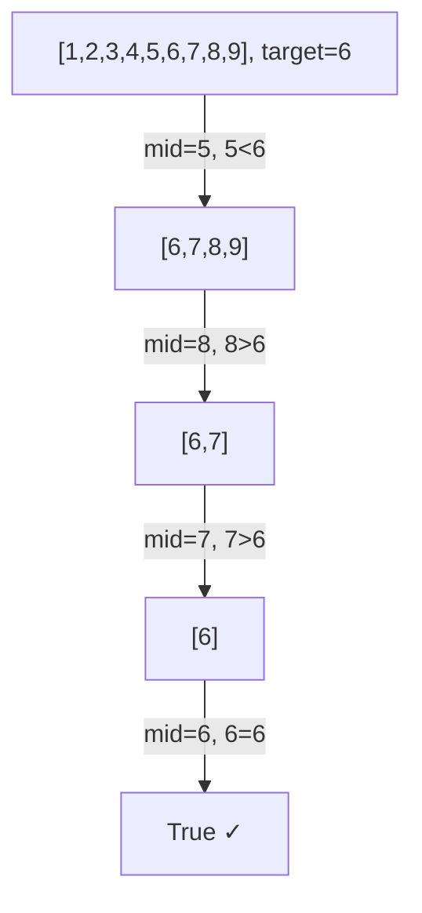
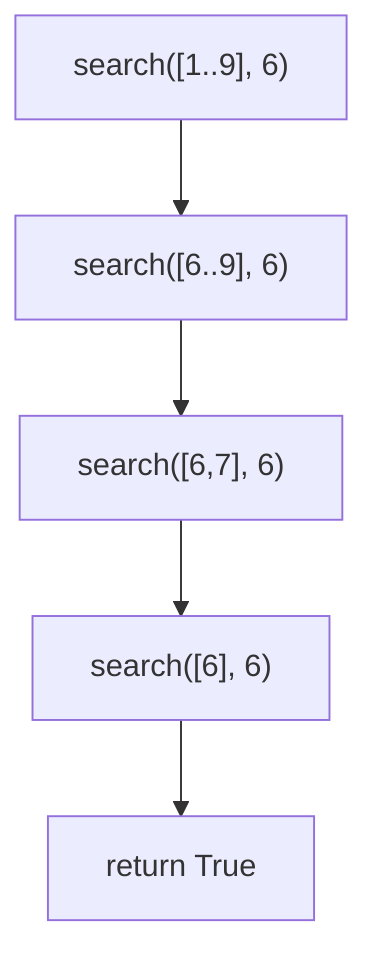

# Simple Binary Search

## Overview

| Property | Value |
|----------|-------|
| **Category** | Divide and Conquer Search |
| **Complexity (Time)** | O(log n) |
| **Complexity (Space)** | O(log n) recursive stack |
| **Input** | Sorted array |
| **Output** | Boolean (found/not found) |

## Description

Simple Binary Search is a basic recursive implementation of binary search that returns a boolean indicating whether the target element exists in the sorted array. Unlike more complex implementations that return indices, this variant focuses on existence checking.

The algorithm recursively divides the array in half, comparing the middle element with the target and searching the appropriate half.

## Mathematical Foundation

### Recurrence Relation

For array of size $n$:

$$T(n) = T\left(\frac{n}{2}\right) + O(1)$$

By Master Theorem (Case 2): $T(n) = O(\log n)$

### Search Space Reduction

After $k$ iterations, remaining elements:

$$n_k = \frac{n}{2^k}$$

Search terminates when $n_k \leq 1$:
$$k = \lceil \log_2 n \rceil$$

### Correctness Invariant

**Loop Invariant:** If target exists, it is in the current search range $[low, high]$.

- **Initialization:** Range is entire array
- **Maintenance:** Target comparison determines which half contains element
- **Termination:** Range shrinks to single element or empty

## Algorithm

### Pseudocode

```
SIMPLE-BINARY-SEARCH(array, target):
    return RECURSIVE-SEARCH(array, target)

RECURSIVE-SEARCH(array, target):
    if array is empty:
        return False
    
    midpoint ← |array| / 2
    
    if array[midpoint] = target:
        return True
    
    if array[midpoint] > target:
        // Search left half
        return RECURSIVE-SEARCH(array[0..midpoint-1], target)
    else:
        // Search right half
        return RECURSIVE-SEARCH(array[midpoint+1..|array|-1], target)
```

### Step-by-Step Execution

```
Array: [1, 2, 3, 4, 5, 6, 7, 8, 9]
Target: 6

Call 1: RECURSIVE-SEARCH([1,2,3,4,5,6,7,8,9], 6)
  midpoint = 4 (index), array[4] = 5
  5 < 6 → search right half
  
Call 2: RECURSIVE-SEARCH([6,7,8,9], 6)
  midpoint = 2, array[2] = 8
  8 > 6 → search left half
  
Call 3: RECURSIVE-SEARCH([6,7], 6)
  midpoint = 1, array[1] = 7
  7 > 6 → search left half
  
Call 4: RECURSIVE-SEARCH([6], 6)
  midpoint = 0, array[0] = 6
  6 = 6 → return True

Result: True (found)
```

### Not Found Example

```
Array: [1, 2, 3, 4, 5, 6, 7, 8, 9]
Target: 10

Call 1: midpoint=4, 5 < 10 → right
Call 2: [6,7,8,9], midpoint=2, 8 < 10 → right
Call 3: [9], midpoint=0, 9 < 10 → right
Call 4: [], empty → return False

Result: False (not found)
```

## Complexity Analysis

### Time Complexity

| Case | Complexity | Scenario |
|------|------------|----------|
| Best | O(1) | Target at midpoint |
| Average | O(log n) | Random target |
| Worst | O(log n) | Target at extremes |

### Space Complexity

| Component | Space |
|-----------|-------|
| Recursion stack | O(log n) |
| Array slicing (Python) | O(n) per level |
| Total (with slicing) | O(n log n) |
| Total (index-based) | O(log n) |

**Note:** Python array slicing creates copies. Index-based implementation avoids this.

## Visual Representation



### Recursion Tree



## Implementation

### Python Implementation (Original)

```python
def simple_binary_search(a_list: list[int], item: int) -> bool:
    """
    Search for item in sorted list using binary search.
    
    Args:
        a_list: Sorted list of integers
        item: Target item to find
    
    Returns:
        True if item found, False otherwise
    
    Examples:
        >>> simple_binary_search([1, 2, 3, 4, 5], 3)
        True
        >>> simple_binary_search([1, 2, 3, 4, 5], 6)
        False
        >>> simple_binary_search([], 1)
        False
        >>> simple_binary_search([5], 5)
        True
        >>> simple_binary_search([1, 2], 1)
        True
    """
    if len(a_list) == 0:
        return False
    
    midpoint = len(a_list) // 2
    
    if a_list[midpoint] == item:
        return True
    
    if item < a_list[midpoint]:
        return simple_binary_search(a_list[:midpoint], item)
    else:
        return simple_binary_search(a_list[midpoint + 1:], item)
```

### Optimized Index-Based Implementation

```python
def simple_binary_search_optimized(
    a_list: list[int], 
    item: int,
    low: int = None,
    high: int = None
) -> bool:
    """
    Space-optimized binary search using indices.
    
    Args:
        a_list: Sorted list of integers
        item: Target to find
        low: Left boundary (inclusive)
        high: Right boundary (inclusive)
    
    Returns:
        True if found, False otherwise
    
    Examples:
        >>> simple_binary_search_optimized([1, 2, 3, 4, 5], 3)
        True
        >>> simple_binary_search_optimized([1, 2, 3, 4, 5], 6)
        False
    """
    if low is None:
        low = 0
    if high is None:
        high = len(a_list) - 1
    
    if low > high:
        return False
    
    mid = (low + high) // 2
    
    if a_list[mid] == item:
        return True
    elif item < a_list[mid]:
        return simple_binary_search_optimized(a_list, item, low, mid - 1)
    else:
        return simple_binary_search_optimized(a_list, item, mid + 1, high)
```

### Iterative Version

```python
def simple_binary_search_iterative(a_list: list[int], item: int) -> bool:
    """
    Iterative binary search with constant space.
    
    Examples:
        >>> simple_binary_search_iterative([1, 2, 3, 4, 5], 3)
        True
        >>> simple_binary_search_iterative([1, 2, 3, 4, 5], 0)
        False
    """
    low = 0
    high = len(a_list) - 1
    
    while low <= high:
        mid = (low + high) // 2
        
        if a_list[mid] == item:
            return True
        elif item < a_list[mid]:
            high = mid - 1
        else:
            low = mid + 1
    
    return False
```

### Generic Type Version

```python
from typing import TypeVar, Protocol

class Comparable(Protocol):
    def __lt__(self, other) -> bool: ...
    def __eq__(self, other) -> bool: ...

T = TypeVar('T', bound=Comparable)


def binary_search_generic(items: list[T], target: T) -> bool:
    """
    Generic binary search for any comparable type.
    
    Examples:
        >>> binary_search_generic(['apple', 'banana', 'cherry'], 'banana')
        True
        >>> binary_search_generic([1.1, 2.2, 3.3], 2.2)
        True
    """
    low, high = 0, len(items) - 1
    
    while low <= high:
        mid = (low + high) // 2
        
        if items[mid] == target:
            return True
        elif target < items[mid]:
            high = mid - 1
        else:
            low = mid + 1
    
    return False
```

## Real-World Applications

### 1. Membership Testing

```python
class SortedSet:
    """
    Set implementation with O(log n) membership test.
    """
    
    def __init__(self, initial: list[int] = None):
        self.elements = sorted(initial) if initial else []
    
    def __contains__(self, item: int) -> bool:
        """
        Check membership using binary search.
        
        >>> s = SortedSet([1, 3, 5, 7, 9])
        >>> 5 in s
        True
        >>> 4 in s
        False
        """
        return simple_binary_search(self.elements, item)
    
    def add(self, item: int) -> None:
        """Add item maintaining sorted order."""
        if item not in self:
            # Find insertion point
            pos = self._find_insert_position(item)
            self.elements.insert(pos, item)
    
    def _find_insert_position(self, item: int) -> int:
        """Find index where item should be inserted."""
        low, high = 0, len(self.elements)
        while low < high:
            mid = (low + high) // 2
            if self.elements[mid] < item:
                low = mid + 1
            else:
                high = mid
        return low
```

### 2. Dictionary Word Verification

```python
class SpellChecker:
    """
    Simple spell checker using sorted dictionary.
    """
    
    def __init__(self, dictionary_file: str):
        """Load dictionary from file."""
        with open(dictionary_file, 'r') as f:
            self.words = sorted(line.strip().lower() for line in f)
    
    def is_valid_word(self, word: str) -> bool:
        """
        Check if word exists in dictionary.
        
        Uses binary search for O(log n) lookup.
        """
        word = word.lower()
        return self._binary_search(word)
    
    def _binary_search(self, word: str) -> bool:
        """Binary search in sorted word list."""
        low, high = 0, len(self.words) - 1
        
        while low <= high:
            mid = (low + high) // 2
            
            if self.words[mid] == word:
                return True
            elif word < self.words[mid]:
                high = mid - 1
            else:
                low = mid + 1
        
        return False
    
    def check_text(self, text: str) -> list[str]:
        """Return list of misspelled words."""
        words = text.split()
        return [w for w in words if not self.is_valid_word(w)]
```

### 3. Configuration Value Lookup

```python
class ConfigManager:
    """
    Configuration manager with sorted keys.
    """
    
    def __init__(self):
        self._keys = []  # Sorted keys
        self._values = {}  # Key -> value mapping
    
    def set(self, key: str, value) -> None:
        """Set configuration value."""
        if key not in self._values:
            # Insert key in sorted order
            pos = self._find_position(key)
            self._keys.insert(pos, key)
        self._values[key] = value
    
    def has_key(self, key: str) -> bool:
        """
        Check if key exists using binary search.
        O(log n) complexity.
        """
        return self._binary_search_key(key)
    
    def _binary_search_key(self, key: str) -> bool:
        """Binary search for key."""
        low, high = 0, len(self._keys) - 1
        
        while low <= high:
            mid = (low + high) // 2
            
            if self._keys[mid] == key:
                return True
            elif key < self._keys[mid]:
                high = mid - 1
            else:
                low = mid + 1
        
        return False
    
    def _find_position(self, key: str) -> int:
        """Find insertion position for new key."""
        low, high = 0, len(self._keys)
        
        while low < high:
            mid = (low + high) // 2
            if self._keys[mid] < key:
                low = mid + 1
            else:
                high = mid
        return low
```

### 4. Game High Score Validation

```python
class LeaderboardVerifier:
    """
    Verify if a score qualifies for leaderboard.
    """
    
    def __init__(self, top_scores: list[int], max_entries: int = 100):
        """
        Initialize with current top scores (descending order).
        """
        self.scores = sorted(top_scores, reverse=True)[:max_entries]
        self.max_entries = max_entries
    
    def qualifies(self, score: int) -> bool:
        """
        Check if score qualifies for leaderboard.
        
        A score qualifies if:
        1. Leaderboard not full, or
        2. Score beats lowest entry
        
        Examples:
            >>> lb = LeaderboardVerifier([100, 90, 80, 70], max_entries=5)
            >>> lb.qualifies(85)
            True
            >>> lb.qualifies(65)
            True  # Not full yet
        """
        if len(self.scores) < self.max_entries:
            return True
        
        # Score must beat lowest (last in descending list)
        return score > self.scores[-1]
    
    def is_top_score(self, score: int) -> bool:
        """
        Check if this exact score exists in leaderboard.
        """
        # Search in descending list
        low, high = 0, len(self.scores) - 1
        
        while low <= high:
            mid = (low + high) // 2
            
            if self.scores[mid] == score:
                return True
            elif score > self.scores[mid]:
                high = mid - 1  # Higher scores are at lower indices
            else:
                low = mid + 1
        
        return False
```

## Comparison with Full Binary Search

| Aspect | Simple (Boolean) | Full (Index) |
|--------|------------------|--------------|
| Return | True/False | Index or -1 |
| Use case | Existence check | Find position |
| Implementation | Simpler | More complex |
| Information | Less | More |

## Common Pitfalls

### 1. Array Slicing Overhead

```python
# Bad: O(n) space per recursive call
def search_bad(arr, target):
    if not arr:
        return False
    mid = len(arr) // 2
    if arr[mid] == target:
        return True
    if target < arr[mid]:
        return search_bad(arr[:mid], target)  # Creates copy!
    return search_bad(arr[mid+1:], target)  # Creates copy!

# Good: O(1) space per call
def search_good(arr, target, low=0, high=None):
    if high is None:
        high = len(arr) - 1
    if low > high:
        return False
    mid = (low + high) // 2
    if arr[mid] == target:
        return True
    if target < arr[mid]:
        return search_good(arr, target, low, mid - 1)
    return search_good(arr, target, mid + 1, high)
```

### 2. Stack Overflow Risk

```python
# For very large arrays, use iterative version
def search_safe(arr, target):
    """Iterative to avoid stack overflow."""
    low, high = 0, len(arr) - 1
    while low <= high:
        mid = (low + high) // 2
        if arr[mid] == target:
            return True
        if target < arr[mid]:
            high = mid - 1
        else:
            low = mid + 1
    return False
```

## References

1. [Binary Search - Wikipedia](https://en.wikipedia.org/wiki/Binary_search_algorithm)
2. Cormen, T.H. "Introduction to Algorithms" - Chapter 2
3. Knuth, D.E. "The Art of Computer Programming, Vol. 3: Sorting and Searching"

## See Also

- [Binary Search](binary_search.md) - Full implementation with indices
- [Linear Search](linear_search.md) - O(n) sequential search
- [Interpolation Search](interpolation_search.md) - O(log log n) for uniform data
