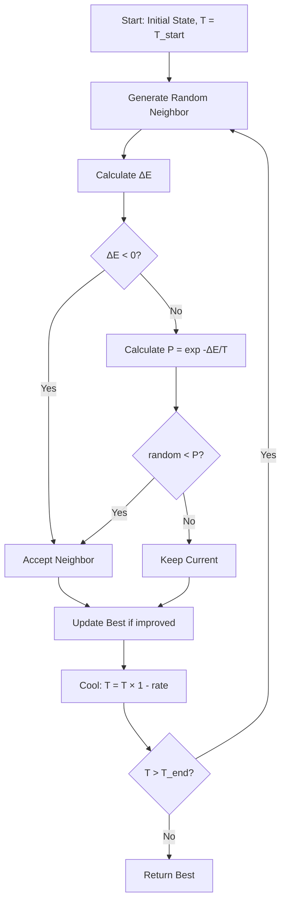
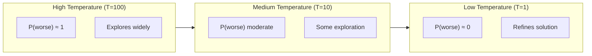

# Simulated Annealing

## Overview

| Property | Value |
|----------|-------|
| **Category** | Metaheuristic Optimization |
| **Complexity (Time)** | O(iterations × neighborhood) |
| **Complexity (Space)** | O(state_size) |
| **Type** | Probabilistic local search |
| **Guarantees** | Asymptotically optimal (theory) |

## Description

Simulated Annealing is a probabilistic optimization algorithm inspired by the annealing process in metallurgy. Unlike hill climbing, it can accept worse solutions with a probability that decreases over time (as the "temperature" cools), allowing it to escape local optima.

The algorithm mimics the physical process where heated metal atoms can move freely at high temperatures but gradually settle into a low-energy crystalline structure as the temperature decreases.

## Mathematical Foundation

### Boltzmann Distribution

The probability of accepting a worse solution is given by the Boltzmann factor:

$$P(\text{accept}) = e^{-\Delta E / T}$$

Where:
- $\Delta E = f(s') - f(s)$ is the change in objective value
- $T$ is the current temperature
- For minimization: accept if $\Delta E < 0$ or with probability $e^{-\Delta E / T}$

### Temperature Schedule

Common cooling schedules:

**Geometric (Exponential):**
$$T_{n+1} = \alpha \cdot T_n, \quad 0 < \alpha < 1$$

**Linear:**
$$T_n = T_0 - \beta \cdot n$$

**Logarithmic:**
$$T_n = \frac{T_0}{\ln(1 + n)}$$

### Convergence Guarantee

**Theorem (Hajek, 1988):** Simulated annealing converges to the global optimum with probability 1 if:
$$\sum_{n=1}^{\infty} e^{-\Delta / T_n} = \infty$$

Where $\Delta$ is the maximum barrier height. This requires very slow cooling (logarithmic schedule), which is impractical.

### Metropolis Criterion

At each step, if the new solution is better, accept it. Otherwise, accept with probability:

$$P(\text{accept worse}) = \begin{cases}
1 & \text{if } \Delta E \leq 0 \\
e^{-\Delta E / T} & \text{if } \Delta E > 0
\end{cases}$$

## Algorithm

### Pseudocode

```
SIMULATED-ANNEALING(initial_state, T_start, T_end, cooling_rate):
    current ← initial_state
    best ← current
    T ← T_start
    
    while T > T_end:
        // Generate random neighbor
        neighbor ← RANDOM-NEIGHBOR(current)
        
        // Calculate energy change
        ΔE ← objective(neighbor) - objective(current)
        
        // Acceptance criterion
        if ΔE < 0:  // Better solution (for minimization)
            current ← neighbor
        else:
            // Accept worse with probability
            if random() < exp(-ΔE / T):
                current ← neighbor
        
        // Track best solution
        if objective(current) < objective(best):
            best ← current
        
        // Cool down
        T ← T × (1 - cooling_rate)
    
    return best
```

### Step-by-Step Execution

```
Minimize f(x, y) = x² + y²
Start: (10, 10), T = 100, cooling_rate = 0.01

Iteration 1:
  Current: (10, 10), f = 200
  Neighbor: (9, 11), f = 81 + 121 = 202
  ΔE = 202 - 200 = 2 > 0 (worse)
  P(accept) = e^(-2/100) ≈ 0.98
  Random = 0.75 < 0.98 → Accept (9, 11)
  T = 100 × 0.99 = 99

Iteration 2:
  Current: (9, 11), f = 202
  Neighbor: (8, 10), f = 64 + 100 = 164
  ΔE = 164 - 202 = -38 < 0 (better) → Accept
  T = 99 × 0.99 = 98.01

... (many iterations)

Iteration 100:
  T ≈ 36.6
  Lower T = less likely to accept worse solutions
  Converging toward (0, 0)

... (many more iterations)

Final:
  Best found: (0, 0), f = 0
```

## Complexity Analysis

### Time Complexity

| Factor | Value |
|--------|-------|
| Per iteration | O(neighborhood_size) |
| Total iterations | O(log(T_start/T_end) / log(1-rate)) |
| With schedule | O(iterations × neighbor_generation) |

### Space Complexity

| Component | Space |
|-----------|-------|
| Current state | O(state_size) |
| Best state | O(state_size) |
| Total | O(state_size) |

## Visual Representation



### Temperature Effect



## Implementation

### Python Implementation

```python
import math
import random
from typing import Any

from .hill_climbing import SearchProblem


def simulated_annealing(
    search_prob: SearchProblem,
    find_max: bool = True,
    max_x: float = math.inf,
    min_x: float = -math.inf,
    max_y: float = math.inf,
    min_y: float = -math.inf,
    start_temperature: float = 100,
    cooling_rate: float = 0.01,
    threshold_temp: float = 1,
    visualization: bool = False
) -> SearchProblem:
    """
    Simulated annealing optimization algorithm.
    
    Args:
        search_prob: Initial search state
        find_max: If True, maximize; if False, minimize
        max_x, min_x, max_y, min_y: Boundary constraints
        start_temperature: Initial temperature
        cooling_rate: Rate at which temperature decreases
        threshold_temp: Temperature at which to stop
        visualization: If True, plot progress
    
    Returns:
        Best search state found
    
    Examples:
        >>> def f(x, y): return x**2 + y**2
        >>> prob = SearchProblem(10, 10, 1, f)
        >>> result = simulated_annealing(prob, find_max=False)
        >>> result.score() < prob.score()
        True
    """
    current_state = search_prob
    current_temp = start_temperature
    best_state = current_state
    scores = []
    iterations = 0
    
    while current_temp > threshold_temp:
        current_score = current_state.score()
        
        # Track best
        if find_max:
            if current_score > best_state.score():
                best_state = current_state
        else:
            if current_score < best_state.score():
                best_state = current_state
        
        scores.append(current_score)
        iterations += 1
        
        # Get random neighbor
        neighbors = current_state.get_neighbors()
        next_state = None
        
        while next_state is None and neighbors:
            # Pick random neighbor
            index = random.randint(0, len(neighbors) - 1)
            candidate = neighbors.pop(index)
            
            # Bounds check
            if not (min_x <= candidate.x <= max_x and 
                    min_y <= candidate.y <= max_y):
                continue
            
            change = candidate.score() - current_score
            if not find_max:
                change = -change  # Flip for minimization
            
            # Accept better solutions
            if change > 0:
                next_state = candidate
            else:
                # Metropolis criterion for worse solutions
                probability = math.exp(change / current_temp)
                if random.random() < probability:
                    next_state = candidate
        
        # Cool down
        current_temp = current_temp * (1 - cooling_rate)
        
        if next_state is not None:
            current_state = next_state
    
    if visualization:
        import matplotlib.pyplot as plt
        plt.plot(range(iterations), scores)
        plt.xlabel("Iterations")
        plt.ylabel("Function values")
        plt.title("Simulated Annealing Progress")
        plt.show()
    
    return best_state
```

### Generic Simulated Annealing

```python
from typing import TypeVar, Callable, Generic
from dataclasses import dataclass

S = TypeVar('S')  # State type


@dataclass
class SAConfig:
    """Configuration for simulated annealing."""
    initial_temp: float = 100.0
    final_temp: float = 0.1
    cooling_rate: float = 0.003
    max_iterations: int = 100000


def simulated_annealing_generic(
    initial_state: S,
    objective: Callable[[S], float],
    neighbor_fn: Callable[[S], S],
    config: SAConfig = SAConfig(),
    minimize: bool = True
) -> tuple[S, float]:
    """
    Generic simulated annealing implementation.
    
    Args:
        initial_state: Starting state
        objective: Function to optimize
        neighbor_fn: Function to generate random neighbor
        config: SA configuration
        minimize: If True, minimize; if False, maximize
    
    Returns:
        (best_state, best_value)
    """
    current = initial_state
    current_value = objective(current)
    best = current
    best_value = current_value
    
    temp = config.initial_temp
    iterations = 0
    
    while temp > config.final_temp and iterations < config.max_iterations:
        iterations += 1
        
        # Generate neighbor
        neighbor = neighbor_fn(current)
        neighbor_value = objective(neighbor)
        
        # Calculate acceptance probability
        if minimize:
            delta = neighbor_value - current_value
        else:
            delta = current_value - neighbor_value
        
        if delta < 0:  # Better solution
            current = neighbor
            current_value = neighbor_value
            
            if minimize and current_value < best_value:
                best = current
                best_value = current_value
            elif not minimize and current_value > best_value:
                best = current
                best_value = current_value
        else:
            # Accept worse with probability
            prob = math.exp(-delta / temp)
            if random.random() < prob:
                current = neighbor
                current_value = neighbor_value
        
        # Cool down
        temp *= (1 - config.cooling_rate)
    
    return best, best_value
```

### Adaptive Simulated Annealing

```python
class AdaptiveSimulatedAnnealing:
    """
    Simulated annealing with adaptive temperature control.
    Adjusts cooling rate based on acceptance ratio.
    """
    
    def __init__(
        self,
        objective: Callable,
        neighbor_fn: Callable,
        initial_temp: float = 100.0,
        target_acceptance: float = 0.4
    ):
        self.objective = objective
        self.neighbor_fn = neighbor_fn
        self.temp = initial_temp
        self.target_acceptance = target_acceptance
        self.acceptance_window = []
        self.window_size = 100
    
    def optimize(
        self,
        initial_state,
        max_iter: int = 10000,
        minimize: bool = True
    ) -> tuple:
        """
        Run adaptive simulated annealing.
        
        Temperature is adjusted to maintain target acceptance rate.
        """
        current = initial_state
        current_value = self.objective(current)
        best = current
        best_value = current_value
        
        for i in range(max_iter):
            neighbor = self.neighbor_fn(current)
            neighbor_value = self.objective(neighbor)
            
            delta = neighbor_value - current_value
            if not minimize:
                delta = -delta
            
            # Decide acceptance
            accepted = False
            if delta < 0:
                accepted = True
            else:
                prob = math.exp(-delta / self.temp) if self.temp > 0 else 0
                if random.random() < prob:
                    accepted = True
            
            # Update acceptance tracking
            self.acceptance_window.append(1 if accepted else 0)
            if len(self.acceptance_window) > self.window_size:
                self.acceptance_window.pop(0)
            
            if accepted:
                current = neighbor
                current_value = neighbor_value
                
                if (minimize and current_value < best_value) or \
                   (not minimize and current_value > best_value):
                    best = current
                    best_value = current_value
            
            # Adapt temperature
            if len(self.acceptance_window) == self.window_size:
                actual_rate = sum(self.acceptance_window) / self.window_size
                
                if actual_rate > self.target_acceptance:
                    # Too many acceptances, cool faster
                    self.temp *= 0.95
                else:
                    # Too few acceptances, heat up slightly
                    self.temp *= 1.02
        
        return best, best_value
```

## Real-World Applications

### 1. Traveling Salesman Problem

```python
class TSPSimulatedAnnealing:
    """
    Solve TSP using simulated annealing.
    """
    
    def __init__(self, cities: list[tuple[float, float]]):
        self.cities = cities
        self.n = len(cities)
    
    def distance(self, i: int, j: int) -> float:
        x1, y1 = self.cities[i]
        x2, y2 = self.cities[j]
        return math.sqrt((x2 - x1)**2 + (y2 - y1)**2)
    
    def tour_length(self, tour: list[int]) -> float:
        return sum(
            self.distance(tour[i], tour[(i + 1) % self.n])
            for i in range(self.n)
        )
    
    def random_neighbor(self, tour: list[int]) -> list[int]:
        """Generate neighbor by reversing a random segment."""
        new_tour = tour.copy()
        i, j = sorted(random.sample(range(self.n), 2))
        new_tour[i:j+1] = new_tour[i:j+1][::-1]
        return new_tour
    
    def solve(
        self,
        initial_temp: float = 10000,
        cooling_rate: float = 0.0003,
        max_iter: int = 100000
    ) -> tuple[list[int], float]:
        """
        Solve TSP using simulated annealing.
        
        >>> cities = [(0,0), (1,0), (1,1), (0,1)]
        >>> tsp = TSPSimulatedAnnealing(cities)
        >>> tour, length = tsp.solve()
        >>> len(tour)
        4
        """
        # Initialize with random tour
        current = list(range(self.n))
        random.shuffle(current)
        current_length = self.tour_length(current)
        
        best = current.copy()
        best_length = current_length
        
        temp = initial_temp
        
        for _ in range(max_iter):
            # Generate neighbor
            neighbor = self.random_neighbor(current)
            neighbor_length = self.tour_length(neighbor)
            
            delta = neighbor_length - current_length
            
            if delta < 0:
                current = neighbor
                current_length = neighbor_length
                
                if current_length < best_length:
                    best = current.copy()
                    best_length = current_length
            else:
                prob = math.exp(-delta / temp)
                if random.random() < prob:
                    current = neighbor
                    current_length = neighbor_length
            
            temp *= (1 - cooling_rate)
        
        return best, best_length
```

### 2. Job Shop Scheduling

```python
from dataclasses import dataclass

@dataclass
class Job:
    id: int
    processing_times: list[int]  # Time on each machine
    

class JobShopScheduler:
    """
    Job shop scheduling using simulated annealing.
    """
    
    def __init__(self, jobs: list[Job], num_machines: int):
        self.jobs = jobs
        self.num_machines = num_machines
    
    def makespan(self, schedule: list[list[int]]) -> int:
        """
        Calculate makespan (total completion time).
        schedule[m] = list of job ids for machine m
        """
        machine_time = [0] * self.num_machines
        job_completion = [0] * len(self.jobs)
        
        for m in range(self.num_machines):
            for job_id in schedule[m]:
                job = self.jobs[job_id]
                start = max(machine_time[m], job_completion[job_id])
                end = start + job.processing_times[m]
                machine_time[m] = end
                job_completion[job_id] = end
        
        return max(machine_time)
    
    def random_neighbor(
        self, 
        schedule: list[list[int]]
    ) -> list[list[int]]:
        """Generate neighbor by swapping two jobs on a machine."""
        new_schedule = [m.copy() for m in schedule]
        m = random.randint(0, self.num_machines - 1)
        
        if len(new_schedule[m]) >= 2:
            i, j = random.sample(range(len(new_schedule[m])), 2)
            new_schedule[m][i], new_schedule[m][j] = \
                new_schedule[m][j], new_schedule[m][i]
        
        return new_schedule
    
    def solve(
        self,
        initial_temp: float = 1000,
        cooling_rate: float = 0.001,
        max_iter: int = 50000
    ) -> tuple[list[list[int]], int]:
        """Find schedule minimizing makespan."""
        # Initialize: assign jobs round-robin
        current = [[] for _ in range(self.num_machines)]
        for i, job in enumerate(self.jobs):
            current[i % self.num_machines].append(job.id)
        
        current_makespan = self.makespan(current)
        best = [m.copy() for m in current]
        best_makespan = current_makespan
        
        temp = initial_temp
        
        for _ in range(max_iter):
            neighbor = self.random_neighbor(current)
            neighbor_makespan = self.makespan(neighbor)
            
            delta = neighbor_makespan - current_makespan
            
            if delta < 0 or random.random() < math.exp(-delta / temp):
                current = neighbor
                current_makespan = neighbor_makespan
                
                if current_makespan < best_makespan:
                    best = [m.copy() for m in current]
                    best_makespan = current_makespan
            
            temp *= (1 - cooling_rate)
        
        return best, best_makespan
```

### 3. Neural Network Training

```python
class NeuralNetworkAnnealing:
    """
    Train neural network weights using simulated annealing.
    Alternative to gradient descent for non-differentiable objectives.
    """
    
    def __init__(
        self,
        layer_sizes: list[int],
        train_data: list[tuple],
        loss_fn: Callable
    ):
        self.layer_sizes = layer_sizes
        self.train_data = train_data
        self.loss_fn = loss_fn
        
        # Initialize weights
        self.weights = []
        for i in range(len(layer_sizes) - 1):
            w = [[random.gauss(0, 0.1) 
                  for _ in range(layer_sizes[i])]
                 for _ in range(layer_sizes[i + 1])]
            self.weights.append(w)
    
    def forward(self, x: list[float]) -> list[float]:
        """Forward pass through network."""
        current = x
        for w in self.weights:
            next_layer = []
            for neuron_weights in w:
                activation = sum(a * b for a, b in zip(current, neuron_weights))
                next_layer.append(max(0, activation))  # ReLU
            current = next_layer
        return current
    
    def compute_loss(self) -> float:
        """Compute total loss on training data."""
        total = 0
        for x, y in self.train_data:
            pred = self.forward(x)
            total += self.loss_fn(pred, y)
        return total / len(self.train_data)
    
    def perturb_weights(self, magnitude: float) -> list:
        """Create perturbed copy of weights."""
        new_weights = []
        for layer in self.weights:
            new_layer = []
            for row in layer:
                new_row = [w + random.gauss(0, magnitude) for w in row]
                new_layer.append(new_row)
            new_weights.append(new_layer)
        return new_weights
    
    def train(
        self,
        initial_temp: float = 10,
        cooling_rate: float = 0.001,
        perturbation: float = 0.1,
        max_iter: int = 10000
    ) -> float:
        """
        Train network using simulated annealing.
        
        Returns:
            Final loss value
        """
        current_loss = self.compute_loss()
        best_loss = current_loss
        best_weights = [
            [row.copy() for row in layer] 
            for layer in self.weights
        ]
        
        temp = initial_temp
        
        for _ in range(max_iter):
            # Perturb weights
            old_weights = self.weights
            self.weights = self.perturb_weights(perturbation)
            new_loss = self.compute_loss()
            
            delta = new_loss - current_loss
            
            if delta < 0 or random.random() < math.exp(-delta / temp):
                current_loss = new_loss
                
                if current_loss < best_loss:
                    best_loss = current_loss
                    best_weights = [
                        [row.copy() for row in layer]
                        for layer in self.weights
                    ]
            else:
                self.weights = old_weights
            
            temp *= (1 - cooling_rate)
        
        self.weights = best_weights
        return best_loss
```

### 4. VLSI Circuit Placement

```python
@dataclass
class Component:
    id: int
    width: int
    height: int
    x: int = 0
    y: int = 0


class VLSIPlacer:
    """
    VLSI component placement using simulated annealing.
    Minimize wire length and area.
    """
    
    def __init__(
        self,
        components: list[Component],
        connections: list[tuple[int, int]],
        board_width: int,
        board_height: int
    ):
        self.components = components
        self.connections = connections
        self.board_width = board_width
        self.board_height = board_height
    
    def wire_length(self) -> float:
        """Calculate total wire length (Manhattan distance)."""
        total = 0
        for c1_id, c2_id in self.connections:
            c1 = self.components[c1_id]
            c2 = self.components[c2_id]
            # Center to center
            x1 = c1.x + c1.width / 2
            y1 = c1.y + c1.height / 2
            x2 = c2.x + c2.width / 2
            y2 = c2.y + c2.height / 2
            total += abs(x2 - x1) + abs(y2 - y1)
        return total
    
    def overlap_penalty(self) -> float:
        """Penalty for overlapping components."""
        penalty = 0
        for i, c1 in enumerate(self.components):
            for c2 in self.components[i + 1:]:
                # Check overlap
                if (c1.x < c2.x + c2.width and 
                    c1.x + c1.width > c2.x and
                    c1.y < c2.y + c2.height and 
                    c1.y + c1.height > c2.y):
                    penalty += 1000
        return penalty
    
    def cost(self) -> float:
        """Total cost function."""
        return self.wire_length() + self.overlap_penalty()
    
    def random_move(self) -> tuple[int, int, int]:
        """Move random component to random position."""
        comp_id = random.randint(0, len(self.components) - 1)
        c = self.components[comp_id]
        old_x, old_y = c.x, c.y
        
        # Move to random valid position
        c.x = random.randint(0, self.board_width - c.width)
        c.y = random.randint(0, self.board_height - c.height)
        
        return comp_id, old_x, old_y
    
    def undo_move(self, comp_id: int, old_x: int, old_y: int):
        """Undo a random move."""
        self.components[comp_id].x = old_x
        self.components[comp_id].y = old_y
    
    def place(
        self,
        initial_temp: float = 10000,
        cooling_rate: float = 0.0001,
        max_iter: int = 100000
    ) -> float:
        """
        Place components to minimize wire length.
        
        Returns:
            Final cost
        """
        current_cost = self.cost()
        best_cost = current_cost
        
        temp = initial_temp
        
        for _ in range(max_iter):
            # Try random move
            comp_id, old_x, old_y = self.random_move()
            new_cost = self.cost()
            
            delta = new_cost - current_cost
            
            if delta < 0 or random.random() < math.exp(-delta / temp):
                current_cost = new_cost
                if current_cost < best_cost:
                    best_cost = current_cost
            else:
                self.undo_move(comp_id, old_x, old_y)
            
            temp *= (1 - cooling_rate)
        
        return best_cost
```

## Comparison: Hill Climbing vs Simulated Annealing

| Aspect | Hill Climbing | Simulated Annealing |
|--------|---------------|---------------------|
| Acceptance | Only better | Better + probabilistic worse |
| Local optima | Gets stuck | Can escape |
| Parameters | Few | Temperature schedule |
| Speed | Faster per iteration | More iterations |
| Quality | Local optimum | Often better |

## Parameter Tuning Guidelines

| Parameter | Low Value | High Value | Recommendation |
|-----------|-----------|------------|----------------|
| Initial temp | Less exploration | More exploration | Start high |
| Cooling rate | Slow, thorough | Fast, less thorough | 0.001-0.01 |
| Final temp | Stops early | Refines longer | Near 0 |

## References

1. [Simulated Annealing - Wikipedia](https://en.wikipedia.org/wiki/Simulated_annealing)
2. Kirkpatrick, S., et al. "Optimization by Simulated Annealing" (1983)
3. Černý, V. "Thermodynamical approach to the traveling salesman problem" (1985)
4. Hajek, B. "Cooling Schedules for Optimal Annealing" (1988)

## See Also

- [Hill Climbing](hill_climbing.md) - Greedy local search
- [Tabu Search](tabu_search.md) - Memory-based metaheuristic
- [Genetic Algorithms](../genetic_algorithm/) - Population-based optimization
- [Particle Swarm Optimization](../swarm/) - Swarm intelligence
