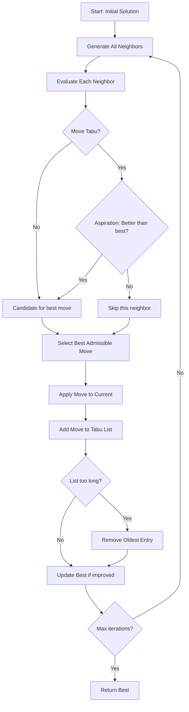
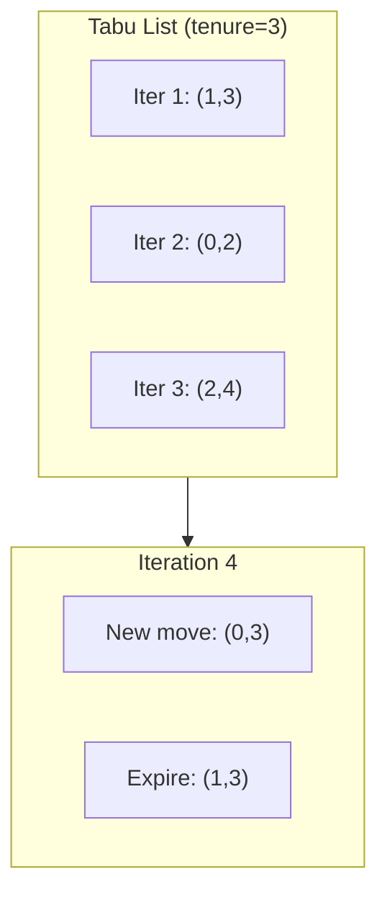

# Tabu Search

## Overview

| Property | Value |
|----------|-------|
| **Category** | Metaheuristic Optimization |
| **Complexity (Time)** | O(iterations × neighborhood × tabu_check) |
| **Complexity (Space)** | O(tabu_size + state_size) |
| **Type** | Memory-based local search |
| **Best For** | Combinatorial optimization (TSP, scheduling) |

## Description

Tabu Search is a metaheuristic optimization algorithm that enhances local search by using memory structures to avoid cycling back to recently visited solutions. The "tabu list" forbids certain moves for a number of iterations, forcing the search to explore new regions of the solution space.

Unlike simulated annealing, which uses randomization to escape local optima, tabu search uses intelligent memory to guide the search deterministically toward unexplored solutions.

## Mathematical Foundation

### Tabu Memory Structure

Define a tabu list $T$ that records recent moves:

$$T = \{m_1, m_2, \ldots, m_k\}$$

Where each $m_i$ represents a move that is forbidden for a tenure of $\tau$ iterations.

### Move Evaluation

For a neighborhood $N(s)$ of current solution $s$:

$$s^* = \arg\min_{s' \in N(s) \setminus T_{forbidden}} f(s')$$

The best non-tabu neighbor is selected, even if it's worse than the current solution.

### Aspiration Criterion

A tabu move may be accepted if it satisfies an aspiration criterion:

$$\text{Accept } m \text{ if } f(s_m) < f(s_{best})$$

This overrides the tabu status if the move leads to a new best solution.

### Intensification vs Diversification

**Intensification:** Focus search around best solutions found:
$$P(\text{return to best region}) \propto \text{quality of region}$$

**Diversification:** Force exploration of unvisited regions:
$$P(\text{visit new region}) \propto \text{time since last visit}$$

## Algorithm

### Pseudocode

```
TABU-SEARCH(initial_solution, max_iterations, tabu_tenure):
    current ← initial_solution
    best ← current
    tabu_list ← empty list
    
    for iteration = 1 to max_iterations:
        // Generate all neighbors
        neighbors ← GENERATE-NEIGHBORS(current)
        
        // Find best admissible neighbor
        best_neighbor ← None
        best_neighbor_value ← ∞
        best_move ← None
        
        for each (neighbor, move) in neighbors:
            // Check if move is tabu
            if move ∈ tabu_list:
                // Aspiration: accept if better than best known
                if f(neighbor) < f(best):
                    if f(neighbor) < best_neighbor_value:
                        best_neighbor ← neighbor
                        best_neighbor_value ← f(neighbor)
                        best_move ← move
            else:
                if f(neighbor) < best_neighbor_value:
                    best_neighbor ← neighbor
                    best_neighbor_value ← f(neighbor)
                    best_move ← move
        
        // Move to best neighbor
        current ← best_neighbor
        
        // Update tabu list (add new, remove expired)
        tabu_list.add(best_move)
        if |tabu_list| > tabu_tenure:
            tabu_list.remove_oldest()
        
        // Update best solution
        if f(current) < f(best):
            best ← current
    
    return best
```

### TSP-Specific Pseudocode (2-Opt)

```
TABU-SEARCH-TSP(cities, distance_matrix, max_iter, tabu_tenure):
    // Initialize random tour
    tour ← random_permutation(cities)
    best_tour ← tour
    best_length ← tour_length(tour)
    tabu_list ← {}  // Set of forbidden (i, j) swaps
    
    for iter = 1 to max_iter:
        best_swap ← None
        best_delta ← ∞
        
        // Evaluate all 2-opt swaps
        for i = 0 to n-2:
            for j = i+2 to n-1:
                // Calculate improvement
                delta ← COMPUTE-2OPT-DELTA(tour, i, j, distance_matrix)
                
                // Check if swap is admissible
                if (i, j) ∈ tabu_list:
                    // Aspiration criterion
                    if tour_length(tour) + delta < best_length:
                        if delta < best_delta:
                            best_swap ← (i, j)
                            best_delta ← delta
                else:
                    if delta < best_delta:
                        best_swap ← (i, j)
                        best_delta ← delta
        
        // Apply best swap
        if best_swap ≠ None:
            (i, j) ← best_swap
            REVERSE(tour, i+1, j)  // 2-opt move
            
            // Update tabu list
            tabu_list.add((i, j))
            if |tabu_list| > tabu_tenure:
                remove oldest from tabu_list
            
            // Update best
            current_length ← tour_length(tour)
            if current_length < best_length:
                best_tour ← tour.copy()
                best_length ← current_length
    
    return best_tour, best_length
```

### Step-by-Step Execution

```
TSP with 5 cities, tabu_tenure = 3

Initial tour: [A, B, C, D, E], length = 100
best = 100

Iteration 1:
  Evaluate all 2-opt swaps:
    Swap (0,2): [A, C, B, D, E], delta = -5, NOT tabu
    Swap (0,3): [A, D, C, B, E], delta = +2, NOT tabu
    Swap (1,3): [A, B, D, C, E], delta = -8, NOT tabu ← Best!
    ...
  
  Apply swap (1,3): tour = [A, B, D, C, E], length = 92
  Tabu list: {(1,3)}
  best = 92

Iteration 2:
  Evaluate swaps:
    Swap (0,2): delta = -3, NOT tabu ← Best admissible
    Swap (1,3): delta = -10, TABU (no aspiration)
    ...
  
  Apply swap (0,2): tour = [A, D, B, C, E], length = 89
  Tabu list: {(1,3), (0,2)}
  best = 89

Iteration 3:
  Evaluate swaps:
    Swap (1,3): delta = -5, TABU but 89-5=84 < 89 → ASPIRATION!
  
  Apply swap (1,3): tour = [A, D, C, B, E], length = 84
  Tabu list: {(1,3), (0,2), (1,3)}  # tenure would expire old
  best = 84

... (continue)
```

## Complexity Analysis

### Time Complexity

| Component | Complexity |
|-----------|------------|
| Neighborhood generation | O(n²) for 2-opt |
| Tabu check | O(tabu_size) or O(1) with hash |
| Per iteration | O(n² × tabu_check) |
| Total | O(iterations × n²) |

### Space Complexity

| Component | Space |
|-----------|-------|
| Current solution | O(n) |
| Best solution | O(n) |
| Tabu list | O(tabu_tenure) |
| Total | O(n + tabu_tenure) |

## Visual Representation



### Tabu List Dynamics



## Implementation

### Python Implementation (TSP)

```python
import random
from typing import Any


def tabu_search(
    cities: dict[str, tuple[float, float]],
    max_iterations: int = 1000,
    tabu_tenure: int = 20
) -> tuple[list[str], float]:
    """
    Solve TSP using tabu search with 2-opt neighborhood.
    
    Args:
        cities: Dictionary mapping city names to (x, y) coordinates
        max_iterations: Maximum number of iterations
        tabu_tenure: Number of iterations a move stays tabu
    
    Returns:
        (best_tour, best_length)
    
    Examples:
        >>> cities = {'A': (0,0), 'B': (1,0), 'C': (1,1), 'D': (0,1)}
        >>> tour, length = tabu_search(cities, max_iterations=100)
        >>> len(tour)
        4
    """
    # Calculate distance matrix
    city_names = list(cities.keys())
    n = len(city_names)
    
    def distance(c1: str, c2: str) -> float:
        x1, y1 = cities[c1]
        x2, y2 = cities[c2]
        return ((x2 - x1)**2 + (y2 - y1)**2) ** 0.5
    
    def tour_length(tour: list[str]) -> float:
        return sum(
            distance(tour[i], tour[(i + 1) % n])
            for i in range(n)
        )
    
    # Initialize with random tour
    current_tour = city_names.copy()
    random.shuffle(current_tour)
    current_length = tour_length(current_tour)
    
    best_tour = current_tour.copy()
    best_length = current_length
    
    # Tabu list: stores (i, j) swaps
    tabu_list: list[tuple[int, int]] = []
    
    for iteration in range(max_iterations):
        best_neighbor = None
        best_neighbor_length = float('inf')
        best_move = None
        
        # Evaluate all 2-opt swaps
        for i in range(n - 1):
            for j in range(i + 2, n):
                if i == 0 and j == n - 1:
                    continue  # Skip: reverses whole tour
                
                # Create neighbor by reversing segment
                neighbor = current_tour.copy()
                neighbor[i+1:j+1] = neighbor[i+1:j+1][::-1]
                neighbor_length = tour_length(neighbor)
                
                move = (i, j)
                is_tabu = move in tabu_list
                
                # Aspiration criterion
                if is_tabu and neighbor_length < best_length:
                    is_tabu = False  # Override tabu
                
                if not is_tabu and neighbor_length < best_neighbor_length:
                    best_neighbor = neighbor
                    best_neighbor_length = neighbor_length
                    best_move = move
        
        if best_neighbor is None:
            break  # No admissible move
        
        # Apply move
        current_tour = best_neighbor
        current_length = best_neighbor_length
        
        # Update tabu list
        tabu_list.append(best_move)
        if len(tabu_list) > tabu_tenure:
            tabu_list.pop(0)
        
        # Update best
        if current_length < best_length:
            best_tour = current_tour.copy()
            best_length = current_length
    
    return best_tour, best_length
```

### Generic Tabu Search Framework

```python
from abc import ABC, abstractmethod
from collections import deque
from typing import TypeVar, Generic, Set, Hashable

S = TypeVar('S')  # Solution type
M = TypeVar('M', bound=Hashable)  # Move type


class TabuSearchProblem(ABC, Generic[S, M]):
    """Abstract base class for tabu search problems."""
    
    @abstractmethod
    def initial_solution(self) -> S:
        """Generate initial solution."""
        pass
    
    @abstractmethod
    def objective(self, solution: S) -> float:
        """Evaluate solution (minimize)."""
        pass
    
    @abstractmethod
    def get_neighbors(self, solution: S) -> list[tuple[S, M]]:
        """Get (neighbor, move) pairs."""
        pass
    
    @abstractmethod
    def reverse_move(self, move: M) -> M:
        """Get reverse of a move for tabu tracking."""
        pass


class TabuSearch(Generic[S, M]):
    """
    Generic tabu search implementation.
    """
    
    def __init__(
        self,
        problem: TabuSearchProblem[S, M],
        tabu_tenure: int = 10,
        max_iterations: int = 1000,
        aspiration: bool = True
    ):
        self.problem = problem
        self.tabu_tenure = tabu_tenure
        self.max_iterations = max_iterations
        self.aspiration = aspiration
    
    def solve(self) -> tuple[S, float]:
        """
        Run tabu search.
        
        Returns:
            (best_solution, best_value)
        """
        current = self.problem.initial_solution()
        current_value = self.problem.objective(current)
        
        best = current
        best_value = current_value
        
        tabu_list: deque[M] = deque(maxlen=self.tabu_tenure)
        tabu_set: Set[M] = set()
        
        for _ in range(self.max_iterations):
            neighbors = self.problem.get_neighbors(current)
            
            best_neighbor = None
            best_neighbor_value = float('inf')
            best_move = None
            
            for neighbor, move in neighbors:
                is_tabu = move in tabu_set
                neighbor_value = self.problem.objective(neighbor)
                
                # Aspiration criterion
                if self.aspiration and is_tabu:
                    if neighbor_value < best_value:
                        is_tabu = False
                
                if not is_tabu and neighbor_value < best_neighbor_value:
                    best_neighbor = neighbor
                    best_neighbor_value = neighbor_value
                    best_move = move
            
            if best_neighbor is None:
                break
            
            # Update current
            current = best_neighbor
            current_value = best_neighbor_value
            
            # Update tabu list
            if len(tabu_list) >= self.tabu_tenure:
                old_move = tabu_list.popleft()
                tabu_set.discard(old_move)
            
            reverse = self.problem.reverse_move(best_move)
            tabu_list.append(reverse)
            tabu_set.add(reverse)
            
            # Update best
            if current_value < best_value:
                best = current
                best_value = current_value
        
        return best, best_value
```

### Graph Coloring with Tabu Search

```python
class GraphColoringTabu:
    """
    Solve graph coloring using tabu search.
    Minimize number of conflicts.
    """
    
    def __init__(
        self,
        adjacency: list[list[int]],
        num_colors: int
    ):
        self.adjacency = adjacency
        self.n = len(adjacency)
        self.num_colors = num_colors
    
    def count_conflicts(self, coloring: list[int]) -> int:
        """Count edges with same color on both vertices."""
        conflicts = 0
        for i in range(self.n):
            for j in self.adjacency[i]:
                if i < j and coloring[i] == coloring[j]:
                    conflicts += 1
        return conflicts
    
    def solve(
        self,
        max_iterations: int = 10000,
        tabu_tenure: int = 10
    ) -> tuple[list[int], int]:
        """
        Find coloring that minimizes conflicts.
        
        Returns:
            (coloring, num_conflicts)
        """
        # Random initial coloring
        coloring = [random.randint(0, self.num_colors - 1) 
                    for _ in range(self.n)]
        conflicts = self.count_conflicts(coloring)
        
        best_coloring = coloring.copy()
        best_conflicts = conflicts
        
        # Tabu: (vertex, old_color) pairs
        tabu_list: list[tuple[int, int]] = []
        
        iteration = 0
        while iteration < max_iterations and conflicts > 0:
            iteration += 1
            
            best_move = None
            best_delta = float('inf')
            
            # Find best (vertex, new_color) change
            for v in range(self.n):
                old_color = coloring[v]
                
                for new_color in range(self.num_colors):
                    if new_color == old_color:
                        continue
                    
                    # Calculate delta
                    delta = 0
                    for neighbor in self.adjacency[v]:
                        if coloring[neighbor] == old_color:
                            delta -= 1  # Resolves conflict
                        if coloring[neighbor] == new_color:
                            delta += 1  # Creates conflict
                    
                    move = (v, old_color)  # What we're forbidding
                    is_tabu = move in tabu_list
                    
                    # Aspiration
                    if is_tabu and conflicts + delta < best_conflicts:
                        is_tabu = False
                    
                    if not is_tabu and delta < best_delta:
                        best_move = (v, new_color)
                        best_delta = delta
            
            if best_move is None:
                break
            
            # Apply move
            v, new_color = best_move
            old_color = coloring[v]
            coloring[v] = new_color
            conflicts += best_delta
            
            # Update tabu list
            tabu_list.append((v, old_color))
            if len(tabu_list) > tabu_tenure:
                tabu_list.pop(0)
            
            # Update best
            if conflicts < best_conflicts:
                best_coloring = coloring.copy()
                best_conflicts = conflicts
        
        return best_coloring, best_conflicts
```

## Real-World Applications

### 1. Vehicle Routing Problem

```python
class VRPTabuSearch:
    """
    Vehicle Routing Problem using tabu search.
    """
    
    def __init__(
        self,
        depot: tuple[float, float],
        customers: list[tuple[float, float]],
        demands: list[float],
        vehicle_capacity: float,
        num_vehicles: int
    ):
        self.depot = depot
        self.customers = customers
        self.demands = demands
        self.capacity = vehicle_capacity
        self.num_vehicles = num_vehicles
        self.n = len(customers)
    
    def distance(self, p1: tuple, p2: tuple) -> float:
        return ((p2[0] - p1[0])**2 + (p2[1] - p1[1])**2) ** 0.5
    
    def route_cost(self, route: list[int]) -> float:
        """Calculate total distance for a route."""
        if not route:
            return 0
        cost = self.distance(self.depot, self.customers[route[0]])
        for i in range(len(route) - 1):
            cost += self.distance(
                self.customers[route[i]], 
                self.customers[route[i + 1]]
            )
        cost += self.distance(self.customers[route[-1]], self.depot)
        return cost
    
    def route_demand(self, route: list[int]) -> float:
        return sum(self.demands[c] for c in route)
    
    def total_cost(self, routes: list[list[int]]) -> float:
        return sum(self.route_cost(r) for r in routes)
    
    def is_feasible(self, routes: list[list[int]]) -> bool:
        return all(
            self.route_demand(r) <= self.capacity 
            for r in routes
        )
    
    def solve(
        self,
        max_iterations: int = 5000,
        tabu_tenure: int = 15
    ) -> tuple[list[list[int]], float]:
        """
        Solve VRP using tabu search.
        
        Neighborhood: relocate customer between routes
        """
        # Initialize: assign customers to routes greedily
        routes = [[] for _ in range(self.num_vehicles)]
        unassigned = list(range(self.n))
        random.shuffle(unassigned)
        
        for c in unassigned:
            # Find route with capacity
            for route in routes:
                if self.route_demand(route) + self.demands[c] <= self.capacity:
                    route.append(c)
                    break
        
        best_routes = [r.copy() for r in routes]
        best_cost = self.total_cost(routes)
        
        tabu_list: list[tuple[int, int]] = []  # (customer, from_route)
        
        for _ in range(max_iterations):
            best_move = None
            best_delta = float('inf')
            
            # Try relocating each customer
            for from_r, route in enumerate(routes):
                for pos, customer in enumerate(route):
                    for to_r in range(len(routes)):
                        if from_r == to_r:
                            continue
                        
                        # Check capacity
                        if self.route_demand(routes[to_r]) + \
                           self.demands[customer] > self.capacity:
                            continue
                        
                        # Calculate delta
                        old_cost = (self.route_cost(routes[from_r]) + 
                                   self.route_cost(routes[to_r]))
                        
                        # Simulate move
                        new_from = route[:pos] + route[pos+1:]
                        new_to = routes[to_r] + [customer]
                        new_cost = self.route_cost(new_from) + \
                                  self.route_cost(new_to)
                        
                        delta = new_cost - old_cost
                        
                        move = (customer, from_r)
                        is_tabu = move in tabu_list
                        
                        # Aspiration
                        total = self.total_cost(routes) + delta
                        if is_tabu and total < best_cost:
                            is_tabu = False
                        
                        if not is_tabu and delta < best_delta:
                            best_move = (customer, from_r, to_r, pos)
                            best_delta = delta
            
            if best_move is None:
                break
            
            # Apply move
            customer, from_r, to_r, pos = best_move
            routes[from_r].pop(pos)
            routes[to_r].append(customer)
            
            # Update tabu
            tabu_list.append((customer, from_r))
            if len(tabu_list) > tabu_tenure:
                tabu_list.pop(0)
            
            # Update best
            current_cost = self.total_cost(routes)
            if current_cost < best_cost:
                best_routes = [r.copy() for r in routes]
                best_cost = current_cost
        
        return best_routes, best_cost
```

### 2. Job Shop Scheduling

```python
from dataclasses import dataclass

@dataclass
class Operation:
    job_id: int
    op_id: int
    machine: int
    duration: int


class JobShopTabu:
    """
    Job shop scheduling with tabu search.
    """
    
    def __init__(self, operations: list[list[Operation]]):
        """
        operations[j][o] = Operation for job j, operation o
        """
        self.operations = operations
        self.num_jobs = len(operations)
    
    def makespan(self, schedule: list[Operation]) -> int:
        """Calculate completion time of schedule."""
        machine_time = {}
        job_time = [0] * self.num_jobs
        
        for op in schedule:
            start = max(
                machine_time.get(op.machine, 0),
                job_time[op.job_id]
            )
            end = start + op.duration
            machine_time[op.machine] = end
            job_time[op.job_id] = end
        
        return max(machine_time.values()) if machine_time else 0
    
    def solve(
        self,
        max_iter: int = 5000,
        tabu_tenure: int = 20
    ) -> tuple[list[Operation], int]:
        """
        Find schedule minimizing makespan.
        
        Neighborhood: swap adjacent operations on critical path
        """
        # Build initial schedule (flatten operations)
        schedule = []
        for job_ops in self.operations:
            schedule.extend(job_ops)
        
        current_makespan = self.makespan(schedule)
        best_schedule = schedule.copy()
        best_makespan = current_makespan
        
        tabu_list: list[tuple[int, int]] = []
        
        for _ in range(max_iter):
            best_neighbor = None
            best_neighbor_makespan = float('inf')
            best_swap = None
            
            # Try all adjacent swaps
            for i in range(len(schedule) - 1):
                # Can only swap if different jobs
                if schedule[i].job_id == schedule[i + 1].job_id:
                    continue
                
                # Create neighbor
                neighbor = schedule.copy()
                neighbor[i], neighbor[i + 1] = neighbor[i + 1], neighbor[i]
                
                neighbor_makespan = self.makespan(neighbor)
                
                swap = (
                    (schedule[i].job_id, schedule[i].op_id),
                    (schedule[i + 1].job_id, schedule[i + 1].op_id)
                )
                is_tabu = swap in tabu_list
                
                # Aspiration
                if is_tabu and neighbor_makespan < best_makespan:
                    is_tabu = False
                
                if not is_tabu and neighbor_makespan < best_neighbor_makespan:
                    best_neighbor = neighbor
                    best_neighbor_makespan = neighbor_makespan
                    best_swap = swap
            
            if best_neighbor is None:
                break
            
            schedule = best_neighbor
            current_makespan = best_neighbor_makespan
            
            # Update tabu (add reverse)
            tabu_list.append((best_swap[1], best_swap[0]))
            if len(tabu_list) > tabu_tenure:
                tabu_list.pop(0)
            
            if current_makespan < best_makespan:
                best_schedule = schedule.copy()
                best_makespan = current_makespan
        
        return best_schedule, best_makespan
```

### 3. Frequency Assignment

```python
class FrequencyAssignment:
    """
    Assign frequencies to transmitters minimizing interference.
    """
    
    def __init__(
        self,
        interference: list[list[int]],
        num_frequencies: int
    ):
        """
        interference[i][j] = required frequency separation
        """
        self.interference = interference
        self.n = len(interference)
        self.num_freq = num_frequencies
    
    def penalty(self, assignment: list[int]) -> int:
        """Calculate interference penalty."""
        total = 0
        for i in range(self.n):
            for j in range(i + 1, self.n):
                required = self.interference[i][j]
                actual = abs(assignment[i] - assignment[j])
                if actual < required:
                    total += required - actual
        return total
    
    def solve(
        self,
        max_iter: int = 10000,
        tabu_tenure: int = 10
    ) -> tuple[list[int], int]:
        """Find frequency assignment minimizing interference."""
        # Random initial assignment
        assignment = [random.randint(0, self.num_freq - 1) 
                      for _ in range(self.n)]
        current_penalty = self.penalty(assignment)
        
        best_assignment = assignment.copy()
        best_penalty = current_penalty
        
        tabu_list: list[tuple[int, int]] = []
        
        for _ in range(max_iter):
            if current_penalty == 0:
                break
            
            best_move = None
            best_delta = float('inf')
            
            for i in range(self.n):
                old_freq = assignment[i]
                for new_freq in range(self.num_freq):
                    if new_freq == old_freq:
                        continue
                    
                    # Calculate delta
                    delta = 0
                    for j in range(self.n):
                        if i == j:
                            continue
                        required = self.interference[i][j]
                        old_diff = abs(old_freq - assignment[j])
                        new_diff = abs(new_freq - assignment[j])
                        
                        old_viol = max(0, required - old_diff)
                        new_viol = max(0, required - new_diff)
                        delta += new_viol - old_viol
                    
                    move = (i, old_freq)
                    is_tabu = move in tabu_list
                    
                    if is_tabu and current_penalty + delta < best_penalty:
                        is_tabu = False
                    
                    if not is_tabu and delta < best_delta:
                        best_move = (i, new_freq)
                        best_delta = delta
            
            if best_move is None:
                break
            
            i, new_freq = best_move
            old_freq = assignment[i]
            assignment[i] = new_freq
            current_penalty += best_delta
            
            tabu_list.append((i, old_freq))
            if len(tabu_list) > tabu_tenure:
                tabu_list.pop(0)
            
            if current_penalty < best_penalty:
                best_assignment = assignment.copy()
                best_penalty = current_penalty
        
        return best_assignment, best_penalty
```

## Tabu Search Variants

| Variant | Description | Use Case |
|---------|-------------|----------|
| **Simple** | Fixed tenure, single tabu list | Basic problems |
| **Adaptive** | Dynamic tenure based on search | Complex landscapes |
| **Reactive** | Adjusts to detect cycling | Long-running search |
| **Probabilistic** | Random tabu tenure | Diversification |

## Comparison with Other Metaheuristics

| Aspect | Tabu Search | Simulated Annealing | Genetic Algorithm |
|--------|-------------|---------------------|-------------------|
| Memory | Explicit (tabu list) | Implicit (temperature) | Population |
| Deterministic | Yes (mostly) | No | No |
| Parameters | Tenure, iterations | Temperature schedule | Population, crossover |
| Local optima | Escapes via tabu | Escapes via acceptance | Escapes via crossover |

## References

1. [Tabu Search - Wikipedia](https://en.wikipedia.org/wiki/Tabu_search)
2. Glover, F. "Future paths for integer programming and links to artificial intelligence" (1986)
3. Glover, F. & Laguna, M. "Tabu Search" (1997)
4. Gendreau, M. & Potvin, J.Y. "Handbook of Metaheuristics" (2010)

## See Also

- [Simulated Annealing](simulated_annealing.md) - Probabilistic optimization
- [Hill Climbing](hill_climbing.md) - Basic local search
- [Genetic Algorithms](../genetic_algorithm/) - Population-based optimization
