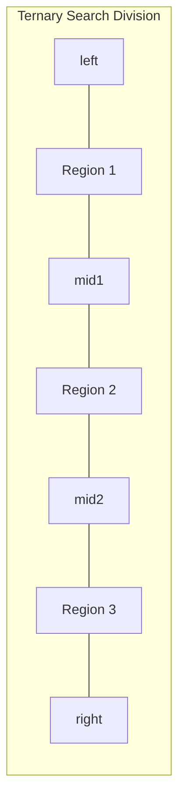

# Ternary Search

## Overview

| Property | Value |
|----------|-------|
| **Category** | Divide and Conquer Search |
| **Complexity (Time)** | O(log₃ n) |
| **Complexity (Space)** | O(1) iterative, O(log n) recursive |
| **Requires Sorted** | Yes |
| **Divisions per Step** | 3 parts |

## Description

Ternary Search is a divide-and-conquer search algorithm that divides the search space into three equal parts instead of two (as in binary search). At each step, it compares the target with elements at two mid-points and narrows the search to one of the three regions.

While ternary search reduces the search space by one-third each step (compared to half in binary search), it requires two comparisons per step. This makes it theoretically slower than binary search for simple comparisons but useful for finding extrema in unimodal functions.

## Mathematical Foundation

### Division Strategy

Given array $A[left..right]$, compute two mid-points:

$$mid_1 = left + \frac{right - left}{3}$$

$$mid_2 = left + 2 \times \frac{right - left}{3}$$

### Complexity Analysis

**Time Complexity:**
- At each step, search space reduces to $\frac{n}{3}$
- Number of steps: $\log_3 n$
- Comparisons per step: 2

Total comparisons: $2 \log_3 n = \frac{2 \ln n}{\ln 3} \approx 1.26 \log_2 n$

**Comparison with Binary Search:**
- Binary Search: $\log_2 n$ comparisons
- Ternary Search: $2 \log_3 n$ comparisons

Since $2 \log_3 n > \log_2 n$, binary search is theoretically faster for array searching.

### Recurrence Relation

$$T(n) = T(n/3) + O(1)$$

Solution: $T(n) = O(\log_3 n) = O(\log n)$

### Unimodal Function Optimization

For finding the maximum of a unimodal function $f(x)$ on $[a, b]$:
- If $f(mid_1) < f(mid_2)$: maximum is in $[mid_1, b]$
- If $f(mid_1) > f(mid_2)$: maximum is in $[a, mid_2]$
- After $k$ iterations: interval reduces to $(2/3)^k \times (b-a)$

## Algorithm

### Pseudocode

```
TERNARY-SEARCH(A, left, right, target):
    while left ≤ right:
        // Small range: use linear search
        if right - left < threshold:
            return LINEAR-SEARCH(A, left, right, target)
        
        // Calculate two mid points
        mid1 ← left + (right - left) / 3
        mid2 ← left + 2 × (right - left) / 3
        
        if A[mid1] = target:
            return mid1
        if A[mid2] = target:
            return mid2
        
        if target < A[mid1]:
            right ← mid1 - 1      // Left third
        else if target > A[mid2]:
            left ← mid2 + 1       // Right third
        else:
            left ← mid1 + 1       // Middle third
            right ← mid2 - 1
    
    return -1
```

### Step-by-Step Execution

```
Input: A = [1, 2, 4, 5, 7, 9, 10, 12, 15, 18, 20], target = 9

n = 11, left = 0, right = 10

Iteration 1:
  mid1 = 0 + (10-0)/3 = 3
  mid2 = 0 + 2×(10-0)/3 = 6
  A[3] = 5, A[6] = 10
  target=9 > A[3]=5 and target=9 < A[6]=10
  → Search middle: left=4, right=5

Iteration 2:
  right - left = 1 < threshold (10)
  → Linear search in [4, 5]
  A[4] = 7 ≠ 9
  A[5] = 9 = target ✓

Return: 5
```

## Complexity Analysis

### Time Complexity

| Case | Complexity |
|------|------------|
| Best | O(1) |
| Average | O(log₃ n) |
| Worst | O(log₃ n) |

### Space Complexity

| Implementation | Space |
|----------------|-------|
| Iterative | O(1) |
| Recursive | O(log₃ n) |

### Binary vs Ternary Comparison

| Property | Binary Search | Ternary Search |
|----------|---------------|----------------|
| Division | 2 parts | 3 parts |
| Comparisons/step | 1-2 | 2 |
| Total comparisons | log₂ n | 2 log₃ n |
| Better for | Array search | Unimodal optimization |

## Visual Representation

```mermaid
flowchart TD
    A[Start: left=0, right=n-1] --> B{right - left < threshold?}
    B -->|Yes| C[Linear Search]
    B -->|No| D[Calculate mid1, mid2]
    D --> E{A[mid1] = target?}
    E -->|Yes| F[Return mid1]
    E -->|No| G{A[mid2] = target?}
    G -->|Yes| H[Return mid2]
    G -->|No| I{target < A[mid1]?}
    I -->|Yes| J[right = mid1 - 1]
    I -->|No| K{target > A[mid2]?}
    K -->|Yes| L[left = mid2 + 1]
    K -->|No| M[left=mid1+1, right=mid2-1]
    J --> B
    L --> B
    M --> B
```

### Three-Way Division



## Implementation

### Python Implementation (Iterative)

```python
def ternary_search_iterative(arr: list[int], target: int) -> int:
    """
    Iterative ternary search on a sorted array.
    
    Divides the array into three parts and searches the appropriate region.
    
    Args:
        arr: A sorted list of integers
        target: The element to search for
    
    Returns:
        Index of target if found, -1 otherwise
    
    Examples:
        >>> ternary_search_iterative([0, 1, 2, 8, 13, 17, 19, 32, 42], 13)
        4
        >>> ternary_search_iterative([4, 5, 6, 7], 4)
        0
        >>> ternary_search_iterative([4, 5, 6, 7], -10)
        -1
        >>> ternary_search_iterative([], 1)
        -1
    """
    PRECISION = 10  # Threshold for switching to linear search
    
    left = 0
    right = len(arr)
    
    while left <= right:
        # For small ranges, use linear search
        if right - left < PRECISION:
            for i in range(left, right):
                if arr[i] == target:
                    return i
            return -1
        
        # Calculate two mid-points
        one_third = (left + right) // 3 + 1
        two_third = 2 * (left + right) // 3 + 1
        
        if arr[one_third] == target:
            return one_third
        elif arr[two_third] == target:
            return two_third
        elif target < arr[one_third]:
            right = one_third - 1
        elif target > arr[two_third]:
            left = two_third + 1
        else:
            left = one_third + 1
            right = two_third - 1
    
    return -1
```

### Python Implementation (Recursive)

```python
def ternary_search_recursive(
    arr: list[int], 
    target: int, 
    left: int = 0, 
    right: int | None = None
) -> int:
    """
    Recursive ternary search on a sorted array.
    
    >>> ternary_search_recursive([0, 1, 2, 8, 13, 17, 19, 32, 42], 42)
    8
    >>> ternary_search_recursive([4, 5, 6, 7], 7)
    3
    >>> ternary_search_recursive([4, 5, 6, 7], 100)
    -1
    """
    PRECISION = 10
    
    if right is None:
        right = len(arr)
    
    if left >= right:
        return -1
    
    # Small range: linear search
    if right - left < PRECISION:
        for i in range(left, right):
            if arr[i] == target:
                return i
        return -1
    
    one_third = (left + right) // 3 + 1
    two_third = 2 * (left + right) // 3 + 1
    
    if arr[one_third] == target:
        return one_third
    elif arr[two_third] == target:
        return two_third
    elif target < arr[one_third]:
        return ternary_search_recursive(arr, target, left, one_third - 1)
    elif target > arr[two_third]:
        return ternary_search_recursive(arr, target, two_third + 1, right)
    else:
        return ternary_search_recursive(arr, target, one_third + 1, two_third - 1)
```

### Ternary Search for Unimodal Functions

```python
def ternary_search_max(
    f: callable,
    left: float,
    right: float,
    epsilon: float = 1e-9
) -> float:
    """
    Find the maximum of a unimodal function using ternary search.
    
    A function is unimodal if it's strictly increasing then strictly decreasing
    (or vice versa for minimum).
    
    Args:
        f: A unimodal function to maximize
        left: Left bound of search interval
        right: Right bound of search interval
        epsilon: Precision threshold
    
    Returns:
        The x value where f(x) is maximum
    
    Examples:
        >>> import math
        >>> # f(x) = -(x-5)^2 + 10 has max at x=5
        >>> abs(ternary_search_max(lambda x: -(x-5)**2 + 10, 0, 10) - 5) < 0.001
        True
    """
    while right - left > epsilon:
        mid1 = left + (right - left) / 3
        mid2 = right - (right - left) / 3
        
        if f(mid1) < f(mid2):
            left = mid1
        else:
            right = mid2
    
    return (left + right) / 2


def ternary_search_min(
    f: callable,
    left: float,
    right: float,
    epsilon: float = 1e-9
) -> float:
    """
    Find the minimum of a unimodal function using ternary search.
    
    >>> import math
    >>> # f(x) = (x-3)^2 has min at x=3
    >>> abs(ternary_search_min(lambda x: (x-3)**2, 0, 10) - 3) < 0.001
    True
    """
    while right - left > epsilon:
        mid1 = left + (right - left) / 3
        mid2 = right - (right - left) / 3
        
        if f(mid1) > f(mid2):
            left = mid1
        else:
            right = mid2
    
    return (left + right) / 2
```

## Real-World Applications

### 1. Finding Peak in Signal Processing

```python
class SignalAnalyzer:
    """
    Analyze signals to find peak values using ternary search.
    Useful when signal is unimodal (one clear peak).
    """
    
    def __init__(self, samples: list[float]):
        """Initialize with signal samples."""
        self.samples = samples
    
    def find_peak(self) -> tuple[int, float]:
        """
        Find the peak value in a unimodal signal.
        
        Returns:
            (index, value) of the peak
        
        >>> analyzer = SignalAnalyzer([1, 3, 5, 7, 9, 8, 6, 4, 2])
        >>> analyzer.find_peak()
        (4, 9)
        """
        left, right = 0, len(self.samples) - 1
        
        while right - left > 2:
            mid1 = left + (right - left) // 3
            mid2 = right - (right - left) // 3
            
            if self.samples[mid1] < self.samples[mid2]:
                left = mid1
            else:
                right = mid2
        
        # Find max in remaining elements
        max_idx = left
        for i in range(left, right + 1):
            if self.samples[i] > self.samples[max_idx]:
                max_idx = i
        
        return max_idx, self.samples[max_idx]
    
    def find_signal_at_time(
        self, 
        timestamps: list[float], 
        target_time: float
    ) -> float | None:
        """
        Find signal value at target timestamp using ternary search.
        
        >>> analyzer = SignalAnalyzer([10, 20, 30, 40, 50])
        >>> timestamps = [0.0, 0.25, 0.5, 0.75, 1.0]
        >>> analyzer.find_signal_at_time(timestamps, 0.5)
        30
        """
        left, right = 0, len(timestamps) - 1
        
        while left <= right:
            if right - left < 3:
                # Linear search for small range
                for i in range(left, right + 1):
                    if abs(timestamps[i] - target_time) < 1e-10:
                        return self.samples[i]
                return None
            
            mid1 = left + (right - left) // 3
            mid2 = right - (right - left) // 3
            
            if timestamps[mid1] == target_time:
                return self.samples[mid1]
            elif timestamps[mid2] == target_time:
                return self.samples[mid2]
            elif target_time < timestamps[mid1]:
                right = mid1 - 1
            elif target_time > timestamps[mid2]:
                left = mid2 + 1
            else:
                left = mid1 + 1
                right = mid2 - 1
        
        return None
```

### 2. Optimization in Machine Learning

```python
import math

class HyperparameterOptimizer:
    """
    Optimize hyperparameters using ternary search.
    Assumes the loss function is unimodal with respect to the parameter.
    """
    
    def __init__(self, evaluate_fn: callable):
        """
        Initialize with an evaluation function.
        
        Args:
            evaluate_fn: Function that takes hyperparameter and returns loss
        """
        self.evaluate = evaluate_fn
        self.evaluations = 0
    
    def optimize(
        self,
        low: float,
        high: float,
        precision: float = 1e-6,
        max_iterations: int = 100
    ) -> tuple[float, float]:
        """
        Find optimal hyperparameter value minimizing loss.
        
        >>> def loss(lr): return (lr - 0.01)**2 + 0.001
        >>> opt = HyperparameterOptimizer(loss)
        >>> param, loss_val = opt.optimize(0.0, 1.0)
        >>> abs(param - 0.01) < 0.001
        True
        """
        iterations = 0
        
        while high - low > precision and iterations < max_iterations:
            iterations += 1
            
            mid1 = low + (high - low) / 3
            mid2 = high - (high - low) / 3
            
            self.evaluations += 2
            loss1 = self.evaluate(mid1)
            loss2 = self.evaluate(mid2)
            
            if loss1 > loss2:
                low = mid1
            else:
                high = mid2
        
        optimal = (low + high) / 2
        return optimal, self.evaluate(optimal)
    
    def optimize_learning_rate(
        self,
        train_fn: callable,
        lr_low: float = 1e-6,
        lr_high: float = 1.0
    ) -> float:
        """
        Find optimal learning rate for training.
        
        Args:
            train_fn: Function that takes learning rate and returns validation loss
            lr_low: Minimum learning rate to try
            lr_high: Maximum learning rate to try
        
        Returns:
            Optimal learning rate
        """
        # Use log scale for learning rate
        log_low = math.log10(lr_low)
        log_high = math.log10(lr_high)
        
        def log_evaluate(log_lr):
            return train_fn(10 ** log_lr)
        
        old_evaluate = self.evaluate
        self.evaluate = log_evaluate
        
        log_optimal, _ = self.optimize(log_low, log_high)
        
        self.evaluate = old_evaluate
        return 10 ** log_optimal
```

### 3. Physics: Finding Equilibrium Points

```python
class EquilibriumFinder:
    """
    Find equilibrium points in physical systems using ternary search.
    """
    
    @staticmethod
    def find_stable_equilibrium(
        potential_energy: callable,
        x_min: float,
        x_max: float,
        precision: float = 1e-9
    ) -> float:
        """
        Find stable equilibrium point (minimum potential energy).
        
        >>> # Simple harmonic oscillator: V(x) = 0.5*k*x^2
        >>> V = lambda x: 0.5 * 100 * x**2
        >>> abs(EquilibriumFinder.find_stable_equilibrium(V, -10, 10)) < 0.001
        True
        """
        left, right = x_min, x_max
        
        while right - left > precision:
            mid1 = left + (right - left) / 3
            mid2 = right - (right - left) / 3
            
            # Minimize potential energy
            if potential_energy(mid1) > potential_energy(mid2):
                left = mid1
            else:
                right = mid2
        
        return (left + right) / 2
    
    @staticmethod
    def find_maximum_range(
        launch_velocity: float,
        min_angle: float = 0,
        max_angle: float = 90,
        gravity: float = 9.81
    ) -> tuple[float, float]:
        """
        Find optimal launch angle for maximum range in projectile motion.
        
        >>> angle, range_val = EquilibriumFinder.find_maximum_range(100)
        >>> abs(angle - 45) < 0.1  # Optimal angle is 45 degrees
        True
        """
        def range_at_angle(angle_deg):
            angle_rad = math.radians(angle_deg)
            return (launch_velocity ** 2 * math.sin(2 * angle_rad)) / gravity
        
        left, right = min_angle, max_angle
        
        while right - left > 0.001:
            mid1 = left + (right - left) / 3
            mid2 = right - (right - left) / 3
            
            # Maximize range
            if range_at_angle(mid1) < range_at_angle(mid2):
                left = mid1
            else:
                right = mid2
        
        optimal_angle = (left + right) / 2
        return optimal_angle, range_at_angle(optimal_angle)
```

### 4. Game Theory: Finding Nash Equilibrium

```python
class TwoPlayerGame:
    """
    Find optimal strategies in two-player games using ternary search.
    Assumes payoff function is unimodal in player's strategy.
    """
    
    def __init__(self, payoff_fn: callable):
        """
        Initialize with payoff function.
        
        Args:
            payoff_fn: Function(p1_strategy, p2_strategy) -> (p1_payoff, p2_payoff)
        """
        self.payoff = payoff_fn
    
    def find_best_response(
        self,
        opponent_strategy: float,
        is_player1: bool = True,
        min_strategy: float = 0,
        max_strategy: float = 1,
        precision: float = 1e-6
    ) -> float:
        """
        Find best response strategy against opponent's fixed strategy.
        
        >>> game = TwoPlayerGame(lambda p1, p2: (-abs(p1-0.5), -abs(p2-0.5)))
        >>> abs(game.find_best_response(0.3, True) - 0.5) < 0.01
        True
        """
        left, right = min_strategy, max_strategy
        
        while right - left > precision:
            mid1 = left + (right - left) / 3
            mid2 = right - (right - left) / 3
            
            if is_player1:
                payoff1 = self.payoff(mid1, opponent_strategy)[0]
                payoff2 = self.payoff(mid2, opponent_strategy)[0]
            else:
                payoff1 = self.payoff(opponent_strategy, mid1)[1]
                payoff2 = self.payoff(opponent_strategy, mid2)[1]
            
            # Maximize own payoff
            if payoff1 < payoff2:
                left = mid1
            else:
                right = mid2
        
        return (left + right) / 2
```

### 5. Resource Allocation Optimization

```python
class ResourceAllocator:
    """
    Optimize resource allocation using ternary search.
    """
    
    def __init__(self, benefit_function: callable, total_resource: float):
        """
        Initialize allocator.
        
        Args:
            benefit_function: f(allocation) -> benefit
            total_resource: Total available resource
        """
        self.benefit = benefit_function
        self.total = total_resource
    
    def optimize_single_allocation(
        self,
        min_alloc: float = 0,
        max_alloc: float | None = None,
        precision: float = 1e-6
    ) -> tuple[float, float]:
        """
        Find optimal allocation for a single resource.
        
        >>> # Diminishing returns: benefit = sqrt(allocation)
        >>> import math
        >>> allocator = ResourceAllocator(math.sqrt, 100)
        >>> alloc, benefit = allocator.optimize_single_allocation()
        >>> alloc == 100  # Should use all available
        True
        """
        if max_alloc is None:
            max_alloc = self.total
        
        max_alloc = min(max_alloc, self.total)
        left, right = min_alloc, max_alloc
        
        while right - left > precision:
            mid1 = left + (right - left) / 3
            mid2 = right - (right - left) / 3
            
            if self.benefit(mid1) < self.benefit(mid2):
                left = mid1
            else:
                right = mid2
        
        optimal = (left + right) / 2
        return optimal, self.benefit(optimal)
    
    def optimize_two_resources(
        self,
        benefit1: callable,
        benefit2: callable,
        precision: float = 1e-6
    ) -> tuple[float, float, float]:
        """
        Optimize allocation between two resources.
        
        >>> import math
        >>> allocator = ResourceAllocator(None, 100)
        >>> a1, a2, total_benefit = allocator.optimize_two_resources(
        ...     lambda x: math.sqrt(x), lambda x: math.sqrt(x))
        >>> abs(a1 - 50) < 1  # Equal split for identical benefits
        True
        """
        def total_benefit(alloc1):
            alloc2 = self.total - alloc1
            if alloc1 < 0 or alloc2 < 0:
                return float('-inf')
            return benefit1(alloc1) + benefit2(alloc2)
        
        left, right = 0, self.total
        
        while right - left > precision:
            mid1 = left + (right - left) / 3
            mid2 = right - (right - left) / 3
            
            if total_benefit(mid1) < total_benefit(mid2):
                left = mid1
            else:
                right = mid2
        
        optimal1 = (left + right) / 2
        optimal2 = self.total - optimal1
        return optimal1, optimal2, total_benefit(optimal1)
```

## When to Use Ternary Search

| Use Case | Recommendation |
|----------|----------------|
| Array search | ✗ Use binary search |
| Unimodal function extrema | ✓ Excellent choice |
| Continuous optimization | ✓ Good choice |
| Discrete optimization | ? Consider alternatives |
| Multi-modal functions | ✗ Not suitable |

## Variants

### 1. N-ary Search
Generalize to divide into N parts (rarely practical for N > 3)

### 2. Golden Section Search
Uses golden ratio for division, slightly more efficient for function optimization

### 3. Fibonacci Search
Uses Fibonacci numbers for division (see fibonacci_search.md)

## References

1. [Ternary Search - Wikipedia](https://en.wikipedia.org/wiki/Ternary_search)
2. [Unimodal Function - Wikipedia](https://en.wikipedia.org/wiki/Unimodal_function)
3. Numerical Recipes in C: The Art of Scientific Computing
4. [Optimization Algorithms](https://en.wikipedia.org/wiki/Mathematical_optimization)

## See Also

- [Binary Search](binary_search.md) - More efficient for array search
- [Fibonacci Search](fibonacci_search.md) - Division-free alternative
- [Golden Section Search](https://en.wikipedia.org/wiki/Golden-section_search) - Related optimization technique
- [Hill Climbing](hill_climbing.md) - Local search optimization
