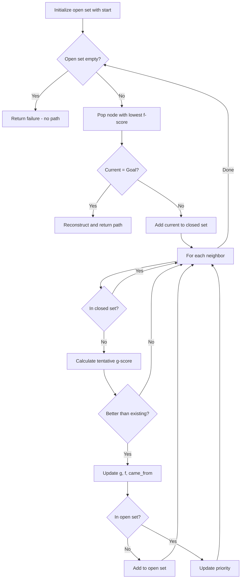
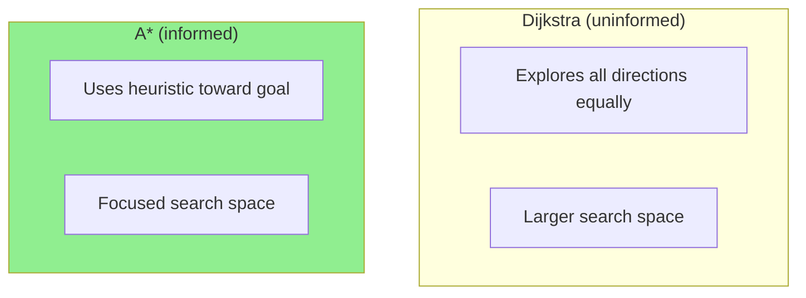

# A* Search Algorithm

## Overview

| Property | Value |
|----------|-------|
| **Category** | Pathfinding, Informed Search |
| **Complexity (Time)** | O(E) worst case, often O(b^d) with good heuristic |
| **Complexity (Space)** | O(V) |
| **Graph Type** | Weighted, typically grid-based |
| **Best For** | Pathfinding with known goal location |

## Description

A* (pronounced "A-star") is a best-first graph traversal and pathfinding algorithm that finds the shortest path between a given source and goal. Developed by Peter Hart, Nils Nilsson, and Bertram Raphael in 1968, A* combines the actual cost from the start (like Dijkstra) with a heuristic estimate to the goal, making it significantly faster than uninformed search algorithms.

A* is widely used in video games, robotics, and any application requiring efficient pathfinding on grids or graphs.

## Mathematical Foundation

### Evaluation Function

A* uses an evaluation function $f(n)$ for each node $n$:

$$f(n) = g(n) + h(n)$$

Where:
- $g(n)$ = actual cost from start to node $n$
- $h(n)$ = heuristic estimate from $n$ to goal
- $f(n)$ = estimated total cost through $n$

### Admissible Heuristic

A heuristic $h$ is **admissible** if it never overestimates the true cost:

$$h(n) \leq h^*(n) \quad \forall n$$

Where $h^*(n)$ is the true cost from $n$ to goal.

### Consistent (Monotonic) Heuristic

A heuristic is **consistent** if for every node $n$ and successor $n'$:

$$h(n) \leq c(n, n') + h(n')$$

And $h(goal) = 0$.

**Consistency implies admissibility**, but not vice versa.

### Common Heuristics

For grid pathfinding:

**Manhattan Distance** (4-directional movement):
$$h(n) = |x_n - x_g| + |y_n - y_g|$$

**Euclidean Distance** (any direction):
$$h(n) = \sqrt{(x_n - x_g)^2 + (y_n - y_g)^2}$$

**Chebyshev Distance** (8-directional movement):
$$h(n) = \max(|x_n - x_g|, |y_n - y_g|)$$

**Octile Distance** (8-directional with diagonal cost):
$$h(n) = \max(dx, dy) + (\sqrt{2} - 1) \cdot \min(dx, dy)$$

### Optimality Guarantee

With an admissible heuristic, A* is **optimal** (finds shortest path).
With a consistent heuristic, A* is also **efficient** (never re-expands nodes).

## Algorithm

### Pseudocode

```
A-STAR(grid, start, goal, cost, heuristic):
    // Initialize
    open_set ← priority queue
    closed_set ← empty set
    g_score ← {start: 0}
    f_score ← {start: heuristic(start, goal)}
    came_from ← {}
    
    INSERT(open_set, (f_score[start], start))
    
    while open_set is not empty:
        current ← EXTRACT-MIN(open_set)
        
        if current = goal:
            return RECONSTRUCT-PATH(came_from, current)
        
        ADD(closed_set, current)
        
        for each neighbor of current:
            if neighbor in closed_set:
                continue
            
            tentative_g ← g_score[current] + cost(current, neighbor)
            
            if neighbor not in g_score OR tentative_g < g_score[neighbor]:
                came_from[neighbor] ← current
                g_score[neighbor] ← tentative_g
                f_score[neighbor] ← tentative_g + heuristic(neighbor, goal)
                
                if neighbor not in open_set:
                    INSERT(open_set, (f_score[neighbor], neighbor))
    
    return failure  // No path found
```

### Path Reconstruction

```
RECONSTRUCT-PATH(came_from, current):
    path ← [current]
    
    while current in came_from:
        current ← came_from[current]
        path.prepend(current)
    
    return path
```

### Step-by-Step Execution

```
Grid (0=open, 1=wall):
    S . . . .
    . # # . .
    . . . # .
    . . . . G

S=(0,0), G=(3,4)
Cost: 1 per move
Heuristic: Manhattan distance

Initial:
  Open: [(4, (0,0))]  // f = 0 + 4
  Closed: {}
  g = {(0,0): 0}

Step 1: Expand (0,0), f=4
  Neighbors: (0,1), (1,0)
  g[(0,1)] = 1, f = 1 + 4 = 5
  g[(1,0)] = 1, f = 1 + 4 = 5
  Open: [(5, (0,1)), (5, (1,0))]
  Closed: {(0,0)}

Step 2: Expand (0,1), f=5
  Neighbors: (0,2)
  g[(0,2)] = 2, f = 2 + 4 = 6
  Open: [(5, (1,0)), (6, (0,2))]
  Closed: {(0,0), (0,1)}

... continues until goal reached

Final path: (0,0) → (1,0) → (2,0) → (2,1) → (2,2) → (3,2) → (3,3) → (3,4)
```

## Complexity Analysis

### Time Complexity

| Scenario | Complexity |
|----------|------------|
| Worst case (poor heuristic) | O(b^d) or O(E) |
| Good heuristic | Much better in practice |
| Perfect heuristic h = h* | O(d) |

Where:
- $b$ = branching factor
- $d$ = depth of optimal solution
- $E$ = number of edges

### Space Complexity

| Component | Space |
|-----------|-------|
| Open set | O(V) |
| Closed set | O(V) |
| g_score, f_score | O(V) |
| came_from | O(V) |
| **Total** | **O(V)** |

## Visual Representation



### Search Space Comparison



## Implementation

### Python Implementation

```python
from __future__ import annotations
import heapq


def search(
    grid: list[list[int]],
    init: list[int],
    goal: list[int],
    cost: int,
    heuristic: list[list[int]]
) -> tuple[list[list[int]], list[list[int]]]:
    """
    A* search algorithm for grid pathfinding.
    
    Args:
        grid: 2D grid where 0 is passable, 1 is obstacle
        init: Starting position [row, col]
        goal: Goal position [row, col]
        cost: Cost per step
        heuristic: Precomputed heuristic values for each cell
    
    Returns:
        (path_grid, action_grid) where:
        - path_grid shows expansion order
        - action_grid shows optimal action at each cell
    
    Examples:
        >>> grid = [[0, 0, 0], [0, 1, 0], [0, 0, 0]]
        >>> h = [[4, 3, 2], [3, 2, 1], [2, 1, 0]]
        >>> path, action = search(grid, [0, 0], [2, 2], 1, h)
        >>> path[2][2] >= 0  # Goal was reached
        True
    """
    # Directions: up, left, down, right
    DIRECTIONS = [[-1, 0], [0, -1], [1, 0], [0, 1]]
    
    rows, cols = len(grid), len(grid[0])
    
    # Initialize path and action grids
    path = [[-1 for _ in range(cols)] for _ in range(rows)]
    action = [[-1 for _ in range(cols)] for _ in range(rows)]
    
    # Starting state
    x, y = init
    g = 0  # Cost from start
    f = g + heuristic[x][y]  # Total estimated cost
    
    # Priority queue: (f-score, g-score, row, col)
    open_set = [(f, g, x, y)]
    visited = [[False for _ in range(cols)] for _ in range(rows)]
    
    count = 0  # Expansion order counter
    
    while open_set:
        # Get cell with lowest f-score
        f, g, x, y = heapq.heappop(open_set)
        
        if visited[x][y]:
            continue
        
        visited[x][y] = True
        path[x][y] = count
        count += 1
        
        # Check if goal reached
        if x == goal[0] and y == goal[1]:
            return path, action
        
        # Explore neighbors
        for i, (dx, dy) in enumerate(DIRECTIONS):
            nx, ny = x + dx, y + dy
            
            # Check bounds and obstacles
            if 0 <= nx < rows and 0 <= ny < cols:
                if not visited[nx][ny] and grid[nx][ny] == 0:
                    new_g = g + cost
                    new_f = new_g + heuristic[nx][ny]
                    heapq.heappush(open_set, (new_f, new_g, nx, ny))
                    action[nx][ny] = i
    
    return path, action  # No path found
```

### Generic A* Implementation

```python
from typing import Callable, TypeVar, Generic
import heapq

T = TypeVar('T')


class AStar(Generic[T]):
    """
    Generic A* search implementation.
    """
    
    def __init__(
        self,
        neighbors: Callable[[T], list[tuple[T, float]]],
        heuristic: Callable[[T, T], float]
    ):
        """
        Args:
            neighbors: Function returning (neighbor, cost) pairs
            heuristic: Function estimating cost from node to goal
        """
        self.neighbors = neighbors
        self.heuristic = heuristic
    
    def search(self, start: T, goal: T) -> tuple[list[T], float]:
        """
        Find shortest path from start to goal.
        
        Returns:
            (path, total_cost) or ([], inf) if no path
        """
        open_set = [(self.heuristic(start, goal), 0, start, [start])]
        closed = set()
        g_scores = {start: 0}
        
        while open_set:
            f, g, current, path = heapq.heappop(open_set)
            
            if current in closed:
                continue
            
            if current == goal:
                return path, g
            
            closed.add(current)
            
            for neighbor, cost in self.neighbors(current):
                if neighbor in closed:
                    continue
                
                tentative_g = g + cost
                
                if neighbor not in g_scores or tentative_g < g_scores[neighbor]:
                    g_scores[neighbor] = tentative_g
                    f_score = tentative_g + self.heuristic(neighbor, goal)
                    new_path = path + [neighbor]
                    heapq.heappush(open_set, (f_score, tentative_g, neighbor, new_path))
        
        return [], float('inf')
```

### A* for Grid with Manhattan Heuristic

```python
def a_star_grid(
    grid: list[list[int]],
    start: tuple[int, int],
    goal: tuple[int, int],
    diagonal: bool = False
) -> list[tuple[int, int]]:
    """
    A* pathfinding on a grid.
    
    Args:
        grid: 0 for passable, 1 for obstacle
        start: (row, col) start position
        goal: (row, col) goal position
        diagonal: Allow diagonal movement
    
    Returns:
        Path as list of (row, col) or empty if no path
    
    Examples:
        >>> grid = [[0, 0, 0], [0, 1, 0], [0, 0, 0]]
        >>> path = a_star_grid(grid, (0, 0), (2, 2))
        >>> len(path) > 0
        True
    """
    rows, cols = len(grid), len(grid[0])
    
    if diagonal:
        directions = [(-1,-1), (-1,0), (-1,1), (0,-1), (0,1), (1,-1), (1,0), (1,1)]
        def heuristic(a, b):
            dx, dy = abs(a[0] - b[0]), abs(a[1] - b[1])
            return max(dx, dy) + (1.414 - 1) * min(dx, dy)
    else:
        directions = [(-1, 0), (0, -1), (0, 1), (1, 0)]
        def heuristic(a, b):
            return abs(a[0] - b[0]) + abs(a[1] - b[1])
    
    open_set = [(heuristic(start, goal), 0, start)]
    came_from = {}
    g_score = {start: 0}
    
    while open_set:
        _, g, current = heapq.heappop(open_set)
        
        if current == goal:
            # Reconstruct path
            path = [current]
            while current in came_from:
                current = came_from[current]
                path.append(current)
            return path[::-1]
        
        if g > g_score.get(current, float('inf')):
            continue
        
        for dr, dc in directions:
            nr, nc = current[0] + dr, current[1] + dc
            neighbor = (nr, nc)
            
            if not (0 <= nr < rows and 0 <= nc < cols):
                continue
            if grid[nr][nc] == 1:
                continue
            
            # Diagonal movement cost is sqrt(2)
            move_cost = 1.414 if dr != 0 and dc != 0 else 1
            tentative_g = g + move_cost
            
            if tentative_g < g_score.get(neighbor, float('inf')):
                g_score[neighbor] = tentative_g
                f_score = tentative_g + heuristic(neighbor, goal)
                came_from[neighbor] = current
                heapq.heappush(open_set, (f_score, tentative_g, neighbor))
    
    return []  # No path found
```

## Real-World Applications

### 1. Video Game Pathfinding

```python
from dataclasses import dataclass
from enum import Enum


class TerrainType(Enum):
    GRASS = 1
    ROAD = 0.5
    WATER = float('inf')
    FOREST = 2


@dataclass
class GameMap:
    """Game world map with terrain costs."""
    terrain: list[list[TerrainType]]
    width: int
    height: int


class GamePathfinder:
    """
    A* pathfinding for video game NPCs.
    """
    
    def __init__(self, game_map: GameMap):
        self.map = game_map
    
    def find_path(
        self,
        start: tuple[int, int],
        goal: tuple[int, int],
        unit_speed: float = 1.0
    ) -> list[tuple[int, int]]:
        """
        Find path considering terrain costs and unit speed.
        
        Examples:
            >>> terrain = [[TerrainType.GRASS, TerrainType.ROAD],
            ...            [TerrainType.FOREST, TerrainType.GRASS]]
            >>> game_map = GameMap(terrain, 2, 2)
            >>> pathfinder = GamePathfinder(game_map)
            >>> path = pathfinder.find_path((0, 0), (1, 1))
            >>> len(path) > 0
            True
        """
        directions = [(-1, 0), (0, -1), (0, 1), (1, 0),
                     (-1, -1), (-1, 1), (1, -1), (1, 1)]
        
        def heuristic(a, b):
            return ((a[0] - b[0])**2 + (a[1] - b[1])**2) ** 0.5
        
        def get_cost(pos):
            terrain = self.map.terrain[pos[0]][pos[1]]
            return terrain.value / unit_speed
        
        open_set = [(heuristic(start, goal), 0, start)]
        came_from = {}
        g_score = {start: 0}
        
        while open_set:
            _, g, current = heapq.heappop(open_set)
            
            if current == goal:
                path = [current]
                while current in came_from:
                    current = came_from[current]
                    path.append(current)
                return path[::-1]
            
            for dr, dc in directions:
                nr, nc = current[0] + dr, current[1] + dc
                neighbor = (nr, nc)
                
                if not (0 <= nr < self.map.height and 0 <= nc < self.map.width):
                    continue
                
                terrain_cost = get_cost(neighbor)
                if terrain_cost == float('inf'):
                    continue
                
                move_cost = 1.414 if dr != 0 and dc != 0 else 1
                tentative_g = g + move_cost * terrain_cost
                
                if tentative_g < g_score.get(neighbor, float('inf')):
                    g_score[neighbor] = tentative_g
                    f = tentative_g + heuristic(neighbor, goal)
                    came_from[neighbor] = current
                    heapq.heappush(open_set, (f, tentative_g, neighbor))
        
        return []
```

### 2. Robot Navigation

```python
import math


class RobotNavigator:
    """
    A* for robot navigation with turning costs.
    """
    
    def __init__(self, grid: list[list[int]]):
        self.grid = grid
        self.rows = len(grid)
        self.cols = len(grid[0])
        
        # 8 directions with angles (0, 45, 90, ...)
        self.directions = [
            (0, (-1, 0)),   # North
            (45, (-1, 1)),  # NE
            (90, (0, 1)),   # East
            (135, (1, 1)),  # SE
            (180, (1, 0)),  # South
            (225, (1, -1)), # SW
            (270, (0, -1)), # West
            (315, (-1, -1)) # NW
        ]
    
    def turning_cost(self, from_angle: int, to_angle: int) -> float:
        """Calculate cost of turning."""
        diff = abs(from_angle - to_angle)
        diff = min(diff, 360 - diff)
        return diff / 45 * 0.5  # 0.5 cost per 45-degree turn
    
    def find_path(
        self,
        start: tuple[int, int],
        goal: tuple[int, int],
        initial_heading: int = 0
    ) -> list[tuple[int, int, int]]:
        """
        Find path with minimal movement and turning.
        
        Returns list of (row, col, heading) states.
        """
        # State: (row, col, heading)
        start_state = (start[0], start[1], initial_heading)
        
        def heuristic(state):
            row, col, _ = state
            return math.sqrt((row - goal[0])**2 + (col - goal[1])**2)
        
        open_set = [(heuristic(start_state), 0, start_state)]
        came_from = {}
        g_score = {start_state: 0}
        
        while open_set:
            _, g, current = heapq.heappop(open_set)
            row, col, heading = current
            
            if (row, col) == goal:
                path = [current]
                while current in came_from:
                    current = came_from[current]
                    path.append(current)
                return path[::-1]
            
            for angle, (dr, dc) in self.directions:
                nr, nc = row + dr, col + dc
                
                if not (0 <= nr < self.rows and 0 <= nc < self.cols):
                    continue
                if self.grid[nr][nc] == 1:
                    continue
                
                # Movement cost + turning cost
                move_cost = 1.414 if dr != 0 and dc != 0 else 1
                turn_cost = self.turning_cost(heading, angle)
                total_cost = move_cost + turn_cost
                
                neighbor_state = (nr, nc, angle)
                tentative_g = g + total_cost
                
                if tentative_g < g_score.get(neighbor_state, float('inf')):
                    g_score[neighbor_state] = tentative_g
                    f = tentative_g + heuristic(neighbor_state)
                    came_from[neighbor_state] = current
                    heapq.heappush(open_set, (f, tentative_g, neighbor_state))
        
        return []
```

### 3. Puzzle Solving (15-Puzzle)

```python
from typing import Tuple

State = Tuple[Tuple[int, ...], ...]


class PuzzleSolver:
    """
    Solve sliding tile puzzles using A*.
    """
    
    def __init__(self, goal: State):
        self.goal = goal
        self.size = len(goal)
        
        # Precompute goal positions
        self.goal_pos = {}
        for i, row in enumerate(goal):
            for j, val in enumerate(row):
                self.goal_pos[val] = (i, j)
    
    def manhattan_distance(self, state: State) -> int:
        """Calculate sum of Manhattan distances to goal."""
        total = 0
        for i, row in enumerate(state):
            for j, val in enumerate(row):
                if val != 0:  # Skip empty tile
                    gi, gj = self.goal_pos[val]
                    total += abs(i - gi) + abs(j - gj)
        return total
    
    def get_neighbors(self, state: State) -> list[State]:
        """Get states reachable by one move."""
        # Find empty tile
        for i, row in enumerate(state):
            for j, val in enumerate(row):
                if val == 0:
                    empty_i, empty_j = i, j
                    break
        
        neighbors = []
        for di, dj in [(-1, 0), (0, -1), (0, 1), (1, 0)]:
            ni, nj = empty_i + di, empty_j + dj
            if 0 <= ni < self.size and 0 <= nj < self.size:
                # Create new state by swapping
                new_state = [list(row) for row in state]
                new_state[empty_i][empty_j] = new_state[ni][nj]
                new_state[ni][nj] = 0
                neighbors.append(tuple(tuple(row) for row in new_state))
        
        return neighbors
    
    def solve(self, start: State) -> list[State]:
        """
        Solve puzzle using A*.
        
        Examples:
            >>> goal = ((1, 2, 3), (4, 5, 6), (7, 8, 0))
            >>> solver = PuzzleSolver(goal)
            >>> start = ((1, 2, 3), (4, 0, 6), (7, 5, 8))
            >>> solution = solver.solve(start)
            >>> solution[-1] == goal
            True
        """
        open_set = [(self.manhattan_distance(start), 0, start)]
        came_from = {}
        g_score = {start: 0}
        
        while open_set:
            _, g, current = heapq.heappop(open_set)
            
            if current == self.goal:
                path = [current]
                while current in came_from:
                    current = came_from[current]
                    path.append(current)
                return path[::-1]
            
            for neighbor in self.get_neighbors(current):
                tentative_g = g + 1
                
                if tentative_g < g_score.get(neighbor, float('inf')):
                    g_score[neighbor] = tentative_g
                    f = tentative_g + self.manhattan_distance(neighbor)
                    came_from[neighbor] = current
                    heapq.heappush(open_set, (f, tentative_g, neighbor))
        
        return []  # No solution
```

## A* Variants

| Variant | Description | Use Case |
|---------|-------------|----------|
| **IDA*** | Iterative deepening A* | Memory-constrained |
| **SMA*** | Simplified memory-bounded | Limited memory |
| **Weighted A*** | f = g + w*h, w > 1 | Faster, suboptimal |
| **Bidirectional A*** | Search from both ends | Large search spaces |
| **Theta*** | Any-angle pathfinding | Smooth paths |

## Comparison with Other Algorithms

| Algorithm | Optimal | Complete | Time | Space |
|-----------|---------|----------|------|-------|
| BFS | Yes (unweighted) | Yes | O(b^d) | O(b^d) |
| Dijkstra | Yes | Yes | O((V+E)log V) | O(V) |
| Greedy Best-First | No | No | O(b^m) | O(b^m) |
| **A*** | **Yes** | **Yes** | O(b^d) | O(b^d) |

## References

1. Hart, P.E., Nilsson, N.J., Raphael, B. "A Formal Basis for the Heuristic Determination of Minimum Cost Paths" (1968)
2. [A* Search Algorithm - Wikipedia](https://en.wikipedia.org/wiki/A*_search_algorithm)
3. Russell, S. & Norvig, P. "Artificial Intelligence: A Modern Approach"

## See Also

- [Dijkstra's Algorithm](dijkstra.md) - Uninformed shortest path
- [Breadth-First Search](breadth_first_search.md) - Unweighted shortest path
- [Bidirectional A*](bidirectional_a_star.md) - Search from both ends
- [IDA*](ida_star.md) - Memory-efficient A*
