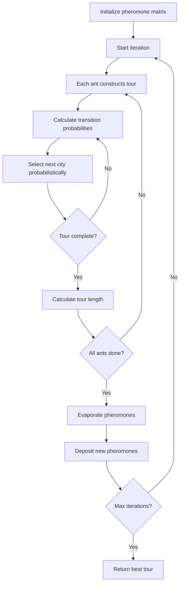
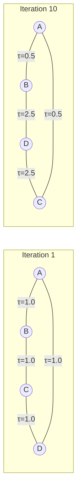

# Ant Colony Optimization (ACO)

## Overview

| Property | Value |
|----------|-------|
| **Category** | Metaheuristic / Nature-Inspired |
| **Complexity (Time)** | O(iterations × ants × n²) |
| **Complexity (Space)** | O(n²) |
| **Problem Type** | Combinatorial Optimization |
| **Best For** | TSP, routing, scheduling |

## Description

Ant Colony Optimization (ACO) is a probabilistic technique inspired by the foraging behavior of ants. Ants deposit pheromones on paths to food sources, and subsequent ants preferentially follow paths with higher pheromone concentrations. This collective behavior leads to the emergence of shortest paths.

ACO is particularly effective for solving combinatorial optimization problems like the Traveling Salesman Problem (TSP), vehicle routing, and job scheduling.

## Mathematical Foundation

### Pheromone Update

After each iteration, pheromone levels are updated:
$$\tau_{ij}(t+1) = (1 - \rho) \cdot \tau_{ij}(t) + \sum_{k=1}^{m} \Delta\tau_{ij}^k$$

Where:
- $\rho$ is the evaporation rate (0 < ρ < 1)
- $\Delta\tau_{ij}^k$ is pheromone deposited by ant k

### Pheromone Deposit

For TSP, ant k deposits:
$$\Delta\tau_{ij}^k = \begin{cases} \frac{Q}{L_k} & \text{if ant k used edge } (i,j) \\ 0 & \text{otherwise} \end{cases}$$

Where Q is a constant and $L_k$ is the tour length of ant k.

### Transition Probability

Probability that ant k at city i moves to city j:
$$P_{ij}^k = \frac{[\tau_{ij}]^\alpha \cdot [\eta_{ij}]^\beta}{\sum_{l \in J_i^k} [\tau_{il}]^\alpha \cdot [\eta_{il}]^\beta}$$

Where:
- $\tau_{ij}$ = pheromone level on edge (i, j)
- $\eta_{ij} = 1/d_{ij}$ = heuristic desirability (inverse distance)
- $\alpha$ = pheromone importance factor
- $\beta$ = heuristic importance factor
- $J_i^k$ = set of unvisited cities for ant k at city i

### Parameters

| Parameter | Typical Value | Effect |
|-----------|---------------|--------|
| $\alpha$ | 1.0 | Higher = more pheromone influence |
| $\beta$ | 2.0-5.0 | Higher = more greedy selection |
| $\rho$ | 0.1-0.5 | Higher = faster pheromone decay |
| Q | 100 | Pheromone deposit constant |

## Algorithm

### Pseudocode

```
ANT_COLONY_OPTIMIZATION(cities, distances, params):
    // Initialize pheromone matrix
    τ[i][j] ← τ₀ for all edges
    best_tour ← None
    best_length ← ∞
    
    for iteration ← 1 to max_iterations:
        all_tours ← []
        
        // Each ant constructs a solution
        for ant ← 1 to num_ants:
            tour ← CONSTRUCT_TOUR(τ, distances, params)
            length ← TOUR_LENGTH(tour, distances)
            all_tours.append((tour, length))
            
            if length < best_length:
                best_tour ← tour
                best_length ← length
        
        // Update pheromones
        τ ← UPDATE_PHEROMONES(τ, all_tours, params)
    
    return best_tour, best_length

CONSTRUCT_TOUR(τ, distances, params):
    tour ← [random_start_city]
    unvisited ← all cities except start
    
    while unvisited not empty:
        current ← last city in tour
        
        // Calculate transition probabilities
        probs ← []
        for city in unvisited:
            pheromone ← τ[current][city]^α
            heuristic ← (1/distances[current][city])^β
            probs.append(pheromone × heuristic)
        
        // Normalize and select
        probs ← normalize(probs)
        next_city ← weighted_random_choice(unvisited, probs)
        
        tour.append(next_city)
        unvisited.remove(next_city)
    
    return tour

UPDATE_PHEROMONES(τ, tours, params):
    // Evaporation
    τ[i][j] ← (1 - ρ) × τ[i][j] for all edges
    
    // Deposit
    for (tour, length) in tours:
        deposit ← Q / length
        for i in range(len(tour)):
            j ← (i + 1) % len(tour)
            τ[tour[i]][tour[j]] += deposit
    
    return τ
```

### Step-by-Step Execution

```
TSP with 4 cities: A, B, C, D
Distances:
    A-B: 10, A-C: 15, A-D: 20
    B-C: 25, B-D: 25, C-D: 30

Initial pheromones: τ = 1.0 for all edges
Parameters: α=1, β=2, ρ=0.5, Q=100

Iteration 1, Ant 1:
  Start: A
  Unvisited: {B, C, D}
  
  Calculate probabilities from A:
    P(A→B) ∝ τ^α × (1/d)^β = 1.0 × (1/10)² = 0.01
    P(A→C) ∝ 1.0 × (1/15)² = 0.0044
    P(A→D) ∝ 1.0 × (1/20)² = 0.0025
    
    Normalized: P(B)=0.59, P(C)=0.26, P(D)=0.15
    
  Random choice: B
  Tour so far: [A, B]
  
  From B, unvisited: {C, D}
    P(B→C) ∝ 1.0 × (1/25)² = 0.0016
    P(B→D) ∝ 1.0 × (1/25)² = 0.0016
    
    Normalized: P(C)=0.5, P(D)=0.5
    
  Random choice: C
  Tour so far: [A, B, C]
  
  From C: only D remains
  Final tour: A → B → C → D → A
  Length: 10 + 25 + 30 + 20 = 85

After all ants complete:
  Update pheromones...
  
Best tour found: A → B → D → C → A (length 80)
```

## Complexity Analysis

### Time Complexity

| Component | Complexity |
|-----------|------------|
| Probability calculation | O(n) per step |
| Tour construction | O(n²) per ant |
| Pheromone update | O(n²) |
| Total per iteration | O(m × n²) |
| Total | O(iter × m × n²) |

Where: n = cities, m = ants, iter = iterations

### Space Complexity

| Component | Complexity |
|-----------|------------|
| Pheromone matrix | O(n²) |
| Distance matrix | O(n²) |
| Tour storage | O(n × m) |
| Total | O(n²) |

## Visual Representation



### Pheromone Trail Evolution



## Implementation

### Python Implementation

```python
from __future__ import annotations
import random
from typing import List, Tuple


def main(
    cities: List[Tuple[float, float]],
    num_ants: int = 10,
    num_iterations: int = 100,
    alpha: float = 1.0,
    beta: float = 2.0,
    evaporation: float = 0.5,
    Q: float = 100.0
) -> Tuple[List[int], float]:
    """
    Ant Colony Optimization for TSP.
    
    Args:
        cities: List of (x, y) coordinates
        num_ants: Number of ants per iteration
        num_iterations: Total iterations
        alpha: Pheromone importance
        beta: Heuristic importance
        evaporation: Pheromone decay rate
        Q: Pheromone deposit constant
    
    Returns:
        Best tour and its length
    
    >>> cities = [(0, 0), (1, 0), (1, 1), (0, 1)]
    >>> tour, length = main(cities, num_ants=5, num_iterations=10)
    >>> len(tour) == 4
    True
    """
    n = len(cities)
    
    # Calculate distance matrix
    distances = [
        [
            ((cities[i][0] - cities[j][0])**2 + 
             (cities[i][1] - cities[j][1])**2)**0.5
            for j in range(n)
        ]
        for i in range(n)
    ]
    
    # Initialize pheromone matrix
    pheromones = [[1.0] * n for _ in range(n)]
    
    best_tour: List[int] = []
    best_length = float('inf')
    
    for _ in range(num_iterations):
        all_tours = []
        
        for _ in range(num_ants):
            tour = construct_tour(
                n, distances, pheromones, alpha, beta
            )
            length = tour_length(tour, distances)
            all_tours.append((tour, length))
            
            if length < best_length:
                best_length = length
                best_tour = tour.copy()
        
        # Update pheromones
        pheromone_update(
            pheromones, all_tours, evaporation, Q
        )
    
    return best_tour, best_length


def construct_tour(
    n: int,
    distances: List[List[float]],
    pheromones: List[List[float]],
    alpha: float,
    beta: float
) -> List[int]:
    """Construct a tour using ACO transition rules."""
    start = random.randint(0, n - 1)
    tour = [start]
    unvisited = set(range(n)) - {start}
    
    while unvisited:
        current = tour[-1]
        
        # Calculate probabilities
        probs = []
        for city in unvisited:
            pheromone = pheromones[current][city] ** alpha
            if distances[current][city] > 0:
                heuristic = (1.0 / distances[current][city]) ** beta
            else:
                heuristic = float('inf')
            probs.append((city, pheromone * heuristic))
        
        # Normalize
        total = sum(p for _, p in probs)
        probs = [(c, p / total) for c, p in probs]
        
        # Roulette wheel selection
        next_city = city_select(probs)
        tour.append(next_city)
        unvisited.remove(next_city)
    
    return tour


def city_select(probs: List[Tuple[int, float]]) -> int:
    """Select city using roulette wheel."""
    r = random.random()
    cumulative = 0.0
    
    for city, prob in probs:
        cumulative += prob
        if r <= cumulative:
            return city
    
    return probs[-1][0]


def tour_length(
    tour: List[int], 
    distances: List[List[float]]
) -> float:
    """Calculate total tour length."""
    return sum(
        distances[tour[i]][tour[(i + 1) % len(tour)]]
        for i in range(len(tour))
    )


def pheromone_update(
    pheromones: List[List[float]],
    tours: List[Tuple[List[int], float]],
    evaporation: float,
    Q: float
) -> None:
    """Update pheromone matrix."""
    n = len(pheromones)
    
    # Evaporation
    for i in range(n):
        for j in range(n):
            pheromones[i][j] *= (1 - evaporation)
    
    # Deposit
    for tour, length in tours:
        deposit = Q / length
        for i in range(len(tour)):
            j = (i + 1) % len(tour)
            pheromones[tour[i]][tour[j]] += deposit
            pheromones[tour[j]][tour[i]] += deposit


if __name__ == "__main__":
    import doctest
    doctest.testmod()
```

### Extended Implementation with Elite Ant System

```python
from typing import List, Tuple, Dict, Optional
import random
import math


class AntColonyOptimizer:
    """
    Enhanced ACO with elitist strategy.
    
    Elite ants (best solutions) deposit extra pheromone.
    """
    
    def __init__(
        self,
        num_ants: int = 20,
        alpha: float = 1.0,
        beta: float = 3.0,
        evaporation: float = 0.3,
        Q: float = 100.0,
        elite_weight: float = 2.0
    ):
        self.num_ants = num_ants
        self.alpha = alpha
        self.beta = beta
        self.evaporation = evaporation
        self.Q = Q
        self.elite_weight = elite_weight
    
    def solve_tsp(
        self,
        cities: List[Tuple[float, float]],
        iterations: int = 100
    ) -> Tuple[List[int], float]:
        """
        Solve TSP using Elite Ant System.
        """
        n = len(cities)
        distances = self._compute_distances(cities)
        pheromones = self._init_pheromones(n)
        
        best_tour: List[int] = []
        best_length = float('inf')
        
        for iteration in range(iterations):
            tours = []
            
            # Construct solutions
            for _ in range(self.num_ants):
                tour = self._construct_solution(n, distances, pheromones)
                length = self._tour_length(tour, distances)
                tours.append((tour, length))
                
                if length < best_length:
                    best_length = length
                    best_tour = tour.copy()
            
            # Update pheromones with elitist strategy
            self._update_pheromones_elite(
                pheromones, tours, best_tour, best_length, distances
            )
        
        return best_tour, best_length
    
    def _compute_distances(
        self, 
        cities: List[Tuple[float, float]]
    ) -> List[List[float]]:
        """Compute Euclidean distance matrix."""
        n = len(cities)
        return [
            [
                math.sqrt(
                    (cities[i][0] - cities[j][0])**2 +
                    (cities[i][1] - cities[j][1])**2
                )
                for j in range(n)
            ]
            for i in range(n)
        ]
    
    def _init_pheromones(self, n: int) -> List[List[float]]:
        """Initialize pheromone matrix."""
        return [[1.0] * n for _ in range(n)]
    
    def _construct_solution(
        self,
        n: int,
        distances: List[List[float]],
        pheromones: List[List[float]]
    ) -> List[int]:
        """Construct tour probabilistically."""
        start = random.randint(0, n - 1)
        tour = [start]
        unvisited = set(range(n)) - {start}
        
        while unvisited:
            current = tour[-1]
            next_city = self._select_next(
                current, unvisited, distances, pheromones
            )
            tour.append(next_city)
            unvisited.remove(next_city)
        
        return tour
    
    def _select_next(
        self,
        current: int,
        unvisited: set,
        distances: List[List[float]],
        pheromones: List[List[float]]
    ) -> int:
        """Select next city using transition probability."""
        probabilities = []
        
        for city in unvisited:
            tau = pheromones[current][city] ** self.alpha
            
            d = distances[current][city]
            eta = (1.0 / d) ** self.beta if d > 0 else 1e10
            
            probabilities.append((city, tau * eta))
        
        # Normalize
        total = sum(p for _, p in probabilities)
        if total == 0:
            return random.choice(list(unvisited))
        
        probabilities = [(c, p / total) for c, p in probabilities]
        
        # Roulette wheel
        r = random.random()
        cumulative = 0.0
        
        for city, prob in probabilities:
            cumulative += prob
            if r <= cumulative:
                return city
        
        return probabilities[-1][0]
    
    def _tour_length(
        self, 
        tour: List[int], 
        distances: List[List[float]]
    ) -> float:
        """Calculate tour length."""
        return sum(
            distances[tour[i]][tour[(i + 1) % len(tour)]]
            for i in range(len(tour))
        )
    
    def _update_pheromones_elite(
        self,
        pheromones: List[List[float]],
        tours: List[Tuple[List[int], float]],
        best_tour: List[int],
        best_length: float,
        distances: List[List[float]]
    ) -> None:
        """Update pheromones with elite strategy."""
        n = len(pheromones)
        
        # Evaporation
        for i in range(n):
            for j in range(n):
                pheromones[i][j] *= (1 - self.evaporation)
                pheromones[i][j] = max(pheromones[i][j], 0.001)
        
        # Regular deposit
        for tour, length in tours:
            deposit = self.Q / length
            for i in range(len(tour)):
                j = (i + 1) % len(tour)
                pheromones[tour[i]][tour[j]] += deposit
                pheromones[tour[j]][tour[i]] += deposit
        
        # Elite deposit (extra pheromone for best tour)
        if best_tour:
            elite_deposit = self.elite_weight * self.Q / best_length
            for i in range(len(best_tour)):
                j = (i + 1) % len(best_tour)
                pheromones[best_tour[i]][best_tour[j]] += elite_deposit
                pheromones[best_tour[j]][best_tour[i]] += elite_deposit
```

## Real-World Applications

### 1. Vehicle Routing Problem

```python
from typing import List, Tuple, Dict, Set
import random
import math


class DeliveryRoute:
    """Single delivery route for one vehicle."""
    
    def __init__(self):
        self.stops: List[int] = []
        self.load: float = 0.0
    
    def add_stop(self, customer: int, demand: float) -> None:
        self.stops.append(customer)
        self.load += demand
    
    def total_distance(
        self, 
        depot: int,
        distances: List[List[float]]
    ) -> float:
        if not self.stops:
            return 0.0
        
        dist = distances[depot][self.stops[0]]
        for i in range(len(self.stops) - 1):
            dist += distances[self.stops[i]][self.stops[i + 1]]
        dist += distances[self.stops[-1]][depot]
        
        return dist


class VehicleRoutingACO:
    """
    Solve Vehicle Routing Problem using ACO.
    
    Multiple vehicles serve customers from a depot
    with capacity constraints.
    """
    
    def __init__(
        self,
        num_ants: int = 20,
        alpha: float = 1.0,
        beta: float = 3.0,
        evaporation: float = 0.3
    ):
        self.num_ants = num_ants
        self.alpha = alpha
        self.beta = beta
        self.evaporation = evaporation
    
    def solve(
        self,
        depot: Tuple[float, float],
        customers: List[Tuple[float, float]],
        demands: List[float],
        vehicle_capacity: float,
        num_vehicles: int,
        iterations: int = 100
    ) -> Tuple[List[List[int]], float]:
        """
        Solve VRP.
        
        Returns:
            (routes, total_distance) where routes is list
            of customer indices per vehicle.
        """
        # Depot is index 0, customers are 1 to n
        all_locations = [depot] + customers
        n = len(all_locations)
        
        distances = self._compute_distances(all_locations)
        pheromones = [[1.0] * n for _ in range(n)]
        
        best_routes: List[List[int]] = []
        best_distance = float('inf')
        
        for _ in range(iterations):
            for _ in range(self.num_ants):
                routes = self._construct_routes(
                    n, distances, pheromones, demands,
                    vehicle_capacity, num_vehicles
                )
                
                total_dist = sum(
                    DeliveryRoute._route_distance(r, 0, distances)
                    for r in routes
                )
                
                if total_dist < best_distance:
                    best_distance = total_dist
                    best_routes = [r.copy() for r in routes]
            
            self._update_pheromones(pheromones, best_routes, best_distance)
        
        return best_routes, best_distance
    
    def _compute_distances(
        self, 
        locations: List[Tuple[float, float]]
    ) -> List[List[float]]:
        n = len(locations)
        return [
            [
                math.sqrt(
                    (locations[i][0] - locations[j][0])**2 +
                    (locations[i][1] - locations[j][1])**2
                )
                for j in range(n)
            ]
            for i in range(n)
        ]
    
    @staticmethod
    def _route_distance(
        route: List[int],
        depot: int,
        distances: List[List[float]]
    ) -> float:
        if not route:
            return 0.0
        
        dist = distances[depot][route[0]]
        for i in range(len(route) - 1):
            dist += distances[route[i]][route[i + 1]]
        dist += distances[route[-1]][depot]
        
        return dist
    
    def _construct_routes(
        self,
        n: int,
        distances: List[List[float]],
        pheromones: List[List[float]],
        demands: List[float],
        capacity: float,
        num_vehicles: int
    ) -> List[List[int]]:
        """Construct routes for all vehicles."""
        routes = [[] for _ in range(num_vehicles)]
        loads = [0.0] * num_vehicles
        
        unvisited = set(range(1, n))  # Exclude depot (0)
        
        while unvisited:
            # Find vehicle with capacity
            vehicle = None
            for v in range(num_vehicles):
                remaining_cap = capacity - loads[v]
                feasible = [
                    c for c in unvisited 
                    if demands[c - 1] <= remaining_cap
                ]
                if feasible:
                    vehicle = v
                    break
            
            if vehicle is None:
                break
            
            # Select customer for vehicle
            current = routes[vehicle][-1] if routes[vehicle] else 0
            remaining_cap = capacity - loads[vehicle]
            
            feasible = [
                c for c in unvisited 
                if demands[c - 1] <= remaining_cap
            ]
            
            if not feasible:
                continue
            
            # Calculate probabilities
            probs = []
            for customer in feasible:
                tau = pheromones[current][customer] ** self.alpha
                eta = (1.0 / distances[current][customer]) ** self.beta
                probs.append((customer, tau * eta))
            
            total = sum(p for _, p in probs)
            probs = [(c, p / total) for c, p in probs]
            
            # Select
            r = random.random()
            cumulative = 0.0
            selected = feasible[0]
            
            for customer, prob in probs:
                cumulative += prob
                if r <= cumulative:
                    selected = customer
                    break
            
            routes[vehicle].append(selected)
            loads[vehicle] += demands[selected - 1]
            unvisited.remove(selected)
        
        return routes
    
    def _update_pheromones(
        self,
        pheromones: List[List[float]],
        routes: List[List[int]],
        total_distance: float
    ) -> None:
        n = len(pheromones)
        
        # Evaporation
        for i in range(n):
            for j in range(n):
                pheromones[i][j] *= (1 - self.evaporation)
        
        # Deposit
        if total_distance > 0:
            deposit = 100.0 / total_distance
            
            for route in routes:
                if not route:
                    continue
                
                # Depot to first
                pheromones[0][route[0]] += deposit
                pheromones[route[0]][0] += deposit
                
                # Between customers
                for i in range(len(route) - 1):
                    pheromones[route[i]][route[i + 1]] += deposit
                    pheromones[route[i + 1]][route[i]] += deposit
                
                # Last to depot
                pheromones[route[-1]][0] += deposit
                pheromones[0][route[-1]] += deposit


def demo_vehicle_routing():
    """Demo vehicle routing."""
    solver = VehicleRoutingACO(num_ants=20, iterations=50)
    
    depot = (0, 0)
    customers = [
        (2, 3), (5, 1), (6, 4), (3, 6),
        (1, 5), (4, 2), (7, 3), (5, 5)
    ]
    demands = [10, 15, 20, 10, 15, 10, 20, 15]
    
    routes, distance = solver.solve(
        depot, customers, demands,
        vehicle_capacity=50,
        num_vehicles=3,
        iterations=50
    )
    
    print("Vehicle Routing Solution:")
    for i, route in enumerate(routes):
        print(f"  Vehicle {i + 1}: Depot → {route} → Depot")
    print(f"Total distance: {distance:.2f}")
```

### 2. Job Shop Scheduling

```python
from typing import List, Tuple, Dict, Optional
import random


class Job:
    """Job with sequence of operations."""
    
    def __init__(self, job_id: int, operations: List[Tuple[int, int]]):
        """
        operations: List of (machine_id, processing_time)
        """
        self.job_id = job_id
        self.operations = operations


class JobShopACO:
    """
    Job Shop Scheduling using ACO.
    
    Minimizes makespan (total completion time).
    """
    
    def __init__(
        self,
        num_ants: int = 20,
        alpha: float = 1.0,
        beta: float = 2.0,
        evaporation: float = 0.3
    ):
        self.num_ants = num_ants
        self.alpha = alpha
        self.beta = beta
        self.evaporation = evaporation
    
    def solve(
        self,
        jobs: List[Job],
        num_machines: int,
        iterations: int = 100
    ) -> Tuple[List[Tuple[int, int, int, int]], int]:
        """
        Solve job shop scheduling.
        
        Returns:
            (schedule, makespan) where schedule is list of
            (job_id, operation_idx, start_time, end_time)
        """
        # Build operation graph
        num_ops = sum(len(job.operations) for job in jobs)
        
        # Pheromone on operation orderings
        pheromones = [[1.0] * num_ops for _ in range(num_ops)]
        
        best_schedule: List[Tuple[int, int, int, int]] = []
        best_makespan = float('inf')
        
        for _ in range(iterations):
            for _ in range(self.num_ants):
                schedule = self._construct_schedule(
                    jobs, num_machines, pheromones
                )
                makespan = self._compute_makespan(schedule)
                
                if makespan < best_makespan:
                    best_makespan = makespan
                    best_schedule = schedule.copy()
            
            self._update_pheromones(
                pheromones, best_schedule, best_makespan, jobs
            )
        
        return best_schedule, int(best_makespan)
    
    def _construct_schedule(
        self,
        jobs: List[Job],
        num_machines: int,
        pheromones: List[List[float]]
    ) -> List[Tuple[int, int, int, int]]:
        """Construct a schedule."""
        schedule = []
        
        # Track progress
        job_progress = [0] * len(jobs)  # Next operation to schedule
        machine_available = [0] * num_machines
        job_available = [0] * len(jobs)
        
        last_scheduled = -1
        
        while any(
            job_progress[j] < len(jobs[j].operations)
            for j in range(len(jobs))
        ):
            # Find schedulable operations
            candidates = []
            
            for job_id in range(len(jobs)):
                op_idx = job_progress[job_id]
                if op_idx >= len(jobs[job_id].operations):
                    continue
                
                machine, proc_time = jobs[job_id].operations[op_idx]
                start_time = max(
                    machine_available[machine],
                    job_available[job_id]
                )
                
                # Global operation index
                global_idx = sum(
                    len(jobs[j].operations) 
                    for j in range(job_id)
                ) + op_idx
                
                candidates.append((
                    job_id, op_idx, machine, proc_time, 
                    start_time, global_idx
                ))
            
            if not candidates:
                break
            
            # Select using ACO
            selected = self._select_operation(
                candidates, pheromones, last_scheduled
            )
            
            job_id, op_idx, machine, proc_time, start_time, global_idx = selected
            end_time = start_time + proc_time
            
            schedule.append((job_id, op_idx, start_time, end_time))
            
            # Update state
            job_progress[job_id] += 1
            machine_available[machine] = end_time
            job_available[job_id] = end_time
            last_scheduled = global_idx
        
        return schedule
    
    def _select_operation(
        self,
        candidates: List[Tuple],
        pheromones: List[List[float]],
        last_scheduled: int
    ) -> Tuple:
        """Select next operation probabilistically."""
        probs = []
        
        for candidate in candidates:
            global_idx = candidate[5]
            start_time = candidate[4]
            
            # Pheromone
            if last_scheduled >= 0:
                tau = pheromones[last_scheduled][global_idx] ** self.alpha
            else:
                tau = 1.0
            
            # Heuristic: prefer earlier start times
            eta = (1.0 / (start_time + 1)) ** self.beta
            
            probs.append(tau * eta)
        
        # Normalize and select
        total = sum(probs)
        if total == 0:
            return random.choice(candidates)
        
        probs = [p / total for p in probs]
        
        r = random.random()
        cumulative = 0.0
        
        for candidate, prob in zip(candidates, probs):
            cumulative += prob
            if r <= cumulative:
                return candidate
        
        return candidates[-1]
    
    def _compute_makespan(
        self, 
        schedule: List[Tuple[int, int, int, int]]
    ) -> int:
        """Compute total completion time."""
        if not schedule:
            return 0
        return max(end_time for _, _, _, end_time in schedule)
    
    def _update_pheromones(
        self,
        pheromones: List[List[float]],
        schedule: List[Tuple[int, int, int, int]],
        makespan: int,
        jobs: List[Job]
    ) -> None:
        """Update pheromone matrix."""
        n = len(pheromones)
        
        # Evaporation
        for i in range(n):
            for j in range(n):
                pheromones[i][j] *= (1 - self.evaporation)
        
        # Deposit based on schedule order
        if makespan > 0:
            deposit = 100.0 / makespan
            
            last_idx = -1
            for job_id, op_idx, _, _ in schedule:
                current_idx = sum(
                    len(jobs[j].operations) 
                    for j in range(job_id)
                ) + op_idx
                
                if last_idx >= 0:
                    pheromones[last_idx][current_idx] += deposit
                
                last_idx = current_idx


def demo_job_shop():
    """Demo job shop scheduling."""
    jobs = [
        Job(0, [(0, 3), (1, 2), (2, 4)]),
        Job(1, [(1, 2), (0, 4), (2, 3)]),
        Job(2, [(2, 3), (1, 3), (0, 2)]),
    ]
    
    solver = JobShopACO(num_ants=15)
    schedule, makespan = solver.solve(jobs, num_machines=3, iterations=50)
    
    print("Job Shop Schedule:")
    for job_id, op_idx, start, end in sorted(schedule, key=lambda x: x[2]):
        print(f"  Job {job_id}, Op {op_idx}: [{start}-{end}]")
    print(f"Makespan: {makespan}")
```

## References

1. Dorigo, M., Maniezzo, V., Colorni, A. "Ant system: optimization by a colony of cooperating agents" (1996)
2. Dorigo, M., Stützle, T. "Ant Colony Optimization" (MIT Press, 2004)
3. [Ant colony optimization algorithms - Wikipedia](https://en.wikipedia.org/wiki/Ant_colony_optimization_algorithms)
4. Gambardella, L.M., Dorigo, M. "Ant-Q: A Reinforcement Learning Approach to the Traveling Salesman Problem" (1995)

## See Also

- [Dijkstra's Algorithm](dijkstra.md) - Deterministic shortest path
- [A* Algorithm](a_star.md) - Heuristic search
- [Greedy Best-First](greedy_best_first.md) - Greedy pathfinding
