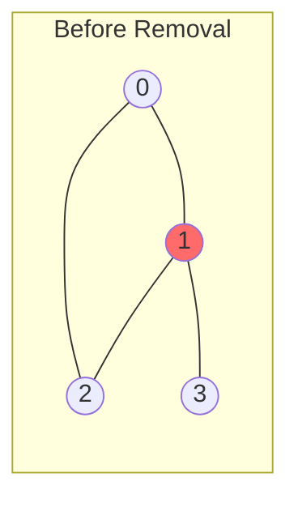

# Articulation Points (Cut Vertices)

## Overview

| Property | Value |
|----------|-------|
| **Category** | Graph Connectivity |
| **Complexity (Time)** | O(V + E) |
| **Complexity (Space)** | O(V) |
| **Graph Type** | Undirected |
| **Best For** | Network reliability analysis |

## Description

An articulation point (or cut vertex) is a vertex in an undirected graph whose removal disconnects the graph (or increases the number of connected components). Identifying articulation points is crucial for understanding the vulnerability of networks.

A vertex $v$ is an articulation point if:
1. $v$ is the root of DFS tree with two or more children, OR
2. $v$ is not the root and has a child $u$ such that no vertex in the subtree rooted at $u$ has a back edge to an ancestor of $v$

## Mathematical Foundation

### Definitions

**Articulation Point**: Vertex $v$ such that:
$$\text{components}(G - v) > \text{components}(G)$$

### Discovery and Low Values

**Discovery time** $d[v]$: When vertex $v$ is first visited in DFS

**Low value** $low[v]$: Minimum of:
$$low[v] = \min\begin{cases}
d[v] \\
d[w] \text{ for all back edges } (v, w) \\
low[u] \text{ for all tree edges } (v, u)
\end{cases}$$

### Articulation Point Conditions

For non-root vertex $v$ with child $u$:
$$low[u] \geq d[v] \Rightarrow v \text{ is articulation point}$$

For root vertex $r$:
$$|\text{children}(r)| \geq 2 \Rightarrow r \text{ is articulation point}$$

### Biconnected Components

Maximal subgraphs with no articulation points. A graph is biconnected if it has no articulation points.

## Algorithm

### Pseudocode

```
FIND_ARTICULATION_POINTS(G):
    visited[] ← all false
    disc[] ← all 0
    low[] ← all 0
    parent[] ← all -1
    is_articulation[] ← all false
    time ← 0
    
    for each vertex v:
        if not visited[v]:
            DFS_AP(v)
    
    return vertices where is_articulation[v] = true

DFS_AP(u):
    children ← 0
    visited[u] ← true
    disc[u] ← low[u] ← time
    time ← time + 1
    
    for each neighbor v of u:
        if not visited[v]:
            children ← children + 1
            parent[v] ← u
            DFS_AP(v)
            
            // Update low value
            low[u] ← min(low[u], low[v])
            
            // Check articulation point conditions
            if parent[u] == -1 AND children > 1:
                is_articulation[u] ← true
            
            if parent[u] != -1 AND low[v] >= disc[u]:
                is_articulation[u] ← true
        
        else if v != parent[u]:
            // Back edge
            low[u] ← min(low[u], disc[v])
```

### Step-by-Step Execution

```
Graph:
    0 --- 1 --- 3
    |     |
    2 ----+

Edges: (0,1), (0,2), (1,2), (1,3)

DFS from vertex 0:

Step 1: Visit 0
    disc[0] = low[0] = 0
    
Step 2: Visit 1 (neighbor of 0)
    disc[1] = low[1] = 1
    parent[1] = 0
    
Step 3: Visit 2 (neighbor of 1)
    disc[2] = low[2] = 2
    parent[2] = 1
    
Step 4: Back edge 2→0
    low[2] = min(2, disc[0]) = min(2, 0) = 0
    
Step 5: Return to 1
    low[1] = min(1, low[2]) = min(1, 0) = 0
    Check: low[2]=0 >= disc[1]=1? No
    
Step 6: Visit 3 (neighbor of 1)
    disc[3] = low[3] = 3
    parent[3] = 1
    
Step 7: Return to 1
    low[1] = min(0, low[3]) = min(0, 3) = 0
    Check: low[3]=3 >= disc[1]=1? YES → 1 is articulation point!
    
Step 8: Return to 0
    low[0] = min(0, low[1]) = 0
    parent[0] = -1, children = 1
    Check: Root with children > 1? No

Result: Vertex 1 is an articulation point
```

## Complexity Analysis

### Time Complexity

- DFS traversal: O(V + E)
- Each vertex processed once
- Each edge examined twice (undirected)
- Total: **O(V + E)**

### Space Complexity

- Discovery array: O(V)
- Low array: O(V)
- Parent array: O(V)
- Visited array: O(V)
- Recursion stack: O(V)
- Total: **O(V)**

## Visual Representation

```mermaid
flowchart TD
    A[Start DFS] --> B[Visit vertex u]
    B --> C[Set disc[u] = low[u] = time++]
    C --> D{For each neighbor v}
    D --> E{v visited?}
    E -->|No| F[DFS on v]
    F --> G[low[u] = min low[u], low[v]]
    G --> H{Is u root?}
    H -->|Yes| I{children > 1?}
    I -->|Yes| J[u is articulation point]
    H -->|No| K{low[v] >= disc[u]?}
    K -->|Yes| J
    E -->|Yes| L{v != parent?}
    L -->|Yes| M[low[u] = min low[u], disc[v]]
    D --> N[Done]
```

### Graph Example


*Vertex 1 (red) is articulation point - removing it disconnects vertex 3*

## Implementation

### Python Implementation

```python
from __future__ import annotations
from typing import Dict, List, Set, Tuple


def compute_ap(graph: Dict[int, List[int]]) -> List[int]:
    """
    Find all articulation points in an undirected graph.
    
    Uses Tarjan's algorithm with DFS.
    
    Args:
        graph: Adjacency list representation
    
    Returns:
        List of articulation point vertices
    
    >>> graph = {0: [1, 2], 1: [0, 2, 3], 2: [0, 1], 3: [1]}
    >>> sorted(compute_ap(graph))
    [1]
    >>> graph = {0: [1], 1: [0, 2], 2: [1, 3], 3: [2]}
    >>> sorted(compute_ap(graph))
    [1, 2]
    """
    if not graph:
        return []
    
    n = len(graph)
    visited = [False] * n
    disc = [0] * n
    low = [0] * n
    parent = [-1] * n
    is_articulation = [False] * n
    time = [0]  # Mutable for nested function
    
    def dfs(u: int) -> None:
        children = 0
        visited[u] = True
        disc[u] = low[u] = time[0]
        time[0] += 1
        
        for v in graph[u]:
            if not visited[v]:
                children += 1
                parent[v] = u
                dfs(v)
                
                # Update low value
                low[u] = min(low[u], low[v])
                
                # Root with multiple children
                if parent[u] == -1 and children > 1:
                    is_articulation[u] = True
                
                # Non-root with no back edge from subtree
                if parent[u] != -1 and low[v] >= disc[u]:
                    is_articulation[u] = True
            
            elif v != parent[u]:
                # Back edge
                low[u] = min(low[u], disc[v])
    
    # Run DFS from each unvisited vertex
    for i in range(n):
        if not visited[i]:
            dfs(i)
    
    return [i for i in range(n) if is_articulation[i]]


class ArticulationPointFinder:
    """
    Class-based implementation for articulation point detection.
    """
    
    def __init__(self):
        self.time = 0
    
    def find_articulation_points(
        self, 
        adj_list: Dict[int, List[int]]
    ) -> Set[int]:
        """
        Find articulation points in undirected graph.
        
        >>> finder = ArticulationPointFinder()
        >>> graph = {0: [1, 2], 1: [0, 2, 3], 2: [0, 1], 3: [1]}
        >>> finder.find_articulation_points(graph)
        {1}
        """
        if not adj_list:
            return set()
        
        vertices = set(adj_list.keys())
        for neighbors in adj_list.values():
            vertices.update(neighbors)
        
        n = max(vertices) + 1
        
        self.time = 0
        visited = [False] * n
        disc = [0] * n
        low = [0] * n
        parent = [-1] * n
        articulation_points = set()
        
        def dfs(u: int) -> None:
            children = 0
            visited[u] = True
            disc[u] = low[u] = self.time
            self.time += 1
            
            for v in adj_list.get(u, []):
                if not visited[v]:
                    children += 1
                    parent[v] = u
                    dfs(v)
                    
                    low[u] = min(low[u], low[v])
                    
                    # Check articulation conditions
                    if parent[u] == -1 and children > 1:
                        articulation_points.add(u)
                    if parent[u] != -1 and low[v] >= disc[u]:
                        articulation_points.add(u)
                
                elif v != parent[u]:
                    low[u] = min(low[u], disc[v])
        
        for v in vertices:
            if not visited[v]:
                dfs(v)
        
        return articulation_points


def find_biconnected_components(
    graph: Dict[int, List[int]]
) -> Tuple[List[Set[int]], Set[int]]:
    """
    Find all biconnected components and articulation points.
    
    A biconnected component is a maximal subgraph with no articulation points.
    
    Returns:
        (list of biconnected components, set of articulation points)
    
    >>> graph = {0: [1, 2], 1: [0, 2, 3], 2: [0, 1], 3: [1]}
    >>> components, aps = find_biconnected_components(graph)
    >>> len(components)
    2
    >>> aps
    {1}
    """
    if not graph:
        return [], set()
    
    vertices = set(graph.keys())
    n = max(vertices) + 1
    
    visited = [False] * n
    disc = [0] * n
    low = [0] * n
    parent = [-1] * n
    time = [0]
    
    edge_stack: List[Tuple[int, int]] = []
    components: List[Set[int]] = []
    articulation_points: Set[int] = set()
    
    def dfs(u: int) -> None:
        children = 0
        visited[u] = True
        disc[u] = low[u] = time[0]
        time[0] += 1
        
        for v in graph.get(u, []):
            if not visited[v]:
                children += 1
                parent[v] = u
                edge_stack.append((u, v))
                
                dfs(v)
                
                low[u] = min(low[u], low[v])
                
                # Check if u is articulation point
                is_ap = False
                if parent[u] == -1 and children > 1:
                    is_ap = True
                if parent[u] != -1 and low[v] >= disc[u]:
                    is_ap = True
                
                if is_ap:
                    articulation_points.add(u)
                
                # Pop edges to form biconnected component
                if (parent[u] == -1 and children > 1) or \
                   (parent[u] != -1 and low[v] >= disc[u]):
                    component = set()
                    while edge_stack and edge_stack[-1] != (u, v):
                        e = edge_stack.pop()
                        component.add(e[0])
                        component.add(e[1])
                    if edge_stack:
                        e = edge_stack.pop()
                        component.add(e[0])
                        component.add(e[1])
                    if component:
                        components.append(component)
            
            elif v != parent[u] and disc[v] < disc[u]:
                edge_stack.append((u, v))
                low[u] = min(low[u], disc[v])
    
    for v in vertices:
        if not visited[v]:
            dfs(v)
            # Remaining edges form a component
            if edge_stack:
                component = set()
                while edge_stack:
                    e = edge_stack.pop()
                    component.add(e[0])
                    component.add(e[1])
                if component:
                    components.append(component)
    
    return components, articulation_points


if __name__ == "__main__":
    import doctest
    doctest.testmod()
```

### Iterative Implementation

```python
from typing import Dict, List, Set


def find_articulation_points_iterative(
    graph: Dict[int, List[int]]
) -> Set[int]:
    """
    Iterative implementation using explicit stack.
    
    Avoids recursion limit issues for large graphs.
    """
    if not graph:
        return set()
    
    vertices = set(graph.keys())
    for neighbors in graph.values():
        vertices.update(neighbors)
    
    n = max(vertices) + 1
    
    visited = [False] * n
    disc = [0] * n
    low = [0] * n
    parent = [-1] * n
    children = [0] * n
    articulation_points = set()
    
    time = 0
    
    for start in vertices:
        if visited[start]:
            continue
        
        # Stack: (vertex, neighbor_index, phase)
        # phase 0: entering, phase 1: returning from child
        stack = [(start, 0, 0, -1)]  # vertex, neighbor_idx, phase, child
        
        while stack:
            u, idx, phase, child = stack.pop()
            neighbors = graph.get(u, [])
            
            if phase == 0:
                visited[u] = True
                disc[u] = low[u] = time
                time += 1
            
            elif phase == 1 and child != -1:
                # Returned from child
                low[u] = min(low[u], low[child])
                
                if parent[u] == -1 and children[u] > 1:
                    articulation_points.add(u)
                if parent[u] != -1 and low[child] >= disc[u]:
                    articulation_points.add(u)
            
            # Continue with remaining neighbors
            while idx < len(neighbors):
                v = neighbors[idx]
                idx += 1
                
                if not visited[v]:
                    children[u] += 1
                    parent[v] = u
                    
                    # Push current state to resume later
                    stack.append((u, idx, 1, v))
                    # Push new vertex to explore
                    stack.append((v, 0, 0, -1))
                    break
                
                elif v != parent[u]:
                    low[u] = min(low[u], disc[v])
    
    return articulation_points
```

## Real-World Applications

### 1. Network Reliability Analysis

```python
from dataclasses import dataclass
from typing import Dict, List, Set, Tuple
from enum import Enum


class NodeType(Enum):
    ROUTER = "router"
    SWITCH = "switch"
    SERVER = "server"
    ENDPOINT = "endpoint"


@dataclass
class NetworkNode:
    """Network device."""
    id: str
    node_type: NodeType
    is_critical: bool = False


class NetworkAnalyzer:
    """
    Analyze network reliability using articulation points.
    """
    
    def __init__(self):
        self.nodes: Dict[str, NetworkNode] = {}
        self.connections: Dict[str, List[str]] = {}
    
    def add_node(self, node_id: str, node_type: NodeType) -> None:
        """Add network node."""
        self.nodes[node_id] = NetworkNode(node_id, node_type)
        if node_id not in self.connections:
            self.connections[node_id] = []
    
    def add_connection(self, node1: str, node2: str) -> None:
        """Add bidirectional connection."""
        if node1 not in self.connections:
            self.connections[node1] = []
        if node2 not in self.connections:
            self.connections[node2] = []
        
        self.connections[node1].append(node2)
        self.connections[node2].append(node1)
    
    def find_critical_nodes(self) -> Set[str]:
        """
        Find nodes whose failure disconnects the network.
        """
        # Build integer graph for algorithm
        node_to_int = {node: i for i, node in enumerate(self.nodes.keys())}
        int_to_node = {i: node for node, i in node_to_int.items()}
        
        int_graph: Dict[int, List[int]] = {}
        for node, neighbors in self.connections.items():
            int_graph[node_to_int[node]] = [
                node_to_int[n] for n in neighbors if n in node_to_int
            ]
        
        # Find articulation points
        critical_ints = self._find_articulation_points(int_graph)
        
        # Map back to node IDs
        critical_nodes = {int_to_node[i] for i in critical_ints}
        
        # Mark as critical
        for node_id in critical_nodes:
            self.nodes[node_id].is_critical = True
        
        return critical_nodes
    
    def _find_articulation_points(
        self, 
        graph: Dict[int, List[int]]
    ) -> Set[int]:
        """Standard articulation point algorithm."""
        if not graph:
            return set()
        
        n = max(graph.keys()) + 1
        visited = [False] * n
        disc = [0] * n
        low = [0] * n
        parent = [-1] * n
        ap = set()
        time = [0]
        
        def dfs(u: int) -> None:
            children = 0
            visited[u] = True
            disc[u] = low[u] = time[0]
            time[0] += 1
            
            for v in graph.get(u, []):
                if not visited[v]:
                    children += 1
                    parent[v] = u
                    dfs(v)
                    low[u] = min(low[u], low[v])
                    
                    if parent[u] == -1 and children > 1:
                        ap.add(u)
                    if parent[u] != -1 and low[v] >= disc[u]:
                        ap.add(u)
                elif v != parent[u]:
                    low[u] = min(low[u], disc[v])
        
        for v in graph:
            if not visited[v]:
                dfs(v)
        
        return ap
    
    def generate_redundancy_report(self) -> Dict[str, any]:
        """
        Generate network redundancy analysis report.
        """
        critical_nodes = self.find_critical_nodes()
        
        # Analyze by node type
        critical_by_type = {}
        for node_id in critical_nodes:
            node_type = self.nodes[node_id].node_type.value
            if node_type not in critical_by_type:
                critical_by_type[node_type] = []
            critical_by_type[node_type].append(node_id)
        
        # Calculate metrics
        total_nodes = len(self.nodes)
        critical_count = len(critical_nodes)
        
        return {
            "total_nodes": total_nodes,
            "critical_nodes": list(critical_nodes),
            "critical_count": critical_count,
            "vulnerability_ratio": critical_count / total_nodes if total_nodes > 0 else 0,
            "critical_by_type": critical_by_type,
            "recommendations": self._generate_recommendations(critical_nodes)
        }
    
    def _generate_recommendations(
        self, 
        critical_nodes: Set[str]
    ) -> List[str]:
        """Generate redundancy recommendations."""
        recommendations = []
        
        for node_id in critical_nodes:
            node = self.nodes[node_id]
            if node.node_type == NodeType.ROUTER:
                recommendations.append(
                    f"Add redundant router parallel to {node_id}"
                )
            elif node.node_type == NodeType.SWITCH:
                recommendations.append(
                    f"Create bypass connection around switch {node_id}"
                )
        
        return recommendations


def demo_network_analysis():
    """Demo network reliability analysis."""
    analyzer = NetworkAnalyzer()
    
    # Add nodes
    nodes = [
        ("R1", NodeType.ROUTER),
        ("R2", NodeType.ROUTER),
        ("S1", NodeType.SWITCH),
        ("S2", NodeType.SWITCH),
        ("SRV1", NodeType.SERVER),
        ("SRV2", NodeType.SERVER),
    ]
    
    for node_id, node_type in nodes:
        analyzer.add_node(node_id, node_type)
    
    # Add connections (star topology through S1)
    connections = [
        ("R1", "S1"),
        ("R2", "S1"),
        ("S1", "S2"),
        ("S2", "SRV1"),
        ("S2", "SRV2"),
    ]
    
    for n1, n2 in connections:
        analyzer.add_connection(n1, n2)
    
    report = analyzer.generate_redundancy_report()
    return report
```

### 2. Social Network Analysis

```python
from typing import Dict, List, Set, Tuple


class SocialNetworkAnalyzer:
    """
    Analyze social network for key connectors.
    """
    
    def __init__(self):
        self.users: Set[str] = set()
        self.friendships: Dict[str, Set[str]] = {}
    
    def add_user(self, user_id: str) -> None:
        """Add user to network."""
        self.users.add(user_id)
        if user_id not in self.friendships:
            self.friendships[user_id] = set()
    
    def add_friendship(self, user1: str, user2: str) -> None:
        """Add bidirectional friendship."""
        self.add_user(user1)
        self.add_user(user2)
        self.friendships[user1].add(user2)
        self.friendships[user2].add(user1)
    
    def find_key_connectors(self) -> Set[str]:
        """
        Find users who connect different social groups.
        
        These are articulation points in the friendship graph.
        """
        # Build adjacency list
        user_to_int = {user: i for i, user in enumerate(self.users)}
        int_to_user = {i: user for user, i in user_to_int.items()}
        
        graph: Dict[int, List[int]] = {}
        for user, friends in self.friendships.items():
            graph[user_to_int[user]] = [user_to_int[f] for f in friends]
        
        # Find articulation points
        ap_ints = self._find_aps(graph)
        
        return {int_to_user[i] for i in ap_ints}
    
    def _find_aps(self, graph: Dict[int, List[int]]) -> Set[int]:
        """Find articulation points."""
        if not graph:
            return set()
        
        n = max(graph.keys()) + 1 if graph else 0
        visited = [False] * n
        disc = [0] * n
        low = [0] * n
        parent = [-1] * n
        aps = set()
        time = [0]
        
        def dfs(u: int) -> None:
            children = 0
            visited[u] = True
            disc[u] = low[u] = time[0]
            time[0] += 1
            
            for v in graph.get(u, []):
                if not visited[v]:
                    children += 1
                    parent[v] = u
                    dfs(v)
                    low[u] = min(low[u], low[v])
                    
                    if parent[u] == -1 and children > 1:
                        aps.add(u)
                    if parent[u] != -1 and low[v] >= disc[u]:
                        aps.add(u)
                elif v != parent[u]:
                    low[u] = min(low[u], disc[v])
        
        for v in graph:
            if not visited[v]:
                dfs(v)
        
        return aps
    
    def analyze_community_structure(self) -> Dict[str, any]:
        """
        Analyze community structure around key connectors.
        """
        key_connectors = self.find_key_connectors()
        
        # Find communities (connected components after removing connectors)
        remaining = {u for u in self.users if u not in key_connectors}
        
        communities = []
        visited = set()
        
        for user in remaining:
            if user in visited:
                continue
            
            # BFS to find community
            community = set()
            queue = [user]
            
            while queue:
                current = queue.pop(0)
                if current in visited or current in key_connectors:
                    continue
                
                visited.add(current)
                community.add(current)
                
                for friend in self.friendships.get(current, []):
                    if friend not in visited and friend not in key_connectors:
                        queue.append(friend)
            
            if community:
                communities.append(community)
        
        return {
            "key_connectors": list(key_connectors),
            "num_communities": len(communities),
            "communities": [list(c) for c in communities],
            "connector_influence": {
                connector: len(self.friendships.get(connector, []))
                for connector in key_connectors
            }
        }
```

## Variations

### Tarjan's Bridge-Finding Algorithm

Related algorithm that finds bridges (cut edges) instead of cut vertices.

### Block-Cut Tree

Data structure representing the biconnected components and articulation points.

## References

1. Tarjan, R.E. "Depth-first search and linear graph algorithms" (1972)
2. [Articulation Points - Wikipedia](https://en.wikipedia.org/wiki/Biconnected_component)
3. Hopcroft, J., Tarjan, R. "Algorithm 447: efficient algorithms for graph manipulation"

## See Also

- [Bridges (Cut Edges)](bridges.md) - Related connectivity concept
- [Strongly Connected Components](strongly_connected_components.md) - For directed graphs
- [Depth-First Search](depth_first_search.md) - Foundation algorithm
