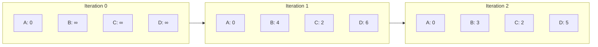

# Bellman-Ford Algorithm

## Overview

| Property | Value |
|----------|-------|
| **Category** | Shortest Path |
| **Complexity (Time)** | O(V × E) |
| **Complexity (Space)** | O(V) |
| **Graph Type** | Weighted, allows negative edges |
| **Best For** | Graphs with negative weights, cycle detection |

## Description

The Bellman-Ford algorithm computes shortest paths from a single source vertex to all other vertices in a weighted directed graph. Unlike Dijkstra's algorithm, Bellman-Ford can handle graphs with negative edge weights and detect negative-weight cycles. Named after Richard Bellman and Lester Ford Jr., who published it in 1958 and 1956 respectively.

The algorithm works by repeatedly relaxing all edges, guaranteeing that after $|V| - 1$ iterations, all shortest paths are found (assuming no negative cycles).

## Mathematical Foundation

### Relaxation Principle

For edge $(u, v)$ with weight $w$:

$$d[v] = \min(d[v], d[u] + w(u, v))$$

### Path Length Bound

A shortest path in a graph with $V$ vertices contains at most $V - 1$ edges:

$$|p| \leq V - 1$$

### Iterative Improvement

After $i$ iterations, $d[v]$ contains the shortest path using at most $i$ edges:

$$d^{(i)}[v] = \min_{(u,v) \in E}\{d^{(i-1)}[u] + w(u, v), d^{(i-1)}[v]\}$$

### Negative Cycle Detection

After $V - 1$ iterations, if any edge can still be relaxed, a negative cycle exists:

$$\exists (u, v) \in E : d[v] > d[u] + w(u, v) \implies \text{negative cycle}$$

### Correctness Theorem

If no negative cycles are reachable from source $s$, after $V - 1$ iterations:

$$d[v] = \delta(s, v) \quad \forall v \in V$$

where $\delta(s, v)$ is the true shortest path distance.

## Algorithm

### Pseudocode

```
BELLMAN-FORD(graph G, source s):
    // Step 1: Initialize distances
    for each vertex v in V:
        dist[v] ← ∞
        pred[v] ← NULL
    dist[s] ← 0
    
    // Step 2: Relax edges V-1 times
    for i from 1 to |V| - 1:
        for each edge (u, v) with weight w in E:
            if dist[u] + w < dist[v]:
                dist[v] ← dist[u] + w
                pred[v] ← u
    
    // Step 3: Check for negative cycles
    for each edge (u, v) with weight w in E:
        if dist[u] + w < dist[v]:
            return "Negative cycle detected"
    
    return dist, pred
```

### Step-by-Step Execution

```
Graph edges:
  A → B: 4
  A → C: 2
  B → C: 3
  B → D: 2
  B → E: 3
  C → B: 1
  C → D: 4
  C → E: 5
  E → D: -5

Source: A
V = 5, so we do 4 iterations

Initial:
  dist = {A: 0, B: ∞, C: ∞, D: ∞, E: ∞}

Iteration 1:
  Relax A→B: dist[B] = min(∞, 0+4) = 4
  Relax A→C: dist[C] = min(∞, 0+2) = 2
  Relax C→B: dist[B] = min(4, 2+1) = 3
  Relax C→D: dist[D] = min(∞, 2+4) = 6
  Relax C→E: dist[E] = min(∞, 2+5) = 7
  dist = {A: 0, B: 3, C: 2, D: 6, E: 7}

Iteration 2:
  Relax B→D: dist[D] = min(6, 3+2) = 5
  Relax B→E: dist[E] = min(7, 3+3) = 6
  Relax E→D: dist[D] = min(5, 6-5) = 1
  dist = {A: 0, B: 3, C: 2, D: 1, E: 6}

Iteration 3:
  E→D: dist[D] = min(1, 6-5) = 1 (no change)
  dist = {A: 0, B: 3, C: 2, D: 1, E: 6}

Iteration 4:
  No changes (converged)

Negative cycle check:
  No edge can be relaxed further → No negative cycle

Final: dist = {A: 0, B: 3, C: 2, D: 1, E: 6}
```

## Complexity Analysis

### Time Complexity

| Operation | Complexity |
|-----------|------------|
| Initialization | O(V) |
| Main loop (V-1 iterations) | O(V) |
| Each iteration processes all edges | O(E) |
| Negative cycle check | O(E) |
| **Total** | **O(V × E)** |

### Space Complexity

| Component | Space |
|-----------|-------|
| Distance array | O(V) |
| Predecessor array | O(V) |
| Edge list | O(E) |
| **Total** | **O(V + E)** |

## Visual Representation

```mermaid
flowchart TD
    A[Initialize: dist[source]=0, others=∞] --> B[Set iteration count = 0]
    B --> C{iteration < V-1?}
    C -->|No| D[Check for negative cycles]
    C -->|Yes| E[For each edge u→v]
    E --> F{dist[u] + w < dist[v]?}
    F -->|Yes| G[Update dist[v] = dist[u] + w]
    G --> H[Set pred[v] = u]
    H --> E
    F -->|No| E
    E -->|Done| I[iteration++]
    I --> C
    D --> J[For each edge u→v]
    J --> K{dist[u] + w < dist[v]?}
    K -->|Yes| L[Return: Negative cycle exists]
    K -->|No| J
    J -->|Done| M[Return: distances and predecessors]
```

### Relaxation Progress



## Implementation

### Python Implementation

```python
from __future__ import annotations


def bellman_ford(
    graph: list[dict[str, int]],
    vertex_count: int,
    edge_count: int,
    src: int
) -> list[float]:
    """
    Bellman-Ford algorithm for single-source shortest paths.
    
    Args:
        graph: List of edges as dicts with 'src', 'dst', 'weight'
        vertex_count: Number of vertices
        edge_count: Number of edges
        src: Source vertex
    
    Returns:
        List of shortest distances from source
    
    Raises:
        ValueError: If negative cycle is detected
    
    Examples:
        >>> edges = [
        ...     {"src": 0, "dst": 1, "weight": 4},
        ...     {"src": 0, "dst": 2, "weight": 2},
        ...     {"src": 1, "dst": 2, "weight": 3},
        ...     {"src": 2, "dst": 1, "weight": 1},
        ...     {"src": 1, "dst": 3, "weight": 2},
        ...     {"src": 2, "dst": 3, "weight": 4}
        ... ]
        >>> bellman_ford(edges, 4, 6, 0)
        [0, 3, 2, 5]
    """
    # Initialize distances
    dist = [float("inf")] * vertex_count
    dist[src] = 0
    
    # Relax edges V-1 times
    for _ in range(vertex_count - 1):
        for edge in graph:
            u, v, w = edge["src"], edge["dst"], edge["weight"]
            if dist[u] != float("inf") and dist[u] + w < dist[v]:
                dist[v] = dist[u] + w
    
    # Check for negative cycles
    for edge in graph:
        u, v, w = edge["src"], edge["dst"], edge["weight"]
        if dist[u] != float("inf") and dist[u] + w < dist[v]:
            raise ValueError("Graph contains negative weight cycle")
    
    return dist
```

### Full Implementation with Path

```python
from typing import Optional


def bellman_ford_full(
    edges: list[tuple[int, int, int]],
    n: int,
    source: int
) -> tuple[list[float], list[Optional[int]], bool]:
    """
    Bellman-Ford with path reconstruction and cycle detection.
    
    Args:
        edges: List of (u, v, weight) tuples
        n: Number of vertices
        source: Source vertex
    
    Returns:
        (distances, predecessors, has_negative_cycle)
    
    Examples:
        >>> edges = [(0, 1, 4), (0, 2, 2), (1, 2, -3), (2, 3, 2)]
        >>> dist, pred, has_cycle = bellman_ford_full(edges, 4, 0)
        >>> dist
        [0, 4, 1, 3]
        >>> has_cycle
        False
    """
    # Initialize
    dist = [float('inf')] * n
    pred: list[Optional[int]] = [None] * n
    dist[source] = 0
    
    # Relax edges n-1 times
    for i in range(n - 1):
        updated = False
        for u, v, w in edges:
            if dist[u] != float('inf') and dist[u] + w < dist[v]:
                dist[v] = dist[u] + w
                pred[v] = u
                updated = True
        
        # Early termination if no updates
        if not updated:
            break
    
    # Check for negative cycles
    has_negative_cycle = False
    for u, v, w in edges:
        if dist[u] != float('inf') and dist[u] + w < dist[v]:
            has_negative_cycle = True
            break
    
    return dist, pred, has_negative_cycle


def get_path(
    pred: list[Optional[int]],
    source: int,
    target: int
) -> list[int]:
    """
    Reconstruct path from source to target.
    
    Examples:
        >>> pred = [None, 0, 0, 2]
        >>> get_path(pred, 0, 3)
        [0, 2, 3]
    """
    if pred[target] is None and target != source:
        return []  # No path
    
    path = []
    current: Optional[int] = target
    
    while current is not None:
        path.append(current)
        current = pred[current]
    
    return path[::-1]
```

### Finding Negative Cycles

```python
def find_negative_cycle(
    edges: list[tuple[int, int, int]],
    n: int
) -> list[int]:
    """
    Find and return a negative cycle if one exists.
    
    Examples:
        >>> # Cycle: 1 → 2 → 3 → 1 with total weight -1
        >>> edges = [(0, 1, 5), (1, 2, 2), (2, 3, -4), (3, 1, 1)]
        >>> cycle = find_negative_cycle(edges, 4)
        >>> len(cycle) > 0  # Negative cycle exists
        True
    """
    dist = [0] * n  # Start from 0 to detect any cycle
    pred: list[Optional[int]] = [None] * n
    
    # Relax edges n times (one extra to detect cycle)
    last_updated = -1
    for _ in range(n):
        last_updated = -1
        for u, v, w in edges:
            if dist[u] + w < dist[v]:
                dist[v] = dist[u] + w
                pred[v] = u
                last_updated = v
    
    if last_updated == -1:
        return []  # No negative cycle
    
    # Find vertex in the cycle
    v = last_updated
    for _ in range(n):
        v = pred[v]
    
    # Reconstruct cycle
    cycle = []
    current = v
    while True:
        cycle.append(current)
        current = pred[current]
        if current == v:
            cycle.append(v)
            break
    
    return cycle[::-1]
```

### SPFA (Shortest Path Faster Algorithm)

```python
from collections import deque


def spfa(
    graph: dict[int, list[tuple[int, int]]],
    source: int,
    n: int
) -> tuple[list[float], bool]:
    """
    SPFA - optimized Bellman-Ford using queue.
    
    Args:
        graph: Adjacency list {vertex: [(neighbor, weight), ...]}
        source: Source vertex
        n: Number of vertices
    
    Returns:
        (distances, has_negative_cycle)
    
    Examples:
        >>> graph = {0: [(1, 4), (2, 2)], 1: [(2, -3)], 2: [(3, 2)], 3: []}
        >>> dist, has_cycle = spfa(graph, 0, 4)
        >>> dist
        [0, 4, 1, 3]
    """
    dist = [float('inf')] * n
    dist[source] = 0
    
    in_queue = [False] * n
    count = [0] * n  # Count of times vertex enters queue
    
    queue = deque([source])
    in_queue[source] = True
    
    while queue:
        u = queue.popleft()
        in_queue[u] = False
        
        for v, w in graph.get(u, []):
            if dist[u] + w < dist[v]:
                dist[v] = dist[u] + w
                
                if not in_queue[v]:
                    queue.append(v)
                    in_queue[v] = True
                    count[v] += 1
                    
                    # Negative cycle detection
                    if count[v] >= n:
                        return dist, True
    
    return dist, False
```

## Real-World Applications

### 1. Currency Arbitrage Detection

```python
import math


class ArbitrageDetector:
    """
    Detect currency arbitrage opportunities using Bellman-Ford.
    
    Arbitrage exists when exchanging currencies in a cycle yields profit.
    """
    
    def __init__(self):
        self.currencies: list[str] = []
        self.rates: dict[tuple[str, str], float] = {}
    
    def add_exchange_rate(
        self, 
        from_curr: str, 
        to_curr: str, 
        rate: float
    ) -> None:
        """Add exchange rate: 1 from_curr = rate to_curr."""
        if from_curr not in self.currencies:
            self.currencies.append(from_curr)
        if to_curr not in self.currencies:
            self.currencies.append(to_curr)
        
        self.rates[(from_curr, to_curr)] = rate
    
    def find_arbitrage(self) -> list[str]:
        """
        Find arbitrage opportunity using negative cycle detection.
        
        We convert rates to -log(rate) so that:
        - Multiplication becomes addition
        - Profitable cycle (product > 1) becomes negative cycle
        
        Examples:
            >>> detector = ArbitrageDetector()
            >>> detector.add_exchange_rate("USD", "EUR", 0.9)
            >>> detector.add_exchange_rate("EUR", "GBP", 0.8)
            >>> detector.add_exchange_rate("GBP", "USD", 1.4)
            >>> cycle = detector.find_arbitrage()
            >>> len(cycle) > 0  # Arbitrage exists
            True
        """
        n = len(self.currencies)
        idx = {c: i for i, c in enumerate(self.currencies)}
        
        # Build edges with -log(rate)
        edges = []
        for (from_c, to_c), rate in self.rates.items():
            u, v = idx[from_c], idx[to_c]
            weight = -math.log(rate)
            edges.append((u, v, weight))
        
        # Run Bellman-Ford from vertex 0
        dist = [float('inf')] * n
        pred = [None] * n
        dist[0] = 0
        
        for _ in range(n - 1):
            for u, v, w in edges:
                if dist[u] != float('inf') and dist[u] + w < dist[v]:
                    dist[v] = dist[u] + w
                    pred[v] = u
        
        # Check for negative cycle
        for u, v, w in edges:
            if dist[u] != float('inf') and dist[u] + w < dist[v]:
                # Found negative cycle - reconstruct it
                cycle = self._find_cycle(pred, v, n)
                return [self.currencies[i] for i in cycle]
        
        return []
    
    def _find_cycle(
        self, 
        pred: list, 
        start: int, 
        n: int
    ) -> list[int]:
        """Find cycle containing start vertex."""
        # Go back n times to ensure we're in the cycle
        v = start
        for _ in range(n):
            v = pred[v]
        
        # Reconstruct cycle
        cycle = [v]
        current = pred[v]
        while current != v:
            cycle.append(current)
            current = pred[current]
        cycle.append(v)
        
        return cycle[::-1]
```

### 2. Network Delay Simulation

```python
from dataclasses import dataclass


@dataclass
class NetworkLink:
    """Network link with potential negative delay (time correction)."""
    source: str
    destination: str
    delay: int  # Can be negative for time sync corrections


class NetworkDelayAnalyzer:
    """
    Analyze network delays including time synchronization adjustments.
    """
    
    def __init__(self):
        self.nodes: set[str] = set()
        self.links: list[NetworkLink] = []
    
    def add_link(
        self, 
        source: str, 
        dest: str, 
        delay: int
    ) -> None:
        """Add network link with delay (can be negative)."""
        self.nodes.add(source)
        self.nodes.add(dest)
        self.links.append(NetworkLink(source, dest, delay))
    
    def compute_delays(
        self, 
        source_node: str
    ) -> dict[str, int] | None:
        """
        Compute minimum delays from source to all nodes.
        
        Returns None if timing inconsistency (negative cycle) exists.
        
        Examples:
            >>> analyzer = NetworkDelayAnalyzer()
            >>> analyzer.add_link("Server", "Router1", 10)
            >>> analyzer.add_link("Router1", "Router2", 5)
            >>> analyzer.add_link("Router2", "Client", 8)
            >>> delays = analyzer.compute_delays("Server")
            >>> delays["Client"]
            23
        """
        nodes = list(self.nodes)
        n = len(nodes)
        idx = {node: i for i, node in enumerate(nodes)}
        
        dist = [float('inf')] * n
        source_idx = idx[source_node]
        dist[source_idx] = 0
        
        # Convert links to edges
        edges = [
            (idx[link.source], idx[link.destination], link.delay)
            for link in self.links
        ]
        
        # Bellman-Ford
        for _ in range(n - 1):
            for u, v, w in edges:
                if dist[u] != float('inf') and dist[u] + w < dist[v]:
                    dist[v] = dist[u] + w
        
        # Check for negative cycle (timing inconsistency)
        for u, v, w in edges:
            if dist[u] != float('inf') and dist[u] + w < dist[v]:
                return None  # Inconsistent timing
        
        return {
            node: dist[idx[node]] 
            for node in nodes 
            if dist[idx[node]] != float('inf')
        }
```

### 3. Difference Constraints System

```python
class DifferenceConstraintsSolver:
    """
    Solve system of difference constraints using Bellman-Ford.
    
    Constraints of form: x_j - x_i <= c_ij
    """
    
    def __init__(self, num_variables: int):
        self.n = num_variables
        self.constraints: list[tuple[int, int, int]] = []
    
    def add_constraint(self, i: int, j: int, c: int) -> None:
        """
        Add constraint: x_j - x_i <= c
        
        Modeled as edge (i, j) with weight c.
        """
        self.constraints.append((i, j, c))
    
    def solve(self) -> list[int] | None:
        """
        Find solution satisfying all constraints.
        
        Returns None if no solution exists (negative cycle).
        
        Examples:
            >>> solver = DifferenceConstraintsSolver(3)
            >>> solver.add_constraint(0, 1, 5)   # x1 - x0 <= 5
            >>> solver.add_constraint(0, 2, 4)   # x2 - x0 <= 4
            >>> solver.add_constraint(1, 2, -3)  # x2 - x1 <= -3 (x2 < x1 - 3)
            >>> solution = solver.solve()
            >>> solution[1] - solution[0] <= 5
            True
            >>> solution[2] - solution[1] <= -3
            True
        """
        # Add source vertex connected to all with weight 0
        n = self.n + 1
        source = self.n
        
        edges = [(source, i, 0) for i in range(self.n)]
        edges.extend(self.constraints)
        
        # Bellman-Ford from source
        dist = [float('inf')] * n
        dist[source] = 0
        
        for _ in range(n - 1):
            for u, v, w in edges:
                if dist[u] != float('inf') and dist[u] + w < dist[v]:
                    dist[v] = dist[u] + w
        
        # Check for negative cycle
        for u, v, w in edges:
            if dist[u] != float('inf') and dist[u] + w < dist[v]:
                return None
        
        return [int(dist[i]) for i in range(self.n)]
```

## Comparison with Dijkstra

| Aspect | Bellman-Ford | Dijkstra |
|--------|--------------|----------|
| Time complexity | O(VE) | O((V+E) log V) |
| Negative weights | ✓ Handles | ✗ Fails |
| Negative cycles | ✓ Detects | ✗ Cannot detect |
| Implementation | Simpler | More complex |
| Best use case | Sparse graphs, neg weights | Dense graphs, non-neg |

## Optimizations

| Optimization | Description | Benefit |
|--------------|-------------|---------|
| **Early termination** | Stop if no updates in iteration | Faster on sparse graphs |
| **SPFA** | Queue-based relaxation | O(VE) worst, faster average |
| **Yen's optimization** | Alternate edge order | Can reduce iterations |

## References

1. Bellman, R. "On a routing problem" (1958)
2. Ford, L.R. "Network Flow Theory" (1956)
3. [Bellman-Ford Algorithm - Wikipedia](https://en.wikipedia.org/wiki/Bellman%E2%80%93Ford_algorithm)
4. Cormen, T.H. "Introduction to Algorithms" - Chapter 24.1

## See Also

- [Dijkstra's Algorithm](dijkstra.md) - Faster for non-negative weights
- [Floyd-Warshall](floyd_warshall.md) - All-pairs shortest paths
- [SPFA](spfa.md) - Queue-based Bellman-Ford optimization
- [Johnson's Algorithm](johnsons_algorithm.md) - All-pairs with negative weights
