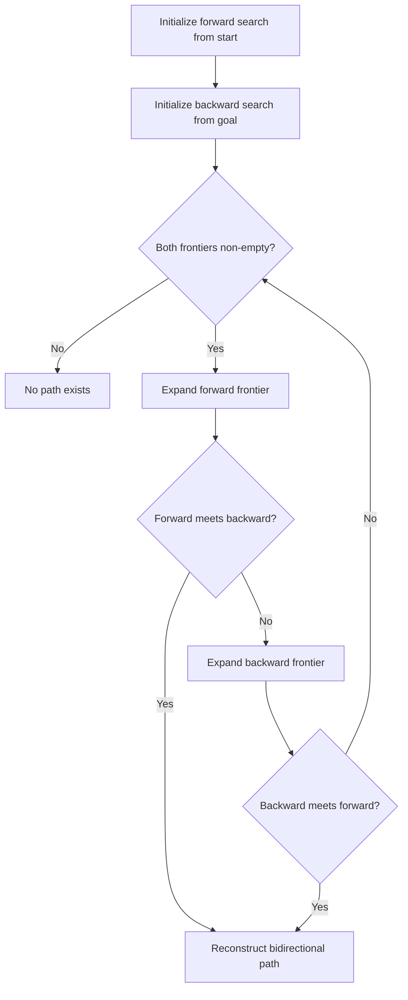
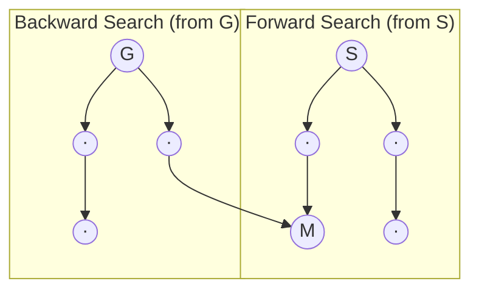

# Bidirectional A* Algorithm

## Overview

| Property | Value |
|----------|-------|
| **Category** | Pathfinding |
| **Complexity (Time)** | O(b^(d/2)) where b = branching factor, d = depth |
| **Complexity (Space)** | O(b^(d/2)) |
| **Graph Type** | Weighted, grid-based or general |
| **Best For** | Long-distance pathfinding with known endpoints |

## Description

Bidirectional A* is an optimization of the A* algorithm that simultaneously searches from both the start and goal positions, meeting in the middle. This approach can dramatically reduce the search space, as two smaller searches of depth d/2 are typically faster than one search of depth d.

The algorithm maintains two frontier sets (open lists) and two explored sets (closed lists), alternating between forward and backward searches until their frontiers intersect.

## Mathematical Foundation

### Bidirectional Search Principle

Instead of one search expanding $b^d$ nodes:
$$\text{Single A*}: O(b^d)$$

Two searches each expand $b^{d/2}$ nodes:
$$\text{Bidirectional}: O(2 \cdot b^{d/2}) = O(b^{d/2})$$

### Heuristic Functions

Forward search uses heuristic to goal:
$$h_f(n) = h(n, \text{goal})$$

Backward search uses heuristic to start:
$$h_b(n) = h(n, \text{start})$$

### Meeting Condition

Searches meet when:
$$\text{pos}_{\text{forward}} = \text{pos}_{\text{backward}}$$

### Path Cost

Total path cost when meeting at node $m$:
$$\text{cost} = g_f(m) + g_b(m)$$

where $g_f$ is forward path cost and $g_b$ is backward path cost.

### Admissibility

For optimal paths, both heuristics must be admissible:
$$h(n) \leq h^*(n)$$

where $h^*(n)$ is the true cost to target.

## Algorithm

### Pseudocode

```
BIDIRECTIONAL_A_STAR(start, goal):
    // Forward search initialization
    fwd_open ← priority queue with start node
    fwd_closed ← empty set
    fwd_g[start] ← 0
    
    // Backward search initialization
    bwd_open ← priority queue with goal node
    bwd_closed ← empty set
    bwd_g[goal] ← 0
    
    while fwd_open not empty AND bwd_open not empty:
        // Expand forward frontier
        fwd_current ← pop minimum f-cost from fwd_open
        
        if fwd_current in bwd_closed:
            return reconstruct_bidirectional_path(fwd_current)
        
        fwd_closed.add(fwd_current)
        
        for each neighbor of fwd_current:
            if neighbor not in fwd_closed:
                update fwd_open with neighbor
        
        // Expand backward frontier
        bwd_current ← pop minimum f-cost from bwd_open
        
        if bwd_current in fwd_closed:
            return reconstruct_bidirectional_path(bwd_current)
        
        bwd_closed.add(bwd_current)
        
        for each neighbor of bwd_current:
            if neighbor not in bwd_closed:
                update bwd_open with neighbor
    
    return NO_PATH
```

### Step-by-Step Execution

```
Grid (0 = free, 1 = obstacle):
  [0, 0, 0, 0]
  [0, 1, 0, 0]
  [0, 0, 0, 0]
  [0, 0, 1, 0]

Start: (0, 0), Goal: (3, 3)

Forward Search (→):
  Step 1: Expand (0,0) → add (0,1), (1,0)
  Step 2: Expand (0,1) → add (0,2)
  Step 3: Expand (1,0) → add (2,0)

Backward Search (←):
  Step 1: Expand (3,3) → add (2,3), (3,2)
  Step 2: Expand (2,3) → add (1,3), (2,2)
  Step 3: Expand (2,2) → add (1,2)

Meeting point found at (2,2) or nearby!

Forward path: (0,0) → (0,1) → (0,2) → (1,2)
Backward path: (1,2) → (2,2) → (2,3) → (3,3)
Complete path: (0,0) → (0,1) → (0,2) → (1,2) → (2,2) → (2,3) → (3,3)
```

## Complexity Analysis

### Time Complexity

| Scenario | Single A* | Bidirectional A* |
|----------|-----------|------------------|
| Average | O(b^d) | O(b^(d/2)) |
| Best case | O(d) | O(d/2) |
| Worst case | O(b^d) | O(b^d) |

### Space Complexity

Both algorithms store the frontier and explored sets:
- Single A*: O(b^d)
- Bidirectional A*: O(2 × b^(d/2)) = O(b^(d/2))

## Visual Representation



### Search Expansion Visualization



## Implementation

### Python Implementation

```python
from __future__ import annotations
from math import sqrt
from typing import TypeAlias

# Type aliases
Position: TypeAlias = tuple[int, int]

# Heuristic selection: 0 = Euclidean, 1 = Manhattan
HEURISTIC = 0


class Node:
    """
    Node for A* search with f-cost comparison.
    
    >>> n = Node(0, 0, 4, 3, 0, None)
    >>> n.calculate_heuristic()
    5.0
    """
    
    def __init__(
        self,
        pos_x: int,
        pos_y: int,
        goal_x: int,
        goal_y: int,
        g_cost: int,
        parent: Node | None,
    ) -> None:
        self.pos_x = pos_x
        self.pos_y = pos_y
        self.pos = (pos_y, pos_x)
        self.goal_x = goal_x
        self.goal_y = goal_y
        self.g_cost = g_cost
        self.parent = parent
        self.h_cost = self.calculate_heuristic()
        self.f_cost = self.g_cost + self.h_cost
    
    def calculate_heuristic(self) -> float:
        """Calculate heuristic distance to goal."""
        dy = self.pos_x - self.goal_x
        dx = self.pos_y - self.goal_y
        if HEURISTIC == 1:
            return abs(dx) + abs(dy)  # Manhattan
        return sqrt(dy**2 + dx**2)  # Euclidean
    
    def __lt__(self, other: Node) -> bool:
        return self.f_cost < other.f_cost
    
    def __eq__(self, other: object) -> bool:
        if not isinstance(other, Node):
            return False
        return self.pos == other.pos


class AStar:
    """Standard A* search for comparison."""
    
    def __init__(
        self, 
        start: Position, 
        goal: Position,
        grid: list[list[int]]
    ):
        self.grid = grid
        self.start = Node(start[1], start[0], goal[1], goal[0], 0, None)
        self.target = Node(goal[1], goal[0], goal[1], goal[0], 99999, None)
        self.open_nodes = [self.start]
        self.closed_nodes: list[Node] = []
        self.delta = [[-1, 0], [0, -1], [1, 0], [0, 1]]
    
    def search(self) -> list[Position]:
        """Execute A* search."""
        while self.open_nodes:
            self.open_nodes.sort()
            current = self.open_nodes.pop(0)
            
            if current.pos == self.target.pos:
                return self.retrace_path(current)
            
            self.closed_nodes.append(current)
            
            for child in self.get_successors(current):
                if child in self.closed_nodes:
                    continue
                
                if child not in self.open_nodes:
                    self.open_nodes.append(child)
                else:
                    idx = self.open_nodes.index(child)
                    existing = self.open_nodes[idx]
                    if child.g_cost < existing.g_cost:
                        self.open_nodes[idx] = child
        
        return [self.start.pos]
    
    def get_successors(self, parent: Node) -> list[Node]:
        """Get valid neighbor nodes."""
        successors = []
        for dy, dx in self.delta:
            y = parent.pos_y + dy
            x = parent.pos_x + dx
            
            if not (0 <= y < len(self.grid) and 0 <= x < len(self.grid[0])):
                continue
            if self.grid[y][x] != 0:
                continue
            
            successors.append(Node(
                x, y,
                self.target.pos_x, self.target.pos_y,
                parent.g_cost + 1,
                parent
            ))
        return successors
    
    def retrace_path(self, node: Node | None) -> list[Position]:
        """Reconstruct path from goal to start."""
        path = []
        while node is not None:
            path.append((node.pos_y, node.pos_x))
            node = node.parent
        path.reverse()
        return path


class BidirectionalAStar:
    """
    Bidirectional A* search.
    
    Searches simultaneously from start and goal,
    meeting in the middle for efficiency.
    
    >>> grid = [[0, 0, 0], [0, 1, 0], [0, 0, 0]]
    >>> bd = BidirectionalAStar((0, 0), (2, 2), grid)
    >>> len(bd.search()) > 0
    True
    """
    
    def __init__(
        self, 
        start: Position, 
        goal: Position,
        grid: list[list[int]]
    ):
        self.grid = grid
        self.fwd_astar = AStar(start, goal, grid)
        self.bwd_astar = AStar(goal, start, grid)
    
    def search(self) -> list[Position]:
        """Execute bidirectional A* search."""
        while self.fwd_astar.open_nodes or self.bwd_astar.open_nodes:
            self.fwd_astar.open_nodes.sort()
            self.bwd_astar.open_nodes.sort()
            
            if not self.fwd_astar.open_nodes or not self.bwd_astar.open_nodes:
                break
            
            fwd_current = self.fwd_astar.open_nodes.pop(0)
            bwd_current = self.bwd_astar.open_nodes.pop(0)
            
            # Check for meeting
            if bwd_current.pos == fwd_current.pos:
                return self.retrace_bidirectional_path(fwd_current, bwd_current)
            
            # Check if either reached other's closed set
            for node in self.bwd_astar.closed_nodes:
                if node.pos == fwd_current.pos:
                    return self.retrace_bidirectional_path(fwd_current, node)
            
            for node in self.fwd_astar.closed_nodes:
                if node.pos == bwd_current.pos:
                    return self.retrace_bidirectional_path(node, bwd_current)
            
            # Expand both frontiers
            self.fwd_astar.closed_nodes.append(fwd_current)
            self.bwd_astar.closed_nodes.append(bwd_current)
            
            # Update targets dynamically
            self.fwd_astar.target = bwd_current
            self.bwd_astar.target = fwd_current
            
            for astar in [self.fwd_astar, self.bwd_astar]:
                current = fwd_current if astar == self.fwd_astar else bwd_current
                
                for child in astar.get_successors(current):
                    if child in astar.closed_nodes:
                        continue
                    
                    if child not in astar.open_nodes:
                        astar.open_nodes.append(child)
                    else:
                        idx = astar.open_nodes.index(child)
                        if child.g_cost < astar.open_nodes[idx].g_cost:
                            astar.open_nodes[idx] = child
        
        return [self.fwd_astar.start.pos]
    
    def retrace_bidirectional_path(
        self, 
        fwd_node: Node, 
        bwd_node: Node
    ) -> list[Position]:
        """Combine forward and backward paths."""
        fwd_path = self.fwd_astar.retrace_path(fwd_node)
        bwd_path = self.bwd_astar.retrace_path(bwd_node)
        bwd_path.pop()  # Remove duplicate meeting point
        bwd_path.reverse()
        return fwd_path + bwd_path
```

### With Priority Queue Optimization

```python
import heapq
from dataclasses import dataclass, field
from typing import Dict, List, Set, Tuple, Optional


@dataclass(order=True)
class PQNode:
    """Priority queue node with comparison by f_cost."""
    f_cost: float
    pos: Tuple[int, int] = field(compare=False)
    g_cost: float = field(compare=False)
    parent: Optional['PQNode'] = field(default=None, compare=False)


class OptimizedBidirectionalAStar:
    """
    Optimized bidirectional A* using heapq for O(log n) operations.
    """
    
    def __init__(self, grid: List[List[int]]):
        self.grid = grid
        self.rows = len(grid)
        self.cols = len(grid[0]) if grid else 0
        self.directions = [(0, 1), (0, -1), (1, 0), (-1, 0)]
    
    def heuristic(self, a: Tuple[int, int], b: Tuple[int, int]) -> float:
        """Euclidean distance heuristic."""
        return ((a[0] - b[0])**2 + (a[1] - b[1])**2)**0.5
    
    def get_neighbors(self, pos: Tuple[int, int]) -> List[Tuple[int, int]]:
        """Get valid neighboring positions."""
        neighbors = []
        for dy, dx in self.directions:
            ny, nx = pos[0] + dy, pos[1] + dx
            if 0 <= ny < self.rows and 0 <= nx < self.cols:
                if self.grid[ny][nx] == 0:
                    neighbors.append((ny, nx))
        return neighbors
    
    def search(
        self, 
        start: Tuple[int, int], 
        goal: Tuple[int, int]
    ) -> Optional[List[Tuple[int, int]]]:
        """
        Execute optimized bidirectional A*.
        
        Returns:
            Path as list of positions, or None if no path exists
        """
        if self.grid[start[0]][start[1]] != 0 or self.grid[goal[0]][goal[1]] != 0:
            return None
        
        # Forward search structures
        fwd_open: List[PQNode] = [PQNode(0, start, 0)]
        fwd_g: Dict[Tuple[int, int], float] = {start: 0}
        fwd_parent: Dict[Tuple[int, int], Optional[Tuple[int, int]]] = {start: None}
        fwd_closed: Set[Tuple[int, int]] = set()
        
        # Backward search structures
        bwd_open: List[PQNode] = [PQNode(0, goal, 0)]
        bwd_g: Dict[Tuple[int, int], float] = {goal: 0}
        bwd_parent: Dict[Tuple[int, int], Optional[Tuple[int, int]]] = {goal: None}
        bwd_closed: Set[Tuple[int, int]] = set()
        
        best_path: Optional[List[Tuple[int, int]]] = None
        best_cost = float('inf')
        
        while fwd_open and bwd_open:
            # Termination check
            if fwd_open[0].f_cost + bwd_open[0].f_cost >= best_cost:
                break
            
            # Expand forward
            if fwd_open:
                fwd_node = heapq.heappop(fwd_open)
                
                if fwd_node.pos in fwd_closed:
                    continue
                
                fwd_closed.add(fwd_node.pos)
                
                # Check if meets backward search
                if fwd_node.pos in bwd_closed:
                    total = fwd_g[fwd_node.pos] + bwd_g[fwd_node.pos]
                    if total < best_cost:
                        best_cost = total
                        best_path = self._reconstruct_path(
                            fwd_node.pos, fwd_parent, bwd_parent
                        )
                
                # Expand neighbors
                for neighbor in self.get_neighbors(fwd_node.pos):
                    if neighbor in fwd_closed:
                        continue
                    
                    new_g = fwd_g[fwd_node.pos] + 1
                    
                    if neighbor not in fwd_g or new_g < fwd_g[neighbor]:
                        fwd_g[neighbor] = new_g
                        fwd_parent[neighbor] = fwd_node.pos
                        f = new_g + self.heuristic(neighbor, goal)
                        heapq.heappush(fwd_open, PQNode(f, neighbor, new_g))
            
            # Expand backward (similar logic)
            if bwd_open:
                bwd_node = heapq.heappop(bwd_open)
                
                if bwd_node.pos in bwd_closed:
                    continue
                
                bwd_closed.add(bwd_node.pos)
                
                if bwd_node.pos in fwd_closed:
                    total = fwd_g[bwd_node.pos] + bwd_g[bwd_node.pos]
                    if total < best_cost:
                        best_cost = total
                        best_path = self._reconstruct_path(
                            bwd_node.pos, fwd_parent, bwd_parent
                        )
                
                for neighbor in self.get_neighbors(bwd_node.pos):
                    if neighbor in bwd_closed:
                        continue
                    
                    new_g = bwd_g[bwd_node.pos] + 1
                    
                    if neighbor not in bwd_g or new_g < bwd_g[neighbor]:
                        bwd_g[neighbor] = new_g
                        bwd_parent[neighbor] = bwd_node.pos
                        f = new_g + self.heuristic(neighbor, start)
                        heapq.heappush(bwd_open, PQNode(f, neighbor, new_g))
        
        return best_path
    
    def _reconstruct_path(
        self,
        meeting: Tuple[int, int],
        fwd_parent: Dict[Tuple[int, int], Optional[Tuple[int, int]]],
        bwd_parent: Dict[Tuple[int, int], Optional[Tuple[int, int]]]
    ) -> List[Tuple[int, int]]:
        """Reconstruct full path from meeting point."""
        # Forward path (start to meeting)
        fwd_path = []
        current = meeting
        while current is not None:
            fwd_path.append(current)
            current = fwd_parent.get(current)
        fwd_path.reverse()
        
        # Backward path (meeting to goal)
        bwd_path = []
        current = bwd_parent.get(meeting)
        while current is not None:
            bwd_path.append(current)
            current = bwd_parent.get(current)
        
        return fwd_path + bwd_path
```

## Real-World Applications

### 1. Navigation Systems

```python
from dataclasses import dataclass
from typing import Dict, List, Tuple, Optional, Set
import heapq
import math


@dataclass
class Location:
    """GPS location with coordinates."""
    name: str
    lat: float
    lon: float


class NavigationSystem:
    """
    GPS navigation using bidirectional A*.
    """
    
    EARTH_RADIUS = 6371  # km
    
    def __init__(self):
        self.locations: Dict[str, Location] = {}
        self.roads: Dict[str, List[Tuple[str, float]]] = {}  # adjacency list
    
    def add_location(self, name: str, lat: float, lon: float) -> None:
        """Add a location."""
        self.locations[name] = Location(name, lat, lon)
        if name not in self.roads:
            self.roads[name] = []
    
    def add_road(self, loc1: str, loc2: str, distance: float = None) -> None:
        """Add bidirectional road."""
        if distance is None:
            distance = self.haversine_distance(loc1, loc2)
        self.roads[loc1].append((loc2, distance))
        self.roads[loc2].append((loc1, distance))
    
    def haversine_distance(self, loc1: str, loc2: str) -> float:
        """Calculate great-circle distance."""
        l1, l2 = self.locations[loc1], self.locations[loc2]
        
        lat1, lon1 = math.radians(l1.lat), math.radians(l1.lon)
        lat2, lon2 = math.radians(l2.lat), math.radians(l2.lon)
        
        dlat = lat2 - lat1
        dlon = lon2 - lon1
        
        a = math.sin(dlat/2)**2 + math.cos(lat1) * math.cos(lat2) * math.sin(dlon/2)**2
        c = 2 * math.asin(math.sqrt(a))
        
        return self.EARTH_RADIUS * c
    
    def find_route(
        self, 
        start: str, 
        destination: str
    ) -> Optional[Tuple[List[str], float]]:
        """
        Find shortest route using bidirectional A*.
        
        Returns:
            (route, total_distance) or None if no route exists
        """
        if start not in self.locations or destination not in self.locations:
            return None
        
        # Forward search
        fwd_open = [(0, start)]
        fwd_g = {start: 0}
        fwd_parent = {start: None}
        fwd_closed: Set[str] = set()
        
        # Backward search
        bwd_open = [(0, destination)]
        bwd_g = {destination: 0}
        bwd_parent = {destination: None}
        bwd_closed: Set[str] = set()
        
        best_meeting = None
        best_cost = float('inf')
        
        while fwd_open and bwd_open:
            # Check termination
            if fwd_open[0][0] + bwd_open[0][0] >= best_cost:
                break
            
            # Expand forward
            _, current = heapq.heappop(fwd_open)
            if current in fwd_closed:
                continue
            fwd_closed.add(current)
            
            if current in bwd_closed:
                total = fwd_g[current] + bwd_g[current]
                if total < best_cost:
                    best_cost = total
                    best_meeting = current
            
            for neighbor, dist in self.roads.get(current, []):
                if neighbor in fwd_closed:
                    continue
                new_g = fwd_g[current] + dist
                if neighbor not in fwd_g or new_g < fwd_g[neighbor]:
                    fwd_g[neighbor] = new_g
                    fwd_parent[neighbor] = current
                    h = self.haversine_distance(neighbor, destination)
                    heapq.heappush(fwd_open, (new_g + h, neighbor))
            
            # Expand backward
            _, current = heapq.heappop(bwd_open)
            if current in bwd_closed:
                continue
            bwd_closed.add(current)
            
            if current in fwd_closed:
                total = fwd_g[current] + bwd_g[current]
                if total < best_cost:
                    best_cost = total
                    best_meeting = current
            
            for neighbor, dist in self.roads.get(current, []):
                if neighbor in bwd_closed:
                    continue
                new_g = bwd_g[current] + dist
                if neighbor not in bwd_g or new_g < bwd_g[neighbor]:
                    bwd_g[neighbor] = new_g
                    bwd_parent[neighbor] = current
                    h = self.haversine_distance(neighbor, start)
                    heapq.heappush(bwd_open, (new_g + h, neighbor))
        
        if best_meeting is None:
            return None
        
        # Reconstruct route
        route = []
        current = best_meeting
        while current:
            route.append(current)
            current = fwd_parent.get(current)
        route.reverse()
        
        current = bwd_parent.get(best_meeting)
        while current:
            route.append(current)
            current = bwd_parent.get(current)
        
        return route, best_cost
```

### 2. Game AI Pathfinding

```python
from typing import List, Tuple, Optional, Dict, Set
from dataclasses import dataclass
from enum import Enum
import heapq


class TerrainType(Enum):
    GRASS = 1
    ROAD = 0.5
    WATER = float('inf')
    FOREST = 2


@dataclass
class GameMap:
    """2D game map with terrain costs."""
    width: int
    height: int
    terrain: List[List[TerrainType]]


class GamePathfinder:
    """
    Bidirectional A* for real-time game pathfinding.
    """
    
    def __init__(self, game_map: GameMap):
        self.map = game_map
        self.directions = [
            (-1, 0), (1, 0), (0, -1), (0, 1),  # Cardinal
            (-1, -1), (-1, 1), (1, -1), (1, 1)  # Diagonal
        ]
    
    def move_cost(self, from_pos: Tuple[int, int], to_pos: Tuple[int, int]) -> float:
        """Calculate movement cost."""
        terrain = self.map.terrain[to_pos[1]][to_pos[0]]
        base_cost = terrain.value
        
        # Diagonal movement costs sqrt(2) times more
        if from_pos[0] != to_pos[0] and from_pos[1] != to_pos[1]:
            base_cost *= 1.414
        
        return base_cost
    
    def heuristic(self, a: Tuple[int, int], b: Tuple[int, int]) -> float:
        """Octile distance heuristic."""
        dx = abs(a[0] - b[0])
        dy = abs(a[1] - b[1])
        return max(dx, dy) + 0.414 * min(dx, dy)
    
    def get_neighbors(self, pos: Tuple[int, int]) -> List[Tuple[int, int]]:
        """Get valid neighboring cells."""
        neighbors = []
        for dy, dx in self.directions:
            nx, ny = pos[0] + dx, pos[1] + dy
            
            if 0 <= nx < self.map.width and 0 <= ny < self.map.height:
                terrain = self.map.terrain[ny][nx]
                if terrain != TerrainType.WATER:
                    neighbors.append((nx, ny))
        
        return neighbors
    
    def find_path(
        self,
        unit_pos: Tuple[int, int],
        target_pos: Tuple[int, int],
        max_iterations: int = 10000
    ) -> Optional[List[Tuple[int, int]]]:
        """
        Find path using bidirectional A*.
        
        Optimized for real-time with iteration limit.
        """
        iterations = 0
        
        # Forward from unit
        fwd_open = [(0, unit_pos)]
        fwd_g: Dict[Tuple[int, int], float] = {unit_pos: 0}
        fwd_parent: Dict[Tuple[int, int], Optional[Tuple[int, int]]] = {unit_pos: None}
        fwd_closed: Set[Tuple[int, int]] = set()
        
        # Backward from target
        bwd_open = [(0, target_pos)]
        bwd_g: Dict[Tuple[int, int], float] = {target_pos: 0}
        bwd_parent: Dict[Tuple[int, int], Optional[Tuple[int, int]]] = {target_pos: None}
        bwd_closed: Set[Tuple[int, int]] = set()
        
        meeting = None
        best_cost = float('inf')
        
        while fwd_open and bwd_open and iterations < max_iterations:
            iterations += 1
            
            # Early termination
            if fwd_open[0][0] + bwd_open[0][0] >= best_cost:
                break
            
            # Alternate between forward and backward
            for is_forward in [True, False]:
                if is_forward:
                    open_list, g_costs, parent, closed = fwd_open, fwd_g, fwd_parent, fwd_closed
                    other_closed, other_g = bwd_closed, bwd_g
                    target = target_pos
                else:
                    open_list, g_costs, parent, closed = bwd_open, bwd_g, bwd_parent, bwd_closed
                    other_closed, other_g = fwd_closed, fwd_g
                    target = unit_pos
                
                if not open_list:
                    continue
                
                _, current = heapq.heappop(open_list)
                
                if current in closed:
                    continue
                
                closed.add(current)
                
                # Check meeting
                if current in other_closed:
                    total = fwd_g.get(current, float('inf')) + bwd_g.get(current, float('inf'))
                    if total < best_cost:
                        best_cost = total
                        meeting = current
                
                # Expand
                for neighbor in self.get_neighbors(current):
                    if neighbor in closed:
                        continue
                    
                    new_g = g_costs[current] + self.move_cost(current, neighbor)
                    
                    if neighbor not in g_costs or new_g < g_costs[neighbor]:
                        g_costs[neighbor] = new_g
                        parent[neighbor] = current
                        h = self.heuristic(neighbor, target)
                        heapq.heappush(open_list, (new_g + h, neighbor))
        
        if meeting is None:
            return None
        
        return self._reconstruct(meeting, fwd_parent, bwd_parent)
    
    def _reconstruct(
        self,
        meeting: Tuple[int, int],
        fwd_parent: Dict,
        bwd_parent: Dict
    ) -> List[Tuple[int, int]]:
        """Reconstruct path from both directions."""
        path = []
        current = meeting
        while current:
            path.append(current)
            current = fwd_parent.get(current)
        path.reverse()
        
        current = bwd_parent.get(meeting)
        while current:
            path.append(current)
            current = bwd_parent.get(current)
        
        return path
```

## Comparison with Standard A*

| Aspect | Standard A* | Bidirectional A* |
|--------|------------|------------------|
| Search space | O(b^d) | O(b^(d/2)) |
| Memory | O(b^d) | O(b^(d/2)) |
| Implementation | Simple | More complex |
| Optimality | Optimal | Optimal |
| Best for | Short paths | Long paths |

## References

1. Pohl, I. "Bi-directional Search" (1971)
2. [Bidirectional Search - Wikipedia](https://en.wikipedia.org/wiki/Bidirectional_search)
3. de Champeaux, D. "Bidirectional Heuristic Search Again"

## See Also

- [A* Algorithm](a_star.md) - Standard heuristic search
- [Dijkstra's Algorithm](dijkstra.md) - Non-heuristic shortest path
- [Breadth-First Search](breadth_first_search.md) - Unweighted shortest path
