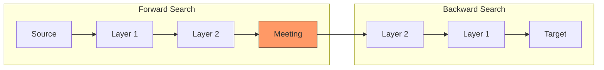
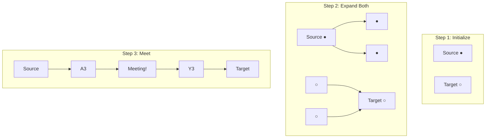

# Bidirectional Breadth-First Search

## Overview

| Property | Value |
|----------|-------|
| **Category** | Graph Traversal / Pathfinding |
| **Complexity (Time)** | O(b^(d/2)) vs O(b^d) for standard BFS |
| **Complexity (Space)** | O(b^(d/2)) |
| **Graph Type** | Directed or Undirected |
| **Best For** | Shortest path in large unweighted graphs |

## Description

Bidirectional Breadth-First Search (Bi-BFS) is an optimization of standard BFS that searches simultaneously from both the source and target nodes. The two searches meet in the middle, dramatically reducing the search space for graphs with high branching factors.

The algorithm maintains two frontiers that expand alternately until they meet, at which point the shortest path can be reconstructed by combining the paths from both directions.

## Mathematical Foundation

### Search Space Reduction

For a graph with branching factor $b$ and shortest path length $d$:

**Standard BFS:**
$$\text{Nodes explored} = O(b^d)$$

**Bidirectional BFS:**
$$\text{Nodes explored} = O(2 \cdot b^{d/2}) = O(b^{d/2})$$

### Speedup Factor

The speedup is approximately:
$$\frac{b^d}{2 \cdot b^{d/2}} = \frac{b^{d/2}}{2}$$

For $b = 10$ and $d = 6$: Standard explores ~1,000,000 nodes, Bidirectional explores ~2,000 nodes.

### Correctness Guarantee

**Theorem:** When the two frontiers meet, the combined path is guaranteed to be a shortest path.

**Proof:** Both BFS searches explore nodes in order of distance from their starting point. When frontiers meet at node $m$:
- Distance from source to $m$ = shortest distance in forward direction
- Distance from $m$ to target = shortest distance in backward direction
- Combined = shortest total path

## Algorithm

### Pseudocode

```
BIDIRECTIONAL-BFS(graph, source, target):
    if source = target:
        return [source]
    
    // Initialize forward search from source
    fwd_queue ← [source]
    fwd_visited ← {source}
    fwd_parent ← {source: None}
    
    // Initialize backward search from target
    bwd_queue ← [target]
    bwd_visited ← {target}
    bwd_parent ← {target: None}
    
    while fwd_queue AND bwd_queue:
        // Expand forward frontier
        meeting_node ← EXPAND(graph, fwd_queue, fwd_visited, 
                              fwd_parent, bwd_visited)
        if meeting_node ≠ None:
            return BUILD-PATH(fwd_parent, bwd_parent, meeting_node)
        
        // Expand backward frontier
        meeting_node ← EXPAND(graph, bwd_queue, bwd_visited,
                              bwd_parent, fwd_visited)
        if meeting_node ≠ None:
            return BUILD-PATH(fwd_parent, bwd_parent, meeting_node)
    
    return None  // No path exists

EXPAND(graph, queue, visited, parent, other_visited):
    current ← queue.dequeue()
    
    for each neighbor of current in graph:
        if neighbor in other_visited:
            parent[neighbor] ← current
            return neighbor  // Meeting point found
        
        if neighbor not in visited:
            visited.add(neighbor)
            parent[neighbor] ← current
            queue.enqueue(neighbor)
    
    return None

BUILD-PATH(fwd_parent, bwd_parent, meeting):
    // Build path from source to meeting point
    fwd_path ← []
    node ← meeting
    while node ≠ None:
        fwd_path.prepend(node)
        node ← fwd_parent[node]
    
    // Build path from meeting point to target
    bwd_path ← []
    node ← bwd_parent[meeting]
    while node ≠ None:
        bwd_path.append(node)
        node ← bwd_parent[node]
    
    return fwd_path + bwd_path
```

## Complexity Analysis

### Time Complexity

| Scenario | Standard BFS | Bidirectional BFS |
|----------|--------------|-------------------|
| Best case | O(1) | O(1) |
| Average | O(b^d) | O(b^(d/2)) |
| Worst case | O(V + E) | O(V + E) |

### Space Complexity

| Component | Space |
|-----------|-------|
| Forward visited | O(b^(d/2)) |
| Backward visited | O(b^(d/2)) |
| Queues | O(b^(d/2)) |
| Total | O(b^(d/2)) |

## Visual Representation



### Search Expansion



## Implementation

### Python Implementation

```python
from collections import deque
from typing import Optional

Path = list[tuple[int, int]]


class BidirectionalBFS:
    """
    Bidirectional BFS for grid-based pathfinding.
    
    >>> grid = [[0, 0, 0], [0, 0, 0], [0, 0, 0]]
    >>> bfs = BidirectionalBFS(grid)
    >>> path = bfs.find_path((0, 0), (2, 2))
    >>> len(path) > 0
    True
    """
    
    def __init__(self, grid: list[list[int]]):
        """
        Initialize with a grid where 0 = free, 1 = obstacle.
        """
        self.grid = grid
        self.rows = len(grid)
        self.cols = len(grid[0]) if grid else 0
        self.directions = [(-1, 0), (0, -1), (1, 0), (0, 1)]
    
    def find_path(
        self, 
        start: tuple[int, int], 
        goal: tuple[int, int]
    ) -> Optional[Path]:
        """
        Find shortest path from start to goal.
        
        Returns:
            List of coordinates forming the path, or None if no path exists.
        """
        if start == goal:
            return [start]
        
        # Forward search structures
        fwd_queue = deque([start])
        fwd_visited = {start}
        fwd_parent = {start: None}
        
        # Backward search structures
        bwd_queue = deque([goal])
        bwd_visited = {goal}
        bwd_parent = {goal: None}
        
        while fwd_queue and bwd_queue:
            # Expand forward
            meeting = self._expand(
                fwd_queue, fwd_visited, fwd_parent, bwd_visited
            )
            if meeting:
                return self._build_path(fwd_parent, bwd_parent, meeting)
            
            # Expand backward
            meeting = self._expand(
                bwd_queue, bwd_visited, bwd_parent, fwd_visited
            )
            if meeting:
                return self._build_path(fwd_parent, bwd_parent, meeting)
        
        return None
    
    def _expand(
        self,
        queue: deque,
        visited: set,
        parent: dict,
        other_visited: set
    ) -> Optional[tuple[int, int]]:
        """Expand one level of BFS frontier."""
        if not queue:
            return None
        
        current = queue.popleft()
        
        for dy, dx in self.directions:
            ny, nx = current[0] + dy, current[1] + dx
            neighbor = (ny, nx)
            
            # Bounds check
            if not (0 <= ny < self.rows and 0 <= nx < self.cols):
                continue
            
            # Obstacle check
            if self.grid[ny][nx] != 0:
                continue
            
            # Meeting point found
            if neighbor in other_visited:
                parent[neighbor] = current
                return neighbor
            
            # New node discovered
            if neighbor not in visited:
                visited.add(neighbor)
                parent[neighbor] = current
                queue.append(neighbor)
        
        return None
    
    def _build_path(
        self,
        fwd_parent: dict,
        bwd_parent: dict,
        meeting: tuple[int, int]
    ) -> Path:
        """Reconstruct path from both directions."""
        # Forward path (source to meeting)
        fwd_path = []
        node = meeting
        while node is not None:
            fwd_path.append(node)
            node = fwd_parent.get(node)
        fwd_path.reverse()
        
        # Backward path (meeting to target)
        bwd_path = []
        node = bwd_parent.get(meeting)
        while node is not None:
            bwd_path.append(node)
            node = bwd_parent.get(node)
        
        return fwd_path + bwd_path
```

### Graph-Based Implementation

```python
from collections import deque
from typing import Optional, TypeVar

T = TypeVar('T')


class BidirectionalGraphBFS:
    """
    Bidirectional BFS for general graphs.
    """
    
    def __init__(self, graph: dict[T, list[T]]):
        """
        Initialize with adjacency list representation.
        
        Args:
            graph: Dictionary mapping node to list of neighbors
        """
        self.graph = graph
    
    def find_path(self, source: T, target: T) -> Optional[list[T]]:
        """
        Find shortest path between two nodes.
        
        >>> graph = {'A': ['B', 'C'], 'B': ['A', 'D'], 
        ...          'C': ['A', 'D'], 'D': ['B', 'C']}
        >>> bfs = BidirectionalGraphBFS(graph)
        >>> bfs.find_path('A', 'D')
        ['A', 'B', 'D']
        """
        if source == target:
            return [source]
        
        if source not in self.graph or target not in self.graph:
            return None
        
        # Initialize both searches
        fwd = {'queue': deque([source]), 
               'visited': {source}, 
               'parent': {source: None}}
        bwd = {'queue': deque([target]), 
               'visited': {target}, 
               'parent': {target: None}}
        
        while fwd['queue'] and bwd['queue']:
            # Alternate between directions, preferring smaller frontier
            if len(fwd['queue']) <= len(bwd['queue']):
                result = self._step(fwd, bwd['visited'])
            else:
                result = self._step(bwd, fwd['visited'])
            
            if result:
                return self._reconstruct(
                    fwd['parent'], bwd['parent'], result
                )
        
        return None
    
    def _step(
        self, 
        search: dict, 
        other_visited: set
    ) -> Optional[T]:
        """Perform one BFS step."""
        if not search['queue']:
            return None
        
        current = search['queue'].popleft()
        
        for neighbor in self.graph.get(current, []):
            if neighbor in other_visited:
                search['parent'][neighbor] = current
                return neighbor
            
            if neighbor not in search['visited']:
                search['visited'].add(neighbor)
                search['parent'][neighbor] = current
                search['queue'].append(neighbor)
        
        return None
    
    def _reconstruct(
        self,
        fwd_parent: dict,
        bwd_parent: dict,
        meeting: T
    ) -> list[T]:
        """Build complete path."""
        path = []
        
        # Forward direction
        node = meeting
        while node is not None:
            path.append(node)
            node = fwd_parent.get(node)
        path.reverse()
        
        # Backward direction
        node = bwd_parent.get(meeting)
        while node is not None:
            path.append(node)
            node = bwd_parent.get(node)
        
        return path
```

## Real-World Applications

### 1. Social Network Connection

```python
class SocialNetworkPathfinder:
    """
    Find connection path between users in social network.
    """
    
    def __init__(self, connections: dict[str, set[str]]):
        self.connections = connections
    
    def degrees_of_separation(
        self, 
        user1: str, 
        user2: str
    ) -> tuple[int, list[str]]:
        """
        Find degrees of separation between two users.
        
        >>> network = {
        ...     'Alice': {'Bob', 'Carol'},
        ...     'Bob': {'Alice', 'Dave'},
        ...     'Carol': {'Alice', 'Eve'},
        ...     'Dave': {'Bob', 'Eve'},
        ...     'Eve': {'Carol', 'Dave'}
        ... }
        >>> finder = SocialNetworkPathfinder(network)
        >>> degrees, path = finder.degrees_of_separation('Alice', 'Eve')
        >>> degrees
        2
        """
        if user1 == user2:
            return (0, [user1])
        
        # Bidirectional BFS
        fwd_q = deque([user1])
        bwd_q = deque([user2])
        fwd_visited = {user1: None}
        bwd_visited = {user2: None}
        
        while fwd_q and bwd_q:
            # Forward step
            meeting = self._expand(fwd_q, fwd_visited, bwd_visited)
            if meeting:
                path = self._build_path(fwd_visited, bwd_visited, meeting)
                return (len(path) - 1, path)
            
            # Backward step
            meeting = self._expand(bwd_q, bwd_visited, fwd_visited)
            if meeting:
                path = self._build_path(fwd_visited, bwd_visited, meeting)
                return (len(path) - 1, path)
        
        return (-1, [])  # No connection
    
    def _expand(self, queue, visited, other):
        if not queue:
            return None
        
        current = queue.popleft()
        for friend in self.connections.get(current, set()):
            if friend in other:
                visited[friend] = current
                return friend
            if friend not in visited:
                visited[friend] = current
                queue.append(friend)
        return None
    
    def _build_path(self, fwd, bwd, meeting):
        path = []
        node = meeting
        while node:
            path.append(node)
            node = fwd.get(node)
        path.reverse()
        
        node = bwd.get(meeting)
        while node:
            path.append(node)
            node = bwd.get(node)
        return path
```

### 2. Word Ladder Solver

```python
class WordLadderSolver:
    """
    Find shortest transformation from start word to end word.
    """
    
    def __init__(self, dictionary: set[str]):
        self.dictionary = dictionary
        self.alphabet = 'abcdefghijklmnopqrstuvwxyz'
    
    def solve(self, start: str, end: str) -> list[str]:
        """
        Find shortest word ladder.
        
        >>> solver = WordLadderSolver({'hot', 'dot', 'dog', 'lot', 'log', 'cog'})
        >>> solver.solve('hit', 'cog')
        ['hit', 'hot', 'dot', 'dog', 'cog']
        """
        if start == end:
            return [start]
        
        if end not in self.dictionary:
            return []
        
        fwd = {'q': deque([start]), 'v': {start: None}}
        bwd = {'q': deque([end]), 'v': {end: None}}
        
        while fwd['q'] and bwd['q']:
            # Expand smaller frontier
            if len(fwd['v']) <= len(bwd['v']):
                result = self._expand_word(fwd, bwd['v'])
            else:
                result = self._expand_word(bwd, fwd['v'])
            
            if result:
                return self._build_ladder(fwd['v'], bwd['v'], result)
        
        return []
    
    def _get_neighbors(self, word: str) -> list[str]:
        """Generate all valid one-letter transformations."""
        neighbors = []
        for i in range(len(word)):
            for c in self.alphabet:
                if c != word[i]:
                    new_word = word[:i] + c + word[i+1:]
                    if new_word in self.dictionary:
                        neighbors.append(new_word)
        return neighbors
    
    def _expand_word(self, search, other_visited):
        if not search['q']:
            return None
        
        word = search['q'].popleft()
        for neighbor in self._get_neighbors(word):
            if neighbor in other_visited:
                search['v'][neighbor] = word
                return neighbor
            if neighbor not in search['v']:
                search['v'][neighbor] = word
                search['q'].append(neighbor)
        return None
    
    def _build_ladder(self, fwd, bwd, meeting):
        ladder = []
        word = meeting
        while word:
            ladder.append(word)
            word = fwd.get(word)
        ladder.reverse()
        
        word = bwd.get(meeting)
        while word:
            ladder.append(word)
            word = bwd.get(word)
        return ladder
```

## Comparison

| Algorithm | Time | Space | Use Case |
|-----------|------|-------|----------|
| Standard BFS | O(b^d) | O(b^d) | Small graphs |
| Bidirectional BFS | O(b^(d/2)) | O(b^(d/2)) | Large graphs, known target |
| A* | O(b^d) | O(b^d) | With heuristic |
| Bidirectional A* | O(b^(d/2)) | O(b^(d/2)) | Best of both |

## When to Use

**Best for:**
- Large graphs with high branching factor
- Known source and target
- Unweighted or uniform-weight edges
- Social network analysis
- Word transformations

**Avoid when:**
- Unknown target (use standard BFS)
- Very short paths (overhead not worth it)
- Non-reversible graphs

## References

1. [Bidirectional Search - Wikipedia](https://en.wikipedia.org/wiki/Bidirectional_search)
2. Pohl, I. "Bi-directional Search" (1971)
3. de Champeaux, D. & Sint, L. "An Improved Bidirectional Heuristic Search Algorithm" (1977)

## See Also

- [Breadth-First Search](breadth_first_search.md) - Standard BFS
- [Bidirectional A*](bidirectional_a_star.md) - With heuristics
- [Dijkstra's Algorithm](dijkstra.md) - Weighted graphs
