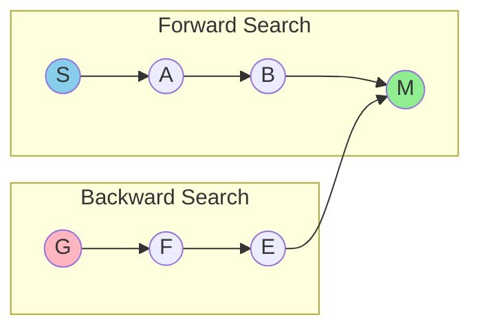
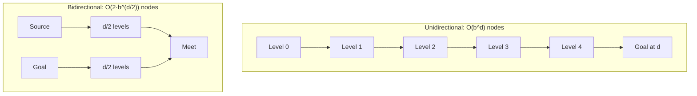

# Bidirectional Search Algorithms

## Overview

| Property | Value |
|----------|-------|
| **Category** | Graph Traversal / Pathfinding |
| **Variants** | Bidirectional BFS, Bidirectional Dijkstra |
| **Complexity (Time)** | O(b^(d/2)) - significantly better than O(b^d) |
| **Complexity (Space)** | O(b^(d/2)) |
| **Best For** | Point-to-point shortest path |

## Description

Bidirectional search algorithms simultaneously search forward from the source and backward from the goal, meeting somewhere in the middle. This dramatically reduces the search space compared to unidirectional search, especially in graphs with high branching factors.

The key insight is that two smaller search trees (each of depth d/2) require far less exploration than one large tree of depth d.

## Mathematical Foundation

### Search Space Reduction

For a branching factor $b$ and path depth $d$:

**Unidirectional search:**
$$\text{Nodes explored} \approx O(b^d)$$

**Bidirectional search:**
$$\text{Nodes explored} \approx O(2 \cdot b^{d/2}) = O(b^{d/2})$$

### Improvement Factor

The speedup factor is:
$$\text{Speedup} = \frac{b^d}{2 \cdot b^{d/2}} = \frac{b^{d/2}}{2}$$

For $b = 10$ and $d = 6$:
- Unidirectional: $10^6 = 1,000,000$ nodes
- Bidirectional: $2 \times 10^3 = 2,000$ nodes

### Termination Condition

The search terminates when the two frontiers meet:
$$\exists v : v \in \text{visited}_{\text{forward}} \cap \text{visited}_{\text{backward}}$$

For shortest path, ensure:
$$d_f(v) + d_b(v) = \min \text{ total distance}$$

## Algorithm Variants

### 1. Bidirectional BFS (Unweighted Graphs)

```
BIDIRECTIONAL-BFS(graph, source, goal):
    if source = goal:
        return [source]
    
    // Initialize both directions
    forward_parents[source] ← NULL
    backward_parents[goal] ← NULL
    
    forward_queue ← queue containing source
    backward_queue ← queue containing goal
    
    while forward_queue ≠ ∅ AND backward_queue ≠ ∅:
        // Expand forward search
        intersection ← EXPAND(graph, forward_queue, 
                              forward_parents, backward_parents)
        
        if intersection ≠ NULL:
            return CONSTRUCT-PATH(intersection,
                                  forward_parents, backward_parents)
        
        // Expand backward search
        intersection ← EXPAND(graph, backward_queue,
                              backward_parents, forward_parents)
        
        if intersection ≠ NULL:
            return CONSTRUCT-PATH(intersection,
                                  forward_parents, backward_parents)
    
    return NULL  // No path exists

EXPAND(graph, queue, parents, opposite_parents):
    current ← queue.dequeue()
    
    for each neighbor in graph[current]:
        if neighbor ∉ parents:
            parents[neighbor] ← current
            queue.enqueue(neighbor)
            
            // Check for intersection
            if neighbor ∈ opposite_parents:
                return neighbor
    
    return NULL

CONSTRUCT-PATH(meeting_point, forward_parents, backward_parents):
    // Build path from source to meeting point
    forward_path ← []
    node ← meeting_point
    while node ≠ NULL:
        forward_path.prepend(node)
        node ← forward_parents[node]
    
    // Build path from meeting point to goal
    node ← backward_parents[meeting_point]
    while node ≠ NULL:
        forward_path.append(node)
        node ← backward_parents[node]
    
    return forward_path
```

### 2. Bidirectional Dijkstra (Weighted Graphs)

```
BIDIRECTIONAL-DIJKSTRA(graph_fwd, graph_bwd, source, dest):
    if source = dest:
        return 0
    
    // Initialize
    dist_fwd[source] ← 0
    dist_bwd[dest] ← 0
    
    pq_fwd ← priority queue with (0, source)
    pq_bwd ← priority queue with (0, dest)
    
    visited_fwd ← ∅
    visited_bwd ← ∅
    
    best_distance ← ∞
    
    while pq_fwd ≠ ∅ AND pq_bwd ≠ ∅:
        // Forward step
        (d_fwd, v_fwd) ← pq_fwd.extract_min()
        visited_fwd.add(v_fwd)
        
        // Backward step
        (d_bwd, v_bwd) ← pq_bwd.extract_min()
        visited_bwd.add(v_bwd)
        
        // Relax forward edges
        best_distance ← RELAX-BIDIRECTIONAL(
            graph_fwd, v_fwd,
            dist_fwd, dist_bwd,
            visited_fwd, visited_bwd,
            pq_fwd, best_distance)
        
        // Relax backward edges
        best_distance ← RELAX-BIDIRECTIONAL(
            graph_bwd, v_bwd,
            dist_bwd, dist_fwd,
            visited_bwd, visited_fwd,
            pq_bwd, best_distance)
        
        // Termination check
        if dist_fwd[v_fwd] + dist_bwd[v_bwd] ≥ best_distance:
            return best_distance
    
    return best_distance if best_distance ≠ ∞ else -1
```

## Complexity Analysis

### Time Complexity

| Algorithm | Best Case | Average Case | Worst Case |
|-----------|-----------|--------------|------------|
| Bidirectional BFS | O(b^(d/2)) | O(b^(d/2)) | O(b^d) |
| Bidirectional Dijkstra | O((V+E) log V / 2) | O((V+E) log V / 2) | O((V+E) log V) |

### Space Complexity

| Component | Space |
|-----------|-------|
| Forward visited set | O(b^(d/2)) |
| Backward visited set | O(b^(d/2)) |
| Priority queues | O(b^(d/2)) |
| Parent pointers | O(V) |

## Visual Representation

### Bidirectional Search Process



### Search Tree Comparison



## Implementation

### Python Implementation - Bidirectional BFS

```python
from collections import deque


def expand_search(
    graph: dict[int, list[int]],
    queue: deque[int],
    parents: dict[int, int | None],
    opposite_parents: dict[int, int | None],
) -> int | None:
    """
    Expand one level of BFS search.
    
    Returns intersection node if found, None otherwise.
    """
    if not queue:
        return None
    
    current = queue.popleft()
    
    for neighbor in graph[current]:
        if neighbor in parents:
            continue
        
        parents[neighbor] = current
        queue.append(neighbor)
        
        # Check for intersection
        if neighbor in opposite_parents:
            return neighbor
    
    return None


def construct_path(
    current: int | None,
    parents: dict[int, int | None]
) -> list[int]:
    """Build path from current node back to start."""
    path: list[int] = []
    while current is not None:
        path.append(current)
        current = parents[current]
    return path


def bidirectional_search(
    graph: dict[int, list[int]],
    start: int,
    goal: int
) -> list[int] | None:
    """
    Find shortest path using bidirectional BFS.
    
    Args:
        graph: Adjacency list representation
        start: Starting node
        goal: Target node
    
    Returns:
        Shortest path as list of nodes, or None if no path
    
    Examples:
        >>> graph = {
        ...     0: [1, 2],
        ...     1: [0, 3, 4],
        ...     2: [0, 5, 6],
        ...     3: [1, 7],
        ...     4: [1, 8],
        ...     5: [2, 9],
        ...     6: [2, 10],
        ...     7: [3, 11],
        ...     8: [4, 11],
        ...     9: [5, 11],
        ...     10: [6, 11],
        ...     11: [7, 8, 9, 10],
        ... }
        >>> bidirectional_search(graph, 0, 11)
        [0, 1, 3, 7, 11]
        >>> bidirectional_search(graph, 5, 5)
        [5]
    """
    if start == goal:
        return [start]
    
    if start not in graph or goal not in graph:
        return None
    
    # Initialize both directions
    forward_parents: dict[int, int | None] = {start: None}
    backward_parents: dict[int, int | None] = {goal: None}
    
    forward_queue = deque([start])
    backward_queue = deque([goal])
    
    intersection = None
    
    while forward_queue and backward_queue and intersection is None:
        # Expand forward
        intersection = expand_search(
            graph, forward_queue,
            forward_parents, backward_parents
        )
        
        if intersection is not None:
            break
        
        # Expand backward
        intersection = expand_search(
            graph, backward_queue,
            backward_parents, forward_parents
        )
    
    if intersection is None:
        return None
    
    # Construct full path
    forward_path = construct_path(intersection, forward_parents)
    forward_path.reverse()
    
    backward_path = construct_path(
        backward_parents[intersection],
        backward_parents
    )
    
    return forward_path + backward_path
```

### Python Implementation - Bidirectional Dijkstra

```python
from queue import PriorityQueue
from typing import Any
import numpy as np


def pass_and_relaxation(
    graph: dict,
    v: str,
    visited_forward: set,
    visited_backward: set,
    cost_fwd: dict,
    cost_bwd: dict,
    queue: PriorityQueue,
    parent: dict,
    shortest_distance: float,
) -> float:
    """
    Process a node and relax its edges.
    
    Updates shortest_distance if a better path is found
    through this node connecting both searches.
    """
    for neighbor, weight in graph[v]:
        if neighbor in visited_forward:
            continue
        
        old_cost = cost_fwd.get(neighbor, np.inf)
        new_cost = cost_fwd[v] + weight
        
        if new_cost < old_cost:
            queue.put((new_cost, neighbor))
            cost_fwd[neighbor] = new_cost
            parent[neighbor] = v
        
        # Check if this creates a shorter complete path
        if (neighbor in visited_backward and 
            cost_fwd[v] + weight + cost_bwd[neighbor] < shortest_distance):
            shortest_distance = cost_fwd[v] + weight + cost_bwd[neighbor]
    
    return shortest_distance


def bidirectional_dijkstra(
    source: str,
    destination: str,
    graph_forward: dict,
    graph_backward: dict
) -> int:
    """
    Find shortest path using bidirectional Dijkstra.
    
    Args:
        source: Starting node
        destination: Target node
        graph_forward: Forward adjacency list with weights
        graph_backward: Backward (reverse) adjacency list
    
    Returns:
        Shortest path distance, or -1 if no path exists
    
    Examples:
        >>> graph_fwd = {
        ...     'A': [['B', 1], ['C', 4]],
        ...     'B': [['C', 2], ['D', 5]],
        ...     'C': [['D', 1]],
        ...     'D': []
        ... }
        >>> graph_bwd = {
        ...     'A': [],
        ...     'B': [['A', 1]],
        ...     'C': [['A', 4], ['B', 2]],
        ...     'D': [['B', 5], ['C', 1]]
        ... }
        >>> bidirectional_dijkstra('A', 'D', graph_fwd, graph_bwd)
        4
    """
    if source == destination:
        return 0
    
    visited_forward: set = set()
    visited_backward: set = set()
    
    cost_fwd = {source: 0}
    cost_bwd = {destination: 0}
    
    parent_forward = {source: None}
    parent_backward = {destination: None}
    
    queue_forward: PriorityQueue[Any] = PriorityQueue()
    queue_backward: PriorityQueue[Any] = PriorityQueue()
    
    shortest_distance = np.inf
    
    queue_forward.put((0, source))
    queue_backward.put((0, destination))
    
    while not queue_forward.empty() and not queue_backward.empty():
        _, v_fwd = queue_forward.get()
        visited_forward.add(v_fwd)
        
        _, v_bwd = queue_backward.get()
        visited_backward.add(v_bwd)
        
        shortest_distance = pass_and_relaxation(
            graph_forward, v_fwd,
            visited_forward, visited_backward,
            cost_fwd, cost_bwd,
            queue_forward, parent_forward,
            shortest_distance
        )
        
        shortest_distance = pass_and_relaxation(
            graph_backward, v_bwd,
            visited_backward, visited_forward,
            cost_bwd, cost_fwd,
            queue_backward, parent_backward,
            shortest_distance
        )
        
        # Early termination
        if cost_fwd[v_fwd] + cost_bwd[v_bwd] >= shortest_distance:
            break
    
    return int(shortest_distance) if shortest_distance != np.inf else -1
```

## Real-World Applications

### 1. Navigation Systems

```python
class GPSNavigator:
    """
    GPS navigation using bidirectional search.
    """
    
    def __init__(self, road_network: dict[str, list[tuple[str, float]]]):
        """
        Initialize with road network.
        
        road_network: {location: [(neighbor, distance), ...]}
        """
        self.forward_graph = road_network
        self.backward_graph = self._reverse_graph(road_network)
    
    def _reverse_graph(
        self,
        graph: dict[str, list[tuple[str, float]]]
    ) -> dict[str, list[tuple[str, float]]]:
        """Create reverse graph for backward search."""
        reverse = {node: [] for node in graph}
        
        for node in graph:
            for neighbor, distance in graph[node]:
                if neighbor in reverse:
                    reverse[neighbor].append((node, distance))
        
        return reverse
    
    def find_route(
        self,
        origin: str,
        destination: str
    ) -> tuple[float, list[str]]:
        """
        Find shortest route between two locations.
        
        Returns (distance, path).
        """
        if origin == destination:
            return 0.0, [origin]
        
        # Bidirectional Dijkstra
        pq_fwd = [(0.0, origin, [origin])]
        pq_bwd = [(0.0, destination, [destination])]
        
        dist_fwd = {origin: 0.0}
        dist_bwd = {destination: 0.0}
        
        path_fwd = {origin: [origin]}
        path_bwd = {destination: [destination]}
        
        visited_fwd = set()
        visited_bwd = set()
        
        best_dist = float('inf')
        best_path = []
        
        import heapq
        
        while pq_fwd and pq_bwd:
            # Forward step
            if pq_fwd:
                d, node, path = heapq.heappop(pq_fwd)
                
                if node not in visited_fwd:
                    visited_fwd.add(node)
                    path_fwd[node] = path
                    
                    if node in visited_bwd:
                        total = d + dist_bwd[node]
                        if total < best_dist:
                            best_dist = total
                            best_path = path + path_bwd[node][:-1][::-1]
                    
                    for neighbor, weight in self.forward_graph.get(node, []):
                        new_dist = d + weight
                        if neighbor not in dist_fwd or new_dist < dist_fwd[neighbor]:
                            dist_fwd[neighbor] = new_dist
                            heapq.heappush(
                                pq_fwd,
                                (new_dist, neighbor, path + [neighbor])
                            )
            
            # Backward step (similar logic)
            if pq_bwd:
                d, node, path = heapq.heappop(pq_bwd)
                
                if node not in visited_bwd:
                    visited_bwd.add(node)
                    path_bwd[node] = path
                    
                    if node in visited_fwd:
                        total = d + dist_fwd[node]
                        if total < best_dist:
                            best_dist = total
                            best_path = path_fwd[node] + path[:-1][::-1]
                    
                    for neighbor, weight in self.backward_graph.get(node, []):
                        new_dist = d + weight
                        if neighbor not in dist_bwd or new_dist < dist_bwd[neighbor]:
                            dist_bwd[neighbor] = new_dist
                            heapq.heappush(
                                pq_bwd,
                                (new_dist, neighbor, path + [neighbor])
                            )
            
            # Early termination
            min_fwd = pq_fwd[0][0] if pq_fwd else float('inf')
            min_bwd = pq_bwd[0][0] if pq_bwd else float('inf')
            
            if min_fwd + min_bwd >= best_dist:
                break
        
        return best_dist, best_path
```

### 2. Social Network Analysis

```python
class SocialNetwork:
    """
    Find connections between people using bidirectional search.
    """
    
    def __init__(self, connections: dict[str, list[str]]):
        """connections: {person: [friends]}"""
        self.graph = connections
    
    def degrees_of_separation(
        self,
        person1: str,
        person2: str
    ) -> int | None:
        """
        Find degrees of separation (shortest path length).
        
        >>> network = SocialNetwork({
        ...     'Alice': ['Bob', 'Carol'],
        ...     'Bob': ['Alice', 'Dave'],
        ...     'Carol': ['Alice', 'Eve'],
        ...     'Dave': ['Bob', 'Frank'],
        ...     'Eve': ['Carol', 'Frank'],
        ...     'Frank': ['Dave', 'Eve']
        ... })
        >>> network.degrees_of_separation('Alice', 'Frank')
        3
        """
        if person1 == person2:
            return 0
        
        if person1 not in self.graph or person2 not in self.graph:
            return None
        
        # Bidirectional BFS
        from collections import deque
        
        fwd_visited = {person1: 0}
        bwd_visited = {person2: 0}
        
        fwd_queue = deque([person1])
        bwd_queue = deque([person2])
        
        while fwd_queue and bwd_queue:
            # Forward expansion
            if fwd_queue:
                current = fwd_queue.popleft()
                current_dist = fwd_visited[current]
                
                for friend in self.graph.get(current, []):
                    if friend in bwd_visited:
                        return current_dist + 1 + bwd_visited[friend]
                    
                    if friend not in fwd_visited:
                        fwd_visited[friend] = current_dist + 1
                        fwd_queue.append(friend)
            
            # Backward expansion
            if bwd_queue:
                current = bwd_queue.popleft()
                current_dist = bwd_visited[current]
                
                for friend in self.graph.get(current, []):
                    if friend in fwd_visited:
                        return current_dist + 1 + fwd_visited[friend]
                    
                    if friend not in bwd_visited:
                        bwd_visited[friend] = current_dist + 1
                        bwd_queue.append(friend)
        
        return None  # No connection
    
    def find_connection_path(
        self,
        person1: str,
        person2: str
    ) -> list[str] | None:
        """
        Find actual path connecting two people.
        """
        path = bidirectional_search(self.graph, person1, person2)
        return path
```

### 3. Word Ladder Problem

```python
class WordLadder:
    """
    Transform one word to another by changing one letter at a time.
    
    Uses bidirectional BFS for efficiency.
    """
    
    def __init__(self, dictionary: set[str]):
        """Initialize with valid words."""
        self.words = dictionary
        self.word_length_map = {}
        
        for word in dictionary:
            length = len(word)
            if length not in self.word_length_map:
                self.word_length_map[length] = set()
            self.word_length_map[length].add(word)
    
    def _get_neighbors(self, word: str) -> list[str]:
        """Get all valid words differing by one letter."""
        neighbors = []
        valid_words = self.word_length_map.get(len(word), set())
        
        for i in range(len(word)):
            for c in 'abcdefghijklmnopqrstuvwxyz':
                if c != word[i]:
                    candidate = word[:i] + c + word[i+1:]
                    if candidate in valid_words:
                        neighbors.append(candidate)
        
        return neighbors
    
    def find_ladder(
        self,
        start: str,
        end: str
    ) -> list[str] | None:
        """
        Find shortest transformation sequence.
        
        >>> wl = WordLadder({'hit', 'hot', 'dot', 'dog', 'cog', 'lot', 'log'})
        >>> wl.find_ladder('hit', 'cog')
        ['hit', 'hot', 'dot', 'dog', 'cog']
        """
        if start == end:
            return [start]
        
        if len(start) != len(end):
            return None
        
        if start not in self.words or end not in self.words:
            return None
        
        # Bidirectional BFS
        from collections import deque
        
        fwd_parents = {start: None}
        bwd_parents = {end: None}
        
        fwd_queue = deque([start])
        bwd_queue = deque([end])
        
        intersection = None
        
        while fwd_queue and bwd_queue and intersection is None:
            # Expand smaller frontier first (optimization)
            if len(fwd_queue) <= len(bwd_queue):
                intersection = self._expand(
                    fwd_queue, fwd_parents, bwd_parents
                )
            else:
                intersection = self._expand(
                    bwd_queue, bwd_parents, fwd_parents
                )
        
        if intersection is None:
            return None
        
        # Build path
        path = []
        node = intersection
        while node is not None:
            path.append(node)
            node = fwd_parents[node]
        path.reverse()
        
        node = bwd_parents[intersection]
        while node is not None:
            path.append(node)
            node = bwd_parents[node]
        
        return path
    
    def _expand(
        self,
        queue: deque,
        parents: dict,
        opposite_parents: dict
    ) -> str | None:
        """Expand one word's neighbors."""
        current = queue.popleft()
        
        for neighbor in self._get_neighbors(current):
            if neighbor in parents:
                continue
            
            parents[neighbor] = current
            queue.append(neighbor)
            
            if neighbor in opposite_parents:
                return neighbor
        
        return None
```

## Algorithm Comparison

| Feature | Unidirectional | Bidirectional |
|---------|----------------|---------------|
| Search direction | One way | Both ways |
| Time complexity | O(b^d) | O(b^(d/2)) |
| Space complexity | O(b^d) | O(b^(d/2)) |
| Implementation | Simpler | More complex |
| Best for | Short paths | Long paths |

## References

1. [Bidirectional Search - Wikipedia](https://en.wikipedia.org/wiki/Bidirectional_search)
2. Pohl, I. "Bi-directional Search" (1971)
3. Holte, R. et al. "Bidirectional Frontier Search" (2016)
4. Kaindl, H., Kainz, G. "Bidirectional Heuristic Search Reconsidered" (1997)

## See Also

- [Dijkstra's Algorithm](dijkstra.md) - Single-source shortest path
- [A* Algorithm](a_star.md) - Heuristic search
- [Breadth-First Search](breadth_first_search.md) - Level-order traversal
