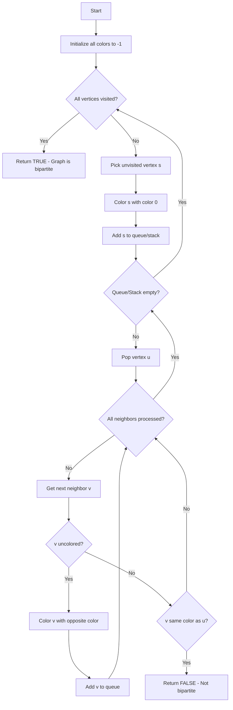
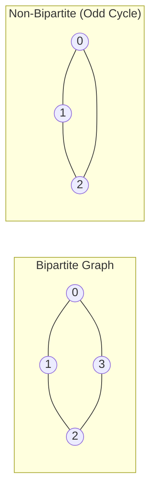

# Bipartite Graph Check

## Overview

| Property | Value |
|----------|-------|
| **Category** | Graph Property Testing |
| **Complexity (Time)** | O(V + E) |
| **Complexity (Space)** | O(V) |
| **Graph Type** | Undirected |
| **Best For** | Two-coloring, matching problems |

## Description

A bipartite graph (or bigraph) is a graph whose vertices can be divided into two disjoint sets such that every edge connects a vertex in one set to a vertex in the other set. Equivalently, a bipartite graph is a graph that can be 2-colored: vertices can be assigned one of two colors such that no adjacent vertices share the same color.

The algorithm to check if a graph is bipartite uses graph traversal (BFS or DFS) to attempt a 2-coloring.

## Mathematical Foundation

### Bipartite Definition

A graph G = (V, E) is bipartite if:
$$\exists \, U, W \subseteq V \text{ such that } U \cap W = \emptyset, \, U \cup W = V$$
$$\forall (u, v) \in E: u \in U \implies v \in W$$

### 2-Coloring Property

Graph G is bipartite if and only if it is 2-colorable:
$$\exists \, c: V \rightarrow \{0, 1\} \text{ such that } \forall (u, v) \in E: c(u) \neq c(v)$$

### Odd Cycle Theorem

A graph is bipartite if and only if it contains no odd-length cycle:
$$G \text{ is bipartite} \iff G \text{ has no cycle of odd length}$$

### König's Theorem

For bipartite graphs, the size of maximum matching equals the size of minimum vertex cover:
$$|M_{max}| = |C_{min}|$$

## Algorithm

### Pseudocode (BFS Approach)

```
IS_BIPARTITE_BFS(graph):
    color[v] ← -1 for all v in V  // uncolored
    
    for each vertex s in V:
        if color[s] == -1:  // unvisited component
            queue ← [s]
            color[s] ← 0
            
            while queue not empty:
                u ← queue.dequeue()
                
                for each neighbor v of u:
                    if color[v] == -1:
                        color[v] ← 1 - color[u]  // opposite color
                        queue.enqueue(v)
                    else if color[v] == color[u]:
                        return False  // odd cycle found
    
    return True
```

### Pseudocode (DFS Approach)

```
IS_BIPARTITE_DFS(graph):
    color[v] ← -1 for all v in V
    
    for each vertex s in V:
        if color[s] == -1:
            if not DFS_COLOR(s, 0):
                return False
    
    return True

DFS_COLOR(u, c):
    color[u] ← c
    
    for each neighbor v of u:
        if color[v] == -1:
            if not DFS_COLOR(v, 1 - c):
                return False
        else if color[v] == c:
            return False  // same color as parent
    
    return True
```

### Step-by-Step Execution

```
Bipartite Graph:
    0 --- 1
    |     |
    3 --- 2

Step 1: Start BFS from vertex 0, color[0] = 0
Step 2: Visit neighbors of 0
  - color[1] = 1, color[3] = 1
Step 3: Process vertex 1
  - Check vertex 0: color[0]=0 ≠ color[1]=1 ✓
  - color[2] = 0
Step 4: Process vertex 3
  - Check vertex 0: color[0]=0 ≠ color[3]=1 ✓
  - Check vertex 2: color[2]=0 ≠ color[3]=1 ✓
Step 5: Process vertex 2
  - Check vertex 1: color[1]=1 ≠ color[2]=0 ✓
  - Check vertex 3: color[3]=1 ≠ color[2]=0 ✓

Result: Bipartite!
Partition: U = {0, 2}, W = {1, 3}

---

Non-Bipartite Graph (Triangle):
    0 --- 1
     \   /
       2

Step 1: color[0] = 0
Step 2: color[1] = 1, color[2] = 1
Step 3: Process vertex 1, check vertex 2
  - color[2]=1 == color[1]=1 ✗

Result: NOT Bipartite (odd cycle: 0-1-2-0)
```

## Complexity Analysis

### Time Complexity

| Algorithm | Complexity |
|-----------|------------|
| BFS | O(V + E) |
| DFS | O(V + E) |

Both visit each vertex once and examine each edge twice.

### Space Complexity

| Component | Complexity |
|-----------|------------|
| Color array | O(V) |
| Queue/Stack | O(V) |
| Total | O(V) |

## Visual Representation



### Bipartite vs Non-Bipartite



## Implementation

### Python Implementation (DFS)

```python
from __future__ import annotations


def is_bipartite_dfs(graph: dict[int, list[int]]) -> bool:
    """
    Check if graph is bipartite using DFS 2-coloring.
    
    Args:
        graph: Adjacency list representation
        
    Returns:
        True if bipartite, False otherwise
        
    >>> is_bipartite_dfs({0: [1, 3], 1: [0, 2], 2: [1, 3], 3: [0, 2]})
    True
    >>> is_bipartite_dfs({0: [1, 2], 1: [0, 2], 2: [0, 1]})
    False
    >>> is_bipartite_dfs({0: []})
    True
    """
    
    def dfs(node: int, color: int) -> bool:
        """Color node and check neighbors."""
        colored[node] = color
        
        for neighbor in graph[node]:
            if colored[neighbor] == -1:
                if not dfs(neighbor, 1 - color):
                    return False
            elif colored[neighbor] == color:
                return False
        
        return True
    
    colored: dict[int, int] = {node: -1 for node in graph}
    
    for node in graph:
        if colored[node] == -1:
            if not dfs(node, 0):
                return False
    
    return True


if __name__ == "__main__":
    import doctest
    doctest.testmod()
```

### Python Implementation (BFS)

```python
from collections import deque


def is_bipartite_bfs(graph: dict[int, list[int]]) -> bool:
    """
    Check if graph is bipartite using BFS 2-coloring.
    
    Args:
        graph: Adjacency list representation
        
    Returns:
        True if bipartite, False otherwise
        
    >>> is_bipartite_bfs({0: [1, 3], 1: [0, 2], 2: [1, 3], 3: [0, 2]})
    True
    >>> is_bipartite_bfs({0: [1, 2], 1: [0, 2], 2: [0, 1]})
    False
    """
    colored: dict[int, int] = {node: -1 for node in graph}
    
    for start in graph:
        if colored[start] != -1:
            continue
        
        queue = deque([start])
        colored[start] = 0
        
        while queue:
            node = queue.popleft()
            
            for neighbor in graph[node]:
                if colored[neighbor] == -1:
                    colored[neighbor] = 1 - colored[node]
                    queue.append(neighbor)
                elif colored[neighbor] == colored[node]:
                    return False
    
    return True
```

### With Partition Extraction

```python
from typing import Tuple, Set, Optional
from collections import deque


def bipartite_partition(
    graph: dict[int, list[int]]
) -> Optional[Tuple[Set[int], Set[int]]]:
    """
    Check if bipartite and return partition if so.
    
    Returns:
        Tuple of (set_U, set_W) if bipartite, None otherwise
        
    >>> result = bipartite_partition({0: [1, 3], 1: [0, 2], 2: [1, 3], 3: [0, 2]})
    >>> result is not None
    True
    >>> bipartite_partition({0: [1, 2], 1: [0, 2], 2: [0, 1]})
    """
    color: dict[int, int] = {}
    
    for start in graph:
        if start in color:
            continue
        
        queue = deque([start])
        color[start] = 0
        
        while queue:
            node = queue.popleft()
            
            for neighbor in graph[node]:
                if neighbor not in color:
                    color[neighbor] = 1 - color[node]
                    queue.append(neighbor)
                elif color[neighbor] == color[node]:
                    return None
    
    set_u = {node for node, c in color.items() if c == 0}
    set_w = {node for node, c in color.items() if c == 1}
    
    return (set_u, set_w)
```

## Real-World Applications

### 1. Job Assignment Problem

```python
from typing import List, Tuple, Dict, Set, Optional
from collections import deque


class JobAssignmentChecker:
    """
    Check if workers and jobs can be matched (bipartite matching).
    
    Workers can only do certain jobs, modeled as a bipartite graph.
    """
    
    def __init__(self):
        self.workers: Set[str] = set()
        self.jobs: Set[str] = set()
        self.capabilities: Dict[str, Set[str]] = {}
    
    def add_worker(self, worker: str, capable_jobs: List[str]) -> None:
        """Add worker with their job capabilities."""
        self.workers.add(worker)
        self.capabilities[worker] = set(capable_jobs)
        self.jobs.update(capable_jobs)
    
    def build_graph(self) -> Dict[str, List[str]]:
        """Build adjacency list representation."""
        graph = {node: [] for node in self.workers | self.jobs}
        
        for worker, jobs in self.capabilities.items():
            for job in jobs:
                graph[worker].append(job)
                graph[job].append(worker)
        
        return graph
    
    def is_valid_structure(self) -> bool:
        """
        Check if the capability graph is bipartite.
        
        For this problem, it should always be bipartite
        (workers connect only to jobs).
        """
        graph = self.build_graph()
        return self._is_bipartite(graph)
    
    def _is_bipartite(self, graph: Dict[str, List[str]]) -> bool:
        """BFS bipartite check."""
        color = {}
        
        for start in graph:
            if start in color:
                continue
            
            queue = deque([start])
            color[start] = 0
            
            while queue:
                node = queue.popleft()
                for neighbor in graph[node]:
                    if neighbor not in color:
                        color[neighbor] = 1 - color[node]
                        queue.append(neighbor)
                    elif color[neighbor] == color[node]:
                        return False
        
        return True
    
    def get_partitions(self) -> Tuple[Set[str], Set[str]]:
        """Return worker and job partitions."""
        return self.workers.copy(), self.jobs.copy()


def demo_job_assignment():
    """Demo job assignment structure check."""
    checker = JobAssignmentChecker()
    
    # Workers and their capable jobs
    checker.add_worker("Alice", ["Frontend", "Backend"])
    checker.add_worker("Bob", ["Backend", "Database"])
    checker.add_worker("Charlie", ["Frontend", "DevOps"])
    
    print(f"Valid bipartite structure: {checker.is_valid_structure()}")
    
    workers, jobs = checker.get_partitions()
    print(f"Workers: {workers}")
    print(f"Jobs: {jobs}")
```

### 2. Conflict Detection in Scheduling

```python
from typing import List, Dict, Set, Tuple
from collections import deque
from dataclasses import dataclass


@dataclass
class Meeting:
    """A meeting with attendees."""
    meeting_id: str
    attendees: List[str]


class ScheduleConflictChecker:
    """
    Check for scheduling conflicts using bipartite graph analysis.
    
    Two time slots can be merged if their meetings form
    a bipartite structure (no person attends two meetings
    in both slots that conflict).
    """
    
    def can_schedule_together(
        self, 
        slot1_meetings: List[Meeting],
        slot2_meetings: List[Meeting]
    ) -> Tuple[bool, str]:
        """
        Check if two time slots can be merged without conflicts.
        
        Returns:
            Tuple of (can_merge, reason)
        """
        # Build conflict graph
        # Nodes: meetings
        # Edge: if same person attends both meetings
        
        graph: Dict[str, List[str]] = {}
        
        # Initialize all meetings as nodes
        all_meetings = slot1_meetings + slot2_meetings
        for meeting in all_meetings:
            graph[meeting.meeting_id] = []
        
        # Build person-to-meetings mapping
        person_meetings: Dict[str, List[str]] = {}
        for meeting in all_meetings:
            for person in meeting.attendees:
                if person not in person_meetings:
                    person_meetings[person] = []
                person_meetings[person].append(meeting.meeting_id)
        
        # Add edges for conflicts (same person in multiple meetings)
        for person, meetings in person_meetings.items():
            for i in range(len(meetings)):
                for j in range(i + 1, len(meetings)):
                    m1, m2 = meetings[i], meetings[j]
                    if m2 not in graph[m1]:
                        graph[m1].append(m2)
                        graph[m2].append(m1)
        
        # Check if resulting graph is bipartite
        is_bipartite, coloring = self._check_bipartite(graph)
        
        if is_bipartite:
            return True, "No scheduling conflicts - can merge slots"
        else:
            return False, "Cannot merge - odd cycle of conflicts detected"
    
    def _check_bipartite(
        self, 
        graph: Dict[str, List[str]]
    ) -> Tuple[bool, Dict[str, int]]:
        """Check bipartiteness and return coloring."""
        color: Dict[str, int] = {}
        
        for start in graph:
            if start in color:
                continue
            
            queue = deque([start])
            color[start] = 0
            
            while queue:
                node = queue.popleft()
                for neighbor in graph[node]:
                    if neighbor not in color:
                        color[neighbor] = 1 - color[node]
                        queue.append(neighbor)
                    elif color[neighbor] == color[node]:
                        return False, color
        
        return True, color


def demo_schedule_conflict():
    """Demo schedule conflict detection."""
    checker = ScheduleConflictChecker()
    
    # Time slot 1 meetings
    slot1 = [
        Meeting("M1", ["Alice", "Bob"]),
        Meeting("M2", ["Charlie", "David"])
    ]
    
    # Time slot 2 meetings - no conflict
    slot2_ok = [
        Meeting("M3", ["Alice", "Charlie"]),
        Meeting("M4", ["Bob", "David"])
    ]
    
    can_merge, reason = checker.can_schedule_together(slot1, slot2_ok)
    print(f"Slot 1 + Slot 2 (no conflict): {can_merge}")
    print(f"  Reason: {reason}")
```

### 3. Graph 2-Coloring for Map Coloring

```python
from typing import Dict, List, Set, Optional, Tuple
from collections import deque
from enum import Enum


class Color(Enum):
    RED = "red"
    BLUE = "blue"


class TwoColoringValidator:
    """
    Validate if a map/graph can be 2-colored.
    
    Useful for simple map coloring where only 2 colors
    are available.
    """
    
    def __init__(self):
        self.regions: Set[str] = set()
        self.adjacencies: Dict[str, Set[str]] = {}
    
    def add_region(self, name: str) -> None:
        """Add a region to the map."""
        self.regions.add(name)
        if name not in self.adjacencies:
            self.adjacencies[name] = set()
    
    def add_adjacency(self, region1: str, region2: str) -> None:
        """Mark two regions as adjacent."""
        self.add_region(region1)
        self.add_region(region2)
        self.adjacencies[region1].add(region2)
        self.adjacencies[region2].add(region1)
    
    def can_two_color(self) -> Tuple[bool, Optional[Dict[str, Color]]]:
        """
        Check if map can be 2-colored.
        
        Returns:
            Tuple of (can_color, coloring) where coloring maps
            region names to colors if possible.
        """
        if not self.regions:
            return True, {}
        
        coloring: Dict[str, int] = {}
        
        for start in self.regions:
            if start in coloring:
                continue
            
            queue = deque([start])
            coloring[start] = 0
            
            while queue:
                region = queue.popleft()
                current_color = coloring[region]
                
                for neighbor in self.adjacencies.get(region, []):
                    if neighbor not in coloring:
                        coloring[neighbor] = 1 - current_color
                        queue.append(neighbor)
                    elif coloring[neighbor] == current_color:
                        return False, None
        
        # Convert to Color enum
        color_mapping = {
            region: Color.RED if c == 0 else Color.BLUE
            for region, c in coloring.items()
        }
        
        return True, color_mapping
    
    def find_conflict_cycle(self) -> Optional[List[str]]:
        """
        If not 2-colorable, find an odd cycle causing the conflict.
        """
        color: Dict[str, int] = {}
        parent: Dict[str, Optional[str]] = {}
        
        for start in self.regions:
            if start in color:
                continue
            
            queue = deque([start])
            color[start] = 0
            parent[start] = None
            
            while queue:
                node = queue.popleft()
                
                for neighbor in self.adjacencies.get(node, []):
                    if neighbor not in color:
                        color[neighbor] = 1 - color[node]
                        parent[neighbor] = node
                        queue.append(neighbor)
                    elif color[neighbor] == color[node]:
                        # Found odd cycle - reconstruct
                        return self._extract_cycle(node, neighbor, parent)
        
        return None
    
    def _extract_cycle(
        self, 
        u: str, 
        v: str, 
        parent: Dict[str, Optional[str]]
    ) -> List[str]:
        """Extract odd cycle from parent pointers."""
        # Get paths from u and v to root
        path_u, path_v = [], []
        
        current = u
        while current is not None:
            path_u.append(current)
            current = parent[current]
        
        current = v
        while current is not None:
            path_v.append(current)
            current = parent[current]
        
        # Find LCA (lowest common ancestor)
        set_u = set(path_u)
        lca = None
        for node in path_v:
            if node in set_u:
                lca = node
                break
        
        # Build cycle
        cycle = []
        for node in path_u:
            cycle.append(node)
            if node == lca:
                break
        
        path_to_lca = []
        for node in path_v:
            if node == lca:
                break
            path_to_lca.append(node)
        
        cycle.extend(reversed(path_to_lca))
        
        return cycle


def demo_map_coloring():
    """Demo map 2-coloring."""
    validator = TwoColoringValidator()
    
    # Simple bipartite structure
    validator.add_adjacency("A", "B")
    validator.add_adjacency("B", "C")
    validator.add_adjacency("C", "D")
    validator.add_adjacency("D", "A")
    
    can_color, coloring = validator.can_two_color()
    print(f"Can 2-color: {can_color}")
    if coloring:
        for region, color in coloring.items():
            print(f"  {region}: {color.value}")
    
    # Add edge creating odd cycle
    validator.add_adjacency("A", "C")
    
    can_color, coloring = validator.can_two_color()
    print(f"\nAfter adding A-C edge:")
    print(f"Can 2-color: {can_color}")
    
    if not can_color:
        cycle = validator.find_conflict_cycle()
        print(f"Conflict cycle: {cycle}")
```

## References

1. Cormen, T.H., et al. "Introduction to Algorithms" (Chapter 22)
2. [Bipartite graph - Wikipedia](https://en.wikipedia.org/wiki/Bipartite_graph)
3. König, D. "Graphs and their applications to determinant theory and set theory"

## See Also

- [BFS (Breadth-First Search)](breadth_first_search.md) - Underlying traversal
- [DFS (Depth-First Search)](depth_first_search.md) - Alternative traversal
- [Connected Components](connected_components.md) - Component detection
