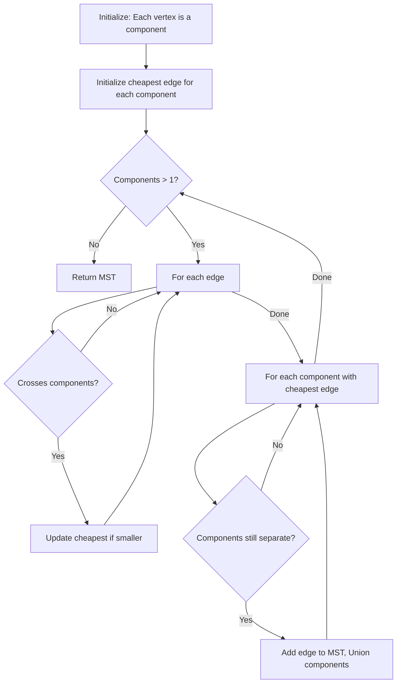
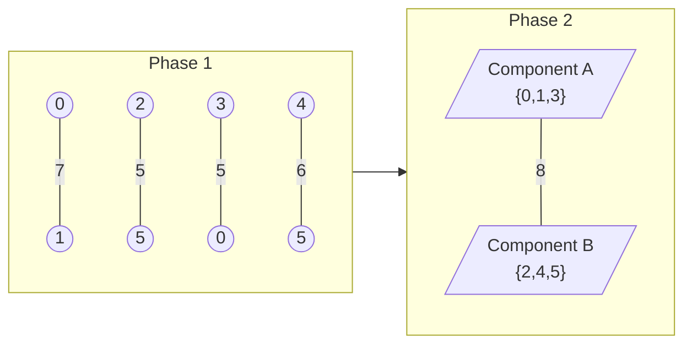

# Borůvka's Algorithm

## Overview

| Property | Value |
|----------|-------|
| **Category** | Minimum Spanning Tree |
| **Complexity (Time)** | O(E log V) |
| **Complexity (Space)** | O(V + E) |
| **Graph Type** | Weighted, undirected, connected, distinct weights |
| **Best For** | Parallel computation, distributed systems |

## Description

Borůvka's algorithm (also known as Sollin's algorithm) is one of the oldest algorithms for finding a minimum spanning tree (MST) in a connected weighted graph. Discovered by Otakar Borůvka in 1926 for designing efficient electrical networks in Moravia, it uses a parallel-friendly approach of simultaneously finding minimum weight edges for each connected component.

The algorithm's key insight is that in each iteration, multiple components can independently find and add their minimum outgoing edges without causing conflicts (assuming distinct edge weights).

## Mathematical Foundation

### Component-Based Growth

The algorithm maintains a forest that progressively merges into a single tree. For each component $C$ in the forest:

$$e_C = \arg\min_{(u,v): u \in C, v \notin C} w(u, v)$$

### Distinctness Requirement

For correctness without coordination, edge weights must be distinct:
$$\forall e_1, e_2 \in E: e_1 \neq e_2 \implies w(e_1) \neq w(e_2)$$

This ensures each component's minimum edge is unique and safe to add.

### Iteration Bound

The number of components halves in each phase (at minimum):
$$|C_{i+1}| \leq \frac{|C_i|}{2}$$

Therefore, maximum phases:
$$\text{phases} \leq \lceil \log_2 V \rceil$$

### Total Work

Each phase processes all edges once:
$$T(n) = O(\log V) \times O(E) = O(E \log V)$$

## Algorithm

### Pseudocode

```
BORUVKA(graph G = (V, E)):
    // Initialize: each vertex is its own component
    Initialize Union-Find with V vertices
    MST ← empty set
    components ← V
    
    while components > 1:
        // Phase: find cheapest edge for each component
        cheapest[] ← array of size V, all NULL
        
        for each edge (u, v, w) in E:
            root_u ← FIND(u)
            root_v ← FIND(v)
            
            if root_u ≠ root_v:  // Cross-component edge
                if cheapest[root_u] = NULL or w < cheapest[root_u].weight:
                    cheapest[root_u] ← (u, v, w)
                if cheapest[root_v] = NULL or w < cheapest[root_v].weight:
                    cheapest[root_v] ← (u, v, w)
        
        // Add cheapest edges to MST
        for each component c:
            if cheapest[c] ≠ NULL:
                (u, v, w) ← cheapest[c]
                if FIND(u) ≠ FIND(v):  // Not yet merged
                    UNION(u, v)
                    MST ← MST ∪ {(u, v, w)}
                    components ← components - 1
    
    return MST
```

### Step-by-Step Execution

```
Graph with distinct weights:
  0 --3-- 1
  |       |
  5       2
  |       |
  2 --4-- 3

Edges: (0,1,3), (0,2,5), (1,3,2), (2,3,4)

Phase 1:
  Initial components: {0}, {1}, {2}, {3}
  
  Component {0}: cheapest = (0,1,3)
  Component {1}: cheapest = (1,3,2)
  Component {2}: cheapest = (2,3,4)
  Component {3}: cheapest = (1,3,2)
  
  Add edges: (1,3,2), (0,1,3), (2,3,4)
  
  After unions:
    Components: {0,1,3,2} - single tree!
  
  MST complete in 1 phase!
  MST edges: (1,3,2), (0,1,3), (2,3,4)
  Total weight: 9

Larger example:
Graph:
  0 --7-- 1 --8-- 2
  |       |       |
  5       9       5
  |       |       |
  3 --15- 4 --6-- 5 --11- 6
  |       |       |
  9       8       9
  |       |       |
  7 --17- 8 --12- 9

Phase 1:
  {0}: min = (0,3,5)
  {1}: min = (0,1,7)
  {2}: min = (2,5,5)
  {3}: min = (0,3,5)
  {4}: min = (4,5,6)
  {5}: min = (2,5,5)
  {6}: min = (5,6,11)
  {7}: min = (3,7,9)
  {8}: min = (4,8,8)
  {9}: min = (5,9,9)
  
  Components after: {0,1,3,7,8,4}, {2,5,6,9}

Phase 2:
  {0,1,3,4,7,8}: min = (1,2,8) [crosses to other component]
  {2,5,6,9}: min = (1,2,8)
  
  Merge → single component
  
  MST complete!
```

## Complexity Analysis

### Time Complexity

| Phase | Work |
|-------|------|
| Find minimum edges | O(E) per phase |
| Union operations | O(α(V)) per union |
| Number of phases | O(log V) |
| **Total** | **O(E log V)** |

With parallel processing:
$$T_p(n) = O\left(\frac{E}{p} \cdot \log V\right) + O(\log V \cdot \alpha(V))$$

### Space Complexity

| Component | Space |
|-----------|-------|
| Union-Find | O(V) |
| Cheapest edge array | O(V) |
| Edge list | O(E) |
| **Total** | **O(V + E)** |

## Visual Representation



### Parallel Merge Visualization



## Implementation

### Python Implementation

```python
from __future__ import annotations


class Graph:
    """
    Graph representation for Borůvka's algorithm.
    
    Requires distinct edge weights for correctness.
    """
    
    def __init__(self) -> None:
        self.edges: list[tuple[int, int, int]] = []
        self.vertices: set[int] = set()
    
    def add_vertex(self, v: int) -> None:
        """Add vertex to graph."""
        self.vertices.add(v)
    
    def add_edge(self, u: int, v: int, weight: int) -> None:
        """
        Add weighted edge to graph.
        
        Automatically adds vertices.
        """
        self.vertices.add(u)
        self.vertices.add(v)
        self.edges.append((u, v, weight))
    
    def distinct_weight(self) -> bool:
        """
        Check if all edge weights are distinct.
        
        Required for Borůvka's algorithm correctness.
        """
        weights = [w for _, _, w in self.edges]
        return len(weights) == len(set(weights))

    class UnionFind:
        """Union-Find data structure with path compression and rank."""
        
        def __init__(self, n: int) -> None:
            self.parent = list(range(n))
            self.rank = [0] * n
        
        def find(self, x: int) -> int:
            """Find with path compression."""
            if self.parent[x] != x:
                self.parent[x] = self.find(self.parent[x])
            return self.parent[x]
        
        def union(self, x: int, y: int) -> bool:
            """Union by rank. Returns True if merged."""
            px, py = self.find(x), self.find(y)
            if px == py:
                return False
            
            if self.rank[px] < self.rank[py]:
                px, py = py, px
            
            self.parent[py] = px
            if self.rank[px] == self.rank[py]:
                self.rank[px] += 1
            
            return True


def boruvka_mst(graph: Graph) -> tuple[list[tuple[int, int, int]], int]:
    """
    Find MST using Borůvka's algorithm.
    
    Args:
        graph: Graph with distinct edge weights
    
    Returns:
        (MST_edges, total_weight)
    
    Raises:
        ValueError: If edge weights are not distinct
    
    Examples:
        >>> g = Graph()
        >>> for i in range(4):
        ...     g.add_vertex(i)
        >>> g.add_edge(0, 1, 10)
        >>> g.add_edge(0, 2, 6)
        >>> g.add_edge(0, 3, 5)
        >>> g.add_edge(1, 3, 15)
        >>> g.add_edge(2, 3, 4)
        >>> edges, weight = boruvka_mst(g)
        >>> weight
        19
    """
    if not graph.distinct_weight():
        raise ValueError("Borůvka requires distinct edge weights")
    
    n = len(graph.vertices)
    vertex_list = sorted(graph.vertices)
    vertex_idx = {v: i for i, v in enumerate(vertex_list)}
    
    uf = Graph.UnionFind(n)
    mst_edges: list[tuple[int, int, int]] = []
    total_weight = 0
    num_components = n
    
    while num_components > 1:
        # Find cheapest edge for each component
        cheapest: list[tuple[int, int, int] | None] = [None] * n
        
        for u, v, w in graph.edges:
            ui, vi = vertex_idx[u], vertex_idx[v]
            root_u = uf.find(ui)
            root_v = uf.find(vi)
            
            if root_u != root_v:
                # Update cheapest for both components
                if cheapest[root_u] is None or w < cheapest[root_u][2]:
                    cheapest[root_u] = (u, v, w)
                if cheapest[root_v] is None or w < cheapest[root_v][2]:
                    cheapest[root_v] = (u, v, w)
        
        # Add cheapest edges and merge components
        edges_added = 0
        for i in range(n):
            if cheapest[i] is not None:
                u, v, w = cheapest[i]
                ui, vi = vertex_idx[u], vertex_idx[v]
                
                if uf.union(ui, vi):
                    mst_edges.append((u, v, w))
                    total_weight += w
                    num_components -= 1
                    edges_added += 1
        
        # Safety check
        if edges_added == 0 and num_components > 1:
            raise ValueError("Graph is not connected")
    
    return mst_edges, total_weight
```

### Parallel-Ready Implementation

```python
from concurrent.futures import ThreadPoolExecutor
from dataclasses import dataclass
from typing import Optional
import threading


@dataclass
class Edge:
    u: int
    v: int
    weight: int


class ParallelBoruvka:
    """
    Parallel-friendly Borůvka implementation.
    """
    
    def __init__(self, num_vertices: int, num_workers: int = 4):
        self.num_vertices = num_vertices
        self.num_workers = num_workers
        self.edges: list[Edge] = []
        
        # Union-Find with thread-safe operations
        self.parent = list(range(num_vertices))
        self.rank = [0] * num_vertices
        self.lock = threading.Lock()
    
    def add_edge(self, u: int, v: int, weight: int) -> None:
        """Add edge to graph."""
        self.edges.append(Edge(u, v, weight))
    
    def find(self, x: int) -> int:
        """Find with path compression."""
        root = x
        while self.parent[root] != root:
            root = self.parent[root]
        
        # Path compression
        while self.parent[x] != root:
            next_x = self.parent[x]
            self.parent[x] = root
            x = next_x
        
        return root
    
    def union(self, x: int, y: int) -> bool:
        """Thread-safe union by rank."""
        with self.lock:
            px, py = self.find(x), self.find(y)
            if px == py:
                return False
            
            if self.rank[px] < self.rank[py]:
                px, py = py, px
            
            self.parent[py] = px
            if self.rank[px] == self.rank[py]:
                self.rank[px] += 1
            
            return True
    
    def find_cheapest_parallel(
        self, 
        edge_chunk: list[Edge]
    ) -> dict[int, Edge]:
        """Find cheapest edge for each component in chunk."""
        local_cheapest: dict[int, Edge] = {}
        
        for edge in edge_chunk:
            root_u = self.find(edge.u)
            root_v = self.find(edge.v)
            
            if root_u != root_v:
                for root in [root_u, root_v]:
                    if root not in local_cheapest or edge.weight < local_cheapest[root].weight:
                        local_cheapest[root] = edge
        
        return local_cheapest
    
    def merge_cheapest(
        self, 
        results: list[dict[int, Edge]]
    ) -> dict[int, Edge]:
        """Merge results from parallel workers."""
        global_cheapest: dict[int, Edge] = {}
        
        for local in results:
            for root, edge in local.items():
                if root not in global_cheapest or edge.weight < global_cheapest[root].weight:
                    global_cheapest[root] = edge
        
        return global_cheapest
    
    def find_mst(self) -> tuple[list[Edge], int]:
        """
        Find MST using parallel Borůvka.
        
        Returns:
            (MST_edges, total_weight)
        """
        mst_edges: list[Edge] = []
        total_weight = 0
        num_components = self.num_vertices
        
        # Chunk edges for parallel processing
        chunk_size = max(1, len(self.edges) // self.num_workers)
        
        while num_components > 1:
            # Parallel phase: find cheapest edges
            with ThreadPoolExecutor(max_workers=self.num_workers) as executor:
                chunks = [
                    self.edges[i:i + chunk_size]
                    for i in range(0, len(self.edges), chunk_size)
                ]
                
                results = list(executor.map(self.find_cheapest_parallel, chunks))
            
            # Merge results
            cheapest = self.merge_cheapest(results)
            
            # Add edges (sequential to avoid race conditions)
            added = 0
            for edge in cheapest.values():
                if self.union(edge.u, edge.v):
                    mst_edges.append(edge)
                    total_weight += edge.weight
                    num_components -= 1
                    added += 1
            
            if added == 0:
                break
        
        return mst_edges, total_weight
```

## Real-World Applications

### 1. Distributed Network Design

```python
from dataclasses import dataclass, field
from typing import Dict, List, Tuple, Set
import random


@dataclass
class NetworkNode:
    """Node in distributed network."""
    id: str
    region: str
    latency_ms: float


class DistributedNetworkDesigner:
    """
    Design low-latency network using Borůvka's parallel approach.
    
    Each region can independently find its best connections.
    """
    
    def __init__(self):
        self.nodes: Dict[str, NetworkNode] = {}
        self.latencies: Dict[Tuple[str, str], float] = {}
    
    def add_node(self, node_id: str, region: str, latency: float = 0) -> None:
        """Add network node."""
        self.nodes[node_id] = NetworkNode(node_id, region, latency)
    
    def set_latency(self, node1: str, node2: str, latency: float) -> None:
        """Set measured latency between nodes."""
        key = (min(node1, node2), max(node1, node2))
        self.latencies[key] = latency
    
    def design_backbone(self) -> Tuple[List[Tuple[str, str, float]], float]:
        """
        Design minimum latency backbone using Borůvka.
        
        Each region can work in parallel to find best outgoing link.
        """
        nodes = list(self.nodes.keys())
        n = len(nodes)
        idx = {name: i for i, name in enumerate(nodes)}
        
        parent = list(range(n))
        rank = [0] * n
        
        def find(x: int) -> int:
            if parent[x] != x:
                parent[x] = find(parent[x])
            return parent[x]
        
        def union(x: int, y: int) -> bool:
            px, py = find(x), find(y)
            if px == py:
                return False
            if rank[px] < rank[py]:
                px, py = py, px
            parent[py] = px
            if rank[px] == rank[py]:
                rank[px] += 1
            return True
        
        backbone = []
        total_latency = 0.0
        components = n
        
        while components > 1:
            cheapest = [None] * n
            
            for (n1, n2), latency in self.latencies.items():
                i1, i2 = idx[n1], idx[n2]
                r1, r2 = find(i1), find(i2)
                
                if r1 != r2:
                    if cheapest[r1] is None or latency < cheapest[r1][2]:
                        cheapest[r1] = (n1, n2, latency)
                    if cheapest[r2] is None or latency < cheapest[r2][2]:
                        cheapest[r2] = (n1, n2, latency)
            
            added = 0
            for i in range(n):
                if cheapest[i] is not None:
                    n1, n2, latency = cheapest[i]
                    if union(idx[n1], idx[n2]):
                        backbone.append((n1, n2, latency))
                        total_latency += latency
                        components -= 1
                        added += 1
            
            if added == 0:
                break
        
        return backbone, total_latency


# Usage example
def design_global_network():
    """Design global CDN backbone."""
    designer = DistributedNetworkDesigner()
    
    # Add nodes in different regions
    regions = ["US-East", "US-West", "EU", "Asia"]
    for i, region in enumerate(regions):
        for j in range(3):
            designer.add_node(f"{region}-{j}", region)
    
    # Set latencies (would be measured in practice)
    nodes = list(designer.nodes.keys())
    for i, n1 in enumerate(nodes):
        for n2 in nodes[i + 1:]:
            # Simulate latency based on region
            base_latency = 10 + random.randint(0, 100)
            if designer.nodes[n1].region != designer.nodes[n2].region:
                base_latency += 50
            designer.set_latency(n1, n2, base_latency)
    
    backbone, total = designer.design_backbone()
    return backbone, total
```

### 2. Power Grid Optimization

```python
from typing import List, Dict, Tuple, Optional
import math


class PowerGridOptimizer:
    """
    Optimize power transmission network using Borůvka's algorithm.
    
    Each substation can independently find best connection
    to improve parallel planning.
    """
    
    def __init__(self):
        self.substations: Dict[str, Tuple[float, float, float]] = {}  # x, y, capacity
        self.transmission_costs: Dict[Tuple[str, str], float] = {}
    
    def add_substation(
        self, 
        name: str, 
        x: float, 
        y: float, 
        capacity_mw: float
    ) -> None:
        """Add power substation."""
        self.substations[name] = (x, y, capacity_mw)
    
    def calc_transmission_cost(
        self, 
        s1: str, 
        s2: str, 
        terrain_factor: float = 1.0
    ) -> float:
        """
        Calculate transmission line cost.
        
        Cost = distance × terrain_factor × (1 + capacity_factor)
        """
        x1, y1, c1 = self.substations[s1]
        x2, y2, c2 = self.substations[s2]
        
        distance = math.sqrt((x1 - x2)**2 + (y1 - y2)**2)
        capacity_factor = min(c1, c2) / 1000  # Higher capacity = stronger lines
        
        return distance * terrain_factor * (1 + capacity_factor)
    
    def optimize_grid(self) -> Tuple[List[Tuple[str, str, float]], float]:
        """
        Find minimum cost transmission network.
        """
        stations = list(self.substations.keys())
        n = len(stations)
        idx = {s: i for i, s in enumerate(stations)}
        
        # Generate all edges with costs
        edges = []
        for i, s1 in enumerate(stations):
            for s2 in stations[i + 1:]:
                cost = self.calc_transmission_cost(s1, s2)
                edges.append((s1, s2, cost))
        
        # Borůvka's algorithm
        parent = list(range(n))
        rank = [0] * n
        
        def find(x: int) -> int:
            if parent[x] != x:
                parent[x] = find(parent[x])
            return parent[x]
        
        def union(x: int, y: int) -> bool:
            px, py = find(x), find(y)
            if px == py:
                return False
            if rank[px] < rank[py]:
                px, py = py, px
            parent[py] = px
            if rank[px] == rank[py]:
                rank[px] += 1
            return True
        
        grid = []
        total_cost = 0.0
        components = n
        
        while components > 1:
            cheapest = [None] * n
            
            for s1, s2, cost in edges:
                r1 = find(idx[s1])
                r2 = find(idx[s2])
                
                if r1 != r2:
                    if cheapest[r1] is None or cost < cheapest[r1][2]:
                        cheapest[r1] = (s1, s2, cost)
                    if cheapest[r2] is None or cost < cheapest[r2][2]:
                        cheapest[r2] = (s1, s2, cost)
            
            added = 0
            for i in range(n):
                if cheapest[i] is not None:
                    s1, s2, cost = cheapest[i]
                    if union(idx[s1], idx[s2]):
                        grid.append((s1, s2, cost))
                        total_cost += cost
                        components -= 1
                        added += 1
            
            if added == 0:
                break
        
        return grid, total_cost
```

### 3. Cluster Hierarchy Construction

```python
from dataclasses import dataclass
from typing import List, Dict, Tuple, Set
import math


@dataclass
class DataPoint:
    """Data point for clustering."""
    id: int
    features: List[float]


class HierarchicalClustering:
    """
    Build cluster hierarchy using Borůvka-style merging.
    
    Each cluster independently finds closest other cluster.
    """
    
    def __init__(self, points: List[DataPoint]):
        self.points = points
        self.n = len(points)
        self.parent = list(range(self.n))
        self.rank = [0] * self.n
        self.cluster_sizes = [1] * self.n
        
        # Cache distances
        self.distances = self._compute_distances()
    
    def _compute_distances(self) -> Dict[Tuple[int, int], float]:
        """Compute all pairwise distances."""
        distances = {}
        for i in range(self.n):
            for j in range(i + 1, self.n):
                dist = self._euclidean(
                    self.points[i].features,
                    self.points[j].features
                )
                distances[(i, j)] = dist
        return distances
    
    def _euclidean(self, f1: List[float], f2: List[float]) -> float:
        """Euclidean distance."""
        return math.sqrt(sum((a - b)**2 for a, b in zip(f1, f2)))
    
    def find(self, x: int) -> int:
        if self.parent[x] != x:
            self.parent[x] = self.find(self.parent[x])
        return self.parent[x]
    
    def union(self, x: int, y: int) -> bool:
        px, py = self.find(x), self.find(y)
        if px == py:
            return False
        
        if self.rank[px] < self.rank[py]:
            px, py = py, px
        
        self.parent[py] = px
        self.cluster_sizes[px] += self.cluster_sizes[py]
        
        if self.rank[px] == self.rank[py]:
            self.rank[px] += 1
        
        return True
    
    def build_hierarchy(
        self, 
        target_clusters: int = 1
    ) -> List[Tuple[int, int, float, int]]:
        """
        Build hierarchy using Borůvka-style merging.
        
        Returns:
            List of merges: (cluster1, cluster2, distance, level)
        """
        merges = []
        current_clusters = self.n
        level = 0
        
        while current_clusters > target_clusters:
            # Find cheapest merge for each cluster (Borůvka style)
            cheapest = [None] * self.n
            
            for (i, j), dist in self.distances.items():
                ri = self.find(i)
                rj = self.find(j)
                
                if ri != rj:
                    if cheapest[ri] is None or dist < cheapest[ri][1]:
                        cheapest[ri] = ((i, j), dist)
                    if cheapest[rj] is None or dist < cheapest[rj][1]:
                        cheapest[rj] = ((i, j), dist)
            
            # Perform merges
            merged = 0
            for c in range(self.n):
                if cheapest[c] is not None:
                    (i, j), dist = cheapest[c]
                    if self.union(i, j):
                        merges.append((i, j, dist, level))
                        current_clusters -= 1
                        merged += 1
            
            if merged == 0:
                break
            
            level += 1
        
        return merges
    
    def get_clusters(self) -> Dict[int, List[DataPoint]]:
        """Get current cluster assignments."""
        clusters: Dict[int, List[DataPoint]] = {}
        
        for i, point in enumerate(self.points):
            root = self.find(i)
            if root not in clusters:
                clusters[root] = []
            clusters[root].append(point)
        
        return clusters
```

## Comparison with Other MST Algorithms

| Aspect | Borůvka | Kruskal | Prim |
|--------|---------|---------|------|
| Approach | Parallel merge | Sort + union | Grow from vertex |
| Best for | Parallel systems | Sparse graphs | Dense graphs |
| Parallelization | Excellent | Good (Filter-Kruskal) | Limited |
| Weight requirement | Must be distinct | Any weights | Any weights |
| Implementation | Moderate | Simple | Simple |

## References

1. Borůvka, O. "O jistém problému minimálním" (1926)
2. [Borůvka's Algorithm - Wikipedia](https://en.wikipedia.org/wiki/Bor%C5%AFvka%27s_algorithm)
3. Bader, D.A. "Designing Multithreaded Algorithms for BFS and MST"
4. Cormen, T.H. "Introduction to Algorithms" - Chapter 23

## See Also

- [Kruskal's Algorithm](kruskal.md) - Edge-based MST
- [Prim's Algorithm](prims.md) - Vertex-based MST
- [Connected Components](connected_components.md) - Component finding
