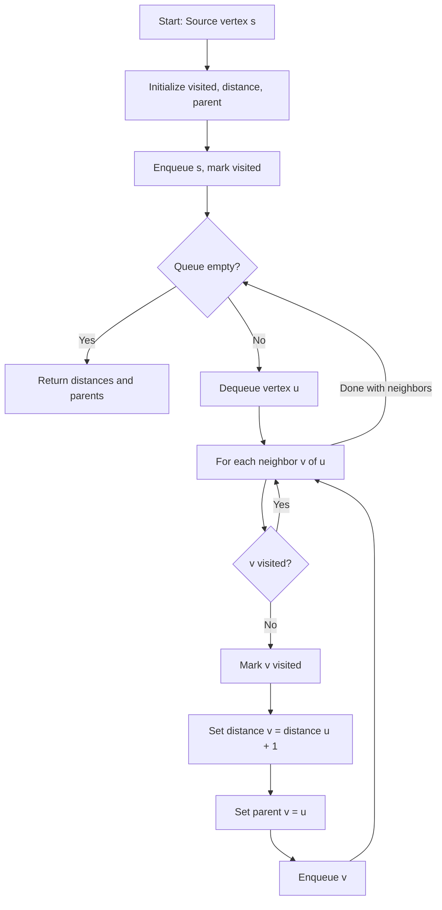
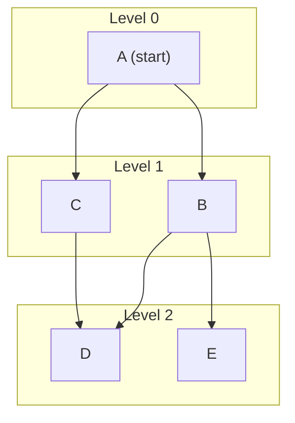

# Breadth-First Search (BFS)

## Overview

| Property | Value |
|----------|-------|
| **Category** | Graph Traversal |
| **Complexity (Time)** | O(V + E) |
| **Complexity (Space)** | O(V) |
| **Graph Type** | Directed or Undirected |
| **Best For** | Shortest path (unweighted), level-order traversal |

## Description

Breadth-First Search (BFS) is a fundamental graph traversal algorithm that explores vertices level by level. Starting from a source vertex, BFS visits all vertices at distance 1, then all vertices at distance 2, and so on. This layered exploration makes BFS ideal for finding shortest paths in unweighted graphs.

BFS uses a queue (FIFO) data structure to ensure that vertices are processed in the order they were discovered.

## Mathematical Foundation

### Level-Based Exploration

For a graph $G = (V, E)$ starting from source $s$:

- **Level 0:** $\{s\}$
- **Level $k$:** All vertices at distance $k$ from $s$

$$L_k = \{v \in V : d(s, v) = k\}$$

Where $d(s, v)$ is the shortest path length (number of edges) from $s$ to $v$.

### Shortest Path Property

BFS guarantees that when vertex $v$ is discovered:

$$d(s, v) = \min\{k : v \text{ is reachable from } s \text{ in } k \text{ edges}\}$$

### Queue Invariant

At any point during BFS, if the queue contains vertices $[v_1, v_2, \ldots, v_n]$:

$$d(s, v_1) \leq d(s, v_2) \leq \cdots \leq d(s, v_n) \leq d(s, v_1) + 1$$

This property ensures level-by-level exploration.

### Recurrence for Distance

For vertex $v$ discovered from vertex $u$:

$$d(s, v) = d(s, u) + 1$$

## Algorithm

### Pseudocode

```
BFS(graph G, source s):
    // Initialize
    for each vertex v in V:
        visited[v] ← false
        distance[v] ← ∞
        parent[v] ← null
    
    // Start from source
    visited[s] ← true
    distance[s] ← 0
    queue Q ← empty queue
    ENQUEUE(Q, s)
    
    // Process vertices level by level
    while Q is not empty:
        u ← DEQUEUE(Q)
        
        for each neighbor v of u:
            if not visited[v]:
                visited[v] ← true
                distance[v] ← distance[u] + 1
                parent[v] ← u
                ENQUEUE(Q, v)
    
    return distance, parent
```

### Path Reconstruction

```
RECONSTRUCT-PATH(parent, s, t):
    if t = s or parent[t] = null:
        return [t] if t = s else []
    
    path ← []
    current ← t
    
    while current ≠ null:
        path.prepend(current)
        current ← parent[current]
    
    return path
```

### Step-by-Step Execution

```
Graph:
    A --- B --- E
    |     |
    C --- D

Source: A

Initialization:
  Queue: [A]
  Visited: {A}
  Distance: {A: 0}

Step 1: Dequeue A
  Neighbors of A: B, C
  Queue: [B, C]
  Visited: {A, B, C}
  Distance: {A: 0, B: 1, C: 1}

Step 2: Dequeue B
  Neighbors of B: A (visited), D, E
  Queue: [C, D, E]
  Visited: {A, B, C, D, E}
  Distance: {A: 0, B: 1, C: 1, D: 2, E: 2}

Step 3: Dequeue C
  Neighbors of C: A (visited), D (visited)
  Queue: [D, E]
  No new vertices

Step 4: Dequeue D
  Neighbors of D: B (visited), C (visited)
  Queue: [E]
  No new vertices

Step 5: Dequeue E
  Neighbors of E: B (visited)
  Queue: []
  No new vertices

Final:
  Distance from A: {A: 0, B: 1, C: 1, D: 2, E: 2}
```

## Complexity Analysis

### Time Complexity

| Operation | Complexity |
|-----------|------------|
| Initialize vertices | O(V) |
| Process each vertex | O(V) |
| Examine each edge | O(E) |
| **Total** | **O(V + E)** |

Each vertex is enqueued and dequeued exactly once: O(V)
Each edge is examined at most twice (once per endpoint): O(E)

### Space Complexity

| Component | Space |
|-----------|-------|
| Visited array | O(V) |
| Distance array | O(V) |
| Parent array | O(V) |
| Queue | O(V) |
| **Total** | **O(V)** |

## Visual Representation



### Level Exploration



## Implementation

### Python Implementation

```python
from __future__ import annotations
from queue import Queue


class Graph:
    """Graph with BFS implementation."""
    
    def __init__(self) -> None:
        self.vertices: dict[int, list[int]] = {}
    
    def add_edge(self, from_vertex: int, to_vertex: int) -> None:
        """
        Add edge from from_vertex to to_vertex.
        
        >>> g = Graph()
        >>> g.add_edge(0, 1)
        >>> g.add_edge(0, 2)
        >>> 1 in g.vertices[0]
        True
        """
        if from_vertex in self.vertices:
            self.vertices[from_vertex].append(to_vertex)
        else:
            self.vertices[from_vertex] = [to_vertex]
    
    def bfs(self, start_vertex: int) -> set[int]:
        """
        Perform BFS from start_vertex, return all reachable vertices.
        
        >>> g = Graph()
        >>> g.add_edge(0, 1)
        >>> g.add_edge(0, 2)
        >>> g.add_edge(1, 2)
        >>> g.add_edge(2, 0)
        >>> g.add_edge(2, 3)
        >>> g.add_edge(3, 3)
        >>> sorted(g.bfs(2))
        [0, 1, 2, 3]
        """
        visited = set()
        queue: Queue = Queue()
        
        visited.add(start_vertex)
        queue.put(start_vertex)
        
        while not queue.empty():
            vertex = queue.get()
            
            for adjacent_vertex in self.vertices.get(vertex, []):
                if adjacent_vertex not in visited:
                    queue.put(adjacent_vertex)
                    visited.add(adjacent_vertex)
        
        return visited
```

### BFS with Distance and Path

```python
from collections import deque
from typing import Optional


def bfs_shortest_path(
    graph: dict[int, list[int]],
    source: int,
    target: int
) -> tuple[int, list[int]]:
    """
    Find shortest path from source to target using BFS.
    
    Args:
        graph: Adjacency list representation
        source: Starting vertex
        target: Destination vertex
    
    Returns:
        (distance, path) or (-1, []) if no path exists
    
    Examples:
        >>> graph = {0: [1, 2], 1: [2, 3], 2: [3], 3: []}
        >>> bfs_shortest_path(graph, 0, 3)
        (2, [0, 1, 3])
        >>> bfs_shortest_path(graph, 3, 0)
        (-1, [])
    """
    if source == target:
        return (0, [source])
    
    visited = {source}
    queue = deque([(source, 0)])
    parent = {source: None}
    
    while queue:
        vertex, dist = queue.popleft()
        
        for neighbor in graph.get(vertex, []):
            if neighbor not in visited:
                visited.add(neighbor)
                parent[neighbor] = vertex
                
                if neighbor == target:
                    # Reconstruct path
                    path = []
                    current = target
                    while current is not None:
                        path.append(current)
                        current = parent[current]
                    return (dist + 1, path[::-1])
                
                queue.append((neighbor, dist + 1))
    
    return (-1, [])


def bfs_all_distances(
    graph: dict[int, list[int]],
    source: int
) -> dict[int, int]:
    """
    Find distances from source to all reachable vertices.
    
    Examples:
        >>> graph = {0: [1, 2], 1: [2, 3], 2: [3], 3: []}
        >>> bfs_all_distances(graph, 0)
        {0: 0, 1: 1, 2: 1, 3: 2}
    """
    distances = {source: 0}
    queue = deque([source])
    
    while queue:
        vertex = queue.popleft()
        
        for neighbor in graph.get(vertex, []):
            if neighbor not in distances:
                distances[neighbor] = distances[vertex] + 1
                queue.append(neighbor)
    
    return distances
```

### BFS for Level-Order Traversal

```python
def bfs_levels(
    graph: dict[int, list[int]],
    source: int
) -> list[list[int]]:
    """
    Return vertices grouped by level (distance from source).
    
    Examples:
        >>> graph = {0: [1, 2], 1: [3, 4], 2: [5], 3: [], 4: [], 5: []}
        >>> bfs_levels(graph, 0)
        [[0], [1, 2], [3, 4, 5]]
    """
    levels = []
    visited = {source}
    current_level = [source]
    
    while current_level:
        levels.append(current_level)
        next_level = []
        
        for vertex in current_level:
            for neighbor in graph.get(vertex, []):
                if neighbor not in visited:
                    visited.add(neighbor)
                    next_level.append(neighbor)
        
        current_level = next_level
    
    return levels
```

### BFS on Grid

```python
from typing import Generator


def bfs_grid(
    grid: list[list[int]],
    start: tuple[int, int],
    target: tuple[int, int]
) -> int:
    """
    Find shortest path in grid where 0 is passable, 1 is obstacle.
    
    Examples:
        >>> grid = [[0, 0, 0], [0, 1, 0], [0, 0, 0]]
        >>> bfs_grid(grid, (0, 0), (2, 2))
        4
        >>> bfs_grid(grid, (0, 0), (1, 1))  # Obstacle
        -1
    """
    rows, cols = len(grid), len(grid[0])
    
    if grid[start[0]][start[1]] == 1 or grid[target[0]][target[1]] == 1:
        return -1
    
    if start == target:
        return 0
    
    directions = [(0, 1), (1, 0), (0, -1), (-1, 0)]
    visited = {start}
    queue = deque([(start, 0)])
    
    while queue:
        (row, col), dist = queue.popleft()
        
        for dr, dc in directions:
            new_row, new_col = row + dr, col + dc
            
            if (0 <= new_row < rows and 
                0 <= new_col < cols and
                grid[new_row][new_col] == 0 and
                (new_row, new_col) not in visited):
                
                if (new_row, new_col) == target:
                    return dist + 1
                
                visited.add((new_row, new_col))
                queue.append(((new_row, new_col), dist + 1))
    
    return -1
```

## Real-World Applications

### 1. Social Network Friend Suggestions

```python
class SocialNetwork:
    """
    Friend suggestion using BFS to find friends-of-friends.
    """
    
    def __init__(self):
        self.friendships: dict[str, set[str]] = {}
    
    def add_friendship(self, user1: str, user2: str) -> None:
        """Add bidirectional friendship."""
        self.friendships.setdefault(user1, set()).add(user2)
        self.friendships.setdefault(user2, set()).add(user1)
    
    def suggest_friends(
        self, 
        user: str, 
        max_distance: int = 2
    ) -> list[tuple[str, int]]:
        """
        Suggest friends based on distance in social graph.
        
        Examples:
            >>> sn = SocialNetwork()
            >>> sn.add_friendship("Alice", "Bob")
            >>> sn.add_friendship("Bob", "Charlie")
            >>> sn.add_friendship("Charlie", "David")
            >>> sn.suggest_friends("Alice", 2)
            [('Charlie', 2)]
        """
        if user not in self.friendships:
            return []
        
        distances = {user: 0}
        queue = deque([user])
        
        while queue:
            current = queue.popleft()
            current_dist = distances[current]
            
            if current_dist >= max_distance:
                continue
            
            for friend in self.friendships.get(current, set()):
                if friend not in distances:
                    distances[friend] = current_dist + 1
                    queue.append(friend)
        
        # Exclude direct friends and self
        direct_friends = self.friendships.get(user, set())
        suggestions = [
            (person, dist) 
            for person, dist in distances.items()
            if person != user and person not in direct_friends and dist <= max_distance
        ]
        
        return sorted(suggestions, key=lambda x: x[1])
```

### 2. Web Crawler

```python
from urllib.parse import urljoin
import re


class WebCrawler:
    """
    Simple web crawler using BFS to explore links.
    """
    
    def __init__(self, max_depth: int = 2):
        self.max_depth = max_depth
        self.visited: set[str] = set()
    
    def crawl(self, start_url: str) -> dict[str, int]:
        """
        Crawl web pages using BFS.
        Returns mapping of URL to distance from start.
        
        Note: This is a simplified example without actual HTTP requests.
        """
        distances = {start_url: 0}
        queue = deque([(start_url, 0)])
        
        while queue:
            url, depth = queue.popleft()
            
            if depth >= self.max_depth:
                continue
            
            # In real implementation, fetch page and extract links
            links = self._extract_links(url)
            
            for link in links:
                if link not in distances:
                    distances[link] = depth + 1
                    queue.append((link, depth + 1))
        
        return distances
    
    def _extract_links(self, url: str) -> list[str]:
        """Extract links from URL (placeholder)."""
        # In real implementation: fetch page, parse HTML, extract links
        return []
```

### 3. Shortest Path in Maze

```python
class MazeSolver:
    """
    Solve maze using BFS to find shortest path.
    """
    
    def __init__(self, maze: list[list[str]]):
        """
        maze[r][c] = '.' for open, '#' for wall,
                     'S' for start, 'E' for end
        """
        self.maze = maze
        self.rows = len(maze)
        self.cols = len(maze[0])
        self.start = self._find_cell('S')
        self.end = self._find_cell('E')
    
    def _find_cell(self, char: str) -> tuple[int, int]:
        """Find position of character in maze."""
        for r in range(self.rows):
            for c in range(self.cols):
                if self.maze[r][c] == char:
                    return (r, c)
        raise ValueError(f"Character {char} not found")
    
    def solve(self) -> list[tuple[int, int]]:
        """
        Find shortest path from S to E.
        
        Examples:
            >>> maze = [
            ...     ['S', '.', '#', '.'],
            ...     ['#', '.', '#', '.'],
            ...     ['.', '.', '.', 'E']
            ... ]
            >>> solver = MazeSolver(maze)
            >>> path = solver.solve()
            >>> len(path)
            6
        """
        directions = [(0, 1), (1, 0), (0, -1), (-1, 0)]
        visited = {self.start}
        parent = {self.start: None}
        queue = deque([self.start])
        
        while queue:
            row, col = queue.popleft()
            
            if (row, col) == self.end:
                # Reconstruct path
                path = []
                current = self.end
                while current is not None:
                    path.append(current)
                    current = parent[current]
                return path[::-1]
            
            for dr, dc in directions:
                new_row, new_col = row + dr, col + dc
                
                if (0 <= new_row < self.rows and
                    0 <= new_col < self.cols and
                    self.maze[new_row][new_col] != '#' and
                    (new_row, new_col) not in visited):
                    
                    visited.add((new_row, new_col))
                    parent[(new_row, new_col)] = (row, col)
                    queue.append((new_row, new_col))
        
        return []  # No path found
```

### 4. Word Ladder

```python
def word_ladder(
    begin_word: str,
    end_word: str,
    word_list: list[str]
) -> list[str]:
    """
    Find shortest transformation sequence from begin to end.
    
    Examples:
        >>> words = ["hot", "dot", "dog", "lot", "log", "cog"]
        >>> word_ladder("hit", "cog", words)
        ['hit', 'hot', 'dot', 'dog', 'cog']
    """
    if end_word not in word_list:
        return []
    
    word_set = set(word_list)
    queue = deque([(begin_word, [begin_word])])
    visited = {begin_word}
    
    while queue:
        word, path = queue.popleft()
        
        if word == end_word:
            return path
        
        # Try all single-character transformations
        for i in range(len(word)):
            for c in 'abcdefghijklmnopqrstuvwxyz':
                next_word = word[:i] + c + word[i+1:]
                
                if next_word in word_set and next_word not in visited:
                    visited.add(next_word)
                    queue.append((next_word, path + [next_word]))
    
    return []
```

## BFS Variants

| Variant | Use Case | Modification |
|---------|----------|--------------|
| **0-1 BFS** | Graph with 0/1 weights | Use deque, add 0-weight to front |
| **Multi-source BFS** | Distance from any source | Initialize queue with all sources |
| **Bidirectional BFS** | Faster single-pair search | Search from both ends |
| **BFS on implicit graph** | Generated neighbors | Compute neighbors on-the-fly |

## Comparison with DFS

| Aspect | BFS | DFS |
|--------|-----|-----|
| Data structure | Queue | Stack |
| Space | O(branching^depth) | O(depth) |
| Shortest path (unweighted) | ✓ Guaranteed | ✗ Not guaranteed |
| Memory efficiency | Lower | Higher |
| Completeness | ✓ Always finds solution | ✓ (if finite) |

## References

1. [Breadth-First Search - Wikipedia](https://en.wikipedia.org/wiki/Breadth-first_search)
2. Cormen, T.H. "Introduction to Algorithms" - Chapter 22.2
3. Kleinberg, J. & Tardos, E. "Algorithm Design"

## See Also

- [Depth-First Search](depth_first_search.md) - Stack-based traversal
- [Dijkstra's Algorithm](dijkstra.md) - Weighted shortest paths
- [A* Search](a_star.md) - Heuristic-guided search
- [Bidirectional BFS](bidirectional_bfs.md) - Search from both ends
