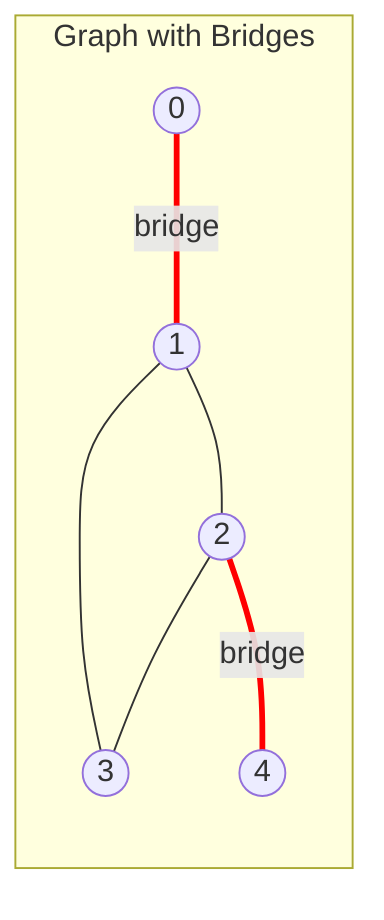

# Bridges (Cut Edges)

## Overview

| Property | Value |
|----------|-------|
| **Category** | Graph Connectivity |
| **Complexity (Time)** | O(V + E) |
| **Complexity (Space)** | O(V) |
| **Graph Type** | Undirected |
| **Best For** | Network vulnerability analysis |

## Description

A bridge (or cut edge) is an edge in an undirected graph whose removal increases the number of connected components. In other words, it's an edge that is critical for maintaining connectivity.

Bridges are closely related to articulation points. An edge $(u, v)$ is a bridge if and only if it's not part of any cycle.

## Mathematical Foundation

### Definition

An edge $e = (u, v)$ is a bridge if:
$$\text{components}(G - e) > \text{components}(G)$$

### Bridge Condition

Using DFS discovery times and low values:
$$\text{edge } (u, v) \text{ is bridge} \iff low[v] > disc[u]$$

where $u$ is the parent of $v$ in DFS tree.

### Relationship to Cycles

An edge is a bridge if and only if it is not part of any simple cycle:
$$e \text{ is bridge} \iff e \notin \text{any cycle}$$

### Low Value Definition

For vertex $v$:
$$low[v] = \min\begin{cases}
disc[v] \\
disc[w] \text{ for back edge } (v, w) \\
low[u] \text{ for tree edge } (v, u)
\end{cases}$$

### Bridge vs Articulation Point

- Bridge removal disconnects graph
- Articulation point removal disconnects graph
- Both endpoints of a bridge are articulation points (unless they're leaves)
- Not all articulation points have bridges

## Algorithm

### Pseudocode

```
FIND_BRIDGES(G):
    visited[] ← all false
    disc[] ← all 0
    low[] ← all 0
    parent[] ← all -1
    bridges ← empty list
    time ← 0
    
    for each vertex v:
        if not visited[v]:
            DFS_BRIDGE(v)
    
    return bridges

DFS_BRIDGE(u):
    visited[u] ← true
    disc[u] ← low[u] ← time
    time ← time + 1
    
    for each neighbor v of u:
        if not visited[v]:
            parent[v] ← u
            DFS_BRIDGE(v)
            
            // Update low value
            low[u] ← min(low[u], low[v])
            
            // Check bridge condition
            if low[v] > disc[u]:
                bridges.append((u, v))
        
        else if v != parent[u]:
            // Back edge
            low[u] ← min(low[u], disc[v])
```

### Step-by-Step Execution

```
Graph:
    0 --- 1 --- 2 --- 3
          |     |
          +-----+

Edges: (0,1), (1,2), (2,3), (1,2) forms cycle with implicit edge

DFS from vertex 0:

Step 1: Visit 0
    disc[0] = low[0] = 0
    
Step 2: Visit 1 (from 0)
    disc[1] = low[1] = 1
    parent[1] = 0
    
Step 3: Visit 2 (from 1)
    disc[2] = low[2] = 2
    parent[2] = 1
    
Step 4: Visit 3 (from 2)
    disc[3] = low[3] = 3
    parent[3] = 2
    
Step 5: Return to 2
    low[2] = min(2, low[3]) = min(2, 3) = 2
    Check: low[3]=3 > disc[2]=2? YES → (2,3) is bridge!
    
Step 6: Back edge 2→1 (if exists)
    low[2] = min(2, disc[1]) = min(2, 1) = 1
    
Step 7: Return to 1
    low[1] = min(1, low[2]) = min(1, 1) = 1
    Check: low[2]=1 > disc[1]=1? No
    
Step 8: Return to 0
    low[0] = min(0, low[1]) = min(0, 1) = 0
    Check: low[1]=1 > disc[0]=0? YES → (0,1) is bridge!

Result: Bridges are (0,1) and (2,3)
```

## Complexity Analysis

### Time Complexity

- Single DFS traversal: O(V + E)
- Each vertex visited once
- Each edge examined twice
- Total: **O(V + E)**

### Space Complexity

- Discovery array: O(V)
- Low array: O(V)
- Parent array: O(V)
- Visited array: O(V)
- Recursion stack: O(V)
- Total: **O(V)**

## Visual Representation

```mermaid
flowchart TD
    A[Start DFS] --> B[Visit vertex u]
    B --> C[Set disc[u] = low[u] = time++]
    C --> D{For each neighbor v}
    D --> E{v visited?}
    E -->|No| F[DFS on v]
    F --> G[low[u] = min low[u], low[v]]
    G --> H{low[v] > disc[u]?}
    H -->|Yes| I[u,v is a bridge]
    E -->|Yes| J{v != parent?}
    J -->|Yes| K[low[u] = min low[u], disc[v]]
    D --> L[Done]
```

### Bridge Example



## Implementation

### Python Implementation

```python
from __future__ import annotations
from typing import Dict, List, Tuple, Set


def compute_bridges(
    graph: Dict[int, List[int]]
) -> List[Tuple[int, int]]:
    """
    Find all bridges in an undirected graph.
    
    Uses Tarjan's algorithm with DFS.
    
    Args:
        graph: Adjacency list representation
    
    Returns:
        List of bridge edges as (u, v) tuples
    
    >>> graph = {0: [1], 1: [0, 2], 2: [1, 3], 3: [2]}
    >>> sorted(compute_bridges(graph))
    [(0, 1), (1, 2), (2, 3)]
    >>> graph = {0: [1, 2], 1: [0, 2], 2: [0, 1, 3], 3: [2]}
    >>> compute_bridges(graph)
    [(2, 3)]
    """
    if not graph:
        return []
    
    # Get all vertices
    vertices = set(graph.keys())
    for neighbors in graph.values():
        vertices.update(neighbors)
    
    n = max(vertices) + 1 if vertices else 0
    
    visited = [False] * n
    disc = [0] * n
    low = [0] * n
    parent = [-1] * n
    bridges: List[Tuple[int, int]] = []
    time = [0]
    
    def dfs(u: int) -> None:
        visited[u] = True
        disc[u] = low[u] = time[0]
        time[0] += 1
        
        for v in graph.get(u, []):
            if not visited[v]:
                parent[v] = u
                dfs(v)
                
                # Update low value
                low[u] = min(low[u], low[v])
                
                # Bridge condition: strict inequality
                if low[v] > disc[u]:
                    bridges.append((min(u, v), max(u, v)))
            
            elif v != parent[u]:
                # Back edge
                low[u] = min(low[u], disc[v])
    
    # Run DFS from each unvisited vertex
    for v in vertices:
        if not visited[v]:
            dfs(v)
    
    return bridges


class BridgeFinder:
    """
    Class-based implementation for bridge detection.
    """
    
    def __init__(self):
        self.time = 0
    
    def find_bridges(
        self, 
        adj_list: Dict[int, List[int]]
    ) -> Set[Tuple[int, int]]:
        """
        Find all bridges in undirected graph.
        
        >>> finder = BridgeFinder()
        >>> graph = {0: [1, 2], 1: [0, 2, 3], 2: [0, 1], 3: [1]}
        >>> sorted(finder.find_bridges(graph))
        [(1, 3)]
        """
        if not adj_list:
            return set()
        
        vertices = set(adj_list.keys())
        for neighbors in adj_list.values():
            vertices.update(neighbors)
        
        n = max(vertices) + 1 if vertices else 0
        
        self.time = 0
        visited = [False] * n
        disc = [0] * n
        low = [0] * n
        parent = [-1] * n
        bridges: Set[Tuple[int, int]] = set()
        
        def dfs(u: int) -> None:
            visited[u] = True
            disc[u] = low[u] = self.time
            self.time += 1
            
            for v in adj_list.get(u, []):
                if not visited[v]:
                    parent[v] = u
                    dfs(v)
                    
                    low[u] = min(low[u], low[v])
                    
                    if low[v] > disc[u]:
                        bridges.add((min(u, v), max(u, v)))
                
                elif v != parent[u]:
                    low[u] = min(low[u], disc[v])
        
        for v in vertices:
            if not visited[v]:
                dfs(v)
        
        return bridges


def find_2_edge_connected_components(
    graph: Dict[int, List[int]]
) -> List[Set[int]]:
    """
    Find all 2-edge-connected components.
    
    A 2-edge-connected component is a maximal subgraph
    where any two vertices have two edge-disjoint paths.
    
    >>> graph = {0: [1], 1: [0, 2, 3], 2: [1, 3], 3: [1, 2, 4], 4: [3]}
    >>> components = find_2_edge_connected_components(graph)
    >>> len(components)
    3
    """
    # Find bridges
    bridges = set(compute_bridges(graph))
    
    # Build graph without bridges
    vertices = set(graph.keys())
    for neighbors in graph.values():
        vertices.update(neighbors)
    
    adj_no_bridges: Dict[int, List[int]] = {v: [] for v in vertices}
    
    for u in graph:
        for v in graph[u]:
            edge = (min(u, v), max(u, v))
            if edge not in bridges:
                adj_no_bridges[u].append(v)
    
    # Find connected components in bridge-less graph
    visited = set()
    components = []
    
    for start in vertices:
        if start in visited:
            continue
        
        component = set()
        stack = [start]
        
        while stack:
            v = stack.pop()
            if v in visited:
                continue
            
            visited.add(v)
            component.add(v)
            
            for neighbor in adj_no_bridges[v]:
                if neighbor not in visited:
                    stack.append(neighbor)
        
        if component:
            components.append(component)
    
    return components


if __name__ == "__main__":
    import doctest
    doctest.testmod()
```

### Iterative Implementation

```python
from typing import Dict, List, Set, Tuple


def find_bridges_iterative(
    graph: Dict[int, List[int]]
) -> Set[Tuple[int, int]]:
    """
    Iterative bridge finding to avoid stack overflow.
    """
    if not graph:
        return set()
    
    vertices = set(graph.keys())
    for neighbors in graph.values():
        vertices.update(neighbors)
    
    n = max(vertices) + 1 if vertices else 0
    
    visited = [False] * n
    disc = [0] * n
    low = [0] * n
    parent = [-1] * n
    bridges: Set[Tuple[int, int]] = set()
    
    time = 0
    
    for start in vertices:
        if visited[start]:
            continue
        
        # Stack: (vertex, neighbor_index, phase)
        stack = [(start, 0, 0)]
        
        while stack:
            u, idx, phase = stack.pop()
            neighbors = graph.get(u, [])
            
            if phase == 0:
                visited[u] = True
                disc[u] = low[u] = time
                time += 1
            
            # Process returning from child
            while idx > 0 and phase > 0:
                # Previous neighbor was child
                prev_v = neighbors[idx - 1] if idx <= len(neighbors) else -1
                if prev_v != -1 and parent[prev_v] == u:
                    low[u] = min(low[u], low[prev_v])
                    
                    if low[prev_v] > disc[u]:
                        bridges.add((min(u, prev_v), max(u, prev_v)))
                break
            
            # Continue processing neighbors
            found_unvisited = False
            while idx < len(neighbors):
                v = neighbors[idx]
                idx += 1
                
                if not visited[v]:
                    parent[v] = u
                    # Push current state to resume
                    stack.append((u, idx, 1))
                    # Push new vertex
                    stack.append((v, 0, 0))
                    found_unvisited = True
                    break
                elif v != parent[u]:
                    low[u] = min(low[u], disc[v])
            
            if not found_unvisited and idx >= len(neighbors) and phase == 1:
                # Done with all neighbors, update parent's low
                pass
    
    return bridges
```

## Real-World Applications

### 1. Network Redundancy Planning

```python
from dataclasses import dataclass
from typing import Dict, List, Set, Tuple, Optional
from enum import Enum


class LinkType(Enum):
    FIBER = "fiber"
    COPPER = "copper"
    WIRELESS = "wireless"


@dataclass
class NetworkLink:
    """Network link between nodes."""
    node1: str
    node2: str
    link_type: LinkType
    bandwidth: int  # Mbps
    is_critical: bool = False


class NetworkRedundancyPlanner:
    """
    Plan network redundancy based on bridge analysis.
    """
    
    def __init__(self):
        self.nodes: Set[str] = set()
        self.links: Dict[Tuple[str, str], NetworkLink] = {}
        self.adjacency: Dict[str, List[str]] = {}
    
    def add_node(self, node_id: str) -> None:
        """Add network node."""
        self.nodes.add(node_id)
        if node_id not in self.adjacency:
            self.adjacency[node_id] = []
    
    def add_link(
        self, 
        node1: str, 
        node2: str,
        link_type: LinkType = LinkType.FIBER,
        bandwidth: int = 1000
    ) -> None:
        """Add network link."""
        self.add_node(node1)
        self.add_node(node2)
        
        key = (min(node1, node2), max(node1, node2))
        self.links[key] = NetworkLink(node1, node2, link_type, bandwidth)
        
        self.adjacency[node1].append(node2)
        self.adjacency[node2].append(node1)
    
    def find_critical_links(self) -> List[NetworkLink]:
        """
        Find links whose failure disconnects the network.
        """
        # Build integer graph
        node_to_int = {node: i for i, node in enumerate(self.nodes)}
        int_to_node = {i: node for node, i in node_to_int.items()}
        
        int_graph: Dict[int, List[int]] = {}
        for node, neighbors in self.adjacency.items():
            int_graph[node_to_int[node]] = [
                node_to_int[n] for n in neighbors
            ]
        
        # Find bridges
        bridges = self._find_bridges(int_graph)
        
        # Map back to links
        critical_links = []
        for u_int, v_int in bridges:
            u = int_to_node[u_int]
            v = int_to_node[v_int]
            key = (min(u, v), max(u, v))
            
            if key in self.links:
                link = self.links[key]
                link.is_critical = True
                critical_links.append(link)
        
        return critical_links
    
    def _find_bridges(
        self, 
        graph: Dict[int, List[int]]
    ) -> Set[Tuple[int, int]]:
        """Find bridges using DFS."""
        if not graph:
            return set()
        
        n = max(graph.keys()) + 1 if graph else 0
        visited = [False] * n
        disc = [0] * n
        low = [0] * n
        parent = [-1] * n
        bridges = set()
        time = [0]
        
        def dfs(u: int) -> None:
            visited[u] = True
            disc[u] = low[u] = time[0]
            time[0] += 1
            
            for v in graph.get(u, []):
                if not visited[v]:
                    parent[v] = u
                    dfs(v)
                    low[u] = min(low[u], low[v])
                    
                    if low[v] > disc[u]:
                        bridges.add((min(u, v), max(u, v)))
                elif v != parent[u]:
                    low[u] = min(low[u], disc[v])
        
        for v in graph:
            if not visited[v]:
                dfs(v)
        
        return bridges
    
    def generate_redundancy_plan(self) -> Dict[str, any]:
        """
        Generate network redundancy improvement plan.
        """
        critical_links = self.find_critical_links()
        
        recommendations = []
        estimated_cost = 0
        
        for link in critical_links:
            # Recommend parallel link
            rec = {
                "action": "add_redundant_link",
                "from": link.node1,
                "to": link.node2,
                "reason": f"Bridge link - single point of failure",
                "suggested_type": LinkType.FIBER if link.link_type != LinkType.FIBER else LinkType.WIRELESS,
                "estimated_cost": self._estimate_cost(link)
            }
            recommendations.append(rec)
            estimated_cost += rec["estimated_cost"]
        
        return {
            "current_state": {
                "total_links": len(self.links),
                "critical_links": len(critical_links),
                "vulnerability_ratio": len(critical_links) / len(self.links) if self.links else 0
            },
            "critical_links": [
                {"from": l.node1, "to": l.node2, "type": l.link_type.value}
                for l in critical_links
            ],
            "recommendations": recommendations,
            "estimated_total_cost": estimated_cost,
            "post_improvement_critical": 0
        }
    
    def _estimate_cost(self, link: NetworkLink) -> float:
        """Estimate cost to add redundant link."""
        base_costs = {
            LinkType.FIBER: 10000,
            LinkType.COPPER: 5000,
            LinkType.WIRELESS: 3000
        }
        return base_costs.get(link.link_type, 5000)


def demo_network_planning():
    """Demo network redundancy planning."""
    planner = NetworkRedundancyPlanner()
    
    # Build sample network
    nodes = ["HQ", "Branch1", "Branch2", "DataCenter", "DR_Site"]
    for node in nodes:
        planner.add_node(node)
    
    # Add links (some redundant, some not)
    planner.add_link("HQ", "DataCenter", LinkType.FIBER, 10000)
    planner.add_link("HQ", "Branch1", LinkType.FIBER, 1000)
    planner.add_link("HQ", "Branch2", LinkType.FIBER, 1000)
    planner.add_link("DataCenter", "DR_Site", LinkType.FIBER, 10000)  # Bridge!
    
    plan = planner.generate_redundancy_plan()
    return plan
```

### 2. Transportation Network Analysis

```python
from typing import Dict, List, Set, Tuple
from dataclasses import dataclass


@dataclass
class Road:
    """Road segment between intersections."""
    id: str
    start: str
    end: str
    distance: float  # km
    lanes: int
    daily_traffic: int  # vehicles


class TransportAnalyzer:
    """
    Analyze transportation network for critical roads.
    """
    
    def __init__(self):
        self.intersections: Set[str] = set()
        self.roads: Dict[str, Road] = {}
        self.adjacency: Dict[str, List[Tuple[str, str]]] = {}
    
    def add_road(
        self, 
        road_id: str,
        start: str, 
        end: str,
        distance: float,
        lanes: int = 2,
        daily_traffic: int = 10000
    ) -> None:
        """Add road segment."""
        self.intersections.add(start)
        self.intersections.add(end)
        
        self.roads[road_id] = Road(road_id, start, end, distance, lanes, daily_traffic)
        
        if start not in self.adjacency:
            self.adjacency[start] = []
        if end not in self.adjacency:
            self.adjacency[end] = []
        
        self.adjacency[start].append((end, road_id))
        self.adjacency[end].append((start, road_id))
    
    def find_critical_roads(self) -> List[Road]:
        """
        Find roads whose closure disconnects areas.
        """
        # Build simplified graph
        node_to_int = {node: i for i, node in enumerate(self.intersections)}
        int_to_node = {i: node for node, i in node_to_int.items()}
        
        # Map edges to road IDs
        edge_to_road: Dict[Tuple[int, int], str] = {}
        int_graph: Dict[int, List[int]] = {i: [] for i in range(len(self.intersections))}
        
        for road in self.roads.values():
            u = node_to_int[road.start]
            v = node_to_int[road.end]
            int_graph[u].append(v)
            int_graph[v].append(u)
            edge_to_road[(min(u, v), max(u, v))] = road.id
        
        # Find bridges
        bridges = self._find_bridges(int_graph)
        
        # Map back to roads
        critical_roads = []
        for u, v in bridges:
            edge = (min(u, v), max(u, v))
            road_id = edge_to_road.get(edge)
            if road_id and road_id in self.roads:
                critical_roads.append(self.roads[road_id])
        
        return critical_roads
    
    def _find_bridges(self, graph: Dict[int, List[int]]) -> Set[Tuple[int, int]]:
        """Standard bridge finding."""
        n = len(graph)
        if n == 0:
            return set()
        
        visited = [False] * n
        disc = [0] * n
        low = [0] * n
        parent = [-1] * n
        bridges = set()
        time = [0]
        
        def dfs(u: int) -> None:
            visited[u] = True
            disc[u] = low[u] = time[0]
            time[0] += 1
            
            for v in graph[u]:
                if not visited[v]:
                    parent[v] = u
                    dfs(v)
                    low[u] = min(low[u], low[v])
                    
                    if low[v] > disc[u]:
                        bridges.add((min(u, v), max(u, v)))
                elif v != parent[u]:
                    low[u] = min(low[u], disc[v])
        
        for v in range(n):
            if not visited[v]:
                dfs(v)
        
        return bridges
    
    def prioritize_maintenance(self) -> List[Dict[str, any]]:
        """
        Prioritize road maintenance based on criticality.
        """
        critical_roads = self.find_critical_roads()
        
        # Score roads by impact
        scored_roads = []
        for road in critical_roads:
            impact_score = (
                road.daily_traffic * 0.5 +  # Traffic volume
                road.distance * 100 +        # Length
                (4 - road.lanes) * 1000      # Fewer lanes = higher priority
            )
            
            scored_roads.append({
                "road_id": road.id,
                "from": road.start,
                "to": road.end,
                "daily_traffic": road.daily_traffic,
                "impact_score": impact_score,
                "recommendation": "HIGH PRIORITY" if impact_score > 10000 else "MEDIUM PRIORITY"
            })
        
        # Sort by impact
        scored_roads.sort(key=lambda x: x["impact_score"], reverse=True)
        
        return scored_roads
```

## Comparison: Bridges vs Articulation Points

| Aspect | Bridges | Articulation Points |
|--------|---------|---------------------|
| Type | Edges | Vertices |
| Removal effect | Disconnects graph | Disconnects graph |
| Condition | low[v] > disc[u] | low[v] >= disc[u] |
| Related concept | 2-edge-connectivity | 2-vertex-connectivity |

## Variations

### Online Bridge Finding

Maintain bridges as edges are added dynamically.

### Weighted Bridges

Consider edge weights when evaluating criticality.

## References

1. Tarjan, R.E. "A note on finding the bridges of a graph" (1974)
2. [Bridge (Graph Theory) - Wikipedia](https://en.wikipedia.org/wiki/Bridge_(graph_theory))
3. Schmidt, J.M. "A simple test on 2-vertex- and 2-edge-connectivity" (2013)

## See Also

- [Articulation Points](articulation_points.md) - Related vertex concept
- [Strongly Connected Components](strongly_connected_components.md) - Directed graph connectivity
- [Depth-First Search](depth_first_search.md) - Foundation algorithm
