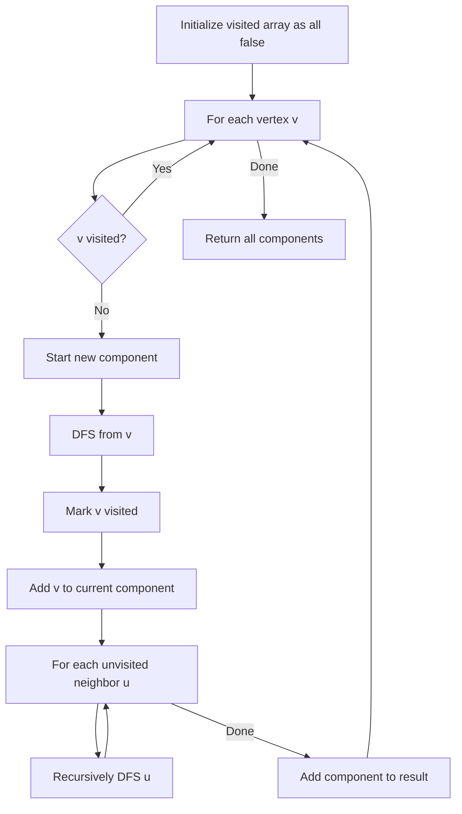
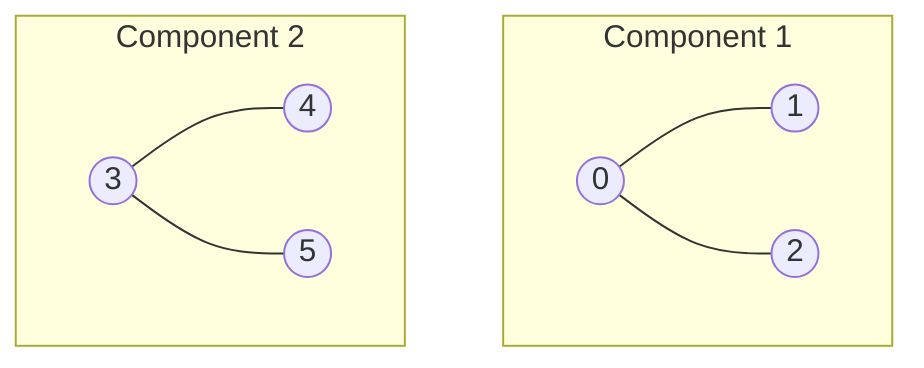

# Connected Components

## Overview

| Property | Value |
|----------|-------|
| **Category** | Graph Connectivity |
| **Complexity (Time)** | O(V + E) |
| **Complexity (Space)** | O(V) |
| **Graph Type** | Undirected |
| **Best For** | Finding isolated subgraphs |

## Description

Connected components partition an undirected graph into maximal subgraphs where any two vertices are connected by a path. This fundamental graph algorithm identifies isolated regions, enabling analysis of network structure, community detection, and graph segmentation.

Two vertices belong to the same component if and only if there exists a path between them. The algorithm uses depth-first search (DFS) to explore all vertices reachable from each unvisited vertex.

## Mathematical Foundation

### Connectivity Relation

For undirected graph $G = (V, E)$, define equivalence relation $\sim$:

$$u \sim v \iff \exists \text{ path from } u \text{ to } v$$

This relation is:
- **Reflexive**: $v \sim v$ (zero-length path)
- **Symmetric**: $u \sim v \implies v \sim u$ (reverse path)
- **Transitive**: $u \sim v \land v \sim w \implies u \sim w$ (concatenate paths)

### Component Definition

Connected component $C$ is an equivalence class under $\sim$:

$$C = [v]_\sim = \{u \in V : u \sim v\}$$

### Partition Property

The components form a partition of $V$:

$$V = C_1 \sqcup C_2 \sqcup \cdots \sqcup C_k$$

where $C_i \cap C_j = \emptyset$ for $i \neq j$.

### Component Count

For graph with $n$ vertices, $m$ edges, and $k$ components:

$$k \geq n - m$$

Equality holds when each component is a tree (no cycles).

## Algorithm

### Pseudocode

```
CONNECTED_COMPONENTS(graph G):
    visited ← array of size |V|, all false
    components ← empty list
    
    for each vertex v in V:
        if not visited[v]:
            component ← []
            DFS(v, visited, component)
            components.append(component)
    
    return components

DFS(vertex v, visited[], component[]):
    visited[v] ← true
    component.append(v)
    
    for each neighbor u of v:
        if not visited[u]:
            DFS(u, visited, component)
```

### Alternative: Union-Find Approach

```
CONNECTED_COMPONENTS_UF(graph G):
    uf ← UnionFind(|V|)
    
    for each edge (u, v) in E:
        uf.union(u, v)
    
    // Group vertices by root
    groups ← empty map
    for each vertex v in V:
        root ← uf.find(v)
        groups[root].append(v)
    
    return list(groups.values())
```

### Step-by-Step Execution

```
Graph:
  0 -- 1    3 -- 4
  |         |
  2         5

Adjacency list:
  0: [1, 2]
  1: [0]
  2: [0]
  3: [4, 5]
  4: [3]
  5: [3]

Execution:
  visited = [F, F, F, F, F, F]
  components = []

  Start with vertex 0:
    DFS(0):
      visited[0] = T, component = [0]
      DFS(1):
        visited[1] = T, component = [0, 1]
        neighbor 0 already visited
      DFS(2):
        visited[2] = T, component = [0, 1, 2]
        neighbor 0 already visited
    
    components = [[0, 1, 2]]

  Vertex 1: already visited
  Vertex 2: already visited

  Start with vertex 3:
    DFS(3):
      visited[3] = T, component = [3]
      DFS(4):
        visited[4] = T, component = [3, 4]
        neighbor 3 already visited
      DFS(5):
        visited[5] = T, component = [3, 4, 5]
        neighbor 3 already visited
    
    components = [[0, 1, 2], [3, 4, 5]]

  Vertices 4, 5: already visited

Result: [[0, 1, 2], [3, 4, 5]]
Two components found.
```

## Complexity Analysis

### Time Complexity

| Operation | Complexity |
|-----------|-----------|
| Visit each vertex | O(V) |
| Explore each edge | O(E) |
| **Total** | **O(V + E)** |

### Space Complexity

| Component | Space |
|-----------|-------|
| Visited array | O(V) |
| Recursion stack | O(V) worst case |
| Component storage | O(V) |
| **Total** | **O(V)** |

## Visual Representation



### Component Visualization



## Implementation

### Python Implementation

```python
from __future__ import annotations


def dfs(
    graph: dict[int, list[int]], 
    vertex: int, 
    visited: list[bool]
) -> list[int]:
    """
    Depth-first search starting from vertex.
    
    Args:
        graph: Adjacency list representation
        vertex: Starting vertex
        visited: Visited status for each vertex
    
    Returns:
        List of vertices in the component
    """
    component = []
    stack = [vertex]
    
    while stack:
        v = stack.pop()
        if not visited[v]:
            visited[v] = True
            component.append(v)
            
            for neighbor in graph.get(v, []):
                if not visited[neighbor]:
                    stack.append(neighbor)
    
    return component


def connected_components(
    graph: dict[int, list[int]]
) -> list[list[int]]:
    """
    Find all connected components in undirected graph.
    
    Args:
        graph: Adjacency list where graph[v] = list of neighbors
    
    Returns:
        List of components, each component is a list of vertices
    
    Examples:
        >>> graph = {0: [1, 2], 1: [0], 2: [0], 3: [4, 5], 4: [3], 5: [3]}
        >>> components = connected_components(graph)
        >>> sorted([sorted(c) for c in components])
        [[0, 1, 2], [3, 4, 5]]
        
        >>> connected_components({0: []})
        [[0]]
        
        >>> connected_components({})
        []
    """
    if not graph:
        return []
    
    # Find all vertices
    vertices = set(graph.keys())
    for neighbors in graph.values():
        vertices.update(neighbors)
    
    n = max(vertices) + 1 if vertices else 0
    visited = [False] * n
    components = []
    
    for vertex in sorted(vertices):
        if not visited[vertex]:
            component = dfs(graph, vertex, visited)
            components.append(component)
    
    return components
```

### Union-Find Implementation

```python
class UnionFind:
    """Union-Find with path compression and union by rank."""
    
    def __init__(self, n: int):
        self.parent = list(range(n))
        self.rank = [0] * n
    
    def find(self, x: int) -> int:
        """Find root with path compression."""
        if self.parent[x] != x:
            self.parent[x] = self.find(self.parent[x])
        return self.parent[x]
    
    def union(self, x: int, y: int) -> None:
        """Union by rank."""
        px, py = self.find(x), self.find(y)
        if px == py:
            return
        
        if self.rank[px] < self.rank[py]:
            px, py = py, px
        
        self.parent[py] = px
        if self.rank[px] == self.rank[py]:
            self.rank[px] += 1


def connected_components_uf(
    n: int,
    edges: list[tuple[int, int]]
) -> list[list[int]]:
    """
    Find connected components using Union-Find.
    
    Args:
        n: Number of vertices (0 to n-1)
        edges: List of (u, v) edges
    
    Returns:
        List of components
    
    Examples:
        >>> edges = [(0, 1), (0, 2), (3, 4), (3, 5)]
        >>> components = connected_components_uf(6, edges)
        >>> sorted([sorted(c) for c in components])
        [[0, 1, 2], [3, 4, 5]]
    """
    uf = UnionFind(n)
    
    for u, v in edges:
        uf.union(u, v)
    
    # Group by root
    groups: dict[int, list[int]] = {}
    for v in range(n):
        root = uf.find(v)
        if root not in groups:
            groups[root] = []
        groups[root].append(v)
    
    return list(groups.values())
```

### BFS-Based Implementation

```python
from collections import deque


def connected_components_bfs(
    graph: dict[int, list[int]]
) -> list[list[int]]:
    """
    Find connected components using BFS.
    
    Args:
        graph: Adjacency list
    
    Returns:
        List of components
    """
    vertices = set(graph.keys())
    for neighbors in graph.values():
        vertices.update(neighbors)
    
    visited = set()
    components = []
    
    for start in sorted(vertices):
        if start in visited:
            continue
        
        component = []
        queue = deque([start])
        visited.add(start)
        
        while queue:
            v = queue.popleft()
            component.append(v)
            
            for neighbor in graph.get(v, []):
                if neighbor not in visited:
                    visited.add(neighbor)
                    queue.append(neighbor)
        
        components.append(component)
    
    return components
```

## Real-World Applications

### 1. Social Network Analysis

```python
from dataclasses import dataclass, field
from typing import Dict, List, Set, Tuple


@dataclass
class SocialNetwork:
    """
    Analyze social network structure using connected components.
    """
    
    users: Dict[str, Set[str]] = field(default_factory=dict)
    
    def add_user(self, user_id: str) -> None:
        """Add user to network."""
        if user_id not in self.users:
            self.users[user_id] = set()
    
    def add_friendship(self, user1: str, user2: str) -> None:
        """Add bidirectional friendship."""
        self.add_user(user1)
        self.add_user(user2)
        self.users[user1].add(user2)
        self.users[user2].add(user1)
    
    def find_communities(self) -> List[Set[str]]:
        """
        Find disconnected communities in network.
        
        Returns:
            List of user sets representing isolated communities
        """
        visited: Set[str] = set()
        communities: List[Set[str]] = []
        
        for user in self.users:
            if user not in visited:
                community = self._dfs_community(user, visited)
                communities.append(community)
        
        return communities
    
    def _dfs_community(
        self, 
        start: str, 
        visited: Set[str]
    ) -> Set[str]:
        """DFS to find all users in community."""
        community = set()
        stack = [start]
        
        while stack:
            user = stack.pop()
            if user not in visited:
                visited.add(user)
                community.add(user)
                stack.extend(self.users[user] - visited)
        
        return community
    
    def get_community_stats(self) -> Dict[str, any]:
        """
        Get statistics about network communities.
        """
        communities = self.find_communities()
        sizes = [len(c) for c in communities]
        
        return {
            "num_communities": len(communities),
            "largest_community": max(sizes) if sizes else 0,
            "smallest_community": min(sizes) if sizes else 0,
            "average_size": sum(sizes) / len(sizes) if sizes else 0,
            "isolated_users": sum(1 for s in sizes if s == 1)
        }
```

### 2. Image Segmentation

```python
from typing import List, Tuple, Set
from collections import deque


class ImageSegmenter:
    """
    Segment image into connected regions based on pixel similarity.
    """
    
    def __init__(
        self, 
        image: List[List[int]], 
        threshold: int = 30
    ):
        """
        Args:
            image: 2D array of pixel intensities (0-255)
            threshold: Max difference for pixels to be considered similar
        """
        self.image = image
        self.threshold = threshold
        self.height = len(image)
        self.width = len(image[0]) if image else 0
    
    def _similar(self, p1: Tuple[int, int], p2: Tuple[int, int]) -> bool:
        """Check if two pixels are similar."""
        r1, c1 = p1
        r2, c2 = p2
        return abs(self.image[r1][c1] - self.image[r2][c2]) <= self.threshold
    
    def _neighbors(self, r: int, c: int) -> List[Tuple[int, int]]:
        """Get 4-connected neighbors."""
        result = []
        for dr, dc in [(0, 1), (0, -1), (1, 0), (-1, 0)]:
            nr, nc = r + dr, c + dc
            if 0 <= nr < self.height and 0 <= nc < self.width:
                result.append((nr, nc))
        return result
    
    def segment(self) -> List[Set[Tuple[int, int]]]:
        """
        Find all connected regions in image.
        
        Returns:
            List of regions, each region is a set of (row, col) coordinates
        """
        visited = [[False] * self.width for _ in range(self.height)]
        regions: List[Set[Tuple[int, int]]] = []
        
        for r in range(self.height):
            for c in range(self.width):
                if not visited[r][c]:
                    region = self._bfs_region(r, c, visited)
                    regions.append(region)
        
        return regions
    
    def _bfs_region(
        self, 
        start_r: int, 
        start_c: int, 
        visited: List[List[bool]]
    ) -> Set[Tuple[int, int]]:
        """BFS to find connected region."""
        region = set()
        queue = deque([(start_r, start_c)])
        visited[start_r][start_c] = True
        
        while queue:
            r, c = queue.popleft()
            region.add((r, c))
            
            for nr, nc in self._neighbors(r, c):
                if not visited[nr][nc] and self._similar((r, c), (nr, nc)):
                    visited[nr][nc] = True
                    queue.append((nr, nc))
        
        return region
    
    def get_region_map(self) -> List[List[int]]:
        """
        Get labeled region map.
        
        Returns:
            2D array where each cell contains its region ID
        """
        regions = self.segment()
        region_map = [[0] * self.width for _ in range(self.height)]
        
        for region_id, region in enumerate(regions, 1):
            for r, c in region:
                region_map[r][c] = region_id
        
        return region_map
```

### 3. Network Partition Detection

```python
from dataclasses import dataclass
from typing import Dict, List, Set, Optional
from enum import Enum


class NodeStatus(Enum):
    HEALTHY = "healthy"
    SUSPECTED = "suspected"
    FAILED = "failed"


@dataclass
class NetworkNode:
    """Node in distributed network."""
    id: str
    status: NodeStatus = NodeStatus.HEALTHY


class NetworkPartitionDetector:
    """
    Detect network partitions in distributed system.
    """
    
    def __init__(self):
        self.nodes: Dict[str, NetworkNode] = {}
        self.connections: Dict[str, Set[str]] = {}
    
    def add_node(self, node_id: str) -> None:
        """Add node to network."""
        self.nodes[node_id] = NetworkNode(node_id)
        self.connections[node_id] = set()
    
    def add_connection(self, node1: str, node2: str) -> None:
        """Add bidirectional connection."""
        if node1 in self.connections and node2 in self.connections:
            self.connections[node1].add(node2)
            self.connections[node2].add(node1)
    
    def remove_connection(self, node1: str, node2: str) -> None:
        """Remove connection (simulates network failure)."""
        self.connections[node1].discard(node2)
        self.connections[node2].discard(node1)
    
    def mark_node_failed(self, node_id: str) -> None:
        """Mark node as failed."""
        if node_id in self.nodes:
            self.nodes[node_id].status = NodeStatus.FAILED
    
    def detect_partitions(self) -> List[Set[str]]:
        """
        Detect network partitions (disconnected groups).
        
        Returns:
            List of node sets representing partitions
        """
        # Only consider healthy nodes
        active_nodes = {
            nid for nid, node in self.nodes.items()
            if node.status == NodeStatus.HEALTHY
        }
        
        visited: Set[str] = set()
        partitions: List[Set[str]] = []
        
        for node_id in active_nodes:
            if node_id not in visited:
                partition = self._dfs_partition(node_id, active_nodes, visited)
                partitions.append(partition)
        
        return partitions
    
    def _dfs_partition(
        self, 
        start: str, 
        active_nodes: Set[str],
        visited: Set[str]
    ) -> Set[str]:
        """DFS to find partition members."""
        partition = set()
        stack = [start]
        
        while stack:
            node_id = stack.pop()
            if node_id not in visited and node_id in active_nodes:
                visited.add(node_id)
                partition.add(node_id)
                
                for neighbor in self.connections.get(node_id, set()):
                    if neighbor in active_nodes and neighbor not in visited:
                        stack.append(neighbor)
        
        return partition
    
    def is_partitioned(self) -> bool:
        """Check if network is partitioned."""
        partitions = self.detect_partitions()
        return len(partitions) > 1
    
    def get_partition_report(self) -> Dict[str, any]:
        """
        Get detailed partition report.
        """
        partitions = self.detect_partitions()
        
        return {
            "is_partitioned": len(partitions) > 1,
            "num_partitions": len(partitions),
            "partition_sizes": [len(p) for p in partitions],
            "partitions": [list(p) for p in partitions],
            "minority_nodes": [
                node for p in partitions 
                if len(p) < len(max(partitions, key=len))
                for node in p
            ] if partitions else []
        }
```

## Variations

### 1. Counting Components Only

```python
def count_components(graph: dict[int, list[int]]) -> int:
    """Count connected components without storing them."""
    vertices = set(graph.keys())
    for neighbors in graph.values():
        vertices.update(neighbors)
    
    visited = set()
    count = 0
    
    for v in vertices:
        if v not in visited:
            count += 1
            stack = [v]
            while stack:
                node = stack.pop()
                if node not in visited:
                    visited.add(node)
                    stack.extend(graph.get(node, []))
    
    return count
```

### 2. Component Size Distribution

```python
def component_size_distribution(
    graph: dict[int, list[int]]
) -> dict[int, int]:
    """Get distribution of component sizes."""
    components = connected_components(graph)
    distribution: dict[int, int] = {}
    
    for component in components:
        size = len(component)
        distribution[size] = distribution.get(size, 0) + 1
    
    return distribution
```

## References

1. Tarjan, R.E. "Depth-First Search and Linear Graph Algorithms" (1972)
2. [Connected Components - Wikipedia](https://en.wikipedia.org/wiki/Connected_component_(graph_theory))
3. Cormen, T.H. "Introduction to Algorithms" - Chapter 22.3

## See Also

- [Depth-First Search](depth_first_search.md) - Core traversal algorithm
- [Strongly Connected Components](strongly_connected_components.md) - For directed graphs
- [Union-Find](../06_data_structures/union_find.md) - Alternative approach
