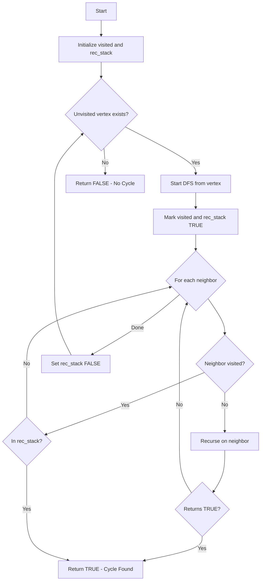
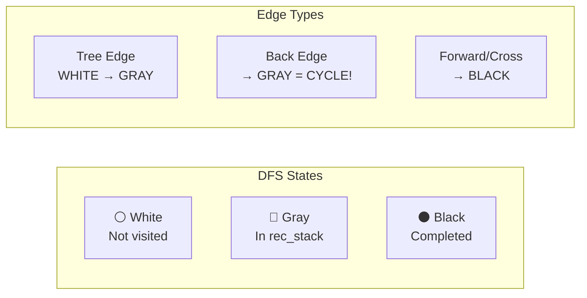

# Cycle Detection in Directed Graphs

## Overview

| Property | Value |
|----------|-------|
| **Category** | Graph Traversal |
| **Complexity (Time)** | O(V + E) |
| **Complexity (Space)** | O(V) |
| **Graph Type** | Directed |
| **Best For** | Detecting back edges |

## Description

Cycle detection in directed graphs determines whether a graph contains any cycles (closed loops). This is accomplished using Depth-First Search (DFS) with a recursion stack to track the current traversal path. A cycle exists if we encounter a vertex that is already in the current recursion stack (a back edge).

## Mathematical Foundation

### Cycle Definition

A **cycle** in a directed graph is a path v₁ → v₂ → ... → vₖ → v₁ where:
- k ≥ 1 (at least one edge)
- All vertices v₁, v₂, ..., vₖ are distinct
- There exists an edge from vₖ back to v₁

### Back Edge Characterization

In DFS, edges are classified as:
1. **Tree edges**: Part of DFS spanning tree
2. **Back edges**: Connect to an ancestor → **indicates cycle**
3. **Forward edges**: Connect to a descendant (not through tree)
4. **Cross edges**: Connect to neither ancestor nor descendant

**Theorem**: A directed graph has a cycle if and only if its DFS tree has a back edge.

### Directed Acyclic Graph (DAG)

A graph without cycles is called a DAG:
$$\text{Graph } G \text{ is a DAG} \Leftrightarrow \text{No back edges in DFS traversal}$$

DAGs have important properties:
- Can be topologically sorted
- Longest path can be computed in O(V + E)
- Used for dependency resolution

## Algorithm

### Pseudocode

```
CHECK_CYCLE(graph):
    n ← number of vertices
    visited[0..n-1] ← FALSE
    rec_stack[0..n-1] ← FALSE
    
    for each vertex v in graph:
        if not visited[v]:
            if DFS_CYCLE(graph, v, visited, rec_stack):
                return TRUE
    
    return FALSE


DFS_CYCLE(graph, v, visited, rec_stack):
    // Mark current vertex as visited and add to recursion stack
    visited[v] ← TRUE
    rec_stack[v] ← TRUE
    
    // Explore all neighbors
    for each neighbor u of v:
        if not visited[u]:
            if DFS_CYCLE(graph, u, visited, rec_stack):
                return TRUE
        else if rec_stack[u]:
            // Found back edge to ancestor in current path
            return TRUE
    
    // Remove vertex from recursion stack before backtracking
    rec_stack[v] ← FALSE
    return FALSE
```

### Step-by-Step Execution

```
Graph:
  0 → 1
  1 → 2
  2 → 0   (creates cycle)
  2 → 3

Adjacency list:
  0: [1]
  1: [2]
  2: [0, 3]
  3: []

Execution:
Step 1: Start DFS from vertex 0
  visited = [T, F, F, F]
  rec_stack = [T, F, F, F]
  
Step 2: Visit neighbor 1
  visited = [T, T, F, F]
  rec_stack = [T, T, F, F]
  
Step 3: Visit neighbor 2 (of 1)
  visited = [T, T, T, F]
  rec_stack = [T, T, T, F]
  
Step 4: Check neighbors of 2
  Neighbor 0: visited[0]=TRUE, rec_stack[0]=TRUE
  → Back edge detected! Cycle found!

Return TRUE (graph has cycle: 0 → 1 → 2 → 0)
```

### Without Cycle Example

```
Graph (DAG):
  0 → 1
  0 → 2
  1 → 3
  2 → 3

Adjacency list:
  0: [1, 2]
  1: [3]
  2: [3]
  3: []

Execution:
DFS from 0:
  Visit 0 → rec_stack = [T, F, F, F]
  Visit 1 → rec_stack = [T, T, F, F]
  Visit 3 → rec_stack = [T, T, F, T]
  Backtrack from 3 → rec_stack = [T, T, F, F]
  Backtrack from 1 → rec_stack = [T, F, F, F]
  Visit 2 → rec_stack = [T, F, T, F]
  Check 3: visited but NOT in rec_stack → not a back edge
  Backtrack...

No cycle found → Return FALSE
```

## Complexity Analysis

### Time Complexity

| Case | Complexity | Explanation |
|------|------------|-------------|
| All | O(V + E) | Each vertex and edge visited once |

### Space Complexity

| Component | Complexity |
|-----------|------------|
| Visited array | O(V) |
| Recursion stack array | O(V) |
| Call stack | O(V) in worst case |
| Total | O(V) |

## Visual Representation



### Graph State Visualization



## Implementation

### Python Implementation

```python
from __future__ import annotations

from collections import defaultdict


def check_cycle(graph: dict[int, list[int]]) -> bool:
    """
    Detect cycle in directed graph using DFS.
    
    Uses recursion stack to track current DFS path.
    A cycle exists if we find a back edge to a vertex
    in the current recursion stack.
    
    Args:
        graph: Adjacency list representation
        
    Returns:
        True if cycle exists, False otherwise
        
    >>> check_cycle({0: [1], 1: [2], 2: [0, 3], 3: []})
    True
    >>> check_cycle({0: [1, 2], 1: [3], 2: [3], 3: []})
    False
    >>> check_cycle({0: [0]})  # Self-loop
    True
    >>> check_cycle({})  # Empty graph
    False
    """
    if not graph:
        return False
    
    visited: set[int] = set()
    rec_stack: set[int] = set()
    
    def depth_first_search(vertex: int) -> bool:
        """DFS helper that tracks recursion stack."""
        visited.add(vertex)
        rec_stack.add(vertex)
        
        for neighbor in graph.get(vertex, []):
            if neighbor not in visited:
                if depth_first_search(neighbor):
                    return True
            elif neighbor in rec_stack:
                # Back edge found - cycle detected
                return True
        
        rec_stack.remove(vertex)
        return False
    
    # Check all vertices (graph may be disconnected)
    for vertex in graph:
        if vertex not in visited:
            if depth_first_search(vertex):
                return True
    
    return False


if __name__ == "__main__":
    import doctest
    doctest.testmod()
```

### Extended Implementation with Cycle Path

```python
from typing import Dict, List, Set, Optional, Tuple
from collections import defaultdict


class CycleDetector:
    """
    Comprehensive cycle detection with path reconstruction.
    """
    
    def __init__(self, graph: Dict[int, List[int]]):
        """
        Initialize with adjacency list.
        
        Args:
            graph: Dict mapping vertex to list of neighbors
        """
        self.graph = graph
        self.vertices = set(graph.keys())
        for neighbors in graph.values():
            self.vertices.update(neighbors)
    
    def has_cycle(self) -> bool:
        """Check if graph has any cycle."""
        visited: Set[int] = set()
        rec_stack: Set[int] = set()
        
        for v in self.vertices:
            if v not in visited:
                if self._dfs_check(v, visited, rec_stack):
                    return True
        return False
    
    def _dfs_check(
        self, 
        v: int, 
        visited: Set[int], 
        rec_stack: Set[int]
    ) -> bool:
        """DFS helper for cycle check."""
        visited.add(v)
        rec_stack.add(v)
        
        for neighbor in self.graph.get(v, []):
            if neighbor not in visited:
                if self._dfs_check(neighbor, visited, rec_stack):
                    return True
            elif neighbor in rec_stack:
                return True
        
        rec_stack.remove(v)
        return False
    
    def find_cycle(self) -> Optional[List[int]]:
        """
        Find and return one cycle if exists.
        
        Returns:
            List of vertices forming a cycle, or None
        """
        visited: Set[int] = set()
        rec_stack: Set[int] = set()
        parent: Dict[int, int] = {}
        
        for v in self.vertices:
            if v not in visited:
                cycle = self._dfs_find(v, visited, rec_stack, parent)
                if cycle:
                    return cycle
        return None
    
    def _dfs_find(
        self,
        v: int,
        visited: Set[int],
        rec_stack: Set[int],
        parent: Dict[int, int]
    ) -> Optional[List[int]]:
        """DFS helper that reconstructs cycle path."""
        visited.add(v)
        rec_stack.add(v)
        
        for neighbor in self.graph.get(v, []):
            if neighbor not in visited:
                parent[neighbor] = v
                cycle = self._dfs_find(neighbor, visited, rec_stack, parent)
                if cycle:
                    return cycle
            elif neighbor in rec_stack:
                # Reconstruct cycle
                cycle = [neighbor]
                current = v
                while current != neighbor:
                    cycle.append(current)
                    current = parent.get(current, neighbor)
                cycle.append(neighbor)
                return cycle[::-1]  # Reverse to get correct order
        
        rec_stack.remove(v)
        return None
    
    def find_all_cycles(self) -> List[List[int]]:
        """
        Find all simple cycles using Johnson's algorithm approach.
        
        Returns:
            List of all simple cycles
        """
        cycles = []
        blocked: Set[int] = set()
        block_map: Dict[int, Set[int]] = defaultdict(set)
        stack: List[int] = []
        
        def unblock(u: int) -> None:
            blocked.discard(u)
            while block_map[u]:
                w = block_map[u].pop()
                if w in blocked:
                    unblock(w)
        
        def circuit(v: int, start: int) -> bool:
            found_cycle = False
            stack.append(v)
            blocked.add(v)
            
            for w in self.graph.get(v, []):
                if w == start:
                    cycles.append(stack[:] + [start])
                    found_cycle = True
                elif w not in blocked:
                    if circuit(w, start):
                        found_cycle = True
            
            if found_cycle:
                unblock(v)
            else:
                for w in self.graph.get(v, []):
                    block_map[w].add(v)
            
            stack.pop()
            return found_cycle
        
        # Run circuit from each vertex
        for start in sorted(self.vertices):
            circuit(start, start)
            blocked.clear()
            block_map.clear()
        
        return cycles


def demo_cycle_detection():
    """Demonstrate cycle detection."""
    # Graph with cycle
    graph_with_cycle = {
        0: [1],
        1: [2],
        2: [0, 3],
        3: []
    }
    
    detector = CycleDetector(graph_with_cycle)
    print(f"Has cycle: {detector.has_cycle()}")
    print(f"Cycle path: {detector.find_cycle()}")
    
    # DAG (no cycle)
    dag = {
        0: [1, 2],
        1: [3],
        2: [3],
        3: []
    }
    
    detector_dag = CycleDetector(dag)
    print(f"\nDAG has cycle: {detector_dag.has_cycle()}")


if __name__ == "__main__":
    demo_cycle_detection()
```

## Real-World Applications

### 1. Dependency Resolution

```python
from typing import Dict, List, Set, Optional
from collections import defaultdict


class DependencyResolver:
    """
    Resolve dependencies with cycle detection.
    
    Used in package managers, build systems, and task schedulers.
    """
    
    def __init__(self):
        self.dependencies: Dict[str, List[str]] = defaultdict(list)
    
    def add_dependency(self, item: str, depends_on: str) -> None:
        """Add dependency: item depends on depends_on."""
        self.dependencies[item].append(depends_on)
        if depends_on not in self.dependencies:
            self.dependencies[depends_on] = []
    
    def detect_circular_dependency(self) -> Optional[List[str]]:
        """
        Detect circular dependency chain.
        
        Returns:
            List forming circular dependency, or None
        """
        visited: Set[str] = set()
        rec_stack: Set[str] = set()
        path: Dict[str, str] = {}
        
        def dfs(item: str) -> Optional[str]:
            visited.add(item)
            rec_stack.add(item)
            
            for dep in self.dependencies[item]:
                if dep not in visited:
                    path[dep] = item
                    result = dfs(dep)
                    if result:
                        return result
                elif dep in rec_stack:
                    # Found cycle - return cycle start
                    path[dep] = item
                    return dep
            
            rec_stack.remove(item)
            return None
        
        for item in self.dependencies:
            if item not in visited:
                cycle_start = dfs(item)
                if cycle_start:
                    # Reconstruct cycle
                    cycle = [cycle_start]
                    current = path.get(cycle_start)
                    while current and current != cycle_start:
                        cycle.append(current)
                        current = path.get(current)
                    cycle.append(cycle_start)
                    return cycle[::-1]
        
        return None
    
    def get_build_order(self) -> Optional[List[str]]:
        """
        Get topological order (build order).
        
        Returns:
            List in build order, or None if cycle exists
        """
        if self.detect_circular_dependency():
            return None
        
        visited: Set[str] = set()
        order: List[str] = []
        
        def dfs(item: str) -> None:
            if item in visited:
                return
            visited.add(item)
            for dep in self.dependencies[item]:
                dfs(dep)
            order.append(item)
        
        for item in self.dependencies:
            dfs(item)
        
        return order


def demo_dependency_resolution():
    """Demo package dependency checking."""
    resolver = DependencyResolver()
    
    # Add package dependencies
    resolver.add_dependency("webapp", "django")
    resolver.add_dependency("webapp", "celery")
    resolver.add_dependency("django", "sqlalchemy")
    resolver.add_dependency("celery", "redis")
    resolver.add_dependency("redis", "hiredis")
    
    print("Dependencies without cycle:")
    cycle = resolver.detect_circular_dependency()
    print(f"  Circular dependency: {cycle}")
    print(f"  Build order: {resolver.get_build_order()}")
    
    # Add circular dependency
    resolver.add_dependency("hiredis", "webapp")
    
    print("\nDependencies with cycle:")
    cycle = resolver.detect_circular_dependency()
    print(f"  Circular dependency: {cycle}")
```

### 2. Database Transaction Deadlock Detection

```python
from typing import Dict, Set, List, Optional
from collections import defaultdict
from datetime import datetime
from dataclasses import dataclass


@dataclass
class Lock:
    resource: str
    transaction_id: str
    lock_type: str  # 'shared' or 'exclusive'
    acquired_at: datetime


class DeadlockDetector:
    """
    Detect deadlocks in database transaction system.
    
    Uses wait-for graph where:
    - Vertices: Transactions
    - Edge T1 → T2: T1 is waiting for a lock held by T2
    """
    
    def __init__(self):
        self.locks: Dict[str, List[Lock]] = defaultdict(list)
        self.waiting_for: Dict[str, str] = {}  # transaction → resource waiting for
    
    def acquire_lock(
        self, 
        transaction_id: str, 
        resource: str, 
        lock_type: str
    ) -> bool:
        """
        Try to acquire lock on resource.
        
        Returns:
            True if lock acquired, False if must wait
        """
        current_locks = self.locks[resource]
        
        # Check for conflicts
        if lock_type == 'exclusive':
            # Exclusive needs no other locks
            if current_locks:
                blocking = current_locks[0].transaction_id
                self.waiting_for[transaction_id] = resource
                return False
        else:
            # Shared can coexist with other shared
            for lock in current_locks:
                if lock.lock_type == 'exclusive':
                    self.waiting_for[transaction_id] = resource
                    return False
        
        # Acquire lock
        self.locks[resource].append(Lock(
            resource=resource,
            transaction_id=transaction_id,
            lock_type=lock_type,
            acquired_at=datetime.now()
        ))
        
        if transaction_id in self.waiting_for:
            del self.waiting_for[transaction_id]
        
        return True
    
    def release_lock(self, transaction_id: str, resource: str) -> None:
        """Release lock on resource."""
        self.locks[resource] = [
            lock for lock in self.locks[resource]
            if lock.transaction_id != transaction_id
        ]
    
    def build_wait_for_graph(self) -> Dict[str, Set[str]]:
        """
        Build wait-for graph from current state.
        
        Returns:
            Dict mapping transaction to set of transactions it waits for
        """
        graph: Dict[str, Set[str]] = defaultdict(set)
        
        for txn, resource in self.waiting_for.items():
            # Find who holds the lock
            for lock in self.locks[resource]:
                if lock.transaction_id != txn:
                    graph[txn].add(lock.transaction_id)
        
        return graph
    
    def detect_deadlock(self) -> Optional[List[str]]:
        """
        Detect deadlock (cycle in wait-for graph).
        
        Returns:
            List of transactions in deadlock cycle, or None
        """
        graph = self.build_wait_for_graph()
        
        # All transactions (waiting + holding)
        all_txns = set(graph.keys())
        for txns in graph.values():
            all_txns.update(txns)
        
        visited: Set[str] = set()
        rec_stack: Set[str] = set()
        parent: Dict[str, str] = {}
        
        def dfs(txn: str) -> Optional[str]:
            visited.add(txn)
            rec_stack.add(txn)
            
            for waiting_for in graph.get(txn, set()):
                if waiting_for not in visited:
                    parent[waiting_for] = txn
                    result = dfs(waiting_for)
                    if result:
                        return result
                elif waiting_for in rec_stack:
                    parent[waiting_for] = txn
                    return waiting_for  # Cycle start
            
            rec_stack.remove(txn)
            return None
        
        for txn in all_txns:
            if txn not in visited:
                cycle_start = dfs(txn)
                if cycle_start:
                    # Reconstruct cycle
                    cycle = [cycle_start]
                    current = parent.get(cycle_start)
                    while current and current != cycle_start:
                        cycle.append(current)
                        current = parent.get(current)
                    cycle.append(cycle_start)
                    return cycle[::-1]
        
        return None
    
    def resolve_deadlock(self) -> Optional[str]:
        """
        Resolve deadlock by selecting victim transaction.
        
        Returns:
            Transaction ID to abort, or None if no deadlock
        """
        cycle = self.detect_deadlock()
        if not cycle:
            return None
        
        # Select youngest transaction as victim
        victims = cycle[:-1]  # Exclude repeated start
        
        # Find transaction with most recent lock
        youngest = None
        youngest_time = None
        
        for txn in victims:
            for resource_locks in self.locks.values():
                for lock in resource_locks:
                    if lock.transaction_id == txn:
                        if youngest_time is None or lock.acquired_at > youngest_time:
                            youngest = txn
                            youngest_time = lock.acquired_at
        
        return youngest or victims[0]


def demo_deadlock_detection():
    """Demo database deadlock detection."""
    detector = DeadlockDetector()
    
    # T1 acquires lock on A
    detector.acquire_lock("T1", "resource_A", "exclusive")
    print("T1 acquired exclusive lock on A")
    
    # T2 acquires lock on B
    detector.acquire_lock("T2", "resource_B", "exclusive")
    print("T2 acquired exclusive lock on B")
    
    # T1 wants lock on B (must wait for T2)
    result = detector.acquire_lock("T1", "resource_B", "exclusive")
    print(f"T1 trying to acquire B: {'acquired' if result else 'waiting'}")
    
    # T2 wants lock on A (must wait for T1) - DEADLOCK!
    result = detector.acquire_lock("T2", "resource_A", "exclusive")
    print(f"T2 trying to acquire A: {'acquired' if result else 'waiting'}")
    
    # Detect deadlock
    deadlock = detector.detect_deadlock()
    print(f"\nDeadlock detected: {deadlock}")
    
    # Resolve deadlock
    victim = detector.resolve_deadlock()
    print(f"Victim to abort: {victim}")
```

### 3. State Machine Validation

```python
from typing import Dict, List, Set, Optional, Tuple
from dataclasses import dataclass
from enum import Enum, auto


class StateMachine:
    """
    State machine with cycle detection for validation.
    
    Used to validate workflow definitions, game states,
    and UI navigation flows.
    """
    
    def __init__(self, name: str):
        self.name = name
        self.states: Set[str] = set()
        self.transitions: Dict[str, List[Tuple[str, str]]] = {}  # state → [(event, target)]
        self.initial_state: Optional[str] = None
        self.final_states: Set[str] = set()
    
    def add_state(
        self, 
        state: str, 
        is_initial: bool = False, 
        is_final: bool = False
    ) -> None:
        """Add state to machine."""
        self.states.add(state)
        if state not in self.transitions:
            self.transitions[state] = []
        if is_initial:
            self.initial_state = state
        if is_final:
            self.final_states.add(state)
    
    def add_transition(
        self, 
        from_state: str, 
        event: str, 
        to_state: str
    ) -> None:
        """Add transition between states."""
        self.add_state(from_state)
        self.add_state(to_state)
        self.transitions[from_state].append((event, to_state))
    
    def has_cycles(self) -> bool:
        """Check if state machine has cycles."""
        visited: Set[str] = set()
        rec_stack: Set[str] = set()
        
        def dfs(state: str) -> bool:
            visited.add(state)
            rec_stack.add(state)
            
            for event, target in self.transitions.get(state, []):
                if target not in visited:
                    if dfs(target):
                        return True
                elif target in rec_stack:
                    return True
            
            rec_stack.remove(state)
            return False
        
        for state in self.states:
            if state not in visited:
                if dfs(state):
                    return True
        
        return False
    
    def find_cycle_path(self) -> Optional[List[Tuple[str, str, str]]]:
        """
        Find cycle path with transitions.
        
        Returns:
            List of (from_state, event, to_state) forming cycle
        """
        visited: Set[str] = set()
        rec_stack: Set[str] = set()
        path: List[Tuple[str, str, str]] = []
        
        def dfs(state: str) -> Optional[str]:
            visited.add(state)
            rec_stack.add(state)
            
            for event, target in self.transitions.get(state, []):
                path.append((state, event, target))
                
                if target not in visited:
                    result = dfs(target)
                    if result:
                        return result
                elif target in rec_stack:
                    return target  # Cycle start
                
                path.pop()
            
            rec_stack.remove(state)
            return None
        
        for state in self.states:
            if state not in visited:
                cycle_start = dfs(state)
                if cycle_start:
                    # Extract cycle from path
                    cycle = []
                    for transition in path:
                        if transition[0] == cycle_start or cycle:
                            cycle.append(transition)
                        if transition[2] == cycle_start and cycle:
                            break
                    return cycle
        
        return None
    
    def can_reach_final(self) -> bool:
        """Check if final state is reachable from initial."""
        if not self.initial_state or not self.final_states:
            return False
        
        visited: Set[str] = set()
        
        def dfs(state: str) -> bool:
            if state in self.final_states:
                return True
            
            visited.add(state)
            
            for event, target in self.transitions.get(state, []):
                if target not in visited:
                    if dfs(target):
                        return True
            
            return False
        
        return dfs(self.initial_state)
    
    def validate(self) -> List[str]:
        """
        Validate state machine configuration.
        
        Returns:
            List of validation errors/warnings
        """
        errors = []
        
        if not self.initial_state:
            errors.append("No initial state defined")
        elif self.initial_state not in self.states:
            errors.append(f"Initial state '{self.initial_state}' not in states")
        
        if not self.final_states:
            errors.append("No final states defined")
        
        for final in self.final_states:
            if final not in self.states:
                errors.append(f"Final state '{final}' not in states")
        
        if self.initial_state and not self.can_reach_final():
            errors.append("Cannot reach any final state from initial state")
        
        if self.has_cycles():
            cycle = self.find_cycle_path()
            if cycle:
                cycle_str = " → ".join(
                    f"{t[0]} --{t[1]}--> {t[2]}" for t in cycle
                )
                errors.append(f"Cycle detected: {cycle_str}")
        
        return errors


def demo_state_machine_validation():
    """Demo state machine validation."""
    # Order processing workflow
    order_sm = StateMachine("Order Processing")
    
    order_sm.add_state("created", is_initial=True)
    order_sm.add_state("paid")
    order_sm.add_state("shipped")
    order_sm.add_state("delivered", is_final=True)
    order_sm.add_state("cancelled", is_final=True)
    
    order_sm.add_transition("created", "pay", "paid")
    order_sm.add_transition("created", "cancel", "cancelled")
    order_sm.add_transition("paid", "ship", "shipped")
    order_sm.add_transition("paid", "refund", "cancelled")
    order_sm.add_transition("shipped", "deliver", "delivered")
    order_sm.add_transition("shipped", "return", "paid")  # Creates cycle!
    
    print("Order Processing State Machine:")
    errors = order_sm.validate()
    if errors:
        print("  Validation errors:")
        for error in errors:
            print(f"    - {error}")
    else:
        print("  Valid!")


if __name__ == "__main__":
    demo_state_machine_validation()
```

## References

1. Tarjan, R.E. "Depth-First Search and Linear Graph Algorithms" (1972)
2. Cormen et al. "Introduction to Algorithms" - Chapter 22
3. [Cycle detection - Wikipedia](https://en.wikipedia.org/wiki/Cycle_detection)
4. [Directed acyclic graph - Wikipedia](https://en.wikipedia.org/wiki/Directed_acyclic_graph)

## See Also

- [Depth-First Search](depth_first_search.md) - Base traversal algorithm
- [Topological Sort](topological_sort.md) - Ordering for DAGs
- [Strongly Connected Components](strongly_connected_components.md) - Finding all cycles
