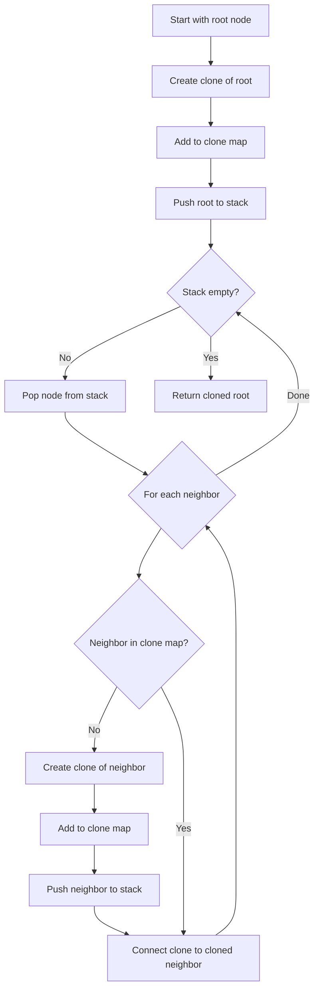
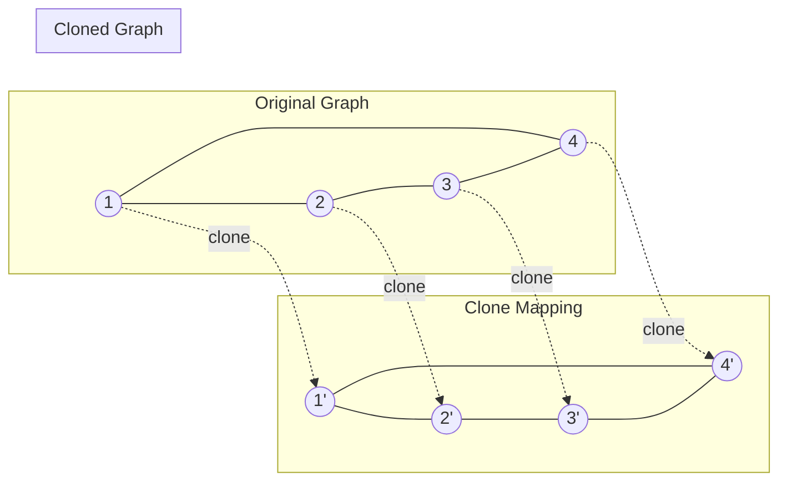

# Deep Clone Graph

## Overview

| Property | Value |
|----------|-------|
| **Category** | Graph Traversal/Copying |
| **Complexity (Time)** | O(V + E) |
| **Complexity (Space)** | O(V) |
| **Graph Type** | Any Connected Graph |
| **Best For** | Creating independent graph copies |

## Description

Deep Clone Graph creates an independent copy of a graph structure where all nodes are new objects with the same values and connectivity as the original. Unlike shallow copying (which shares node references), deep cloning ensures that modifications to the clone do not affect the original graph.

The algorithm uses graph traversal (BFS or DFS) combined with a hash map to track correspondences between original and cloned nodes, ensuring each node is cloned exactly once while preserving all edges.

## Mathematical Foundation

### Graph Isomorphism Preservation

A deep clone G' of graph G = (V, E) satisfies:
$$G' = (V', E') \text{ where } |V'| = |V| \text{ and } |E'| = |E|$$

With a bijection f: V → V' such that:
$$(u, v) \in E \Leftrightarrow (f(u), f(v)) \in E'$$

### Node Identity vs Value Equality

For original node n and clone n':
- **Value equality**: n.value == n'.value
- **Reference inequality**: n is not n' (different objects)
- **Structure preservation**: neighbors(n') = {f(m) : m ∈ neighbors(n)}

### Clone Mapping Function

Define clone map C: V → V' where:
$$C(n) = \begin{cases} 
\text{new Node}(n.value) & \text{if } n \notin \text{visited} \\
\text{existing clone} & \text{otherwise}
\end{cases}$$

## Algorithm

### Pseudocode (Iterative DFS)

```
CLONE_GRAPH(node):
    if node is NULL:
        return NULL
    
    // Map from original nodes to their clones
    originals_to_clones ← empty HashMap
    
    // Create clone of starting node
    cloned_node ← new Node(node.value)
    originals_to_clones[node] ← cloned_node
    
    // Stack for DFS traversal
    stack ← [node]
    
    while stack not empty:
        original ← stack.pop()
        
        for each neighbor in original.neighbors:
            if neighbor not in originals_to_clones:
                // Clone this neighbor
                cloned_neighbor ← new Node(neighbor.value)
                originals_to_clones[neighbor] ← cloned_neighbor
                stack.push(neighbor)
            
            // Connect clones
            cloned_original ← originals_to_clones[original]
            cloned_neighbor ← originals_to_clones[neighbor]
            cloned_original.neighbors.append(cloned_neighbor)
    
    return cloned_node
```

### Pseudocode (Recursive DFS)

```
CLONE_GRAPH_RECURSIVE(node, clones):
    if node is NULL:
        return NULL
    
    if node in clones:
        return clones[node]
    
    // Create clone
    clone ← new Node(node.value)
    clones[node] ← clone
    
    // Recursively clone neighbors
    for each neighbor in node.neighbors:
        clone.neighbors.append(
            CLONE_GRAPH_RECURSIVE(neighbor, clones)
        )
    
    return clone
```

### Step-by-Step Execution

```
Original Graph:
    1 --- 2
    |     |
    4 --- 3

Adjacency:
  Node 1: [2, 4]
  Node 2: [1, 3]
  Node 3: [2, 4]
  Node 4: [1, 3]

Iterative DFS Clone:

Step 1: Start with node 1
  Create clone 1'
  originals_to_clones = {1: 1'}
  stack = [1]

Step 2: Pop 1, process neighbors [2, 4]
  Create clone 2' → originals_to_clones = {1: 1', 2: 2'}
  Create clone 4' → originals_to_clones = {1: 1', 2: 2', 4: 4'}
  Connect: 1'.neighbors = [2', 4']
  stack = [2, 4]

Step 3: Pop 4, process neighbors [1, 3]
  1 already cloned
  Create clone 3' → originals_to_clones = {1: 1', 2: 2', 4: 4', 3: 3'}
  Connect: 4'.neighbors = [1', 3']
  stack = [2, 3]

Step 4: Pop 3, process neighbors [2, 4]
  2 already cloned
  4 already cloned
  Connect: 3'.neighbors = [2', 4']
  stack = [2]

Step 5: Pop 2, process neighbors [1, 3]
  1 already cloned
  3 already cloned
  Connect: 2'.neighbors = [1', 3']
  stack = []

Done! Return clone 1'

Cloned Graph (independent copy):
    1' --- 2'
    |      |
    4' --- 3'
```

## Complexity Analysis

### Time Complexity

| Case | Complexity | Explanation |
|------|------------|-------------|
| All | O(V + E) | Visit each node and edge once |

### Space Complexity

| Component | Complexity |
|-----------|------------|
| Clone map | O(V) |
| Cloned nodes | O(V) |
| Stack/Recursion | O(V) |
| Cloned edges | O(E) |
| Total | O(V + E) |

## Visual Representation



### Clone Process Visualization



## Implementation

### Python Implementation

```python
from __future__ import annotations

from dataclasses import dataclass, field
from typing import Any


@dataclass
class Node:
    """
    Node for graph with adjacency list representation.
    
    >>> node = Node(1)
    >>> node.value
    1
    >>> len(node.neighbors)
    0
    """
    value: int = 0
    neighbors: list[Node] = field(default_factory=list)
    
    def __hash__(self) -> int:
        return id(self)


def clone_graph(node: Node | None) -> Node | None:
    """
    Create deep clone of graph starting from node.
    
    Uses iterative DFS with hash map to track clones.
    
    Args:
        node: Starting node of graph to clone
        
    Returns:
        Starting node of cloned graph, or None if input is None
        
    >>> # Create graph: 1 -- 2
    >>> n1, n2 = Node(1), Node(2)
    >>> n1.neighbors.append(n2)
    >>> n2.neighbors.append(n1)
    >>> clone = clone_graph(n1)
    >>> clone.value
    1
    >>> clone is not n1  # Different objects
    True
    >>> clone.neighbors[0].value
    2
    >>> clone.neighbors[0] is not n2  # Different objects
    True
    """
    if not node:
        return None
    
    # Map original nodes to their clones
    originals_to_clones: dict[Node, Node] = {}
    
    # Create clone of starting node
    cloned_node = Node(node.value)
    originals_to_clones[node] = cloned_node
    
    # DFS using stack
    stack = [node]
    
    while stack:
        original = stack.pop()
        
        for neighbor in original.neighbors:
            if neighbor not in originals_to_clones:
                # Create clone for unvisited neighbor
                cloned_neighbor = Node(neighbor.value)
                originals_to_clones[neighbor] = cloned_neighbor
                stack.append(neighbor)
            
            # Connect cloned nodes
            originals_to_clones[original].neighbors.append(
                originals_to_clones[neighbor]
            )
    
    return cloned_node


if __name__ == "__main__":
    import doctest
    doctest.testmod()
```

### Extended Implementation with BFS and Verification

```python
from typing import Dict, List, Set, Optional, Any, TypeVar
from dataclasses import dataclass, field
from collections import deque


T = TypeVar('T')


@dataclass
class GraphNode:
    """Generic graph node."""
    value: Any
    neighbors: List['GraphNode'] = field(default_factory=list)
    
    def __hash__(self) -> int:
        return id(self)
    
    def __repr__(self) -> str:
        neighbor_vals = [n.value for n in self.neighbors]
        return f"GraphNode({self.value}, neighbors={neighbor_vals})"


class GraphCloner:
    """
    Comprehensive graph cloning with multiple strategies.
    """
    
    @staticmethod
    def clone_dfs_recursive(
        node: Optional[GraphNode],
        clones: Optional[Dict[GraphNode, GraphNode]] = None
    ) -> Optional[GraphNode]:
        """
        Clone graph using recursive DFS.
        
        Args:
            node: Starting node
            clones: Clone mapping (internal use)
            
        Returns:
            Cloned starting node
        """
        if node is None:
            return None
        
        if clones is None:
            clones = {}
        
        if node in clones:
            return clones[node]
        
        # Create clone
        clone = GraphNode(node.value)
        clones[node] = clone
        
        # Clone neighbors
        for neighbor in node.neighbors:
            clone.neighbors.append(
                GraphCloner.clone_dfs_recursive(neighbor, clones)
            )
        
        return clone
    
    @staticmethod
    def clone_dfs_iterative(
        node: Optional[GraphNode]
    ) -> Optional[GraphNode]:
        """
        Clone graph using iterative DFS.
        
        Args:
            node: Starting node
            
        Returns:
            Cloned starting node
        """
        if node is None:
            return None
        
        clones: Dict[GraphNode, GraphNode] = {}
        
        # Clone starting node
        clone = GraphNode(node.value)
        clones[node] = clone
        
        stack = [node]
        
        while stack:
            current = stack.pop()
            
            for neighbor in current.neighbors:
                if neighbor not in clones:
                    clones[neighbor] = GraphNode(neighbor.value)
                    stack.append(neighbor)
                
                clones[current].neighbors.append(clones[neighbor])
        
        return clone
    
    @staticmethod
    def clone_bfs(
        node: Optional[GraphNode]
    ) -> Optional[GraphNode]:
        """
        Clone graph using BFS.
        
        Args:
            node: Starting node
            
        Returns:
            Cloned starting node
        """
        if node is None:
            return None
        
        clones: Dict[GraphNode, GraphNode] = {}
        
        # Clone starting node
        clone = GraphNode(node.value)
        clones[node] = clone
        
        queue = deque([node])
        
        while queue:
            current = queue.popleft()
            
            for neighbor in current.neighbors:
                if neighbor not in clones:
                    clones[neighbor] = GraphNode(neighbor.value)
                    queue.append(neighbor)
                
                clones[current].neighbors.append(clones[neighbor])
        
        return clone
    
    @staticmethod
    def verify_clone(
        original: Optional[GraphNode],
        clone: Optional[GraphNode]
    ) -> bool:
        """
        Verify that clone is a valid deep copy.
        
        Returns:
            True if clone is valid deep copy
        """
        if original is None and clone is None:
            return True
        
        if original is None or clone is None:
            return False
        
        original_nodes: Set[GraphNode] = set()
        clone_nodes: Set[GraphNode] = set()
        node_map: Dict[GraphNode, GraphNode] = {}
        
        # BFS to collect all nodes and build mapping
        orig_queue = deque([original])
        clone_queue = deque([clone])
        
        while orig_queue and clone_queue:
            o = orig_queue.popleft()
            c = clone_queue.popleft()
            
            if o in original_nodes:
                continue
            
            # Verify value equality
            if o.value != c.value:
                return False
            
            # Verify reference inequality
            if o is c:
                return False
            
            # Verify same number of neighbors
            if len(o.neighbors) != len(c.neighbors):
                return False
            
            original_nodes.add(o)
            clone_nodes.add(c)
            node_map[o] = c
            
            for on, cn in zip(o.neighbors, c.neighbors):
                if on not in original_nodes:
                    orig_queue.append(on)
                    clone_queue.append(cn)
        
        # Verify edge correspondence
        for o, c in node_map.items():
            for on, cn in zip(o.neighbors, c.neighbors):
                if node_map.get(on) is not cn:
                    return False
        
        return True


def build_graph_from_adjacency(
    adj_list: List[List[int]]
) -> Optional[GraphNode]:
    """
    Build graph from adjacency list (1-indexed).
    
    Args:
        adj_list: adj_list[i] contains neighbors of node i+1
        
    Returns:
        Node 1 of the graph
    """
    if not adj_list:
        return None
    
    nodes = {i+1: GraphNode(i+1) for i in range(len(adj_list))}
    
    for i, neighbors in enumerate(adj_list):
        node = nodes[i + 1]
        for neighbor_idx in neighbors:
            node.neighbors.append(nodes[neighbor_idx])
    
    return nodes[1]


def demo_clone_graph():
    """Demonstrate graph cloning."""
    # Build graph: 1-2, 1-4, 2-3, 3-4
    adj = [[2, 4], [1, 3], [2, 4], [1, 3]]
    original = build_graph_from_adjacency(adj)
    
    print("Original graph:")
    print(f"  Node 1: {original}")
    
    # Clone using different methods
    clone_recursive = GraphCloner.clone_dfs_recursive(original)
    clone_iterative = GraphCloner.clone_dfs_iterative(original)
    clone_bfs = GraphCloner.clone_bfs(original)
    
    print(f"\nCloned (recursive): {clone_recursive}")
    print(f"Cloned (iterative): {clone_iterative}")
    print(f"Cloned (BFS): {clone_bfs}")
    
    # Verify clones
    print(f"\nVerification:")
    print(f"  Recursive valid: {GraphCloner.verify_clone(original, clone_recursive)}")
    print(f"  Iterative valid: {GraphCloner.verify_clone(original, clone_iterative)}")
    print(f"  BFS valid: {GraphCloner.verify_clone(original, clone_bfs)}")
    
    # Verify independence
    print(f"\nIndependence check:")
    print(f"  Original node 1 is clone: {original is clone_recursive}")
    original.value = 999
    print(f"  After modifying original: clone value = {clone_recursive.value}")


if __name__ == "__main__":
    demo_clone_graph()
```

## Real-World Applications

### 1. State Management in Games

```python
from typing import Dict, List, Set, Optional, Any
from dataclasses import dataclass, field
from copy import deepcopy
import json


@dataclass
class GameEntity:
    """Game entity with properties."""
    entity_id: str
    entity_type: str
    position: tuple
    properties: Dict[str, Any] = field(default_factory=dict)
    connected_to: List['GameEntity'] = field(default_factory=list)
    
    def __hash__(self) -> int:
        return hash(self.entity_id)


class GameStateManager:
    """
    Manage game state with undo/redo using graph cloning.
    
    Game entities form a graph (e.g., connected rooms, linked objects).
    """
    
    def __init__(self):
        self.current_state: Dict[str, GameEntity] = {}
        self.history: List[Dict[str, GameEntity]] = []
        self.history_index: int = -1
    
    def add_entity(self, entity: GameEntity) -> None:
        """Add entity to current state."""
        self.current_state[entity.entity_id] = entity
    
    def connect_entities(self, id1: str, id2: str) -> None:
        """Connect two entities bidirectionally."""
        e1, e2 = self.current_state[id1], self.current_state[id2]
        if e2 not in e1.connected_to:
            e1.connected_to.append(e2)
        if e1 not in e2.connected_to:
            e2.connected_to.append(e1)
    
    def clone_state(self) -> Dict[str, GameEntity]:
        """
        Deep clone current game state.
        
        Uses graph cloning to preserve entity connections.
        """
        if not self.current_state:
            return {}
        
        # Map original entities to clones
        clones: Dict[str, GameEntity] = {}
        
        for entity_id, entity in self.current_state.items():
            clones[entity_id] = GameEntity(
                entity_id=entity.entity_id,
                entity_type=entity.entity_type,
                position=entity.position,
                properties=dict(entity.properties)  # Shallow copy of dict
            )
        
        # Restore connections using clones
        for entity_id, entity in self.current_state.items():
            clone = clones[entity_id]
            for connected in entity.connected_to:
                clone.connected_to.append(clones[connected.entity_id])
        
        return clones
    
    def save_checkpoint(self) -> None:
        """Save current state as checkpoint."""
        cloned_state = self.clone_state()
        
        # Remove future history if we're not at the end
        if self.history_index < len(self.history) - 1:
            self.history = self.history[:self.history_index + 1]
        
        self.history.append(cloned_state)
        self.history_index = len(self.history) - 1
    
    def undo(self) -> bool:
        """
        Undo to previous state.
        
        Returns:
            True if undo successful
        """
        if self.history_index <= 0:
            return False
        
        self.history_index -= 1
        self.current_state = self.clone_state_from(
            self.history[self.history_index]
        )
        return True
    
    def redo(self) -> bool:
        """
        Redo to next state.
        
        Returns:
            True if redo successful
        """
        if self.history_index >= len(self.history) - 1:
            return False
        
        self.history_index += 1
        self.current_state = self.clone_state_from(
            self.history[self.history_index]
        )
        return True
    
    def clone_state_from(
        self, 
        state: Dict[str, GameEntity]
    ) -> Dict[str, GameEntity]:
        """Clone a state dictionary."""
        clones: Dict[str, GameEntity] = {}
        
        for entity_id, entity in state.items():
            clones[entity_id] = GameEntity(
                entity_id=entity.entity_id,
                entity_type=entity.entity_type,
                position=entity.position,
                properties=dict(entity.properties)
            )
        
        for entity_id, entity in state.items():
            clone = clones[entity_id]
            for connected in entity.connected_to:
                clone.connected_to.append(clones[connected.entity_id])
        
        return clones


def demo_game_state():
    """Demo game state management."""
    manager = GameStateManager()
    
    # Create game entities (rooms in a dungeon)
    room1 = GameEntity("room1", "room", (0, 0), {"name": "Entrance"})
    room2 = GameEntity("room2", "room", (1, 0), {"name": "Hallway"})
    room3 = GameEntity("room3", "room", (1, 1), {"name": "Treasure Room"})
    
    manager.add_entity(room1)
    manager.add_entity(room2)
    manager.add_entity(room3)
    
    manager.connect_entities("room1", "room2")
    manager.connect_entities("room2", "room3")
    
    print("Initial state:")
    for eid, entity in manager.current_state.items():
        connected = [e.entity_id for e in entity.connected_to]
        print(f"  {eid}: {entity.properties['name']}, connected to {connected}")
    
    # Save checkpoint
    manager.save_checkpoint()
    
    # Modify state
    manager.current_state["room3"].properties["has_treasure"] = True
    manager.save_checkpoint()
    
    print("\nAfter adding treasure:")
    print(f"  room3 has_treasure: {manager.current_state['room3'].properties.get('has_treasure')}")
    
    # Undo
    manager.undo()
    print("\nAfter undo:")
    print(f"  room3 has_treasure: {manager.current_state['room3'].properties.get('has_treasure')}")
    
    # Redo
    manager.redo()
    print("\nAfter redo:")
    print(f"  room3 has_treasure: {manager.current_state['room3'].properties.get('has_treasure')}")
```

### 2. Virtual DOM Diffing

```python
from typing import Dict, List, Optional, Any, Set
from dataclasses import dataclass, field


@dataclass
class VirtualNode:
    """Virtual DOM node."""
    tag: str
    props: Dict[str, Any] = field(default_factory=dict)
    children: List['VirtualNode'] = field(default_factory=list)
    key: Optional[str] = None
    
    def __hash__(self) -> int:
        return id(self)


class VirtualDOM:
    """
    Virtual DOM implementation with cloning for efficient diffing.
    """
    
    def __init__(self, root: Optional[VirtualNode] = None):
        self.root = root
        self.previous_root: Optional[VirtualNode] = None
    
    def clone_tree(
        self, 
        node: Optional[VirtualNode]
    ) -> Optional[VirtualNode]:
        """
        Deep clone virtual DOM tree.
        
        Args:
            node: Root of tree to clone
            
        Returns:
            Cloned tree root
        """
        if node is None:
            return None
        
        clone = VirtualNode(
            tag=node.tag,
            props=dict(node.props),
            key=node.key
        )
        
        for child in node.children:
            clone.children.append(self.clone_tree(child))
        
        return clone
    
    def update(self, new_root: VirtualNode) -> List[Dict[str, Any]]:
        """
        Update DOM and return list of changes.
        
        Args:
            new_root: New virtual DOM root
            
        Returns:
            List of patch operations
        """
        # Clone current state before update
        self.previous_root = self.clone_tree(self.root)
        
        # Compute diff
        patches = self.diff(self.root, new_root, [])
        
        # Apply new state
        self.root = new_root
        
        return patches
    
    def diff(
        self,
        old_node: Optional[VirtualNode],
        new_node: Optional[VirtualNode],
        path: List[int]
    ) -> List[Dict[str, Any]]:
        """
        Compute diff between old and new trees.
        
        Args:
            old_node: Old tree node
            new_node: New tree node
            path: Path to current node
            
        Returns:
            List of patch operations
        """
        patches = []
        
        # Node removed
        if old_node is not None and new_node is None:
            patches.append({
                "type": "REMOVE",
                "path": path.copy()
            })
            return patches
        
        # Node added
        if old_node is None and new_node is not None:
            patches.append({
                "type": "ADD",
                "path": path.copy(),
                "node": new_node
            })
            return patches
        
        # Both exist - check for changes
        if old_node.tag != new_node.tag:
            patches.append({
                "type": "REPLACE",
                "path": path.copy(),
                "node": new_node
            })
            return patches
        
        # Check props
        prop_patches = self.diff_props(old_node.props, new_node.props, path)
        patches.extend(prop_patches)
        
        # Diff children
        max_children = max(len(old_node.children), len(new_node.children))
        for i in range(max_children):
            old_child = old_node.children[i] if i < len(old_node.children) else None
            new_child = new_node.children[i] if i < len(new_node.children) else None
            child_patches = self.diff(old_child, new_child, path + [i])
            patches.extend(child_patches)
        
        return patches
    
    def diff_props(
        self,
        old_props: Dict[str, Any],
        new_props: Dict[str, Any],
        path: List[int]
    ) -> List[Dict[str, Any]]:
        """Diff property changes."""
        patches = []
        
        all_keys = set(old_props.keys()) | set(new_props.keys())
        
        for key in all_keys:
            old_val = old_props.get(key)
            new_val = new_props.get(key)
            
            if old_val != new_val:
                patches.append({
                    "type": "SET_PROP",
                    "path": path.copy(),
                    "key": key,
                    "value": new_val
                })
        
        return patches


def demo_virtual_dom():
    """Demo virtual DOM with cloning."""
    # Create initial DOM
    root = VirtualNode("div", {"class": "container"}, [
        VirtualNode("h1", {"class": "title"}, []),
        VirtualNode("p", {"class": "content"}, [])
    ])
    
    vdom = VirtualDOM(root)
    
    print("Initial DOM:")
    print(f"  {root.tag} with {len(root.children)} children")
    
    # Clone for backup
    backup = vdom.clone_tree(root)
    print(f"\nCloned backup: {backup.tag}")
    print(f"  Is same object: {backup is root}")
    
    # Update DOM
    new_root = VirtualNode("div", {"class": "container updated"}, [
        VirtualNode("h1", {"class": "title"}, []),
        VirtualNode("p", {"class": "content highlight"}, []),
        VirtualNode("button", {"class": "action"}, [])
    ])
    
    patches = vdom.update(new_root)
    
    print(f"\nPatches detected: {len(patches)}")
    for patch in patches:
        print(f"  {patch['type']}: path={patch['path']}")
```

### 3. Network Topology Simulation

```python
from typing import Dict, List, Set, Optional, Tuple
from dataclasses import dataclass, field
from collections import deque
import random


@dataclass
class NetworkNode:
    """Network node (router, switch, host)."""
    node_id: str
    node_type: str
    ip_address: str
    connections: List['NetworkNode'] = field(default_factory=list)
    routing_table: Dict[str, str] = field(default_factory=dict)
    
    def __hash__(self) -> int:
        return hash(self.node_id)


class NetworkSimulator:
    """
    Network topology simulator with cloning for what-if analysis.
    """
    
    def __init__(self):
        self.nodes: Dict[str, NetworkNode] = {}
    
    def add_node(
        self, 
        node_id: str, 
        node_type: str, 
        ip_address: str
    ) -> None:
        """Add network node."""
        self.nodes[node_id] = NetworkNode(node_id, node_type, ip_address)
    
    def add_connection(self, id1: str, id2: str) -> None:
        """Add bidirectional connection."""
        n1, n2 = self.nodes[id1], self.nodes[id2]
        if n2 not in n1.connections:
            n1.connections.append(n2)
        if n1 not in n2.connections:
            n2.connections.append(n1)
    
    def clone_network(self) -> 'NetworkSimulator':
        """
        Create deep clone of entire network for simulation.
        
        Returns:
            Cloned NetworkSimulator
        """
        clone_sim = NetworkSimulator()
        
        # Clone all nodes (without connections first)
        node_map: Dict[str, NetworkNode] = {}
        
        for node_id, node in self.nodes.items():
            clone_node = NetworkNode(
                node_id=node.node_id,
                node_type=node.node_type,
                ip_address=node.ip_address,
                routing_table=dict(node.routing_table)
            )
            node_map[node_id] = clone_node
            clone_sim.nodes[node_id] = clone_node
        
        # Restore connections
        for node_id, node in self.nodes.items():
            clone_node = node_map[node_id]
            for connected in node.connections:
                clone_node.connections.append(node_map[connected.node_id])
        
        return clone_sim
    
    def simulate_failure(
        self, 
        failed_node_id: str
    ) -> Tuple[bool, List[str]]:
        """
        Simulate node failure and check connectivity.
        
        Returns:
            (network_connected, unreachable_nodes)
        """
        # Clone network for simulation
        sim_network = self.clone_network()
        
        # Remove failed node
        if failed_node_id in sim_network.nodes:
            failed = sim_network.nodes[failed_node_id]
            
            # Remove connections
            for connected in failed.connections:
                connected.connections = [
                    c for c in connected.connections 
                    if c.node_id != failed_node_id
                ]
            
            del sim_network.nodes[failed_node_id]
        
        # Check connectivity using BFS
        if not sim_network.nodes:
            return True, []
        
        start = next(iter(sim_network.nodes.values()))
        visited: Set[str] = set()
        queue = deque([start])
        
        while queue:
            node = queue.popleft()
            if node.node_id in visited:
                continue
            visited.add(node.node_id)
            
            for connected in node.connections:
                if connected.node_id not in visited:
                    queue.append(connected)
        
        unreachable = [
            nid for nid in sim_network.nodes 
            if nid not in visited
        ]
        
        return len(unreachable) == 0, unreachable
    
    def find_critical_nodes(self) -> List[str]:
        """
        Find nodes whose failure disconnects the network.
        
        Returns:
            List of critical node IDs
        """
        critical = []
        
        for node_id in self.nodes:
            connected, _ = self.simulate_failure(node_id)
            if not connected:
                critical.append(node_id)
        
        return critical


def demo_network_simulation():
    """Demo network topology simulation."""
    sim = NetworkSimulator()
    
    # Create network topology
    nodes = [
        ("router1", "router", "10.0.0.1"),
        ("router2", "router", "10.0.0.2"),
        ("switch1", "switch", "10.0.1.1"),
        ("switch2", "switch", "10.0.2.1"),
        ("host1", "host", "10.0.1.10"),
        ("host2", "host", "10.0.1.11"),
        ("host3", "host", "10.0.2.10"),
    ]
    
    for node_id, node_type, ip in nodes:
        sim.add_node(node_id, node_type, ip)
    
    connections = [
        ("router1", "router2"),
        ("router1", "switch1"),
        ("router2", "switch2"),
        ("switch1", "host1"),
        ("switch1", "host2"),
        ("switch2", "host3"),
    ]
    
    for n1, n2 in connections:
        sim.add_connection(n1, n2)
    
    print("Network topology created")
    print(f"  Nodes: {len(sim.nodes)}")
    
    # Clone for backup
    backup = sim.clone_network()
    print(f"\nCloned network: {len(backup.nodes)} nodes")
    print(f"  Is same object: {backup is sim}")
    
    # Find critical nodes
    critical = sim.find_critical_nodes()
    print(f"\nCritical nodes (failure disconnects network): {critical}")
    
    # Simulate specific failure
    for test_node in ["router1", "switch1", "host1"]:
        connected, unreachable = sim.simulate_failure(test_node)
        status = "Connected" if connected else f"Disconnected (unreachable: {unreachable})"
        print(f"\nIf {test_node} fails: {status}")


if __name__ == "__main__":
    demo_network_simulation()
```

## References

1. [Clone Graph - LeetCode](https://leetcode.com/problems/clone-graph/)
2. Skiena, S. "The Algorithm Design Manual" - Graph traversal
3. [Deep copy - Wikipedia](https://en.wikipedia.org/wiki/Object_copying#Deep_copy)

## See Also

- [Breadth-First Search](breadth_first_search.md) - BFS traversal
- [Depth-First Search](depth_first_search.md) - DFS traversal
- [Connected Components](connected_components.md) - Graph connectivity
