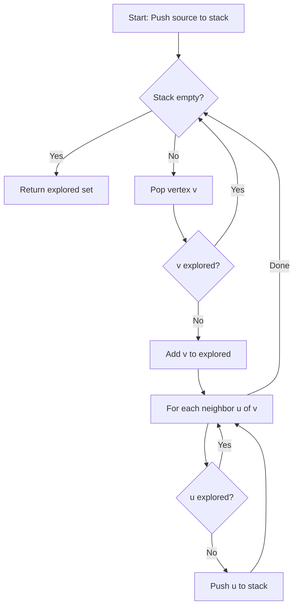
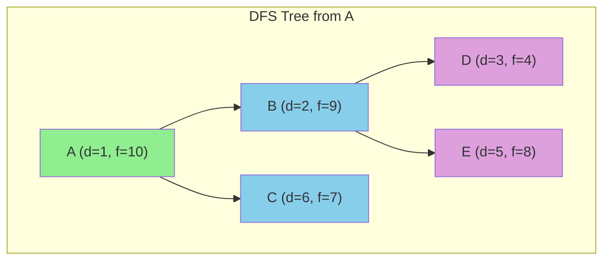

# Depth-First Search (DFS)

## Overview

| Property | Value |
|----------|-------|
| **Category** | Graph Traversal |
| **Complexity (Time)** | O(V + E) |
| **Complexity (Space)** | O(V) |
| **Graph Type** | Directed or Undirected |
| **Best For** | Cycle detection, topological sort, connected components |

## Description

Depth-First Search (DFS) is a fundamental graph traversal algorithm that explores as far as possible along each branch before backtracking. Unlike BFS which explores level by level, DFS dives deep into the graph before retreating. This behavior makes DFS ideal for problems requiring complete exploration of paths, such as finding cycles, topological ordering, and detecting connected components.

DFS can be implemented using recursion (implicit stack) or an explicit stack data structure.

## Mathematical Foundation

### Traversal Order

For a graph $G = (V, E)$, DFS defines two timestamps for each vertex $v$:
- **Discovery time** $d[v]$: when $v$ is first visited
- **Finish time** $f[v]$: when all descendants are processed

### Parenthesis Theorem

For any two vertices $u$ and $v$, exactly one of the following holds:
1. $[d[u], f[u]]$ and $[d[v], f[v]]$ are disjoint
2. $[d[u], f[u]]$ contains $[d[v], f[v]]$ (u is ancestor of v)
3. $[d[v], f[v]]$ contains $[d[u], f[u]]$ (v is ancestor of u)

### Edge Classification

DFS classifies edges based on discovery times:

| Edge Type | Condition | Meaning |
|-----------|-----------|---------|
| **Tree edge** | First discovery | Part of DFS tree |
| **Back edge** | $d[u] > d[v]$ and $v$ is ancestor | Indicates cycle |
| **Forward edge** | $d[u] < d[v]$ and $u$ is ancestor | Skip to descendant |
| **Cross edge** | Otherwise | Between unrelated subtrees |

### White Path Theorem

Vertex $v$ is a descendant of $u$ in the DFS tree if and only if at time $d[u]$, there exists a path from $u$ to $v$ consisting entirely of unvisited (white) vertices.

## Algorithm

### Pseudocode (Iterative)

```
DFS(graph G, source s):
    // Initialize
    explored ← empty set
    stack S ← empty stack
    PUSH(S, s)
    
    while S is not empty:
        v ← POP(S)
        
        if v not in explored:
            explored.add(v)
            
            // Add neighbors in reverse order for consistent traversal
            for each neighbor u of v (in reverse):
                if u not in explored:
                    PUSH(S, u)
    
    return explored
```

### Pseudocode (Recursive)

```
DFS-RECURSIVE(graph G, v, visited):
    visited.add(v)
    pre-process(v)  // Discovery time
    
    for each neighbor u of v:
        if u not in visited:
            DFS-RECURSIVE(G, u, visited)
    
    post-process(v)  // Finish time
```

### With Timestamps

```
DFS-WITH-TIMESTAMPS(graph G):
    time ← 0
    color ← {v: WHITE for all v in V}
    d ← {}  // Discovery times
    f ← {}  // Finish times
    parent ← {}
    
    for each vertex s in V:
        if color[s] = WHITE:
            DFS-VISIT(G, s)
    
DFS-VISIT(G, u):
    time ← time + 1
    d[u] ← time
    color[u] ← GRAY
    
    for each v adjacent to u:
        if color[v] = WHITE:
            parent[v] ← u
            DFS-VISIT(G, v)
    
    color[u] ← BLACK
    time ← time + 1
    f[u] ← time
```

### Step-by-Step Execution

```
Graph:
    A --- B --- E
    |     |
    C --- D

Source: A
Using stack-based DFS

Initialization:
  Stack: [A]
  Explored: {}

Step 1: Pop A
  Stack: []
  Explored: {A}
  Push neighbors of A (reversed): [C, B]
  Stack: [C, B]

Step 2: Pop B (LIFO - goes deep)
  Stack: [C]
  Explored: {A, B}
  Push neighbors of B: [E, D]
  Stack: [C, E, D]

Step 3: Pop D
  Stack: [C, E]
  Explored: {A, B, D}
  Neighbors C already in path
  Stack: [C, E]

Step 4: Pop E
  Stack: [C]
  Explored: {A, B, D, E}
  No new neighbors

Step 5: Pop C
  Stack: []
  Explored: {A, B, D, E, C}
  D already explored

Final: Explored = {A, B, D, E, C}
Traversal order: A → B → D → E → C
```

## Complexity Analysis

### Time Complexity

| Operation | Complexity |
|-----------|------------|
| Visit each vertex | O(V) |
| Examine edges | O(E) |
| **Total** | **O(V + E)** |

### Space Complexity

| Component | Space |
|-----------|-------|
| Visited/Color array | O(V) |
| Stack (worst case) | O(V) |
| Recursion stack | O(V) |
| **Total** | **O(V)** |

## Visual Representation



### DFS Tree Structure



## Implementation

### Python Implementation (Iterative)

```python
from __future__ import annotations


def depth_first_search(graph: dict, start: str) -> set[str]:
    """
    Non-recursive depth-first search using a stack.
    
    Args:
        graph: Adjacency list as dict {vertex: [neighbors]}
        start: Starting vertex
    
    Returns:
        Set of all vertices reachable from start
    
    Examples:
        >>> graph = {"A": ["B", "C"], "B": ["A", "D", "E"],
        ...          "C": ["A", "D"], "D": ["B", "C"], "E": ["B"]}
        >>> sorted(depth_first_search(graph, "A"))
        ['A', 'B', 'C', 'D', 'E']
        
        >>> graph = {"A": ["B"], "B": ["C"], "C": []}
        >>> depth_first_search(graph, "A")
        {'A', 'B', 'C'}
    """
    if start not in graph:
        raise ValueError(f"Start vertex {start} not in graph")
    
    explored = set()
    stack = [start]
    
    while stack:
        v = stack.pop()
        
        if v not in explored:
            explored.add(v)
            
            # Add neighbors in reverse for consistent order
            for neighbor in reversed(graph.get(v, [])):
                if neighbor not in explored:
                    stack.append(neighbor)
    
    return explored
```

### Recursive Implementation with Path

```python
def dfs_recursive(
    graph: dict[str, list[str]],
    start: str,
    visited: set[str] | None = None,
    path: list[str] | None = None
) -> list[str]:
    """
    Recursive DFS returning traversal path.
    
    Examples:
        >>> graph = {"A": ["B", "C"], "B": ["D"], "C": [], "D": []}
        >>> dfs_recursive(graph, "A")
        ['A', 'B', 'D', 'C']
    """
    if visited is None:
        visited = set()
    if path is None:
        path = []
    
    visited.add(start)
    path.append(start)
    
    for neighbor in graph.get(start, []):
        if neighbor not in visited:
            dfs_recursive(graph, neighbor, visited, path)
    
    return path


def dfs_with_timestamps(
    graph: dict[str, list[str]]
) -> tuple[dict[str, int], dict[str, int], dict[str, str | None]]:
    """
    DFS with discovery and finish timestamps.
    
    Returns:
        (discovery_time, finish_time, parent) dictionaries
    
    Examples:
        >>> graph = {"A": ["B", "C"], "B": ["D"], "C": [], "D": []}
        >>> d, f, p = dfs_with_timestamps(graph)
        >>> d["A"] < d["B"] < f["B"] < f["A"]
        True
    """
    time = [0]  # Use list for mutable closure
    discovery = {}
    finish = {}
    parent = {}
    visited = set()
    
    def visit(v: str) -> None:
        time[0] += 1
        discovery[v] = time[0]
        visited.add(v)
        
        for neighbor in graph.get(v, []):
            if neighbor not in visited:
                parent[neighbor] = v
                visit(neighbor)
        
        time[0] += 1
        finish[v] = time[0]
    
    for vertex in graph:
        if vertex not in visited:
            parent[vertex] = None
            visit(vertex)
    
    return discovery, finish, parent
```

### DFS for All Paths

```python
def find_all_paths(
    graph: dict[str, list[str]],
    start: str,
    end: str,
    path: list[str] | None = None
) -> list[list[str]]:
    """
    Find all paths from start to end using DFS.
    
    Examples:
        >>> graph = {"A": ["B", "C"], "B": ["C", "D"], "C": ["D"], "D": []}
        >>> paths = find_all_paths(graph, "A", "D")
        >>> len(paths)
        3
        >>> ["A", "B", "D"] in paths
        True
    """
    if path is None:
        path = []
    
    path = path + [start]
    
    if start == end:
        return [path]
    
    if start not in graph:
        return []
    
    paths = []
    for neighbor in graph[start]:
        if neighbor not in path:  # Avoid cycles
            new_paths = find_all_paths(graph, neighbor, end, path)
            paths.extend(new_paths)
    
    return paths
```

### Cycle Detection

```python
def has_cycle(graph: dict[str, list[str]]) -> bool:
    """
    Detect if directed graph has a cycle using DFS.
    
    Examples:
        >>> graph = {"A": ["B"], "B": ["C"], "C": ["A"]}  # Has cycle
        >>> has_cycle(graph)
        True
        >>> graph = {"A": ["B"], "B": ["C"], "C": []}  # No cycle
        >>> has_cycle(graph)
        False
    """
    WHITE, GRAY, BLACK = 0, 1, 2
    color = {v: WHITE for v in graph}
    
    def dfs(v: str) -> bool:
        color[v] = GRAY  # In progress
        
        for neighbor in graph.get(v, []):
            if color.get(neighbor, WHITE) == GRAY:
                return True  # Back edge found
            if color.get(neighbor, WHITE) == WHITE:
                if dfs(neighbor):
                    return True
        
        color[v] = BLACK  # Finished
        return False
    
    for vertex in graph:
        if color[vertex] == WHITE:
            if dfs(vertex):
                return True
    
    return False
```

### Topological Sort

```python
def topological_sort(graph: dict[str, list[str]]) -> list[str]:
    """
    Topological sort using DFS (reverse postorder).
    
    Examples:
        >>> graph = {"A": ["B", "C"], "B": ["D"], "C": ["D"], "D": []}
        >>> order = topological_sort(graph)
        >>> order.index("A") < order.index("B")
        True
        >>> order.index("B") < order.index("D")
        True
    """
    visited = set()
    result = []
    
    def dfs(v: str) -> None:
        visited.add(v)
        for neighbor in graph.get(v, []):
            if neighbor not in visited:
                dfs(neighbor)
        result.append(v)  # Postorder
    
    for vertex in graph:
        if vertex not in visited:
            dfs(vertex)
    
    return result[::-1]  # Reverse postorder
```

## Real-World Applications

### 1. Maze Generation

```python
import random


class MazeGenerator:
    """
    Generate maze using DFS-based randomized algorithm.
    """
    
    def __init__(self, rows: int, cols: int):
        self.rows = rows
        self.cols = cols
        # Initialize all walls
        self.maze = [[1] * (2 * cols + 1) for _ in range(2 * rows + 1)]
        
    def generate(self) -> list[list[int]]:
        """
        Generate maze using DFS backtracking.
        
        Examples:
            >>> gen = MazeGenerator(3, 3)
            >>> maze = gen.generate()
            >>> maze[1][1]  # Start cell is open
            0
        """
        # Start from (0, 0)
        start = (0, 0)
        visited = {start}
        stack = [start]
        
        # Open start cell
        self.maze[1][1] = 0
        
        while stack:
            row, col = stack[-1]
            
            # Find unvisited neighbors
            neighbors = []
            for dr, dc in [(0, 1), (1, 0), (0, -1), (-1, 0)]:
                nr, nc = row + dr, col + dc
                if 0 <= nr < self.rows and 0 <= nc < self.cols:
                    if (nr, nc) not in visited:
                        neighbors.append((nr, nc, dr, dc))
            
            if neighbors:
                # Choose random neighbor
                nr, nc, dr, dc = random.choice(neighbors)
                
                # Remove wall between cells
                wall_row = 2 * row + 1 + dr
                wall_col = 2 * col + 1 + dc
                self.maze[wall_row][wall_col] = 0
                
                # Open new cell
                cell_row = 2 * nr + 1
                cell_col = 2 * nc + 1
                self.maze[cell_row][cell_col] = 0
                
                visited.add((nr, nc))
                stack.append((nr, nc))
            else:
                stack.pop()  # Backtrack
        
        return self.maze
```

### 2. Expression Tree Evaluation

```python
from dataclasses import dataclass
from typing import Union


@dataclass
class TreeNode:
    """Node in expression tree."""
    value: str
    left: 'TreeNode | None' = None
    right: 'TreeNode | None' = None


def evaluate_expression(root: TreeNode | None) -> float:
    """
    Evaluate expression tree using DFS (postorder).
    
    Examples:
        >>> # Expression: (3 + 5) * 2
        >>> tree = TreeNode('*',
        ...     TreeNode('+', TreeNode('3'), TreeNode('5')),
        ...     TreeNode('2'))
        >>> evaluate_expression(tree)
        16.0
    """
    if root is None:
        return 0
    
    # Leaf node (operand)
    if root.left is None and root.right is None:
        return float(root.value)
    
    # Recursively evaluate subtrees
    left_val = evaluate_expression(root.left)
    right_val = evaluate_expression(root.right)
    
    # Apply operator
    operators = {
        '+': lambda a, b: a + b,
        '-': lambda a, b: a - b,
        '*': lambda a, b: a * b,
        '/': lambda a, b: a / b,
    }
    
    return operators[root.value](left_val, right_val)
```

### 3. File System Traversal

```python
from pathlib import Path
from typing import Generator


def find_files_dfs(
    root: Path,
    pattern: str = "*"
) -> Generator[Path, None, None]:
    """
    Find files matching pattern using DFS.
    
    Examples:
        >>> # Find all Python files in current directory
        >>> list(find_files_dfs(Path("."), "*.py"))  # doctest: +SKIP
        [...]
    """
    stack = [root]
    
    while stack:
        current = stack.pop()
        
        if current.is_file():
            if current.match(pattern):
                yield current
        elif current.is_dir():
            try:
                children = list(current.iterdir())
                stack.extend(reversed(children))
            except PermissionError:
                continue


def calculate_directory_size(path: Path) -> int:
    """
    Calculate total size of directory using DFS.
    
    Examples:
        >>> calculate_directory_size(Path("."))  # doctest: +SKIP
        1234567
    """
    total_size = 0
    stack = [path]
    
    while stack:
        current = stack.pop()
        
        if current.is_file():
            total_size += current.stat().st_size
        elif current.is_dir():
            try:
                stack.extend(current.iterdir())
            except PermissionError:
                continue
    
    return total_size
```

### 4. Strongly Connected Components

```python
def find_sccs(graph: dict[str, list[str]]) -> list[set[str]]:
    """
    Find strongly connected components using Kosaraju's algorithm.
    
    Examples:
        >>> graph = {"A": ["B"], "B": ["C"], "C": ["A", "D"], "D": []}
        >>> sccs = find_sccs(graph)
        >>> len(sccs)
        2
        >>> {"A", "B", "C"} in sccs
        True
    """
    # Step 1: DFS on original graph, record finish order
    visited = set()
    finish_order = []
    
    def dfs1(v: str) -> None:
        visited.add(v)
        for neighbor in graph.get(v, []):
            if neighbor not in visited:
                dfs1(neighbor)
        finish_order.append(v)
    
    for vertex in graph:
        if vertex not in visited:
            dfs1(vertex)
    
    # Step 2: Build reverse graph
    reverse_graph: dict[str, list[str]] = {v: [] for v in graph}
    for v in graph:
        for neighbor in graph[v]:
            reverse_graph[neighbor].append(v)
    
    # Step 3: DFS on reverse graph in reverse finish order
    visited.clear()
    sccs = []
    
    def dfs2(v: str, component: set[str]) -> None:
        visited.add(v)
        component.add(v)
        for neighbor in reverse_graph.get(v, []):
            if neighbor not in visited:
                dfs2(neighbor, component)
    
    for vertex in reversed(finish_order):
        if vertex not in visited:
            component: set[str] = set()
            dfs2(vertex, component)
            sccs.append(component)
    
    return sccs
```

## DFS Variants

| Variant | Use Case | Description |
|---------|----------|-------------|
| **Iterative DFS** | Avoid stack overflow | Use explicit stack |
| **Iterative Deepening** | Memory-limited search | DFS with increasing depth |
| **Limited DFS** | Bounded exploration | Stop at depth limit |
| **Bidirectional DFS** | Faster path finding | Search from both ends |

## Comparison with BFS

| Aspect | DFS | BFS |
|--------|-----|-----|
| Data structure | Stack | Queue |
| Memory | O(height) | O(width) |
| Shortest path | Not guaranteed | Guaranteed (unweighted) |
| Completeness | Infinite paths problematic | Always complete |
| Use case | Topology, cycles | Shortest path, levels |

## References

1. [Depth-First Search - Wikipedia](https://en.wikipedia.org/wiki/Depth-first_search)
2. Cormen, T.H. "Introduction to Algorithms" - Chapter 22.3
3. Sedgewick, R. "Algorithms" - Chapter 4

## See Also

- [Breadth-First Search](breadth_first_search.md) - Queue-based traversal
- [Topological Sort](topological_sort.md) - DFS-based ordering
- [Strongly Connected Components](strongly_connected_components.md) - DFS application
- [Cycle Detection](cycle_detection.md) - Finding graph cycles
