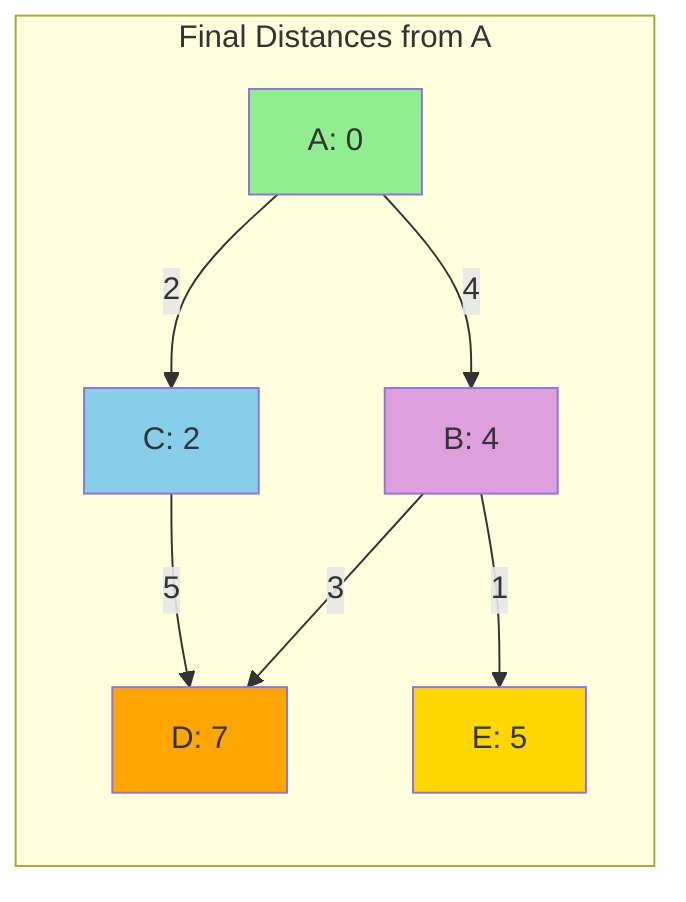

# Dijkstra's Algorithm

## Overview

| Property | Value |
|----------|-------|
| **Category** | Shortest Path |
| **Complexity (Time)** | O((V + E) log V) with binary heap |
| **Complexity (Space)** | O(V) |
| **Graph Type** | Weighted, non-negative edges |
| **Best For** | Single-source shortest path |

## Description

Dijkstra's algorithm, invented by Dutch computer scientist Edsger W. Dijkstra in 1956, finds the shortest paths from a single source vertex to all other vertices in a weighted graph with non-negative edge weights. It's one of the most important algorithms in computer science, foundational to GPS navigation, network routing, and countless optimization problems.

The algorithm maintains a set of vertices whose final shortest path from the source is known and repeatedly selects the vertex with the minimum tentative distance to add to this set.

## Mathematical Foundation

### Optimal Substructure

For a shortest path $p = \langle v_0, v_1, \ldots, v_k \rangle$ from $v_0$ to $v_k$:

$$p_{ij} = \langle v_i, v_{i+1}, \ldots, v_j \rangle$$

is a shortest path from $v_i$ to $v_j$ for all $0 \leq i \leq j \leq k$.

### Relaxation

For edge $(u, v)$ with weight $w(u, v)$:

$$d[v] = \min(d[v], d[u] + w(u, v))$$

If this decreases $d[v]$, update the predecessor: $\pi[v] = u$

### Triangle Inequality

For all edges $(u, v) \in E$:

$$\delta(s, v) \leq \delta(s, u) + w(u, v)$$

Where $\delta(s, x)$ is the shortest path distance from source $s$ to $x$.

### Correctness Condition

When vertex $u$ is extracted from the priority queue:

$$d[u] = \delta(s, u)$$

This holds because all edge weights are non-negative.

### Distance Update Formula

After processing vertex $u$, for each neighbor $v$:

$$d[v]^{new} = \begin{cases} 
d[u] + w(u, v) & \text{if } d[u] + w(u, v) < d[v]^{old} \\
d[v]^{old} & \text{otherwise}
\end{cases}$$

## Algorithm

### Pseudocode

```
DIJKSTRA(graph G, source s):
    // Initialize distances
    for each vertex v in V:
        dist[v] ← ∞
        prev[v] ← NULL
    dist[s] ← 0
    
    // Priority queue with all vertices
    Q ← priority queue of all vertices
    
    while Q is not empty:
        // Extract vertex with minimum distance
        u ← EXTRACT-MIN(Q)
        
        // Relax all outgoing edges
        for each neighbor v of u:
            alt ← dist[u] + weight(u, v)
            if alt < dist[v]:
                dist[v] ← alt
                prev[v] ← u
                DECREASE-KEY(Q, v, alt)
    
    return dist, prev
```

### Path Reconstruction

```
SHORTEST-PATH(prev, s, t):
    path ← []
    current ← t
    
    while current ≠ NULL:
        path.prepend(current)
        current ← prev[current]
    
    if path[0] = s:
        return path
    else:
        return []  // No path exists
```

### Step-by-Step Execution

```
Graph:
    A --4-- B --1-- E
    |       |
    2       3
    |       |
    C --5-- D

Source: A

Initialization:
  dist = {A: 0, B: ∞, C: ∞, D: ∞, E: ∞}
  Q = [(0, A), (∞, B), (∞, C), (∞, D), (∞, E)]

Step 1: Extract A (dist=0)
  Relax A→B: dist[B] = min(∞, 0+4) = 4
  Relax A→C: dist[C] = min(∞, 0+2) = 2
  dist = {A: 0, B: 4, C: 2, D: ∞, E: ∞}
  Q = [(2, C), (4, B), (∞, D), (∞, E)]

Step 2: Extract C (dist=2)
  Relax C→D: dist[D] = min(∞, 2+5) = 7
  dist = {A: 0, B: 4, C: 2, D: 7, E: ∞}
  Q = [(4, B), (7, D), (∞, E)]

Step 3: Extract B (dist=4)
  Relax B→D: dist[D] = min(7, 4+3) = 7 (no change)
  Relax B→E: dist[E] = min(∞, 4+1) = 5
  dist = {A: 0, B: 4, C: 2, D: 7, E: 5}
  Q = [(5, E), (7, D)]

Step 4: Extract E (dist=5)
  No outgoing edges
  Q = [(7, D)]

Step 5: Extract D (dist=7)
  No unvisited neighbors
  Q = []

Final distances from A: {A: 0, B: 4, C: 2, D: 7, E: 5}
```

## Complexity Analysis

### Time Complexity

| Implementation | Extract-Min | Decrease-Key | Total |
|---------------|-------------|--------------|-------|
| Array | O(V) | O(1) | O(V²) |
| Binary Heap | O(log V) | O(log V) | O((V + E) log V) |
| Fibonacci Heap | O(log V)* | O(1)* | O(E + V log V) |

*Amortized

### Space Complexity

| Component | Space |
|-----------|-------|
| Distance array | O(V) |
| Predecessor array | O(V) |
| Priority queue | O(V) |
| **Total** | **O(V)** |

## Visual Representation

```mermaid
flowchart TD
    A[Initialize distances: source=0, others=∞] --> B[Create priority queue with all vertices]
    B --> C{Queue empty?}
    C -->|Yes| D[Return distances and predecessors]
    C -->|No| E[Extract vertex u with minimum distance]
    E --> F[For each neighbor v of u]
    F --> G{d[u] + w[u,v] < d[v]?}
    G -->|Yes| H[Update d[v] = d[u] + w[u,v]]
    H --> I[Set prev[v] = u]
    I --> J[Decrease key of v in queue]
    J --> F
    G -->|No| F
    F -->|Done| C
```

### Distance Propagation



## Implementation

### Python Implementation with Heap

```python
from __future__ import annotations
import heapq


def dijkstra(
    graph: dict[str, list[list[str | int]]],
    start: str,
    end: str
) -> int:
    """
    Find shortest path cost from start to end using Dijkstra's algorithm.
    
    Args:
        graph: Adjacency list {vertex: [[neighbor, weight], ...]}
        start: Starting vertex
        end: Target vertex
    
    Returns:
        Shortest path cost, or -1 if no path exists
    
    Examples:
        >>> graph = {
        ...     "A": [["B", 4], ["C", 2]],
        ...     "B": [["A", 4], ["D", 3], ["E", 1]],
        ...     "C": [["A", 2], ["D", 5]],
        ...     "D": [["B", 3], ["C", 5], ["E", 2]],
        ...     "E": [["B", 1], ["D", 2]]
        ... }
        >>> dijkstra(graph, "A", "E")
        5
        >>> dijkstra(graph, "A", "D")
        7
    """
    # Distance dictionary
    distances = {start: 0}
    
    # Priority queue: (distance, vertex)
    heap = [(0, start)]
    
    # Visited set
    visited = set()
    
    while heap:
        current_dist, current = heapq.heappop(heap)
        
        if current in visited:
            continue
        
        if current == end:
            return current_dist
        
        visited.add(current)
        
        for neighbor, weight in graph.get(current, []):
            if neighbor in visited:
                continue
            
            new_dist = current_dist + weight
            
            if neighbor not in distances or new_dist < distances[neighbor]:
                distances[neighbor] = new_dist
                heapq.heappush(heap, (new_dist, neighbor))
    
    return -1  # No path found
```

### Full Implementation with Path

```python
import heapq
from typing import Optional


def dijkstra_full(
    graph: dict[str, list[tuple[str, int]]],
    source: str
) -> tuple[dict[str, int], dict[str, Optional[str]]]:
    """
    Dijkstra's algorithm returning distances and predecessors.
    
    Examples:
        >>> graph = {
        ...     "A": [("B", 4), ("C", 2)],
        ...     "B": [("D", 3), ("E", 1)],
        ...     "C": [("D", 5)],
        ...     "D": [],
        ...     "E": []
        ... }
        >>> dist, prev = dijkstra_full(graph, "A")
        >>> dist["E"]
        5
        >>> prev["E"]
        'B'
    """
    # Initialize
    distances = {v: float('inf') for v in graph}
    distances[source] = 0
    predecessors = {v: None for v in graph}
    
    # Priority queue
    heap = [(0, source)]
    visited = set()
    
    while heap:
        dist, u = heapq.heappop(heap)
        
        if u in visited:
            continue
        visited.add(u)
        
        for v, weight in graph.get(u, []):
            if v in visited:
                continue
            
            new_dist = dist + weight
            
            if new_dist < distances[v]:
                distances[v] = new_dist
                predecessors[v] = u
                heapq.heappush(heap, (new_dist, v))
    
    return distances, predecessors


def reconstruct_path(
    predecessors: dict[str, Optional[str]],
    source: str,
    target: str
) -> list[str]:
    """
    Reconstruct path from source to target.
    
    Examples:
        >>> pred = {"A": None, "B": "A", "C": "A", "D": "B", "E": "B"}
        >>> reconstruct_path(pred, "A", "E")
        ['A', 'B', 'E']
    """
    if predecessors.get(target) is None and target != source:
        return []  # No path
    
    path = []
    current = target
    
    while current is not None:
        path.append(current)
        current = predecessors[current]
    
    return path[::-1]
```

### Dijkstra with Adjacency Matrix

```python
def dijkstra_matrix(
    matrix: list[list[int]],
    source: int
) -> list[int]:
    """
    Dijkstra using adjacency matrix. Use -1 or inf for no edge.
    
    Examples:
        >>> INF = float('inf')
        >>> matrix = [
        ...     [0, 4, 2, INF, INF],
        ...     [4, 0, INF, 3, 1],
        ...     [2, INF, 0, 5, INF],
        ...     [INF, 3, 5, 0, 2],
        ...     [INF, 1, INF, 2, 0]
        ... ]
        >>> dijkstra_matrix(matrix, 0)
        [0, 4, 2, 7, 5]
    """
    n = len(matrix)
    distances = [float('inf')] * n
    distances[source] = 0
    visited = [False] * n
    
    for _ in range(n):
        # Find minimum distance vertex
        min_dist = float('inf')
        u = -1
        for v in range(n):
            if not visited[v] and distances[v] < min_dist:
                min_dist = distances[v]
                u = v
        
        if u == -1:
            break
        
        visited[u] = True
        
        # Relax edges
        for v in range(n):
            if (not visited[v] and 
                matrix[u][v] != float('inf') and
                distances[u] + matrix[u][v] < distances[v]):
                distances[v] = distances[u] + matrix[u][v]
    
    return distances
```

### Bidirectional Dijkstra

```python
def bidirectional_dijkstra(
    graph: dict[str, list[tuple[str, int]]],
    reverse_graph: dict[str, list[tuple[str, int]]],
    source: str,
    target: str
) -> int:
    """
    Bidirectional Dijkstra for faster single-pair shortest path.
    
    Examples:
        >>> graph = {"A": [("B", 1), ("C", 4)], "B": [("C", 2)], "C": []}
        >>> rev = {"A": [], "B": [("A", 1)], "C": [("A", 4), ("B", 2)]}
        >>> bidirectional_dijkstra(graph, rev, "A", "C")
        3
    """
    # Forward search from source
    dist_f = {source: 0}
    heap_f = [(0, source)]
    visited_f = set()
    
    # Backward search from target
    dist_b = {target: 0}
    heap_b = [(0, target)]
    visited_b = set()
    
    best = float('inf')
    
    while heap_f or heap_b:
        # Forward step
        if heap_f:
            d, u = heapq.heappop(heap_f)
            if u not in visited_f:
                visited_f.add(u)
                if u in visited_b:
                    best = min(best, dist_f[u] + dist_b[u])
                for v, w in graph.get(u, []):
                    if v not in visited_f:
                        new_d = d + w
                        if v not in dist_f or new_d < dist_f[v]:
                            dist_f[v] = new_d
                            heapq.heappush(heap_f, (new_d, v))
        
        # Backward step
        if heap_b:
            d, u = heapq.heappop(heap_b)
            if u not in visited_b:
                visited_b.add(u)
                if u in visited_f:
                    best = min(best, dist_f[u] + dist_b[u])
                for v, w in reverse_graph.get(u, []):
                    if v not in visited_b:
                        new_d = d + w
                        if v not in dist_b or new_d < dist_b[v]:
                            dist_b[v] = new_d
                            heapq.heappush(heap_b, (new_d, v))
        
        # Early termination
        if heap_f and heap_b:
            min_f = heap_f[0][0] if heap_f else float('inf')
            min_b = heap_b[0][0] if heap_b else float('inf')
            if min_f + min_b >= best:
                break
    
    return best if best != float('inf') else -1
```

## Real-World Applications

### 1. GPS Navigation System

```python
from dataclasses import dataclass
from typing import Optional


@dataclass
class Location:
    """Geographic location with coordinates."""
    name: str
    lat: float
    lon: float


class GPSNavigator:
    """
    GPS navigation using Dijkstra's algorithm.
    """
    
    def __init__(self):
        self.locations: dict[str, Location] = {}
        self.roads: dict[str, list[tuple[str, float]]] = {}
    
    def add_location(self, name: str, lat: float, lon: float) -> None:
        """Add a location to the map."""
        self.locations[name] = Location(name, lat, lon)
        self.roads.setdefault(name, [])
    
    def add_road(
        self, 
        from_loc: str, 
        to_loc: str, 
        distance: float,
        bidirectional: bool = True
    ) -> None:
        """Add a road between locations."""
        self.roads[from_loc].append((to_loc, distance))
        if bidirectional:
            self.roads[to_loc].append((from_loc, distance))
    
    def find_route(
        self, 
        start: str, 
        end: str
    ) -> tuple[list[str], float]:
        """
        Find shortest route between two locations.
        
        Examples:
            >>> gps = GPSNavigator()
            >>> gps.add_location("Home", 0, 0)
            >>> gps.add_location("Office", 1, 1)
            >>> gps.add_location("Mall", 0, 1)
            >>> gps.add_road("Home", "Mall", 5)
            >>> gps.add_road("Mall", "Office", 3)
            >>> gps.add_road("Home", "Office", 10)
            >>> route, dist = gps.find_route("Home", "Office")
            >>> dist
            8
            >>> route
            ['Home', 'Mall', 'Office']
        """
        distances = {start: 0}
        predecessors = {start: None}
        heap = [(0, start)]
        visited = set()
        
        while heap:
            dist, current = heapq.heappop(heap)
            
            if current in visited:
                continue
            visited.add(current)
            
            if current == end:
                # Reconstruct path
                path = []
                node = end
                while node is not None:
                    path.append(node)
                    node = predecessors[node]
                return path[::-1], dist
            
            for neighbor, road_dist in self.roads.get(current, []):
                if neighbor in visited:
                    continue
                new_dist = dist + road_dist
                if neighbor not in distances or new_dist < distances[neighbor]:
                    distances[neighbor] = new_dist
                    predecessors[neighbor] = current
                    heapq.heappush(heap, (new_dist, neighbor))
        
        return [], -1  # No route found
```

### 2. Network Routing Protocol

```python
class NetworkRouter:
    """
    Network routing using shortest path algorithm (like OSPF).
    """
    
    def __init__(self, router_id: str):
        self.router_id = router_id
        self.neighbors: dict[str, int] = {}  # neighbor -> cost
        self.routing_table: dict[str, tuple[str, int]] = {}  # dest -> (next_hop, cost)
    
    def add_neighbor(self, neighbor: str, cost: int) -> None:
        """Add direct neighbor with link cost."""
        self.neighbors[neighbor] = cost
    
    def compute_routing_table(
        self,
        network_topology: dict[str, dict[str, int]]
    ) -> None:
        """
        Compute routing table using Dijkstra's algorithm.
        
        Examples:
            >>> router = NetworkRouter("R1")
            >>> topology = {
            ...     "R1": {"R2": 10, "R3": 5},
            ...     "R2": {"R1": 10, "R3": 2, "R4": 1},
            ...     "R3": {"R1": 5, "R2": 2, "R4": 9},
            ...     "R4": {"R2": 1, "R3": 9}
            ... }
            >>> router.compute_routing_table(topology)
            >>> router.routing_table["R4"]
            ('R3', 8)
        """
        distances = {self.router_id: 0}
        next_hop = {self.router_id: None}
        heap = [(0, self.router_id, None)]
        visited = set()
        
        while heap:
            dist, node, first_hop = heapq.heappop(heap)
            
            if node in visited:
                continue
            visited.add(node)
            
            if first_hop is not None:
                self.routing_table[node] = (first_hop, dist)
            
            for neighbor, cost in network_topology.get(node, {}).items():
                if neighbor in visited:
                    continue
                
                new_dist = dist + cost
                hop = first_hop if first_hop else neighbor
                
                if neighbor not in distances or new_dist < distances[neighbor]:
                    distances[neighbor] = new_dist
                    next_hop[neighbor] = hop
                    heapq.heappush(heap, (new_dist, neighbor, hop))
    
    def route_packet(self, destination: str) -> str | None:
        """Get next hop for packet to destination."""
        if destination in self.routing_table:
            return self.routing_table[destination][0]
        return None
```

### 3. Airline Route Optimizer

```python
@dataclass
class Flight:
    """Flight information."""
    departure: str
    arrival: str
    cost: float
    duration: int  # minutes


class AirlineRouter:
    """
    Find cheapest or fastest flight routes.
    """
    
    def __init__(self):
        self.flights: dict[str, list[Flight]] = {}
    
    def add_flight(
        self,
        departure: str,
        arrival: str,
        cost: float,
        duration: int
    ) -> None:
        """Add a flight route."""
        flight = Flight(departure, arrival, cost, duration)
        self.flights.setdefault(departure, []).append(flight)
    
    def find_cheapest_route(
        self,
        origin: str,
        destination: str
    ) -> tuple[list[str], float]:
        """
        Find cheapest route between airports.
        
        Examples:
            >>> router = AirlineRouter()
            >>> router.add_flight("JFK", "LAX", 300, 360)
            >>> router.add_flight("JFK", "ORD", 150, 150)
            >>> router.add_flight("ORD", "LAX", 200, 240)
            >>> route, cost = router.find_cheapest_route("JFK", "LAX")
            >>> cost
            300
        """
        costs = {origin: 0}
        predecessors = {origin: None}
        heap = [(0, origin)]
        visited = set()
        
        while heap:
            cost, airport = heapq.heappop(heap)
            
            if airport in visited:
                continue
            visited.add(airport)
            
            if airport == destination:
                path = []
                node = destination
                while node:
                    path.append(node)
                    node = predecessors[node]
                return path[::-1], cost
            
            for flight in self.flights.get(airport, []):
                if flight.arrival in visited:
                    continue
                new_cost = cost + flight.cost
                if flight.arrival not in costs or new_cost < costs[flight.arrival]:
                    costs[flight.arrival] = new_cost
                    predecessors[flight.arrival] = airport
                    heapq.heappush(heap, (new_cost, flight.arrival))
        
        return [], -1
```

## Algorithm Variants

| Variant | Use Case | Difference |
|---------|----------|------------|
| **Bidirectional** | Single-pair query | Search from both ends |
| **A*** | Known target location | Add heuristic estimate |
| **Dial's** | Small integer weights | Use buckets instead of heap |
| **Delta-stepping** | Parallel computing | Batch relaxations |

## Limitations

1. **No negative weights:** Fails with negative edge weights
2. **Single source:** Computes from one source only
3. **Memory:** Stores all vertices in priority queue

For negative weights, use [Bellman-Ford](bellman_ford.md).
For all-pairs, use [Floyd-Warshall](floyd_warshall.md).

## References

1. Dijkstra, E.W. "A note on two problems in connexion with graphs" (1959)
2. [Dijkstra's Algorithm - Wikipedia](https://en.wikipedia.org/wiki/Dijkstra%27s_algorithm)
3. Cormen, T.H. "Introduction to Algorithms" - Chapter 24.3

## See Also

- [Bellman-Ford Algorithm](bellman_ford.md) - Handles negative weights
- [A* Search](a_star.md) - Heuristic-guided Dijkstra
- [Floyd-Warshall](floyd_warshall.md) - All-pairs shortest path
- [Bidirectional Dijkstra](bidirectional_dijkstra.md) - Faster single-pair queries
