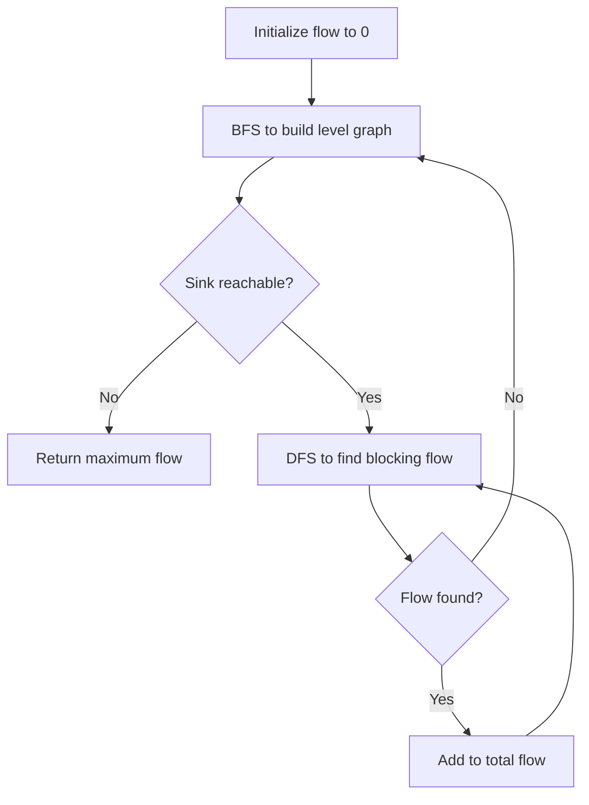
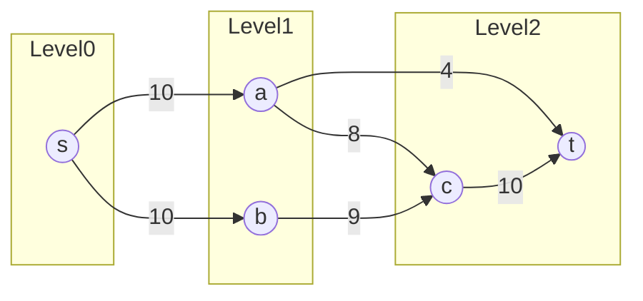

# Dinic's Algorithm (Maximum Flow)

## Overview

| Property | Value |
|----------|-------|
| **Category** | Network Flow |
| **Complexity (Time)** | O(V²E), O(E√V) for unit capacities |
| **Complexity (Space)** | O(V + E) |
| **Graph Type** | Directed, weighted (capacities) |
| **Best For** | Maximum flow, bipartite matching, min-cut |

## Description

Dinic's algorithm (also known as Dinitz's algorithm) computes the maximum flow in a flow network. Invented by Yefim Dinitz in 1970, it improves upon Ford-Fulkerson by using the concept of level graphs and blocking flows to find augmenting paths more efficiently.

The algorithm repeatedly constructs a level graph via BFS, then finds a blocking flow in that level graph via DFS. This approach guarantees termination in O(V) phases, each taking O(VE) time.

## Mathematical Foundation

### Flow Network

A flow network $G = (V, E)$ with:
- Source $s$ and sink $t$
- Capacity function $c: E \rightarrow \mathbb{R}^+$
- Flow function $f: E \rightarrow \mathbb{R}^+$

### Flow Constraints

For valid flow $f$:

1. **Capacity constraint**: $0 \leq f(u,v) \leq c(u,v)$
2. **Conservation**: $\sum_{u} f(u,v) = \sum_{w} f(v,w)$ for all $v \neq s,t$

### Maximum Flow

$$\max |f| = \max \sum_{v} f(s,v)$$

### Level Graph

Level graph $L_f$ has vertices at level $d$:
$$\text{level}(v) = \text{shortest path length from } s \text{ to } v$$

Only edges $(u,v)$ where $\text{level}(v) = \text{level}(u) + 1$ are included.

### Blocking Flow

A blocking flow saturates at least one edge on every $s \to t$ path in the level graph.

### Phase Bound

After each phase, shortest augmenting path length increases:
$$\text{dist}_{L_{i+1}}(s, t) > \text{dist}_{L_i}(s, t)$$

Maximum phases: $V - 1$ (longest simple path).

## Algorithm

### Pseudocode

```
DINIC(graph G, source s, sink t):
    Initialize flow f = 0
    
    while BFS_LEVEL_GRAPH(G, s, t):  // Build level graph
        while true:
            blocking_flow ← DFS_BLOCKING_FLOW(s, t, ∞)
            if blocking_flow = 0:
                break
            f ← f + blocking_flow
    
    return f

BFS_LEVEL_GRAPH(G, s, t):
    level ← array of size |V|, all -1
    level[s] ← 0
    queue ← [s]
    
    while queue not empty:
        u ← queue.dequeue()
        for each edge (u, v) with residual capacity > 0:
            if level[v] = -1:
                level[v] ← level[u] + 1
                queue.enqueue(v)
    
    return level[t] ≠ -1  // t reachable?

DFS_BLOCKING_FLOW(u, t, flow_limit):
    if u = t:
        return flow_limit
    
    for each edge (u, v) with residual capacity > 0:
        if level[v] = level[u] + 1:
            pushed ← DFS_BLOCKING_FLOW(v, t, min(flow_limit, capacity(u,v)))
            if pushed > 0:
                flow(u, v) ← flow(u, v) + pushed
                flow(v, u) ← flow(v, u) - pushed  // Reverse edge
                return pushed
    
    return 0  // No augmenting path found
```

### Step-by-Step Execution

```
Flow Network:
    s ─10→ a ─4→ t
    │      │
    10     8
    ↓      ↓
    b ─9→  c ─10→ t

Phase 1:
  BFS Level Graph:
    level[s] = 0
    level[a] = 1, level[b] = 1
    level[c] = 2
    level[t] = 2 (via a→t) or 3 (via c→t)
    
  DFS Blocking Flow:
    Path s→a→t: min(10, 4) = 4
    Path s→b→c→t: min(10, 9, 10) = 9
    Path s→a→c→t: min(10-4=6, 8, 10-9=1) = 1
    
    Blocking flow = 4 + 9 + 1 = 14

Phase 2:
  BFS Level Graph:
    After phase 1:
      s→a: residual = 10 - 5 = 5
      s→b: residual = 10 - 9 = 1
      a→t: saturated (residual = 0)
      a→c: residual = 8 - 1 = 7
      b→c: saturated (residual = 0)
      c→t: residual = 10 - 10 = 0 (saturated)
    
    New level graph:
      level[s] = 0
      level[a] = 1
      level[c] = 2 (via a)
      level[t] = 3 (no direct path from a or c!)
      
    Actually, t not reachable → terminate

Maximum flow = 14
```

## Complexity Analysis

### Time Complexity

| Case | Complexity |
|------|-----------|
| General | O(V²E) |
| Unit capacity edges | O(E√V) |
| Bipartite matching | O(E√V) |

### Phase Analysis

- Each BFS: O(E)
- Each DFS: O(VE) worst case
- Number of phases: O(V)
- **Total**: O(V) × O(VE) = O(V²E)

### Space Complexity

| Component | Space |
|-----------|-------|
| Level array | O(V) |
| Flow arrays | O(E) |
| Adjacency list | O(V + E) |
| **Total** | **O(V + E)** |

## Visual Representation



### Level Graph Construction



## Implementation

### Python Implementation

```python
from __future__ import annotations
from collections import deque


class Dinic:
    """
    Dinic's algorithm for maximum flow.
    
    Uses level graph (BFS) and blocking flow (DFS) for efficiency.
    """
    
    def __init__(self, n: int):
        """
        Initialize flow network.
        
        Args:
            n: Number of vertices (0 to n-1)
        """
        self.n = n
        self.graph: list[list[int]] = [[] for _ in range(n)]
        self.capacity: dict[tuple[int, int], int] = {}
        self.level: list[int] = []
        self.iter: list[int] = []  # Current edge index for DFS
    
    def add_edge(
        self, 
        u: int, 
        v: int, 
        cap: int, 
        rcap: int = 0
    ) -> None:
        """
        Add edge from u to v with given capacity.
        
        Args:
            u: Source vertex
            v: Destination vertex
            cap: Forward capacity
            rcap: Reverse capacity (0 for directed, cap for undirected)
        """
        self.graph[u].append(v)
        self.graph[v].append(u)
        self.capacity[(u, v)] = self.capacity.get((u, v), 0) + cap
        self.capacity[(v, u)] = self.capacity.get((v, u), 0) + rcap
    
    def bfs(self, source: int, sink: int) -> bool:
        """
        Build level graph using BFS.
        
        Returns:
            True if sink is reachable from source
        """
        self.level = [-1] * self.n
        self.level[source] = 0
        queue = deque([source])
        
        while queue:
            u = queue.popleft()
            for v in self.graph[u]:
                if self.level[v] == -1 and self.capacity.get((u, v), 0) > 0:
                    self.level[v] = self.level[u] + 1
                    queue.append(v)
        
        return self.level[sink] != -1
    
    def dfs(self, u: int, sink: int, flow_limit: int) -> int:
        """
        Find blocking flow using DFS.
        
        Args:
            u: Current vertex
            sink: Sink vertex
            flow_limit: Maximum flow to push
        
        Returns:
            Amount of flow pushed
        """
        if u == sink:
            return flow_limit
        
        while self.iter[u] < len(self.graph[u]):
            v = self.graph[u][self.iter[u]]
            cap = self.capacity.get((u, v), 0)
            
            if cap > 0 and self.level[v] == self.level[u] + 1:
                pushed = self.dfs(v, sink, min(flow_limit, cap))
                if pushed > 0:
                    self.capacity[(u, v)] -= pushed
                    self.capacity[(v, u)] = self.capacity.get((v, u), 0) + pushed
                    return pushed
            
            self.iter[u] += 1
        
        return 0
    
    def max_flow(self, source: int, sink: int) -> int:
        """
        Calculate maximum flow from source to sink.
        
        Args:
            source: Source vertex
            sink: Sink vertex
        
        Returns:
            Maximum flow value
        
        Examples:
            >>> dinic = Dinic(4)
            >>> dinic.add_edge(0, 1, 10)
            >>> dinic.add_edge(0, 2, 10)
            >>> dinic.add_edge(1, 3, 4)
            >>> dinic.add_edge(1, 2, 2)
            >>> dinic.add_edge(2, 3, 9)
            >>> dinic.max_flow(0, 3)
            13
        """
        if source == sink:
            return 0
        
        total_flow = 0
        
        while self.bfs(source, sink):
            self.iter = [0] * self.n
            
            while True:
                flow = self.dfs(source, sink, float('inf'))
                if flow == 0:
                    break
                total_flow += flow
        
        return total_flow
    
    def min_cut(self, source: int) -> tuple[set[int], set[int]]:
        """
        Find minimum cut after computing max flow.
        
        Returns:
            (source_side, sink_side) vertex sets
        """
        # Vertices reachable from source in residual graph
        visited = set()
        queue = deque([source])
        visited.add(source)
        
        while queue:
            u = queue.popleft()
            for v in self.graph[u]:
                if v not in visited and self.capacity.get((u, v), 0) > 0:
                    visited.add(v)
                    queue.append(v)
        
        source_side = visited
        sink_side = set(range(self.n)) - visited
        
        return source_side, sink_side
```

### With Edge Recovery

```python
class DinicWithEdges:
    """Dinic's algorithm that tracks actual edges used."""
    
    def __init__(self, n: int):
        self.n = n
        # Edge list: (to, capacity, reverse_edge_index)
        self.graph: list[list[list[int]]] = [[] for _ in range(n)]
    
    def add_edge(self, u: int, v: int, cap: int) -> None:
        """Add directed edge."""
        # Forward edge
        self.graph[u].append([v, cap, len(self.graph[v])])
        # Reverse edge (for residual graph)
        self.graph[v].append([u, 0, len(self.graph[u]) - 1])
    
    def bfs(self, source: int, sink: int, level: list[int]) -> bool:
        """Build level graph."""
        level[:] = [-1] * self.n
        level[source] = 0
        queue = deque([source])
        
        while queue:
            u = queue.popleft()
            for v, cap, _ in self.graph[u]:
                if level[v] == -1 and cap > 0:
                    level[v] = level[u] + 1
                    queue.append(v)
        
        return level[sink] != -1
    
    def dfs(
        self, 
        u: int, 
        sink: int, 
        flow: int, 
        level: list[int], 
        iter_: list[int]
    ) -> int:
        """Find blocking flow."""
        if u == sink:
            return flow
        
        while iter_[u] < len(self.graph[u]):
            edge = self.graph[u][iter_[u]]
            v, cap, rev = edge
            
            if cap > 0 and level[v] == level[u] + 1:
                pushed = self.dfs(v, sink, min(flow, cap), level, iter_)
                if pushed > 0:
                    edge[1] -= pushed
                    self.graph[v][rev][1] += pushed
                    return pushed
            
            iter_[u] += 1
        
        return 0
    
    def max_flow(self, source: int, sink: int) -> int:
        """Calculate maximum flow."""
        flow = 0
        level = [-1] * self.n
        
        while self.bfs(source, sink, level):
            iter_ = [0] * self.n
            while True:
                f = self.dfs(source, sink, float('inf'), level, iter_)
                if f == 0:
                    break
                flow += f
        
        return flow
    
    def get_flow_edges(self) -> list[tuple[int, int, int]]:
        """
        Get edges with positive flow.
        
        Returns:
            List of (from, to, flow) tuples
        """
        edges = []
        for u in range(self.n):
            for v, cap, rev in self.graph[u]:
                # Original edge has flow = original_cap - current_cap
                # Reverse edge stores the flow
                flow = self.graph[v][rev][1]
                if flow > 0 and cap >= 0:  # Forward edge with flow
                    edges.append((u, v, self.graph[v][rev][1]))
        return edges
```

## Real-World Applications

### 1. Bipartite Matching

```python
from typing import Dict, List, Set, Tuple, Optional


class BipartiteMatching:
    """
    Maximum bipartite matching using Dinic's algorithm.
    
    Runs in O(E√V) for bipartite graphs.
    """
    
    def __init__(self, left_size: int, right_size: int):
        self.left_size = left_size
        self.right_size = right_size
        self.edges: List[Tuple[int, int]] = []
    
    def add_edge(self, left: int, right: int) -> None:
        """Add edge between left vertex and right vertex."""
        self.edges.append((left, right))
    
    def maximum_matching(self) -> List[Tuple[int, int]]:
        """
        Find maximum matching.
        
        Returns:
            List of (left, right) matched pairs
        """
        # Build flow network:
        # 0 = source
        # 1 to left_size = left vertices
        # left_size+1 to left_size+right_size = right vertices
        # left_size+right_size+1 = sink
        
        n = 2 + self.left_size + self.right_size
        source = 0
        sink = n - 1
        
        dinic = DinicWithEdges(n)
        
        # Source to left vertices
        for i in range(self.left_size):
            dinic.add_edge(source, i + 1, 1)
        
        # Left to right vertices
        for left, right in self.edges:
            dinic.add_edge(left + 1, self.left_size + 1 + right, 1)
        
        # Right vertices to sink
        for i in range(self.right_size):
            dinic.add_edge(self.left_size + 1 + i, sink, 1)
        
        max_flow = dinic.max_flow(source, sink)
        
        # Extract matching
        matching = []
        for left, right in self.edges:
            u = left + 1
            v = self.left_size + 1 + right
            # Check if edge has flow
            for edge in dinic.graph[u]:
                if edge[0] == v and dinic.graph[v][edge[2]][1] > 0:
                    matching.append((left, right))
                    break
        
        return matching


# Usage
def assign_tasks_to_workers(
    workers: List[str],
    tasks: List[str],
    capabilities: Dict[str, Set[str]]  # worker -> set of tasks they can do
) -> Dict[str, str]:
    """
    Assign tasks to workers maximizing assignments.
    """
    worker_idx = {w: i for i, w in enumerate(workers)}
    task_idx = {t: i for i, t in enumerate(tasks)}
    
    matcher = BipartiteMatching(len(workers), len(tasks))
    
    for worker, task_set in capabilities.items():
        for task in task_set:
            if task in task_idx:
                matcher.add_edge(worker_idx[worker], task_idx[task])
    
    matching = matcher.maximum_matching()
    
    return {workers[w]: tasks[t] for w, t in matching}
```

### 2. Project Selection Problem

```python
from dataclasses import dataclass
from typing import Dict, List, Set, Tuple


@dataclass
class Project:
    """Project with profit and dependencies."""
    id: str
    profit: int  # Can be negative (cost)
    requires: Set[str]  # Must complete these first


class ProjectSelector:
    """
    Select projects to maximize profit using max-flow min-cut.
    """
    
    def __init__(self):
        self.projects: Dict[str, Project] = {}
    
    def add_project(
        self, 
        project_id: str, 
        profit: int, 
        requires: Set[str] = None
    ) -> None:
        """Add project."""
        self.projects[project_id] = Project(project_id, profit, requires or set())
    
    def select_optimal(self) -> Tuple[Set[str], int]:
        """
        Select projects to maximize total profit.
        
        Uses min-cut: source side = selected projects.
        
        Returns:
            (selected_projects, total_profit)
        """
        ids = list(self.projects.keys())
        idx = {pid: i + 1 for i, pid in enumerate(ids)}  # 0 = source
        n = len(ids) + 2
        source = 0
        sink = n - 1
        
        dinic = Dinic(n)
        
        # Positive profit projects connect to source
        # Negative profit projects connect to sink
        total_positive = 0
        
        for pid, project in self.projects.items():
            if project.profit > 0:
                dinic.add_edge(source, idx[pid], project.profit)
                total_positive += project.profit
            elif project.profit < 0:
                dinic.add_edge(idx[pid], sink, -project.profit)
        
        # Dependencies: if we select project A, must select project B
        # Edge from A to B with infinite capacity
        INF = sum(abs(p.profit) for p in self.projects.values()) + 1
        
        for pid, project in self.projects.items():
            for req in project.requires:
                if req in idx:
                    dinic.add_edge(idx[pid], idx[req], INF)
        
        min_cut = dinic.max_flow(source, sink)
        max_profit = total_positive - min_cut
        
        # Selected projects are on source side of min-cut
        source_side, _ = dinic.min_cut(source)
        selected = {ids[i - 1] for i in source_side if 1 <= i <= len(ids)}
        
        return selected, max_profit
```

### 3. Network Bandwidth Allocation

```python
from dataclasses import dataclass
from typing import Dict, List, Set, Tuple, Optional


@dataclass
class NetworkLink:
    """Network link with bandwidth capacity."""
    from_node: str
    to_node: str
    bandwidth: int  # Mbps


class BandwidthAllocator:
    """
    Allocate network bandwidth using max flow.
    """
    
    def __init__(self):
        self.nodes: Set[str] = set()
        self.links: List[NetworkLink] = []
    
    def add_link(self, from_node: str, to_node: str, bandwidth: int) -> None:
        """Add network link."""
        self.nodes.add(from_node)
        self.nodes.add(to_node)
        self.links.append(NetworkLink(from_node, to_node, bandwidth))
    
    def max_bandwidth(self, source: str, destination: str) -> int:
        """
        Calculate maximum bandwidth between source and destination.
        """
        nodes = list(self.nodes)
        idx = {node: i for i, node in enumerate(nodes)}
        n = len(nodes)
        
        dinic = Dinic(n)
        
        for link in self.links:
            # Add bidirectional capacity (or use directed)
            dinic.add_edge(idx[link.from_node], idx[link.to_node], link.bandwidth)
        
        return dinic.max_flow(idx[source], idx[destination])
    
    def find_bottleneck_links(
        self, 
        source: str, 
        destination: str
    ) -> List[NetworkLink]:
        """
        Find links that limit bandwidth (min-cut edges).
        """
        nodes = list(self.nodes)
        idx = {node: i for i, node in enumerate(nodes)}
        n = len(nodes)
        
        dinic = Dinic(n)
        
        for link in self.links:
            dinic.add_edge(idx[link.from_node], idx[link.to_node], link.bandwidth)
        
        dinic.max_flow(idx[source], idx[destination])
        
        source_side, sink_side = dinic.min_cut(idx[source])
        
        # Bottleneck links cross the cut
        bottlenecks = []
        for link in self.links:
            u, v = idx[link.from_node], idx[link.to_node]
            if u in source_side and v in sink_side:
                bottlenecks.append(link)
        
        return bottlenecks
    
    def allocate_flows(
        self,
        demands: List[Tuple[str, str, int]]  # (source, dest, bandwidth_needed)
    ) -> Dict[Tuple[str, str], int]:
        """
        Allocate bandwidth for multiple flows.
        
        Simple greedy allocation (not globally optimal).
        """
        allocations = {}
        
        # Create copy of capacities
        remaining_capacity: Dict[Tuple[str, str], int] = {}
        for link in self.links:
            key = (link.from_node, link.to_node)
            remaining_capacity[key] = link.bandwidth
        
        for source, dest, needed in demands:
            # Find max flow with remaining capacity
            nodes = list(self.nodes)
            idx = {node: i for i, node in enumerate(nodes)}
            n = len(nodes)
            
            dinic = Dinic(n)
            for (u, v), cap in remaining_capacity.items():
                if cap > 0:
                    dinic.add_edge(idx[u], idx[v], cap)
            
            available = dinic.max_flow(idx[source], idx[dest])
            allocated = min(available, needed)
            allocations[(source, dest)] = allocated
            
            # Update remaining capacity (simplified)
            # In practice, would track actual flow paths
        
        return allocations
```

## Comparison with Other Max Flow Algorithms

| Algorithm | Time Complexity | Best For |
|-----------|-----------------|----------|
| Ford-Fulkerson | O(E × max_flow) | Small flows |
| Edmonds-Karp | O(VE²) | General graphs |
| Dinic | O(V²E) | Dense graphs |
| Push-Relabel | O(V²E) or O(V³) | Dense graphs |
| Dinic (unit cap) | O(E√V) | Bipartite matching |

## References

1. Dinitz, Y. "Algorithm for solution of a problem of maximum flow" (1970)
2. [Dinic's Algorithm - Wikipedia](https://en.wikipedia.org/wiki/Dinic%27s_algorithm)
3. Cormen, T.H. "Introduction to Algorithms" - Chapter 26

## See Also

- [Ford-Fulkerson](ford_fulkerson.md) - Basic max flow method
- [Edmonds-Karp](edmonds_karp.md) - BFS augmentation
- [Min-Cut](min_cut.md) - Dual problem
