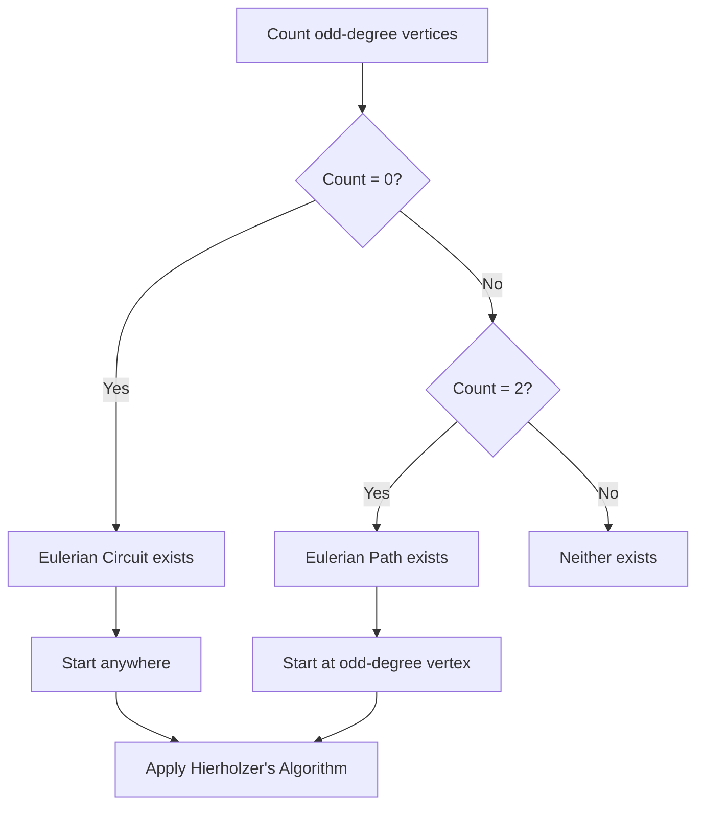
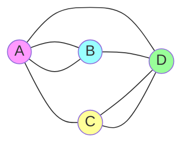

# Eulerian Path and Circuit

## Overview

| Property | Value |
|----------|-------|
| **Category** | Graph Traversal |
| **Complexity (Time)** | O(V + E) |
| **Complexity (Space)** | O(V + E) |
| **Graph Type** | Undirected or Directed |
| **Best For** | Route optimization, circuit design |

## Description

An Eulerian path is a path in a graph that visits every edge exactly once. An Eulerian circuit (or Eulerian cycle) is an Eulerian path that starts and ends at the same vertex.

The problem was first solved by Leonhard Euler in 1736 when he proved that the Seven Bridges of Königsberg problem had no solution, giving birth to graph theory.

## Mathematical Foundation

### Existence Conditions

For **undirected graphs**:

**Eulerian Circuit** exists if and only if:
- Graph is connected (ignoring isolated vertices)
- Every vertex has even degree

**Eulerian Path** exists if and only if:
- Graph is connected (ignoring isolated vertices)
- Exactly 0 or 2 vertices have odd degree

### Degree Definition

For undirected graph, degree of vertex $v$:
$$\deg(v) = |\{e \in E : v \in e\}|$$

### Handshaking Lemma

$$\sum_{v \in V} \deg(v) = 2|E|$$

This implies an even number of odd-degree vertices.

### For Directed Graphs

**Eulerian Circuit** exists if and only if:
- Graph is strongly connected
- $\text{in-degree}(v) = \text{out-degree}(v)$ for all vertices

**Eulerian Path** exists if and only if:
- Graph is weakly connected
- At most one vertex has $\text{out-degree} - \text{in-degree} = 1$ (start)
- At most one vertex has $\text{in-degree} - \text{out-degree} = 1$ (end)
- All other vertices have equal in-degree and out-degree

## Algorithm

### Hierholzer's Algorithm (for finding the path)

```
FIND_EULERIAN_PATH(graph):
    // Check existence
    odd_vertices ← count vertices with odd degree
    
    if odd_vertices > 2:
        return "No Eulerian path exists"
    
    // Determine starting vertex
    if odd_vertices == 2:
        start ← any vertex with odd degree
    else:
        start ← any vertex with edges
    
    // Find path using DFS
    path ← []
    stack ← [start]
    
    while stack not empty:
        v ← top of stack
        
        if v has unvisited edges:
            u ← next neighbor with unvisited edge
            mark edge (v, u) as visited
            push u to stack
        else:
            pop v from stack
            prepend v to path
    
    return path
```

### Checking Algorithm

```
CHECK_EULERIAN(graph):
    // Count odd degree vertices
    odd_count ← 0
    
    for each vertex v:
        if degree(v) is odd:
            odd_count ← odd_count + 1
    
    if odd_count == 0:
        return "Eulerian Circuit exists"
    else if odd_count == 2:
        return "Eulerian Path exists"
    else:
        return "Neither exists"
```

### Step-by-Step Execution

```
Graph:
  0 -- 1
  |    |
  3 -- 2

Degrees: deg(0)=2, deg(1)=2, deg(2)=2, deg(3)=2
All even → Eulerian Circuit exists

Hierholzer's Algorithm:
  Start at 0
  Stack: [0]
  
  Step 1: Visit edge 0-1
    Stack: [0, 1]
    
  Step 2: Visit edge 1-2  
    Stack: [0, 1, 2]
    
  Step 3: Visit edge 2-3
    Stack: [0, 1, 2, 3]
    
  Step 4: Visit edge 3-0
    Stack: [0, 1, 2, 3, 0]
    
  Step 5: No unvisited edges from 0
    Pop 0, path = [0]
    Pop 3, path = [3, 0]
    Pop 2, path = [2, 3, 0]
    Pop 1, path = [1, 2, 3, 0]
    Pop 0, path = [0, 1, 2, 3, 0]

Eulerian Circuit: 0 → 1 → 2 → 3 → 0
```

## Complexity Analysis

### Time Complexity

| Operation | Complexity |
|-----------|------------|
| Check existence | O(V) |
| Find path (Hierholzer) | O(E) |
| Total | O(V + E) |

### Space Complexity

- Edge visited markers: O(E)
- Path storage: O(E)
- Stack: O(V)
- Total: O(V + E)

## Visual Representation



### Euler's Königsberg Bridges


*All vertices have odd degree → No Eulerian path possible*

## Implementation

### Python Implementation

```python
from __future__ import annotations
from collections import defaultdict
from typing import List, Tuple, Optional


def check_circuit_or_path(graph: List[List[int]], max_node: int) -> int:
    """
    Check if Eulerian circuit or path exists.
    
    Args:
        graph: Adjacency matrix (symmetric for undirected)
        max_node: Number of vertices - 1
    
    Returns:
        1 if Eulerian circuit exists
        2 if Eulerian path exists
        3 if neither exists
    
    >>> graph = [[0, 1, 1, 0], [1, 0, 1, 0], [1, 1, 0, 1], [0, 0, 1, 0]]
    >>> check_circuit_or_path(graph, 3)
    2
    >>> graph = [[0, 1, 1, 0], [1, 0, 1, 1], [1, 1, 0, 1], [0, 1, 1, 0]]
    >>> check_circuit_or_path(graph, 3)
    1
    """
    odd_degree_count = 0
    
    for i in range(max_node + 1):
        degree = sum(graph[i])
        if degree % 2 == 1:
            odd_degree_count += 1
    
    if odd_degree_count == 0:
        return 1  # Circuit
    elif odd_degree_count == 2:
        return 2  # Path
    else:
        return 3  # Neither


def dfs(
    graph: List[List[int]],
    visited_edge: List[List[int]],
    curr: int,
    path: List[int],
    max_node: int
) -> None:
    """
    DFS to find Eulerian path/circuit.
    
    Marks edges as visited and builds path.
    """
    for node in range(max_node + 1):
        if graph[curr][node] == 1 and visited_edge[curr][node] == 0:
            # Mark edge as visited (both directions for undirected)
            visited_edge[curr][node] = 1
            visited_edge[node][curr] = 1
            
            dfs(graph, visited_edge, node, path, max_node)
    
    path.append(curr)


def find_eulerian_path(
    graph: List[List[int]],
    max_node: int
) -> Optional[List[int]]:
    """
    Find Eulerian path or circuit.
    
    Returns:
        Path as list of vertices, or None if not possible
    
    >>> graph = [[0, 1, 1, 0], [1, 0, 1, 1], [1, 1, 0, 1], [0, 1, 1, 0]]
    >>> path = find_eulerian_path(graph, 3)
    >>> len(path) == 5  # 4 edges + 1 (circuit)
    True
    """
    result = check_circuit_or_path(graph, max_node)
    
    if result == 3:
        return None
    
    # Find starting vertex
    start = 0
    if result == 2:  # Path - start at odd degree vertex
        for i in range(max_node + 1):
            if sum(graph[i]) % 2 == 1:
                start = i
                break
    
    # Track visited edges
    visited_edge = [[0] * (max_node + 1) for _ in range(max_node + 1)]
    
    path: List[int] = []
    dfs(graph, visited_edge, start, path, max_node)
    
    return path[::-1]


class EulerianGraph:
    """
    Graph class for Eulerian path/circuit finding.
    
    >>> g = EulerianGraph()
    >>> g.add_edge(0, 1)
    >>> g.add_edge(1, 2)
    >>> g.add_edge(2, 0)
    >>> g.has_eulerian_circuit()
    True
    """
    
    def __init__(self) -> None:
        self.adj: defaultdict[int, List[int]] = defaultdict(list)
        self.degree: defaultdict[int, int] = defaultdict(int)
    
    def add_edge(self, u: int, v: int) -> None:
        """Add undirected edge."""
        self.adj[u].append(v)
        self.adj[v].append(u)
        self.degree[u] += 1
        self.degree[v] += 1
    
    def has_eulerian_circuit(self) -> bool:
        """Check if Eulerian circuit exists."""
        return all(d % 2 == 0 for d in self.degree.values())
    
    def has_eulerian_path(self) -> bool:
        """Check if Eulerian path exists."""
        odd_count = sum(1 for d in self.degree.values() if d % 2 == 1)
        return odd_count in (0, 2)
    
    def find_path(self) -> Optional[List[int]]:
        """Find Eulerian path using Hierholzer's algorithm."""
        if not self.has_eulerian_path():
            return None
        
        # Copy adjacency for modification
        adj = defaultdict(list)
        for u in self.adj:
            adj[u] = self.adj[u].copy()
        
        # Find start vertex
        start = 0
        odd_vertices = [v for v in self.degree if self.degree[v] % 2 == 1]
        if odd_vertices:
            start = odd_vertices[0]
        elif self.adj:
            start = next(iter(self.adj))
        
        # Hierholzer's algorithm
        stack = [start]
        path = []
        
        while stack:
            v = stack[-1]
            
            if adj[v]:
                u = adj[v].pop()
                # Remove edge in other direction
                adj[u].remove(v)
                stack.append(u)
            else:
                path.append(stack.pop())
        
        return path[::-1]


if __name__ == "__main__":
    import doctest
    doctest.testmod()
```

### Directed Graph Version

```python
from typing import Dict, List, Optional, Set
from collections import defaultdict, deque


class DirectedEulerianGraph:
    """
    Eulerian path/circuit for directed graphs.
    """
    
    def __init__(self) -> None:
        self.adj: Dict[int, List[int]] = defaultdict(list)
        self.in_degree: Dict[int, int] = defaultdict(int)
        self.out_degree: Dict[int, int] = defaultdict(int)
        self.vertices: Set[int] = set()
    
    def add_edge(self, u: int, v: int) -> None:
        """Add directed edge u → v."""
        self.adj[u].append(v)
        self.out_degree[u] += 1
        self.in_degree[v] += 1
        self.vertices.add(u)
        self.vertices.add(v)
    
    def has_eulerian_circuit(self) -> bool:
        """
        Check if Eulerian circuit exists in directed graph.
        
        Requires in-degree = out-degree for all vertices.
        """
        for v in self.vertices:
            if self.in_degree[v] != self.out_degree[v]:
                return False
        return True
    
    def has_eulerian_path(self) -> bool:
        """
        Check if Eulerian path exists in directed graph.
        """
        start_count = 0
        end_count = 0
        
        for v in self.vertices:
            diff = self.out_degree[v] - self.in_degree[v]
            
            if diff == 1:
                start_count += 1
            elif diff == -1:
                end_count += 1
            elif diff != 0:
                return False
        
        return (start_count == 0 and end_count == 0) or \
               (start_count == 1 and end_count == 1)
    
    def find_path(self) -> Optional[List[int]]:
        """Find Eulerian path in directed graph."""
        if not self.has_eulerian_path():
            return None
        
        # Copy adjacency
        adj = defaultdict(list)
        for u in self.adj:
            adj[u] = self.adj[u].copy()
        
        # Find start
        start = None
        for v in self.vertices:
            if self.out_degree[v] - self.in_degree[v] == 1:
                start = v
                break
        
        if start is None:
            start = next(iter(self.vertices)) if self.vertices else 0
        
        # Hierholzer's algorithm
        stack = [start]
        path = []
        
        while stack:
            v = stack[-1]
            
            if adj[v]:
                u = adj[v].pop()
                stack.append(u)
            else:
                path.append(stack.pop())
        
        return path[::-1]
```

## Real-World Applications

### 1. DNA Sequence Assembly

```python
from typing import List, Dict, Set, Optional
from collections import defaultdict


class DNAAssembler:
    """
    Assemble DNA sequence from k-mers using Eulerian path.
    """
    
    def __init__(self, k: int):
        self.k = k
        self.adj: Dict[str, List[str]] = defaultdict(list)
        self.in_degree: Dict[str, int] = defaultdict(int)
        self.out_degree: Dict[str, int] = defaultdict(int)
    
    def add_kmer(self, kmer: str) -> None:
        """Add k-mer as directed edge."""
        prefix = kmer[:-1]
        suffix = kmer[1:]
        
        self.adj[prefix].append(suffix)
        self.out_degree[prefix] += 1
        self.in_degree[suffix] += 1
    
    def assemble(self, kmers: List[str]) -> Optional[str]:
        """
        Assemble DNA sequence from k-mers.
        
        The de Bruijn graph connects (k-1)-mers.
        Finding Eulerian path reconstructs original sequence.
        
        >>> assembler = DNAAssembler(3)
        >>> kmers = ["ATG", "TGC", "GCA", "CAT", "ATG"]
        >>> result = assembler.assemble(kmers)
        >>> result is not None
        True
        """
        # Build de Bruijn graph
        for kmer in kmers:
            self.add_kmer(kmer)
        
        # Find Eulerian path
        path = self._find_eulerian_path()
        
        if path is None:
            return None
        
        # Reconstruct sequence
        sequence = path[0]
        for node in path[1:]:
            sequence += node[-1]
        
        return sequence
    
    def _find_eulerian_path(self) -> Optional[List[str]]:
        """Find Eulerian path in de Bruijn graph."""
        # Find start node
        start = None
        vertices = set(self.in_degree.keys()) | set(self.out_degree.keys())
        
        for v in vertices:
            if self.out_degree[v] - self.in_degree[v] == 1:
                start = v
                break
        
        if start is None:
            start = next(iter(self.adj)) if self.adj else None
        
        if start is None:
            return None
        
        # Copy adjacency
        adj = defaultdict(list)
        for u in self.adj:
            adj[u] = self.adj[u].copy()
        
        # Hierholzer's algorithm
        stack = [start]
        path = []
        
        while stack:
            v = stack[-1]
            
            if adj[v]:
                u = adj[v].pop()
                stack.append(u)
            else:
                path.append(stack.pop())
        
        return path[::-1]


def demo_dna_assembly():
    """Demo: Assemble DNA from reads."""
    # Original sequence: ATGCATGC
    # 3-mers: ATG, TGC, GCA, CAT, ATG, TGC
    
    assembler = DNAAssembler(3)
    kmers = ["ATG", "TGC", "GCA", "CAT", "ATG", "TGC"]
    
    result = assembler.assemble(kmers)
    print(f"Assembled sequence: {result}")
    
    return result
```

### 2. Circuit Board Wire Routing

```python
from dataclasses import dataclass
from typing import List, Tuple, Dict, Optional, Set


@dataclass
class Pin:
    """Circuit board pin."""
    x: int
    y: int
    name: str


class CircuitRouter:
    """
    Route wires on circuit board using Eulerian path.
    
    Minimizes pen lifts when drawing circuit traces.
    """
    
    def __init__(self):
        self.pins: Dict[str, Pin] = {}
        self.connections: List[Tuple[str, str]] = []
    
    def add_pin(self, name: str, x: int, y: int) -> None:
        """Add pin to board."""
        self.pins[name] = Pin(x, y, name)
    
    def add_connection(self, pin1: str, pin2: str) -> None:
        """Add required wire connection."""
        self.connections.append((pin1, pin2))
    
    def optimal_drawing_order(self) -> Optional[List[Tuple[str, str]]]:
        """
        Find drawing order that minimizes pen lifts.
        
        If Eulerian path exists, can draw all wires
        without lifting the pen.
        """
        # Build graph
        adj: Dict[str, List[str]] = defaultdict(list)
        degree: Dict[str, int] = defaultdict(int)
        
        for pin1, pin2 in self.connections:
            adj[pin1].append(pin2)
            adj[pin2].append(pin1)
            degree[pin1] += 1
            degree[pin2] += 1
        
        # Check for Eulerian path
        odd_vertices = [v for v in degree if degree[v] % 2 == 1]
        
        if len(odd_vertices) > 2:
            # Need to add dummy edges or lift pen
            return self._find_with_pen_lifts(adj, degree)
        
        # Find Eulerian path
        start = odd_vertices[0] if odd_vertices else next(iter(adj))
        
        path = self._hierholzer(adj, start)
        
        # Convert to edge sequence
        edges = []
        for i in range(len(path) - 1):
            edges.append((path[i], path[i + 1]))
        
        return edges
    
    def _hierholzer(
        self, 
        adj: Dict[str, List[str]], 
        start: str
    ) -> List[str]:
        """Hierholzer's algorithm."""
        adj_copy = defaultdict(list)
        for u in adj:
            adj_copy[u] = adj[u].copy()
        
        stack = [start]
        path = []
        
        while stack:
            v = stack[-1]
            
            if adj_copy[v]:
                u = adj_copy[v].pop()
                adj_copy[u].remove(v)
                stack.append(u)
            else:
                path.append(stack.pop())
        
        return path[::-1]
    
    def _find_with_pen_lifts(
        self,
        adj: Dict[str, List[str]],
        degree: Dict[str, int]
    ) -> List[Tuple[str, str]]:
        """Find path with minimum pen lifts."""
        # Group odd vertices
        odd = [v for v in degree if degree[v] % 2 == 1]
        
        # Simple approach: draw components separately
        all_edges = []
        visited = set()
        
        for start in adj:
            if start in visited:
                continue
            
            # Find path from this component
            component_path = self._hierholzer_component(adj, start, visited)
            
            for i in range(len(component_path) - 1):
                all_edges.append((component_path[i], component_path[i + 1]))
        
        return all_edges
    
    def _hierholzer_component(
        self,
        adj: Dict[str, List[str]],
        start: str,
        visited: Set[str]
    ) -> List[str]:
        """Find path in one component."""
        adj_copy = defaultdict(list)
        for u in adj:
            if u not in visited:
                adj_copy[u] = [v for v in adj[u] if v not in visited]
        
        if not adj_copy[start]:
            visited.add(start)
            return [start]
        
        stack = [start]
        path = []
        
        while stack:
            v = stack[-1]
            
            if adj_copy[v]:
                u = adj_copy[v].pop()
                if v in adj_copy[u]:
                    adj_copy[u].remove(v)
                stack.append(u)
                visited.add(v)
            else:
                path.append(stack.pop())
        
        return path[::-1]
```

### 3. Snow Plow Route Optimization

```python
from typing import Dict, List, Tuple, Set, Optional
from collections import defaultdict
import heapq


class SnowPlowRouter:
    """
    Optimize snow plow routes to cover all streets.
    
    Streets must be plowed on both sides (undirected).
    Goal: minimize total distance traveled.
    """
    
    def __init__(self):
        self.intersections: Set[str] = set()
        self.streets: List[Tuple[str, str, float]] = []
    
    def add_street(
        self, 
        intersection1: str, 
        intersection2: str, 
        length: float
    ) -> None:
        """Add street between intersections."""
        self.intersections.add(intersection1)
        self.intersections.add(intersection2)
        self.streets.append((intersection1, intersection2, length))
    
    def optimize_route(self, depot: str) -> Dict[str, any]:
        """
        Find optimal plowing route starting and ending at depot.
        
        Uses Chinese Postman Problem approach:
        1. If Eulerian circuit exists, it's optimal
        2. Otherwise, add minimum matching of odd-degree vertices
        """
        # Build adjacency
        adj: Dict[str, Dict[str, float]] = defaultdict(dict)
        degree: Dict[str, int] = defaultdict(int)
        
        for u, v, length in self.streets:
            adj[u][v] = length
            adj[v][u] = length
            degree[u] += 1
            degree[v] += 1
        
        # Find odd-degree vertices
        odd_vertices = [v for v in degree if degree[v] % 2 == 1]
        
        total_length = sum(length for _, _, length in self.streets)
        
        if len(odd_vertices) == 0:
            # Eulerian circuit exists
            path = self._find_eulerian_circuit(adj, depot)
            return {
                "route": path,
                "total_distance": total_length,
                "deadhead_distance": 0,
                "is_optimal": True
            }
        
        # Need to duplicate some edges
        # Find shortest paths between odd vertices
        shortest = self._all_pairs_shortest(adj, odd_vertices)
        
        # Find minimum weight perfect matching
        matching = self._minimum_matching(odd_vertices, shortest)
        
        # Add matching edges to graph
        extended_adj = defaultdict(dict)
        for u in adj:
            for v, length in adj[u].items():
                extended_adj[u][v] = length
        
        deadhead = 0
        for u, v in matching:
            # Add shortest path edges
            path_length = shortest[u][v]
            deadhead += path_length
            
            # Duplicate edges along shortest path
            # (simplified: just add direct edge)
            if v in extended_adj[u]:
                # Create parallel edge tracking
                extended_adj[u][v] *= 2  # Simplified
        
        path = self._find_eulerian_circuit(extended_adj, depot)
        
        return {
            "route": path,
            "total_distance": total_length + deadhead,
            "deadhead_distance": deadhead,
            "is_optimal": len(odd_vertices) == 0
        }
    
    def _find_eulerian_circuit(
        self,
        adj: Dict[str, Dict[str, float]],
        start: str
    ) -> List[str]:
        """Find Eulerian circuit."""
        # Create edge counts
        edge_count: Dict[Tuple[str, str], int] = defaultdict(int)
        for u in adj:
            for v in adj[u]:
                if u < v:
                    edge_count[(u, v)] += 1
                else:
                    edge_count[(v, u)] += 1
        
        stack = [start]
        path = []
        
        while stack:
            v = stack[-1]
            found = False
            
            for u in list(adj.get(v, {}).keys()):
                key = (min(v, u), max(v, u))
                if edge_count[key] > 0:
                    edge_count[key] -= 1
                    stack.append(u)
                    found = True
                    break
            
            if not found:
                path.append(stack.pop())
        
        return path[::-1]
    
    def _all_pairs_shortest(
        self,
        adj: Dict[str, Dict[str, float]],
        vertices: List[str]
    ) -> Dict[str, Dict[str, float]]:
        """Compute shortest paths between specified vertices."""
        result = defaultdict(dict)
        
        for start in vertices:
            dist = self._dijkstra(adj, start)
            for end in vertices:
                if start != end:
                    result[start][end] = dist.get(end, float('inf'))
        
        return result
    
    def _dijkstra(
        self,
        adj: Dict[str, Dict[str, float]],
        start: str
    ) -> Dict[str, float]:
        """Single source shortest paths."""
        dist = {start: 0}
        heap = [(0, start)]
        
        while heap:
            d, u = heapq.heappop(heap)
            
            if d > dist.get(u, float('inf')):
                continue
            
            for v, length in adj.get(u, {}).items():
                new_dist = d + length
                if new_dist < dist.get(v, float('inf')):
                    dist[v] = new_dist
                    heapq.heappush(heap, (new_dist, v))
        
        return dist
    
    def _minimum_matching(
        self,
        vertices: List[str],
        shortest: Dict[str, Dict[str, float]]
    ) -> List[Tuple[str, str]]:
        """Find minimum weight perfect matching (greedy approximation)."""
        remaining = set(vertices)
        matching = []
        
        while remaining:
            u = remaining.pop()
            best_v = None
            best_dist = float('inf')
            
            for v in remaining:
                if shortest[u].get(v, float('inf')) < best_dist:
                    best_dist = shortest[u][v]
                    best_v = v
            
            if best_v:
                remaining.remove(best_v)
                matching.append((u, best_v))
        
        return matching
```

## Variations

### Semi-Eulerian Graphs

A graph is semi-Eulerian if it has an Eulerian path but not a circuit.

### Chinese Postman Problem

When a graph doesn't have an Eulerian circuit, find the minimum total weight circuit that visits all edges.

## References

1. Euler, L. "Solutio problematis ad geometriam situs pertinentis" (1736)
2. [Eulerian Path - Wikipedia](https://en.wikipedia.org/wiki/Eulerian_path)
3. Hierholzer, C. "Über die Möglichkeit, einen Linienzug ohne Wiederholung und ohne Unterbrechung zu umfahren" (1873)

## See Also

- [Depth-First Search](depth_first_search.md) - Used in Hierholzer's algorithm
- [Hamiltonian Path](hamiltonian_cycle.md) - Visit all vertices once
- [Graph Connectivity](connected_components.md) - Prerequisite for Eulerian paths
