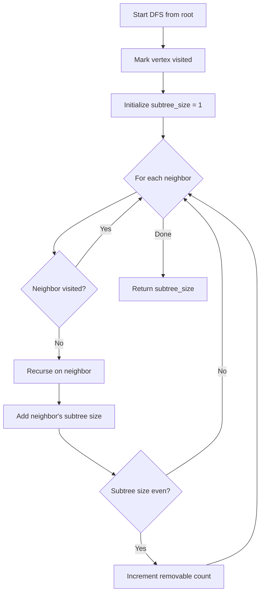
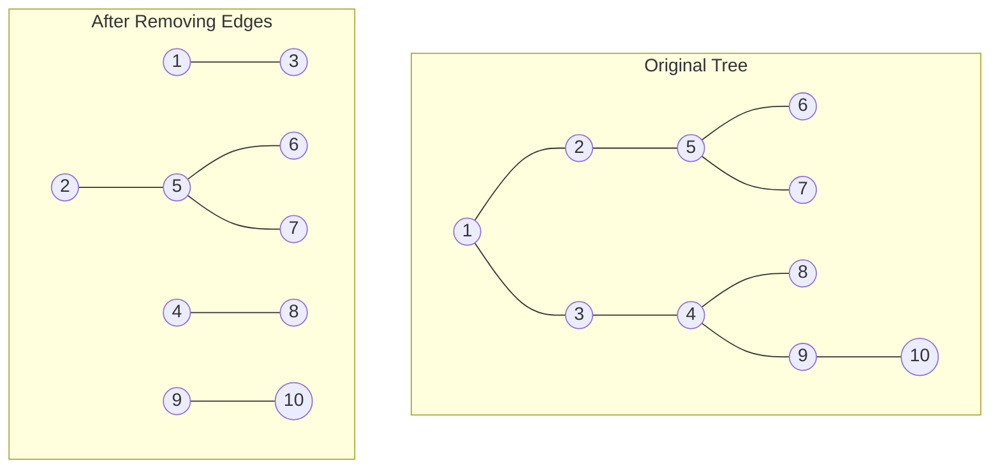

# Even Tree (Forest Partitioning)

## Overview

| Property | Value |
|----------|-------|
| **Category** | Tree Algorithms |
| **Complexity (Time)** | O(V + E) |
| **Complexity (Space)** | O(V) |
| **Graph Type** | Tree (Undirected, Acyclic) |
| **Best For** | Partitioning trees into even components |

## Description

The Even Tree algorithm finds the maximum number of edges that can be removed from a tree such that each remaining connected component has an even number of vertices. This problem arises when you need to partition resources or distribute workloads evenly.

The key insight is that an edge can be removed if and only if the subtree rooted at the child node (for that edge) has an even number of nodes, because removing such an edge leaves two even-sized components.

## Mathematical Foundation

### Problem Definition

Given a tree T = (V, E) with |V| vertices (where |V| is even), find the maximum number of edges to remove such that all resulting connected components have an even number of vertices.

### Subtree Size Property

For any edge (u, v) in the tree where v is a child of u in a rooted version:
$$\text{size}(v) = 1 + \sum_{c \in \text{children}(v)} \text{size}(c)$$

### Removable Edge Criterion

An edge (u, v) can be removed if and only if:
$$\text{size}(v) \mod 2 = 0$$

This is because:
- Removing edge (u, v) creates two components
- Component containing v has size(v) nodes
- Component containing u has (n - size(v)) nodes
- Both must be even, so size(v) must be even

### Maximum Removable Edges

If we have k subtrees with even size:
$$\text{max\_removable} = k$$

The remaining tree will have:
$$k + 1 \text{ connected components}$$

### Existence Condition

A valid partitioning exists only if the total number of vertices is even:
$$|V| \mod 2 = 0$$

## Algorithm

### Pseudocode

```
EVEN_TREE(tree, n):
    // Build adjacency list for undirected tree
    adj ← build_adjacency_list(tree)
    
    // Root the tree at vertex 1
    visited ← array of FALSE, size n+1
    subtree_size ← array of 0, size n+1
    removable_count ← 0
    
    DFS(1)
    
    return removable_count


DFS(vertex):
    visited[vertex] ← TRUE
    subtree_size[vertex] ← 1
    
    for each neighbor in adj[vertex]:
        if not visited[neighbor]:
            DFS(neighbor)
            
            // Add child's subtree size
            subtree_size[vertex] += subtree_size[neighbor]
            
            // Check if edge to child can be removed
            if subtree_size[neighbor] % 2 == 0:
                removable_count += 1
    
    return subtree_size[vertex]
```

### Step-by-Step Execution

```
Tree with 10 vertices:
  1 - 2
  1 - 3
  3 - 4
  2 - 5
  5 - 6
  5 - 7
  4 - 8
  4 - 9
  9 - 10

Rooted at 1:
        1
       / \
      2   3
      |   |
      5   4
     / \ / \
    6  7 8  9
            |
           10

DFS Traversal (post-order subtree sizes):
  Visit 6: size[6] = 1 (odd)
  Visit 7: size[7] = 1 (odd)
  Visit 5: size[5] = 1 + 1 + 1 = 3 (odd)
    Edge 5-6: size[6]=1 (odd) - cannot remove
    Edge 5-7: size[7]=1 (odd) - cannot remove
  
  Visit 2: size[2] = 1 + 3 = 4 (even)
    Edge 2-5: size[5]=3 (odd) - cannot remove
  
  Visit 8: size[8] = 1 (odd)
  Visit 10: size[10] = 1 (odd)
  Visit 9: size[9] = 1 + 1 = 2 (even)
    Edge 9-10: size[10]=1 (odd) - cannot remove
  
  Visit 4: size[4] = 1 + 1 + 2 = 4 (even)
    Edge 4-8: size[8]=1 (odd) - cannot remove
    Edge 4-9: size[9]=2 (even) - CAN REMOVE! ✓
  
  Visit 3: size[3] = 1 + 4 = 5 (odd)
    Edge 3-4: size[4]=4 (even) - CAN REMOVE! ✓
  
  Visit 1: size[1] = 1 + 4 + 5 = 10 (even)
    Edge 1-2: size[2]=4 (even) - CAN REMOVE! ✓
    Edge 1-3: size[3]=5 (odd) - cannot remove

Result: 3 edges can be removed
Removed edges: (4,9), (3,4), (1,2)

Resulting components:
  - {10, 9} - size 2
  - {4, 8} - size 2
  - {1, 3} - size 2
  - {2, 5, 6, 7} - size 4
```

## Complexity Analysis

### Time Complexity

| Case | Complexity | Explanation |
|------|------------|-------------|
| All | O(V + E) | Single DFS traversal |

Since E = V - 1 for trees: O(V)

### Space Complexity

| Component | Complexity |
|-----------|------------|
| Adjacency list | O(V) |
| Visited array | O(V) |
| Subtree sizes | O(V) |
| Recursion stack | O(V) worst case |
| Total | O(V) |

## Visual Representation



### Tree Partitioning Visualization



## Implementation

### Python Implementation

```python
from __future__ import annotations

from collections import defaultdict


def dfs(
    start: int,
    visited: set[int],
    adjacency_list: dict[int, list[int]],
    subtree_size: dict[int, int]
) -> int:
    """
    DFS to compute subtree sizes.
    
    Returns subtree size rooted at start.
    
    >>> adj = {1: [2], 2: [1]}
    >>> visited = set()
    >>> sizes = {}
    >>> dfs(1, visited, adj, sizes)
    2
    >>> sizes[2]
    1
    """
    visited.add(start)
    subtree_size[start] = 1
    
    for neighbor in adjacency_list[start]:
        if neighbor not in visited:
            subtree_size[start] += dfs(
                neighbor, visited, adjacency_list, subtree_size
            )
    
    return subtree_size[start]


def even_tree(n_vertices: int, edges: list[tuple[int, int]]) -> int:
    """
    Find maximum edges to remove for even-sized components.
    
    Args:
        n_vertices: Number of vertices (1-indexed)
        edges: List of edges as (u, v) tuples
        
    Returns:
        Maximum number of edges that can be removed
        
    >>> even_tree(10, [(2,1),(3,1),(4,3),(5,2),(6,5),(7,5),(8,4),(9,4),(10,9)])
    3
    >>> even_tree(4, [(2,1),(3,1),(4,3)])
    1
    >>> even_tree(2, [(2,1)])
    0
    """
    if n_vertices % 2 == 1:
        return 0  # Impossible with odd number of vertices
    
    # Build adjacency list
    adjacency_list: dict[int, list[int]] = defaultdict(list)
    for u, v in edges:
        adjacency_list[u].append(v)
        adjacency_list[v].append(u)
    
    # Compute subtree sizes via DFS from vertex 1
    visited: set[int] = set()
    subtree_size: dict[int, int] = {}
    dfs(1, visited, adjacency_list, subtree_size)
    
    # Count edges that can be removed (even subtree sizes)
    # Exclude root - its "subtree" is the whole tree
    count = 0
    for vertex in range(2, n_vertices + 1):
        if subtree_size.get(vertex, 0) % 2 == 0:
            count += 1
    
    return count


if __name__ == "__main__":
    import doctest
    doctest.testmod()
```

### Extended Implementation with Visualization

```python
from typing import Dict, List, Set, Tuple, Optional
from collections import defaultdict
from dataclasses import dataclass


@dataclass
class TreePartitionResult:
    """Result of even tree partitioning."""
    removable_edges: List[Tuple[int, int]]
    components: List[Set[int]]
    subtree_sizes: Dict[int, int]


class EvenTreeSolver:
    """
    Complete even tree implementation with partition visualization.
    """
    
    def __init__(self, n_vertices: int, edges: List[Tuple[int, int]]):
        """
        Initialize with tree structure.
        
        Args:
            n_vertices: Number of vertices (1-indexed)
            edges: List of edges as (u, v) tuples
        """
        self.n = n_vertices
        self.edges = edges
        self.adj: Dict[int, List[int]] = defaultdict(list)
        
        for u, v in edges:
            self.adj[u].append(v)
            self.adj[v].append(u)
        
        self.subtree_size: Dict[int, int] = {}
        self.parent: Dict[int, int] = {}
        self.removable: List[Tuple[int, int]] = []
    
    def solve(self) -> int:
        """
        Find maximum removable edges.
        
        Returns:
            Number of edges that can be removed
        """
        if self.n % 2 == 1:
            return 0
        
        self._dfs(1, -1)
        return len(self.removable)
    
    def _dfs(self, vertex: int, par: int) -> int:
        """DFS to compute subtree sizes and identify removable edges."""
        self.parent[vertex] = par
        self.subtree_size[vertex] = 1
        
        for neighbor in self.adj[vertex]:
            if neighbor != par:
                child_size = self._dfs(neighbor, vertex)
                self.subtree_size[vertex] += child_size
                
                # Can remove edge if child subtree has even size
                if child_size % 2 == 0:
                    self.removable.append((vertex, neighbor))
        
        return self.subtree_size[vertex]
    
    def get_partition_result(self) -> TreePartitionResult:
        """
        Get complete partition information.
        
        Returns:
            TreePartitionResult with edges and components
        """
        if not self.subtree_size:
            self.solve()
        
        # Find components after removing edges
        removed_set = set()
        for u, v in self.removable:
            removed_set.add((min(u, v), max(u, v)))
        
        # BFS to find components
        visited: Set[int] = set()
        components: List[Set[int]] = []
        
        for start in range(1, self.n + 1):
            if start not in visited:
                component: Set[int] = set()
                queue = [start]
                
                while queue:
                    v = queue.pop(0)
                    if v in visited:
                        continue
                    visited.add(v)
                    component.add(v)
                    
                    for neighbor in self.adj[v]:
                        edge = (min(v, neighbor), max(v, neighbor))
                        if edge not in removed_set and neighbor not in visited:
                            queue.append(neighbor)
                
                components.append(component)
        
        return TreePartitionResult(
            removable_edges=self.removable,
            components=components,
            subtree_sizes=self.subtree_size.copy()
        )
    
    def print_tree_structure(self) -> None:
        """Print tree structure with subtree sizes."""
        if not self.subtree_size:
            self.solve()
        
        print("Tree Structure (vertex: subtree_size):")
        
        def print_subtree(v: int, par: int, indent: str = "") -> None:
            marker = "(*)" if self.subtree_size[v] % 2 == 0 and v != 1 else ""
            print(f"{indent}{v}: {self.subtree_size[v]} {marker}")
            
            for neighbor in self.adj[v]:
                if neighbor != par:
                    print_subtree(neighbor, v, indent + "  ")
        
        print_subtree(1, -1)


def demo_even_tree():
    """Demonstrate even tree algorithm."""
    # Example from problem
    edges = [
        (2, 1), (3, 1), (4, 3), (5, 2),
        (6, 5), (7, 5), (8, 4), (9, 4), (10, 9)
    ]
    
    solver = EvenTreeSolver(10, edges)
    result = solver.solve()
    
    print(f"Maximum removable edges: {result}")
    solver.print_tree_structure()
    
    partition = solver.get_partition_result()
    print(f"\nRemovable edges: {partition.removable_edges}")
    print(f"Components after removal:")
    for i, comp in enumerate(partition.components):
        print(f"  Component {i+1}: {comp} (size: {len(comp)})")


if __name__ == "__main__":
    demo_even_tree()
```

## Real-World Applications

### 1. Load Balancing in Distributed Systems

```python
from typing import Dict, List, Set, Tuple, Optional
from collections import defaultdict
from dataclasses import dataclass


@dataclass
class Server:
    id: str
    capacity: int
    current_load: int = 0


class DistributedLoadBalancer:
    """
    Balance load across server clusters using even tree partitioning.
    
    Servers form a tree topology (common in hierarchical systems).
    Goal: Partition into balanced clusters.
    """
    
    def __init__(self):
        self.servers: Dict[str, Server] = {}
        self.connections: Dict[str, List[str]] = defaultdict(list)
    
    def add_server(self, server_id: str, capacity: int) -> None:
        """Add server to the network."""
        self.servers[server_id] = Server(server_id, capacity)
    
    def add_connection(self, server1: str, server2: str) -> None:
        """Add connection between servers."""
        self.connections[server1].append(server2)
        self.connections[server2].append(server1)
    
    def partition_for_load_balance(
        self, 
        target_cluster_size: int
    ) -> List[Set[str]]:
        """
        Partition servers into clusters of approximately equal size.
        
        Uses even tree algorithm to find valid cut points.
        
        Args:
            target_cluster_size: Desired cluster size (must be even)
            
        Returns:
            List of server clusters
        """
        if target_cluster_size % 2 != 0:
            target_cluster_size += 1  # Make even
        
        n = len(self.servers)
        server_list = list(self.servers.keys())
        server_to_idx = {s: i for i, s in enumerate(server_list)}
        
        # Build adjacency with indices
        adj: Dict[int, List[int]] = defaultdict(list)
        for s1, neighbors in self.connections.items():
            for s2 in neighbors:
                adj[server_to_idx[s1]].append(server_to_idx[s2])
        
        # Compute subtree sizes
        subtree_size: Dict[int, int] = {}
        parent: Dict[int, int] = {}
        
        def dfs(v: int, par: int) -> int:
            parent[v] = par
            subtree_size[v] = 1
            for neighbor in adj[v]:
                if neighbor != par:
                    subtree_size[v] += dfs(neighbor, v)
            return subtree_size[v]
        
        dfs(0, -1)
        
        # Find edges to cut based on target size
        cuts: Set[Tuple[int, int]] = set()
        
        for v in range(1, n):
            size = subtree_size[v]
            # Cut if subtree size is close to target and even
            if size % 2 == 0 and size >= target_cluster_size // 2:
                cuts.add((min(parent[v], v), max(parent[v], v)))
        
        # Build components
        visited: Set[int] = set()
        clusters: List[Set[str]] = []
        
        for start in range(n):
            if start not in visited:
                cluster: Set[str] = set()
                queue = [start]
                
                while queue:
                    v = queue.pop(0)
                    if v in visited:
                        continue
                    visited.add(v)
                    cluster.add(server_list[v])
                    
                    for neighbor in adj[v]:
                        edge = (min(v, neighbor), max(v, neighbor))
                        if edge not in cuts and neighbor not in visited:
                            queue.append(neighbor)
                
                clusters.append(cluster)
        
        return clusters
    
    def assign_workload(
        self, 
        clusters: List[Set[str]], 
        total_requests: int
    ) -> Dict[str, int]:
        """
        Assign workload to servers based on cluster partitioning.
        
        Returns:
            Dict mapping server_id to assigned requests
        """
        # Distribute equally among clusters
        requests_per_cluster = total_requests // len(clusters)
        assignments: Dict[str, int] = {}
        
        for cluster in clusters:
            # Within cluster, distribute by capacity
            total_capacity = sum(
                self.servers[s].capacity for s in cluster
            )
            
            for server_id in cluster:
                server = self.servers[server_id]
                share = (server.capacity / total_capacity) * requests_per_cluster
                assignments[server_id] = int(share)
        
        return assignments


def demo_load_balancing():
    """Demo distributed load balancing."""
    balancer = DistributedLoadBalancer()
    
    # Create server tree topology
    servers = [
        ("root", 100),
        ("app1", 80), ("app2", 80),
        ("db1", 60), ("db2", 60), ("cache1", 40), ("cache2", 40),
        ("replica1", 30), ("replica2", 30)
    ]
    
    for server_id, capacity in servers:
        balancer.add_server(server_id, capacity)
    
    connections = [
        ("root", "app1"), ("root", "app2"),
        ("app1", "db1"), ("app1", "cache1"),
        ("app2", "db2"), ("app2", "cache2"),
        ("db1", "replica1"), ("db2", "replica2")
    ]
    
    for s1, s2 in connections:
        balancer.add_connection(s1, s2)
    
    print("Server topology created")
    
    # Partition into clusters
    clusters = balancer.partition_for_load_balance(target_cluster_size=4)
    
    print(f"\nPartitioned into {len(clusters)} clusters:")
    for i, cluster in enumerate(clusters):
        print(f"  Cluster {i+1}: {cluster}")
    
    # Assign workload
    assignments = balancer.assign_workload(clusters, total_requests=1000)
    
    print("\nWorkload assignments:")
    for server_id, requests in sorted(assignments.items()):
        print(f"  {server_id}: {requests} requests")
```

### 2. Organization Restructuring

```python
from typing import Dict, List, Set, Tuple, Optional
from collections import defaultdict
from dataclasses import dataclass


@dataclass
class Employee:
    id: str
    name: str
    role: str
    team_preference: Optional[str] = None


class OrgRestructurer:
    """
    Restructure organization hierarchy into balanced teams.
    
    Uses even tree partitioning to create teams of similar size.
    """
    
    def __init__(self):
        self.employees: Dict[str, Employee] = {}
        self.reports_to: Dict[str, str] = {}  # employee → manager
    
    def add_employee(
        self, 
        emp_id: str, 
        name: str, 
        role: str, 
        manager_id: Optional[str] = None
    ) -> None:
        """Add employee to organization."""
        self.employees[emp_id] = Employee(emp_id, name, role)
        if manager_id:
            self.reports_to[emp_id] = manager_id
    
    def get_org_tree(self) -> Dict[str, List[str]]:
        """Build org tree as adjacency list."""
        tree: Dict[str, List[str]] = defaultdict(list)
        
        for emp_id, manager_id in self.reports_to.items():
            tree[manager_id].append(emp_id)
            if emp_id not in tree:
                tree[emp_id] = []
        
        return dict(tree)
    
    def partition_into_teams(
        self, 
        min_team_size: int = 2,
        max_team_size: int = 8
    ) -> List[Set[str]]:
        """
        Partition org into balanced teams.
        
        Args:
            min_team_size: Minimum team size
            max_team_size: Maximum team size
            
        Returns:
            List of team member sets
        """
        tree = self.get_org_tree()
        
        # Find root (employee with no manager)
        all_employees = set(self.employees.keys())
        with_managers = set(self.reports_to.keys())
        roots = all_employees - with_managers
        
        if not roots:
            return [all_employees]
        
        root = list(roots)[0]
        
        # Compute subtree sizes
        subtree_size: Dict[str, int] = {}
        
        def compute_sizes(emp_id: str) -> int:
            size = 1
            for report in tree.get(emp_id, []):
                size += compute_sizes(report)
            subtree_size[emp_id] = size
            return size
        
        compute_sizes(root)
        
        # Find cut points based on team size constraints
        cuts: Set[Tuple[str, str]] = set()
        
        def find_cuts(emp_id: str, parent: Optional[str]) -> None:
            size = subtree_size[emp_id]
            
            # Cut if size is within team range and even
            if (parent and 
                min_team_size <= size <= max_team_size and 
                size % 2 == 0):
                cuts.add((parent, emp_id))
            
            for report in tree.get(emp_id, []):
                find_cuts(report, emp_id)
        
        find_cuts(root, None)
        
        # Build teams from components
        visited: Set[str] = set()
        teams: List[Set[str]] = []
        
        def build_team(start: str) -> Set[str]:
            team: Set[str] = set()
            queue = [start]
            
            while queue:
                emp = queue.pop(0)
                if emp in visited:
                    continue
                visited.add(emp)
                team.add(emp)
                
                # Add manager if not cut
                if emp in self.reports_to:
                    manager = self.reports_to[emp]
                    edge = (manager, emp)
                    if edge not in cuts and manager not in visited:
                        queue.append(manager)
                
                # Add reports if not cut
                for report in tree.get(emp, []):
                    edge = (emp, report)
                    if edge not in cuts and report not in visited:
                        queue.append(report)
            
            return team
        
        for emp_id in self.employees:
            if emp_id not in visited:
                team = build_team(emp_id)
                if team:
                    teams.append(team)
        
        return teams
    
    def print_teams(self, teams: List[Set[str]]) -> None:
        """Print team compositions."""
        for i, team in enumerate(teams):
            print(f"\nTeam {i+1} ({len(team)} members):")
            for emp_id in team:
                emp = self.employees[emp_id]
                print(f"  - {emp.name} ({emp.role})")


def demo_org_restructuring():
    """Demo organization restructuring."""
    org = OrgRestructurer()
    
    # Create org hierarchy
    org.add_employee("ceo", "Alice", "CEO")
    org.add_employee("vp1", "Bob", "VP Engineering", "ceo")
    org.add_employee("vp2", "Carol", "VP Product", "ceo")
    org.add_employee("mgr1", "Dave", "Engineering Manager", "vp1")
    org.add_employee("mgr2", "Eve", "Engineering Manager", "vp1")
    org.add_employee("pm1", "Frank", "Product Manager", "vp2")
    org.add_employee("pm2", "Grace", "Product Manager", "vp2")
    org.add_employee("eng1", "Henry", "Engineer", "mgr1")
    org.add_employee("eng2", "Ivy", "Engineer", "mgr1")
    org.add_employee("eng3", "Jack", "Engineer", "mgr2")
    org.add_employee("eng4", "Kate", "Engineer", "mgr2")
    
    print("Original organization structure")
    
    # Partition into teams
    teams = org.partition_into_teams(min_team_size=2, max_team_size=6)
    
    print(f"\nRestructured into {len(teams)} teams:")
    org.print_teams(teams)


if __name__ == "__main__":
    demo_org_restructuring()
```

### 3. Network Segmentation

```python
from typing import Dict, List, Set, Tuple, Optional
from collections import defaultdict
from dataclasses import dataclass


@dataclass
class NetworkNode:
    id: str
    node_type: str  # 'router', 'switch', 'server', 'endpoint'
    security_level: int


class NetworkSegmenter:
    """
    Segment network into balanced security zones.
    
    Uses even tree partitioning for logical network segmentation.
    """
    
    def __init__(self):
        self.nodes: Dict[str, NetworkNode] = {}
        self.links: Dict[str, List[str]] = defaultdict(list)
    
    def add_node(
        self, 
        node_id: str, 
        node_type: str, 
        security_level: int = 1
    ) -> None:
        """Add network node."""
        self.nodes[node_id] = NetworkNode(node_id, node_type, security_level)
    
    def add_link(self, node1: str, node2: str) -> None:
        """Add network link."""
        self.links[node1].append(node2)
        self.links[node2].append(node1)
    
    def segment_network(
        self, 
        target_segment_size: int = 4
    ) -> Dict[str, List[str]]:
        """
        Segment network into balanced zones.
        
        Args:
            target_segment_size: Target number of nodes per segment
            
        Returns:
            Dict mapping segment name to list of node IDs
        """
        n = len(self.nodes)
        node_list = list(self.nodes.keys())
        node_to_idx = {n: i for i, n in enumerate(node_list)}
        
        # Build adjacency with indices
        adj: Dict[int, List[int]] = defaultdict(list)
        for n1, neighbors in self.links.items():
            for n2 in neighbors:
                adj[node_to_idx[n1]].append(node_to_idx[n2])
        
        # Compute subtree sizes from first node
        subtree_size: Dict[int, int] = {}
        parent: Dict[int, int] = {}
        
        def dfs(v: int, par: int) -> int:
            parent[v] = par
            subtree_size[v] = 1
            for neighbor in adj[v]:
                if neighbor != par:
                    subtree_size[v] += dfs(neighbor, v)
            return subtree_size[v]
        
        if n > 0:
            dfs(0, -1)
        
        # Find cut points
        cuts: Set[Tuple[int, int]] = set()
        
        for v in range(1, n):
            size = subtree_size[v]
            if size % 2 == 0 and size >= target_segment_size // 2:
                cuts.add((min(parent[v], v), max(parent[v], v)))
        
        # Build segments
        visited: Set[int] = set()
        segments: Dict[str, List[str]] = {}
        segment_num = 1
        
        for start in range(n):
            if start not in visited:
                segment: List[str] = []
                queue = [start]
                
                while queue:
                    v = queue.pop(0)
                    if v in visited:
                        continue
                    visited.add(v)
                    segment.append(node_list[v])
                    
                    for neighbor in adj[v]:
                        edge = (min(v, neighbor), max(v, neighbor))
                        if edge not in cuts and neighbor not in visited:
                            queue.append(neighbor)
                
                segments[f"Segment_{segment_num}"] = segment
                segment_num += 1
        
        return segments
    
    def generate_firewall_rules(
        self, 
        segments: Dict[str, List[str]]
    ) -> List[str]:
        """
        Generate firewall rules for segment boundaries.
        
        Returns:
            List of firewall rule descriptions
        """
        rules = []
        
        # Find cross-segment links
        node_to_segment: Dict[str, str] = {}
        for seg_name, nodes in segments.items():
            for node in nodes:
                node_to_segment[node] = seg_name
        
        for node1, neighbors in self.links.items():
            for node2 in neighbors:
                seg1 = node_to_segment.get(node1)
                seg2 = node_to_segment.get(node2)
                
                if seg1 and seg2 and seg1 != seg2:
                    rule = f"ALLOW {seg1} <-> {seg2} via {node1}-{node2}"
                    if rule not in rules:
                        rules.append(rule)
        
        return rules


def demo_network_segmentation():
    """Demo network segmentation."""
    network = NetworkSegmenter()
    
    # Create network topology (tree-like)
    nodes = [
        ("core_router", "router", 5),
        ("switch_1", "switch", 3),
        ("switch_2", "switch", 3),
        ("server_1", "server", 4),
        ("server_2", "server", 4),
        ("endpoint_1", "endpoint", 1),
        ("endpoint_2", "endpoint", 1),
        ("endpoint_3", "endpoint", 1),
        ("endpoint_4", "endpoint", 1),
    ]
    
    for node_id, node_type, sec_level in nodes:
        network.add_node(node_id, node_type, sec_level)
    
    links = [
        ("core_router", "switch_1"),
        ("core_router", "switch_2"),
        ("switch_1", "server_1"),
        ("switch_1", "endpoint_1"),
        ("switch_1", "endpoint_2"),
        ("switch_2", "server_2"),
        ("switch_2", "endpoint_3"),
        ("switch_2", "endpoint_4"),
    ]
    
    for n1, n2 in links:
        network.add_link(n1, n2)
    
    print("Network topology created")
    
    # Segment network
    segments = network.segment_network(target_segment_size=4)
    
    print(f"\nNetwork segmented into {len(segments)} zones:")
    for seg_name, nodes in segments.items():
        print(f"  {seg_name}: {nodes}")
    
    # Generate firewall rules
    rules = network.generate_firewall_rules(segments)
    
    print("\nFirewall rules for segment boundaries:")
    for rule in rules:
        print(f"  {rule}")


if __name__ == "__main__":
    demo_network_segmentation()
```

## References

1. [HackerRank - Even Tree Problem](https://www.hackerrank.com/challenges/even-tree)
2. Cormen et al. "Introduction to Algorithms" - Tree algorithms
3. [Tree (data structure) - Wikipedia](https://en.wikipedia.org/wiki/Tree_(data_structure))

## See Also

- [Depth-First Search](depth_first_search.md) - Traversal foundation
- [Connected Components](connected_components.md) - Component finding
- [Bridges](bridges.md) - Critical edge identification
