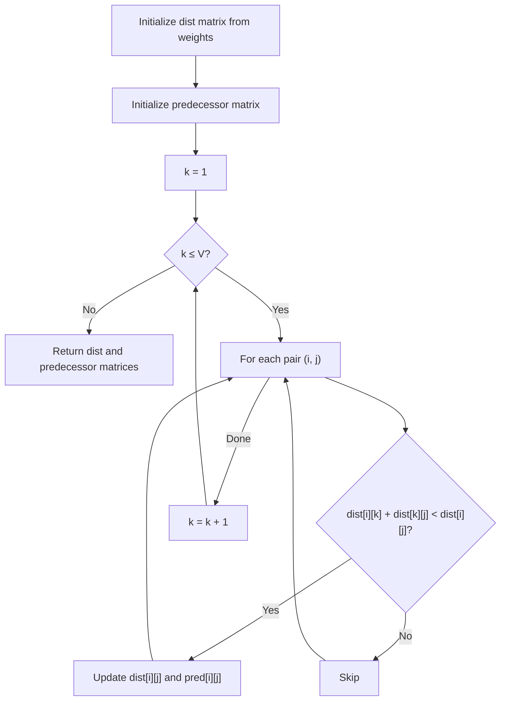
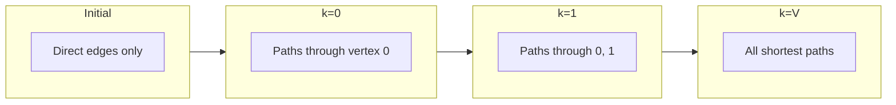

# Floyd-Warshall Algorithm

## Overview

| Property | Value |
|----------|-------|
| **Category** | All-Pairs Shortest Path |
| **Complexity (Time)** | O(V³) |
| **Complexity (Space)** | O(V²) |
| **Graph Type** | Weighted, directed or undirected |
| **Best For** | Dense graphs, all-pairs queries |

## Description

The Floyd-Warshall algorithm computes shortest paths between all pairs of vertices in a weighted graph. Named after Robert Floyd and Stephen Warshall, this dynamic programming algorithm works by systematically considering each vertex as an intermediate point in paths between all other vertex pairs.

Unlike single-source algorithms (Dijkstra, Bellman-Ford), Floyd-Warshall efficiently computes the entire distance matrix in one pass, making it ideal when you need shortest paths between all pairs.

## Mathematical Foundation

### Dynamic Programming Formulation

Let $d^{(k)}[i][j]$ be the shortest path from $i$ to $j$ using only vertices $\{1, 2, \ldots, k\}$ as intermediates.

**Base case:** 
$$d^{(0)}[i][j] = w(i, j)$$

**Recurrence:**
$$d^{(k)}[i][j] = \min(d^{(k-1)}[i][j], d^{(k-1)}[i][k] + d^{(k-1)}[k][j])$$

### Final Solution

After considering all $V$ vertices as intermediates:

$$\delta(i, j) = d^{(V)}[i][j]$$

Where $\delta(i, j)$ is the shortest path distance from $i$ to $j$.

### Optimal Substructure

If vertex $k$ is on the shortest path from $i$ to $j$:

$$\delta(i, j) = \delta(i, k) + \delta(k, j)$$

Otherwise:
$$\delta(i, j) = d^{(k-1)}[i][j]$$

### Negative Cycle Detection

A negative cycle exists if for any vertex $i$:

$$d[i][i] < 0$$

After the algorithm completes, negative diagonal values indicate a reachable negative cycle.

### Path Reconstruction

Maintain a predecessor matrix $\pi$ where $\pi[i][j]$ stores the predecessor of $j$ on the shortest path from $i$ to $j$.

## Algorithm

### Pseudocode

```
FLOYD-WARSHALL(W, n):
    // Initialize distance matrix
    dist ← copy of weight matrix W
    next ← predecessor matrix
    
    // Initialize: direct edges
    for i from 1 to n:
        for j from 1 to n:
            if dist[i][j] ≠ ∞ and i ≠ j:
                next[i][j] ← j
    
    // Consider each vertex as intermediate
    for k from 1 to n:
        for i from 1 to n:
            for j from 1 to n:
                if dist[i][k] + dist[k][j] < dist[i][j]:
                    dist[i][j] ← dist[i][k] + dist[k][j]
                    next[i][j] ← next[i][k]
    
    return dist, next
```

### Path Reconstruction

```
RECONSTRUCT-PATH(next, i, j):
    if next[i][j] = NULL:
        return []  // No path
    
    path ← [i]
    while i ≠ j:
        i ← next[i][j]
        path.append(i)
    
    return path
```

### Step-by-Step Execution

```
Initial weight matrix:
        0   1   2   3
    ┌───────────────────
  0 │   0   3   ∞   7
  1 │   8   0   2   ∞
  2 │   5   ∞   0   1
  3 │   2   ∞   ∞   0

k=0 (vertex 0 as intermediate):
Check all pairs i,j: if dist[i][0] + dist[0][j] < dist[i][j]
  dist[1][3] = min(∞, 8+7) = 15
  dist[2][1] = min(∞, 5+3) = 8
  dist[2][3] = min(1, 5+7) = 1
  dist[3][1] = min(∞, 2+3) = 5

After k=0:
        0   1   2   3
    ┌───────────────────
  0 │   0   3   ∞   7
  1 │   8   0   2   15
  2 │   5   8   0   1
  3 │   2   5   ∞   0

k=1 (vertex 1 as intermediate):
  dist[0][2] = min(∞, 3+2) = 5
  dist[3][2] = min(∞, 5+2) = 7

After k=1:
        0   1   2   3
    ┌───────────────────
  0 │   0   3   5   7
  1 │   8   0   2   15
  2 │   5   8   0   1
  3 │   2   5   7   0

k=2 (vertex 2 as intermediate):
  dist[0][3] = min(7, 5+1) = 6
  dist[1][3] = min(15, 2+1) = 3

After k=2:
        0   1   2   3
    ┌───────────────────
  0 │   0   3   5   6
  1 │   8   0   2   3
  2 │   5   8   0   1
  3 │   2   5   7   0

k=3 (vertex 3 as intermediate):
  No improvements found

Final distance matrix:
        0   1   2   3
    ┌───────────────────
  0 │   0   3   5   6
  1 │   8   0   2   3
  2 │   5   8   0   1
  3 │   2   5   7   0
```

## Complexity Analysis

### Time Complexity

| Operation | Complexity |
|-----------|------------|
| Initialization | O(V²) |
| Triple nested loop | O(V³) |
| **Total** | **O(V³)** |

Exactly $V^3$ comparisons and updates.

### Space Complexity

| Component | Space |
|-----------|-------|
| Distance matrix | O(V²) |
| Predecessor matrix | O(V²) |
| **Total** | **O(V²)** |

Can be done in-place without extra matrices per iteration.

## Visual Representation



### Distance Matrix Evolution



## Implementation

### Python Implementation

```python
from __future__ import annotations


def floyd_warshall(
    graph: list[list[float]], 
    v: int
) -> list[list[float]]:
    """
    Floyd-Warshall algorithm for all-pairs shortest paths.
    
    Args:
        graph: Adjacency matrix (use float('inf') for no edge)
        v: Number of vertices
    
    Returns:
        Distance matrix with shortest path distances
    
    Examples:
        >>> INF = float('inf')
        >>> graph = [
        ...     [0, 3, INF, 7],
        ...     [8, 0, 2, INF],
        ...     [5, INF, 0, 1],
        ...     [2, INF, INF, 0]
        ... ]
        >>> dist = floyd_warshall(graph, 4)
        >>> dist[0][3]
        6
        >>> dist[1][3]
        3
    """
    # Initialize distance matrix
    dist = [row[:] for row in graph]  # Deep copy
    
    # Consider each vertex as intermediate
    for k in range(v):
        for i in range(v):
            for j in range(v):
                if dist[i][k] + dist[k][j] < dist[i][j]:
                    dist[i][j] = dist[i][k] + dist[k][j]
    
    return dist
```

### Full Implementation with Path Reconstruction

```python
from typing import Optional


def floyd_warshall_full(
    graph: list[list[float]]
) -> tuple[list[list[float]], list[list[Optional[int]]]]:
    """
    Floyd-Warshall with path reconstruction.
    
    Returns:
        (distance_matrix, predecessor_matrix)
    
    Examples:
        >>> INF = float('inf')
        >>> graph = [
        ...     [0, 3, INF, 7],
        ...     [8, 0, 2, INF],
        ...     [5, INF, 0, 1],
        ...     [2, INF, INF, 0]
        ... ]
        >>> dist, pred = floyd_warshall_full(graph)
        >>> dist[0][3]
        6
    """
    n = len(graph)
    INF = float('inf')
    
    # Initialize distance and predecessor matrices
    dist = [row[:] for row in graph]
    pred: list[list[Optional[int]]] = [[None] * n for _ in range(n)]
    
    # Initialize predecessors for direct edges
    for i in range(n):
        for j in range(n):
            if i != j and graph[i][j] != INF:
                pred[i][j] = i
    
    # Main algorithm
    for k in range(n):
        for i in range(n):
            for j in range(n):
                if dist[i][k] != INF and dist[k][j] != INF:
                    if dist[i][k] + dist[k][j] < dist[i][j]:
                        dist[i][j] = dist[i][k] + dist[k][j]
                        pred[i][j] = pred[k][j]
    
    return dist, pred


def reconstruct_path(
    pred: list[list[Optional[int]]],
    start: int,
    end: int
) -> list[int]:
    """
    Reconstruct shortest path from predecessor matrix.
    
    Examples:
        >>> pred = [[None, 0, 1, 2], [3, None, 1, 2], 
        ...         [3, 0, None, 2], [3, 0, 1, None]]
        >>> reconstruct_path(pred, 0, 3)
        [0, 1, 2, 3]
    """
    if pred[start][end] is None:
        return []  # No path
    
    path = [end]
    while end != start:
        end = pred[start][end]
        if end is None:
            return []
        path.append(end)
    
    return path[::-1]
```

### Negative Cycle Detection

```python
def floyd_warshall_with_cycle_detection(
    graph: list[list[float]]
) -> tuple[list[list[float]], bool, list[int]]:
    """
    Floyd-Warshall with negative cycle detection.
    
    Returns:
        (distances, has_negative_cycle, cycle_vertices)
    
    Examples:
        >>> INF = float('inf')
        >>> # Graph with negative cycle
        >>> graph = [
        ...     [0, 1, INF],
        ...     [INF, 0, -3],
        ...     [2, INF, 0]
        ... ]
        >>> dist, has_cycle, _ = floyd_warshall_with_cycle_detection(graph)
        >>> has_cycle
        True
    """
    n = len(graph)
    INF = float('inf')
    
    dist = [row[:] for row in graph]
    pred: list[list[Optional[int]]] = [[None] * n for _ in range(n)]
    
    for i in range(n):
        for j in range(n):
            if i != j and graph[i][j] != INF:
                pred[i][j] = i
    
    # Standard Floyd-Warshall
    for k in range(n):
        for i in range(n):
            for j in range(n):
                if dist[i][k] != INF and dist[k][j] != INF:
                    if dist[i][k] + dist[k][j] < dist[i][j]:
                        dist[i][j] = dist[i][k] + dist[k][j]
                        pred[i][j] = pred[k][j]
    
    # Check for negative cycles
    negative_cycle_vertices = []
    for i in range(n):
        if dist[i][i] < 0:
            negative_cycle_vertices.append(i)
    
    has_negative_cycle = len(negative_cycle_vertices) > 0
    
    return dist, has_negative_cycle, negative_cycle_vertices
```

### Transitive Closure (Warshall's Algorithm)

```python
def transitive_closure(graph: list[list[bool]]) -> list[list[bool]]:
    """
    Compute transitive closure using Warshall's algorithm.
    
    Args:
        graph: Adjacency matrix (True if edge exists)
    
    Returns:
        Reachability matrix
    
    Examples:
        >>> graph = [
        ...     [False, True, False],
        ...     [False, False, True],
        ...     [False, False, False]
        ... ]
        >>> closure = transitive_closure(graph)
        >>> closure[0][2]  # 0 can reach 2 via 1
        True
    """
    n = len(graph)
    reach = [row[:] for row in graph]
    
    # Self-loops
    for i in range(n):
        reach[i][i] = True
    
    for k in range(n):
        for i in range(n):
            for j in range(n):
                reach[i][j] = reach[i][j] or (reach[i][k] and reach[k][j])
    
    return reach
```

## Real-World Applications

### 1. Network Routing Tables

```python
class NetworkRouter:
    """
    Build routing tables for all nodes using Floyd-Warshall.
    """
    
    def __init__(self):
        self.nodes: list[str] = []
        self.links: dict[tuple[str, str], int] = {}
    
    def add_node(self, node: str) -> None:
        """Add network node."""
        if node not in self.nodes:
            self.nodes.append(node)
    
    def add_link(
        self, 
        node1: str, 
        node2: str, 
        latency: int,
        bidirectional: bool = True
    ) -> None:
        """Add network link with latency."""
        self.add_node(node1)
        self.add_node(node2)
        self.links[(node1, node2)] = latency
        if bidirectional:
            self.links[(node2, node1)] = latency
    
    def compute_routing_tables(
        self
    ) -> dict[str, dict[str, tuple[str, int]]]:
        """
        Compute routing table for each node.
        
        Returns:
            {node: {destination: (next_hop, total_latency)}}
        
        Examples:
            >>> router = NetworkRouter()
            >>> router.add_link("A", "B", 10)
            >>> router.add_link("B", "C", 15)
            >>> router.add_link("A", "C", 30)
            >>> tables = router.compute_routing_tables()
            >>> tables["A"]["C"]
            ('B', 25)
        """
        n = len(self.nodes)
        idx = {node: i for i, node in enumerate(self.nodes)}
        INF = float('inf')
        
        # Build adjacency matrix
        dist = [[INF] * n for _ in range(n)]
        next_hop: list[list[Optional[str]]] = [[None] * n for _ in range(n)]
        
        for i in range(n):
            dist[i][i] = 0
        
        for (src, dst), latency in self.links.items():
            i, j = idx[src], idx[dst]
            dist[i][j] = latency
            next_hop[i][j] = dst
        
        # Floyd-Warshall
        for k in range(n):
            for i in range(n):
                for j in range(n):
                    if dist[i][k] + dist[k][j] < dist[i][j]:
                        dist[i][j] = dist[i][k] + dist[k][j]
                        next_hop[i][j] = next_hop[i][k]
        
        # Build routing tables
        routing_tables = {}
        for node in self.nodes:
            i = idx[node]
            table = {}
            for dest in self.nodes:
                j = idx[dest]
                if next_hop[i][j] is not None:
                    table[dest] = (next_hop[i][j], dist[i][j])
            routing_tables[node] = table
        
        return routing_tables
```

### 2. Social Network Analysis

```python
class SocialNetworkAnalyzer:
    """
    Analyze social network connectivity using Floyd-Warshall.
    """
    
    def __init__(self):
        self.users: list[str] = []
        self.connections: set[tuple[str, str]] = set()
    
    def add_user(self, user: str) -> None:
        if user not in self.users:
            self.users.append(user)
    
    def add_connection(self, user1: str, user2: str) -> None:
        """Add friendship connection."""
        self.add_user(user1)
        self.add_user(user2)
        self.connections.add((user1, user2))
        self.connections.add((user2, user1))
    
    def compute_degrees_of_separation(self) -> dict[tuple[str, str], int]:
        """
        Compute degrees of separation between all user pairs.
        
        Examples:
            >>> analyzer = SocialNetworkAnalyzer()
            >>> analyzer.add_connection("Alice", "Bob")
            >>> analyzer.add_connection("Bob", "Charlie")
            >>> degrees = analyzer.compute_degrees_of_separation()
            >>> degrees[("Alice", "Charlie")]
            2
        """
        n = len(self.users)
        idx = {user: i for i, user in enumerate(self.users)}
        INF = float('inf')
        
        dist = [[INF] * n for _ in range(n)]
        
        for i in range(n):
            dist[i][i] = 0
        
        for (u1, u2) in self.connections:
            dist[idx[u1]][idx[u2]] = 1
        
        # Floyd-Warshall
        for k in range(n):
            for i in range(n):
                for j in range(n):
                    if dist[i][k] + dist[k][j] < dist[i][j]:
                        dist[i][j] = dist[i][k] + dist[k][j]
        
        result = {}
        for u1 in self.users:
            for u2 in self.users:
                i, j = idx[u1], idx[u2]
                if dist[i][j] != INF:
                    result[(u1, u2)] = int(dist[i][j])
        
        return result
    
    def find_most_central_user(self) -> str:
        """
        Find user with minimum average distance to all others.
        """
        degrees = self.compute_degrees_of_separation()
        
        avg_distance = {}
        n = len(self.users)
        
        for user in self.users:
            total = sum(
                degrees.get((user, other), float('inf'))
                for other in self.users
                if other != user
            )
            avg_distance[user] = total / (n - 1)
        
        return min(avg_distance, key=avg_distance.get)
```

### 3. Graph Diameter and Eccentricity

```python
def graph_metrics(graph: list[list[float]]) -> dict:
    """
    Compute graph metrics using all-pairs shortest paths.
    
    Returns:
        - diameter: longest shortest path
        - radius: minimum eccentricity
        - center: vertices with minimum eccentricity
        - eccentricity: max distance from each vertex
    
    Examples:
        >>> INF = float('inf')
        >>> graph = [
        ...     [0, 1, INF, INF],
        ...     [1, 0, 1, INF],
        ...     [INF, 1, 0, 1],
        ...     [INF, INF, 1, 0]
        ... ]
        >>> metrics = graph_metrics(graph)
        >>> metrics['diameter']
        3
    """
    n = len(graph)
    INF = float('inf')
    
    # Run Floyd-Warshall
    dist = [row[:] for row in graph]
    for k in range(n):
        for i in range(n):
            for j in range(n):
                if dist[i][k] + dist[k][j] < dist[i][j]:
                    dist[i][j] = dist[i][k] + dist[k][j]
    
    # Compute eccentricity for each vertex
    eccentricity = []
    for i in range(n):
        max_dist = max(d for d in dist[i] if d != INF)
        eccentricity.append(max_dist)
    
    diameter = max(eccentricity)
    radius = min(eccentricity)
    center = [i for i in range(n) if eccentricity[i] == radius]
    
    return {
        'diameter': diameter,
        'radius': radius,
        'center': center,
        'eccentricity': eccentricity,
        'distance_matrix': dist
    }
```

## Optimizations

| Optimization | Description | When to Use |
|--------------|-------------|-------------|
| **Early termination** | Stop if dist[i][j] + dist[j][k] can't improve | Sparse graphs |
| **Blocked algorithm** | Process in cache-friendly blocks | Large matrices |
| **Parallel version** | Parallelize inner loops | Multi-core systems |
| **Path compression** | Skip known shortest paths | Repeated queries |

## Comparison with Other Algorithms

| Algorithm | Time | Space | Use Case |
|-----------|------|-------|----------|
| Floyd-Warshall | O(V³) | O(V²) | All-pairs, dense |
| V × Dijkstra | O(V(V+E) log V) | O(V) | All-pairs, sparse |
| V × Bellman-Ford | O(V²E) | O(V) | Negative weights |
| Johnson's | O(VE + V² log V) | O(V²) | Sparse, negative |

**When to use Floyd-Warshall:**
- Dense graphs (E ≈ V²)
- Need all-pairs distances
- Negative weights (no negative cycles)
- Simple implementation needed

## References

1. Floyd, R. "Algorithm 97: Shortest Path" (1962)
2. Warshall, S. "A Theorem on Boolean Matrices" (1962)
3. [Floyd-Warshall Algorithm - Wikipedia](https://en.wikipedia.org/wiki/Floyd%E2%80%93Warshall_algorithm)
4. Cormen, T.H. "Introduction to Algorithms" - Chapter 25

## See Also

- [Dijkstra's Algorithm](dijkstra.md) - Single-source shortest path
- [Bellman-Ford Algorithm](bellman_ford.md) - Handles negative weights
- [Johnson's Algorithm](johnsons_algorithm.md) - Sparse all-pairs
- [Transitive Closure](transitive_closure.md) - Reachability analysis
