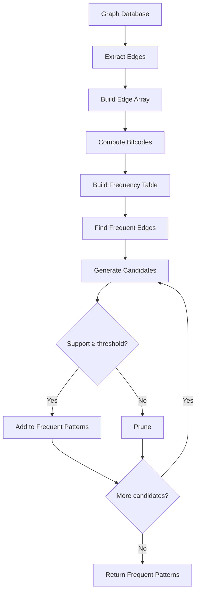
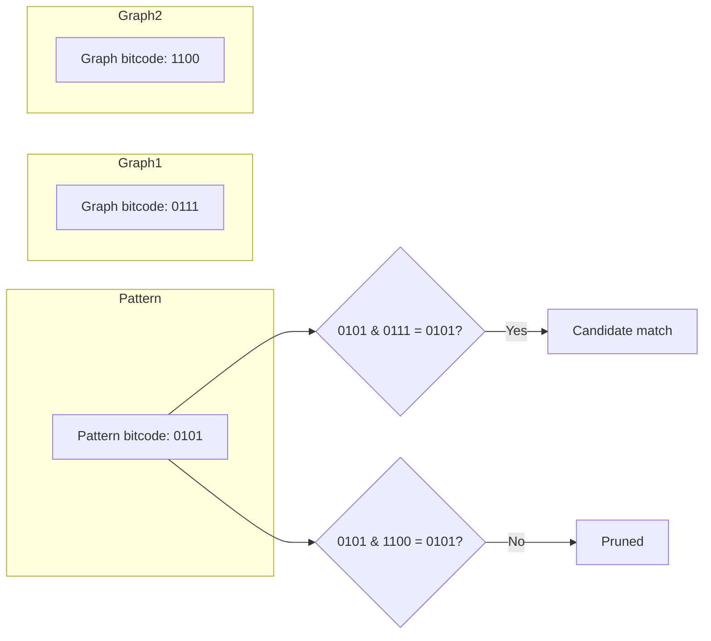

# Frequent Pattern Graph Miner (FP-GraphMiner)

## Overview

| Property | Value |
|----------|-------|
| **Category** | Graph Mining |
| **Problem** | Frequent Subgraph Discovery |
| **Complexity (Time)** | O(n × k × |S|) per iteration |
| **Complexity (Space)** | O(|E| + |V| + |S|) |
| **Best For** | Pattern mining in graph databases |

## Description

FP-GraphMiner is an algorithm for mining frequent subgraph patterns from a collection of graphs. It uses edge array representation, bitmap encoding, and clustering techniques to efficiently identify subgraphs that appear in at least a minimum number of graphs (support threshold).

This technique is fundamental in cheminformatics (molecular structure analysis), social network analysis, bioinformatics (protein interaction networks), and software engineering (code pattern detection).

## Mathematical Foundation

### Frequency and Support

Given a graph database $\mathcal{D} = \{G_1, G_2, \ldots, G_n\}$ and a subgraph pattern $P$:

**Support:**
$$\text{support}(P) = \frac{|\{G_i \in \mathcal{D} : P \subseteq G_i\}|}{|\mathcal{D}|}$$

**Frequency:**
$$\text{freq}(P) = |\{G_i \in \mathcal{D} : P \subseteq G_i\}|$$

A pattern $P$ is **frequent** if:
$$\text{support}(P) \geq \min\_support$$

### Edge Array Representation

An edge is represented as a tuple:
$$e = (v_1, v_2, L_{v_1}, L_{v_2}, L_e)$$

Where:
- $v_1, v_2$: vertex identifiers
- $L_{v_1}, L_{v_2}$: vertex labels
- $L_e$: edge label

### Bitcode Encoding

Each unique edge type gets a bitcode position:
$$\text{bitcode}(e) = 2^{\text{index}(e)}$$

A graph's bitcode is the OR of all edge bitcodes:
$$\text{bitcode}(G) = \bigvee_{e \in E(G)} \text{bitcode}(e)$$

### Subgraph Isomorphism Test

Pattern $P$ is subgraph isomorphic to $G$ ($P \subseteq G$) if:
$$\text{bitcode}(P) \land \text{bitcode}(G) = \text{bitcode}(P)$$

This provides a quick filter before expensive subgraph matching.

### Anti-Monotonicity Property

If pattern $P$ is infrequent, all superpatterns $P'$ where $P \subset P'$ are also infrequent:
$$\text{freq}(P) < \theta \implies \forall P' \supset P: \text{freq}(P') < \theta$$

This enables pruning the search space.

## Algorithm

### Pseudocode

```
FP-GRAPHMINER(database, min_support):
    // Step 1: Build edge array and frequency table
    edge_array ← GET-DISTINCT-EDGES(database)
    freq_table ← GET-FREQUENCY-TABLE(database, edge_array)
    
    // Step 2: Generate bitcodes for graphs
    for each graph G in database:
        bitcode[G] ← compute bitcode using edge_array
    
    // Step 3: Build clusters of graphs with same edges
    clusters ← GET-CLUSTERS(database, edge_array)
    
    // Step 4: Find frequent patterns
    frequent_patterns ← {}
    
    // Start with frequent single edges
    for each edge e in edge_array:
        if freq_table[e] ≥ min_support:
            frequent_patterns.add({e})
    
    // Iteratively grow patterns
    k ← 1
    while frequent_patterns of size k exist:
        candidates ← GENERATE-CANDIDATES(frequent_patterns, k)
        
        for each candidate C:
            support ← COUNT-SUPPORT(C, database, clusters)
            if support ≥ min_support:
                frequent_patterns.add(C)
        
        k ← k + 1
    
    return frequent_patterns

GET-DISTINCT-EDGES(database):
    edges ← {}
    for each graph G in database:
        for each edge e in G:
            canonical_e ← CANONICALIZE(e)
            edges.add(canonical_e)
    return sorted(edges)

GET-BITCODE(graph, edge_array):
    bitcode ← 0
    for i = 0 to |edge_array| - 1:
        if edge_array[i] in graph:
            bitcode ← bitcode OR (1 << i)
    return bitcode

GET-FREQUENCY-TABLE(database, edge_array):
    freq ← array of zeros
    for each graph G in database:
        for i = 0 to |edge_array| - 1:
            if edge_array[i] in G:
                freq[i] ← freq[i] + 1
    return freq

GET-CLUSTERS(database, edge_array):
    clusters ← map from edge_index to list of graphs
    for each graph G in database:
        for i = 0 to |edge_array| - 1:
            if edge_array[i] in G:
                clusters[i].append(G)
    return clusters
```

### Candidate Generation

```
GENERATE-CANDIDATES(frequent_patterns, k):
    candidates ← {}
    patterns_of_size_k ← {P ∈ frequent_patterns : |P| = k}
    
    for each pair (P1, P2) in patterns_of_size_k:
        if |P1 ∩ P2| = k - 1:
            C ← P1 ∪ P2
            
            // Pruning: all subsets must be frequent
            if all_subsets_frequent(C, frequent_patterns):
                candidates.add(C)
    
    return candidates
```

## Complexity Analysis

### Time Complexity

| Phase | Complexity |
|-------|------------|
| Edge array construction | O(n × |E|) |
| Bitcode computation | O(n × |E|) |
| Frequency table | O(n × |E|) |
| Support counting | O(n × k) per candidate |
| Overall | O(n × k × |S|) where |S| is candidates |

### Space Complexity

| Component | Space |
|-----------|-------|
| Edge array | O(|Σ_e|) unique edges |
| Bitcodes | O(n) |
| Frequency table | O(|Σ_e|) |
| Clusters | O(n × |E|) |

## Visual Representation

### Graph Mining Process



### Bitcode Filtering



## Implementation

### Python Implementation

```python
from __future__ import annotations
from collections import defaultdict
from typing import TypeVar

Edge = tuple[int, int]  # (vertex1, vertex2)
Graph = list[Edge]
Bitcode = int

T = TypeVar('T')


def get_distinct_edges(graphs: list[Graph]) -> list[Edge]:
    """
    Extract all unique edges from graph database.
    
    Edges are canonicalized so (a, b) == (b, a).
    
    >>> graphs = [[(0, 1), (1, 2)], [(0, 1), (2, 3)]]
    >>> sorted(get_distinct_edges(graphs))
    [(0, 1), (1, 2), (2, 3)]
    """
    edges = set()
    for graph in graphs:
        for v1, v2 in graph:
            # Canonicalize: smaller vertex first
            edge = (min(v1, v2), max(v1, v2))
            edges.add(edge)
    return sorted(edges)


def get_bitcode(graph: Graph, edge_array: list[Edge]) -> Bitcode:
    """
    Compute bitcode for a graph.
    
    Each bit position corresponds to presence of an edge type.
    
    >>> edges = [(0, 1), (1, 2), (2, 3)]
    >>> graph = [(0, 1), (2, 3)]
    >>> bin(get_bitcode(graph, edges))
    '0b101'
    """
    bitcode = 0
    graph_edges = {
        (min(v1, v2), max(v1, v2))
        for v1, v2 in graph
    }
    
    for i, edge in enumerate(edge_array):
        if edge in graph_edges:
            bitcode |= (1 << i)
    
    return bitcode


def get_frequency_table(
    graphs: list[Graph],
    edge_array: list[Edge]
) -> list[int]:
    """
    Count frequency of each edge type across graphs.
    
    >>> graphs = [[(0, 1)], [(0, 1), (1, 2)], [(1, 2)]]
    >>> edges = [(0, 1), (1, 2)]
    >>> get_frequency_table(graphs, edges)
    [2, 2]
    """
    freq = [0] * len(edge_array)
    
    for graph in graphs:
        graph_edges = {
            (min(v1, v2), max(v1, v2))
            for v1, v2 in graph
        }
        
        for i, edge in enumerate(edge_array):
            if edge in graph_edges:
                freq[i] += 1
    
    return freq


def get_nodes(graph: Graph) -> set[int]:
    """
    Get all vertices in a graph.
    
    >>> get_nodes([(0, 1), (1, 2), (2, 3)])
    {0, 1, 2, 3}
    """
    nodes = set()
    for v1, v2 in graph:
        nodes.add(v1)
        nodes.add(v2)
    return nodes


def get_clusters(
    graphs: list[Graph],
    edge_array: list[Edge]
) -> dict[int, list[int]]:
    """
    Group graph indices by which edges they contain.
    
    >>> graphs = [[(0, 1)], [(0, 1), (1, 2)], [(1, 2)]]
    >>> edges = [(0, 1), (1, 2)]
    >>> clusters = get_clusters(graphs, edges)
    >>> sorted(clusters[0])  # Graphs containing edge (0,1)
    [0, 1]
    """
    clusters: dict[int, list[int]] = defaultdict(list)
    
    for graph_idx, graph in enumerate(graphs):
        graph_edges = {
            (min(v1, v2), max(v1, v2))
            for v1, v2 in graph
        }
        
        for edge_idx, edge in enumerate(edge_array):
            if edge in graph_edges:
                clusters[edge_idx].append(graph_idx)
    
    return dict(clusters)


def get_support(
    pattern_indices: set[int],
    clusters: dict[int, list[int]],
    num_graphs: int
) -> int:
    """
    Count graphs containing all edges in pattern.
    
    Uses cluster intersection for efficiency.
    """
    if not pattern_indices:
        return num_graphs
    
    # Get graph indices containing first edge
    first_idx = next(iter(pattern_indices))
    candidate_graphs = set(clusters.get(first_idx, []))
    
    # Intersect with graphs containing remaining edges
    for edge_idx in pattern_indices:
        if edge_idx != first_idx:
            candidate_graphs &= set(clusters.get(edge_idx, []))
    
    return len(candidate_graphs)


class FPGraphMiner:
    """
    Frequent Pattern Graph Miner.
    
    Finds frequent subgraph patterns in a graph database.
    """
    
    def __init__(self, graphs: list[Graph], min_support: int = 2):
        """
        Initialize miner with graph database.
        
        Args:
            graphs: List of graphs (each graph is list of edges)
            min_support: Minimum frequency threshold
        
        >>> miner = FPGraphMiner([[(0, 1)], [(0, 1), (1, 2)]], min_support=2)
        >>> miner.num_graphs
        2
        """
        self.graphs = graphs
        self.num_graphs = len(graphs)
        self.min_support = min_support
        
        # Preprocessing
        self.edge_array = get_distinct_edges(graphs)
        self.freq_table = get_frequency_table(graphs, self.edge_array)
        self.clusters = get_clusters(graphs, self.edge_array)
        
        # Compute bitcodes
        self.bitcodes = [
            get_bitcode(g, self.edge_array)
            for g in graphs
        ]
    
    def mine(self) -> list[set[int]]:
        """
        Mine all frequent patterns.
        
        Returns list of frequent edge index sets.
        
        >>> graphs = [
        ...     [(0, 1), (1, 2)],
        ...     [(0, 1), (1, 2), (2, 3)],
        ...     [(0, 1)],
        ... ]
        >>> miner = FPGraphMiner(graphs, min_support=2)
        >>> patterns = miner.mine()
        >>> {0} in patterns  # Edge (0,1) is frequent
        True
        """
        frequent_patterns: list[set[int]] = []
        
        # Level 1: Single edges
        current_level: list[set[int]] = []
        for i, freq in enumerate(self.freq_table):
            if freq >= self.min_support:
                pattern = {i}
                frequent_patterns.append(pattern)
                current_level.append(pattern)
        
        # Level k+1: Combine patterns
        while current_level:
            next_level: list[set[int]] = []
            
            # Generate candidates by combining patterns
            for i, p1 in enumerate(current_level):
                for p2 in current_level[i + 1:]:
                    # Combine if they share k-1 edges
                    if len(p1 & p2) == len(p1) - 1:
                        candidate = p1 | p2
                        
                        # Check if already processed
                        if candidate in frequent_patterns:
                            continue
                        
                        # Count support
                        support = get_support(
                            candidate,
                            self.clusters,
                            self.num_graphs
                        )
                        
                        if support >= self.min_support:
                            frequent_patterns.append(candidate)
                            next_level.append(candidate)
            
            current_level = next_level
        
        return frequent_patterns
    
    def get_pattern_edges(
        self,
        pattern: set[int]
    ) -> list[Edge]:
        """
        Convert edge indices to actual edges.
        
        >>> miner = FPGraphMiner([[(0, 1), (1, 2)]], min_support=1)
        >>> miner.get_pattern_edges({0, 1})
        [(0, 1), (1, 2)]
        """
        return [self.edge_array[i] for i in sorted(pattern)]
    
    def pattern_support(self, pattern: set[int]) -> int:
        """Get support count for a pattern."""
        return get_support(pattern, self.clusters, self.num_graphs)
```

### Building Mined Subgraphs

```python
def build_subgraph(edges: list[Edge]) -> dict[int, list[int]]:
    """
    Build adjacency list from edge list.
    
    >>> build_subgraph([(0, 1), (1, 2)])
    {0: [1], 1: [0, 2], 2: [1]}
    """
    graph: dict[int, list[int]] = defaultdict(list)
    
    for v1, v2 in edges:
        graph[v1].append(v2)
        graph[v2].append(v1)
    
    return dict(graph)


def pattern_to_graph(
    miner: FPGraphMiner,
    pattern: set[int]
) -> dict[int, list[int]]:
    """
    Convert pattern to graph structure.
    """
    edges = miner.get_pattern_edges(pattern)
    return build_subgraph(edges)
```

## Real-World Applications

### 1. Molecular Structure Analysis

```python
from dataclasses import dataclass


@dataclass
class Atom:
    """Represents an atom in a molecule."""
    symbol: str
    id: int


@dataclass  
class Bond:
    """Represents a chemical bond."""
    atom1: int
    atom2: int
    bond_type: str  # single, double, triple


class MolecularMiner:
    """
    Find frequent molecular substructures.
    """
    
    def __init__(self, molecules: list[list[Bond]], min_support: int):
        # Convert to edge representation
        graphs = []
        for mol in molecules:
            edges = [(b.atom1, b.atom2) for b in mol]
            graphs.append(edges)
        
        self.miner = FPGraphMiner(graphs, min_support)
        self.molecules = molecules
    
    def find_functional_groups(self) -> list[dict]:
        """
        Find frequently occurring molecular substructures.
        
        These often correspond to functional groups.
        """
        patterns = self.miner.mine()
        
        results = []
        for pattern in patterns:
            edges = self.miner.get_pattern_edges(pattern)
            support = self.miner.pattern_support(pattern)
            
            results.append({
                'structure': edges,
                'support': support,
                'support_ratio': support / self.miner.num_graphs
            })
        
        # Sort by support
        results.sort(key=lambda x: -x['support'])
        
        return results
    
    def find_scaffold(self, min_size: int = 3) -> list[Edge]:
        """
        Find the most common core structure.
        """
        patterns = self.miner.mine()
        
        # Filter by size and find maximum support
        best_pattern = None
        best_support = 0
        
        for pattern in patterns:
            if len(pattern) >= min_size:
                support = self.miner.pattern_support(pattern)
                if support > best_support:
                    best_support = support
                    best_pattern = pattern
        
        if best_pattern is None:
            return []
        
        return self.miner.get_pattern_edges(best_pattern)
```

### 2. Social Network Pattern Mining

```python
class SocialNetworkMiner:
    """
    Find frequent interaction patterns in social networks.
    """
    
    def __init__(
        self,
        networks: list[list[tuple[str, str]]],
        min_support: int = 2
    ):
        """
        Initialize with list of network snapshots.
        
        Each snapshot is a list of (user1, user2) interactions.
        """
        # Map users to integers
        self.user_to_id: dict[str, int] = {}
        self.id_to_user: dict[int, str] = {}
        
        graphs = []
        for network in networks:
            edges = []
            for u1, u2 in network:
                id1 = self._get_user_id(u1)
                id2 = self._get_user_id(u2)
                edges.append((id1, id2))
            graphs.append(edges)
        
        self.miner = FPGraphMiner(graphs, min_support)
    
    def _get_user_id(self, user: str) -> int:
        """Get or create integer ID for user."""
        if user not in self.user_to_id:
            new_id = len(self.user_to_id)
            self.user_to_id[user] = new_id
            self.id_to_user[new_id] = user
        return self.user_to_id[user]
    
    def find_communities(self) -> list[set[str]]:
        """
        Find frequently co-occurring user groups.
        """
        patterns = self.miner.mine()
        
        communities = []
        for pattern in patterns:
            edges = self.miner.get_pattern_edges(pattern)
            
            # Extract users in pattern
            users = set()
            for v1, v2 in edges:
                users.add(self.id_to_user[v1])
                users.add(self.id_to_user[v2])
            
            communities.append(users)
        
        # Sort by size
        communities.sort(key=lambda c: -len(c))
        
        return communities
    
    def find_interaction_motifs(
        self,
        min_size: int = 2,
        max_size: int = 5
    ) -> list[dict]:
        """
        Find common interaction patterns (motifs).
        """
        patterns = self.miner.mine()
        
        motifs = []
        for pattern in patterns:
            if min_size <= len(pattern) <= max_size:
                edges = self.miner.get_pattern_edges(pattern)
                support = self.miner.pattern_support(pattern)
                
                # Convert to user names
                user_edges = [
                    (self.id_to_user[v1], self.id_to_user[v2])
                    for v1, v2 in edges
                ]
                
                motifs.append({
                    'pattern': user_edges,
                    'frequency': support
                })
        
        return motifs
```

### 3. Code Clone Detection

```python
class CodePatternMiner:
    """
    Find frequent code patterns across repositories.
    
    Uses control flow graph edges as pattern basis.
    """
    
    def __init__(
        self,
        cfg_graphs: list[list[tuple[str, str]]],
        min_support: int = 3
    ):
        """
        Initialize with control flow graphs.
        
        Each CFG is a list of (statement_type1, statement_type2) edges.
        """
        # Map statement types to integers
        self.type_to_id: dict[str, int] = {}
        
        graphs = []
        for cfg in cfg_graphs:
            edges = []
            for t1, t2 in cfg:
                id1 = self._get_type_id(t1)
                id2 = self._get_type_id(t2)
                edges.append((id1, id2))
            graphs.append(edges)
        
        self.miner = FPGraphMiner(graphs, min_support)
    
    def _get_type_id(self, stmt_type: str) -> int:
        """Get or create ID for statement type."""
        if stmt_type not in self.type_to_id:
            self.type_to_id[stmt_type] = len(self.type_to_id)
        return self.type_to_id[stmt_type]
    
    def find_code_patterns(self) -> list[dict]:
        """
        Find frequently occurring code patterns.
        
        These might indicate common idioms or potential clones.
        """
        id_to_type = {v: k for k, v in self.type_to_id.items()}
        
        patterns = self.miner.mine()
        
        results = []
        for pattern in patterns:
            edges = self.miner.get_pattern_edges(pattern)
            support = self.miner.pattern_support(pattern)
            
            # Convert to statement types
            type_edges = [
                (id_to_type[v1], id_to_type[v2])
                for v1, v2 in edges
            ]
            
            results.append({
                'pattern': type_edges,
                'occurrences': support,
                'size': len(pattern)
            })
        
        # Sort by size then frequency
        results.sort(key=lambda x: (-x['size'], -x['occurrences']))
        
        return results
```

## Algorithm Variants

| Variant | Feature | Use Case |
|---------|---------|----------|
| gSpan | DFS code ordering | General subgraph mining |
| FSG | Edge-based growth | Frequent subgraphs |
| FFSM | Canonical form | Connected subgraphs |
| GREW | Node-induced | Biological networks |

## References

1. [Frequent Subgraph Mining - Wikipedia](https://en.wikipedia.org/wiki/Frequent_subgraph_mining)
2. Yan, X., & Han, J. "gSpan: Graph-Based Substructure Pattern Mining" (2002)
3. Inokuchi, A., et al. "An Apriori-Based Algorithm for Mining Frequent Substructures" (2000)
4. Kuramochi, M., & Karypis, G. "Finding Frequent Patterns in a Large Sparse Graph" (2005)

## See Also

- [Connected Components](connected_components.md) - Graph connectivity
- [Graph Isomorphism](graph_isomorphism.md) - Structural matching
- [PageRank](pagerank.md) - Graph importance measures
