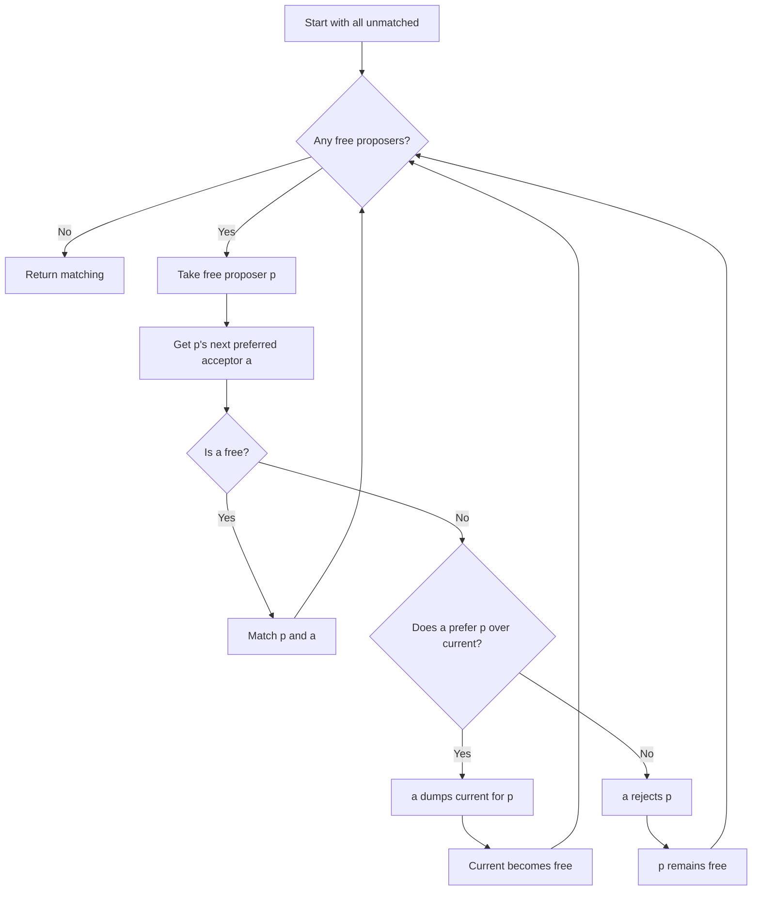
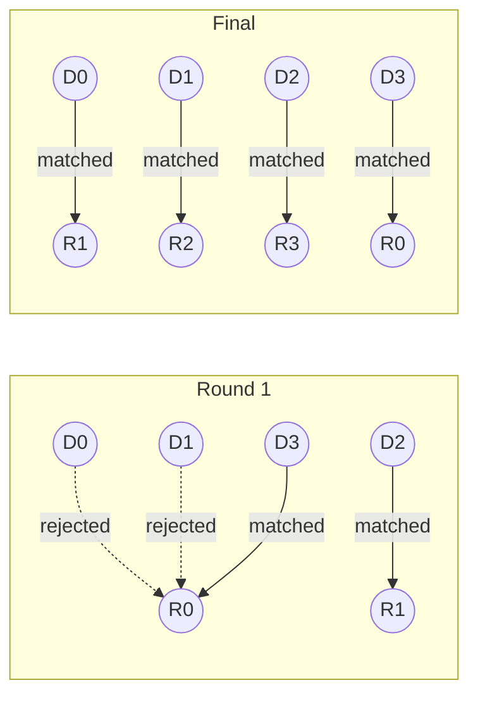

# Gale-Shapley Algorithm (Stable Matching)

## Overview

| Property | Value |
|----------|-------|
| **Category** | Bipartite Graph Matching |
| **Complexity (Time)** | O(n²) |
| **Complexity (Space)** | O(n) |
| **Graph Type** | Bipartite |
| **Best For** | Stable matching problems |

## Description

The Gale-Shapley algorithm solves the Stable Matching Problem (also known as the Stable Marriage Problem). Given two groups of equal size, where each member has ranked all members of the opposite group by preference, the algorithm finds a stable matching—one in which no pair of elements would both prefer each other over their current matches.

The algorithm was introduced by David Gale and Lloyd Shapley in 1962 and earned Shapley the Nobel Prize in Economics in 2012.

## Mathematical Foundation

### Stability Definition

A matching M is **stable** if there is no blocking pair. A pair (m, w) is blocking if:
$$m \text{ prefers } w \text{ to } M(m) \text{ AND } w \text{ prefers } m \text{ to } M(w)$$

### Optimality

The Gale-Shapley algorithm produces a **proposer-optimal** matching:
- Each proposer gets their best achievable stable partner
- Each acceptor gets their worst achievable stable partner

### Existence Theorem

**Theorem**: For any instance of the Stable Matching Problem with equal-sized groups, a stable matching always exists.

### Uniqueness

- If all preferences are strict, there exists at least one stable matching
- Multiple stable matchings may exist
- Proposer-side GS and Acceptor-side GS may produce different matchings

### Rural Hospital Theorem

In any stable matching:
- The same set of proposers remain unmatched
- The same set of acceptors remain unmatched
- Each participant is matched the same number of times

## Algorithm

### Pseudocode

```
GALE_SHAPLEY(proposers, acceptors, proposer_prefs, acceptor_prefs):
    // Initialize all as unmatched
    proposer_match[p] ← None for all p
    acceptor_match[a] ← None for all a
    proposal_count[p] ← 0 for all p
    
    free_proposers ← list of all proposers
    
    while free_proposers not empty:
        p ← free_proposers.pop_front()
        
        // Get p's next preferred acceptor
        a ← proposer_prefs[p][proposal_count[p]]
        proposal_count[p] += 1
        
        if acceptor_match[a] == None:
            // a is free, match p and a
            proposer_match[p] ← a
            acceptor_match[a] ← p
        else:
            current_p ← acceptor_match[a]
            
            // Does a prefer p over current partner?
            if acceptor_prefs[a].index(current_p) > acceptor_prefs[a].index(p):
                // a prefers p, switch partners
                proposer_match[p] ← a
                acceptor_match[a] ← p
                proposer_match[current_p] ← None
                free_proposers.append(current_p)
            else:
                // a rejects p, p remains free
                free_proposers.append(p)
    
    return proposer_match
```

### Step-by-Step Execution

```
Proposers (Donors): D0, D1, D2, D3
Acceptors (Recipients): R0, R1, R2, R3

Donor preferences (most preferred first):
  D0: [R0, R1, R3, R2]
  D1: [R0, R2, R3, R1]
  D2: [R1, R0, R2, R3]
  D3: [R0, R3, R1, R2]

Recipient preferences (most preferred first):
  R0: [D3, D1, D2, D0]
  R1: [D3, D1, D0, D2]
  R2: [D0, D3, D1, D2]
  R3: [D1, D0, D3, D2]

Round 1:
  D0 proposes to R0 → R0 accepts (was free)
  D1 proposes to R0 → R0 prefers D1 over D0
    R0 dumps D0, accepts D1
    D0 becomes free
  D2 proposes to R1 → R1 accepts (was free)
  D3 proposes to R0 → R0 prefers D3 over D1
    R0 dumps D1, accepts D3
    D1 becomes free

Current: D0-?, D1-?, D2-R1, D3-R0

Round 2:
  D0 proposes to R1 → R1 has D2
    R1 prefers D0 over D2
    R1 dumps D2, accepts D0
    D2 becomes free
  D1 proposes to R2 → R2 accepts (was free)

Current: D0-R1, D1-R2, D2-?, D3-R0

Round 3:
  D2 proposes to R0 → R0 has D3
    R0 prefers D3 over D2, rejects D2
  D2 proposes to R2 → R2 has D1
    R2 prefers D1 over D2, rejects D2
  D2 proposes to R3 → R3 accepts (was free)

Final Matching:
  D0 → R1
  D1 → R2
  D2 → R3
  D3 → R0
```

## Complexity Analysis

### Time Complexity

| Case | Complexity | Explanation |
|------|------------|-------------|
| Worst | O(n²) | Each proposer may propose to all n acceptors |
| Best | O(n) | Each proposer matched on first proposal |
| Average | O(n log n) | With random preferences |

### Space Complexity

| Component | Complexity |
|-----------|------------|
| Preference lists | O(n²) |
| Match arrays | O(n) |
| Free list | O(n) |
| Total | O(n²) |

### Proposal Bound

At most n² proposals total (each proposer proposes to each acceptor at most once).

## Visual Representation



### Matching Evolution



## Implementation

### Python Implementation

```python
from __future__ import annotations


def stable_matching(
    donor_pref: list[list[int]], 
    recipient_pref: list[list[int]]
) -> list[int]:
    """
    Gale-Shapley algorithm for stable matching.
    
    Finds stable pairing where no donor-recipient pair
    would both prefer each other over their current match.
    
    Args:
        donor_pref: Each donor's ranking of recipients
        recipient_pref: Each recipient's ranking of donors
        
    Returns:
        List where index is donor, value is matched recipient
        
    >>> donor_pref = [[0, 1, 3, 2], [0, 2, 3, 1], [1, 0, 2, 3], [0, 3, 1, 2]]
    >>> recipient_pref = [[3, 1, 2, 0], [3, 1, 0, 2], [0, 3, 1, 2], [1, 0, 3, 2]]
    >>> stable_matching(donor_pref, recipient_pref)
    [1, 2, 3, 0]
    """
    assert len(donor_pref) == len(recipient_pref)
    
    n = len(donor_pref)
    unmatched_donors = list(range(n))
    donor_record = [-1] * n      # Who donor is matched with
    recipient_record = [-1] * n  # Who recipient is matched with
    num_proposals = [0] * n      # How many proposals donor has made
    
    while unmatched_donors:
        donor = unmatched_donors[0]
        donor_preference = donor_pref[donor]
        recipient = donor_preference[num_proposals[donor]]
        num_proposals[donor] += 1
        
        recipient_preference = recipient_pref[recipient]
        prev_donor = recipient_record[recipient]
        
        if prev_donor != -1:
            # Recipient is already matched
            prev_rank = recipient_preference.index(prev_donor)
            new_rank = recipient_preference.index(donor)
            
            if prev_rank > new_rank:
                # Recipient prefers new donor
                recipient_record[recipient] = donor
                donor_record[donor] = recipient
                unmatched_donors.append(prev_donor)
                unmatched_donors.remove(donor)
        else:
            # Recipient is free
            recipient_record[recipient] = donor
            donor_record[donor] = recipient
            unmatched_donors.remove(donor)
    
    return donor_record


if __name__ == "__main__":
    import doctest
    doctest.testmod()
```

### Extended Implementation with Verification

```python
from typing import List, Dict, Tuple, Optional


class StableMatchingSolver:
    """
    Complete Gale-Shapley implementation with verification.
    """
    
    def __init__(
        self,
        group_a: List[str],
        group_b: List[str],
        prefs_a: Dict[str, List[str]],
        prefs_b: Dict[str, List[str]]
    ):
        """
        Initialize with named elements and preferences.
        
        Args:
            group_a: Names in proposer group
            group_b: Names in acceptor group
            prefs_a: Each member of A's preference list over B
            prefs_b: Each member of B's preference list over A
        """
        assert len(group_a) == len(group_b)
        
        self.group_a = group_a
        self.group_b = group_b
        self.prefs_a = prefs_a
        self.prefs_b = prefs_b
        self.n = len(group_a)
    
    def solve(self) -> Dict[str, str]:
        """
        Find stable matching (A proposes to B).
        
        Returns:
            Dict mapping A members to B members
        """
        # Initialize
        free_a = list(self.group_a)
        match_a: Dict[str, Optional[str]] = {a: None for a in self.group_a}
        match_b: Dict[str, Optional[str]] = {b: None for b in self.group_b}
        proposal_idx = {a: 0 for a in self.group_a}
        
        while free_a:
            a = free_a.pop(0)
            
            # Get next preferred b
            b_idx = proposal_idx[a]
            if b_idx >= len(self.prefs_a[a]):
                continue
            
            b = self.prefs_a[a][b_idx]
            proposal_idx[a] += 1
            
            current_a = match_b[b]
            
            if current_a is None:
                # b is free
                match_a[a] = b
                match_b[b] = a
            else:
                # b is matched, check preference
                b_prefs = self.prefs_b[b]
                if b_prefs.index(a) < b_prefs.index(current_a):
                    # b prefers a
                    match_a[a] = b
                    match_b[b] = a
                    match_a[current_a] = None
                    free_a.append(current_a)
                else:
                    # b rejects a
                    free_a.append(a)
        
        return {a: b for a, b in match_a.items() if b is not None}
    
    def verify_stability(self, matching: Dict[str, str]) -> Tuple[bool, List[Tuple[str, str]]]:
        """
        Verify that matching is stable.
        
        Returns:
            (is_stable, list_of_blocking_pairs)
        """
        blocking_pairs = []
        
        # Check all possible pairs
        for a in self.group_a:
            for b in self.group_b:
                # Skip if already matched
                if matching.get(a) == b:
                    continue
                
                # Check if (a, b) is blocking
                current_b = matching.get(a)
                
                # Find a's current match in their preference
                if current_b is not None:
                    a_prefers_b = (
                        self.prefs_a[a].index(b) < 
                        self.prefs_a[a].index(current_b)
                    )
                else:
                    a_prefers_b = True
                
                if not a_prefers_b:
                    continue
                
                # Find b's current match
                current_a = None
                for k, v in matching.items():
                    if v == b:
                        current_a = k
                        break
                
                if current_a is not None:
                    b_prefers_a = (
                        self.prefs_b[b].index(a) < 
                        self.prefs_b[b].index(current_a)
                    )
                else:
                    b_prefers_a = True
                
                if a_prefers_b and b_prefers_a:
                    blocking_pairs.append((a, b))
        
        return len(blocking_pairs) == 0, blocking_pairs
```

## Real-World Applications

### 1. Hospital-Resident Matching (NRMP)

```python
from typing import Dict, List, Tuple, Optional
from dataclasses import dataclass


@dataclass
class Hospital:
    name: str
    capacity: int
    preferences: List[str]  # Ranked list of resident names


@dataclass
class Resident:
    name: str
    preferences: List[str]  # Ranked list of hospital names


class ResidencyMatcher:
    """
    Hospital-Resident matching using Gale-Shapley variant.
    
    Based on NRMP (National Resident Matching Program).
    """
    
    def __init__(
        self,
        hospitals: List[Hospital],
        residents: List[Resident]
    ):
        self.hospitals = {h.name: h for h in hospitals}
        self.residents = {r.name: r for r in residents}
    
    def match(self) -> Dict[str, List[str]]:
        """
        Run resident-proposing Gale-Shapley.
        
        Returns:
            Dict mapping hospital names to lists of matched residents
        """
        # Initialize
        free_residents = list(self.residents.keys())
        resident_match: Dict[str, Optional[str]] = {
            r: None for r in self.residents
        }
        hospital_matches: Dict[str, List[str]] = {
            h: [] for h in self.hospitals
        }
        proposal_idx = {r: 0 for r in self.residents}
        
        while free_residents:
            resident_name = free_residents.pop(0)
            resident = self.residents[resident_name]
            
            # Get next preferred hospital
            if proposal_idx[resident_name] >= len(resident.preferences):
                continue
            
            hospital_name = resident.preferences[proposal_idx[resident_name]]
            proposal_idx[resident_name] += 1
            
            if hospital_name not in self.hospitals:
                free_residents.append(resident_name)
                continue
            
            hospital = self.hospitals[hospital_name]
            
            # Check if hospital has capacity
            current_matches = hospital_matches[hospital_name]
            
            if len(current_matches) < hospital.capacity:
                # Hospital has room
                resident_match[resident_name] = hospital_name
                hospital_matches[hospital_name].append(resident_name)
            else:
                # Hospital is full, check if resident is preferred
                # Find least preferred current match
                worst_current = None
                worst_rank = -1
                
                for current_r in current_matches:
                    if current_r in hospital.preferences:
                        rank = hospital.preferences.index(current_r)
                    else:
                        rank = len(hospital.preferences)
                    
                    if rank > worst_rank:
                        worst_rank = rank
                        worst_current = current_r
                
                # Get new resident's rank
                if resident_name in hospital.preferences:
                    new_rank = hospital.preferences.index(resident_name)
                else:
                    new_rank = len(hospital.preferences)
                
                if new_rank < worst_rank:
                    # Replace worst with new
                    hospital_matches[hospital_name].remove(worst_current)
                    hospital_matches[hospital_name].append(resident_name)
                    resident_match[resident_name] = hospital_name
                    resident_match[worst_current] = None
                    free_residents.append(worst_current)
                else:
                    # Rejected
                    free_residents.append(resident_name)
        
        return hospital_matches


def demo_residency_matching():
    """Demo hospital-resident matching."""
    hospitals = [
        Hospital("MassGeneral", 2, ["Alice", "Bob", "Charlie", "Diana"]),
        Hospital("Johns Hopkins", 2, ["Diana", "Charlie", "Alice", "Bob"]),
        Hospital("Mayo Clinic", 1, ["Bob", "Alice", "Diana", "Charlie"]),
    ]
    
    residents = [
        Resident("Alice", ["MassGeneral", "Johns Hopkins", "Mayo Clinic"]),
        Resident("Bob", ["Mayo Clinic", "MassGeneral", "Johns Hopkins"]),
        Resident("Charlie", ["Johns Hopkins", "MassGeneral", "Mayo Clinic"]),
        Resident("Diana", ["Johns Hopkins", "Mayo Clinic", "MassGeneral"]),
    ]
    
    matcher = ResidencyMatcher(hospitals, residents)
    result = matcher.match()
    
    print("Hospital-Resident Matching:")
    for hospital, residents in result.items():
        print(f"  {hospital}: {residents}")
```

### 2. School Choice System

```python
from typing import Dict, List, Set, Optional
from dataclasses import dataclass
from collections import defaultdict


@dataclass
class School:
    name: str
    capacity: int
    priority_groups: List[Set[str]]  # Tiered priorities


@dataclass
class Student:
    name: str
    preferences: List[str]  # Ranked school list


class SchoolChoiceMatcher:
    """
    School choice matching with priorities.
    
    Students are matched to schools based on preferences
    and priority tiers (e.g., siblings, neighborhood).
    """
    
    def __init__(
        self,
        schools: List[School],
        students: List[Student]
    ):
        self.schools = {s.name: s for s in schools}
        self.students = {s.name: s for s in students}
    
    def get_priority_rank(
        self, 
        school: School, 
        student_name: str
    ) -> int:
        """Get student's priority tier at school (lower = higher priority)."""
        for i, tier in enumerate(school.priority_groups):
            if student_name in tier:
                return i
        return len(school.priority_groups)  # Lowest priority
    
    def match(self) -> Dict[str, str]:
        """
        Run student-proposing deferred acceptance.
        
        Returns:
            Dict mapping student names to school names
        """
        free_students = list(self.students.keys())
        student_match: Dict[str, Optional[str]] = {
            s: None for s in self.students
        }
        school_matches: Dict[str, List[str]] = {
            s: [] for s in self.schools
        }
        proposal_idx = {s: 0 for s in self.students}
        
        while free_students:
            student_name = free_students.pop(0)
            student = self.students[student_name]
            
            if proposal_idx[student_name] >= len(student.preferences):
                continue
            
            school_name = student.preferences[proposal_idx[student_name]]
            proposal_idx[student_name] += 1
            
            if school_name not in self.schools:
                free_students.append(student_name)
                continue
            
            school = self.schools[school_name]
            current = school_matches[school_name]
            
            if len(current) < school.capacity:
                student_match[student_name] = school_name
                school_matches[school_name].append(student_name)
            else:
                # School full - check priorities
                new_priority = self.get_priority_rank(school, student_name)
                
                # Find lowest priority current student
                worst_student = None
                worst_priority = -1
                
                for curr_s in current:
                    curr_priority = self.get_priority_rank(school, curr_s)
                    if curr_priority > worst_priority:
                        worst_priority = curr_priority
                        worst_student = curr_s
                
                if new_priority < worst_priority:
                    # Replace
                    school_matches[school_name].remove(worst_student)
                    school_matches[school_name].append(student_name)
                    student_match[student_name] = school_name
                    student_match[worst_student] = None
                    free_students.append(worst_student)
                else:
                    free_students.append(student_name)
        
        return {s: sch for s, sch in student_match.items() if sch is not None}


def demo_school_choice():
    """Demo school choice matching."""
    # Priority tiers: siblings, neighborhood, lottery
    schools = [
        School("Central High", 3, [
            {"Alice", "Bob"},      # Siblings
            {"Charlie", "Diana"},  # Neighborhood
            {"Eve", "Frank"}       # General
        ]),
        School("East Academy", 2, [
            {"Charlie"},
            {"Alice", "Eve"},
            {"Bob", "Diana", "Frank"}
        ]),
    ]
    
    students = [
        Student("Alice", ["Central High", "East Academy"]),
        Student("Bob", ["Central High", "East Academy"]),
        Student("Charlie", ["East Academy", "Central High"]),
        Student("Diana", ["Central High", "East Academy"]),
        Student("Eve", ["East Academy", "Central High"]),
    ]
    
    matcher = SchoolChoiceMatcher(schools, students)
    result = matcher.match()
    
    print("School Choice Results:")
    for student, school in sorted(result.items()):
        print(f"  {student} → {school}")
```

### 3. Dating App Matching

```python
from typing import Dict, List, Tuple, Set, Optional
from dataclasses import dataclass
import random


@dataclass
class UserProfile:
    user_id: str
    preferences: List[str]  # Ranked list of other user IDs
    compatible_with: Set[str]  # Mutual interest required


class DatingMatcher:
    """
    Dating app matching with mutual interest requirement.
    
    Only matches users who have mutually expressed interest.
    """
    
    def __init__(self, users: List[UserProfile]):
        self.users = {u.user_id: u for u in users}
    
    def find_stable_matches(
        self, 
        max_matches_per_user: int = 1
    ) -> List[Tuple[str, str]]:
        """
        Find stable matches where both users are interested.
        
        Uses modified Gale-Shapley with mutual interest filter.
        """
        # Filter to only mutual interests
        mutual_prefs: Dict[str, List[str]] = {}
        
        for user_id, user in self.users.items():
            mutual_prefs[user_id] = [
                p for p in user.preferences
                if p in user.compatible_with and 
                   user_id in self.users[p].compatible_with
            ]
        
        # Run Gale-Shapley on filtered preferences
        free_users = list(self.users.keys())
        matches: Dict[str, Optional[str]] = {u: None for u in self.users}
        proposal_idx = {u: 0 for u in self.users}
        
        while free_users:
            user_id = free_users.pop(0)
            
            prefs = mutual_prefs[user_id]
            if proposal_idx[user_id] >= len(prefs):
                continue
            
            target_id = prefs[proposal_idx[user_id]]
            proposal_idx[user_id] += 1
            
            current_match = matches[target_id]
            
            if current_match is None:
                matches[user_id] = target_id
                matches[target_id] = user_id
            else:
                # Check target's preference
                target_prefs = mutual_prefs[target_id]
                
                if user_id in target_prefs and current_match in target_prefs:
                    if target_prefs.index(user_id) < target_prefs.index(current_match):
                        # Target prefers new user
                        matches[user_id] = target_id
                        matches[target_id] = user_id
                        matches[current_match] = None
                        free_users.append(current_match)
                    else:
                        free_users.append(user_id)
                else:
                    free_users.append(user_id)
        
        # Extract unique pairs
        seen = set()
        result = []
        for u1, u2 in matches.items():
            if u2 is not None:
                pair = tuple(sorted([u1, u2]))
                if pair not in seen:
                    seen.add(pair)
                    result.append(pair)
        
        return result


def demo_dating_matcher():
    """Demo dating app matching."""
    users = [
        UserProfile("Alice", ["Bob", "Charlie", "David"], 
                   {"Bob", "Charlie"}),
        UserProfile("Bob", ["Alice", "Diana", "Eve"],
                   {"Alice", "Diana"}),
        UserProfile("Charlie", ["Alice", "Diana"],
                   {"Diana"}),
        UserProfile("Diana", ["Charlie", "Bob"],
                   {"Charlie", "Bob"}),
    ]
    
    matcher = DatingMatcher(users)
    matches = matcher.find_stable_matches()
    
    print("Dating Matches:")
    for u1, u2 in matches:
        print(f"  {u1} ↔ {u2}")
```

## References

1. Gale, D., Shapley, L.S. "College Admissions and the Stability of Marriage" (1962)
2. Roth, A.E. "The Economics of Matching: Stability and Incentives" (1982)
3. [Stable marriage problem - Wikipedia](https://en.wikipedia.org/wiki/Stable_marriage_problem)
4. [Gale-Shapley algorithm - Wikipedia](https://en.wikipedia.org/wiki/Gale%E2%80%93Shapley_algorithm)

## See Also

- [Bipartite Check](bipartite_check.md) - Testing bipartite structure
- [Maximum Matching](dinic.md) - Maximum cardinality matching
