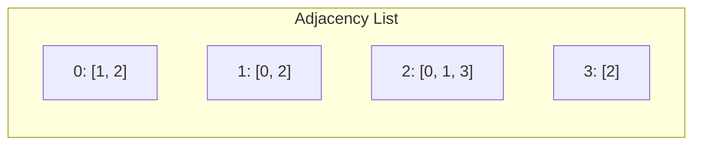

# Graph Representations

## Overview

| Representation | Space | Edge Query | Add Edge | Iterate Edges |
|----------------|-------|------------|----------|---------------|
| **Adjacency List** | O(V + E) | O(degree) | O(1) | O(degree) |
| **Adjacency Matrix** | O(V²) | O(1) | O(1) | O(V) |
| **Edge List** | O(E) | O(E) | O(1) | O(E) |

## Description

Choosing the right graph representation is crucial for algorithm efficiency. The three primary representations—adjacency list, adjacency matrix, and edge list—each have trade-offs that make them suitable for different scenarios.

## Mathematical Foundation

### Graph Definition

A graph $G = (V, E)$ consists of:
- $V$: Set of vertices with $|V| = n$
- $E$: Set of edges with $|E| = m$

For directed graphs: $E \subseteq V \times V$

For undirected graphs: $E \subseteq \{\{u, v\} : u, v \in V\}$

### Adjacency Matrix

The adjacency matrix $A$ is an $n \times n$ matrix where:

$$A[i][j] = \begin{cases}
1 & \text{if } (i, j) \in E \\
w_{ij} & \text{if weighted edge } (i, j) \in E \\
0 & \text{otherwise}
\end{cases}$$

For undirected graphs: $A = A^T$ (symmetric)

### Graph Density

$$\text{density} = \frac{|E|}{|V|^2} \text{ (directed)} \quad \text{or} \quad \frac{2|E|}{|V|(|V|-1)} \text{ (undirected)}$$

- **Sparse**: $|E| \approx O(|V|)$
- **Dense**: $|E| \approx O(|V|^2)$

## Adjacency List

### Structure

```
graph[v] = [list of neighbors of v]
```

### Implementation

```python
from __future__ import annotations
from typing import TypeVar, Generic
from pprint import pformat


T = TypeVar('T')


class GraphAdjacencyList(Generic[T]):
    """
    Unweighted graph using adjacency list representation.
    
    Efficient for sparse graphs where |E| << |V|².
    
    >>> g = GraphAdjacencyList(
    ...     vertices=['A', 'B', 'C'],
    ...     edges=[['A', 'B'], ['B', 'C']],
    ...     directed=False
    ... )
    >>> g.contains_vertex('A')
    True
    >>> g.contains_edge('A', 'B')
    True
    >>> g.contains_edge('A', 'C')
    False
    """
    
    def __init__(
        self,
        vertices: list[T] | None = None,
        edges: list[list[T]] | None = None,
        directed: bool = True
    ) -> None:
        """
        Initialize graph with optional vertices and edges.
        
        Args:
            vertices: List of vertex labels
            edges: List of [source, destination] pairs
            directed: True for directed graph
        """
        self.adj_list: dict[T, list[T]] = {}
        self.directed = directed
        
        vertices = vertices or []
        edges = edges or []
        
        for vertex in vertices:
            self.add_vertex(vertex)
        
        for edge in edges:
            if len(edge) != 2:
                raise ValueError(f"Invalid edge: {edge}")
            self.add_edge(edge[0], edge[1])
    
    def add_vertex(self, vertex: T) -> None:
        """
        Add a new vertex.
        
        >>> g = GraphAdjacencyList()
        >>> g.add_vertex('X')
        >>> g.contains_vertex('X')
        True
        """
        if self.contains_vertex(vertex):
            raise ValueError(f"Vertex {vertex} already exists")
        self.adj_list[vertex] = []
    
    def add_edge(self, source: T, destination: T) -> None:
        """
        Add edge from source to destination.
        
        For undirected graphs, adds edge in both directions.
        """
        if not (self.contains_vertex(source) and 
                self.contains_vertex(destination)):
            raise ValueError(
                f"Vertex {source} or {destination} does not exist"
            )
        
        if self.contains_edge(source, destination):
            raise ValueError(
                f"Edge ({source}, {destination}) already exists"
            )
        
        self.adj_list[source].append(destination)
        if not self.directed:
            self.adj_list[destination].append(source)
    
    def remove_vertex(self, vertex: T) -> None:
        """
        Remove vertex and all its edges.
        """
        if not self.contains_vertex(vertex):
            raise ValueError(f"Vertex {vertex} does not exist")
        
        if not self.directed:
            # Remove from neighbors' lists
            for neighbor in self.adj_list[vertex]:
                self.adj_list[neighbor].remove(vertex)
        else:
            # Search all vertices for edges to this vertex
            for edge_list in self.adj_list.values():
                if vertex in edge_list:
                    edge_list.remove(vertex)
        
        del self.adj_list[vertex]
    
    def remove_edge(self, source: T, destination: T) -> None:
        """Remove edge from source to destination."""
        if not self.contains_edge(source, destination):
            raise ValueError(
                f"Edge ({source}, {destination}) does not exist"
            )
        
        self.adj_list[source].remove(destination)
        if not self.directed:
            self.adj_list[destination].remove(source)
    
    def contains_vertex(self, vertex: T) -> bool:
        """Check if vertex exists."""
        return vertex in self.adj_list
    
    def contains_edge(self, source: T, destination: T) -> bool:
        """Check if edge exists."""
        if not (self.contains_vertex(source) and 
                self.contains_vertex(destination)):
            raise ValueError("Vertex does not exist")
        return destination in self.adj_list[source]
    
    def neighbors(self, vertex: T) -> list[T]:
        """Get all neighbors of a vertex."""
        if not self.contains_vertex(vertex):
            raise ValueError(f"Vertex {vertex} does not exist")
        return list(self.adj_list[vertex])
    
    def degree(self, vertex: T) -> int:
        """Get degree of vertex (out-degree for directed)."""
        return len(self.adj_list[vertex])
    
    def vertex_count(self) -> int:
        """Get number of vertices."""
        return len(self.adj_list)
    
    def edge_count(self) -> int:
        """Get number of edges."""
        count = sum(len(neighbors) for neighbors in self.adj_list.values())
        return count if self.directed else count // 2
    
    def clear(self) -> None:
        """Remove all vertices and edges."""
        self.adj_list = {}
    
    def __repr__(self) -> str:
        return pformat(self.adj_list)
```

## Adjacency Matrix

### Structure

```
matrix[i][j] = 1 if edge (i, j) exists, 0 otherwise
```

### Implementation

```python
class GraphAdjacencyMatrix(Generic[T]):
    """
    Unweighted graph using adjacency matrix representation.
    
    Efficient for dense graphs and O(1) edge queries.
    
    >>> g = GraphAdjacencyMatrix(
    ...     vertices=[0, 1, 2],
    ...     edges=[[0, 1], [1, 2]],
    ...     directed=False
    ... )
    >>> g.contains_edge(0, 1)
    True
    >>> g.contains_edge(0, 2)
    False
    """
    
    def __init__(
        self,
        vertices: list[T] | None = None,
        edges: list[list[T]] | None = None,
        directed: bool = True
    ) -> None:
        """
        Initialize graph with optional vertices and edges.
        """
        self.directed = directed
        self.vertex_to_index: dict[T, int] = {}
        self.adj_matrix: list[list[int]] = []
        
        vertices = vertices or []
        edges = edges or []
        
        for vertex in vertices:
            self.add_vertex(vertex)
        
        for edge in edges:
            if len(edge) != 2:
                raise ValueError(f"Invalid edge: {edge}")
            self.add_edge(edge[0], edge[1])
    
    def add_vertex(self, vertex: T) -> None:
        """
        Add a new vertex.
        
        Expands the matrix by one row and column.
        """
        if self.contains_vertex(vertex):
            raise ValueError(f"Vertex {vertex} already exists")
        
        # Add column to existing rows
        for row in self.adj_matrix:
            row.append(0)
        
        # Add new row
        self.adj_matrix.append([0] * (len(self.adj_matrix) + 1))
        self.vertex_to_index[vertex] = len(self.adj_matrix) - 1
    
    def add_edge(self, source: T, destination: T) -> None:
        """
        Add edge from source to destination.
        
        O(1) operation.
        """
        if not (self.contains_vertex(source) and 
                self.contains_vertex(destination)):
            raise ValueError("Vertex does not exist")
        
        if self.contains_edge(source, destination):
            raise ValueError("Edge already exists")
        
        u = self.vertex_to_index[source]
        v = self.vertex_to_index[destination]
        
        self.adj_matrix[u][v] = 1
        if not self.directed:
            self.adj_matrix[v][u] = 1
    
    def remove_vertex(self, vertex: T) -> None:
        """
        Remove vertex and update matrix.
        
        O(V²) operation due to matrix restructuring.
        """
        if not self.contains_vertex(vertex):
            raise ValueError(f"Vertex {vertex} does not exist")
        
        index = self.vertex_to_index[vertex]
        
        # Remove row
        self.adj_matrix.pop(index)
        
        # Remove column from each row
        for row in self.adj_matrix:
            row.pop(index)
        
        # Update indices
        del self.vertex_to_index[vertex]
        for v in self.vertex_to_index:
            if self.vertex_to_index[v] > index:
                self.vertex_to_index[v] -= 1
    
    def remove_edge(self, source: T, destination: T) -> None:
        """Remove edge. O(1) operation."""
        if not self.contains_edge(source, destination):
            raise ValueError("Edge does not exist")
        
        u = self.vertex_to_index[source]
        v = self.vertex_to_index[destination]
        
        self.adj_matrix[u][v] = 0
        if not self.directed:
            self.adj_matrix[v][u] = 0
    
    def contains_vertex(self, vertex: T) -> bool:
        """Check if vertex exists."""
        return vertex in self.vertex_to_index
    
    def contains_edge(self, source: T, destination: T) -> bool:
        """
        Check if edge exists.
        
        O(1) operation - main advantage of matrix representation.
        """
        if not (self.contains_vertex(source) and 
                self.contains_vertex(destination)):
            raise ValueError("Vertex does not exist")
        
        u = self.vertex_to_index[source]
        v = self.vertex_to_index[destination]
        return self.adj_matrix[u][v] == 1
    
    def neighbors(self, vertex: T) -> list[T]:
        """
        Get all neighbors.
        
        O(V) operation - must scan entire row.
        """
        if not self.contains_vertex(vertex):
            raise ValueError(f"Vertex {vertex} does not exist")
        
        u = self.vertex_to_index[vertex]
        index_to_vertex = {v: k for k, v in self.vertex_to_index.items()}
        
        neighbors = []
        for v, connected in enumerate(self.adj_matrix[u]):
            if connected == 1:
                neighbors.append(index_to_vertex[v])
        
        return neighbors
    
    def clear(self) -> None:
        """Clear the graph."""
        self.vertex_to_index = {}
        self.adj_matrix = []
    
    def __repr__(self) -> str:
        from pprint import pformat
        lines = ["Adjacency Matrix:"]
        lines.append(pformat(self.adj_matrix))
        lines.append("Vertex mapping:")
        lines.append(pformat(self.vertex_to_index))
        return '\n'.join(lines)
```

## Weighted Graph

### Implementation with Weights

```python
from collections import deque
from typing import Optional


class WeightedGraph:
    """
    Weighted graph using adjacency list.
    
    Each edge stores [weight, destination].
    
    >>> g = WeightedGraph()
    >>> g.add_pair(0, 1, 5)
    >>> g.add_pair(1, 2, 3)
    >>> g.all_nodes()
    [0, 1, 2]
    """
    
    def __init__(self):
        """Initialize empty graph."""
        self.graph: dict[int, list[list[int]]] = {}
    
    def add_pair(self, u: int, v: int, weight: int = 1) -> None:
        """
        Add edge (u, v) with given weight.
        
        For undirected graph, adds edge in both directions.
        """
        # Add u -> v
        if u in self.graph:
            # Avoid duplicates
            if [weight, v] not in self.graph[u]:
                self.graph[u].append([weight, v])
        else:
            self.graph[u] = [[weight, v]]
        
        # Add v -> u (undirected)
        if v in self.graph:
            if [weight, u] not in self.graph[v]:
                self.graph[v].append([weight, u])
        else:
            self.graph[v] = [[weight, u]]
    
    def remove_pair(self, u: int, v: int) -> None:
        """Remove edge between u and v."""
        if u in self.graph:
            self.graph[u] = [e for e in self.graph[u] if e[1] != v]
        
        if v in self.graph:
            self.graph[v] = [e for e in self.graph[v] if e[1] != u]
    
    def all_nodes(self) -> list[int]:
        """Get list of all vertices."""
        return list(self.graph.keys())
    
    def degree(self, u: int) -> int:
        """Get degree of vertex u."""
        return len(self.graph.get(u, []))
    
    def bfs(self, start: Optional[int] = None) -> list[int]:
        """
        Breadth-first search traversal.
        
        >>> g = WeightedGraph()
        >>> g.add_pair(1, 2)
        >>> g.add_pair(1, 3)
        >>> g.add_pair(2, 4)
        >>> 1 in g.bfs(1)
        True
        """
        if start is None:
            start = next(iter(self.graph))
        
        visited = []
        queue = deque([start])
        visited.append(start)
        
        while queue:
            current = queue.popleft()
            
            for weight, neighbor in self.graph.get(current, []):
                if neighbor not in visited:
                    visited.append(neighbor)
                    queue.append(neighbor)
        
        return visited
    
    def dfs(
        self,
        start: Optional[int] = None,
        target: int = -1
    ) -> list[int]:
        """
        Depth-first search traversal.
        
        If target is specified, returns path to target.
        """
        if start is None:
            start = next(iter(self.graph))
        
        if start == target:
            return []
        
        visited = [start]
        stack = [start]
        
        while stack:
            current = stack[-1]
            found_unvisited = False
            
            for weight, neighbor in self.graph.get(current, []):
                if neighbor not in visited:
                    if neighbor == target:
                        visited.append(target)
                        return visited
                    
                    stack.append(neighbor)
                    visited.append(neighbor)
                    found_unvisited = True
                    break
            
            if not found_unvisited:
                stack.pop()
        
        return visited
    
    def has_cycle(self) -> bool:
        """
        Check if graph contains a cycle.
        
        Uses DFS-based cycle detection.
        """
        if not self.graph:
            return False
        
        visited = set()
        rec_stack = set()
        
        def dfs_cycle(node: int, parent: int) -> bool:
            visited.add(node)
            rec_stack.add(node)
            
            for weight, neighbor in self.graph.get(node, []):
                if neighbor not in visited:
                    if dfs_cycle(neighbor, node):
                        return True
                elif neighbor in rec_stack and neighbor != parent:
                    return True
            
            rec_stack.remove(node)
            return False
        
        for node in self.graph:
            if node not in visited:
                if dfs_cycle(node, -1):
                    return True
        
        return False


class DirectedWeightedGraph:
    """
    Directed weighted graph using adjacency list.
    """
    
    def __init__(self):
        """Initialize empty directed graph."""
        self.graph: dict[int, list[list[int]]] = {}
    
    def add_pair(self, u: int, v: int, weight: int = 1) -> None:
        """
        Add directed edge u -> v with given weight.
        """
        if u in self.graph:
            if [weight, v] not in self.graph[u]:
                self.graph[u].append([weight, v])
        else:
            self.graph[u] = [[weight, v]]
        
        # Ensure v exists in graph
        if v not in self.graph:
            self.graph[v] = []
    
    def in_degree(self, u: int) -> int:
        """Count incoming edges to u."""
        count = 0
        for node in self.graph:
            for weight, dest in self.graph[node]:
                if dest == u:
                    count += 1
        return count
    
    def out_degree(self, u: int) -> int:
        """Count outgoing edges from u."""
        return len(self.graph.get(u, []))
    
    def topological_sort(self) -> list[int]:
        """
        Return topologically sorted vertices.
        
        Only valid for DAGs (directed acyclic graphs).
        """
        visited = set()
        result = []
        
        def dfs(node: int) -> None:
            visited.add(node)
            for weight, neighbor in self.graph.get(node, []):
                if neighbor not in visited:
                    dfs(neighbor)
            result.append(node)
        
        for node in self.graph:
            if node not in visited:
                dfs(node)
        
        return result[::-1]
```

## Visual Comparison

### Adjacency List



### Adjacency Matrix

```
    0  1  2  3
  ┌─────────────┐
0 │ 0  1  1  0  │
1 │ 1  0  1  0  │
2 │ 1  1  0  1  │
3 │ 0  0  1  0  │
  └─────────────┘
```

## Real-World Applications

### 1. Graph Builder for Networks

```python
class NetworkBuilder:
    """
    Build network topology from various formats.
    """
    
    @staticmethod
    def from_edge_list(
        edges: list[tuple[int, int]],
        directed: bool = False
    ) -> GraphAdjacencyList:
        """Create graph from edge list."""
        vertices = set()
        for u, v in edges:
            vertices.add(u)
            vertices.add(v)
        
        return GraphAdjacencyList(
            vertices=list(vertices),
            edges=[[u, v] for u, v in edges],
            directed=directed
        )
    
    @staticmethod
    def from_adjacency_dict(
        adj_dict: dict[int, list[int]],
        directed: bool = False
    ) -> GraphAdjacencyList:
        """Create graph from adjacency dictionary."""
        g = GraphAdjacencyList(directed=directed)
        
        for vertex in adj_dict:
            if not g.contains_vertex(vertex):
                g.add_vertex(vertex)
        
        for vertex, neighbors in adj_dict.items():
            for neighbor in neighbors:
                if not g.contains_vertex(neighbor):
                    g.add_vertex(neighbor)
                
                if not g.contains_edge(vertex, neighbor):
                    g.add_edge(vertex, neighbor)
        
        return g
    
    @staticmethod
    def find_isolated_nodes(
        graph: dict[int, list[int]]
    ) -> list[int]:
        """
        Find vertices with no edges.
        
        >>> NetworkBuilder.find_isolated_nodes({0: [1], 1: [0], 2: []})
        [2]
        """
        return [node for node in graph if not graph[node]]
```

### 2. Graph Analysis

```python
class GraphAnalyzer:
    """
    Analyze graph properties.
    """
    
    def __init__(self, graph: GraphAdjacencyList):
        self.graph = graph
    
    def is_connected(self) -> bool:
        """Check if undirected graph is connected."""
        if self.graph.directed:
            raise ValueError("Use strongly_connected for directed graphs")
        
        if self.graph.vertex_count() == 0:
            return True
        
        # BFS from first vertex
        start = next(iter(self.graph.adj_list))
        visited = {start}
        queue = [start]
        
        while queue:
            current = queue.pop(0)
            for neighbor in self.graph.neighbors(current):
                if neighbor not in visited:
                    visited.add(neighbor)
                    queue.append(neighbor)
        
        return len(visited) == self.graph.vertex_count()
    
    def density(self) -> float:
        """
        Calculate graph density.
        
        Ranges from 0 (no edges) to 1 (complete graph).
        """
        n = self.graph.vertex_count()
        m = self.graph.edge_count()
        
        if n <= 1:
            return 0.0
        
        if self.graph.directed:
            max_edges = n * (n - 1)
        else:
            max_edges = n * (n - 1) / 2
        
        return m / max_edges if max_edges > 0 else 0.0
    
    def average_degree(self) -> float:
        """Calculate average vertex degree."""
        if self.graph.vertex_count() == 0:
            return 0.0
        
        total_degree = sum(
            self.graph.degree(v)
            for v in self.graph.adj_list
        )
        
        return total_degree / self.graph.vertex_count()
```

## When to Use Each Representation

| Scenario | Best Representation |
|----------|---------------------|
| Sparse graph (|E| << |V|²) | Adjacency List |
| Dense graph (|E| ≈ |V|²) | Adjacency Matrix |
| Frequent edge queries | Adjacency Matrix |
| Frequent neighbor iteration | Adjacency List |
| Dynamic vertex addition | Adjacency List |
| Matrix operations (powers, etc.) | Adjacency Matrix |
| Memory constrained | Adjacency List |

## References

1. [Adjacency List - Wikipedia](https://en.wikipedia.org/wiki/Adjacency_list)
2. [Adjacency Matrix - Wolfram MathWorld](https://mathworld.wolfram.com/AdjacencyMatrix.html)
3. Cormen, T. H. et al. "Introduction to Algorithms" (2009)
4. Skiena, S. "The Algorithm Design Manual" (2008)

## See Also

- [Depth-First Search](depth_first_search.md) - Graph traversal
- [Breadth-First Search](breadth_first_search.md) - Level-order traversal
- [Connected Components](connected_components.md) - Component detection
