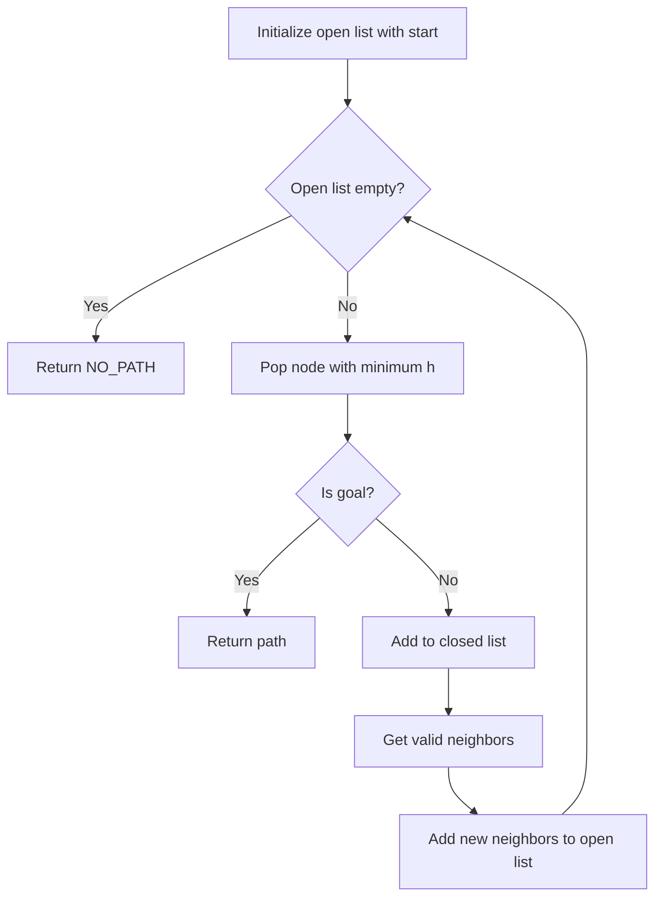
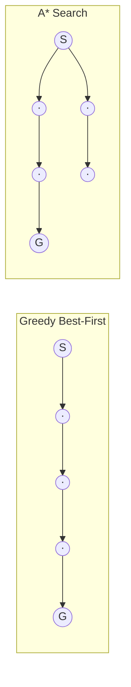

# Greedy Best-First Search

## Overview

| Property | Value |
|----------|-------|
| **Category** | Pathfinding |
| **Complexity (Time)** | O(b^m) worst case, often much better |
| **Complexity (Space)** | O(b^m) |
| **Graph Type** | Weighted, grid-based |
| **Best For** | Fast pathfinding when optimality not required |

## Description

Greedy Best-First Search is a pathfinding algorithm that expands the node that appears to be closest to the goal, using only the heuristic function to guide its search. Unlike A*, it ignores the cost to reach the current node (g-cost), focusing solely on the estimated distance to the goal (h-cost).

While faster than A* in many cases, Greedy Best-First Search does not guarantee finding the optimal (shortest) path.

## Mathematical Foundation

### Evaluation Function

Greedy Best-First uses only the heuristic:
$$f(n) = h(n)$$

Compare with A*:
$$f(n) = g(n) + h(n)$$

### Manhattan Distance Heuristic

For grid-based pathfinding:
$$h(n) = |n_x - goal_x| + |n_y - goal_y|$$

### Euclidean Distance Alternative

$$h(n) = \sqrt{(n_x - goal_x)^2 + (n_y - goal_y)^2}$$

### Node Selection

At each step, select:
$$n^* = \arg\min_{n \in \text{Open}} h(n)$$

## Algorithm

### Pseudocode

```
GREEDY_BEST_FIRST(start, goal, grid):
    open_list ← priority queue with start
    closed_list ← empty set
    
    while open_list not empty:
        // Select node with minimum heuristic
        current ← pop node with minimum h from open_list
        
        if current == goal:
            return retrace_path(current)
        
        closed_list.add(current)
        
        for each neighbor of current:
            if neighbor in closed_list:
                continue
            
            if neighbor not in open_list:
                neighbor.h ← heuristic(neighbor, goal)
                neighbor.parent ← current
                open_list.add(neighbor)
    
    return NO_PATH
```

### Step-by-Step Execution

```
Grid (0 = free, 1 = obstacle):
  [0, 0, 0, 0]
  [0, 1, 0, 0]
  [0, 0, 0, 0]
  [0, 0, 1, 0]

Start: (0, 0), Goal: (3, 3)

Step 1: Start at (0,0)
  h(0,0) = |0-3| + |0-3| = 6
  Neighbors: (0,1) h=5, (1,0) h=5
  
Step 2: Expand (0,1) - lowest h tied, pick first
  h(0,1) = |0-3| + |1-3| = 5
  Neighbors: (0,2) h=4
  
Step 3: Expand (0,2)
  h(0,2) = |0-3| + |2-3| = 4
  Neighbors: (0,3) h=3, (1,2) h=3
  
Step 4: Expand (0,3)
  h(0,3) = |0-3| + |3-3| = 3
  Neighbors: (1,3) h=2
  
Step 5: Expand (1,3)
  h(1,3) = |1-3| + |3-3| = 2
  Neighbors: (2,3) h=1
  
Step 6: Expand (2,3)
  Neighbors: (3,3) h=0
  
Step 7: Expand (3,3)
  Goal reached!

Path: (0,0) → (0,1) → (0,2) → (0,3) → (1,3) → (2,3) → (3,3)
```

## Complexity Analysis

### Time Complexity

| Scenario | Complexity |
|----------|------------|
| Best case | O(d) where d = depth to goal |
| Average case | Depends on heuristic quality |
| Worst case | O(b^m) where b = branching factor, m = max depth |

### Space Complexity

- Open list: O(b^m) worst case
- Closed list: O(b^m)
- Total: O(b^m)

### Comparison with A*

| Metric | Greedy Best-First | A* |
|--------|-------------------|-----|
| Optimality | No | Yes (with admissible h) |
| Completeness | Yes (finite graphs) | Yes |
| Speed | Usually faster | Usually slower |
| Memory | Similar | Similar |

## Visual Representation



### Search Comparison


*Greedy may find a longer path but expands fewer nodes*

## Implementation

### Python Implementation

```python
from __future__ import annotations
from typing import TypeAlias

Path: TypeAlias = list[tuple[int, int]]

# Movement directions: up, left, down, right
delta = ([-1, 0], [0, -1], [1, 0], [0, 1])


class Node:
    """
    Node for Greedy Best-First Search.
    
    >>> k = Node(0, 0, 4, 5, 0, None)
    >>> k.calculate_heuristic()
    9
    >>> n = Node(1, 4, 3, 4, 2, None)
    >>> n.calculate_heuristic()
    2
    """

    def __init__(
        self,
        pos_x: int,
        pos_y: int,
        goal_x: int,
        goal_y: int,
        g_cost: float,
        parent: Node | None,
    ):
        self.pos_x = pos_x
        self.pos_y = pos_y
        self.pos = (pos_y, pos_x)
        self.goal_x = goal_x
        self.goal_y = goal_y
        self.g_cost = g_cost
        self.parent = parent
        self.f_cost = self.calculate_heuristic()  # Only h-cost for greedy

    def calculate_heuristic(self) -> float:
        """
        Calculate Manhattan Distance heuristic.
        """
        dx = abs(self.pos_x - self.goal_x)
        dy = abs(self.pos_y - self.goal_y)
        return dx + dy

    def __lt__(self, other) -> bool:
        return self.f_cost < other.f_cost

    def __eq__(self, other) -> bool:
        return self.pos == other.pos


class GreedyBestFirst:
    """
    Greedy Best-First Search pathfinding algorithm.
    
    Expands nodes closest to goal (by heuristic) first.
    Fast but doesn't guarantee optimal paths.
    
    >>> grid = [[0, 0, 0], [0, 1, 0], [0, 0, 0]]
    >>> gbf = GreedyBestFirst(grid, (0, 0), (2, 2))
    >>> path = gbf.search()
    >>> (2, 2) in path
    True
    """

    def __init__(
        self, 
        grid: list[list[int]], 
        start: tuple[int, int], 
        goal: tuple[int, int]
    ):
        self.grid = grid
        self.start = Node(start[1], start[0], goal[1], goal[0], 0, None)
        self.target = Node(goal[1], goal[0], goal[1], goal[0], 99999, None)

        self.open_nodes = [self.start]
        self.closed_nodes: list[Node] = []

        self.reached = False

    def search(self) -> Path | None:
        """
        Search for path to goal.
        
        Returns path if found, or just start position if not.
        """
        while self.open_nodes:
            # Sort by heuristic (greedy selection)
            self.open_nodes.sort()
            current_node = self.open_nodes.pop(0)

            if current_node.pos == self.target.pos:
                self.reached = True
                return self.retrace_path(current_node)

            self.closed_nodes.append(current_node)
            successors = self.get_successors(current_node)

            for child_node in successors:
                if child_node in self.closed_nodes:
                    continue

                if child_node not in self.open_nodes:
                    self.open_nodes.append(child_node)

        if not self.reached:
            return [self.start.pos]
        return None

    def get_successors(self, parent: Node) -> list[Node]:
        """
        Get valid neighboring nodes.
        """
        return [
            Node(
                pos_x,
                pos_y,
                self.target.pos_x,
                self.target.pos_y,
                parent.g_cost + 1,
                parent,
            )
            for action in delta
            if (
                0 <= (pos_x := parent.pos_x + action[1]) < len(self.grid[0])
                and 0 <= (pos_y := parent.pos_y + action[0]) < len(self.grid)
                and self.grid[pos_y][pos_x] == 0
            )
        ]

    def retrace_path(self, node: Node | None) -> Path:
        """
        Reconstruct path from goal to start.
        """
        current_node = node
        path = []
        while current_node is not None:
            path.append((current_node.pos_y, current_node.pos_x))
            current_node = current_node.parent
        path.reverse()
        return path


if __name__ == "__main__":
    import doctest
    doctest.testmod()
```

### With Priority Queue Optimization

```python
import heapq
from dataclasses import dataclass, field
from typing import List, Tuple, Optional, Dict, Set


@dataclass(order=True)
class PQNode:
    """Priority queue node ordered by heuristic."""
    h_cost: float
    pos: Tuple[int, int] = field(compare=False)
    parent: Optional['PQNode'] = field(default=None, compare=False)


class OptimizedGreedyBestFirst:
    """
    Optimized Greedy Best-First with heapq.
    """
    
    def __init__(self, grid: List[List[int]]):
        self.grid = grid
        self.rows = len(grid)
        self.cols = len(grid[0]) if grid else 0
    
    def heuristic(self, pos: Tuple[int, int], goal: Tuple[int, int]) -> float:
        """Manhattan distance."""
        return abs(pos[0] - goal[0]) + abs(pos[1] - goal[1])
    
    def get_neighbors(self, pos: Tuple[int, int]) -> List[Tuple[int, int]]:
        """Get valid neighboring cells."""
        neighbors = []
        for dy, dx in [(-1, 0), (1, 0), (0, -1), (0, 1)]:
            ny, nx = pos[0] + dy, pos[1] + dx
            if 0 <= ny < self.rows and 0 <= nx < self.cols:
                if self.grid[ny][nx] == 0:
                    neighbors.append((ny, nx))
        return neighbors
    
    def search(
        self, 
        start: Tuple[int, int], 
        goal: Tuple[int, int]
    ) -> Optional[List[Tuple[int, int]]]:
        """
        Find path using Greedy Best-First.
        """
        open_heap = [PQNode(self.heuristic(start, goal), start)]
        closed: Set[Tuple[int, int]] = set()
        parent: Dict[Tuple[int, int], Optional[Tuple[int, int]]] = {start: None}
        
        while open_heap:
            current = heapq.heappop(open_heap)
            
            if current.pos in closed:
                continue
            
            if current.pos == goal:
                return self._reconstruct(goal, parent)
            
            closed.add(current.pos)
            
            for neighbor in self.get_neighbors(current.pos):
                if neighbor in closed:
                    continue
                
                if neighbor not in parent:
                    parent[neighbor] = current.pos
                    h = self.heuristic(neighbor, goal)
                    heapq.heappush(open_heap, PQNode(h, neighbor))
        
        return None
    
    def _reconstruct(
        self, 
        goal: Tuple[int, int],
        parent: Dict[Tuple[int, int], Optional[Tuple[int, int]]]
    ) -> List[Tuple[int, int]]:
        """Reconstruct path."""
        path = []
        current = goal
        while current is not None:
            path.append(current)
            current = parent[current]
        return path[::-1]
```

## Real-World Applications

### 1. Simple Robot Navigation

```python
from typing import List, Tuple, Optional, Set
from dataclasses import dataclass
import heapq


@dataclass
class RobotState:
    """Robot position state."""
    x: int
    y: int
    
    def __hash__(self):
        return hash((self.x, self.y))
    
    def __eq__(self, other):
        return self.x == other.x and self.y == other.y


class SimpleRobotNavigator:
    """
    Fast robot navigation using Greedy Best-First.
    
    Suitable when speed matters more than optimal paths.
    """
    
    def __init__(self, grid_size: Tuple[int, int]):
        self.width, self.height = grid_size
        self.obstacles: Set[Tuple[int, int]] = set()
    
    def add_obstacle(self, x: int, y: int) -> None:
        """Mark cell as obstacle."""
        self.obstacles.add((x, y))
    
    def heuristic(self, state: RobotState, goal: RobotState) -> float:
        """Manhattan distance heuristic."""
        return abs(state.x - goal.x) + abs(state.y - goal.y)
    
    def get_moves(self, state: RobotState) -> List[RobotState]:
        """Get valid neighboring states."""
        moves = []
        for dx, dy in [(0, 1), (0, -1), (1, 0), (-1, 0)]:
            nx, ny = state.x + dx, state.y + dy
            
            if 0 <= nx < self.width and 0 <= ny < self.height:
                if (nx, ny) not in self.obstacles:
                    moves.append(RobotState(nx, ny))
        
        return moves
    
    def navigate(
        self, 
        start: Tuple[int, int], 
        goal: Tuple[int, int]
    ) -> Optional[List[Tuple[int, int]]]:
        """
        Find path from start to goal.
        
        Uses Greedy Best-First for fast (not optimal) pathfinding.
        """
        start_state = RobotState(*start)
        goal_state = RobotState(*goal)
        
        # Priority queue: (heuristic, state)
        open_heap = [(self.heuristic(start_state, goal_state), start_state)]
        closed: Set[RobotState] = set()
        parent = {start_state: None}
        
        while open_heap:
            _, current = heapq.heappop(open_heap)
            
            if current in closed:
                continue
            
            if current == goal_state:
                return self._build_path(current, parent)
            
            closed.add(current)
            
            for next_state in self.get_moves(current):
                if next_state in closed:
                    continue
                
                if next_state not in parent:
                    parent[next_state] = current
                    h = self.heuristic(next_state, goal_state)
                    heapq.heappush(open_heap, (h, next_state))
        
        return None
    
    def _build_path(
        self, 
        goal: RobotState,
        parent: dict
    ) -> List[Tuple[int, int]]:
        """Build path from parent chain."""
        path = []
        current = goal
        while current is not None:
            path.append((current.x, current.y))
            current = parent[current]
        return path[::-1]


def demo_robot_navigation():
    """Demo simple robot navigation."""
    nav = SimpleRobotNavigator((10, 10))
    
    # Add some obstacles
    for x in range(3, 7):
        nav.add_obstacle(x, 5)
    
    # Find path
    path = nav.navigate((0, 0), (9, 9))
    
    if path:
        print(f"Path found: {len(path)} steps")
        print(f"Path: {path[:5]}... → {path[-1]}")
    
    return path
```

### 2. Real-Time Game Pathfinding

```python
from typing import Dict, List, Tuple, Optional, Set
from dataclasses import dataclass
from enum import Enum
import heapq
import time


class UnitType(Enum):
    INFANTRY = "infantry"
    VEHICLE = "vehicle"
    AIRCRAFT = "aircraft"


@dataclass
class GameUnit:
    """Game unit with position and type."""
    unit_id: str
    unit_type: UnitType
    x: int
    y: int
    speed: float = 1.0


class RealTimePathfinder:
    """
    Real-time game pathfinding with Greedy Best-First.
    
    Prioritizes response time over path optimality.
    """
    
    def __init__(self, map_width: int, map_height: int):
        self.width = map_width
        self.height = map_height
        self.terrain: List[List[float]] = [
            [1.0] * map_width for _ in range(map_height)
        ]
        self.max_compute_time = 0.01  # 10ms limit
    
    def set_terrain_cost(self, x: int, y: int, cost: float) -> None:
        """Set terrain movement cost (inf = impassable)."""
        self.terrain[y][x] = cost
    
    def heuristic(
        self, 
        pos: Tuple[int, int], 
        goal: Tuple[int, int]
    ) -> float:
        """Octile distance for 8-directional movement."""
        dx = abs(pos[0] - goal[0])
        dy = abs(pos[1] - goal[1])
        return max(dx, dy) + 0.414 * min(dx, dy)
    
    def get_neighbors(
        self, 
        pos: Tuple[int, int],
        unit_type: UnitType
    ) -> List[Tuple[Tuple[int, int], float]]:
        """Get neighbors with movement costs."""
        neighbors = []
        
        # 8-directional movement
        directions = [
            (-1, 0), (1, 0), (0, -1), (0, 1),
            (-1, -1), (-1, 1), (1, -1), (1, 1)
        ]
        
        for dx, dy in directions:
            nx, ny = pos[0] + dx, pos[1] + dy
            
            if not (0 <= nx < self.width and 0 <= ny < self.height):
                continue
            
            cost = self.terrain[ny][nx]
            
            # Unit type affects terrain traversal
            if unit_type == UnitType.AIRCRAFT:
                cost = 1.0  # Aircraft ignore terrain
            elif cost == float('inf'):
                continue
            
            # Diagonal costs more
            if dx != 0 and dy != 0:
                cost *= 1.414
            
            neighbors.append(((nx, ny), cost))
        
        return neighbors
    
    def find_path(
        self,
        unit: GameUnit,
        goal: Tuple[int, int]
    ) -> Optional[List[Tuple[int, int]]]:
        """
        Find path for unit using Greedy Best-First.
        
        Returns partial path if time limit exceeded.
        """
        start_time = time.time()
        start = (unit.x, unit.y)
        
        open_heap = [(self.heuristic(start, goal), start)]
        closed: Set[Tuple[int, int]] = set()
        parent: Dict[Tuple[int, int], Optional[Tuple[int, int]]] = {start: None}
        best_node = start
        best_h = self.heuristic(start, goal)
        
        while open_heap:
            # Check time limit
            if time.time() - start_time > self.max_compute_time:
                # Return partial path to best node found
                return self._build_path(best_node, parent)
            
            h, current = heapq.heappop(open_heap)
            
            if current in closed:
                continue
            
            # Track best node found
            if h < best_h:
                best_h = h
                best_node = current
            
            if current == goal:
                return self._build_path(goal, parent)
            
            closed.add(current)
            
            for (neighbor, cost) in self.get_neighbors(current, unit.unit_type):
                if neighbor in closed:
                    continue
                
                if neighbor not in parent:
                    parent[neighbor] = current
                    neighbor_h = self.heuristic(neighbor, goal)
                    heapq.heappush(open_heap, (neighbor_h, neighbor))
        
        # No path found
        return self._build_path(best_node, parent) if best_node != start else None
    
    def _build_path(
        self, 
        end: Tuple[int, int],
        parent: Dict
    ) -> List[Tuple[int, int]]:
        """Reconstruct path."""
        path = []
        current = end
        while current is not None:
            path.append(current)
            current = parent.get(current)
        return path[::-1]
```

## When to Use Greedy Best-First

### Use When:
- Response time is more important than path optimality
- Heuristic is very accurate
- Graph is simple with few obstacles
- Real-time constraints exist

### Avoid When:
- Optimal paths are required
- Graph has many dead-ends
- Heuristic is inaccurate
- Path length matters significantly

## References

1. Russell, S., Norvig, P. "Artificial Intelligence: A Modern Approach" (Chapter 3)
2. [Best-first search - Wikipedia](https://en.wikipedia.org/wiki/Best-first_search)
3. Pearl, J. "Heuristics: Intelligent Search Strategies for Computer Problem Solving"

## See Also

- [A* Algorithm](a_star.md) - Optimal heuristic search
- [Bidirectional A*](bidirectional_a_star.md) - Optimized long-distance search
- [Dijkstra's Algorithm](dijkstra.md) - Non-heuristic shortest path
