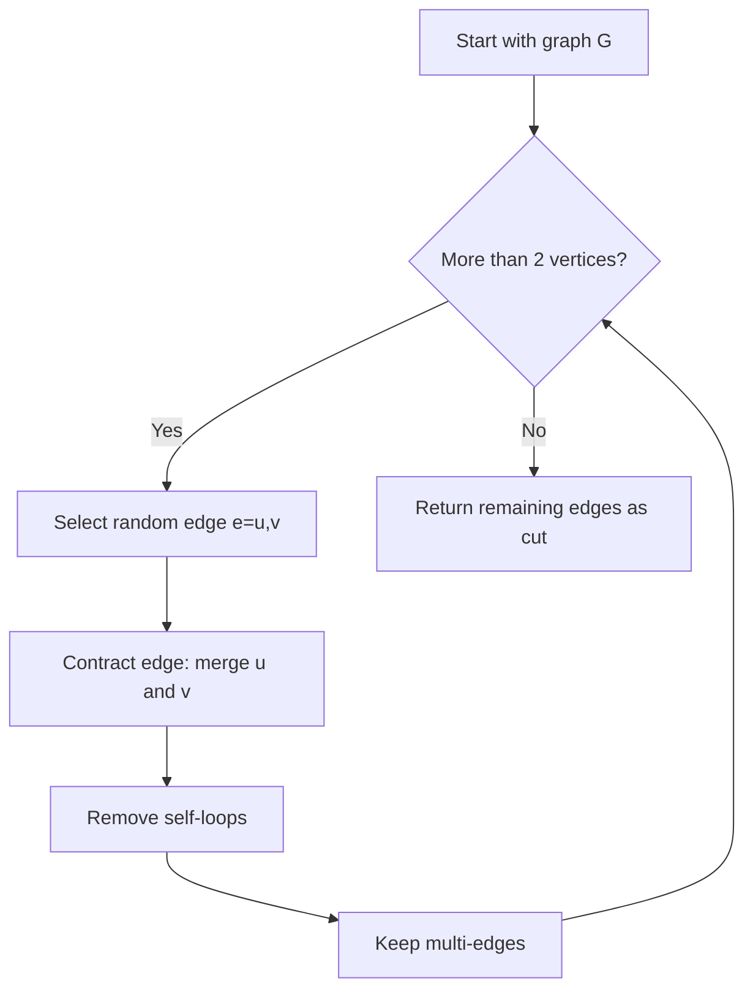
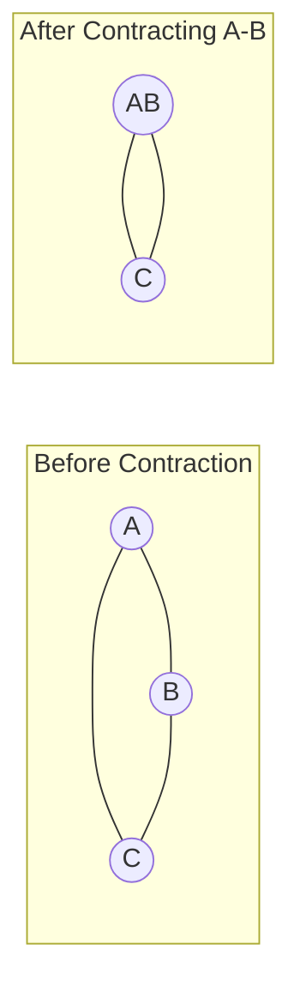

# Karger's Algorithm (Minimum Cut)

## Overview

| Property | Value |
|----------|-------|
| **Category** | Randomized Graph Algorithm |
| **Complexity (Time)** | O(V²) per iteration |
| **Success Probability** | ≥ 1/n² per iteration |
| **Graph Type** | Undirected, unweighted/weighted |
| **Best For** | Approximating minimum cuts |

## Description

Karger's algorithm is a randomized algorithm for finding the minimum cut of a connected graph. A minimum cut is the smallest set of edges whose removal disconnects the graph. The algorithm repeatedly contracts randomly chosen edges until only two vertices remain, and the remaining edges form a cut.

While a single run has low success probability, repeating the algorithm O(n² log n) times yields the minimum cut with high probability.

## Mathematical Foundation

### Minimum Cut Definition

For graph G = (V, E), a cut is a partition of V into two non-empty sets S and T:
$$\text{cut}(S, T) = \{(u, v) \in E : u \in S, v \in T\}$$

The minimum cut has minimum cardinality:
$$\text{min-cut}(G) = \min_{S, T} |\text{cut}(S, T)|$$

### Edge Contraction

Contracting edge (u, v):
1. Merge vertices u and v into single vertex uv
2. Remove self-loops (edges from uv to uv)
3. Keep multi-edges (parallel edges)

### Success Probability

Let k = min-cut size. The probability that a specific minimum cut survives is:
$$P(\text{success}) \geq \prod_{i=0}^{n-3} \frac{n-2-i}{n-i} = \frac{2}{n(n-1)} \geq \frac{2}{n^2}$$

### Repetition Analysis

Running algorithm n²/2 · ln(n) times:
$$P(\text{all fail}) \leq \left(1 - \frac{2}{n^2}\right)^{n^2 \ln n / 2} \leq e^{-\ln n} = \frac{1}{n}$$

So success probability is at least 1 - 1/n.

### Expected Running Time

Total time with repetitions:
$$O\left(\frac{n^2 \log n}{2} \cdot n^2\right) = O(n^4 \log n)$$

Karger-Stein improvement: O(n² log³ n)

## Algorithm

### Pseudocode

```
KARGER_MIN_CUT(G):
    while |V| > 2:
        // Choose random edge uniformly
        e = (u, v) ← random_edge(G)
        
        // Contract edge
        G ← CONTRACT(G, u, v)
    
    // Remaining edges form a cut
    return edges between the two remaining super-vertices

CONTRACT(G, u, v):
    // Merge v into u
    new_vertex ← merged(u, v)
    
    // Update edges
    for each edge (v, w):
        if w ≠ u:
            add edge (new_vertex, w)
    
    for each edge (u, w):
        if w ≠ v:
            keep edge (new_vertex, w)
    
    remove all edges (u, v)  // Remove self-loops
    remove vertex v
    
    return G

REPEATED_KARGER(G, iterations):
    min_cut ← ∞
    min_partition ← None
    
    for i ← 1 to iterations:
        G' ← copy of G
        cut ← KARGER_MIN_CUT(G')
        
        if |cut| < min_cut:
            min_cut ← |cut|
            min_partition ← cut
    
    return min_partition
```

### Step-by-Step Execution

```
Initial Graph:
    A --- B
    |\ /| |
    | X | |
    |/ \| |
    C --- D

Edges: (A,B), (A,C), (A,D), (B,C), (B,D), (C,D)
Min-cut = 2 (e.g., remove A-B, A-C to separate A from rest)

Iteration 1:
  Step 1: Contract random edge (B,D)
    New vertex: BD
    Graph: A-B, A-C, A-D, B-C, C-D
         → A-BD, A-C, A-BD, BD-C, C-BD
         = A-BD (×2), A-C, BD-C (×2)
    
  Step 2: Contract random edge (A,C)
    New vertex: AC
    Graph: A-BD (×2), A-C, BD-C (×2)
         → AC-BD (×2), AC-BD (×2)
         = AC-BD (×4)
    
  Step 3: Only 2 vertices remain
    Cut size = 4 (not optimal)

Iteration 2:
  Step 1: Contract (A,B)
    AB-C, AB-D, AB-C, AB-D, C-D
    = AB-C (×2), AB-D (×2), C-D
    
  Step 2: Contract (C,D)
    AB-CD (×2), AB-CD (×2), AB-CD
    = AB-CD (×5)
    
  Result: Cut size = 5 (not optimal)

Iteration 3:
  Step 1: Contract (C,D)
    A-B, A-CD, A-CD, B-CD, B-CD
    = A-B, A-CD (×2), B-CD (×2)
    
  Step 2: Contract (A,B)
    AB-CD (×2), AB-CD (×2)
    = AB-CD (×4)
    
  Result: Cut size = 4

After many iterations, find cut of size 2.
```

## Complexity Analysis

### Time Complexity

| Component | Complexity |
|-----------|------------|
| Single contraction | O(n) |
| n-2 contractions | O(n²) |
| Single iteration | O(n²) |
| With repetitions | O(n⁴ log n) |
| Karger-Stein | O(n² log³ n) |

### Space Complexity

| Component | Complexity |
|-----------|------------|
| Graph storage | O(V + E) |
| Per iteration | O(V + E) |
| With multi-edges | O(V + E × max_parallel) |

## Visual Representation



### Edge Contraction Process



## Implementation

### Python Implementation

```python
from __future__ import annotations
import random
from collections import defaultdict
from copy import deepcopy
from typing import Dict, List, Set, Tuple


def partition_graph(
    graph: Dict[str, List[str]]
) -> Set[Tuple[str, str]]:
    """
    Find minimum cut using Karger's algorithm.
    
    Args:
        graph: Adjacency list (may have multi-edges as repeated entries)
        
    Returns:
        Set of edges in the cut
        
    >>> graph = {"A": ["B", "C"], "B": ["A", "C"], "C": ["A", "B"]}
    >>> cut = partition_graph(graph)
    >>> len(cut) >= 2
    True
    """
    # Work with copy
    g = deepcopy(graph)
    
    # Track which original vertices each super-vertex contains
    vertex_groups: Dict[str, Set[str]] = {v: {v} for v in g}
    
    while len(g) > 2:
        # Pick random edge
        u = random.choice(list(g.keys()))
        if not g[u]:
            continue
        v = random.choice(g[u])
        
        # Contract: merge v into u
        vertex_groups[u] = vertex_groups[u] | vertex_groups[v]
        
        # Move all edges from v to u
        for neighbor in g[v]:
            if neighbor != u:
                g[u].append(neighbor)
                # Update neighbor's adjacency
                g[neighbor] = [u if x == v else x for x in g[neighbor]]
        
        # Remove self-loops (edges from u to u)
        g[u] = [x for x in g[u] if x != u]
        
        # Remove v
        del g[v]
        del vertex_groups[v]
    
    # Get the two remaining super-vertices
    vertices = list(g.keys())
    if len(vertices) < 2:
        return set()
    
    # The cut is edges between the two groups
    group1 = vertex_groups[vertices[0]]
    group2 = vertex_groups[vertices[1]]
    
    # Build cutset from original graph
    cutset = set()
    for orig_u, orig_neighbors in graph.items():
        for orig_v in orig_neighbors:
            if orig_u in group1 and orig_v in group2:
                edge = tuple(sorted([orig_u, orig_v]))
                cutset.add(edge)
    
    return cutset


def repeated_karger(
    graph: Dict[str, List[str]],
    iterations: int = None
) -> Tuple[Set[Tuple[str, str]], Set[str], Set[str]]:
    """
    Run Karger's algorithm multiple times for better results.
    
    Args:
        graph: Adjacency list
        iterations: Number of iterations (default: n² log n)
        
    Returns:
        Tuple of (cut_edges, partition1, partition2)
    """
    import math
    
    n = len(graph)
    if iterations is None:
        iterations = int(n * n * math.log(n)) + 1
    
    best_cut = None
    best_size = float('inf')
    
    for _ in range(iterations):
        cut = partition_graph(graph)
        if len(cut) < best_size:
            best_size = len(cut)
            best_cut = cut
    
    # Reconstruct partitions
    if best_cut:
        partition1 = set()
        partition2 = set()
        
        for u, v in best_cut:
            partition1.add(u)
            partition2.add(v)
        
        return best_cut, partition1, partition2
    
    return set(), set(), set(graph.keys())


if __name__ == "__main__":
    import doctest
    doctest.testmod()
```

### Optimized Implementation with Union-Find

```python
from typing import Dict, List, Set, Tuple, Optional
import random
from collections import defaultdict


class UnionFind:
    """Union-Find for efficient vertex merging."""
    
    def __init__(self, vertices):
        self.parent = {v: v for v in vertices}
        self.rank = {v: 0 for v in vertices}
        self.size = {v: 1 for v in vertices}
    
    def find(self, x):
        if self.parent[x] != x:
            self.parent[x] = self.find(self.parent[x])
        return self.parent[x]
    
    def union(self, x, y):
        px, py = self.find(x), self.find(y)
        if px == py:
            return
        
        if self.rank[px] < self.rank[py]:
            px, py = py, px
        
        self.parent[py] = px
        self.size[px] += self.size[py]
        
        if self.rank[px] == self.rank[py]:
            self.rank[px] += 1


class KargerMinCut:
    """
    Karger's randomized min-cut algorithm.
    """
    
    def __init__(self, vertices: List[str], edges: List[Tuple[str, str]]):
        self.vertices = vertices
        self.edges = edges
        self.n = len(vertices)
    
    def single_run(self) -> Tuple[int, Set[str], Set[str]]:
        """
        Single iteration of Karger's algorithm.
        """
        uf = UnionFind(self.vertices)
        remaining_vertices = self.n
        
        # Shuffle edges
        edge_order = list(range(len(self.edges)))
        random.shuffle(edge_order)
        
        edge_idx = 0
        
        while remaining_vertices > 2 and edge_idx < len(edge_order):
            u, v = self.edges[edge_order[edge_idx]]
            edge_idx += 1
            
            # Contract if different components
            if uf.find(u) != uf.find(v):
                uf.union(u, v)
                remaining_vertices -= 1
        
        # Count cut edges
        cut_size = 0
        partition1_rep = None
        partition2_rep = None
        
        for u, v in self.edges:
            if uf.find(u) != uf.find(v):
                cut_size += 1
                if partition1_rep is None:
                    partition1_rep = uf.find(u)
                    partition2_rep = uf.find(v)
        
        # Get partitions
        partition1 = {v for v in self.vertices if uf.find(v) == partition1_rep}
        partition2 = {v for v in self.vertices if uf.find(v) == partition2_rep}
        
        return cut_size, partition1, partition2
    
    def find_min_cut(
        self, 
        iterations: Optional[int] = None
    ) -> Tuple[int, Set[str], Set[str]]:
        """
        Run multiple iterations to find minimum cut.
        """
        import math
        
        if iterations is None:
            iterations = int(self.n * self.n * math.log(self.n + 1)) + 1
        
        best_cut = float('inf')
        best_p1, best_p2 = set(), set()
        
        for _ in range(iterations):
            cut_size, p1, p2 = self.single_run()
            if cut_size < best_cut:
                best_cut = cut_size
                best_p1, best_p2 = p1, p2
        
        return best_cut, best_p1, best_p2
```

## Real-World Applications

### 1. Network Reliability Analysis

```python
from typing import Dict, List, Set, Tuple
import random


class NetworkReliabilityAnalyzer:
    """
    Analyze network reliability using min-cut analysis.
    
    Identifies critical connections that, if severed,
    would partition the network.
    """
    
    def __init__(self):
        self.nodes: Set[str] = set()
        self.edges: List[Tuple[str, str]] = []
    
    def add_connection(self, node1: str, node2: str) -> None:
        """Add network connection."""
        self.nodes.add(node1)
        self.nodes.add(node2)
        self.edges.append((node1, node2))
    
    def _karger_single_run(self) -> Tuple[int, Set[str], Set[str]]:
        """Single run of Karger's algorithm."""
        from collections import defaultdict
        
        # Build adjacency with multi-edges
        adj: Dict[str, List[str]] = defaultdict(list)
        for u, v in self.edges:
            adj[u].append(v)
            adj[v].append(u)
        
        # Track vertex groups
        groups = {v: {v} for v in self.nodes}
        
        while len(adj) > 2:
            # Pick random edge
            u = random.choice(list(adj.keys()))
            if not adj[u]:
                del adj[u]
                continue
            v = random.choice(adj[u])
            
            # Contract v into u
            groups[u] = groups[u] | groups.get(v, set())
            
            # Redirect edges
            for neighbor in adj[v]:
                if neighbor != u:
                    adj[u].append(neighbor)
                    adj[neighbor] = [u if x == v else x for x in adj[neighbor]]
            
            # Remove self-loops
            adj[u] = [x for x in adj[u] if x != u]
            
            # Remove v
            del adj[v]
            if v in groups:
                del groups[v]
        
        # Extract results
        remaining = list(adj.keys())
        if len(remaining) < 2:
            return float('inf'), set(), set()
        
        cut_size = len(adj[remaining[0]])
        return cut_size, groups[remaining[0]], groups[remaining[1]]
    
    def find_critical_links(
        self, 
        iterations: int = 100
    ) -> Tuple[int, List[Tuple[str, str]]]:
        """
        Find minimum number of links that partition network.
        
        Returns:
            Tuple of (min_cut_size, critical_edges)
        """
        best_cut = float('inf')
        best_p1: Set[str] = set()
        best_p2: Set[str] = set()
        
        for _ in range(iterations):
            cut, p1, p2 = self._karger_single_run()
            if cut < best_cut:
                best_cut = cut
                best_p1, best_p2 = p1, p2
        
        # Find actual critical edges
        critical = []
        for u, v in self.edges:
            if (u in best_p1 and v in best_p2) or (u in best_p2 and v in best_p1):
                critical.append((u, v))
        
        return best_cut, critical
    
    def reliability_score(self, iterations: int = 50) -> float:
        """
        Compute reliability score (higher = more redundant).
        
        Score = min_cut / total_edges
        """
        min_cut, _ = self.find_critical_links(iterations)
        if not self.edges:
            return 0.0
        return min_cut / len(self.edges)


def demo_network_reliability():
    """Demo network reliability analysis."""
    analyzer = NetworkReliabilityAnalyzer()
    
    # Build network topology
    connections = [
        ("DataCenter1", "Router1"),
        ("DataCenter1", "Router2"),
        ("DataCenter2", "Router2"),
        ("DataCenter2", "Router3"),
        ("Router1", "Router2"),
        ("Router2", "Router3"),
        ("Router1", "Switch1"),
        ("Router3", "Switch2"),
    ]
    
    for conn in connections:
        analyzer.add_connection(*conn)
    
    min_cut, critical = analyzer.find_critical_links(100)
    
    print(f"Network Reliability Analysis:")
    print(f"  Minimum cut size: {min_cut}")
    print(f"  Critical connections: {critical}")
    print(f"  Reliability score: {analyzer.reliability_score():.3f}")
```

### 2. Image Segmentation

```python
from typing import List, Tuple, Dict, Set
import random
from collections import defaultdict


class ImageSegmenter:
    """
    Simple image segmentation using graph cuts.
    
    Pixels are nodes, similar adjacent pixels have
    high-weight edges.
    """
    
    def __init__(self, width: int, height: int):
        self.width = width
        self.height = height
        self.pixel_values: Dict[Tuple[int, int], int] = {}
        self.edges: List[Tuple[Tuple[int, int], Tuple[int, int], float]] = []
    
    def set_pixel(self, x: int, y: int, value: int) -> None:
        """Set pixel intensity (0-255)."""
        self.pixel_values[(x, y)] = value
    
    def build_graph(self, similarity_threshold: float = 50) -> None:
        """
        Build pixel adjacency graph.
        
        Edge weight = 1 if similar, 0 otherwise.
        """
        self.edges = []
        
        for x in range(self.width):
            for y in range(self.height):
                pixel = (x, y)
                val = self.pixel_values.get(pixel, 0)
                
                # 4-connectivity neighbors
                for dx, dy in [(0, 1), (1, 0)]:
                    nx, ny = x + dx, y + dy
                    if 0 <= nx < self.width and 0 <= ny < self.height:
                        neighbor = (nx, ny)
                        nval = self.pixel_values.get(neighbor, 0)
                        
                        # High weight for similar pixels
                        if abs(val - nval) < similarity_threshold:
                            self.edges.append((pixel, neighbor, 1.0))
    
    def _karger_run(self) -> Tuple[int, Set, Set]:
        """Single Karger iteration."""
        # Build adjacency
        adj = defaultdict(list)
        for u, v, w in self.edges:
            adj[u].append(v)
            adj[v].append(u)
        
        groups = {p: {p} for p in self.pixel_values}
        
        while len(adj) > 2:
            u = random.choice(list(adj.keys()))
            if not adj[u]:
                del adj[u]
                continue
            v = random.choice(adj[u])
            
            groups[u] = groups[u] | groups.get(v, set())
            
            for neighbor in adj[v]:
                if neighbor != u:
                    adj[u].append(neighbor)
                    adj[neighbor] = [u if x == v else x for x in adj[neighbor]]
            
            adj[u] = [x for x in adj[u] if x != u]
            
            del adj[v]
            if v in groups:
                del groups[v]
        
        remaining = list(adj.keys())
        if len(remaining) < 2:
            return float('inf'), set(), set()
        
        return len(adj[remaining[0]]), groups[remaining[0]], groups[remaining[1]]
    
    def segment(self, iterations: int = 50) -> Tuple[Set, Set]:
        """
        Segment image into two regions.
        
        Returns two sets of pixel coordinates.
        """
        best_cut = float('inf')
        best_seg1, best_seg2 = set(), set()
        
        for _ in range(iterations):
            cut, seg1, seg2 = self._karger_run()
            if cut < best_cut:
                best_cut = cut
                best_seg1, best_seg2 = seg1, seg2
        
        return best_seg1, best_seg2


def demo_image_segmentation():
    """Demo simple image segmentation."""
    # Create 4x4 test image
    segmenter = ImageSegmenter(4, 4)
    
    # Two regions with different intensities
    for x in range(2):
        for y in range(4):
            segmenter.set_pixel(x, y, 50)  # Dark region
    
    for x in range(2, 4):
        for y in range(4):
            segmenter.set_pixel(x, y, 200)  # Bright region
    
    segmenter.build_graph(similarity_threshold=100)
    region1, region2 = segmenter.segment(100)
    
    print("Image Segmentation Result:")
    print(f"  Region 1: {len(region1)} pixels")
    print(f"  Region 2: {len(region2)} pixels")
```

### 3. Community Detection

```python
from typing import Dict, List, Set, Tuple
import random
from collections import defaultdict


class CommunityDetector:
    """
    Detect communities in social network using min-cut.
    
    Communities are dense internally with sparse
    connections between them.
    """
    
    def __init__(self):
        self.users: Set[str] = set()
        self.connections: List[Tuple[str, str]] = []
    
    def add_friendship(self, user1: str, user2: str) -> None:
        """Add friendship connection."""
        self.users.add(user1)
        self.users.add(user2)
        self.connections.append((user1, user2))
    
    def _normalized_cut(
        self, 
        partition1: Set[str], 
        partition2: Set[str]
    ) -> float:
        """
        Compute normalized cut value.
        
        NCut = cut(A,B)/assoc(A,V) + cut(A,B)/assoc(B,V)
        """
        cut_edges = 0
        assoc1 = 0
        assoc2 = 0
        
        for u, v in self.connections:
            if (u in partition1 and v in partition2) or \
               (u in partition2 and v in partition1):
                cut_edges += 1
            
            if u in partition1 or v in partition1:
                assoc1 += 1
            if u in partition2 or v in partition2:
                assoc2 += 1
        
        if assoc1 == 0 or assoc2 == 0:
            return float('inf')
        
        return cut_edges / assoc1 + cut_edges / assoc2
    
    def _karger_iteration(self) -> Tuple[Set[str], Set[str]]:
        """Single Karger iteration."""
        adj = defaultdict(list)
        for u, v in self.connections:
            adj[u].append(v)
            adj[v].append(u)
        
        groups = {u: {u} for u in self.users}
        
        while len(adj) > 2:
            u = random.choice(list(adj.keys()))
            if not adj[u]:
                del adj[u]
                continue
            v = random.choice(adj[u])
            
            groups[u] = groups[u] | groups.get(v, set())
            
            for neighbor in adj[v]:
                if neighbor != u:
                    adj[u].append(neighbor)
                    adj[neighbor] = [u if x == v else x for x in adj[neighbor]]
            
            adj[u] = [x for x in adj[u] if x != u]
            del adj[v]
            if v in groups:
                del groups[v]
        
        remaining = list(adj.keys())
        if len(remaining) < 2:
            return set(), self.users.copy()
        
        return groups[remaining[0]], groups[remaining[1]]
    
    def detect_communities(
        self, 
        iterations: int = 100
    ) -> Tuple[Set[str], Set[str], float]:
        """
        Find two communities with minimum normalized cut.
        
        Returns:
            (community1, community2, ncut_value)
        """
        best_ncut = float('inf')
        best_c1, best_c2 = set(), set()
        
        for _ in range(iterations):
            c1, c2 = self._karger_iteration()
            ncut = self._normalized_cut(c1, c2)
            
            if ncut < best_ncut:
                best_ncut = ncut
                best_c1, best_c2 = c1, c2
        
        return best_c1, best_c2, best_ncut


def demo_community_detection():
    """Demo community detection."""
    detector = CommunityDetector()
    
    # Two friend groups with few inter-group connections
    group1_friends = [
        ("Alice", "Bob"), ("Alice", "Charlie"),
        ("Bob", "Charlie"), ("Bob", "David"),
        ("Charlie", "David")
    ]
    
    group2_friends = [
        ("Eve", "Frank"), ("Eve", "Grace"),
        ("Frank", "Grace"), ("Frank", "Henry"),
        ("Grace", "Henry")
    ]
    
    # Few inter-group connections
    inter_group = [("David", "Eve")]
    
    for f in group1_friends + group2_friends + inter_group:
        detector.add_friendship(*f)
    
    c1, c2, ncut = detector.detect_communities(100)
    
    print("Community Detection Result:")
    print(f"  Community 1: {c1}")
    print(f"  Community 2: {c2}")
    print(f"  Normalized cut: {ncut:.4f}")
```

## References

1. Karger, D.R. "Global Min-cuts in RNC, and Other Ramifications of a Simple Min-Cut Algorithm" (1993)
2. Karger, D.R., Stein, C. "A New Approach to the Minimum Cut Problem" (1996)
3. [Karger's algorithm - Wikipedia](https://en.wikipedia.org/wiki/Karger%27s_algorithm)

## See Also

- [Ford-Fulkerson / Maximum Flow](dinic.md) - Deterministic min-cut via max-flow
- [Connected Components](connected_components.md) - Finding connected subgraphs
- [Bridges](bridges.md) - Finding critical edges
