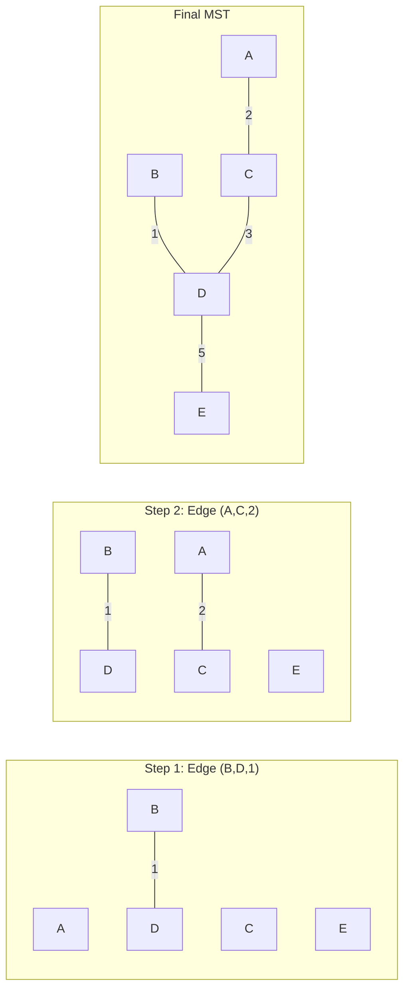

# Kruskal's Algorithm

## Overview

| Property | Value |
|----------|-------|
| **Category** | Minimum Spanning Tree |
| **Complexity (Time)** | O(E log E) or O(E log V) |
| **Complexity (Space)** | O(V) |
| **Graph Type** | Weighted, undirected, connected |
| **Best For** | Sparse graphs, edge-list representation |

## Description

Kruskal's algorithm is a greedy algorithm that finds a minimum spanning tree (MST) for a weighted undirected graph. Named after Joseph Kruskal (1956), it works by sorting all edges by weight and adding them one by one to the MST, skipping edges that would create a cycle.

The algorithm efficiently detects cycles using the Union-Find (Disjoint Set Union) data structure, making it practical for sparse graphs where the number of edges is close to the number of vertices.

## Mathematical Foundation

### Minimum Spanning Tree Definition

For a connected graph $G = (V, E)$ with edge weights $w: E \to \mathbb{R}$:

A spanning tree $T$ is a subgraph that:
1. Contains all vertices $V$
2. Is connected
3. Is acyclic (has exactly $|V| - 1$ edges)

The MST minimizes:
$$W(T) = \sum_{e \in T} w(e)$$

### Cut Property

For any cut $(S, V - S)$ of $G$, the minimum weight edge crossing the cut is in some MST.

**Proof sketch:** If $e$ is the minimum edge crossing a cut and is not in MST $T$, adding $e$ to $T$ creates a cycle crossing the cut. Removing the heavier edge from this cycle gives a lighter spanning tree, contradicting that $T$ is minimum.

### Greedy Choice Property

The minimum weight edge that doesn't create a cycle is always safe to add to the MST.

### Cycle Property

The maximum weight edge in any cycle is never part of the MST (unless all edges in the cycle have equal weight).

### Union-Find Invariant

At any point during Kruskal's algorithm:
- Each component is a tree
- Adding the next edge either connects two components or is skipped

## Algorithm

### Pseudocode

```
KRUSKAL(graph G, vertices V, edges E):
    // Initialize MST
    MST ← empty set
    
    // Initialize Union-Find
    for each vertex v in V:
        MAKE-SET(v)
    
    // Sort edges by weight
    sorted_edges ← SORT(E, by weight ascending)
    
    // Process edges
    for each edge (u, v, weight) in sorted_edges:
        if FIND-SET(u) ≠ FIND-SET(v):
            MST ← MST ∪ {(u, v, weight)}
            UNION(u, v)
            
            if |MST| = |V| - 1:
                break
    
    return MST
```

### Union-Find Operations

```
MAKE-SET(x):
    parent[x] ← x
    rank[x] ← 0

FIND-SET(x):  // with path compression
    if x ≠ parent[x]:
        parent[x] ← FIND-SET(parent[x])
    return parent[x]

UNION(x, y):  // with union by rank
    root_x ← FIND-SET(x)
    root_y ← FIND-SET(y)
    
    if rank[root_x] < rank[root_y]:
        parent[root_x] ← root_y
    else if rank[root_x] > rank[root_y]:
        parent[root_y] ← root_x
    else:
        parent[root_y] ← root_x
        rank[root_x] ← rank[root_x] + 1
```

### Step-by-Step Execution

```
Graph:
    A---4---B
    |       |
    2       1
    |       |
    C---3---D---5---E

Edges sorted by weight:
  (B, D, 1), (A, C, 2), (C, D, 3), (A, B, 4), (D, E, 5)

Initial: Each vertex is its own component
  Components: {A}, {B}, {C}, {D}, {E}

Step 1: Consider (B, D, 1)
  B and D in different components → Add edge
  MST = {(B, D, 1)}
  Components: {A}, {B, D}, {C}, {E}

Step 2: Consider (A, C, 2)
  A and C in different components → Add edge
  MST = {(B, D, 1), (A, C, 2)}
  Components: {A, C}, {B, D}, {E}

Step 3: Consider (C, D, 3)
  C and D in different components → Add edge
  MST = {(B, D, 1), (A, C, 2), (C, D, 3)}
  Components: {A, C, B, D}, {E}

Step 4: Consider (A, B, 4)
  A and B in same component → Skip (would create cycle)

Step 5: Consider (D, E, 5)
  D and E in different components → Add edge
  MST = {(B, D, 1), (A, C, 2), (C, D, 3), (D, E, 5)}
  Components: {A, B, C, D, E}

MST complete! Total weight = 1 + 2 + 3 + 5 = 11
```

## Complexity Analysis

### Time Complexity

| Operation | Complexity |
|-----------|------------|
| Sort edges | O(E log E) |
| Union-Find operations | O(E α(V)) |
| **Total** | **O(E log E)** = **O(E log V)** |

Where α is the inverse Ackermann function (effectively constant).

### Space Complexity

| Component | Space |
|-----------|-------|
| Parent array | O(V) |
| Rank array | O(V) |
| Edge list | O(E) |
| MST result | O(V) |
| **Total** | **O(V + E)** |

## Visual Representation

```mermaid
flowchart TD
    A[Sort all edges by weight] --> B[Initialize Union-Find]
    B --> C["For each edge (u, v, w) in sorted order"]
    C --> D{FIND(u) ≠ FIND(v)?}
    D -->|Yes| E[Add edge to MST]
    E --> F[UNION(u, v)]
    F --> G{|MST| = |V| - 1?}
    G -->|Yes| H[Return MST]
    G -->|No| C
    D -->|No| I[Skip edge - would create cycle]
    I --> C
    C -->|No more edges| H
```

### MST Construction



## Implementation

### Python Implementation

```python
from __future__ import annotations


def kruskal(
    num_nodes: int, 
    edges: list[tuple[int, int, int]]
) -> list[tuple[int, int, int]]:
    """
    Kruskal's algorithm for finding minimum spanning tree.
    
    Args:
        num_nodes: Number of vertices in the graph
        edges: List of (u, v, weight) tuples
    
    Returns:
        List of edges in the MST as (u, v, weight) tuples
    
    Examples:
        >>> kruskal(4, [(0, 1, 3), (1, 2, 5), (2, 3, 1)])
        [(2, 3, 1), (0, 1, 3), (1, 2, 5)]
        
        >>> kruskal(4, [(0, 1, 3), (1, 2, 5), (2, 3, 1), (0, 2, 1), (0, 3, 2)])
        [(2, 3, 1), (0, 2, 1), (0, 1, 3)]
    """
    # Sort edges by weight
    edges = sorted(edges, key=lambda edge: edge[2])
    
    # Initialize Union-Find
    parent = list(range(num_nodes))
    
    def find_parent(i: int) -> int:
        """Find with path compression."""
        if i != parent[i]:
            parent[i] = find_parent(parent[i])
        return parent[i]
    
    minimum_spanning_tree = []
    
    for edge in edges:
        parent_a = find_parent(edge[0])
        parent_b = find_parent(edge[1])
        
        if parent_a != parent_b:
            minimum_spanning_tree.append(edge)
            parent[parent_a] = parent_b
            
            # Early termination when MST is complete
            if len(minimum_spanning_tree) == num_nodes - 1:
                break
    
    return minimum_spanning_tree
```

### Full Implementation with Union-Find Class

```python
class UnionFind:
    """
    Disjoint Set Union (Union-Find) with path compression and union by rank.
    
    Examples:
        >>> uf = UnionFind(5)
        >>> uf.union(0, 1)
        >>> uf.union(2, 3)
        >>> uf.connected(0, 1)
        True
        >>> uf.connected(0, 2)
        False
    """
    
    def __init__(self, n: int):
        """Initialize n singleton sets."""
        self.parent = list(range(n))
        self.rank = [0] * n
        self.components = n
    
    def find(self, x: int) -> int:
        """Find root with path compression."""
        if self.parent[x] != x:
            self.parent[x] = self.find(self.parent[x])
        return self.parent[x]
    
    def union(self, x: int, y: int) -> bool:
        """
        Unite sets containing x and y.
        Returns True if they were in different sets.
        """
        root_x = self.find(x)
        root_y = self.find(y)
        
        if root_x == root_y:
            return False
        
        # Union by rank
        if self.rank[root_x] < self.rank[root_y]:
            self.parent[root_x] = root_y
        elif self.rank[root_x] > self.rank[root_y]:
            self.parent[root_y] = root_x
        else:
            self.parent[root_y] = root_x
            self.rank[root_x] += 1
        
        self.components -= 1
        return True
    
    def connected(self, x: int, y: int) -> bool:
        """Check if x and y are in the same set."""
        return self.find(x) == self.find(y)


def kruskal_full(
    vertices: int,
    edges: list[tuple[int, int, int]]
) -> tuple[list[tuple[int, int, int]], int]:
    """
    Kruskal's algorithm returning MST edges and total weight.
    
    Examples:
        >>> mst, weight = kruskal_full(4, [(0, 1, 3), (1, 2, 5), (2, 3, 1)])
        >>> weight
        9
    """
    uf = UnionFind(vertices)
    edges = sorted(edges, key=lambda e: e[2])
    
    mst = []
    total_weight = 0
    
    for u, v, weight in edges:
        if uf.union(u, v):
            mst.append((u, v, weight))
            total_weight += weight
            
            if len(mst) == vertices - 1:
                break
    
    return mst, total_weight
```

### Kruskal with Edge Objects

```python
from dataclasses import dataclass


@dataclass
class Edge:
    """Weighted edge with comparison by weight."""
    u: int
    v: int
    weight: float
    
    def __lt__(self, other: 'Edge') -> bool:
        return self.weight < other.weight


class Graph:
    """Graph representation for Kruskal's algorithm."""
    
    def __init__(self, vertices: int):
        self.vertices = vertices
        self.edges: list[Edge] = []
    
    def add_edge(self, u: int, v: int, weight: float) -> None:
        """Add undirected edge."""
        self.edges.append(Edge(u, v, weight))
    
    def kruskal_mst(self) -> tuple[list[Edge], float]:
        """
        Find MST using Kruskal's algorithm.
        
        Examples:
            >>> g = Graph(4)
            >>> g.add_edge(0, 1, 10)
            >>> g.add_edge(0, 2, 6)
            >>> g.add_edge(0, 3, 5)
            >>> g.add_edge(1, 3, 15)
            >>> g.add_edge(2, 3, 4)
            >>> mst, weight = g.kruskal_mst()
            >>> weight
            19
        """
        # Sort edges
        sorted_edges = sorted(self.edges)
        
        # Union-Find
        parent = list(range(self.vertices))
        rank = [0] * self.vertices
        
        def find(x: int) -> int:
            if parent[x] != x:
                parent[x] = find(parent[x])
            return parent[x]
        
        def union(x: int, y: int) -> bool:
            rx, ry = find(x), find(y)
            if rx == ry:
                return False
            if rank[rx] < rank[ry]:
                rx, ry = ry, rx
            parent[ry] = rx
            if rank[rx] == rank[ry]:
                rank[rx] += 1
            return True
        
        mst = []
        total = 0.0
        
        for edge in sorted_edges:
            if union(edge.u, edge.v):
                mst.append(edge)
                total += edge.weight
                if len(mst) == self.vertices - 1:
                    break
        
        return mst, total
```

## Real-World Applications

### 1. Network Infrastructure Design

```python
from typing import NamedTuple


class NetworkNode(NamedTuple):
    name: str
    location: tuple[float, float]


class NetworkDesigner:
    """
    Design minimum cost network using Kruskal's algorithm.
    """
    
    def __init__(self):
        self.nodes: list[NetworkNode] = []
        self.connections: list[tuple[int, int, float]] = []
    
    def add_node(self, name: str, lat: float, lon: float) -> int:
        """Add network node, return its index."""
        idx = len(self.nodes)
        self.nodes.append(NetworkNode(name, (lat, lon)))
        return idx
    
    def add_possible_connection(
        self, 
        node1: int, 
        node2: int, 
        cost: float
    ) -> None:
        """Add possible cable connection with cost."""
        self.connections.append((node1, node2, cost))
    
    def design_network(self) -> tuple[list[tuple[str, str, float]], float]:
        """
        Find minimum cost network connecting all nodes.
        
        Examples:
            >>> designer = NetworkDesigner()
            >>> a = designer.add_node("DataCenter", 0, 0)
            >>> b = designer.add_node("Office1", 1, 0)
            >>> c = designer.add_node("Office2", 0, 1)
            >>> designer.add_possible_connection(a, b, 100)
            >>> designer.add_possible_connection(b, c, 150)
            >>> designer.add_possible_connection(a, c, 80)
            >>> connections, cost = designer.design_network()
            >>> cost
            180
        """
        n = len(self.nodes)
        edges = sorted(self.connections, key=lambda e: e[2])
        
        parent = list(range(n))
        
        def find(x: int) -> int:
            if parent[x] != x:
                parent[x] = find(parent[x])
            return parent[x]
        
        mst = []
        total_cost = 0.0
        
        for u, v, cost in edges:
            pu, pv = find(u), find(v)
            if pu != pv:
                parent[pu] = pv
                mst.append((self.nodes[u].name, self.nodes[v].name, cost))
                total_cost += cost
        
        return mst, total_cost
```

### 2. Clustering with MST

```python
import math


def mst_clustering(
    points: list[tuple[float, float]],
    k: int
) -> list[set[int]]:
    """
    Cluster points using MST-based clustering.
    Remove k-1 longest edges from MST to get k clusters.
    
    Examples:
        >>> points = [(0, 0), (1, 0), (0, 1), (10, 10), (11, 10), (10, 11)]
        >>> clusters = mst_clustering(points, 2)
        >>> len(clusters)
        2
    """
    n = len(points)
    
    # Build complete graph with Euclidean distances
    edges = []
    for i in range(n):
        for j in range(i + 1, n):
            dist = math.sqrt(
                (points[i][0] - points[j][0])**2 + 
                (points[i][1] - points[j][1])**2
            )
            edges.append((i, j, dist))
    
    # Sort edges
    edges.sort(key=lambda e: e[2])
    
    # Build MST
    parent = list(range(n))
    
    def find(x: int) -> int:
        if parent[x] != x:
            parent[x] = find(parent[x])
        return parent[x]
    
    mst_edges = []
    for u, v, w in edges:
        pu, pv = find(u), find(v)
        if pu != pv:
            parent[pu] = pv
            mst_edges.append((u, v, w))
    
    # Remove k-1 longest edges
    mst_edges.sort(key=lambda e: e[2], reverse=True)
    removed = set()
    for i in range(k - 1):
        removed.add(i)
    
    # Rebuild Union-Find without removed edges
    parent = list(range(n))
    for i, (u, v, w) in enumerate(mst_edges):
        if i not in removed:
            pu, pv = find(u), find(v)
            if pu != pv:
                parent[pu] = pv
    
    # Group points by component
    clusters: dict[int, set[int]] = {}
    for i in range(n):
        root = find(i)
        if root not in clusters:
            clusters[root] = set()
        clusters[root].add(i)
    
    return list(clusters.values())
```

### 3. Circuit Board Wiring

```python
class CircuitBoardWiring:
    """
    Minimize wire length for connecting components on a PCB.
    """
    
    def __init__(self, board_width: float, board_height: float):
        self.width = board_width
        self.height = board_height
        self.components: list[tuple[str, float, float]] = []
    
    def add_component(self, name: str, x: float, y: float) -> None:
        """Add component at position (x, y)."""
        self.components.append((name, x, y))
    
    def calculate_wiring(self) -> tuple[list[tuple[str, str]], float]:
        """
        Calculate minimum wiring using MST.
        
        Returns:
            (connections, total_wire_length)
        """
        n = len(self.components)
        
        # Build edges with Manhattan distances (for PCB routing)
        edges = []
        for i in range(n):
            for j in range(i + 1, n):
                _, x1, y1 = self.components[i]
                _, x2, y2 = self.components[j]
                dist = abs(x1 - x2) + abs(y1 - y2)  # Manhattan
                edges.append((i, j, dist))
        
        edges.sort(key=lambda e: e[2])
        
        # Kruskal's MST
        parent = list(range(n))
        
        def find(x: int) -> int:
            if parent[x] != x:
                parent[x] = find(parent[x])
            return parent[x]
        
        connections = []
        total_length = 0.0
        
        for u, v, dist in edges:
            pu, pv = find(u), find(v)
            if pu != pv:
                parent[pu] = pv
                name_u = self.components[u][0]
                name_v = self.components[v][0]
                connections.append((name_u, name_v))
                total_length += dist
        
        return connections, total_length
```

## Comparison with Prim's Algorithm

| Aspect | Kruskal | Prim |
|--------|---------|------|
| Approach | Edge-based | Vertex-based |
| Best for | Sparse graphs | Dense graphs |
| Data structure | Union-Find | Priority queue |
| Time (sparse) | O(E log V) | O(E log V) |
| Time (dense) | O(E log V) | O(V² or E log V) |
| Parallelizable | Yes (Filter-Kruskal) | Limited |

## References

1. Kruskal, J.B. "On the shortest spanning subtree of a graph" (1956)
2. [Kruskal's Algorithm - Wikipedia](https://en.wikipedia.org/wiki/Kruskal%27s_algorithm)
3. Cormen, T.H. "Introduction to Algorithms" - Chapter 23.2

## See Also

- [Prim's Algorithm](minimum_spanning_tree_prims.md) - Vertex-based MST
- [Borůvka's Algorithm](boruvka.md) - Parallel MST
- [Union-Find](../data_structures/union_find.md) - Disjoint set data structure
