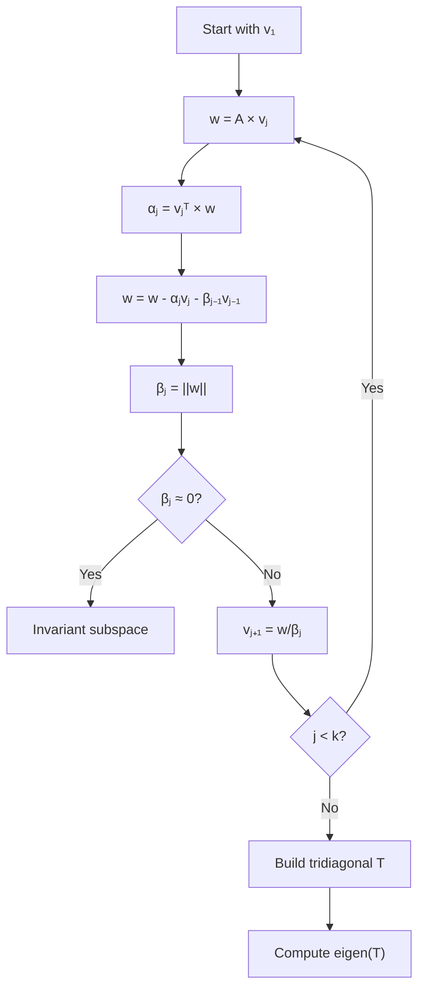

# Lanczos Algorithm for Eigenvectors

## Overview

| Property | Value |
|----------|-------|
| **Category** | Numerical Linear Algebra |
| **Problem** | Eigenvalue/Eigenvector Computation |
| **Complexity (Time)** | O(k × n) per iteration |
| **Complexity (Space)** | O(k × n) |
| **Best For** | Large sparse matrices |

## Description

The Lanczos algorithm is an iterative method for finding eigenvalues and eigenvectors of large symmetric (or Hermitian) matrices. It transforms the original matrix into a tridiagonal matrix through a sequence of orthogonal projections, making eigenvalue computation significantly more efficient.

In graph analysis, Lanczos is particularly valuable for computing graph Laplacian eigenvectors used in spectral clustering and graph partitioning.

## Mathematical Foundation

### Lanczos Iteration

Starting with a random unit vector $v_1$, the algorithm generates an orthonormal basis $\{v_1, v_2, \ldots, v_k\}$ for the Krylov subspace:

$$\mathcal{K}_k(A, v_1) = \text{span}\{v_1, Av_1, A^2v_1, \ldots, A^{k-1}v_1\}$$

### Three-Term Recurrence

The orthonormal vectors satisfy:
$$\beta_{j+1} v_{j+1} = Av_j - \alpha_j v_j - \beta_j v_{j-1}$$

Where:
- $\alpha_j = v_j^T A v_j$ (diagonal elements)
- $\beta_j = \|Av_{j-1} - \alpha_{j-1}v_{j-1} - \beta_{j-1}v_{j-2}\|$ (off-diagonal)

### Tridiagonal Matrix

After $k$ iterations, we obtain the tridiagonal matrix:

$$T_k = V_k^T A V_k = \begin{pmatrix}
\alpha_1 & \beta_2 & 0 & \cdots & 0 \\
\beta_2 & \alpha_2 & \beta_3 & \cdots & 0 \\
0 & \beta_3 & \alpha_3 & \cdots & 0 \\
\vdots & \vdots & \vdots & \ddots & \vdots \\
0 & 0 & 0 & \beta_k & \alpha_k
\end{pmatrix}$$

### Eigenvalue Approximation

The eigenvalues of $T_k$ (Ritz values) approximate the extreme eigenvalues of $A$:

$$\theta_i \approx \lambda_i \text{ for extreme eigenvalues}$$

The approximation error for the $i$-th eigenvalue:
$$|\lambda_i - \theta_i^{(k)}| \leq \frac{\|A\|}{C_k(\gamma_i)^2}$$

where $C_k$ is the Chebyshev polynomial and $\gamma_i$ depends on eigenvalue gaps.

## Algorithm

### Pseudocode

```
LANCZOS(A, k, v₁=None):
    n ← dimension of A
    
    // Initialize starting vector
    if v₁ is None:
        v₁ ← random unit vector of size n
    else:
        v₁ ← v₁ / ||v₁||
    
    // Initialize storage
    V ← matrix of k Lanczos vectors
    α ← array of k diagonal elements
    β ← array of k-1 off-diagonal elements
    
    V[:,1] ← v₁
    w ← A × v₁
    α[1] ← v₁ᵀ × w
    w ← w - α[1] × v₁
    
    for j = 2 to k:
        β[j-1] ← ||w||
        
        if β[j-1] ≈ 0:
            // Invariant subspace found
            break or restart with new random vector
        
        V[:,j] ← w / β[j-1]
        w ← A × V[:,j]
        α[j] ← V[:,j]ᵀ × w
        w ← w - α[j] × V[:,j] - β[j-1] × V[:,j-1]
        
        // Reorthogonalization (for numerical stability)
        for i = 1 to j:
            w ← w - (V[:,i]ᵀ × w) × V[:,i]
    
    // Build tridiagonal matrix
    T ← tridiagonal(α, β)
    
    // Compute eigenvalues of T
    eigenvalues, eigenvectors_T ← eigen(T)
    
    // Transform eigenvectors back
    eigenvectors ← V × eigenvectors_T
    
    return eigenvalues, eigenvectors
```

### Matrix-Vector Multiplication for Graphs

```
MULTIPLY-ADJACENCY-LIST(graph, vector):
    n ← number of vertices
    result ← zero vector of size n
    
    for each vertex v in graph:
        for each neighbor u in graph[v]:
            result[v] ← result[v] + vector[u]
    
    return result
```

## Complexity Analysis

### Time Complexity

| Operation | Complexity |
|-----------|------------|
| Single iteration | O(n + m) for sparse matrix |
| k iterations | O(k(n + m)) |
| Tridiagonal eigenvalues | O(k²) |
| Overall | O(kn) for sparse graphs |

### Space Complexity

| Component | Space |
|-----------|-------|
| Lanczos vectors | O(kn) |
| Tridiagonal matrix | O(k) |
| Working vectors | O(n) |

## Visual Representation

### Lanczos Iteration Process



### Tridiagonal Structure

```
     α₁  β₂   0   0   0
     β₂  α₂  β₃   0   0
T =   0  β₃  α₃  β₄   0
      0   0  β₄  α₄  β₅
      0   0   0  β₅  α₅
```

## Implementation

### Python Implementation

```python
import numpy as np
from typing import Optional


def validate_adjacency_list(graph: dict[int, list[int]]) -> bool:
    """
    Validate that graph is undirected (symmetric adjacency).
    
    >>> validate_adjacency_list({0: [1], 1: [0]})
    True
    >>> validate_adjacency_list({0: [1], 1: []})
    False
    """
    for v in graph:
        for u in graph[v]:
            if v not in graph.get(u, []):
                return False
    return True


def multiply_matrix_vector(
    graph: dict[int, list[int]],
    vector: np.ndarray
) -> np.ndarray:
    """
    Multiply adjacency matrix by vector using adjacency list.
    
    >>> graph = {0: [1, 2], 1: [0, 2], 2: [0, 1]}
    >>> v = np.array([1.0, 1.0, 1.0])
    >>> result = multiply_matrix_vector(graph, v)
    >>> np.allclose(result, [2.0, 2.0, 2.0])
    True
    """
    n = len(graph)
    result = np.zeros(n)
    
    for v in graph:
        for u in graph[v]:
            result[v] += vector[u]
    
    return result


def lanczos_iteration(
    graph: dict[int, list[int]],
    num_iterations: int,
    start_vector: Optional[np.ndarray] = None
) -> tuple[np.ndarray, np.ndarray]:
    """
    Perform Lanczos iteration on graph adjacency matrix.
    
    Args:
        graph: Undirected graph as adjacency list
        num_iterations: Number of Lanczos iterations (k)
        start_vector: Optional starting vector
    
    Returns:
        alpha: Diagonal elements of tridiagonal matrix
        beta: Off-diagonal elements
    
    >>> graph = {0: [1], 1: [0, 2], 2: [1]}
    >>> alpha, beta = lanczos_iteration(graph, 2)
    >>> len(alpha)
    2
    >>> len(beta)
    1
    """
    if not validate_adjacency_list(graph):
        raise ValueError("Graph must be undirected (symmetric)")
    
    n = len(graph)
    k = min(num_iterations, n)
    
    # Initialize
    alpha = np.zeros(k)
    beta = np.zeros(k - 1) if k > 1 else np.zeros(0)
    
    # Starting vector
    if start_vector is None:
        v = np.random.randn(n)
        v = v / np.linalg.norm(v)
    else:
        v = start_vector / np.linalg.norm(start_vector)
    
    v_prev = np.zeros(n)
    
    for j in range(k):
        # Matrix-vector product
        w = multiply_matrix_vector(graph, v)
        
        # Compute alpha
        alpha[j] = np.dot(v, w)
        
        # Orthogonalize
        w = w - alpha[j] * v
        if j > 0:
            w = w - beta[j - 1] * v_prev
        
        # Compute beta (if not last iteration)
        if j < k - 1:
            beta[j] = np.linalg.norm(w)
            
            if beta[j] < 1e-10:
                # Early termination - invariant subspace found
                alpha = alpha[:j + 1]
                beta = beta[:j]
                break
            
            # Update vectors
            v_prev = v.copy()
            v = w / beta[j]
    
    return alpha, beta


def build_tridiagonal(
    alpha: np.ndarray,
    beta: np.ndarray
) -> np.ndarray:
    """
    Build tridiagonal matrix from Lanczos coefficients.
    
    >>> alpha = np.array([1.0, 2.0, 3.0])
    >>> beta = np.array([0.5, 0.5])
    >>> T = build_tridiagonal(alpha, beta)
    >>> T.shape
    (3, 3)
    >>> T[0, 0]
    1.0
    >>> T[0, 1]
    0.5
    """
    k = len(alpha)
    T = np.diag(alpha)
    
    if len(beta) > 0:
        T += np.diag(beta, 1) + np.diag(beta, -1)
    
    return T


def find_lanczos_eigenvectors(
    graph: dict[int, list[int]],
    num_eigenvectors: int = 5
) -> tuple[np.ndarray, np.ndarray]:
    """
    Find approximate eigenvectors using Lanczos algorithm.
    
    Args:
        graph: Undirected graph as adjacency list
        num_eigenvectors: Number of eigenpairs to compute
    
    Returns:
        eigenvalues: Array of eigenvalues
        eigenvectors: Matrix of eigenvectors (columns)
    
    >>> graph = {0: [1, 2], 1: [0, 2], 2: [0, 1]}
    >>> vals, vecs = find_lanczos_eigenvectors(graph, 2)
    >>> len(vals)
    2
    """
    n = len(graph)
    k = min(num_eigenvectors * 2, n)  # Extra iterations for accuracy
    
    # Run Lanczos
    alpha, beta = lanczos_iteration(graph, k)
    
    # Build tridiagonal matrix
    T = build_tridiagonal(alpha, beta)
    
    # Eigendecomposition of tridiagonal matrix
    eigenvalues, eigenvectors = np.linalg.eigh(T)
    
    # Return requested number of eigenpairs
    num_return = min(num_eigenvectors, len(eigenvalues))
    
    return eigenvalues[:num_return], eigenvectors[:, :num_return]
```

### Full Lanczos with Eigenvector Recovery

```python
class LanczosEigensolver:
    """
    Complete Lanczos eigensolver for symmetric matrices.
    """
    
    def __init__(self, graph: dict[int, list[int]]):
        """
        Initialize with graph adjacency list.
        
        >>> graph = {0: [1, 2], 1: [0, 2], 2: [0, 1]}
        >>> solver = LanczosEigensolver(graph)
        >>> solver.n
        3
        """
        if not validate_adjacency_list(graph):
            raise ValueError("Graph must be undirected")
        
        self.graph = graph
        self.n = len(graph)
    
    def solve(
        self,
        num_eigenpairs: int,
        max_iterations: Optional[int] = None,
        tol: float = 1e-10
    ) -> tuple[np.ndarray, np.ndarray]:
        """
        Compute eigenvalues and eigenvectors.
        
        Args:
            num_eigenpairs: Number of eigenpairs to compute
            max_iterations: Maximum Lanczos iterations
            tol: Tolerance for convergence
        
        Returns:
            eigenvalues, eigenvectors
        """
        if max_iterations is None:
            max_iterations = min(self.n, num_eigenpairs * 3 + 10)
        
        k = min(max_iterations, self.n)
        
        # Initialize
        V = np.zeros((self.n, k))  # Lanczos vectors
        alpha = np.zeros(k)
        beta = np.zeros(k - 1)
        
        # Starting vector
        v = np.random.randn(self.n)
        v = v / np.linalg.norm(v)
        V[:, 0] = v
        
        # Lanczos iterations
        actual_k = k
        for j in range(k):
            # Matrix-vector product
            w = multiply_matrix_vector(self.graph, V[:, j])
            
            # Compute alpha_j
            alpha[j] = np.dot(V[:, j], w)
            
            # Orthogonalize against previous vectors
            w = w - alpha[j] * V[:, j]
            if j > 0:
                w = w - beta[j - 1] * V[:, j - 1]
            
            # Full reorthogonalization for numerical stability
            for i in range(j + 1):
                proj = np.dot(V[:, i], w)
                w = w - proj * V[:, i]
            
            # Compute beta
            if j < k - 1:
                beta[j] = np.linalg.norm(w)
                
                if beta[j] < tol:
                    actual_k = j + 1
                    break
                
                V[:, j + 1] = w / beta[j]
        
        # Truncate to actual iterations
        V = V[:, :actual_k]
        alpha = alpha[:actual_k]
        beta = beta[:actual_k - 1] if actual_k > 1 else np.zeros(0)
        
        # Build and diagonalize tridiagonal
        T = build_tridiagonal(alpha, beta)
        ritz_values, ritz_vectors = np.linalg.eigh(T)
        
        # Transform Ritz vectors to approximate eigenvectors
        eigenvectors = V @ ritz_vectors
        
        # Return requested number
        num_return = min(num_eigenpairs, len(ritz_values))
        
        return ritz_values[:num_return], eigenvectors[:, :num_return]
```

## Real-World Applications

### 1. Spectral Graph Clustering

```python
class SpectralClustering:
    """
    Graph clustering using Lanczos eigenvectors.
    """
    
    def __init__(self, graph: dict[int, list[int]]):
        self.graph = graph
        self.n = len(graph)
    
    def cluster(self, num_clusters: int) -> list[int]:
        """
        Partition graph into clusters using spectral method.
        
        Uses Fiedler vectors (smallest non-trivial eigenvectors
        of Laplacian matrix).
        """
        # Compute graph Laplacian eigenvectors
        laplacian_graph = self._create_laplacian_graph()
        
        solver = LanczosEigensolver(laplacian_graph)
        eigenvalues, eigenvectors = solver.solve(num_clusters + 1)
        
        # Use Fiedler vectors (skip first trivial eigenvector)
        embedding = eigenvectors[:, 1:num_clusters + 1]
        
        # k-means on embedding
        return self._kmeans(embedding, num_clusters)
    
    def _create_laplacian_graph(self) -> dict[int, list[int]]:
        """
        Create graph representation for L = D - A.
        
        For undirected graphs, modify adjacency for Laplacian computation.
        """
        # This is a simplified representation
        # In practice, would modify matrix-vector multiply
        return self.graph
    
    def _kmeans(
        self,
        data: np.ndarray,
        k: int,
        max_iter: int = 100
    ) -> list[int]:
        """Simple k-means clustering."""
        n = data.shape[0]
        
        # Random initialization
        indices = np.random.choice(n, k, replace=False)
        centroids = data[indices]
        
        for _ in range(max_iter):
            # Assign points to nearest centroid
            labels = []
            for i in range(n):
                distances = [
                    np.linalg.norm(data[i] - c)
                    for c in centroids
                ]
                labels.append(np.argmin(distances))
            
            # Update centroids
            new_centroids = np.zeros_like(centroids)
            for j in range(k):
                members = [i for i, l in enumerate(labels) if l == j]
                if members:
                    new_centroids[j] = np.mean(data[members], axis=0)
                else:
                    new_centroids[j] = centroids[j]
            
            if np.allclose(centroids, new_centroids):
                break
            
            centroids = new_centroids
        
        return labels
```

### 2. Graph Partitioning for Parallel Computing

```python
class GraphPartitioner:
    """
    Partition graph for distributed computing.
    """
    
    def __init__(self, graph: dict[int, list[int]]):
        self.graph = graph
        self.n = len(graph)
    
    def partition(self, num_parts: int) -> list[list[int]]:
        """
        Partition graph to minimize edge cuts.
        
        Uses recursive spectral bisection.
        """
        if num_parts == 1:
            return [list(range(self.n))]
        
        # Compute Fiedler vector
        solver = LanczosEigensolver(self.graph)
        _, eigenvectors = solver.solve(2)
        
        # Use sign of Fiedler vector to partition
        fiedler = eigenvectors[:, 1] if eigenvectors.shape[1] > 1 else eigenvectors[:, 0]
        
        median = np.median(fiedler)
        part1 = [i for i in range(self.n) if fiedler[i] <= median]
        part2 = [i for i in range(self.n) if fiedler[i] > median]
        
        # Balance partitions
        if len(part1) == 0:
            part1, part2 = part2[:1], part2[1:]
        elif len(part2) == 0:
            part1, part2 = part1[:-1], part1[-1:]
        
        if num_parts == 2:
            return [part1, part2]
        
        # Recursive bisection
        result = []
        
        # Partition each half
        subgraph1 = self._induced_subgraph(part1)
        subgraph2 = self._induced_subgraph(part2)
        
        partitioner1 = GraphPartitioner(subgraph1)
        partitioner2 = GraphPartitioner(subgraph2)
        
        parts_per_half = num_parts // 2
        
        for sub_part in partitioner1.partition(parts_per_half):
            result.append([part1[i] for i in sub_part])
        
        remaining = num_parts - parts_per_half
        for sub_part in partitioner2.partition(remaining):
            result.append([part2[i] for i in sub_part])
        
        return result
    
    def _induced_subgraph(
        self,
        vertices: list[int]
    ) -> dict[int, list[int]]:
        """Create induced subgraph on given vertices."""
        vertex_set = set(vertices)
        vertex_map = {v: i for i, v in enumerate(vertices)}
        
        subgraph = {i: [] for i in range(len(vertices))}
        
        for v in vertices:
            new_v = vertex_map[v]
            for u in self.graph[v]:
                if u in vertex_set:
                    subgraph[new_v].append(vertex_map[u])
        
        return subgraph
```

### 3. Network Centrality Analysis

```python
class SpectralCentrality:
    """
    Compute centrality measures using Lanczos.
    """
    
    def __init__(self, graph: dict[int, list[int]]):
        self.graph = graph
        self.n = len(graph)
    
    def eigenvector_centrality(self) -> dict[int, float]:
        """
        Compute eigenvector centrality using Lanczos.
        
        Returns centrality scores for each node.
        """
        solver = LanczosEigensolver(self.graph)
        
        # Get largest eigenvalue and eigenvector
        eigenvalues, eigenvectors = solver.solve(1)
        
        # Principal eigenvector gives centrality
        centrality = eigenvectors[:, 0]
        
        # Ensure positive values
        if np.sum(centrality) < 0:
            centrality = -centrality
        
        # Normalize
        centrality = np.abs(centrality)
        centrality = centrality / np.sum(centrality)
        
        return {i: centrality[i] for i in range(self.n)}
    
    def find_communities(
        self,
        num_communities: int = 2
    ) -> list[set[int]]:
        """
        Find communities using spectral analysis.
        """
        solver = LanczosEigensolver(self.graph)
        _, eigenvectors = solver.solve(num_communities)
        
        # Cluster based on eigenvector signs
        communities = [set() for _ in range(num_communities)]
        
        for v in range(self.n):
            # Assign to community based on largest component
            components = eigenvectors[v, :]
            community_idx = np.argmax(np.abs(components))
            communities[community_idx].add(v)
        
        return communities
```

## References

1. [Lanczos Algorithm - Wikipedia](https://en.wikipedia.org/wiki/Lanczos_algorithm)
2. Golub, G. H., & Van Loan, C. F. "Matrix Computations" (2013)
3. Parlett, B. N. "The Symmetric Eigenvalue Problem" (1998)
4. Trefethen, L. N., & Bau, D. "Numerical Linear Algebra" (1997)

## See Also

- [PageRank](pagerank.md) - Power iteration method
- [Spectral Clustering](spectral_clustering.md) - Graph clustering
- [Graph Partitioning](graph_partitioning.md) - Divide and conquer
