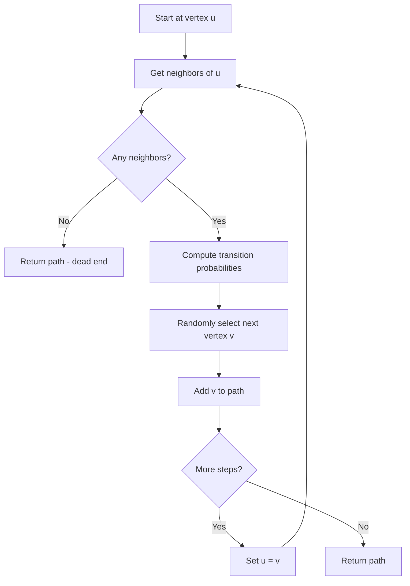
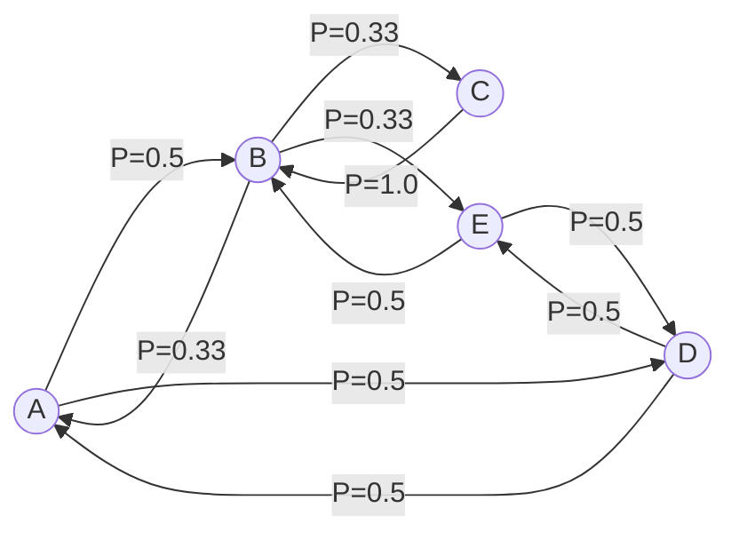

# Markov Chain (Random Walk)

## Overview

| Property | Value |
|----------|-------|
| **Category** | Probabilistic Graph Algorithms |
| **Complexity (Time)** | O(E) per step |
| **Complexity (Space)** | O(V) |
| **Graph Type** | Weighted/Unweighted, Directed/Undirected |
| **Best For** | Random sampling, PageRank, MCMC |

## Description

A Markov Chain on a graph is a stochastic process that describes transitions between vertices based on transition probabilities. In the context of graph algorithms, random walks follow edges with probabilities determined by edge weights or uniform distribution for unweighted graphs.

The Markov property states that the next state depends only on the current state, not on the sequence of states that preceded it (memoryless property).

## Mathematical Foundation

### Transition Probability

For an unweighted undirected graph:
$$P(u \rightarrow v) = \begin{cases} \frac{1}{\deg(u)} & \text{if } (u, v) \in E \\ 0 & \text{otherwise} \end{cases}$$

For a weighted graph:
$$P(u \rightarrow v) = \frac{w(u, v)}{\sum_{(u, x) \in E} w(u, x)}$$

### Transition Matrix

The transition matrix $P$ has entries:
$$P_{uv} = P(u \rightarrow v)$$

Properties:
- Row stochastic: $\sum_v P_{uv} = 1$ for all $u$
- Non-negative: $P_{uv} \geq 0$

### Stationary Distribution

A probability distribution $\pi$ is stationary if:
$$\pi P = \pi$$

For connected, non-bipartite graphs, the stationary distribution exists and is unique:
$$\pi_v = \frac{\deg(v)}{2|E|}$$

### Random Walk Length

Expected hitting time from $u$ to $v$:
$$H_{uv} = E[\text{steps to reach } v \text{ starting from } u]$$

Cover time (expected steps to visit all vertices):
$$C(G) = \max_u E[\text{steps to visit all vertices starting from } u]$$

For complete graph $K_n$:
$$C(K_n) = \Theta(n \log n)$$

## Algorithm

### Pseudocode

```
RANDOM_WALK(graph, start, steps):
    current ← start
    path ← [current]
    
    for i ← 1 to steps:
        neighbors ← graph.get_neighbors(current)
        
        if neighbors is empty:
            break  // Dead end
        
        // Select next vertex based on transition probabilities
        probabilities ← compute_transition_probs(current, neighbors)
        current ← weighted_random_choice(neighbors, probabilities)
        path.append(current)
    
    return path

COMPUTE_TRANSITION_PROBS(graph, u, neighbors):
    if graph is unweighted:
        return [1/len(neighbors)] * len(neighbors)
    else:
        weights ← [graph.weight(u, v) for v in neighbors]
        total ← sum(weights)
        return [w / total for w in weights]
```

### Step-by-Step Execution

```
Graph:
    A -- B -- C
    |    |
    D -- E

Random walk from A (5 steps):

Step 0: At A
  Neighbors: B, D (uniform probability 0.5 each)
  Random choice: B

Step 1: At B
  Neighbors: A, C, E (probability 1/3 each)
  Random choice: E

Step 2: At E
  Neighbors: B, D (probability 0.5 each)
  Random choice: D

Step 3: At D
  Neighbors: A, E (probability 0.5 each)
  Random choice: A

Step 4: At A
  Neighbors: B, D (probability 0.5 each)
  Random choice: D

Path: A → B → E → D → A → D
```

## Complexity Analysis

### Time Complexity

| Operation | Complexity |
|-----------|------------|
| Single step | O(degree(v)) |
| k steps | O(k × average_degree) |
| Compute stationary | O(V²) per iteration |

### Space Complexity

| Component | Complexity |
|-----------|------------|
| Transition matrix | O(V²) |
| Path storage | O(k) for k steps |
| Visit counts | O(V) |

## Visual Representation



### Transition Probabilities



## Implementation

### Python Implementation

```python
from __future__ import annotations
from collections import Counter
from random import choice


class MarkovChainGraphUndirectedUnweighted:
    """
    Markov Chain representation of undirected unweighted graph.
    
    Supports random walks and transition probability computation.
    """
    
    def __init__(self):
        self.connections: dict[str, list[str]] = {}
    
    def add_node(self, node: str) -> None:
        """
        Add a node to the graph.
        
        >>> mc = MarkovChainGraphUndirectedUnweighted()
        >>> mc.add_node("A")
        >>> "A" in mc.connections
        True
        """
        self.connections[node] = []
    
    def add_edge(self, node1: str, node2: str) -> None:
        """
        Add undirected edge between nodes.
        
        >>> mc = MarkovChainGraphUndirectedUnweighted()
        >>> mc.add_node("A")
        >>> mc.add_node("B")
        >>> mc.add_edge("A", "B")
        >>> "B" in mc.connections["A"]
        True
        """
        if node1 not in self.connections:
            self.add_node(node1)
        if node2 not in self.connections:
            self.add_node(node2)
        
        self.connections[node1].append(node2)
        self.connections[node2].append(node1)
    
    def get_transitions(
        self, 
        node: str, 
        num_steps: int = 100
    ) -> dict[str, float]:
        """
        Get transition probabilities via random walk.
        
        Returns empirical distribution of next states.
        
        >>> mc = MarkovChainGraphUndirectedUnweighted()
        >>> mc.add_node("A")
        >>> mc.add_node("B")
        >>> mc.add_edge("A", "B")
        >>> transitions = mc.get_transitions("A", 1000)
        >>> abs(transitions["B"] - 1.0) < 0.1
        True
        """
        if node not in self.connections:
            raise ValueError(f"Node {node} not in graph")
        
        if not self.connections[node]:
            return {}
        
        counts = Counter()
        current = node
        
        for _ in range(num_steps):
            neighbors = self.connections[current]
            if neighbors:
                next_node = choice(neighbors)
                if current == node:
                    counts[next_node] += 1
                current = next_node
            else:
                break
        
        total = sum(counts.values())
        return {k: v / total for k, v in counts.items()} if total > 0 else {}
    
    def random_walk(
        self, 
        start: str, 
        num_steps: int
    ) -> list[str]:
        """
        Perform random walk starting from given node.
        
        >>> mc = MarkovChainGraphUndirectedUnweighted()
        >>> mc.add_node("A")
        >>> mc.add_node("B")
        >>> mc.add_edge("A", "B")
        >>> path = mc.random_walk("A", 5)
        >>> len(path) <= 6
        True
        """
        path = [start]
        current = start
        
        for _ in range(num_steps):
            neighbors = self.connections.get(current, [])
            if not neighbors:
                break
            current = choice(neighbors)
            path.append(current)
        
        return path


if __name__ == "__main__":
    import doctest
    doctest.testmod()
```

### Extended Implementation with Weighted Edges

```python
from typing import Dict, List, Tuple, Optional
from collections import Counter
import random


class WeightedMarkovChain:
    """
    Markov Chain on weighted graphs.
    
    Transition probabilities proportional to edge weights.
    """
    
    def __init__(self):
        self.edges: Dict[str, List[Tuple[str, float]]] = {}
    
    def add_edge(self, u: str, v: str, weight: float = 1.0) -> None:
        """Add directed weighted edge."""
        if u not in self.edges:
            self.edges[u] = []
        self.edges[u].append((v, weight))
    
    def add_undirected_edge(self, u: str, v: str, weight: float = 1.0) -> None:
        """Add undirected weighted edge."""
        self.add_edge(u, v, weight)
        self.add_edge(v, u, weight)
    
    def get_transition_probs(self, node: str) -> Dict[str, float]:
        """
        Get exact transition probabilities from node.
        """
        if node not in self.edges or not self.edges[node]:
            return {}
        
        neighbors = self.edges[node]
        total_weight = sum(w for _, w in neighbors)
        
        return {v: w / total_weight for v, w in neighbors}
    
    def transition_matrix(self) -> Tuple[List[str], List[List[float]]]:
        """
        Build full transition matrix.
        """
        nodes = sorted(self.edges.keys())
        n = len(nodes)
        node_idx = {node: i for i, node in enumerate(nodes)}
        
        matrix = [[0.0] * n for _ in range(n)]
        
        for u in nodes:
            probs = self.get_transition_probs(u)
            for v, p in probs.items():
                if v in node_idx:
                    matrix[node_idx[u]][node_idx[v]] = p
        
        return nodes, matrix
    
    def random_walk(
        self, 
        start: str, 
        steps: int
    ) -> List[str]:
        """
        Perform weighted random walk.
        """
        path = [start]
        current = start
        
        for _ in range(steps):
            if current not in self.edges or not self.edges[current]:
                break
            
            neighbors = self.edges[current]
            total = sum(w for _, w in neighbors)
            
            r = random.random() * total
            cumulative = 0.0
            
            for v, w in neighbors:
                cumulative += w
                if r <= cumulative:
                    current = v
                    path.append(current)
                    break
        
        return path
    
    def hitting_time_estimate(
        self, 
        start: str, 
        target: str, 
        simulations: int = 1000,
        max_steps: int = 10000
    ) -> float:
        """
        Estimate hitting time via Monte Carlo simulation.
        """
        total_steps = 0
        hits = 0
        
        for _ in range(simulations):
            current = start
            for step in range(max_steps):
                if current == target:
                    total_steps += step
                    hits += 1
                    break
                
                if current not in self.edges or not self.edges[current]:
                    break
                
                # Transition
                neighbors = self.edges[current]
                total = sum(w for _, w in neighbors)
                r = random.random() * total
                cumulative = 0.0
                
                for v, w in neighbors:
                    cumulative += w
                    if r <= cumulative:
                        current = v
                        break
        
        return total_steps / hits if hits > 0 else float('inf')
```

## Real-World Applications

### 1. Web Crawler Simulation

```python
from typing import Dict, Set, List, Optional
from collections import Counter
import random
from dataclasses import dataclass
from urllib.parse import urlparse


@dataclass
class WebPage:
    """Web page with outgoing links."""
    url: str
    links: List[str]
    content_type: str = "text/html"


class RandomWebCrawler:
    """
    Simulate web crawling using random walks.
    
    Models web navigation as Markov Chain where
    transition probabilities depend on link structure.
    """
    
    def __init__(self, teleport_prob: float = 0.15):
        self.pages: Dict[str, WebPage] = {}
        self.teleport_prob = teleport_prob
    
    def add_page(self, page: WebPage) -> None:
        """Add page to web graph."""
        self.pages[page.url] = page
    
    def crawl_random_walk(
        self, 
        start_url: str,
        max_pages: int = 100
    ) -> List[str]:
        """
        Crawl using random walk strategy.
        """
        if start_url not in self.pages:
            return []
        
        visited = []
        current = start_url
        
        for _ in range(max_pages):
            visited.append(current)
            page = self.pages.get(current)
            
            if not page:
                # Teleport to random page
                current = random.choice(list(self.pages.keys()))
                continue
            
            # With probability teleport_prob, jump to random page
            if random.random() < self.teleport_prob:
                current = random.choice(list(self.pages.keys()))
                continue
            
            # Follow random link
            valid_links = [
                link for link in page.links 
                if link in self.pages
            ]
            
            if valid_links:
                current = random.choice(valid_links)
            else:
                # Dead end - teleport
                current = random.choice(list(self.pages.keys()))
        
        return visited
    
    def estimate_page_importance(
        self, 
        simulations: int = 1000,
        walk_length: int = 100
    ) -> Dict[str, float]:
        """
        Estimate page importance via visit frequency.
        
        Similar to PageRank using random walks.
        """
        visit_counts = Counter()
        
        for _ in range(simulations):
            start = random.choice(list(self.pages.keys()))
            path = self.crawl_random_walk(start, walk_length)
            visit_counts.update(path)
        
        total = sum(visit_counts.values())
        return {url: count / total for url, count in visit_counts.items()}
    
    def discover_structure(
        self, 
        start_url: str,
        max_steps: int = 1000
    ) -> Dict[str, Set[str]]:
        """
        Discover link structure through crawling.
        """
        discovered: Dict[str, Set[str]] = {}
        
        path = self.crawl_random_walk(start_url, max_steps)
        
        for url in path:
            if url not in discovered:
                discovered[url] = set()
            
            page = self.pages.get(url)
            if page:
                for link in page.links:
                    if link in self.pages:
                        discovered[url].add(link)
        
        return discovered


def demo_web_crawler():
    """Demo web crawler simulation."""
    crawler = RandomWebCrawler(teleport_prob=0.15)
    
    # Create sample web structure
    crawler.add_page(WebPage("home", ["about", "products", "blog"]))
    crawler.add_page(WebPage("about", ["home", "contact"]))
    crawler.add_page(WebPage("products", ["home", "product1", "product2"]))
    crawler.add_page(WebPage("product1", ["products", "cart"]))
    crawler.add_page(WebPage("product2", ["products", "cart"]))
    crawler.add_page(WebPage("cart", ["products", "checkout"]))
    crawler.add_page(WebPage("checkout", ["home"]))
    crawler.add_page(WebPage("blog", ["home", "post1", "post2"]))
    crawler.add_page(WebPage("post1", ["blog"]))
    crawler.add_page(WebPage("post2", ["blog"]))
    crawler.add_page(WebPage("contact", ["home"]))
    
    # Estimate importance
    importance = crawler.estimate_page_importance(1000, 50)
    
    print("Page Importance (Random Walk PageRank):")
    for url, score in sorted(importance.items(), key=lambda x: -x[1]):
        print(f"  {url}: {score:.4f}")
```

### 2. Recommendation System (Item-to-Item)

```python
from typing import Dict, List, Set, Tuple
from collections import Counter, defaultdict
import random


class RandomWalkRecommender:
    """
    Item recommendation using random walks on item graph.
    
    Items are connected based on co-purchase/co-view patterns.
    """
    
    def __init__(self, decay: float = 0.85):
        self.item_graph: Dict[str, Dict[str, float]] = defaultdict(dict)
        self.decay = decay
    
    def add_co_occurrence(
        self, 
        item1: str, 
        item2: str, 
        weight: float = 1.0
    ) -> None:
        """Add co-occurrence relationship between items."""
        self.item_graph[item1][item2] = (
            self.item_graph[item1].get(item2, 0) + weight
        )
        self.item_graph[item2][item1] = (
            self.item_graph[item2].get(item1, 0) + weight
        )
    
    def process_basket(self, items: List[str], weight: float = 1.0) -> None:
        """Process shopping basket - connect co-purchased items."""
        for i in range(len(items)):
            for j in range(i + 1, len(items)):
                self.add_co_occurrence(items[i], items[j], weight)
    
    def random_walk_from_items(
        self,
        seed_items: List[str],
        num_walks: int = 100,
        walk_length: int = 10
    ) -> Dict[str, float]:
        """
        Perform random walks from seed items.
        
        Returns item scores based on visit frequency.
        """
        visit_counts = Counter()
        
        for seed in seed_items:
            if seed not in self.item_graph:
                continue
            
            for _ in range(num_walks):
                current = seed
                
                for step in range(walk_length):
                    neighbors = self.item_graph.get(current, {})
                    
                    if not neighbors:
                        break
                    
                    # Weighted random selection
                    items = list(neighbors.keys())
                    weights = list(neighbors.values())
                    total = sum(weights)
                    
                    r = random.random() * total
                    cumulative = 0.0
                    
                    for item, weight in zip(items, weights):
                        cumulative += weight
                        if r <= cumulative:
                            current = item
                            # Apply decay
                            visit_counts[current] += self.decay ** step
                            break
        
        # Remove seed items from recommendations
        for seed in seed_items:
            visit_counts.pop(seed, None)
        
        # Normalize
        total = sum(visit_counts.values())
        return {k: v / total for k, v in visit_counts.items()} if total > 0 else {}
    
    def recommend(
        self, 
        user_history: List[str],
        num_recommendations: int = 5
    ) -> List[Tuple[str, float]]:
        """
        Generate recommendations based on user history.
        """
        scores = self.random_walk_from_items(user_history)
        
        sorted_items = sorted(scores.items(), key=lambda x: -x[1])
        return sorted_items[:num_recommendations]


def demo_recommendations():
    """Demo random walk recommendations."""
    recommender = RandomWalkRecommender(decay=0.85)
    
    # Process transaction history
    transactions = [
        ["laptop", "mouse", "keyboard"],
        ["laptop", "monitor", "mouse"],
        ["phone", "case", "charger"],
        ["laptop", "bag", "mouse"],
        ["phone", "headphones", "case"],
        ["keyboard", "mouse", "monitor"],
    ]
    
    for basket in transactions:
        recommender.process_basket(basket)
    
    # Get recommendations for user who bought laptop
    recs = recommender.recommend(["laptop"], num_recommendations=3)
    
    print("Recommendations for laptop buyer:")
    for item, score in recs:
        print(f"  {item}: {score:.4f}")
```

### 3. Network Influence Estimation

```python
from typing import Dict, List, Set, Tuple
from collections import Counter
import random


class NetworkInfluenceEstimator:
    """
    Estimate node influence in social network using random walks.
    
    Nodes with higher visit frequency are more influential.
    """
    
    def __init__(self):
        self.followers: Dict[str, Set[str]] = {}  # user -> followers
        self.following: Dict[str, Set[str]] = {}  # user -> following
    
    def add_follow(self, follower: str, followed: str) -> None:
        """Add follow relationship."""
        if followed not in self.followers:
            self.followers[followed] = set()
        self.followers[followed].add(follower)
        
        if follower not in self.following:
            self.following[follower] = set()
        self.following[follower].add(followed)
    
    def reverse_random_walk(
        self,
        start: str,
        walk_length: int
    ) -> List[str]:
        """
        Random walk following follower edges (backward).
        
        Reaches influential nodes that many paths lead to.
        """
        path = [start]
        current = start
        
        for _ in range(walk_length):
            followers = self.followers.get(current, set())
            
            if not followers:
                # Teleport to random node
                all_users = set(self.followers.keys()) | set(self.following.keys())
                if all_users:
                    current = random.choice(list(all_users))
                    path.append(current)
            else:
                current = random.choice(list(followers))
                path.append(current)
        
        return path
    
    def estimate_influence(
        self,
        num_walks: int = 1000,
        walk_length: int = 10
    ) -> Dict[str, float]:
        """
        Estimate influence scores for all users.
        """
        visit_counts = Counter()
        all_users = list(set(self.followers.keys()) | set(self.following.keys()))
        
        if not all_users:
            return {}
        
        for _ in range(num_walks):
            start = random.choice(all_users)
            path = self.reverse_random_walk(start, walk_length)
            visit_counts.update(path)
        
        total = sum(visit_counts.values())
        return {user: count / total for user, count in visit_counts.items()}
    
    def find_top_influencers(
        self, 
        top_k: int = 10
    ) -> List[Tuple[str, float]]:
        """Get top-k most influential users."""
        scores = self.estimate_influence()
        return sorted(scores.items(), key=lambda x: -x[1])[:top_k]


def demo_influence():
    """Demo influence estimation."""
    estimator = NetworkInfluenceEstimator()
    
    # Build social network
    follows = [
        ("user1", "influencer"),
        ("user2", "influencer"),
        ("user3", "influencer"),
        ("user4", "influencer"),
        ("user5", "influencer"),
        ("user1", "user2"),
        ("user3", "user2"),
        ("user4", "celebrity"),
        ("user5", "celebrity"),
        ("influencer", "celebrity"),
    ]
    
    for follower, followed in follows:
        estimator.add_follow(follower, followed)
    
    influencers = estimator.find_top_influencers(5)
    
    print("Top Influencers:")
    for user, score in influencers:
        print(f"  {user}: {score:.4f}")
```

## References

1. Lovász, L. "Random Walks on Graphs: A Survey"
2. [Markov chain - Wikipedia](https://en.wikipedia.org/wiki/Markov_chain)
3. Motwani, R., Raghavan, P. "Randomized Algorithms" (Chapter 6)
4. [Random walk - Wikipedia](https://en.wikipedia.org/wiki/Random_walk)

## See Also

- [PageRank](pagerank.md) - Stationary distribution of random walks
- [BFS (Breadth-First Search)](breadth_first_search.md) - Deterministic traversal
- [DFS (Depth-First Search)](depth_first_search.md) - Deterministic traversal
