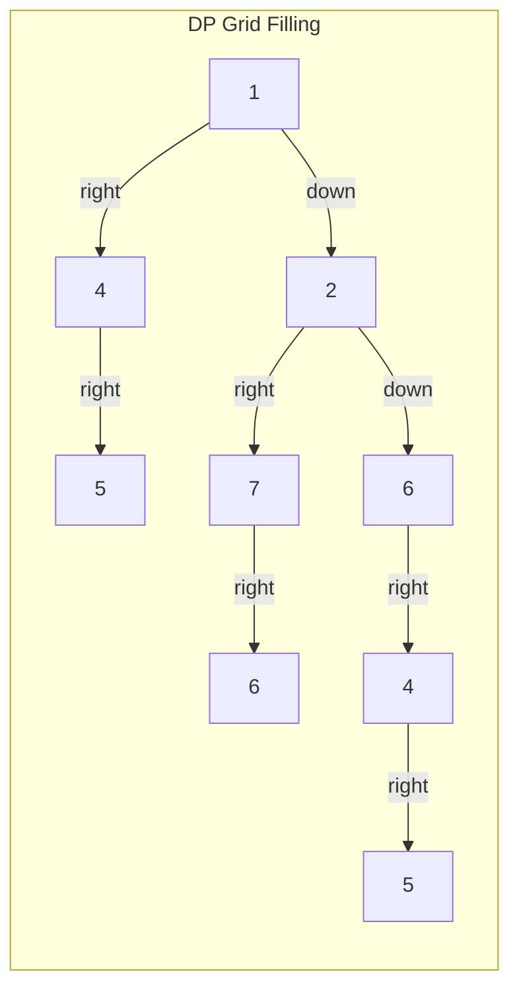
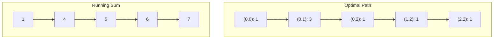

# Minimum Path Sum

## Overview

| Property | Value |
|----------|-------|
| **Category** | Dynamic Programming / Grid Traversal |
| **Complexity (Time)** | O(m × n) |
| **Complexity (Space)** | O(n) optimized, O(m × n) naive |
| **Movement** | Right or Down only |
| **Best For** | Grid pathfinding with costs |

## Description

The Minimum Path Sum problem finds the path from the top-left corner to the bottom-right corner of a grid that minimizes the sum of values along the path. Movement is restricted to right or down directions only.

This is a classic dynamic programming problem with applications in route optimization, image processing, and game development.

## Mathematical Foundation

### Recurrence Relation

Let $dp[i][j]$ be the minimum sum to reach cell $(i, j)$:

$$dp[i][j] = grid[i][j] + \min(dp[i-1][j], dp[i][j-1])$$

### Base Cases

First row (can only come from left):
$$dp[0][j] = \sum_{k=0}^{j} grid[0][k]$$

First column (can only come from above):
$$dp[i][0] = \sum_{k=0}^{i} grid[k][0]$$

### Optimal Substructure

The minimum path to $(i, j)$ must pass through either $(i-1, j)$ or $(i, j-1)$, and the path to that cell must also be optimal.

### Number of Paths

Total paths without considering cost:
$$\binom{m + n - 2}{m - 1} = \frac{(m + n - 2)!}{(m - 1)!(n - 1)!}$$

## Algorithm

### Pseudocode

```
MIN-PATH-SUM(grid):
    m ← rows(grid)
    n ← cols(grid)
    
    // Fill first row (cumulative sum)
    for j = 1 to n-1:
        grid[0][j] += grid[0][j-1]
    
    // Fill remaining rows
    for i = 1 to m-1:
        // First column
        grid[i][0] += grid[i-1][0]
        
        // Rest of row
        for j = 1 to n-1:
            grid[i][j] += min(grid[i-1][j], grid[i][j-1])
    
    return grid[m-1][n-1]
```

### Space-Optimized Version

```
MIN-PATH-SUM-OPTIMIZED(grid):
    m ← rows(grid)
    n ← cols(grid)
    
    // Use only two rows
    prev_row ← grid[0]
    
    // Cumulative sum for first row
    for j = 1 to n-1:
        prev_row[j] += prev_row[j-1]
    
    for i = 1 to m-1:
        curr_row ← copy of grid[i]
        curr_row[0] += prev_row[0]
        
        for j = 1 to n-1:
            curr_row[j] += min(prev_row[j], curr_row[j-1])
        
        prev_row ← curr_row
    
    return prev_row[n-1]
```

### Step-by-Step Example

```
Grid:
[1, 3, 1]
[1, 5, 1]
[4, 2, 1]

Step 1 - Initialize first row:
[1, 4, 5]   (cumulative: 1, 1+3=4, 4+1=5)
[1, 5, 1]
[4, 2, 1]

Step 2 - Fill row 1:
[1, 4, 5]
[2, 7, 6]   (1+1=2, min(4,2)+5=7, min(5,7)+1=6)
[4, 2, 1]

Step 3 - Fill row 2:
[1, 4, 5]
[2, 7, 6]
[6, 4, 5]   (2+4=6, min(7,6)+2=4, min(6,4)+1=5)

Minimum path sum: 7
Path: (0,0)→(0,1)→(0,2)→(1,2)→(2,2)
      1 + 3 + 1 + 1 + 1 = 7
```

## Complexity Analysis

### Time Complexity

| Variant | Complexity |
|---------|------------|
| In-place modification | O(m × n) |
| New DP array | O(m × n) |
| With path reconstruction | O(m × n) |

### Space Complexity

| Variant | Space |
|---------|-------|
| In-place | O(1) extra |
| Two rows | O(n) |
| Full DP table | O(m × n) |

## Visual Representation



### Optimal Path



## Implementation

### Python Implementation (In-Place)

```python
def min_path_sum(grid: list[list[int]]) -> int:
    """
    Find minimum path sum from top-left to bottom-right.
    
    Args:
        grid: 2D grid of non-negative integers
    
    Returns:
        Minimum sum along any valid path
    
    Examples:
        >>> min_path_sum([[1, 3, 1], [1, 5, 1], [4, 2, 1]])
        7
        >>> min_path_sum([[1, 2, 3], [4, 5, 6]])
        12
    
    Raises:
        TypeError: If grid is None or empty
    """
    if not grid or not grid[0]:
        raise TypeError("The grid does not contain the appropriate information")
    
    rows = len(grid)
    cols = len(grid[0])
    
    # Fill first row with cumulative sums
    for j in range(1, cols):
        grid[0][j] += grid[0][j - 1]
    
    # Fill remaining rows
    for i in range(1, rows):
        # First column: can only come from above
        grid[i][0] += grid[i - 1][0]
        
        # Rest of columns: minimum of above or left
        for j in range(1, cols):
            grid[i][j] += min(grid[i - 1][j], grid[i][j - 1])
    
    return grid[rows - 1][cols - 1]


def fill_row(current_row: list[int], row_above: list[int]) -> list[int]:
    """
    Fill a row based on the row above.
    
    Examples:
        >>> fill_row([2, 2, 2], [1, 2, 3])
        [3, 4, 5]
    """
    current_row[0] += row_above[0]
    
    for j in range(1, len(current_row)):
        current_row[j] += min(current_row[j - 1], row_above[j])
    
    return current_row
```

### Space-Optimized Implementation

```python
def min_path_sum_optimized(grid: list[list[int]]) -> int:
    """
    Space-optimized minimum path sum using O(n) extra space.
    
    Examples:
        >>> min_path_sum_optimized([[1, 3, 1], [1, 5, 1], [4, 2, 1]])
        7
    """
    if not grid or not grid[0]:
        raise TypeError("Grid cannot be empty")
    
    rows = len(grid)
    cols = len(grid[0])
    
    # Initialize with first row
    dp = grid[0].copy()
    
    # Cumulative sum for first row
    for j in range(1, cols):
        dp[j] += dp[j - 1]
    
    # Process remaining rows
    for i in range(1, rows):
        dp[0] += grid[i][0]  # First column
        
        for j in range(1, cols):
            dp[j] = grid[i][j] + min(dp[j], dp[j - 1])
    
    return dp[cols - 1]
```

### With Path Reconstruction

```python
def min_path_sum_with_path(
    grid: list[list[int]]
) -> tuple[int, list[tuple[int, int]]]:
    """
    Find minimum path sum and reconstruct the path.
    
    Returns:
        (minimum_sum, path as list of (row, col) tuples)
    
    Examples:
        >>> cost, path = min_path_sum_with_path([[1, 3, 1], [1, 5, 1], [4, 2, 1]])
        >>> cost
        7
        >>> path
        [(0, 0), (0, 1), (0, 2), (1, 2), (2, 2)]
    """
    if not grid or not grid[0]:
        raise TypeError("Grid cannot be empty")
    
    rows = len(grid)
    cols = len(grid[0])
    
    # Create DP table
    dp = [[0] * cols for _ in range(rows)]
    dp[0][0] = grid[0][0]
    
    # Fill first row
    for j in range(1, cols):
        dp[0][j] = dp[0][j - 1] + grid[0][j]
    
    # Fill first column
    for i in range(1, rows):
        dp[i][0] = dp[i - 1][0] + grid[i][0]
    
    # Fill rest
    for i in range(1, rows):
        for j in range(1, cols):
            dp[i][j] = grid[i][j] + min(dp[i - 1][j], dp[i][j - 1])
    
    # Reconstruct path (backtrack from bottom-right)
    path = []
    i, j = rows - 1, cols - 1
    
    while i > 0 or j > 0:
        path.append((i, j))
        
        if i == 0:
            j -= 1
        elif j == 0:
            i -= 1
        elif dp[i - 1][j] < dp[i][j - 1]:
            i -= 1
        else:
            j -= 1
    
    path.append((0, 0))
    path.reverse()
    
    return dp[rows - 1][cols - 1], path
```

## Real-World Applications

### 1. Image Seam Carving

```python
import numpy as np


class SeamCarver:
    """
    Content-aware image resizing using minimum path sum.
    """
    
    def __init__(self, energy_map: list[list[float]]):
        """
        Args:
            energy_map: 2D array of pixel importance values
        """
        self.energy = energy_map
        self.rows = len(energy_map)
        self.cols = len(energy_map[0])
    
    def find_vertical_seam(self) -> list[int]:
        """
        Find minimum energy vertical seam.
        
        Returns:
            Column indices for each row forming the seam
        """
        # DP table for minimum energy to reach each cell
        dp = [[float('inf')] * self.cols for _ in range(self.rows)]
        
        # Initialize first row
        for j in range(self.cols):
            dp[0][j] = self.energy[0][j]
        
        # Fill DP table (can come from above-left, above, above-right)
        for i in range(1, self.rows):
            for j in range(self.cols):
                candidates = [dp[i - 1][j]]  # Directly above
                
                if j > 0:
                    candidates.append(dp[i - 1][j - 1])  # Above-left
                if j < self.cols - 1:
                    candidates.append(dp[i - 1][j + 1])  # Above-right
                
                dp[i][j] = self.energy[i][j] + min(candidates)
        
        # Find minimum in last row
        seam = [0] * self.rows
        seam[-1] = dp[-1].index(min(dp[-1]))
        
        # Backtrack
        for i in range(self.rows - 2, -1, -1):
            j = seam[i + 1]
            candidates = [(dp[i][j], j)]
            
            if j > 0:
                candidates.append((dp[i][j - 1], j - 1))
            if j < self.cols - 1:
                candidates.append((dp[i][j + 1], j + 1))
            
            seam[i] = min(candidates)[1]
        
        return seam
    
    def seam_energy(self, seam: list[int]) -> float:
        """Calculate total energy of a seam."""
        return sum(self.energy[i][seam[i]] for i in range(self.rows))
```

### 2. Robot Navigation Cost

```python
class RobotPathPlanner:
    """
    Find minimum cost path for robot in terrain grid.
    """
    
    def __init__(self, terrain_cost: list[list[float]]):
        """
        Args:
            terrain_cost: Cost to traverse each cell
        """
        self.cost = terrain_cost
        self.rows = len(terrain_cost)
        self.cols = len(terrain_cost[0])
    
    def plan_path(self) -> tuple[float, list[tuple[int, int]]]:
        """
        Plan minimum cost path from start to goal.
        
        >>> planner = RobotPathPlanner([[1, 2, 3], [4, 1, 1], [2, 2, 1]])
        >>> cost, path = planner.plan_path()
        >>> cost
        5
        """
        total_cost, path = min_path_sum_with_path(self.cost)
        return total_cost, path
    
    def estimate_energy(self, battery_per_unit: float) -> float:
        """Estimate battery usage for optimal path."""
        cost, _ = self.plan_path()
        return cost * battery_per_unit
    
    def get_waypoints(self, interval: int) -> list[tuple[int, int]]:
        """Get waypoints along optimal path at given interval."""
        _, path = self.plan_path()
        return path[::interval] + [path[-1]]
```

### 3. Supply Chain Route Optimization

```python
from dataclasses import dataclass


@dataclass
class City:
    name: str
    row: int
    col: int


class SupplyChainOptimizer:
    """
    Optimize delivery route through city grid.
    """
    
    def __init__(
        self,
        transport_costs: list[list[float]],
        cities: list[City]
    ):
        self.costs = transport_costs
        self.cities = {(c.row, c.col): c for c in cities}
    
    def optimal_route(self) -> tuple[float, list[str]]:
        """
        Find optimal delivery route.
        
        Returns:
            (total_cost, list of city names on route)
        """
        cost, path = min_path_sum_with_path(self.costs)
        
        # Extract city names from path
        route = []
        for pos in path:
            if pos in self.cities:
                route.append(self.cities[pos].name)
        
        return cost, route
    
    def cost_breakdown(self) -> dict[str, float]:
        """Get cost breakdown by segment."""
        _, path = min_path_sum_with_path(self.costs)
        
        breakdown = {}
        for i in range(len(path) - 1):
            r1, c1 = path[i]
            r2, c2 = path[i + 1]
            segment = f"({r1},{c1}) -> ({r2},{c2})"
            breakdown[segment] = self.costs[r2][c2]
        
        return breakdown
```

### 4. Game Level Design

```python
class GamePathAnalyzer:
    """
    Analyze difficulty of game level based on obstacle costs.
    """
    
    def __init__(self, level_grid: list[list[int]]):
        """
        Args:
            level_grid: Cost/difficulty for each tile
        """
        self.grid = level_grid
    
    def minimum_difficulty_path(self) -> tuple[int, list[tuple[int, int]]]:
        """Find easiest path through level."""
        return min_path_sum_with_path(self.grid)
    
    def difficulty_rating(self) -> str:
        """Rate level difficulty based on minimum path."""
        cost, _ = self.minimum_difficulty_path()
        
        # Normalize by path length
        rows, cols = len(self.grid), len(self.grid[0])
        path_length = rows + cols - 1
        avg_cost = cost / path_length
        
        if avg_cost < 2:
            return "Easy"
        elif avg_cost < 4:
            return "Medium"
        elif avg_cost < 6:
            return "Hard"
        else:
            return "Expert"
    
    def bottleneck_cells(self, threshold: float) -> list[tuple[int, int]]:
        """Find high-cost cells on optimal path."""
        _, path = self.minimum_difficulty_path()
        return [(r, c) for r, c in path if self.grid[r][c] > threshold]
```

## Variations

### Maximum Path Sum

```python
def max_path_sum(grid: list[list[int]]) -> int:
    """Find maximum path sum (same structure, use max instead of min)."""
    if not grid or not grid[0]:
        return 0
    
    rows, cols = len(grid), len(grid[0])
    dp = [[0] * cols for _ in range(rows)]
    dp[0][0] = grid[0][0]
    
    for j in range(1, cols):
        dp[0][j] = dp[0][j-1] + grid[0][j]
    
    for i in range(1, rows):
        dp[i][0] = dp[i-1][0] + grid[i][0]
    
    for i in range(1, rows):
        for j in range(1, cols):
            dp[i][j] = grid[i][j] + max(dp[i-1][j], dp[i][j-1])
    
    return dp[rows-1][cols-1]
```

### Four-Direction Movement

```python
import heapq


def min_path_sum_4dir(grid: list[list[int]]) -> int:
    """
    Minimum path sum with movement in all 4 directions.
    Uses Dijkstra's algorithm.
    """
    if not grid or not grid[0]:
        return 0
    
    rows, cols = len(grid), len(grid[0])
    dist = [[float('inf')] * cols for _ in range(rows)]
    dist[0][0] = grid[0][0]
    
    heap = [(grid[0][0], 0, 0)]  # (cost, row, col)
    directions = [(0, 1), (1, 0), (0, -1), (-1, 0)]
    
    while heap:
        cost, r, c = heapq.heappop(heap)
        
        if r == rows - 1 and c == cols - 1:
            return cost
        
        if cost > dist[r][c]:
            continue
        
        for dr, dc in directions:
            nr, nc = r + dr, c + dc
            if 0 <= nr < rows and 0 <= nc < cols:
                new_cost = cost + grid[nr][nc]
                if new_cost < dist[nr][nc]:
                    dist[nr][nc] = new_cost
                    heapq.heappush(heap, (new_cost, nr, nc))
    
    return dist[rows-1][cols-1]
```

## References

1. [Minimum Path Sum - LeetCode](https://leetcode.com/problems/minimum-path-sum/)
2. Cormen, T.H. "Introduction to Algorithms" - Dynamic Programming
3. [Dynamic Programming Patterns](https://en.wikipedia.org/wiki/Dynamic_programming)

## See Also

- [Dijkstra's Algorithm](dijkstra.md) - Weighted shortest paths
- [A* Search](a_star.md) - Heuristic pathfinding
- [Floyd-Warshall](floyd_warshall.md) - All-pairs shortest paths
