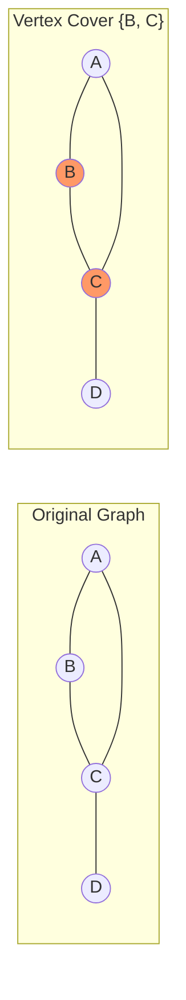
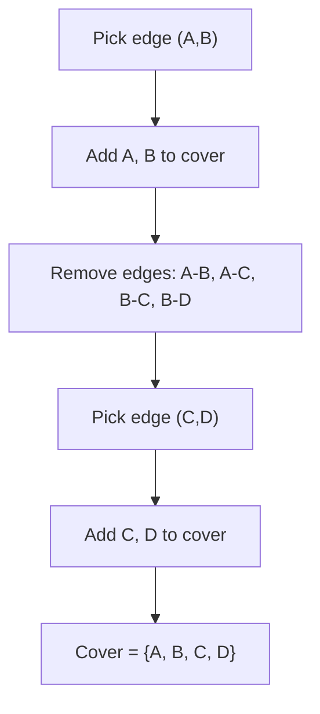

# Minimum Vertex Cover

## Overview

| Property | Value |
|----------|-------|
| **Category** | Graph Theory / Approximation |
| **Problem Class** | NP-Hard |
| **Approximation Ratio** | 2-approximation |
| **Greedy Ratio** | O(log n) |
| **Best For** | Network security, sensor placement |

## Description

The Minimum Vertex Cover problem asks for the smallest set of vertices such that every edge in the graph has at least one endpoint in the set. This is a classic NP-hard optimization problem with important applications in network design and security.

Since finding the exact minimum is computationally intractable for large graphs, we use approximation algorithms that provide solutions within a guaranteed factor of optimal.

## Mathematical Foundation

### Formal Definition

Given an undirected graph $G = (V, E)$, find the smallest subset $C \subseteq V$ such that:

$$\forall (u, v) \in E: u \in C \lor v \in C$$

### LP Relaxation

The integer linear program for vertex cover:

$$\min \sum_{v \in V} x_v$$

Subject to:
$$x_u + x_v \geq 1, \quad \forall (u, v) \in E$$
$$x_v \in \{0, 1\}, \quad \forall v \in V$$

### Approximation Guarantee

**Theorem (Matching Algorithm):** The matching-based algorithm achieves a 2-approximation.

**Proof:** Let $M$ be a maximal matching. The algorithm selects $2|M|$ vertices. Any vertex cover must include at least one endpoint from each edge in $M$, so $OPT \geq |M|$. Therefore:
$$|C_{alg}| = 2|M| \leq 2 \cdot OPT$$

### Relationship to Maximum Matching

For a graph $G = (V, E)$:
$$|V| = |C_{min}| + |I_{max}|$$

Where $I_{max}$ is the maximum independent set (complement of vertex cover).

## Algorithms

### 1. Greedy Algorithm

```
GREEDY-VERTEX-COVER(graph):
    cover ← empty set
    // Priority queue: vertex ranked by degree
    queue ← priority queue of (degree, vertex) pairs
    
    while edges remain:
        v ← extract vertex with maximum degree
        cover.add(v)
        remove all edges incident to v
        update degrees in queue
    
    return cover
```

### 2. Matching-Based Algorithm (2-Approximation)

```
MATCHING-VERTEX-COVER(graph):
    cover ← empty set
    edges ← all edges in graph
    
    while edges is not empty:
        (u, v) ← pick arbitrary edge from edges
        cover.add(u)
        cover.add(v)
        remove all edges incident to u or v
    
    return cover
```

## Complexity Analysis

### Time Complexity

| Algorithm | Complexity |
|-----------|------------|
| Greedy (with heap) | O(E log V) |
| Matching-based | O(E) |
| Exact (brute force) | O(2^V) |

### Space Complexity

| Algorithm | Space |
|-----------|-------|
| Greedy | O(V + E) |
| Matching | O(V + E) |

## Visual Representation



### Matching Algorithm Steps



## Implementation

### Greedy Algorithm

```python
import heapq


def greedy_min_vertex_cover(graph: dict[int, list[int]]) -> set[int]:
    """
    Greedy approximation algorithm for minimum vertex cover.
    
    Repeatedly selects the vertex with highest degree.
    
    Args:
        graph: Adjacency list representation
    
    Returns:
        Set of vertices forming the cover
    
    Examples:
        >>> graph = {0: [1, 3], 1: [0, 3], 2: [0, 3, 4], 3: [0, 1, 2], 4: [2, 3]}
        >>> cover = greedy_min_vertex_cover(graph)
        >>> len(cover) <= 5  # At most all vertices
        True
    """
    # Create mutable copy of adjacency lists
    adj = {v: list(neighbors) for v, neighbors in graph.items()}
    
    # Priority queue: (-degree, vertex) for max-heap behavior
    queue = []
    for vertex, neighbors in adj.items():
        heapq.heappush(queue, [-len(neighbors), vertex])
    
    cover = set()
    
    while queue and queue[0][0] != 0:
        # Extract vertex with maximum degree
        _, vertex = heapq.heappop(queue)
        
        if vertex in cover:
            continue
        
        # Check if vertex still has edges
        if not adj[vertex]:
            continue
        
        cover.add(vertex)
        
        # Remove all edges incident to this vertex
        for neighbor in adj[vertex]:
            if neighbor in adj:
                if vertex in adj[neighbor]:
                    adj[neighbor].remove(vertex)
        adj[vertex] = []
        
        # Rebuild heap with updated degrees
        queue = []
        for v, neighbors in adj.items():
            if v not in cover and neighbors:
                heapq.heappush(queue, [-len(neighbors), v])
    
    return cover
```

### Matching-Based Algorithm

```python
def matching_min_vertex_cover(graph: dict[int, list[int]]) -> set[int]:
    """
    2-approximation algorithm using maximal matching.
    
    Args:
        graph: Adjacency list representation
    
    Returns:
        Set of vertices forming the cover
    
    Examples:
        >>> graph = {0: [1, 3], 1: [0, 3], 2: [0, 3, 4], 3: [0, 1, 2], 4: [2, 3]}
        >>> cover = matching_min_vertex_cover(graph)
        >>> all(u in cover or v in cover 
        ...     for u, neighbors in graph.items() for v in neighbors)
        True
    """
    cover = set()
    
    # Get all edges as a set of frozensets
    edges = set()
    for u, neighbors in graph.items():
        for v in neighbors:
            if u < v:  # Avoid duplicates
                edges.add((u, v))
    
    edges = set(edges)  # Mutable copy
    
    while edges:
        # Pick arbitrary edge
        u, v = edges.pop()
        
        # Add both endpoints to cover
        cover.add(u)
        cover.add(v)
        
        # Remove all edges incident to u or v
        edges = {(a, b) for a, b in edges 
                 if a != u and a != v and b != u and b != v}
    
    return cover


def get_edges(graph: dict[int, list[int]]) -> set[tuple[int, int]]:
    """
    Extract all edges from adjacency list.
    
    Examples:
        >>> graph = {0: [1, 2], 1: [0], 2: [0]}
        >>> sorted(get_edges(graph))
        [(0, 1), (0, 2)]
    """
    edges = set()
    for u, neighbors in graph.items():
        for v in neighbors:
            edge = (min(u, v), max(u, v))
            edges.add(edge)
    return edges
```

### Optimal Algorithm (Small Graphs)

```python
from itertools import combinations


def exact_min_vertex_cover(graph: dict[int, list[int]]) -> set[int]:
    """
    Find exact minimum vertex cover (exponential time).
    Only practical for small graphs.
    
    Examples:
        >>> graph = {0: [1, 2], 1: [0, 2], 2: [0, 1]}
        >>> cover = exact_min_vertex_cover(graph)
        >>> len(cover)
        2
    """
    vertices = list(graph.keys())
    edges = get_edges(graph)
    
    def is_cover(subset: set) -> bool:
        return all(u in subset or v in subset for u, v in edges)
    
    # Try subsets of increasing size
    for size in range(len(vertices) + 1):
        for subset in combinations(vertices, size):
            if is_cover(set(subset)):
                return set(subset)
    
    return set(vertices)  # Fallback
```

## Real-World Applications

### 1. Network Security Monitoring

```python
class NetworkMonitor:
    """
    Place minimum sensors to monitor all network links.
    """
    
    def __init__(self, topology: dict[str, list[str]]):
        """
        Args:
            topology: Network adjacency list (router -> connected routers)
        """
        self.topology = topology
        # Map names to integers
        self.nodes = list(topology.keys())
        self.node_to_idx = {n: i for i, n in enumerate(self.nodes)}
    
    def find_monitor_locations(self) -> list[str]:
        """
        Find minimum set of routers to place monitors.
        
        >>> network = {
        ...     'R1': ['R2', 'R3'],
        ...     'R2': ['R1', 'R4'],
        ...     'R3': ['R1', 'R4'],
        ...     'R4': ['R2', 'R3', 'R5'],
        ...     'R5': ['R4']
        ... }
        >>> monitor = NetworkMonitor(network)
        >>> locations = monitor.find_monitor_locations()
        >>> len(locations) <= 5
        True
        """
        # Convert to integer graph
        int_graph = {}
        for node, neighbors in self.topology.items():
            idx = self.node_to_idx[node]
            int_graph[idx] = [self.node_to_idx[n] for n in neighbors]
        
        # Find vertex cover
        cover_indices = matching_min_vertex_cover(int_graph)
        
        # Convert back to names
        return [self.nodes[i] for i in cover_indices]
    
    def monitoring_cost(self, cost_per_monitor: float) -> float:
        """Calculate total monitoring cost."""
        locations = self.find_monitor_locations()
        return len(locations) * cost_per_monitor
```

### 2. Wireless Sensor Coverage

```python
from dataclasses import dataclass


@dataclass
class Sensor:
    id: int
    x: float
    y: float
    range: float


class SensorPlacement:
    """
    Place minimum sensors to cover all communication links.
    """
    
    def __init__(self, sensors: list[Sensor]):
        self.sensors = sensors
        self.links = self._build_link_graph()
    
    def _build_link_graph(self) -> dict[int, list[int]]:
        """Build graph of sensors that can communicate."""
        graph = {s.id: [] for s in self.sensors}
        
        for i, s1 in enumerate(self.sensors):
            for s2 in self.sensors[i+1:]:
                dist = ((s1.x - s2.x)**2 + (s1.y - s2.y)**2)**0.5
                if dist <= min(s1.range, s2.range):
                    graph[s1.id].append(s2.id)
                    graph[s2.id].append(s1.id)
        
        return graph
    
    def minimum_active_sensors(self) -> list[int]:
        """
        Find minimum sensors to keep active for full coverage.
        
        Every communication link must have at least one
        active endpoint.
        """
        return list(matching_min_vertex_cover(self.links))
    
    def power_savings(self) -> float:
        """Calculate percentage of sensors that can be turned off."""
        active = len(self.minimum_active_sensors())
        total = len(self.sensors)
        return (total - active) / total * 100 if total > 0 else 0
```

### 3. Bioinformatics: Protein Interaction

```python
class ProteinInteractionAnalyzer:
    """
    Analyze protein-protein interaction networks.
    """
    
    def __init__(self, interactions: list[tuple[str, str]]):
        """
        Args:
            interactions: List of (protein1, protein2) interaction pairs
        """
        self.graph = {}
        for p1, p2 in interactions:
            self.graph.setdefault(p1, []).append(p2)
            self.graph.setdefault(p2, []).append(p1)
    
    def find_key_proteins(self) -> set[str]:
        """
        Find minimum set of proteins that participate
        in all interactions.
        
        These are potential drug targets.
        """
        # Map to integers
        proteins = list(self.graph.keys())
        protein_to_idx = {p: i for i, p in enumerate(proteins)}
        
        int_graph = {
            protein_to_idx[p]: [protein_to_idx[n] for n in neighbors]
            for p, neighbors in self.graph.items()
        }
        
        cover = matching_min_vertex_cover(int_graph)
        return {proteins[i] for i in cover}
    
    def interaction_coverage(self, target_proteins: set[str]) -> float:
        """Calculate what fraction of interactions involve targets."""
        edges = get_edges(self.graph)
        covered = sum(
            1 for u, v in edges 
            if u in target_proteins or v in target_proteins
        )
        return covered / len(edges) if edges else 0
```

## Comparison of Algorithms

| Algorithm | Approximation | Time | Practical Use |
|-----------|---------------|------|---------------|
| Greedy | O(log n) | O(E log V) | Good average case |
| Matching | 2 | O(E) | Guaranteed ratio |
| LP Rounding | 2 | O(V³) | Theoretical |
| Branch & Bound | Optimal | O(2^V) | Small graphs |

## Hardness Results

- **NP-Hard:** No polynomial-time exact algorithm unless P = NP
- **APX-Hard:** Cannot approximate better than 1.36 unless P = NP
- **Best known:** Algorithms achieving ratio 2 - ε for small ε

## References

1. [Vertex Cover - Wikipedia](https://en.wikipedia.org/wiki/Vertex_cover)
2. Cormen, T.H. "Introduction to Algorithms" - Chapter 35
3. Vazirani, V.V. "Approximation Algorithms" - Chapter 2
4. [MathWorld: Minimum Vertex Cover](https://mathworld.wolfram.com/MinimumVertexCover.html)

## See Also

- [Maximum Matching](maximum_matching.md) - Related problem
- [Independent Set](independent_set.md) - Complement problem
- [Graph Coloring](graph_coloring.md) - Related NP-hard problem
