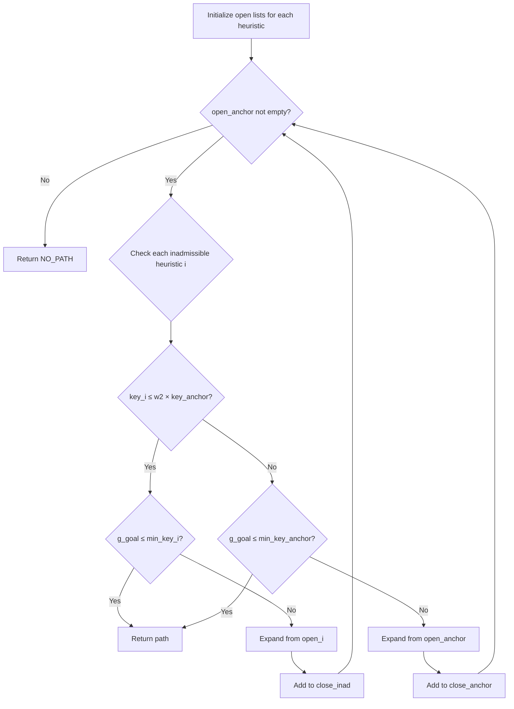
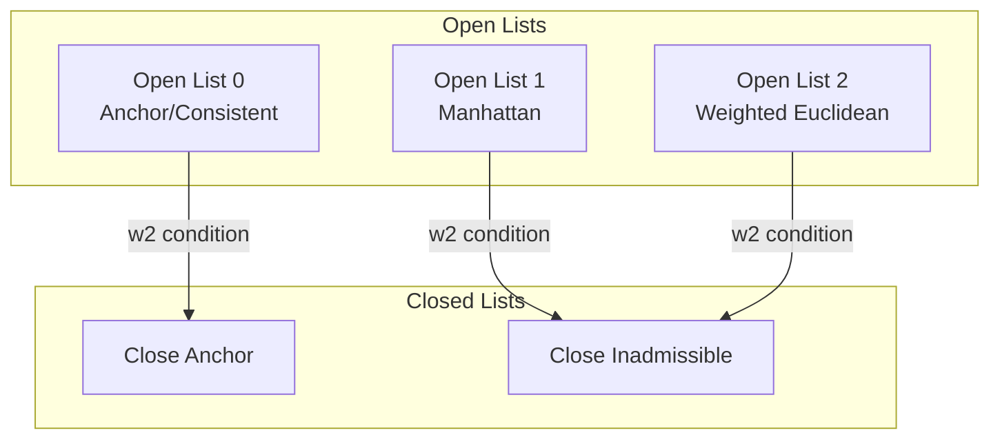

# Multi-Heuristic A* (MHA*)

## Overview

| Property | Value |
|----------|-------|
| **Category** | Pathfinding / Search |
| **Complexity (Time)** | O(b^d) bounded, often sub-optimal |
| **Complexity (Space)** | O(n_heuristics × nodes) |
| **Graph Type** | Grid-based, weighted |
| **Best For** | Complex environments with multiple search criteria |

## Description

Multi-Heuristic A* (MHA*) is an extension of A* that uses multiple heuristic functions simultaneously. It maintains separate open lists for each heuristic while sharing the closed lists. The algorithm balances between an anchor (admissible) heuristic and potentially inadmissible heuristics to provide bounded suboptimality while potentially exploring fewer states.

MHA* is particularly useful when different heuristics capture different aspects of the problem, allowing the search to benefit from multiple sources of guidance.

## Mathematical Foundation

### Key Functions

For heuristic $h_i$ and node $s$:
$$key_i(s) = g(s) + w_1 \cdot h_i(s)$$

Where:
- $g(s)$ = cost from start to $s$
- $w_1$ = heuristic weight (inflation factor)
- $h_0$ = anchor (consistent) heuristic
- $h_1, h_2, \ldots$ = inadmissible heuristics

### Anchor vs Inadmissible Heuristics

Anchor heuristic (consistent):
$$h_0(s) \leq c(s, s') + h_0(s') \text{ for all successors } s'$$

Inadmissible heuristic selection condition:
$$key_i(s) \leq w_2 \cdot key_0(s)$$

Where $w_2$ bounds the suboptimality.

### Suboptimality Bound

The solution cost $c^*_{MHA}$ satisfies:
$$c^*_{MHA} \leq w_1 \cdot w_2 \cdot c^*_{optimal}$$

### Heuristics Used

1. **Euclidean Distance** (consistent):
$$h_0(s) = \sqrt{(s_x - g_x)^2 + (s_y - g_y)^2}$$

2. **Manhattan Distance**:
$$h_1(s) = |s_x - g_x| + |s_y - g_y|$$

3. **Weighted Euclidean**:
$$h_2(s) = \frac{\sqrt{(s_x - g_x)^2 + (s_y - g_y)^2}}{t}$$

Where $t$ is a time-varying parameter.

## Algorithm

### Pseudocode

```
MULTI_HEURISTIC_ASTAR(start, goal, heuristics, w1, w2):
    g[start] ← 0
    g[goal] ← ∞
    
    // Create open list for each heuristic
    for i ← 0 to n_heuristics - 1:
        open[i] ← priority queue
        open[i].put(start, key(start, i))
    
    close_anchor ← empty set
    close_inad ← empty set
    
    while open[0].min_key() < ∞:
        // Check inadmissible heuristics
        for i ← 1 to n_heuristics - 1:
            if open[i].min_key() ≤ w2 × open[0].min_key():
                if g[goal] ≤ open[i].min_key():
                    return RECONSTRUCT_PATH(goal)
                
                s ← open[i].top()
                EXPAND_STATE(s, i)
                close_inad.add(s)
            else:
                // Use anchor heuristic
                if g[goal] ≤ open[0].min_key():
                    return RECONSTRUCT_PATH(goal)
                
                s ← open[0].top()
                EXPAND_STATE(s, 0)
                close_anchor.add(s)
    
    return NO_PATH

EXPAND_STATE(s, heuristic_index):
    Remove s from all open lists
    
    for each successor s' of s:
        if s' not visited:
            g[s'] ← ∞
            back_pointer[s'] ← -1
        
        if g[s'] > g[s] + cost(s, s'):
            g[s'] ← g[s] + cost(s, s')
            back_pointer[s'] ← s
            
            if s' not in close_anchor:
                open[0].put(s', key(s', 0))
                
                if s' not in close_inad:
                    for i ← 1 to n_heuristics - 1:
                        if key(s', i) ≤ w2 × key(s', 0):
                            open[i].put(s', key(s', i))
```

### Step-by-Step Execution

```
Grid (20×20), Start: (0,0), Goal: (19,19)
Obstacles: row of blocks at y=1

Heuristics:
  h0: Euclidean (consistent)
  h1: Manhattan
  h2: Euclidean/t (time-varying)

Parameters: w1=1, w2=1

Step 1: Initialize
  open[0] = {(0,0): 26.87}  // Euclidean
  open[1] = {(0,0): 38}     // Manhattan
  open[2] = {(0,0): 26.87}  // Euclidean/1

Step 2: Compare keys
  min_key(open[1]) = 38 ≤ 1 × 26.87? No
  min_key(open[2]) = 26.87 ≤ 1 × 26.87? Yes
  
  Expand from open[2]: (0,0)
  
Step 3: Add neighbors
  (0,1): blocked
  (1,0): g=1, key0=27.11, key1=37, key2=27.11
  
Continue until goal reached...

Final path navigates around obstacles
using guidance from all three heuristics.
```

## Complexity Analysis

### Time Complexity

| Factor | Complexity |
|--------|------------|
| Single expansion | O(n × log n) |
| Total | O(b^d) bounded |
| With multiple heuristics | O(k × n × log n) per iteration |

Where k = number of heuristics.

### Space Complexity

| Component | Complexity |
|-----------|------------|
| Per heuristic open list | O(n) |
| Total open lists | O(k × n) |
| Closed lists | O(n) |

## Visual Representation



### Multi-Queue Structure



## Implementation

### Python Implementation

```python
from __future__ import annotations
import heapq
import numpy as np
from typing import Dict, List, Tuple, Optional, Callable

TPos = Tuple[int, int]


class PriorityQueue:
    """Priority queue with update capability."""
    
    def __init__(self):
        self.elements: List[Tuple[float, TPos]] = []
        self.set: set = set()
    
    def minkey(self) -> float:
        """Return minimum key or infinity if empty."""
        return self.elements[0][0] if self.elements else float("inf")
    
    def empty(self) -> bool:
        """Check if queue is empty."""
        return len(self.elements) == 0
    
    def put(self, item: TPos, priority: float) -> None:
        """Add or update item priority."""
        if item not in self.set:
            heapq.heappush(self.elements, (priority, item))
            self.set.add(item)
        else:
            # Update existing item
            temp = []
            pri, x = heapq.heappop(self.elements)
            while x != item:
                temp.append((pri, x))
                pri, x = heapq.heappop(self.elements)
            temp.append((priority, item))
            for p, i in temp:
                heapq.heappush(self.elements, (p, i))
    
    def remove_element(self, item: TPos) -> None:
        """Remove item from queue."""
        if item in self.set:
            self.set.remove(item)
            temp = []
            pri, x = heapq.heappop(self.elements)
            while x != item:
                temp.append((pri, x))
                pri, x = heapq.heappop(self.elements)
            for p, i in temp:
                heapq.heappush(self.elements, (p, i))
    
    def top_show(self) -> TPos:
        """Return top item without removing."""
        return self.elements[0][1]
    
    def get(self) -> Tuple[float, TPos]:
        """Pop and return top item."""
        priority, item = heapq.heappop(self.elements)
        self.set.remove(item)
        return priority, item


def euclidean_heuristic(p: TPos, goal: TPos) -> float:
    """Euclidean distance (consistent heuristic)."""
    return np.linalg.norm(np.array(p) - np.array(goal))


def manhattan_heuristic(p: TPos, goal: TPos) -> float:
    """Manhattan distance heuristic."""
    return abs(p[0] - goal[0]) + abs(p[1] - goal[1])


def weighted_euclidean(p: TPos, goal: TPos, weight: float = 1.0) -> float:
    """Weighted Euclidean heuristic."""
    return euclidean_heuristic(p, goal) / weight


class MultiHeuristicAStar:
    """
    Multi-Heuristic A* pathfinding algorithm.
    
    Uses multiple heuristics simultaneously for potentially
    faster search with bounded suboptimality.
    """
    
    def __init__(
        self,
        grid_size: int,
        blocks: set,
        w1: float = 1.0,
        w2: float = 1.0
    ):
        self.n = grid_size
        self.blocks = blocks
        self.w1 = w1
        self.w2 = w2
        
        # Define heuristics
        self.heuristics: Dict[int, Callable] = {
            0: euclidean_heuristic,  # Anchor (consistent)
            1: manhattan_heuristic,  # Inadmissible
        }
        self.n_heuristic = len(self.heuristics)
    
    def key(
        self, 
        s: TPos, 
        i: int, 
        goal: TPos,
        g_function: Dict[TPos, float]
    ) -> float:
        """Calculate priority key for state s using heuristic i."""
        return g_function[s] + self.w1 * self.heuristics[i](s, goal)
    
    def valid(self, p: TPos) -> bool:
        """Check if position is valid."""
        return 0 <= p[0] < self.n and 0 <= p[1] < self.n
    
    def expand_state(
        self,
        s: TPos,
        heuristic_idx: int,
        visited: set,
        g_function: Dict[TPos, float],
        close_anchor: List[TPos],
        close_inad: List[TPos],
        open_list: List[PriorityQueue],
        back_pointer: Dict[TPos, Optional[TPos]],
        goal: TPos
    ) -> None:
        """Expand state s."""
        # Remove from all open lists
        for i in range(self.n_heuristic):
            open_list[i].remove_element(s)
        
        x, y = s
        neighbors = [(x-1, y), (x+1, y), (x, y-1), (x, y+1)]
        
        for neighbor in neighbors:
            if neighbor in self.blocks:
                continue
            
            if self.valid(neighbor) and neighbor not in visited:
                visited.add(neighbor)
                back_pointer[neighbor] = None
                g_function[neighbor] = float("inf")
            
            if self.valid(neighbor):
                new_g = g_function[s] + 1
                
                if g_function.get(neighbor, float("inf")) > new_g:
                    g_function[neighbor] = new_g
                    back_pointer[neighbor] = s
                    
                    if neighbor not in close_anchor:
                        key0 = self.key(neighbor, 0, goal, g_function)
                        open_list[0].put(neighbor, key0)
                        
                        if neighbor not in close_inad:
                            for var in range(1, self.n_heuristic):
                                key_var = self.key(neighbor, var, goal, g_function)
                                if key_var <= self.w2 * key0:
                                    open_list[var].put(neighbor, key_var)
    
    def search(
        self, 
        start: TPos, 
        goal: TPos
    ) -> Optional[List[TPos]]:
        """
        Search for path from start to goal.
        
        Returns path if found, None otherwise.
        """
        g_function: Dict[TPos, float] = {start: 0, goal: float("inf")}
        back_pointer: Dict[TPos, Optional[TPos]] = {start: None, goal: None}
        
        open_list = []
        for i in range(self.n_heuristic):
            pq = PriorityQueue()
            pq.put(start, self.key(start, i, goal, g_function))
            open_list.append(pq)
        
        visited: set = {start}
        close_anchor: List[TPos] = []
        close_inad: List[TPos] = []
        
        while open_list[0].minkey() < float("inf"):
            for i in range(1, self.n_heuristic):
                if open_list[i].minkey() <= self.w2 * open_list[0].minkey():
                    if g_function[goal] <= open_list[i].minkey():
                        if g_function[goal] < float("inf"):
                            return self.reconstruct_path(
                                back_pointer, goal, start
                            )
                    else:
                        s = open_list[i].top_show()
                        visited.add(s)
                        self.expand_state(
                            s, i, visited, g_function, close_anchor,
                            close_inad, open_list, back_pointer, goal
                        )
                        close_inad.append(s)
                elif g_function[goal] <= open_list[0].minkey():
                    if g_function[goal] < float("inf"):
                        return self.reconstruct_path(
                            back_pointer, goal, start
                        )
                else:
                    s = open_list[0].top_show()
                    visited.add(s)
                    self.expand_state(
                        s, 0, visited, g_function, close_anchor,
                        close_inad, open_list, back_pointer, goal
                    )
                    close_anchor.append(s)
        
        return None
    
    def reconstruct_path(
        self,
        back_pointer: Dict[TPos, Optional[TPos]],
        goal: TPos,
        start: TPos
    ) -> List[TPos]:
        """Reconstruct path from goal to start."""
        path = []
        current = goal
        while current is not None and current != start:
            path.append(current)
            current = back_pointer.get(current)
        path.append(start)
        path.reverse()
        return path


if __name__ == "__main__":
    # Example usage
    blocks = {(x, 1) for x in range(20)}  # Wall at y=1
    mha = MultiHeuristicAStar(20, blocks)
    path = mha.search((0, 0), (19, 19))
    print(f"Path found: {path is not None}")
```

## Real-World Applications

### 1. Robot Navigation with Multiple Constraints

```python
from typing import Dict, List, Tuple, Set, Optional, Callable
import heapq
import math


class RobotNavigator:
    """
    Robot navigation using Multi-Heuristic A*.
    
    Considers distance, safety, and energy constraints
    through multiple heuristics.
    """
    
    def __init__(
        self,
        grid_size: Tuple[int, int],
        obstacles: Set[Tuple[int, int]],
        hazards: Set[Tuple[int, int]],
        w1: float = 1.5,
        w2: float = 1.5
    ):
        self.width, self.height = grid_size
        self.obstacles = obstacles
        self.hazards = hazards  # Dangerous but passable areas
        self.w1 = w1
        self.w2 = w2
    
    def h_distance(
        self, 
        pos: Tuple[int, int], 
        goal: Tuple[int, int]
    ) -> float:
        """Euclidean distance heuristic (consistent)."""
        return math.sqrt(
            (pos[0] - goal[0])**2 + (pos[1] - goal[1])**2
        )
    
    def h_safety(
        self, 
        pos: Tuple[int, int], 
        goal: Tuple[int, int]
    ) -> float:
        """Safety-aware heuristic - penalizes proximity to hazards."""
        base = self.h_distance(pos, goal)
        
        # Add penalty for hazard proximity
        hazard_penalty = 0
        for haz in self.hazards:
            dist_to_hazard = math.sqrt(
                (pos[0] - haz[0])**2 + (pos[1] - haz[1])**2
            )
            if dist_to_hazard < 3:
                hazard_penalty += (3 - dist_to_hazard) * 2
        
        return base + hazard_penalty
    
    def h_energy(
        self, 
        pos: Tuple[int, int], 
        goal: Tuple[int, int]
    ) -> float:
        """Energy-efficient heuristic - prefers straight paths."""
        dx = abs(pos[0] - goal[0])
        dy = abs(pos[1] - goal[1])
        # Diagonal moves cost more energy
        return max(dx, dy) + 0.5 * min(dx, dy)
    
    def navigate(
        self,
        start: Tuple[int, int],
        goal: Tuple[int, int]
    ) -> Optional[List[Tuple[int, int]]]:
        """Find path using multiple heuristics."""
        heuristics = [
            self.h_distance,  # Anchor (consistent)
            self.h_safety,
            self.h_energy
        ]
        
        g: Dict[Tuple[int, int], float] = {start: 0}
        parent: Dict[Tuple[int, int], Optional[Tuple[int, int]]] = {
            start: None
        }
        
        # Open lists for each heuristic
        open_lists = [[(h(start, goal), start)] for h in heuristics]
        in_open = [{start} for _ in heuristics]
        
        close_anchor: Set[Tuple[int, int]] = set()
        close_inad: Set[Tuple[int, int]] = set()
        
        while open_lists[0] and open_lists[0][0][0] < float('inf'):
            # Check inadmissible heuristics
            expanded = False
            
            for i in range(1, len(heuristics)):
                if not open_lists[i]:
                    continue
                
                key_i = open_lists[i][0][0]
                key_0 = open_lists[0][0][0]
                
                if key_i <= self.w2 * key_0:
                    if goal in g and g[goal] <= key_i:
                        return self._reconstruct(parent, goal)
                    
                    _, s = heapq.heappop(open_lists[i])
                    in_open[i].discard(s)
                    
                    if s not in close_inad:
                        close_inad.add(s)
                        self._expand(
                            s, goal, g, parent, heuristics,
                            open_lists, in_open, close_anchor, close_inad
                        )
                    expanded = True
                    break
            
            if not expanded:
                if goal in g and g[goal] <= open_lists[0][0][0]:
                    return self._reconstruct(parent, goal)
                
                _, s = heapq.heappop(open_lists[0])
                in_open[0].discard(s)
                
                if s not in close_anchor:
                    close_anchor.add(s)
                    self._expand(
                        s, goal, g, parent, heuristics,
                        open_lists, in_open, close_anchor, close_inad
                    )
        
        return None
    
    def _expand(
        self,
        s: Tuple[int, int],
        goal: Tuple[int, int],
        g: Dict,
        parent: Dict,
        heuristics: List[Callable],
        open_lists: List[List],
        in_open: List[Set],
        close_anchor: Set,
        close_inad: Set
    ) -> None:
        """Expand state s."""
        x, y = s
        
        for dx, dy in [(-1, 0), (1, 0), (0, -1), (0, 1)]:
            nx, ny = x + dx, y + dy
            neighbor = (nx, ny)
            
            if not (0 <= nx < self.width and 0 <= ny < self.height):
                continue
            if neighbor in self.obstacles:
                continue
            
            # Cost includes hazard penalty
            cost = 1.0
            if neighbor in self.hazards:
                cost = 3.0  # Higher cost for hazardous areas
            
            new_g = g[s] + cost
            
            if neighbor not in g or new_g < g[neighbor]:
                g[neighbor] = new_g
                parent[neighbor] = s
                
                # Add to anchor if not closed
                if neighbor not in close_anchor:
                    key_0 = new_g + self.w1 * heuristics[0](neighbor, goal)
                    heapq.heappush(open_lists[0], (key_0, neighbor))
                    in_open[0].add(neighbor)
                    
                    # Add to inadmissible lists
                    if neighbor not in close_inad:
                        for i in range(1, len(heuristics)):
                            key_i = new_g + self.w1 * heuristics[i](
                                neighbor, goal
                            )
                            if key_i <= self.w2 * key_0:
                                heapq.heappush(
                                    open_lists[i], (key_i, neighbor)
                                )
                                in_open[i].add(neighbor)
    
    def _reconstruct(
        self,
        parent: Dict,
        goal: Tuple[int, int]
    ) -> List[Tuple[int, int]]:
        """Reconstruct path."""
        path = []
        current = goal
        while current is not None:
            path.append(current)
            current = parent.get(current)
        return path[::-1]


def demo_robot_navigation():
    """Demo robot navigation with multiple constraints."""
    navigator = RobotNavigator(
        grid_size=(20, 20),
        obstacles={(5, y) for y in range(5, 15)},  # Wall
        hazards={(10, y) for y in range(8, 12)},   # Hazard zone
        w1=1.5,
        w2=1.5
    )
    
    path = navigator.navigate((0, 10), (19, 10))
    
    if path:
        print(f"Path found: {len(path)} steps")
        print(f"Start: {path[0]} → Goal: {path[-1]}")
    else:
        print("No path found")
```

### 2. Game AI Pathfinding

```python
from typing import Dict, List, Tuple, Set, Optional
from dataclasses import dataclass
import heapq
import math


@dataclass
class GameUnit:
    """Game unit with movement characteristics."""
    unit_id: str
    position: Tuple[int, int]
    movement_type: str  # "ground", "air", "amphibious"
    speed: float


class GamePathfinder:
    """
    Multi-heuristic pathfinder for game units.
    
    Different heuristics for different tactical priorities.
    """
    
    def __init__(
        self,
        map_width: int,
        map_height: int,
        terrain: Dict[Tuple[int, int], str]  # position -> terrain type
    ):
        self.width = map_width
        self.height = map_height
        self.terrain = terrain
        
        # Terrain costs by movement type
        self.terrain_costs = {
            "ground": {
                "plain": 1.0, "forest": 2.0, "mountain": 4.0,
                "water": float('inf'), "road": 0.5
            },
            "air": {
                "plain": 1.0, "forest": 1.0, "mountain": 1.0,
                "water": 1.0, "road": 1.0
            },
            "amphibious": {
                "plain": 1.0, "forest": 2.0, "mountain": 4.0,
                "water": 1.5, "road": 0.5
            }
        }
    
    def h_direct(
        self, 
        pos: Tuple[int, int], 
        goal: Tuple[int, int]
    ) -> float:
        """Direct distance heuristic."""
        return math.sqrt(
            (pos[0] - goal[0])**2 + (pos[1] - goal[1])**2
        )
    
    def h_tactical(
        self,
        pos: Tuple[int, int],
        goal: Tuple[int, int],
        enemy_positions: Set[Tuple[int, int]]
    ) -> float:
        """Tactical heuristic - avoids enemies."""
        base = self.h_direct(pos, goal)
        
        # Penalty for proximity to enemies
        enemy_penalty = 0
        for enemy in enemy_positions:
            dist = math.sqrt(
                (pos[0] - enemy[0])**2 + (pos[1] - enemy[1])**2
            )
            if dist < 5:
                enemy_penalty += (5 - dist) * 3
        
        return base + enemy_penalty
    
    def h_cover(
        self,
        pos: Tuple[int, int],
        goal: Tuple[int, int]
    ) -> float:
        """Cover-seeking heuristic - prefers forest/mountain."""
        base = self.h_direct(pos, goal)
        
        # Bonus for being in cover
        terrain = self.terrain.get(pos, "plain")
        cover_bonus = 0
        if terrain == "forest":
            cover_bonus = -0.5
        elif terrain == "mountain":
            cover_bonus = -1.0
        
        return base + cover_bonus
    
    def find_path(
        self,
        unit: GameUnit,
        goal: Tuple[int, int],
        enemy_positions: Set[Tuple[int, int]] = None
    ) -> Optional[List[Tuple[int, int]]]:
        """
        Find path for unit using multiple heuristics.
        """
        enemy_positions = enemy_positions or set()
        
        heuristics = [
            lambda p, g: self.h_direct(p, g),
            lambda p, g: self.h_tactical(p, g, enemy_positions),
            lambda p, g: self.h_cover(p, g)
        ]
        
        terrain_cost = self.terrain_costs[unit.movement_type]
        
        g: Dict[Tuple[int, int], float] = {unit.position: 0}
        parent: Dict[Tuple[int, int], Optional[Tuple[int, int]]] = {
            unit.position: None
        }
        
        w1, w2 = 1.2, 1.2
        
        open_lists = [
            [(h(unit.position, goal), unit.position)] 
            for h in heuristics
        ]
        closed = set()
        
        while any(ol for ol in open_lists):
            # Find best among all lists
            best_key = float('inf')
            best_list_idx = 0
            
            for i, ol in enumerate(open_lists):
                if ol and ol[0][0] < best_key:
                    best_key = ol[0][0]
                    best_list_idx = i
            
            if best_key == float('inf'):
                break
            
            _, current = heapq.heappop(open_lists[best_list_idx])
            
            if current == goal:
                return self._reconstruct(parent, goal)
            
            if current in closed:
                continue
            closed.add(current)
            
            x, y = current
            for dx, dy in [(-1, 0), (1, 0), (0, -1), (0, 1)]:
                nx, ny = x + dx, y + dy
                neighbor = (nx, ny)
                
                if not (0 <= nx < self.width and 0 <= ny < self.height):
                    continue
                if neighbor in closed:
                    continue
                
                # Get movement cost
                terrain = self.terrain.get(neighbor, "plain")
                cost = terrain_cost.get(terrain, 1.0)
                
                if cost == float('inf'):
                    continue
                
                new_g = g[current] + cost
                
                if neighbor not in g or new_g < g[neighbor]:
                    g[neighbor] = new_g
                    parent[neighbor] = current
                    
                    for i, h in enumerate(heuristics):
                        key = new_g + w1 * h(neighbor, goal)
                        heapq.heappush(open_lists[i], (key, neighbor))
        
        return None
    
    def _reconstruct(
        self,
        parent: Dict,
        goal: Tuple[int, int]
    ) -> List[Tuple[int, int]]:
        path = []
        current = goal
        while current is not None:
            path.append(current)
            current = parent.get(current)
        return path[::-1]
```

## References

1. Aine, S., et al. "Multi-Heuristic A*" (2016)
2. Likhachev, M., et al. "ARA*: Anytime A* with Provable Bounds on Sub-Optimality" (2003)
3. [Multi-Heuristic A* - Wikipedia](https://en.wikipedia.org/wiki/Multi-Heuristic_A*)

## See Also

- [A* Algorithm](a_star.md) - Single heuristic pathfinding
- [Bidirectional A*](bidirectional_a_star.md) - Dual search approach
- [Greedy Best-First](greedy_best_first.md) - Heuristic-only search
