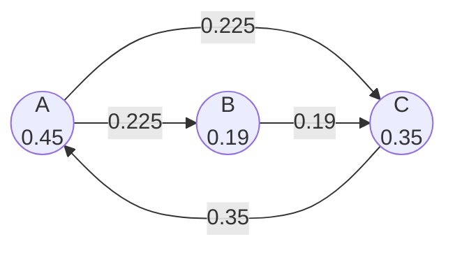

# PageRank Algorithm

## Overview

| Property | Value |
|----------|-------|
| **Category** | Graph Ranking |
| **Complexity (Time)** | O(k × (V + E)) where k = iterations |
| **Complexity (Space)** | O(V) |
| **Graph Type** | Directed |
| **Best For** | Web page ranking, influence analysis |

## Description

PageRank is a link analysis algorithm developed by Larry Page and Sergey Brin at Stanford University, which formed the foundation of Google's original search engine. The algorithm assigns importance scores to nodes in a directed graph based on the structure of incoming links.

The key insight is that a page is important if it receives links from other important pages. This creates a recursive definition where importance flows through the graph structure.

## Mathematical Foundation

### Basic Formula

The PageRank of page $p$ is:
$$PR(p) = \frac{1-d}{N} + d \sum_{q \in B_p} \frac{PR(q)}{L(q)}$$

where:
- $d$ = damping factor (typically 0.85)
- $N$ = total number of pages
- $B_p$ = set of pages linking to $p$
- $L(q)$ = number of outbound links from $q$

### Matrix Formulation

PageRank can be expressed as an eigenvector problem:
$$\mathbf{R} = \mathbf{M} \cdot \mathbf{R}$$

where $\mathbf{M}$ is the stochastic transition matrix.

### Random Surfer Model

The damping factor represents a random surfer who:
- With probability $d$: follows a link
- With probability $1-d$: jumps to a random page

### Convergence Condition

The algorithm converges when:
$$|PR^{(t+1)}(p) - PR^{(t)}(p)| < \epsilon$$

for all pages $p$.

## Algorithm

### Pseudocode

```
PAGERANK(graph, damping=0.85, iterations=100, tolerance=1e-6):
    N ← number of nodes
    
    // Initialize equal ranks
    for each node p:
        PR[p] ← 1/N
    
    // Iterative computation
    for i from 1 to iterations:
        new_PR ← empty dictionary
        
        for each node p:
            // Base score from random jumps
            rank ← (1 - damping) / N
            
            // Add contributions from incoming links
            for each node q linking to p:
                rank ← rank + damping × PR[q] / outlinks[q]
            
            new_PR[p] ← rank
        
        // Check convergence
        if max_change(PR, new_PR) < tolerance:
            return new_PR
        
        PR ← new_PR
    
    return PR
```

### Step-by-Step Execution

```
Graph:
  A → B, A → C
  B → C
  C → A

Initial: PR(A) = PR(B) = PR(C) = 0.333
Damping: d = 0.85

Iteration 1:
  PR(A) = (1-0.85)/3 + 0.85 × PR(C)/1
        = 0.05 + 0.85 × 0.333/1 = 0.333

  PR(B) = (1-0.85)/3 + 0.85 × PR(A)/2
        = 0.05 + 0.85 × 0.333/2 = 0.192

  PR(C) = (1-0.85)/3 + 0.85 × (PR(A)/2 + PR(B)/1)
        = 0.05 + 0.85 × (0.333/2 + 0.333/1) = 0.475

Iteration 2:
  PR(A) = 0.05 + 0.85 × 0.475 = 0.454
  PR(B) = 0.05 + 0.85 × 0.333/2 = 0.192
  PR(C) = 0.05 + 0.85 × (0.333/2 + 0.192) = 0.354

... converges after ~20 iterations
```

## Complexity Analysis

### Time Complexity

| Operation | Complexity |
|-----------|------------|
| Single iteration | O(V + E) |
| Full algorithm | O(k × (V + E)) |
| Matrix method | O(V³) per iteration |

### Space Complexity

- Node storage: O(V)
- Edge storage: O(E)
- Rank arrays: O(V)
- Total: O(V + E)

### Convergence

- Typical convergence: 50-100 iterations
- Guaranteed convergence for d < 1

## Visual Representation

```mermaid
flowchart TD
    A[Initialize all ranks to 1/N] --> B[For each iteration]
    B --> C[Calculate new rank for each node]
    C --> D{Converged?}
    D -->|No| B
    D -->|Yes| E[Return final ranks]
    
    subgraph "Rank Calculation"
        F[Base: (1-d)/N]
        G[+ Sum of incoming contributions]
        H[= New PageRank]
        F --> H
        G --> H
    end
```

### Link Structure Example



## Implementation

### Python Implementation

```python
from __future__ import annotations


class Node:
    """
    Represents a node in the PageRank graph.
    
    >>> node = Node("A")
    >>> node.name
    'A'
    >>> node.page_rank
    0
    """
    
    def __init__(self, name: str) -> None:
        self.name = name
        self.inbound: list[Node] = []
        self.outbound: list[Node] = []
        self.page_rank: float = 0
    
    def add_inbound(self, node: Node) -> None:
        """Add an incoming link."""
        self.inbound.append(node)
    
    def add_outbound(self, node: Node) -> None:
        """Add an outgoing link."""
        self.outbound.append(node)
    
    def __repr__(self) -> str:
        return f"Node({self.name}, PR={self.page_rank:.4f})"


def page_rank(
    nodes: list[Node],
    limit: int = 3,
    d: float = 0.85
) -> list[Node]:
    """
    Calculate PageRank for all nodes.
    
    Args:
        nodes: List of nodes with link structure
        limit: Number of iterations
        d: Damping factor (probability of following links)
    
    Returns:
        Nodes with updated page_rank values
    
    >>> a, b, c = Node("A"), Node("B"), Node("C")
    >>> a.add_outbound(b); b.add_inbound(a)
    >>> a.add_outbound(c); c.add_inbound(a)
    >>> b.add_outbound(c); c.add_inbound(b)
    >>> c.add_outbound(a); a.add_inbound(c)
    >>> result = page_rank([a, b, c], limit=10, d=0.85)
    >>> all(node.page_rank > 0 for node in result)
    True
    """
    n = len(nodes)
    
    # Initialize equal PageRank
    for node in nodes:
        node.page_rank = 1 / n
    
    # Iterative calculation
    for _ in range(limit):
        for node in nodes:
            # Base rank from random jumps
            rank = (1 - d) / n
            
            # Add contributions from inbound links
            for inbound_node in node.inbound:
                if len(inbound_node.outbound) > 0:
                    rank += d * inbound_node.page_rank / len(inbound_node.outbound)
            
            node.page_rank = rank
    
    return nodes


def create_graph(edges: list[tuple[str, str]]) -> list[Node]:
    """
    Create graph from edge list.
    
    >>> nodes = create_graph([("A", "B"), ("B", "C"), ("C", "A")])
    >>> len(nodes)
    3
    """
    node_dict: dict[str, Node] = {}
    
    for source, target in edges:
        if source not in node_dict:
            node_dict[source] = Node(source)
        if target not in node_dict:
            node_dict[target] = Node(target)
        
        node_dict[source].add_outbound(node_dict[target])
        node_dict[target].add_inbound(node_dict[source])
    
    return list(node_dict.values())


if __name__ == "__main__":
    import doctest
    doctest.testmod()
    
    # Example: Simple web graph
    edges = [
        ("A", "B"), ("A", "C"), ("A", "D"),
        ("B", "C"),
        ("C", "A"),
        ("D", "B"), ("D", "C")
    ]
    
    nodes = create_graph(edges)
    result = page_rank(nodes, limit=100, d=0.85)
    
    print("PageRank Results:")
    for node in sorted(result, key=lambda x: x.page_rank, reverse=True):
        print(f"  {node.name}: {node.page_rank:.4f}")
```

### Matrix Implementation

```python
import numpy as np
from typing import Dict, List, Tuple


class MatrixPageRank:
    """
    PageRank using matrix operations for efficiency.
    """
    
    def __init__(self, damping: float = 0.85):
        self.damping = damping
        self.node_index: Dict[str, int] = {}
        self.index_node: Dict[int, str] = {}
    
    def fit(
        self, 
        edges: List[Tuple[str, str]], 
        max_iter: int = 100,
        tolerance: float = 1e-6
    ) -> Dict[str, float]:
        """
        Calculate PageRank using power iteration.
        """
        # Build node index
        nodes = set()
        for source, target in edges:
            nodes.add(source)
            nodes.add(target)
        
        for i, node in enumerate(sorted(nodes)):
            self.node_index[node] = i
            self.index_node[i] = node
        
        n = len(nodes)
        
        # Build adjacency matrix
        M = np.zeros((n, n))
        out_degree = np.zeros(n)
        
        for source, target in edges:
            i, j = self.node_index[source], self.node_index[target]
            M[j][i] = 1  # Note: column-stochastic
            out_degree[i] += 1
        
        # Normalize columns (make stochastic)
        for i in range(n):
            if out_degree[i] > 0:
                M[:, i] /= out_degree[i]
            else:
                # Dangling node: distribute equally
                M[:, i] = 1 / n
        
        # PageRank matrix: M' = d*M + (1-d)/n
        damping_matrix = self.damping * M + (1 - self.damping) / n
        
        # Power iteration
        ranks = np.ones(n) / n
        
        for _ in range(max_iter):
            new_ranks = damping_matrix @ ranks
            
            if np.max(np.abs(new_ranks - ranks)) < tolerance:
                break
            
            ranks = new_ranks
        
        # Normalize to sum to 1
        ranks /= ranks.sum()
        
        return {self.index_node[i]: ranks[i] for i in range(n)}


def pagerank_numpy(edges: List[Tuple[str, str]], d: float = 0.85) -> Dict[str, float]:
    """
    Simplified NumPy PageRank.
    
    >>> result = pagerank_numpy([("A", "B"), ("B", "C"), ("C", "A")])
    >>> all(0 < v < 1 for v in result.values())
    True
    >>> abs(sum(result.values()) - 1.0) < 0.01
    True
    """
    pr = MatrixPageRank(damping=d)
    return pr.fit(edges)
```

## Real-World Applications

### 1. Search Engine Ranking

```python
from dataclasses import dataclass, field
from typing import Dict, List, Set, Optional


@dataclass
class WebPage:
    """Represents a web page with content and links."""
    url: str
    title: str
    content: str
    outgoing_links: List[str] = field(default_factory=list)
    incoming_links: List[str] = field(default_factory=list)
    pagerank: float = 0.0
    content_score: float = 0.0


class SearchEngine:
    """
    Basic search engine using PageRank for ranking.
    """
    
    def __init__(self, damping: float = 0.85):
        self.pages: Dict[str, WebPage] = {}
        self.damping = damping
    
    def index_page(self, page: WebPage) -> None:
        """Add page to index."""
        self.pages[page.url] = page
        
        # Update incoming links for targets
        for link in page.outgoing_links:
            if link in self.pages:
                self.pages[link].incoming_links.append(page.url)
    
    def calculate_pagerank(self, iterations: int = 50) -> None:
        """Update PageRank for all pages."""
        n = len(self.pages)
        if n == 0:
            return
        
        # Initialize
        for page in self.pages.values():
            page.pagerank = 1 / n
        
        # Iterate
        for _ in range(iterations):
            new_ranks: Dict[str, float] = {}
            
            for url, page in self.pages.items():
                rank = (1 - self.damping) / n
                
                for incoming_url in page.incoming_links:
                    incoming_page = self.pages.get(incoming_url)
                    if incoming_page and len(incoming_page.outgoing_links) > 0:
                        rank += self.damping * incoming_page.pagerank / len(incoming_page.outgoing_links)
                
                new_ranks[url] = rank
            
            for url, rank in new_ranks.items():
                self.pages[url].pagerank = rank
    
    def search(
        self, 
        query: str, 
        top_k: int = 10
    ) -> List[WebPage]:
        """
        Search with combined content and PageRank scoring.
        """
        results = []
        query_terms = query.lower().split()
        
        for page in self.pages.values():
            # Simple TF-based content score
            content_lower = page.content.lower()
            title_lower = page.title.lower()
            
            tf_score = sum(
                content_lower.count(term) + 
                3 * title_lower.count(term)  # Title matches weighted higher
                for term in query_terms
            )
            
            if tf_score > 0:
                # Combined score: content relevance × PageRank
                combined_score = tf_score * (1 + page.pagerank * 10)
                page.content_score = combined_score
                results.append(page)
        
        # Sort by combined score
        results.sort(key=lambda p: p.content_score, reverse=True)
        
        return results[:top_k]


# Example usage
def demo_search_engine():
    engine = SearchEngine(damping=0.85)
    
    # Index sample pages
    pages = [
        WebPage(
            url="https://wiki.org/python",
            title="Python Programming Language",
            content="Python is a high-level programming language...",
            outgoing_links=["https://wiki.org/java", "https://wiki.org/programming"]
        ),
        WebPage(
            url="https://wiki.org/java",
            title="Java Programming Language",
            content="Java is an object-oriented programming language...",
            outgoing_links=["https://wiki.org/python"]
        ),
        WebPage(
            url="https://wiki.org/programming",
            title="Programming",
            content="Programming is the process of creating software...",
            outgoing_links=["https://wiki.org/python", "https://wiki.org/java"]
        )
    ]
    
    for page in pages:
        engine.index_page(page)
    
    # Build link graph
    for url, page in engine.pages.items():
        for link in page.outgoing_links:
            if link in engine.pages:
                engine.pages[link].incoming_links.append(url)
    
    engine.calculate_pagerank()
    results = engine.search("python programming")
    
    return results
```

### 2. Social Network Influence

```python
from typing import Dict, List, Set, Tuple
from collections import defaultdict
from dataclasses import dataclass


@dataclass
class SocialUser:
    """Social network user."""
    user_id: str
    name: str
    followers: Set[str]
    following: Set[str]
    influence_score: float = 0.0


class SocialInfluenceAnalyzer:
    """
    Analyze social network influence using PageRank.
    """
    
    def __init__(self, damping: float = 0.85):
        self.users: Dict[str, SocialUser] = {}
        self.damping = damping
    
    def add_user(self, user_id: str, name: str) -> None:
        """Add user to network."""
        self.users[user_id] = SocialUser(
            user_id=user_id,
            name=name,
            followers=set(),
            following=set()
        )
    
    def add_follow(self, follower_id: str, followee_id: str) -> None:
        """Add follow relationship."""
        if follower_id in self.users and followee_id in self.users:
            self.users[follower_id].following.add(followee_id)
            self.users[followee_id].followers.add(follower_id)
    
    def calculate_influence(self, iterations: int = 50) -> None:
        """
        Calculate influence scores using PageRank.
        
        Influence flows from followers to followees.
        """
        n = len(self.users)
        if n == 0:
            return
        
        # Initialize
        for user in self.users.values():
            user.influence_score = 1 / n
        
        for _ in range(iterations):
            new_scores: Dict[str, float] = {}
            
            for uid, user in self.users.items():
                score = (1 - self.damping) / n
                
                # Receive influence from followers
                for follower_id in user.followers:
                    follower = self.users[follower_id]
                    if len(follower.following) > 0:
                        score += self.damping * follower.influence_score / len(follower.following)
                
                new_scores[uid] = score
            
            for uid, score in new_scores.items():
                self.users[uid].influence_score = score
    
    def get_influencers(self, top_k: int = 10) -> List[SocialUser]:
        """Get top influencers by score."""
        sorted_users = sorted(
            self.users.values(),
            key=lambda u: u.influence_score,
            reverse=True
        )
        return sorted_users[:top_k]
    
    def recommend_follows(
        self, 
        user_id: str, 
        top_k: int = 5
    ) -> List[SocialUser]:
        """
        Recommend users to follow based on influence.
        """
        if user_id not in self.users:
            return []
        
        user = self.users[user_id]
        
        # Find users not already followed
        candidates = [
            u for uid, u in self.users.items()
            if uid != user_id and uid not in user.following
        ]
        
        # Sort by influence
        candidates.sort(key=lambda u: u.influence_score, reverse=True)
        
        return candidates[:top_k]


def analyze_twitter_like_network():
    """Example social network analysis."""
    analyzer = SocialInfluenceAnalyzer()
    
    # Add users
    users = ["alice", "bob", "carol", "david", "eve"]
    for user in users:
        analyzer.add_user(user, user.capitalize())
    
    # Add follows (follower → followee)
    follows = [
        ("bob", "alice"),
        ("carol", "alice"),
        ("david", "alice"),
        ("eve", "alice"),
        ("carol", "bob"),
        ("david", "bob"),
        ("eve", "carol")
    ]
    
    for follower, followee in follows:
        analyzer.add_follow(follower, followee)
    
    analyzer.calculate_influence()
    
    print("Influence Rankings:")
    for user in analyzer.get_influencers():
        print(f"  {user.name}: {user.influence_score:.4f}")
    
    return analyzer
```

### 3. Citation Network Analysis

```python
from typing import Dict, List, Tuple, Optional
from dataclasses import dataclass, field
from datetime import datetime


@dataclass
class Paper:
    """Academic paper."""
    doi: str
    title: str
    authors: List[str]
    year: int
    citations_in: List[str] = field(default_factory=list)  # Papers citing this
    citations_out: List[str] = field(default_factory=list)  # Papers this cites
    impact_score: float = 0.0


class CitationAnalyzer:
    """
    Analyze academic paper importance using PageRank.
    """
    
    def __init__(self, damping: float = 0.85, time_decay: bool = True):
        self.papers: Dict[str, Paper] = {}
        self.damping = damping
        self.time_decay = time_decay
        self.current_year = datetime.now().year
    
    def add_paper(self, paper: Paper) -> None:
        """Add paper to corpus."""
        self.papers[paper.doi] = paper
    
    def add_citation(self, citing_doi: str, cited_doi: str) -> None:
        """Add citation relationship."""
        if citing_doi in self.papers and cited_doi in self.papers:
            self.papers[citing_doi].citations_out.append(cited_doi)
            self.papers[cited_doi].citations_in.append(citing_doi)
    
    def calculate_impact(self, iterations: int = 50) -> None:
        """
        Calculate impact scores using time-weighted PageRank.
        """
        n = len(self.papers)
        if n == 0:
            return
        
        # Initialize
        for paper in self.papers.values():
            paper.impact_score = 1 / n
        
        for _ in range(iterations):
            new_scores: Dict[str, float] = {}
            
            for doi, paper in self.papers.items():
                score = (1 - self.damping) / n
                
                # Receive credit from citing papers
                for citing_doi in paper.citations_in:
                    citing_paper = self.papers[citing_doi]
                    
                    if len(citing_paper.citations_out) > 0:
                        contribution = citing_paper.impact_score / len(citing_paper.citations_out)
                        
                        # Time decay: newer citations weighted more
                        if self.time_decay:
                            age = self.current_year - citing_paper.year
                            decay = 0.9 ** age
                            contribution *= decay
                        
                        score += self.damping * contribution
                
                new_scores[doi] = score
            
            for doi, score in new_scores.items():
                self.papers[doi].impact_score = score
    
    def get_influential_papers(
        self, 
        top_k: int = 10,
        min_year: Optional[int] = None
    ) -> List[Paper]:
        """Get most influential papers."""
        papers = list(self.papers.values())
        
        if min_year:
            papers = [p for p in papers if p.year >= min_year]
        
        papers.sort(key=lambda p: p.impact_score, reverse=True)
        return papers[:top_k]
    
    def author_impact(self) -> Dict[str, float]:
        """Calculate author impact scores."""
        author_scores: Dict[str, float] = defaultdict(float)
        
        for paper in self.papers.values():
            # Distribute paper impact among authors
            per_author = paper.impact_score / len(paper.authors)
            for author in paper.authors:
                author_scores[author] += per_author
        
        return dict(sorted(author_scores.items(), key=lambda x: x[1], reverse=True))
```

## Variations

### Personalized PageRank

```python
def personalized_pagerank(
    edges: List[Tuple[str, str]],
    personalization: Dict[str, float],
    damping: float = 0.85,
    iterations: int = 50
) -> Dict[str, float]:
    """
    PageRank with personalization vector.
    
    Instead of uniform random jumps, uses custom distribution.
    """
    # Build graph
    nodes = set()
    outlinks = defaultdict(list)
    inlinks = defaultdict(list)
    
    for source, target in edges:
        nodes.add(source)
        nodes.add(target)
        outlinks[source].append(target)
        inlinks[target].append(source)
    
    # Normalize personalization
    total = sum(personalization.values())
    p_vector = {n: personalization.get(n, 0) / total for n in nodes}
    
    # Initialize
    ranks = {n: 1 / len(nodes) for n in nodes}
    
    for _ in range(iterations):
        new_ranks = {}
        
        for node in nodes:
            # Personalized jump probability
            rank = (1 - damping) * p_vector.get(node, 0)
            
            for source in inlinks[node]:
                if outlinks[source]:
                    rank += damping * ranks[source] / len(outlinks[source])
            
            new_ranks[node] = rank
        
        ranks = new_ranks
    
    return ranks
```

## References

1. Page, L., Brin, S., Motwani, R., Winograd, T. "The PageRank Citation Ranking: Bringing Order to the Web" (1999)
2. [PageRank - Wikipedia](https://en.wikipedia.org/wiki/PageRank)
3. Langville, A.N., Meyer, C.D. "Google's PageRank and Beyond"

## See Also

- [Breadth-First Search](breadth_first_search.md) - Graph traversal
- [Depth-First Search](depth_first_search.md) - Graph traversal
- [Strongly Connected Components](strongly_connected_components.md) - Graph structure analysis
