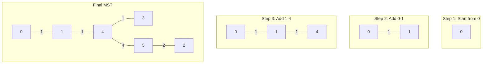

# Prim's Algorithm

## Overview

| Property | Value |
|----------|-------|
| **Category** | Minimum Spanning Tree |
| **Complexity (Time)** | O(E log V) with binary heap, O(V²) with array |
| **Complexity (Space)** | O(V) |
| **Graph Type** | Weighted, undirected, connected |
| **Best For** | Dense graphs, adjacency matrix |

## Description

Prim's algorithm is a greedy algorithm that finds a minimum spanning tree (MST) for a weighted undirected graph. Unlike Kruskal's edge-based approach, Prim's algorithm grows the MST from a single vertex, repeatedly adding the minimum weight edge that connects a vertex in the tree to a vertex outside the tree.

Named after Robert C. Prim (1957), though independently discovered by Vojtěch Jarník (1930) and also by Dijkstra, the algorithm is particularly efficient for dense graphs and shares similarities with Dijkstra's shortest path algorithm.

## Mathematical Foundation

### Growing Tree Property

At each step, Prim maintains a tree $T$ that is a subset of the final MST. The algorithm extends $T$ by adding edge $(u, v)$ where:
- $u \in T$ (already in tree)
- $v \notin T$ (not yet in tree)
- $(u, v)$ has minimum weight among all such edges

### Cut Property (Safe Edge)

For cut $(T, V - T)$, the minimum weight crossing edge is safe to add:

$$e = \arg\min_{(u,v): u \in T, v \notin T} w(u, v)$$

### Key Update Rule

For each vertex $v$ not in the tree, maintain:
$$\text{key}[v] = \min_{u \in T, (u,v) \in E} w(u, v)$$

This represents the minimum cost to connect $v$ to the current tree.

### Correctness Invariant

After $k$ iterations:
1. $T$ contains exactly $k$ vertices
2. $T$ is a tree (connected, acyclic)
3. $T$ is a subset of some MST of $G$

## Algorithm

### Pseudocode

```
PRIM(graph G, start vertex r):
    // Initialize
    for each vertex v in V:
        key[v] ← ∞
        parent[v] ← NULL
        in_tree[v] ← false
    
    key[r] ← 0
    Q ← priority queue of all vertices by key
    
    while Q is not empty:
        u ← EXTRACT-MIN(Q)
        in_tree[u] ← true
        
        for each neighbor v of u:
            if not in_tree[v] and w(u, v) < key[v]:
                key[v] ← w(u, v)
                parent[v] ← u
                DECREASE-KEY(Q, v, key[v])
    
    return parent  // MST defined by parent pointers
```

### Step-by-Step Execution

```
Graph (adjacency list):
  0: [(1,1), (3,3)]
  1: [(0,1), (2,6), (3,5), (4,1)]
  2: [(1,6), (4,5), (5,2)]
  3: [(0,3), (1,5), (4,1)]
  4: [(1,1), (2,5), (3,1), (5,4)]
  5: [(2,2), (4,4)]

Start from vertex 0

Initialization:
  key = [0, ∞, ∞, ∞, ∞, ∞]
  parent = [nil, nil, nil, nil, nil, nil]
  in_tree = [F, F, F, F, F, F]

Step 1: Extract vertex 0 (key=0)
  in_tree[0] = true
  Update neighbors:
    key[1] = min(∞, 1) = 1, parent[1] = 0
    key[3] = min(∞, 3) = 3, parent[3] = 0
  key = [0, 1, ∞, 3, ∞, ∞]

Step 2: Extract vertex 1 (key=1)
  in_tree[1] = true
  Tree edge: (0, 1) with weight 1
  Update neighbors:
    key[2] = min(∞, 6) = 6, parent[2] = 1
    key[3] = min(3, 5) = 3 (no change)
    key[4] = min(∞, 1) = 1, parent[4] = 1
  key = [0, 1, 6, 3, 1, ∞]

Step 3: Extract vertex 4 (key=1)
  in_tree[4] = true
  Tree edge: (1, 4) with weight 1
  Update neighbors:
    key[2] = min(6, 5) = 5, parent[2] = 4
    key[3] = min(3, 1) = 1, parent[3] = 4
    key[5] = min(∞, 4) = 4, parent[5] = 4
  key = [0, 1, 5, 1, 1, 4]

Step 4: Extract vertex 3 (key=1)
  in_tree[3] = true
  Tree edge: (4, 3) with weight 1

Step 5: Extract vertex 5 (key=4)
  in_tree[5] = true
  Tree edge: (4, 5) with weight 4
  Update: key[2] = min(5, 2) = 2, parent[2] = 5

Step 6: Extract vertex 2 (key=2)
  in_tree[2] = true
  Tree edge: (5, 2) with weight 2

MST edges: (0,1), (1,4), (4,3), (4,5), (5,2)
Total weight: 1 + 1 + 1 + 4 + 2 = 9
```

## Complexity Analysis

### Time Complexity

| Implementation | Extract-Min | Decrease-Key | Total |
|---------------|-------------|--------------|-------|
| Array | O(V) | O(1) | O(V²) |
| Binary Heap | O(log V) | O(log V) | O(E log V) |
| Fibonacci Heap | O(log V)* | O(1)* | O(E + V log V) |

*Amortized

### Space Complexity

| Component | Space |
|-----------|-------|
| Key array | O(V) |
| Parent array | O(V) |
| In-tree array | O(V) |
| Priority queue | O(V) |
| **Total** | **O(V)** |

## Visual Representation

```mermaid
flowchart TD
    A[Initialize: key=∞ for all, key[start]=0] --> B[Create priority queue with all vertices]
    B --> C{Queue empty?}
    C -->|Yes| D[Return MST via parent pointers]
    C -->|No| E[Extract vertex u with minimum key]
    E --> F[Mark u as in_tree]
    F --> G[For each neighbor v of u]
    G --> H{v in tree?}
    H -->|Yes| G
    H -->|No| I{"w(u,v) < key[v]?"}
    I -->|Yes| J["Update: key[v] = w(u,v), parent[v] = u"]
    J --> K[Decrease key of v in queue]
    K --> G
    I -->|No| G
    G -->|Done| C
```

### Tree Growth Visualization



## Implementation

### Python Implementation

```python
from __future__ import annotations
import sys
from collections import defaultdict


class Heap:
    """Min-heap for Prim's algorithm."""
    
    def __init__(self):
        self.node_position = []

    def get_position(self, vertex: int) -> int:
        return self.node_position[vertex]

    def set_position(self, vertex: int, pos: int) -> None:
        self.node_position[vertex] = pos

    def top_to_bottom(
        self, 
        heap: list[int], 
        start: int, 
        size: int, 
        positions: list[int]
    ) -> None:
        """Heapify down from start position."""
        if start > size // 2 - 1:
            return
        
        # Find smallest child
        left = 2 * start + 1
        right = 2 * start + 2
        
        if right >= size:
            smallest = left
        elif heap[left] < heap[right]:
            smallest = left
        else:
            smallest = right
        
        if heap[smallest] < heap[start]:
            # Swap
            heap[smallest], heap[start] = heap[start], heap[smallest]
            positions[smallest], positions[start] = positions[start], positions[smallest]
            
            # Update position tracking
            temp = self.get_position(positions[smallest])
            self.set_position(positions[smallest], self.get_position(positions[start]))
            self.set_position(positions[start], temp)
            
            self.top_to_bottom(heap, smallest, size, positions)

    def bottom_to_top(
        self, 
        val: int, 
        index: int, 
        heap: list[int], 
        position: list[int]
    ) -> None:
        """Decrease key operation."""
        temp = position[index]
        
        while index != 0:
            parent = (index - 1) // 2
            
            if val < heap[parent]:
                heap[index] = heap[parent]
                position[index] = position[parent]
                self.set_position(position[parent], index)
            else:
                heap[index] = val
                position[index] = temp
                self.set_position(temp, index)
                break
            index = parent
        else:
            heap[0] = val
            position[0] = temp
            self.set_position(temp, 0)

    def heapify(self, heap: list[int], positions: list[int]) -> None:
        """Build heap from array."""
        start = len(heap) // 2 - 1
        for i in range(start, -1, -1):
            self.top_to_bottom(heap, i, len(heap), positions)

    def delete_minimum(
        self, 
        heap: list[int], 
        positions: list[int]
    ) -> int:
        """Extract minimum element."""
        temp = positions[0]
        heap[0] = sys.maxsize
        self.top_to_bottom(heap, 0, len(heap), positions)
        return temp


def prims_algorithm(
    adjacency_list: dict[int, list[list[int]]]
) -> list[tuple[int, int]]:
    """
    Prim's algorithm for minimum spanning tree.
    
    Args:
        adjacency_list: {vertex: [[neighbor, weight], ...]}
    
    Returns:
        List of edges in MST as (parent, vertex) tuples
    
    Examples:
        >>> adj = {0: [[1, 1], [3, 3]],
        ...        1: [[0, 1], [2, 6], [3, 5], [4, 1]],
        ...        2: [[1, 6], [4, 5], [5, 2]],
        ...        3: [[0, 3], [1, 5], [4, 1]],
        ...        4: [[1, 1], [2, 5], [3, 1], [5, 4]],
        ...        5: [[2, 2], [4, 4]]}
        >>> prims_algorithm(adj)
        [(0, 1), (1, 4), (4, 3), (4, 5), (5, 2)]
    """
    heap = Heap()
    n = len(adjacency_list)
    
    visited = [0] * n
    nbr_tv = [-1] * n  # Neighboring tree vertex
    distance_tv = []  # Min distance to tree
    positions = []
    
    for vertex in range(n):
        distance_tv.append(sys.maxsize)
        positions.append(vertex)
        heap.node_position.append(vertex)
    
    tree_edges = []
    visited[0] = 1
    distance_tv[0] = sys.maxsize
    
    # Initialize with neighbors of vertex 0
    for neighbor, distance in adjacency_list[0]:
        nbr_tv[neighbor] = 0
        distance_tv[neighbor] = distance
    
    heap.heapify(distance_tv, positions)
    
    for _ in range(1, n):
        vertex = heap.delete_minimum(distance_tv, positions)
        if visited[vertex] == 0:
            tree_edges.append((nbr_tv[vertex], vertex))
            visited[vertex] = 1
            
            for neighbor, distance in adjacency_list[vertex]:
                if (visited[neighbor] == 0 and 
                    distance < distance_tv[heap.get_position(neighbor)]):
                    distance_tv[heap.get_position(neighbor)] = distance
                    heap.bottom_to_top(
                        distance, 
                        heap.get_position(neighbor), 
                        distance_tv, 
                        positions
                    )
                    nbr_tv[neighbor] = vertex
    
    return tree_edges
```

### Simplified Implementation with heapq

```python
import heapq
from typing import Optional


def prim_simple(
    graph: dict[int, list[tuple[int, int]]],
    start: int = 0
) -> tuple[list[tuple[int, int, int]], int]:
    """
    Simplified Prim's algorithm using heapq.
    
    Args:
        graph: {vertex: [(neighbor, weight), ...]}
        start: Starting vertex
    
    Returns:
        (MST_edges, total_weight)
    
    Examples:
        >>> graph = {
        ...     0: [(1, 4), (7, 8)],
        ...     1: [(0, 4), (2, 8), (7, 11)],
        ...     2: [(1, 8), (3, 7), (5, 4), (8, 2)],
        ...     3: [(2, 7), (4, 9), (5, 14)],
        ...     4: [(3, 9), (5, 10)],
        ...     5: [(2, 4), (3, 14), (4, 10), (6, 2)],
        ...     6: [(5, 2), (7, 1), (8, 6)],
        ...     7: [(0, 8), (1, 11), (6, 1), (8, 7)],
        ...     8: [(2, 2), (6, 6), (7, 7)]
        ... }
        >>> edges, weight = prim_simple(graph)
        >>> weight
        37
    """
    n = len(graph)
    visited = [False] * n
    mst_edges = []
    total_weight = 0
    
    # Priority queue: (weight, from_vertex, to_vertex)
    # Start with edges from start vertex
    heap = [(0, -1, start)]  # -1 indicates no parent
    
    while heap and len(mst_edges) < n - 1:
        weight, frm, to = heapq.heappop(heap)
        
        if visited[to]:
            continue
        
        visited[to] = True
        
        if frm != -1:
            mst_edges.append((frm, to, weight))
            total_weight += weight
        
        # Add edges to unvisited neighbors
        for neighbor, edge_weight in graph[to]:
            if not visited[neighbor]:
                heapq.heappush(heap, (edge_weight, to, neighbor))
    
    return mst_edges, total_weight
```

### Prim's with Adjacency Matrix (O(V²))

```python
def prim_matrix(
    adj_matrix: list[list[float]],
    start: int = 0
) -> tuple[list[tuple[int, int]], float]:
    """
    Prim's algorithm using adjacency matrix (O(V²)).
    
    Args:
        adj_matrix: V×V matrix, inf for no edge
        start: Starting vertex
    
    Returns:
        (parent_list, total_weight)
    
    Examples:
        >>> INF = float('inf')
        >>> matrix = [
        ...     [0, 2, INF, 6, INF],
        ...     [2, 0, 3, 8, 5],
        ...     [INF, 3, 0, INF, 7],
        ...     [6, 8, INF, 0, 9],
        ...     [INF, 5, 7, 9, 0]
        ... ]
        >>> edges, weight = prim_matrix(matrix)
        >>> weight
        16
    """
    n = len(adj_matrix)
    INF = float('inf')
    
    in_tree = [False] * n
    key = [INF] * n
    parent = [-1] * n
    
    key[start] = 0
    
    for _ in range(n):
        # Find minimum key vertex not in tree
        min_key = INF
        u = -1
        for v in range(n):
            if not in_tree[v] and key[v] < min_key:
                min_key = key[v]
                u = v
        
        if u == -1:
            break
        
        in_tree[u] = True
        
        # Update keys of adjacent vertices
        for v in range(n):
            if (not in_tree[v] and 
                adj_matrix[u][v] != INF and 
                adj_matrix[u][v] < key[v]):
                key[v] = adj_matrix[u][v]
                parent[v] = u
    
    # Build edge list and calculate total weight
    edges = []
    total_weight = 0.0
    
    for v in range(n):
        if parent[v] != -1:
            edges.append((parent[v], v))
            total_weight += adj_matrix[parent[v]][v]
    
    return edges, total_weight
```

## Real-World Applications

### 1. Telecommunication Network

```python
class TelecomNetwork:
    """
    Design telecommunication network with minimum cable cost.
    """
    
    def __init__(self):
        self.towers: dict[str, tuple[float, float]] = {}
        self.signal_range: float = 100.0
    
    def add_tower(self, name: str, x: float, y: float) -> None:
        """Add cell tower at position."""
        self.towers[name] = (x, y)
    
    def _distance(self, t1: str, t2: str) -> float:
        """Calculate distance between towers."""
        x1, y1 = self.towers[t1]
        x2, y2 = self.towers[t2]
        return ((x1 - x2)**2 + (y1 - y2)**2)**0.5
    
    def design_backbone(self) -> tuple[list[tuple[str, str]], float]:
        """
        Design minimum cost backbone network using Prim's.
        
        Returns:
            (connections, total_cable_length)
        """
        towers = list(self.towers.keys())
        n = len(towers)
        tower_idx = {t: i for i, t in enumerate(towers)}
        
        # Build graph
        graph = {i: [] for i in range(n)}
        for i, t1 in enumerate(towers):
            for j, t2 in enumerate(towers):
                if i != j:
                    dist = self._distance(t1, t2)
                    graph[i].append((j, dist))
        
        # Run Prim's
        visited = [False] * n
        key = [float('inf')] * n
        parent = [-1] * n
        key[0] = 0
        
        for _ in range(n):
            # Find min key
            min_key = float('inf')
            u = -1
            for v in range(n):
                if not visited[v] and key[v] < min_key:
                    min_key = key[v]
                    u = v
            
            if u == -1:
                break
            
            visited[u] = True
            
            for v, dist in graph[u]:
                if not visited[v] and dist < key[v]:
                    key[v] = dist
                    parent[v] = u
        
        # Extract results
        connections = []
        total = 0.0
        for v in range(n):
            if parent[v] != -1:
                connections.append((towers[parent[v]], towers[v]))
                total += key[v]
        
        return connections, total
```

### 2. Water Pipeline Network

```python
from dataclasses import dataclass
import math


@dataclass
class PipeSegment:
    """Water pipe segment with flow capacity."""
    from_node: str
    to_node: str
    length: float
    elevation_diff: float


class WaterNetwork:
    """
    Design water distribution network minimizing pipe costs.
    """
    
    def __init__(self):
        self.nodes: dict[str, tuple[float, float, float]] = {}  # x, y, elevation
    
    def add_node(
        self, 
        name: str, 
        x: float, 
        y: float, 
        elevation: float
    ) -> None:
        """Add distribution point."""
        self.nodes[name] = (x, y, elevation)
    
    def pipe_cost(self, n1: str, n2: str) -> float:
        """
        Calculate pipe cost based on distance and elevation.
        Uphill pipes cost more due to pumping requirements.
        """
        x1, y1, e1 = self.nodes[n1]
        x2, y2, e2 = self.nodes[n2]
        
        horizontal_dist = math.sqrt((x1 - x2)**2 + (y1 - y2)**2)
        elevation_cost = max(0, e2 - e1) * 0.5  # Uphill penalty
        
        return horizontal_dist + elevation_cost
    
    def design_network(
        self, 
        source: str
    ) -> tuple[list[PipeSegment], float]:
        """
        Design minimum cost pipe network from source.
        
        Examples:
            >>> network = WaterNetwork()
            >>> network.add_node("Reservoir", 0, 0, 100)
            >>> network.add_node("Town1", 10, 0, 90)
            >>> network.add_node("Town2", 5, 10, 95)
            >>> pipes, cost = network.design_network("Reservoir")
            >>> len(pipes)
            2
        """
        nodes = list(self.nodes.keys())
        n = len(nodes)
        idx = {name: i for i, name in enumerate(nodes)}
        source_idx = idx[source]
        
        visited = [False] * n
        key = [float('inf')] * n
        parent = [-1] * n
        key[source_idx] = 0
        
        for _ in range(n):
            min_key = float('inf')
            u = -1
            for v in range(n):
                if not visited[v] and key[v] < min_key:
                    min_key = key[v]
                    u = v
            
            if u == -1:
                break
            
            visited[u] = True
            
            for v in range(n):
                if not visited[v]:
                    cost = self.pipe_cost(nodes[u], nodes[v])
                    if cost < key[v]:
                        key[v] = cost
                        parent[v] = u
        
        # Build pipe segments
        pipes = []
        total_cost = 0.0
        
        for v in range(n):
            if parent[v] != -1:
                from_node = nodes[parent[v]]
                to_node = nodes[v]
                x1, y1, e1 = self.nodes[from_node]
                x2, y2, e2 = self.nodes[to_node]
                length = math.sqrt((x1 - x2)**2 + (y1 - y2)**2)
                
                pipes.append(PipeSegment(
                    from_node=from_node,
                    to_node=to_node,
                    length=length,
                    elevation_diff=e2 - e1
                ))
                total_cost += key[v]
        
        return pipes, total_cost
```

### 3. Server Farm Interconnection

```python
class ServerFarm:
    """
    Optimize internal network cabling in server farm.
    """
    
    def __init__(self, rows: int, cols: int, rack_spacing: float = 1.0):
        self.rows = rows
        self.cols = cols
        self.spacing = rack_spacing
        self.racks: dict[str, tuple[int, int]] = {}
    
    def add_rack(self, name: str, row: int, col: int) -> None:
        """Add server rack at grid position."""
        self.racks[name] = (row, col)
    
    def cable_length(self, r1: str, r2: str) -> float:
        """Calculate cable length (Manhattan distance for cable trays)."""
        row1, col1 = self.racks[r1]
        row2, col2 = self.racks[r2]
        return (abs(row1 - row2) + abs(col1 - col2)) * self.spacing
    
    def optimize_cabling(self) -> tuple[list[tuple[str, str, float]], float]:
        """
        Find minimum total cable length using Prim's.
        """
        racks = list(self.racks.keys())
        n = len(racks)
        
        if n == 0:
            return [], 0.0
        
        visited = [False] * n
        key = [float('inf')] * n
        parent = [-1] * n
        key[0] = 0
        
        for _ in range(n):
            min_key = float('inf')
            u = -1
            for v in range(n):
                if not visited[v] and key[v] < min_key:
                    min_key = key[v]
                    u = v
            
            if u == -1:
                break
            
            visited[u] = True
            
            for v in range(n):
                if not visited[v]:
                    cable = self.cable_length(racks[u], racks[v])
                    if cable < key[v]:
                        key[v] = cable
                        parent[v] = u
        
        cables = []
        total = 0.0
        
        for v in range(n):
            if parent[v] != -1:
                length = key[v]
                cables.append((racks[parent[v]], racks[v], length))
                total += length
        
        return cables, total
```

## Comparison with Kruskal's Algorithm

| Aspect | Prim | Kruskal |
|--------|------|---------|
| Approach | Grow single tree | Merge forest |
| Best for | Dense graphs | Sparse graphs |
| Data structure | Priority queue | Union-Find |
| Edge requirement | Adjacency list/matrix | Edge list |
| Starting vertex | Required | Not needed |
| Parallelization | Limited | Better (Filter-Kruskal) |

## References

1. Prim, R.C. "Shortest connection networks and some generalizations" (1957)
2. Jarník, V. "O jistém problému minimálním" (1930)
3. [Prim's Algorithm - Wikipedia](https://en.wikipedia.org/wiki/Prim%27s_algorithm)
4. Cormen, T.H. "Introduction to Algorithms" - Chapter 23.2

## See Also

- [Kruskal's Algorithm](kruskal.md) - Edge-based MST
- [Borůvka's Algorithm](boruvka.md) - Parallel MST
- [Dijkstra's Algorithm](dijkstra.md) - Similar priority queue approach
