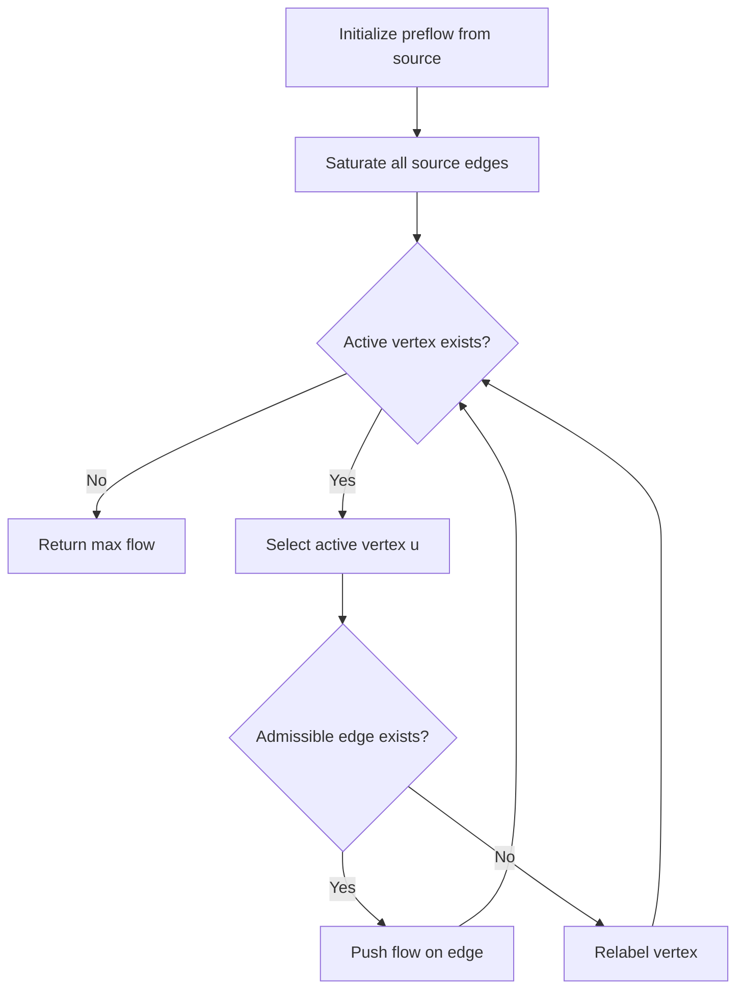
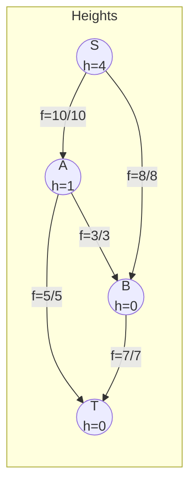

# Push-Relabel Algorithm (Preflow-Push)

## Overview

| Property | Value |
|----------|-------|
| **Category** | Maximum Flow |
| **Complexity (Time)** | O(V²E) generic, O(V³) with highest label |
| **Complexity (Space)** | O(V + E) |
| **Graph Type** | Directed, weighted (capacities) |
| **Best For** | Dense graphs, multiple source/sink |

## Description

The Push-Relabel algorithm (also known as Preflow-Push) is an efficient method for computing maximum flow in a flow network. Unlike augmenting path algorithms (Ford-Fulkerson, Edmonds-Karp), it works locally by maintaining a "preflow" and pushing excess flow from vertices toward the sink.

The algorithm maintains two key invariants:
1. **Capacity constraint**: Flow on each edge doesn't exceed capacity
2. **Height function**: Valid labeling for pushing flow downhill

## Mathematical Foundation

### Preflow Definition

A preflow is a function $f: E \to \mathbb{R}$ satisfying:
$$0 \leq f(u, v) \leq c(u, v)$$

And for all $v \neq s$:
$$\sum_{u \in V} f(u, v) \geq \sum_{w \in V} f(v, w)$$

(Flow into a vertex can exceed flow out)

### Excess Flow

Excess at vertex $v$:
$$e(v) = \sum_{u \in V} f(u, v) - \sum_{w \in V} f(v, w)$$

### Height Function

Valid height function $h: V \to \mathbb{N}$ satisfies:
- $h(s) = |V|$
- $h(t) = 0$
- $h(u) \leq h(v) + 1$ for all residual edges $(u, v)$

### Push Operation

For edge $(u, v)$ with $e(u) > 0$ and $h(u) = h(v) + 1$:
$$\delta = \min(e(u), c_f(u, v))$$

Push $\delta$ units from $u$ to $v$.

### Relabel Operation

For vertex $u$ with $e(u) > 0$ and no admissible edge:
$$h(u) = 1 + \min\{h(v) : (u, v) \in E_f\}$$

## Algorithm

### Pseudocode

```
PUSH_RELABEL(G, s, t):
    // Initialize preflow
    h[v] ← 0 for all v
    h[s] ← |V|
    e[v] ← 0 for all v
    f[u,v] ← 0 for all edges
    
    // Saturate edges from source
    for each edge (s, v):
        f[s,v] ← c[s,v]
        e[v] ← c[s,v]
        e[s] ← e[s] - c[s,v]
    
    // Main loop
    while exists active vertex u (e[u] > 0, u ≠ s, t):
        if exists admissible edge (u, v):
            PUSH(u, v)
        else:
            RELABEL(u)
    
    return sum of flow into t

PUSH(u, v):
    δ ← min(e[u], c[u,v] - f[u,v])
    f[u,v] ← f[u,v] + δ
    f[v,u] ← f[v,u] - δ
    e[u] ← e[u] - δ
    e[v] ← e[v] + δ

RELABEL(u):
    h[u] ← 1 + min{h[v] : (u,v) ∈ Ef}
```

### Step-by-Step Execution

```
Network:
    s →(10)→ A →(5)→ t
    s →(8)→ B →(7)→ t
    A →(3)→ B

Step 1: Initialize
    h[s]=4, h[A]=h[B]=h[t]=0
    Push from s: f[s,A]=10, f[s,B]=8
    e[A]=10, e[B]=8

Step 2: Process A (excess=10)
    Push to t: δ=min(10,5)=5
    f[A,t]=5, e[A]=5
    
Step 3: Process A (excess=5)
    Push to B: δ=min(5,3)=3
    f[A,B]=3, e[A]=2, e[B]=11
    
Step 4: Process A (excess=2)
    No admissible edge → Relabel
    h[A]=min(h[s]+1, h[B]+1, h[t]+1)=1
    
Step 5: Process B (excess=11)
    Push to t: δ=min(11,7)=7
    f[B,t]=7, e[B]=4
    
...continues until no excess at non-source/sink vertices

Final max flow = f[A,t] + f[B,t] = 5 + 7 = 12
```

## Complexity Analysis

### Time Complexity

| Variant | Complexity |
|---------|------------|
| Generic | O(V²E) |
| FIFO | O(V³) |
| Highest Label | O(V² √E) |
| Excess Scaling | O(VE log(V²/E)) |

### Space Complexity

- Heights array: O(V)
- Excess array: O(V)
- Flow values: O(E)
- Total: O(V + E)

## Visual Representation



### Height and Flow Example



## Implementation

### Python Implementation

```python
from __future__ import annotations
from collections import defaultdict
from typing import Dict, List, Tuple, Set


class FlowNetwork:
    """
    Flow network with push-relabel algorithm.
    
    >>> fn = FlowNetwork()
    >>> fn.add_edge("s", "a", 10)
    >>> fn.add_edge("a", "t", 10)
    >>> fn.max_flow("s", "t")
    10
    """
    
    def __init__(self) -> None:
        self.capacity: Dict[Tuple[str, str], int] = defaultdict(int)
        self.flow: Dict[Tuple[str, str], int] = defaultdict(int)
        self.adj: Dict[str, Set[str]] = defaultdict(set)
        self.vertices: Set[str] = set()
    
    def add_edge(self, u: str, v: str, cap: int) -> None:
        """Add edge with capacity."""
        self.capacity[(u, v)] += cap
        self.adj[u].add(v)
        self.adj[v].add(u)
        self.vertices.add(u)
        self.vertices.add(v)
    
    def max_flow(self, source: str, sink: str) -> int:
        """
        Compute maximum flow using push-relabel.
        
        Returns:
            Maximum flow value
        """
        # Initialize
        height: Dict[str, int] = {v: 0 for v in self.vertices}
        excess: Dict[str, int] = {v: 0 for v in self.vertices}
        height[source] = len(self.vertices)
        
        # Initial push from source
        for v in self.adj[source]:
            cap = self.capacity[(source, v)]
            if cap > 0:
                self.flow[(source, v)] = cap
                self.flow[(v, source)] = -cap
                excess[v] = cap
                excess[source] -= cap
        
        # Process active vertices
        active = [v for v in self.vertices if v != source and v != sink and excess[v] > 0]
        
        while active:
            u = active.pop(0)
            
            if excess[u] <= 0:
                continue
            
            pushed = False
            
            for v in self.adj[u]:
                # Residual capacity
                res_cap = self.capacity[(u, v)] - self.flow[(u, v)]
                
                if res_cap > 0 and height[u] == height[v] + 1:
                    # Push
                    delta = min(excess[u], res_cap)
                    self.flow[(u, v)] += delta
                    self.flow[(v, u)] -= delta
                    excess[u] -= delta
                    excess[v] += delta
                    
                    if v != source and v != sink and excess[v] == delta:
                        active.append(v)
                    
                    pushed = True
                    
                    if excess[u] == 0:
                        break
            
            if not pushed and excess[u] > 0:
                # Relabel
                min_height = float('inf')
                for v in self.adj[u]:
                    res_cap = self.capacity[(u, v)] - self.flow[(u, v)]
                    if res_cap > 0:
                        min_height = min(min_height, height[v])
                
                if min_height < float('inf'):
                    height[u] = min_height + 1
                    active.append(u)
        
        return excess[sink]


class PushRelabelExecutor:
    """
    Optimized push-relabel with FIFO active vertex selection.
    """
    
    def __init__(self, graph: Dict[str, Dict[str, int]]):
        """
        Initialize from adjacency dict with capacities.
        
        Args:
            graph: {vertex: {neighbor: capacity}}
        """
        self.graph = graph
        self.vertices = set(graph.keys())
        for u in list(graph.keys()):
            for v in graph[u]:
                self.vertices.add(v)
                if v not in self.graph:
                    self.graph[v] = {}
        
        # Initialize data structures
        self.preflow: Dict[str, Dict[str, int]] = defaultdict(lambda: defaultdict(int))
        self.heights: Dict[str, int] = {}
        self.excesses: Dict[str, int] = {}
    
    def execute(self, source: str, sink: str) -> int:
        """Execute push-relabel algorithm."""
        # Initialize heights and excesses
        n = len(self.vertices)
        self.heights = {v: 0 for v in self.vertices}
        self.heights[source] = n
        self.excesses = {v: 0 for v in self.vertices}
        
        # Initial preflow from source
        for v, cap in self.graph.get(source, {}).items():
            if cap > 0:
                self.preflow[source][v] = cap
                self.preflow[v][source] = -cap
                self.excesses[v] = cap
                self.excesses[source] -= cap
        
        # FIFO queue of active vertices
        from collections import deque
        active = deque([
            v for v in self.vertices 
            if v != source and v != sink and self.excesses[v] > 0
        ])
        
        while active:
            u = active.popleft()
            self._process_vertex(u, source, sink, active)
        
        return self.excesses[sink]
    
    def _process_vertex(
        self, 
        u: str, 
        source: str, 
        sink: str,
        active: 'deque'
    ) -> None:
        """Process active vertex with push or relabel."""
        while self.excesses[u] > 0:
            pushed = False
            
            for v in list(self.vertices):
                # Calculate residual capacity
                cap = self.graph.get(u, {}).get(v, 0)
                flow = self.preflow[u][v]
                res_cap = cap - flow
                
                if res_cap > 0 and self.heights[u] == self.heights[v] + 1:
                    # Push operation
                    delta = min(self.excesses[u], res_cap)
                    self._push(u, v, delta)
                    
                    if v != source and v != sink and self.excesses[v] == delta:
                        active.append(v)
                    
                    pushed = True
                    
                    if self.excesses[u] == 0:
                        break
            
            if not pushed:
                # Relabel operation
                self._relabel(u)
    
    def _push(self, u: str, v: str, delta: int) -> None:
        """Push delta flow from u to v."""
        self.preflow[u][v] += delta
        self.preflow[v][u] -= delta
        self.excesses[u] -= delta
        self.excesses[v] += delta
    
    def _relabel(self, u: str) -> None:
        """Relabel vertex u to minimum valid height."""
        min_height = float('inf')
        
        for v in self.vertices:
            cap = self.graph.get(u, {}).get(v, 0)
            flow = self.preflow[u][v]
            
            if cap - flow > 0:
                min_height = min(min_height, self.heights[v])
        
        if min_height < float('inf'):
            self.heights[u] = min_height + 1
```

### Multiple Source/Sink Version

```python
class MultiSourceSinkFlow:
    """
    Push-relabel with multiple sources and sinks.
    
    Normalizes graph by adding super-source and super-sink.
    """
    
    def __init__(self):
        self.adj: Dict[str, Dict[str, int]] = defaultdict(dict)
        self.sources: List[str] = []
        self.sinks: List[str] = []
    
    def add_edge(self, u: str, v: str, capacity: int) -> None:
        """Add directed edge with capacity."""
        self.adj[u][v] = capacity
    
    def add_source(self, node: str, capacity: int = float('inf')) -> None:
        """Mark node as source with optional capacity."""
        self.sources.append((node, capacity))
    
    def add_sink(self, node: str, capacity: int = float('inf')) -> None:
        """Mark node as sink with optional capacity."""
        self.sinks.append((node, capacity))
    
    def _normalize_graph(self) -> Tuple[Dict[str, Dict[str, int]], str, str]:
        """
        Create normalized graph with single super-source and super-sink.
        """
        normalized = defaultdict(dict)
        
        # Copy original edges
        for u in self.adj:
            for v, cap in self.adj[u].items():
                normalized[u][v] = cap
        
        # Add super-source
        super_source = "__SUPER_SOURCE__"
        for source, cap in self.sources:
            normalized[super_source][source] = cap if cap != float('inf') else 10**9
        
        # Add super-sink
        super_sink = "__SUPER_SINK__"
        for sink, cap in self.sinks:
            normalized[sink][super_sink] = cap if cap != float('inf') else 10**9
        
        return dict(normalized), super_source, super_sink
    
    def max_flow(self) -> int:
        """
        Compute maximum flow with multiple sources/sinks.
        """
        normalized, source, sink = self._normalize_graph()
        executor = PushRelabelExecutor(normalized)
        return executor.execute(source, sink)
```

## Real-World Applications

### 1. Network Traffic Management

```python
from dataclasses import dataclass
from typing import Dict, List, Tuple


@dataclass
class Router:
    """Network router."""
    name: str
    capacity: int  # Max throughput


@dataclass
class Link:
    """Network link."""
    source: str
    dest: str
    bandwidth: int


class NetworkFlowOptimizer:
    """
    Optimize network traffic using push-relabel.
    """
    
    def __init__(self):
        self.routers: Dict[str, Router] = {}
        self.links: List[Link] = []
    
    def add_router(self, name: str, capacity: int) -> None:
        """Add router to network."""
        self.routers[name] = Router(name, capacity)
    
    def add_link(self, source: str, dest: str, bandwidth: int) -> None:
        """Add network link."""
        self.links.append(Link(source, dest, bandwidth))
    
    def max_throughput(
        self, 
        sources: List[str], 
        destinations: List[str]
    ) -> Dict[str, any]:
        """
        Calculate maximum network throughput.
        """
        flow_network = MultiSourceSinkFlow()
        
        # Add router capacity edges (split node technique)
        for name, router in self.routers.items():
            flow_network.add_edge(f"{name}_in", f"{name}_out", router.capacity)
        
        # Add link edges
        for link in self.links:
            flow_network.add_edge(
                f"{link.source}_out", 
                f"{link.dest}_in", 
                link.bandwidth
            )
        
        # Mark sources and destinations
        for src in sources:
            flow_network.add_source(f"{src}_in")
        for dst in destinations:
            flow_network.add_sink(f"{dst}_out")
        
        max_flow = flow_network.max_flow()
        
        return {
            "max_throughput": max_flow,
            "sources": sources,
            "destinations": destinations
        }


def demo_network_optimization():
    optimizer = NetworkFlowOptimizer()
    
    # Add routers
    for name, cap in [("A", 100), ("B", 150), ("C", 80), ("D", 120)]:
        optimizer.add_router(name, cap)
    
    # Add links
    links = [
        ("A", "B", 60),
        ("A", "C", 40),
        ("B", "D", 70),
        ("C", "D", 50),
        ("B", "C", 30)
    ]
    for src, dst, bw in links:
        optimizer.add_link(src, dst, bw)
    
    result = optimizer.max_throughput(["A"], ["D"])
    return result
```

### 2. Bipartite Matching

```python
from typing import List, Set, Tuple, Dict


class BipartiteMatcher:
    """
    Maximum bipartite matching using push-relabel.
    """
    
    def __init__(
        self, 
        left_nodes: List[str], 
        right_nodes: List[str]
    ):
        self.left = left_nodes
        self.right = right_nodes
        self.edges: List[Tuple[str, str]] = []
    
    def add_edge(self, left: str, right: str) -> None:
        """Add potential matching edge."""
        self.edges.append((left, right))
    
    def find_maximum_matching(self) -> List[Tuple[str, str]]:
        """
        Find maximum cardinality matching.
        
        Returns:
            List of matched pairs
        """
        # Build flow network
        network = FlowNetwork()
        source = "__SOURCE__"
        sink = "__SINK__"
        
        # Connect source to all left nodes
        for node in self.left:
            network.add_edge(source, f"L_{node}", 1)
        
        # Connect all right nodes to sink
        for node in self.right:
            network.add_edge(f"R_{node}", sink, 1)
        
        # Add matching edges
        for left, right in self.edges:
            network.add_edge(f"L_{left}", f"R_{right}", 1)
        
        # Compute max flow
        max_flow = network.max_flow(source, sink)
        
        # Extract matching
        matching = []
        for left, right in self.edges:
            if network.flow[(f"L_{left}", f"R_{right}")] > 0:
                matching.append((left, right))
        
        return matching


def demo_job_assignment():
    """Assign workers to jobs optimally."""
    matcher = BipartiteMatcher(
        left_nodes=["Alice", "Bob", "Carol"],
        right_nodes=["Task1", "Task2", "Task3", "Task4"]
    )
    
    # Alice can do Task1, Task2
    matcher.add_edge("Alice", "Task1")
    matcher.add_edge("Alice", "Task2")
    
    # Bob can do Task2, Task3
    matcher.add_edge("Bob", "Task2")
    matcher.add_edge("Bob", "Task3")
    
    # Carol can do Task3, Task4
    matcher.add_edge("Carol", "Task3")
    matcher.add_edge("Carol", "Task4")
    
    matching = matcher.find_maximum_matching()
    print(f"Maximum matching ({len(matching)} pairs):")
    for worker, task in matching:
        print(f"  {worker} → {task}")
    
    return matching
```

## Comparison with Other Max Flow Algorithms

| Algorithm | Time Complexity | Best For |
|-----------|-----------------|----------|
| Ford-Fulkerson | O(E × max_flow) | Small integer capacities |
| Edmonds-Karp | O(VE²) | General sparse graphs |
| Dinic | O(V²E) | Unit capacity graphs |
| Push-Relabel | O(V²E) or O(V³) | Dense graphs |

## References

1. Goldberg, A.V., Tarjan, R.E. "A New Approach to the Maximum Flow Problem" (1988)
2. [Push-relabel Algorithm - Wikipedia](https://en.wikipedia.org/wiki/Push%E2%80%93relabel_maximum_flow_algorithm)
3. Cormen, T.H. et al. "Introduction to Algorithms", Chapter 26

## See Also

- [Dinic's Algorithm](dinic.md) - Level graph max flow
- [Edmonds-Karp](edmonds_karp.md) - BFS-based augmenting paths
- [Ford-Fulkerson](ford_fulkerson.md) - Basic max flow
