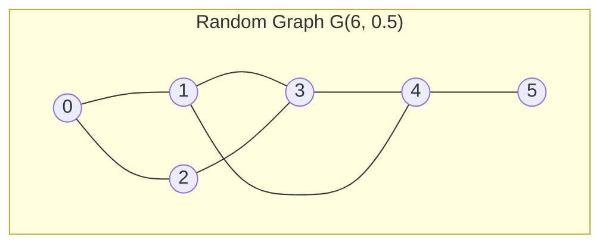
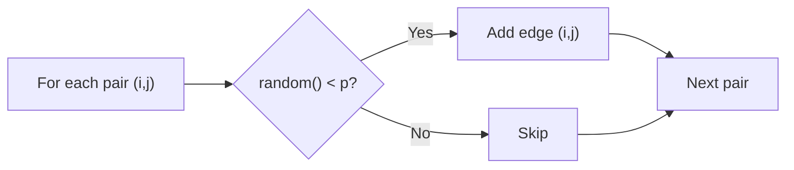

# Random Graph Generator

## Overview

| Property | Value |
|----------|-------|
| **Category** | Graph Construction |
| **Model** | Erdős–Rényi G(n, p) |
| **Complexity (Time)** | O(n²) |
| **Complexity (Space)** | O(n + m) |
| **Output** | Adjacency list |

## Description

Random Graph Generator creates graphs where each potential edge exists independently with a fixed probability $p$. This implements the Erdős–Rényi $G(n, p)$ model, one of the most fundamental random graph models in mathematics and computer science.

These random graphs are essential for algorithm testing, network simulation, and studying theoretical properties of graphs.

## Mathematical Foundation

### Erdős–Rényi Model G(n, p)

A graph $G(n, p)$ is constructed on $n$ vertices where each of the $\binom{n}{2}$ possible edges appears independently with probability $p$.

### Expected Properties

**Expected number of edges:**
$$E[m] = \binom{n}{2} \cdot p = \frac{n(n-1)}{2} \cdot p$$

**Expected degree of a vertex:**
$$E[\deg(v)] = (n - 1) \cdot p$$

**Degree distribution:**
$$P(\deg(v) = k) = \binom{n-1}{k} p^k (1-p)^{n-1-k}$$

This follows a binomial distribution $B(n-1, p)$.

### Phase Transitions

Critical thresholds for graph properties:

| Property | Threshold |
|----------|-----------|
| Giant component | $p = \frac{1}{n}$ |
| Connectivity | $p = \frac{\ln n}{n}$ |
| Hamiltonicity | $p = \frac{\ln n + \ln \ln n}{n}$ |

### Connectivity Probability

For $p = \frac{\ln n + c}{n}$:
$$P(\text{connected}) \to e^{-e^{-c}} \text{ as } n \to \infty$$

## Algorithm

### Pseudocode

```
RANDOM-GRAPH(n, p, directed=False):
    graph ← empty adjacency list for n vertices
    
    if p ≥ 1:
        return COMPLETE-GRAPH(n)
    
    if p ≤ 0:
        return graph (no edges)
    
    for i = 0 to n-1:
        for j = i+1 to n-1:
            if random() < p:
                graph[i].add(j)
                if not directed:
                    graph[j].add(i)
    
    return graph

COMPLETE-GRAPH(n):
    graph ← empty adjacency list
    for i = 0 to n-1:
        graph[i] ← [j for j = 0 to n-1, j ≠ i]
    return graph
```

### Alternative: G(n, m) Model

```
RANDOM-GRAPH-FIXED-EDGES(n, m):
    graph ← empty adjacency list for n vertices
    edges ← all possible edges
    
    selected ← random sample of m edges from edges
    
    for (u, v) in selected:
        graph[u].add(v)
        graph[v].add(u)
    
    return graph
```

## Complexity Analysis

### Time Complexity

| Operation | Complexity |
|-----------|------------|
| G(n, p) generation | O(n²) |
| Complete graph | O(n²) |
| G(n, m) with edge list | O(n² + m) |

### Space Complexity

| Component | Space |
|-----------|-------|
| Adjacency list | O(n + m) |
| Expected edges | O(n² · p) |

## Visual Representation



### Generation Process



## Implementation

### Python Implementation

```python
import random


def random_graph(
    vertices_number: int,
    probability: float,
    directed: bool = False
) -> dict[int, list[int]]:
    """
    Generate a random graph using G(n, p) model.
    
    Args:
        vertices_number: Number of vertices (n)
        probability: Edge probability (p)
        directed: If True, generate directed graph
    
    Returns:
        Adjacency list representation
    
    Examples:
        >>> random.seed(42)
        >>> g = random_graph(4, 0.5)
        >>> len(g)
        4
        >>> random.seed(42)
        >>> random_graph(3, 1.0)  # Complete graph
        {0: [1, 2], 1: [0, 2], 2: [0, 1]}
        >>> random_graph(3, 0.0)  # Empty graph
        {0: [], 1: [], 2: []}
    """
    graph: dict[int, list[int]] = {i: [] for i in range(vertices_number)}
    
    # Complete graph if p >= 1
    if probability >= 1:
        return complete_graph(vertices_number)
    
    # Empty graph if p <= 0
    if probability <= 0:
        return graph
    
    # Generate edges with probability p
    for i in range(vertices_number):
        for j in range(i + 1, vertices_number):
            if random.random() < probability:
                graph[i].append(j)
                if not directed:
                    graph[j].append(i)
    
    return graph


def complete_graph(vertices_number: int) -> dict[int, list[int]]:
    """
    Generate a complete graph K_n.
    
    Examples:
        >>> complete_graph(3)
        {0: [1, 2], 1: [0, 2], 2: [0, 1]}
        >>> complete_graph(1)
        {0: []}
    """
    return {
        i: [j for j in range(vertices_number) if j != i]
        for i in range(vertices_number)
    }
```

### Extended Graph Generator

```python
import random
from typing import Optional
from dataclasses import dataclass


@dataclass
class GraphStats:
    """Statistics about a generated graph."""
    vertices: int
    edges: int
    avg_degree: float
    max_degree: int
    min_degree: int
    is_connected: bool


class RandomGraphGenerator:
    """
    Comprehensive random graph generator with multiple models.
    """
    
    def __init__(self, seed: Optional[int] = None):
        """Initialize with optional random seed."""
        if seed is not None:
            random.seed(seed)
    
    def gnp(
        self,
        n: int,
        p: float,
        directed: bool = False
    ) -> dict[int, list[int]]:
        """
        Generate G(n, p) random graph.
        
        >>> gen = RandomGraphGenerator(seed=42)
        >>> g = gen.gnp(5, 0.5)
        >>> len(g)
        5
        """
        return random_graph(n, p, directed)
    
    def gnm(
        self,
        n: int,
        m: int,
        directed: bool = False
    ) -> dict[int, list[int]]:
        """
        Generate G(n, m) random graph with exactly m edges.
        
        >>> gen = RandomGraphGenerator(seed=42)
        >>> g = gen.gnm(5, 4)
        >>> sum(len(adj) for adj in g.values()) // 2
        4
        """
        graph = {i: [] for i in range(n)}
        
        # Generate all possible edges
        if directed:
            possible_edges = [
                (i, j) for i in range(n) for j in range(n) if i != j
            ]
        else:
            possible_edges = [
                (i, j) for i in range(n) for j in range(i + 1, n)
            ]
        
        # Clamp m to valid range
        m = min(m, len(possible_edges))
        
        # Select m random edges
        selected = random.sample(possible_edges, m)
        
        for u, v in selected:
            graph[u].append(v)
            if not directed:
                graph[v].append(u)
        
        return graph
    
    def regular(self, n: int, k: int) -> dict[int, list[int]]:
        """
        Generate a random k-regular graph (every vertex has degree k).
        
        Uses configuration model.
        Note: k*n must be even.
        
        >>> gen = RandomGraphGenerator(seed=42)
        >>> g = gen.regular(6, 2)
        >>> all(len(adj) == 2 for adj in g.values())
        True
        """
        if k * n % 2 != 0:
            raise ValueError("k * n must be even")
        
        if k >= n:
            raise ValueError("k must be less than n")
        
        # Configuration model: create k stubs per vertex
        stubs = []
        for v in range(n):
            stubs.extend([v] * k)
        
        graph = {i: [] for i in range(n)}
        
        # Repeatedly try to match stubs
        max_attempts = 100
        for _ in range(max_attempts):
            random.shuffle(stubs)
            temp_graph = {i: [] for i in range(n)}
            valid = True
            
            for i in range(0, len(stubs), 2):
                u, v = stubs[i], stubs[i + 1]
                
                # Reject self-loops and multi-edges
                if u == v or v in temp_graph[u]:
                    valid = False
                    break
                
                temp_graph[u].append(v)
                temp_graph[v].append(u)
            
            if valid:
                return temp_graph
        
        raise RuntimeError("Could not generate valid regular graph")
    
    def bipartite(
        self,
        n1: int,
        n2: int,
        p: float
    ) -> dict[int, list[int]]:
        """
        Generate random bipartite graph.
        
        Vertices 0 to n1-1 in first set, n1 to n1+n2-1 in second.
        
        >>> gen = RandomGraphGenerator(seed=42)
        >>> g = gen.bipartite(3, 3, 0.5)
        >>> len(g)
        6
        """
        n = n1 + n2
        graph = {i: [] for i in range(n)}
        
        for i in range(n1):
            for j in range(n1, n):
                if random.random() < p:
                    graph[i].append(j)
                    graph[j].append(i)
        
        return graph
    
    def tree(self, n: int) -> dict[int, list[int]]:
        """
        Generate a random tree with n vertices.
        
        Uses Prüfer sequence.
        
        >>> gen = RandomGraphGenerator(seed=42)
        >>> g = gen.tree(5)
        >>> sum(len(adj) for adj in g.values()) // 2
        4
        """
        if n == 1:
            return {0: []}
        
        if n == 2:
            return {0: [1], 1: [0]}
        
        # Generate random Prüfer sequence
        prufer = [random.randint(0, n - 1) for _ in range(n - 2)]
        
        # Convert Prüfer sequence to tree
        graph = {i: [] for i in range(n)}
        degree = [1] * n
        
        for v in prufer:
            degree[v] += 1
        
        for v in prufer:
            for u in range(n):
                if degree[u] == 1:
                    graph[u].append(v)
                    graph[v].append(u)
                    degree[u] -= 1
                    degree[v] -= 1
                    break
        
        # Connect last two vertices
        leaves = [v for v in range(n) if degree[v] == 1]
        if len(leaves) == 2:
            u, v = leaves
            graph[u].append(v)
            graph[v].append(u)
        
        return graph
    
    def get_stats(self, graph: dict[int, list[int]]) -> GraphStats:
        """
        Compute statistics for a graph.
        
        >>> gen = RandomGraphGenerator(seed=42)
        >>> g = gen.gnp(5, 0.5)
        >>> stats = gen.get_stats(g)
        >>> stats.vertices
        5
        """
        n = len(graph)
        degrees = [len(adj) for adj in graph.values()]
        m = sum(degrees) // 2  # Undirected
        
        # Check connectivity via BFS
        if n == 0:
            is_connected = True
        else:
            visited = set()
            queue = [0]
            visited.add(0)
            
            while queue:
                v = queue.pop(0)
                for u in graph[v]:
                    if u not in visited:
                        visited.add(u)
                        queue.append(u)
            
            is_connected = len(visited) == n
        
        return GraphStats(
            vertices=n,
            edges=m,
            avg_degree=sum(degrees) / n if n > 0 else 0,
            max_degree=max(degrees) if degrees else 0,
            min_degree=min(degrees) if degrees else 0,
            is_connected=is_connected
        )
```

## Real-World Applications

### 1. Network Simulation

```python
class NetworkSimulator:
    """
    Simulate network behavior on random topologies.
    """
    
    def __init__(self, nodes: int, connectivity: float):
        self.gen = RandomGraphGenerator()
        self.topology = self.gen.gnp(nodes, connectivity)
        self.nodes = nodes
    
    def simulate_message_propagation(
        self,
        source: int,
        hop_limit: int = 10
    ) -> dict[int, int]:
        """
        Simulate message spreading from source.
        Returns nodes reached at each hop.
        """
        reached = {source: 0}
        frontier = [source]
        
        for hop in range(1, hop_limit + 1):
            new_frontier = []
            for node in frontier:
                for neighbor in self.topology[node]:
                    if neighbor not in reached:
                        reached[neighbor] = hop
                        new_frontier.append(neighbor)
            
            if not new_frontier:
                break
            frontier = new_frontier
        
        return reached
    
    def estimate_avg_path_length(self, samples: int = 100) -> float:
        """Estimate average path length via sampling."""
        import random
        
        total_length = 0
        count = 0
        
        for _ in range(samples):
            source = random.randint(0, self.nodes - 1)
            target = random.randint(0, self.nodes - 1)
            
            if source == target:
                continue
            
            # BFS for shortest path
            distances = self.simulate_message_propagation(source)
            
            if target in distances:
                total_length += distances[target]
                count += 1
        
        return total_length / count if count > 0 else float('inf')
```

### 2. Algorithm Benchmarking

```python
import time
from typing import Callable


class AlgorithmBenchmark:
    """
    Benchmark graph algorithms on random graphs.
    """
    
    def __init__(self):
        self.gen = RandomGraphGenerator()
    
    def benchmark(
        self,
        algorithm: Callable[[dict], any],
        sizes: list[int],
        probabilities: list[float],
        trials: int = 5
    ) -> dict[tuple[int, float], float]:
        """
        Run algorithm on various graph sizes and densities.
        
        Returns dict mapping (n, p) to average runtime.
        """
        results = {}
        
        for n in sizes:
            for p in probabilities:
                times = []
                
                for _ in range(trials):
                    graph = self.gen.gnp(n, p)
                    
                    start = time.perf_counter()
                    algorithm(graph)
                    elapsed = time.perf_counter() - start
                    
                    times.append(elapsed)
                
                results[(n, p)] = sum(times) / len(times)
        
        return results
    
    def test_scalability(
        self,
        algorithm: Callable,
        max_size: int = 1000,
        step: int = 100,
        probability: float = 0.1
    ) -> list[tuple[int, float]]:
        """Test algorithm scalability with increasing graph size."""
        results = []
        
        for n in range(step, max_size + 1, step):
            graph = self.gen.gnp(n, probability)
            
            start = time.perf_counter()
            algorithm(graph)
            elapsed = time.perf_counter() - start
            
            results.append((n, elapsed))
        
        return results
```

### 3. Epidemiological Modeling

```python
import random


class EpidemicSimulator:
    """
    Simulate disease spread on random contact network.
    """
    
    def __init__(
        self,
        population: int,
        avg_contacts: float,
        infection_prob: float,
        recovery_prob: float
    ):
        # Create contact network
        p = avg_contacts / (population - 1)
        gen = RandomGraphGenerator()
        self.network = gen.gnp(population, p)
        
        self.infection_prob = infection_prob
        self.recovery_prob = recovery_prob
        self.population = population
    
    def run_simulation(
        self,
        initial_infected: int = 1,
        max_days: int = 100
    ) -> list[dict[str, int]]:
        """
        Run SIR simulation.
        
        Returns daily counts of Susceptible, Infected, Recovered.
        """
        # Initialize states
        states = ['S'] * self.population
        initial = random.sample(range(self.population), initial_infected)
        for i in initial:
            states[i] = 'I'
        
        history = []
        
        for day in range(max_days):
            counts = {
                'S': states.count('S'),
                'I': states.count('I'),
                'R': states.count('R')
            }
            history.append(counts)
            
            if counts['I'] == 0:
                break
            
            new_states = states.copy()
            
            for person in range(self.population):
                if states[person] == 'I':
                    # Try to infect neighbors
                    for neighbor in self.network[person]:
                        if states[neighbor] == 'S':
                            if random.random() < self.infection_prob:
                                new_states[neighbor] = 'I'
                    
                    # Try to recover
                    if random.random() < self.recovery_prob:
                        new_states[person] = 'R'
            
            states = new_states
        
        return history
```

## Graph Models Comparison

| Model | Parameters | Edge Count | Degree Distribution |
|-------|------------|------------|---------------------|
| G(n, p) | n, p | Variable | Binomial |
| G(n, m) | n, m | Fixed | Similar to G(n, p) |
| k-Regular | n, k | Fixed (nk/2) | Constant k |
| Barabási–Albert | n, m₀ | Fixed | Power law |

## References

1. [Random Graph - Wikipedia](https://en.wikipedia.org/wiki/Random_graph)
2. [Erdős–Rényi Model - Wikipedia](https://en.wikipedia.org/wiki/Erd%C5%91s%E2%80%93R%C3%A9nyi_model)
3. Bollobás, B. "Random Graphs" (2001)
4. Newman, M. "Networks: An Introduction" (2010)

## See Also

- [Graph Representations](graph_representations.md) - Adjacency list/matrix
- [Connected Components](connected_components.md) - Connectivity analysis
- [PageRank](pagerank.md) - Graph centrality
