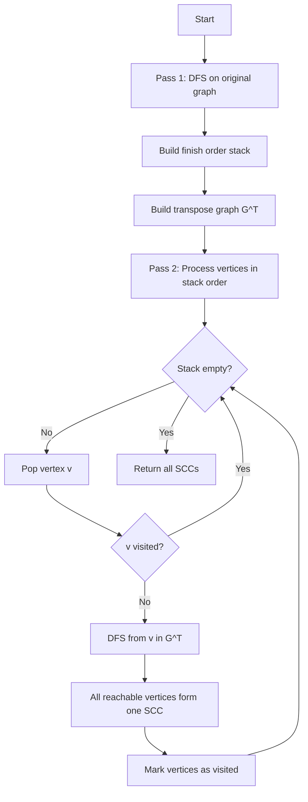
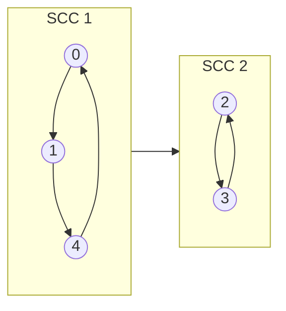

# Strongly Connected Components (Kosaraju's Algorithm)

## Overview

| Property | Value |
|----------|-------|
| **Category** | Graph Connectivity |
| **Complexity (Time)** | O(V + E) |
| **Complexity (Space)** | O(V) |
| **Graph Type** | Directed |
| **Best For** | DAG construction, cycle detection, 2-SAT |

## Description

Strongly Connected Components (SCCs) partition a directed graph into maximal subgraphs where every vertex is reachable from every other vertex within the same component. Kosaraju's algorithm finds all SCCs using two DFS passes: one on the original graph to compute finishing times, and another on the reversed graph in decreasing finishing time order.

The algorithm exploits the property that SCCs in the reversed graph are identical to those in the original graph, but the component graph's topological order is reversed.

## Mathematical Foundation

### Strong Connectivity

For directed graph $G = (V, E)$, vertices $u$ and $v$ are strongly connected if:

$$u \rightsquigarrow v \land v \rightsquigarrow u$$

where $\rightsquigarrow$ denotes reachability.

### SCC Definition

A strongly connected component is a maximal set $C \subseteq V$ such that:

$$\forall u, v \in C: u \rightsquigarrow v \land v \rightsquigarrow u$$

### Component Graph

The component graph $G^{SCC} = (V^{SCC}, E^{SCC})$ where:
- $V^{SCC}$ = set of SCCs
- $(C_i, C_j) \in E^{SCC}$ iff $\exists u \in C_i, v \in C_j: (u,v) \in E$

**Key Property**: $G^{SCC}$ is always a DAG (directed acyclic graph).

### Transpose Graph

The transpose $G^T = (V, E^T)$ where:

$$E^T = \{(v, u) : (u, v) \in E\}$$

**Property**: $G$ and $G^T$ have the same SCCs.

### Finishing Time Property

If there's an edge from SCC $C_1$ to $C_2$ in $G$, then:

$$\max_{v \in C_1} f(v) > \max_{u \in C_2} f(u)$$

where $f(v)$ is the DFS finishing time of vertex $v$.

## Algorithm

### Pseudocode

```
KOSARAJU_SCC(graph G):
    // Pass 1: Compute finishing order
    finish_order ← []
    visited ← array of size |V|, all false
    
    for each vertex v in V:
        if not visited[v]:
            TOPOLOGY_SORT(v, visited, finish_order)
    
    // Pass 2: Find SCCs in reversed graph
    G_T ← transpose of G
    visited ← array of size |V|, all false
    sccs ← []
    
    while finish_order is not empty:
        v ← finish_order.pop()  // Highest finish time first
        if not visited[v]:
            component ← []
            FIND_COMPONENT(v, G_T, visited, component)
            sccs.append(component)
    
    return sccs

TOPOLOGY_SORT(v, visited, stack):
    visited[v] ← true
    for each neighbor u of v:
        if not visited[u]:
            TOPOLOGY_SORT(u, visited, stack)
    stack.append(v)  // Add after all descendants

FIND_COMPONENT(v, graph, visited, component):
    visited[v] ← true
    component.append(v)
    for each neighbor u of v:
        if not visited[u]:
            FIND_COMPONENT(u, graph, visited, component)
```

### Step-by-Step Execution

```
Graph:
  0 → 1 → 2 → 3
  ↑   ↓       ↓
  └─ 4 ←──── 5

Adjacency list:
  0: [1]
  1: [2, 4]
  2: [3]
  3: [5]
  4: [0]
  5: [4]

Pass 1: DFS to get finishing order
  Start at 0:
    Visit 0 → 1 → 2 → 3 → 5 → 4
    Backtrack: 4 finishes, 5 finishes, 3 finishes, 
               2 finishes, 1 finishes, 0 finishes
  
  Finish order (stack): [4, 5, 3, 2, 1, 0]
  Pop order (reverse): [0, 1, 2, 3, 5, 4]

Transpose graph G^T:
  0: [4]
  1: [0]
  2: [1]
  3: [2]
  4: [1, 5]
  5: [3]

Pass 2: DFS on G^T in reverse finish order
  
  Process 0:
    DFS from 0 in G^T: 0 → 4 → 1 → (0 visited) → 5 → 3 → 2 → (1 visited)
    Component: {0, 4, 1, 5, 3, 2}
    
Wait, let's redo this more carefully...

Correct Pass 1:
  DFS from 0:
    visit(0): call visit(1)
      visit(1): call visit(2), call visit(4)
        visit(2): call visit(3)
          visit(3): call visit(5)
            visit(5): call visit(4)
              visit(4): call visit(0) - already visited
              4 finishes: stack = [4]
            5 finishes: stack = [4, 5]
          3 finishes: stack = [4, 5, 3]
        2 finishes: stack = [4, 5, 3, 2]
        (visit 4 - already visited)
      1 finishes: stack = [4, 5, 3, 2, 1]
    0 finishes: stack = [4, 5, 3, 2, 1, 0]

Process in order: 0, 1, 2, 3, 5, 4

Pass 2 on G^T:
  Process 0: DFS finds {0, 4, 1} - SCC 1
  Process 2: DFS finds {2} - SCC 2  
  Process 3: DFS finds {3, 5} - SCC 3

Actually, let me recalculate with correct graph:

New Graph (clearer cycles):
  0 → 1    2 → 3
  ↑   ↓    ↑   ↓
  4 ← 5    6 ← 7

Adjacency list:
  0: [1]
  1: [5]
  4: [0]
  5: [4]
  2: [3]
  3: [7]
  6: [2]
  7: [6]

This has 2 SCCs: {0,1,4,5} and {2,3,6,7}
```

## Complexity Analysis

### Time Complexity

| Pass | Operations | Complexity |
|------|-----------|-----------|
| Build transpose | Visit all edges | O(E) |
| DFS Pass 1 | Visit all vertices/edges | O(V + E) |
| DFS Pass 2 | Visit all vertices/edges | O(V + E) |
| **Total** | | **O(V + E)** |

### Space Complexity

| Component | Space |
|-----------|-------|
| Visited array | O(V) |
| Finish order stack | O(V) |
| Transpose graph | O(V + E) |
| Recursion stack | O(V) |
| **Total** | **O(V + E)** |

## Visual Representation



### SCC Graph Visualization



## Implementation

### Python Implementation

```python
from __future__ import annotations


def topology_sort(
    node: int,
    graph: dict[int, list[int]],
    visited: list[bool],
    stack: list[int]
) -> None:
    """
    DFS-based topological sort helper.
    
    Adds nodes to stack in finishing time order.
    """
    visited[node] = True
    
    for neighbor in graph.get(node, []):
        if not visited[neighbor]:
            topology_sort(neighbor, graph, visited, stack)
    
    stack.append(node)


def find_component(
    node: int,
    graph: dict[int, list[int]],
    visited: list[bool],
    component: list[int]
) -> None:
    """
    DFS to find all nodes in component.
    """
    visited[node] = True
    component.append(node)
    
    for neighbor in graph.get(node, []):
        if not visited[neighbor]:
            find_component(neighbor, graph, visited, component)


def strongly_connected_components(
    num_vertices: int,
    graph: dict[int, list[int]]
) -> list[list[int]]:
    """
    Find all strongly connected components using Kosaraju's algorithm.
    
    Args:
        num_vertices: Number of vertices (0 to n-1)
        graph: Adjacency list of directed edges
    
    Returns:
        List of SCCs, each SCC is a list of vertices
    
    Examples:
        >>> graph = {0: [1], 1: [2, 4], 2: [3], 3: [5], 4: [0], 5: [4]}
        >>> sccs = strongly_connected_components(6, graph)
        >>> len(sccs)
        2
    """
    # Pass 1: Get finish order
    visited = [False] * num_vertices
    finish_stack: list[int] = []
    
    for v in range(num_vertices):
        if not visited[v]:
            topology_sort(v, graph, visited, finish_stack)
    
    # Build transpose graph
    transpose: dict[int, list[int]] = {v: [] for v in range(num_vertices)}
    for u in graph:
        for v in graph[u]:
            transpose[v].append(u)
    
    # Pass 2: Find SCCs
    visited = [False] * num_vertices
    sccs: list[list[int]] = []
    
    while finish_stack:
        v = finish_stack.pop()
        if not visited[v]:
            component: list[int] = []
            find_component(v, transpose, visited, component)
            sccs.append(component)
    
    return sccs
```

### Iterative Implementation

```python
def kosaraju_iterative(
    n: int,
    edges: list[tuple[int, int]]
) -> list[list[int]]:
    """
    Iterative Kosaraju's algorithm (avoids recursion limit).
    
    Args:
        n: Number of vertices
        edges: List of (from, to) directed edges
    
    Returns:
        List of SCCs
    """
    # Build graphs
    graph: dict[int, list[int]] = {i: [] for i in range(n)}
    transpose: dict[int, list[int]] = {i: [] for i in range(n)}
    
    for u, v in edges:
        graph[u].append(v)
        transpose[v].append(u)
    
    # Pass 1: Iterative DFS for finish order
    visited = [False] * n
    finish_order: list[int] = []
    
    for start in range(n):
        if visited[start]:
            continue
        
        stack = [(start, False)]  # (vertex, processed)
        
        while stack:
            v, processed = stack.pop()
            
            if processed:
                finish_order.append(v)
                continue
            
            if visited[v]:
                continue
            
            visited[v] = True
            stack.append((v, True))  # Will add to finish_order later
            
            for neighbor in graph[v]:
                if not visited[neighbor]:
                    stack.append((neighbor, False))
    
    # Pass 2: Find SCCs
    visited = [False] * n
    sccs: list[list[int]] = []
    
    for v in reversed(finish_order):
        if visited[v]:
            continue
        
        component: list[int] = []
        stack = [v]
        
        while stack:
            u = stack.pop()
            if visited[u]:
                continue
            
            visited[u] = True
            component.append(u)
            
            for neighbor in transpose[u]:
                if not visited[neighbor]:
                    stack.append(neighbor)
        
        sccs.append(component)
    
    return sccs
```

## Real-World Applications

### 1. Software Dependency Analysis

```python
from dataclasses import dataclass, field
from typing import Dict, List, Set, Tuple
from enum import Enum


@dataclass
class Module:
    """Software module with dependencies."""
    name: str
    dependencies: Set[str] = field(default_factory=set)


class DependencyAnalyzer:
    """
    Analyze software dependencies for circular references.
    """
    
    def __init__(self):
        self.modules: Dict[str, Module] = {}
    
    def add_module(self, name: str) -> None:
        """Add module to analysis."""
        if name not in self.modules:
            self.modules[name] = Module(name)
    
    def add_dependency(self, module: str, depends_on: str) -> None:
        """Record that module depends on depends_on."""
        self.add_module(module)
        self.add_module(depends_on)
        self.modules[module].dependencies.add(depends_on)
    
    def find_circular_dependencies(self) -> List[Set[str]]:
        """
        Find groups of modules with circular dependencies.
        
        Returns:
            List of module sets that have circular dependencies
        """
        # Build graph
        names = list(self.modules.keys())
        idx = {name: i for i, name in enumerate(names)}
        n = len(names)
        
        graph = {i: [] for i in range(n)}
        for name, module in self.modules.items():
            for dep in module.dependencies:
                if dep in idx:
                    graph[idx[name]].append(idx[dep])
        
        # Find SCCs
        sccs = kosaraju_iterative(n, [
            (u, v) for u in graph for v in graph[u]
        ])
        
        # Filter to circular dependencies (SCC size > 1)
        circular = []
        for scc in sccs:
            if len(scc) > 1:
                circular.append({names[i] for i in scc})
        
        return circular
    
    def get_build_order(self) -> List[List[str]]:
        """
        Get build order respecting dependencies.
        
        Returns groups that can be built in parallel.
        """
        sccs = self.find_circular_dependencies()
        
        # If circular deps exist, report error
        if sccs:
            raise ValueError(f"Circular dependencies detected: {sccs}")
        
        # Otherwise, return topological order
        names = list(self.modules.keys())
        idx = {name: i for i, name in enumerate(names)}
        n = len(names)
        
        # Build dependency graph
        indegree = [0] * n
        for name, module in self.modules.items():
            for dep in module.dependencies:
                if dep in idx:
                    indegree[idx[name]] += 1
        
        # BFS for level-by-level ordering
        build_order: List[List[str]] = []
        remaining = set(range(n))
        
        while remaining:
            # Find modules with no remaining dependencies
            ready = [i for i in remaining if indegree[i] == 0]
            
            if not ready:
                break  # Shouldn't happen if no cycles
            
            build_order.append([names[i] for i in ready])
            
            # Update indegrees
            for i in ready:
                remaining.remove(i)
                for j in remaining:
                    if names[i] in self.modules[names[j]].dependencies:
                        indegree[j] -= 1
        
        return build_order
```

### 2. Web Crawler Page Ranking

```python
from dataclasses import dataclass
from typing import Dict, List, Set, Tuple
import random


@dataclass
class WebPage:
    """Web page with links."""
    url: str
    outlinks: Set[str]


class WebAnalyzer:
    """
    Analyze web structure using SCCs for community detection.
    """
    
    def __init__(self):
        self.pages: Dict[str, WebPage] = {}
    
    def add_page(self, url: str, links: Set[str]) -> None:
        """Add page with its outgoing links."""
        self.pages[url] = WebPage(url, links)
    
    def find_web_communities(self) -> List[Set[str]]:
        """
        Find tightly interconnected page communities.
        
        Pages in same SCC have paths between them in both directions.
        """
        urls = list(self.pages.keys())
        idx = {url: i for i, url in enumerate(urls)}
        n = len(urls)
        
        # Build edge list
        edges = []
        for url, page in self.pages.items():
            for link in page.outlinks:
                if link in idx:
                    edges.append((idx[url], idx[link]))
        
        sccs = kosaraju_iterative(n, edges)
        
        return [{urls[i] for i in scc} for scc in sccs]
    
    def get_community_hierarchy(self) -> Dict[str, any]:
        """
        Build hierarchy of web communities.
        """
        communities = self.find_web_communities()
        
        # Sort by size
        communities.sort(key=len, reverse=True)
        
        return {
            "num_communities": len(communities),
            "largest_community": len(communities[0]) if communities else 0,
            "singleton_pages": sum(1 for c in communities if len(c) == 1),
            "communities": [
                {"size": len(c), "sample_urls": list(c)[:3]}
                for c in communities[:10]  # Top 10
            ]
        }
```

### 3. Deadlock Detection in Systems

```python
from dataclasses import dataclass
from typing import Dict, List, Set, Tuple, Optional


@dataclass
class Process:
    """Process with resource requirements."""
    pid: int
    holding: Set[str]  # Resources currently held
    waiting_for: Optional[str]  # Resource waiting for


@dataclass
class Resource:
    """System resource."""
    name: str
    held_by: Optional[int]  # PID holding this resource


class DeadlockDetector:
    """
    Detect deadlocks using SCC in wait-for graph.
    """
    
    def __init__(self):
        self.processes: Dict[int, Process] = {}
        self.resources: Dict[str, Resource] = {}
    
    def add_process(self, pid: int) -> None:
        """Add process."""
        self.processes[pid] = Process(pid, set(), None)
    
    def add_resource(self, name: str) -> None:
        """Add resource."""
        self.resources[name] = Resource(name, None)
    
    def acquire_resource(self, pid: int, resource: str) -> bool:
        """
        Process tries to acquire resource.
        
        Returns True if acquired, False if must wait.
        """
        if resource not in self.resources:
            return False
        
        res = self.resources[resource]
        
        if res.held_by is None:
            res.held_by = pid
            self.processes[pid].holding.add(resource)
            self.processes[pid].waiting_for = None
            return True
        else:
            self.processes[pid].waiting_for = resource
            return False
    
    def release_resource(self, pid: int, resource: str) -> None:
        """Process releases resource."""
        if resource in self.processes[pid].holding:
            self.processes[pid].holding.remove(resource)
            self.resources[resource].held_by = None
    
    def build_wait_for_graph(self) -> Dict[int, List[int]]:
        """
        Build wait-for graph.
        
        Edge from P1 to P2 means P1 is waiting for resource held by P2.
        """
        graph: Dict[int, List[int]] = {pid: [] for pid in self.processes}
        
        for pid, proc in self.processes.items():
            if proc.waiting_for is not None:
                holder = self.resources[proc.waiting_for].held_by
                if holder is not None and holder != pid:
                    graph[pid].append(holder)
        
        return graph
    
    def detect_deadlocks(self) -> List[Set[int]]:
        """
        Detect deadlocked process groups.
        
        Returns:
            List of deadlocked process sets (SCCs of size > 1)
        """
        graph = self.build_wait_for_graph()
        pids = list(self.processes.keys())
        idx = {pid: i for i, pid in enumerate(pids)}
        n = len(pids)
        
        edges = [
            (idx[u], idx[v]) 
            for u, neighbors in graph.items() 
            for v in neighbors
        ]
        
        sccs = kosaraju_iterative(n, edges)
        
        # Deadlock exists if SCC has cycle (size > 1)
        # or single node with self-loop
        deadlocks = []
        for scc in sccs:
            if len(scc) > 1:
                deadlocks.append({pids[i] for i in scc})
            elif len(scc) == 1:
                pid = pids[scc[0]]
                if pid in graph[pid]:  # Self-loop
                    deadlocks.append({pid})
        
        return deadlocks
    
    def get_deadlock_report(self) -> Dict[str, any]:
        """
        Generate detailed deadlock report.
        """
        deadlocks = self.detect_deadlocks()
        
        report = {
            "has_deadlock": len(deadlocks) > 0,
            "deadlock_count": len(deadlocks),
            "deadlocked_processes": sum(len(d) for d in deadlocks),
            "deadlock_details": []
        }
        
        for deadlock in deadlocks:
            detail = {
                "processes": list(deadlock),
                "waiting_chain": []
            }
            
            for pid in deadlock:
                proc = self.processes[pid]
                if proc.waiting_for:
                    holder = self.resources[proc.waiting_for].held_by
                    detail["waiting_chain"].append({
                        "process": pid,
                        "waiting_for": proc.waiting_for,
                        "held_by": holder
                    })
            
            report["deadlock_details"].append(detail)
        
        return report
```

## Comparison with Tarjan's Algorithm

| Aspect | Kosaraju | Tarjan |
|--------|----------|--------|
| DFS passes | 2 | 1 |
| Extra space | Transpose graph | Stack for current path |
| Implementation | Simpler | More complex |
| Discovery | Post-processing | Online (during DFS) |

## References

1. Kosaraju, S.R. (unpublished, ~1978)
2. Sharir, M. "A strong-connectivity algorithm and its applications" (1981)
3. [Strongly Connected Components - Wikipedia](https://en.wikipedia.org/wiki/Strongly_connected_component)
4. Cormen, T.H. "Introduction to Algorithms" - Chapter 22.5

## See Also

- [Tarjan's SCC Algorithm](tarjans_scc.md) - Single-pass alternative
- [Topological Sort](topological_sort.md) - Related ordering
- [Connected Components](connected_components.md) - Undirected version
