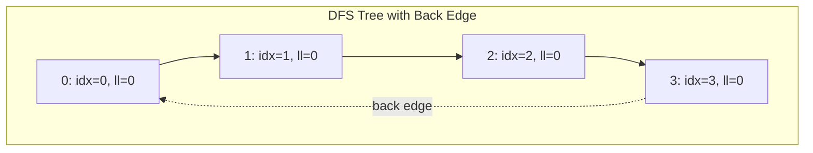

# Tarjan's Strongly Connected Components

## Overview

| Property | Value |
|----------|-------|
| **Category** | Graph Connectivity |
| **Complexity (Time)** | O(V + E) |
| **Complexity (Space)** | O(V) |
| **Graph Type** | Directed |
| **Best For** | Single-pass SCC discovery, online processing |

## Description

Tarjan's algorithm finds all strongly connected components (SCCs) in a directed graph using a single depth-first search pass. Invented by Robert Tarjan in 1972, it uses the concept of "lowlink" values to identify the root of each SCC and maintains a stack of vertices in the current DFS path.

The key insight is that a vertex is the root of an SCC if and only if its lowlink value equals its discovery index, meaning it cannot reach any vertex discovered earlier.

## Mathematical Foundation

### Discovery and Lowlink Values

For each vertex $v$:

- **index[v]**: DFS discovery order (when $v$ was first visited)
- **lowlink[v]**: Smallest index reachable from subtree rooted at $v$

### Lowlink Calculation

$$\text{lowlink}[v] = \min\begin{cases}
\text{index}[v] \\
\text{lowlink}[w] & \text{for } (v,w) \in E \text{ and } w \text{ is descendant} \\
\text{index}[w] & \text{for } (v,w) \in E \text{ and } w \text{ on stack}
\end{cases}$$

### SCC Root Condition

Vertex $v$ is the root of an SCC if and only if:

$$\text{lowlink}[v] = \text{index}[v]$$

### Stack Invariant

At any point, vertices on the stack form a path from DFS root to current vertex, plus vertices in incomplete SCCs.

### Correctness Properties

1. All vertices in same SCC have same lowlink value as the SCC root
2. When root is found, all stack vertices until root form the SCC
3. Each vertex is processed exactly once

## Algorithm

### Pseudocode

```
TARJAN_SCC(graph G):
    index_counter ← 0
    stack ← empty stack
    on_stack ← array of size |V|, all false
    index ← array of size |V|, all -1  // -1 = undefined
    lowlink ← array of size |V|
    sccs ← empty list
    
    for each vertex v in V:
        if index[v] = -1:
            STRONG_CONNECT(v)
    
    return sccs

STRONG_CONNECT(v):
    // Set discovery index and lowlink
    index[v] ← index_counter
    lowlink[v] ← index_counter
    index_counter ← index_counter + 1
    
    // Push v onto stack
    stack.push(v)
    on_stack[v] ← true
    
    // Visit all successors
    for each neighbor w of v:
        if index[w] = -1:  // w not yet visited
            STRONG_CONNECT(w)
            lowlink[v] ← min(lowlink[v], lowlink[w])
        else if on_stack[w]:  // w is on stack (back edge)
            lowlink[v] ← min(lowlink[v], index[w])
    
    // If v is a root, pop stack to get SCC
    if lowlink[v] = index[v]:
        scc ← empty list
        repeat:
            w ← stack.pop()
            on_stack[w] ← false
            scc.append(w)
        until w = v
        sccs.append(scc)
```

### Step-by-Step Execution

```
Graph:
  0 → 1 → 2
  ↑       ↓
  └───────3

Adjacency list:
  0: [1]
  1: [2]
  2: [3]
  3: [0]

Execution:
  Start STRONG_CONNECT(0):
    index[0] = 0, lowlink[0] = 0
    stack = [0], on_stack[0] = true
    
    Visit neighbor 1:
      STRONG_CONNECT(1):
        index[1] = 1, lowlink[1] = 1
        stack = [0, 1], on_stack[1] = true
        
        Visit neighbor 2:
          STRONG_CONNECT(2):
            index[2] = 2, lowlink[2] = 2
            stack = [0, 1, 2], on_stack[2] = true
            
            Visit neighbor 3:
              STRONG_CONNECT(3):
                index[3] = 3, lowlink[3] = 3
                stack = [0, 1, 2, 3], on_stack[3] = true
                
                Visit neighbor 0:
                  0 already visited AND on_stack
                  lowlink[3] = min(3, index[0]) = min(3, 0) = 0
                
                Check root: lowlink[3] = 0 ≠ index[3] = 3
                (Not a root, return)
              
              lowlink[2] = min(2, lowlink[3]) = min(2, 0) = 0
            
            Check root: lowlink[2] = 0 ≠ index[2] = 2
            (Not a root, return)
          
          lowlink[1] = min(1, lowlink[2]) = min(1, 0) = 0
        
        Check root: lowlink[1] = 0 ≠ index[1] = 1
        (Not a root, return)
      
      lowlink[0] = min(0, lowlink[1]) = min(0, 0) = 0
    
    Check root: lowlink[0] = 0 = index[0] = 0
    (IS A ROOT! Pop SCC)
    
    Pop until v=0:
      Pop 3: scc = [3]
      Pop 2: scc = [3, 2]
      Pop 1: scc = [3, 2, 1]
      Pop 0: scc = [3, 2, 1, 0]
    
    SCCs = [[3, 2, 1, 0]]

Result: One SCC containing all vertices {0, 1, 2, 3}
```

## Complexity Analysis

### Time Complexity

| Operation | Complexity |
|-----------|-----------|
| Visit each vertex once | O(V) |
| Explore each edge once | O(E) |
| Stack operations | O(V) total |
| **Total** | **O(V + E)** |

### Space Complexity

| Component | Space |
|-----------|-------|
| Index array | O(V) |
| Lowlink array | O(V) |
| On-stack array | O(V) |
| Stack | O(V) |
| Recursion stack | O(V) |
| **Total** | **O(V)** |

## Visual Representation

```mermaid
flowchart TD
    A[Start DFS from unvisited vertex v] --> B[Assign index and lowlink to v]
    B --> C[Push v onto stack]
    C --> D[For each neighbor w of v]
    D --> E{w visited?}
    E -->|No| F[Recursively visit w]
    F --> G[Update lowlink: min with w's lowlink]
    G --> D
    E -->|Yes| H{w on stack?}
    H -->|Yes| I[Update lowlink: min with w's index]
    I --> D
    H -->|No| D
    D -->|Done| J{lowlink[v] == index[v]?}
    J -->|Yes| K[v is SCC root: pop stack until v]
    J -->|No| L[Return to parent]
    K --> M[Add popped vertices as new SCC]
    M --> L
```

### Lowlink Propagation



## Implementation

### Python Implementation

```python
from __future__ import annotations


def tarjan(graph: dict[int, list[int]]) -> list[list[int]]:
    """
    Find strongly connected components using Tarjan's algorithm.
    
    Args:
        graph: Adjacency list of directed graph
    
    Returns:
        List of SCCs, each SCC is a list of vertices
    
    Examples:
        >>> graph = {0: [1], 1: [2], 2: [0, 3], 3: []}
        >>> sccs = tarjan(graph)
        >>> sorted([sorted(scc) for scc in sccs])
        [[0, 1, 2], [3]]
        
        >>> graph = {0: [1], 1: [2], 2: [3], 3: [0]}
        >>> sccs = tarjan(graph)
        >>> sorted([sorted(scc) for scc in sccs])
        [[0, 1, 2, 3]]
    """
    n = max(graph.keys()) + 1 if graph else 0
    
    index_of = [-1] * n  # -1 means undefined
    lowlink_of = [0] * n
    on_stack = [False] * n
    stack: list[int] = []
    index_counter = [0]  # Mutable container for closure
    sccs: list[list[int]] = []
    
    def strong_connect(v: int) -> None:
        """DFS to find SCC containing v."""
        # Set discovery index and lowlink
        index_of[v] = index_counter[0]
        lowlink_of[v] = index_counter[0]
        index_counter[0] += 1
        
        # Push onto stack
        stack.append(v)
        on_stack[v] = True
        
        # Visit all neighbors
        for w in graph.get(v, []):
            if index_of[w] == -1:
                # w not yet visited - recurse
                strong_connect(w)
                lowlink_of[v] = min(lowlink_of[v], lowlink_of[w])
            elif on_stack[w]:
                # w is on stack - back edge
                lowlink_of[v] = min(lowlink_of[v], index_of[w])
        
        # If v is a root, pop SCC
        if lowlink_of[v] == index_of[v]:
            scc: list[int] = []
            while True:
                w = stack.pop()
                on_stack[w] = False
                scc.append(w)
                if w == v:
                    break
            sccs.append(scc)
    
    # Run on all unvisited vertices
    for v in graph:
        if index_of[v] == -1:
            strong_connect(v)
    
    return sccs
```

### Iterative Implementation

```python
def tarjan_iterative(graph: dict[int, list[int]]) -> list[list[int]]:
    """
    Iterative Tarjan's algorithm (avoids recursion limit).
    
    Uses explicit stack to simulate recursion.
    """
    vertices = set(graph.keys())
    for neighbors in graph.values():
        vertices.update(neighbors)
    
    n = max(vertices) + 1 if vertices else 0
    
    index_of = [-1] * n
    lowlink_of = [0] * n
    on_stack = [False] * n
    stack: list[int] = []
    index_counter = 0
    sccs: list[list[int]] = []
    
    # State for iterative DFS
    ENTER = 0
    PROCESS_NEIGHBOR = 1
    EXIT = 2
    
    for start in vertices:
        if index_of[start] != -1:
            continue
        
        # DFS stack: (vertex, state, neighbor_index)
        dfs_stack = [(start, ENTER, 0)]
        
        while dfs_stack:
            v, state, neighbor_idx = dfs_stack.pop()
            
            if state == ENTER:
                # First visit to v
                index_of[v] = index_counter
                lowlink_of[v] = index_counter
                index_counter += 1
                stack.append(v)
                on_stack[v] = True
                
                # Continue to process neighbors
                dfs_stack.append((v, PROCESS_NEIGHBOR, 0))
            
            elif state == PROCESS_NEIGHBOR:
                neighbors = graph.get(v, [])
                
                # Find next unprocessed neighbor
                while neighbor_idx < len(neighbors):
                    w = neighbors[neighbor_idx]
                    
                    if index_of[w] == -1:
                        # w not visited - recurse
                        dfs_stack.append((v, PROCESS_NEIGHBOR, neighbor_idx + 1))
                        dfs_stack.append((w, ENTER, 0))
                        break
                    elif on_stack[w]:
                        # Back edge
                        lowlink_of[v] = min(lowlink_of[v], index_of[w])
                    
                    neighbor_idx += 1
                else:
                    # All neighbors processed
                    dfs_stack.append((v, EXIT, 0))
            
            elif state == EXIT:
                # Update parent's lowlink if we came from recursion
                if dfs_stack:
                    parent_frame = dfs_stack[-1]
                    if parent_frame[1] == PROCESS_NEIGHBOR:
                        parent = parent_frame[0]
                        lowlink_of[parent] = min(
                            lowlink_of[parent], 
                            lowlink_of[v]
                        )
                
                # Check if v is SCC root
                if lowlink_of[v] == index_of[v]:
                    scc: list[int] = []
                    while True:
                        w = stack.pop()
                        on_stack[w] = False
                        scc.append(w)
                        if w == v:
                            break
                    sccs.append(scc)
    
    return sccs
```

### With Edge Classification

```python
from enum import Enum
from typing import Dict, List, Set, Tuple


class EdgeType(Enum):
    TREE = "tree"
    BACK = "back"
    FORWARD = "forward"
    CROSS = "cross"


def tarjan_with_edges(
    graph: dict[int, list[int]]
) -> Tuple[list[list[int]], Dict[Tuple[int, int], EdgeType]]:
    """
    Tarjan's algorithm that also classifies edges.
    
    Returns:
        (SCCs, edge_classification)
    """
    vertices = set(graph.keys())
    for neighbors in graph.values():
        vertices.update(neighbors)
    
    n = max(vertices) + 1 if vertices else 0
    
    index_of = [-1] * n
    lowlink_of = [0] * n
    on_stack = [False] * n
    finished = [False] * n
    stack: list[int] = []
    index_counter = [0]
    sccs: list[list[int]] = []
    edge_types: Dict[Tuple[int, int], EdgeType] = {}
    
    def strong_connect(v: int, parent: int = -1) -> None:
        index_of[v] = index_counter[0]
        lowlink_of[v] = index_counter[0]
        index_counter[0] += 1
        stack.append(v)
        on_stack[v] = True
        
        for w in graph.get(v, []):
            if index_of[w] == -1:
                # Tree edge
                edge_types[(v, w)] = EdgeType.TREE
                strong_connect(w, v)
                lowlink_of[v] = min(lowlink_of[v], lowlink_of[w])
            elif on_stack[w]:
                # Back edge (to ancestor)
                edge_types[(v, w)] = EdgeType.BACK
                lowlink_of[v] = min(lowlink_of[v], index_of[w])
            elif finished[w]:
                # Cross or forward edge
                if index_of[w] > index_of[v]:
                    edge_types[(v, w)] = EdgeType.FORWARD
                else:
                    edge_types[(v, w)] = EdgeType.CROSS
        
        if lowlink_of[v] == index_of[v]:
            scc: list[int] = []
            while True:
                w = stack.pop()
                on_stack[w] = False
                finished[w] = True
                scc.append(w)
                if w == v:
                    break
            sccs.append(scc)
    
    for v in vertices:
        if index_of[v] == -1:
            strong_connect(v)
    
    return sccs, edge_types
```

## Real-World Applications

### 1. Compiler Optimization

```python
from dataclasses import dataclass, field
from typing import Dict, List, Set, Tuple


@dataclass
class BasicBlock:
    """Basic block in control flow graph."""
    id: int
    instructions: List[str] = field(default_factory=list)
    successors: Set[int] = field(default_factory=set)


class CFGOptimizer:
    """
    Optimize control flow graph using SCC analysis.
    
    SCCs in CFG represent loops.
    """
    
    def __init__(self):
        self.blocks: Dict[int, BasicBlock] = {}
    
    def add_block(
        self, 
        block_id: int, 
        instructions: List[str] = None,
        successors: Set[int] = None
    ) -> None:
        """Add basic block."""
        self.blocks[block_id] = BasicBlock(
            block_id,
            instructions or [],
            successors or set()
        )
    
    def find_loops(self) -> List[Set[int]]:
        """
        Find natural loops using Tarjan's algorithm.
        
        Each SCC with size > 1 or with self-loop is a loop.
        """
        graph = {b.id: list(b.successors) for b in self.blocks.values()}
        sccs = tarjan(graph)
        
        loops = []
        for scc in sccs:
            # Check if it's actually a loop
            if len(scc) > 1:
                loops.append(set(scc))
            elif len(scc) == 1:
                # Single block with self-loop
                v = scc[0]
                if v in self.blocks[v].successors:
                    loops.append({v})
        
        return loops
    
    def get_loop_nesting(self) -> Dict[int, int]:
        """
        Get nesting depth of each block.
        
        Returns:
            {block_id: nesting_depth}
        """
        loops = self.find_loops()
        nesting: Dict[int, int] = {b: 0 for b in self.blocks}
        
        # Each block's nesting = number of loops containing it
        for loop in loops:
            for block in loop:
                nesting[block] += 1
        
        return nesting
    
    def find_loop_headers(self) -> Dict[int, int]:
        """
        Find loop header for each loop.
        
        Header = entry point with lowest DFS number.
        """
        graph = {b.id: list(b.successors) for b in self.blocks.values()}
        sccs, edge_types = tarjan_with_edges(graph)
        
        headers: Dict[int, int] = {}  # loop_id -> header_block
        
        for loop_id, scc in enumerate(sccs):
            if len(scc) > 1 or (len(scc) == 1 and scc[0] in graph.get(scc[0], [])):
                # Find block with incoming edge from outside loop
                loop_set = set(scc)
                for block in scc:
                    for pred, succs in graph.items():
                        if pred not in loop_set and block in succs:
                            headers[loop_id] = block
                            break
                    if loop_id in headers:
                        break
                else:
                    # No external entry, use first in DFS order
                    headers[loop_id] = scc[-1]  # Last added = first visited
        
        return headers
```

### 2. Logic Circuit Analysis

```python
from dataclasses import dataclass
from typing import Dict, List, Set, Tuple
from enum import Enum


class GateType(Enum):
    AND = "AND"
    OR = "OR"
    NOT = "NOT"
    XOR = "XOR"
    NAND = "NAND"
    NOR = "NOR"


@dataclass
class Gate:
    """Logic gate in circuit."""
    id: str
    gate_type: GateType
    inputs: List[str]  # Input wire/gate IDs
    
    
class CircuitAnalyzer:
    """
    Analyze logic circuits for feedback loops using SCC.
    """
    
    def __init__(self):
        self.gates: Dict[str, Gate] = {}
        self.outputs: Set[str] = set()
    
    def add_gate(
        self, 
        gate_id: str, 
        gate_type: GateType, 
        inputs: List[str]
    ) -> None:
        """Add logic gate."""
        self.gates[gate_id] = Gate(gate_id, gate_type, inputs)
    
    def find_feedback_loops(self) -> List[Set[str]]:
        """
        Find feedback loops in circuit.
        
        Combinational circuits should have no SCCs > 1.
        Sequential circuits use feedback intentionally.
        """
        # Build dependency graph
        ids = list(self.gates.keys())
        idx = {gid: i for i, gid in enumerate(ids)}
        n = len(ids)
        
        graph = {i: [] for i in range(n)}
        for gate in self.gates.values():
            if gate.id in idx:
                for inp in gate.inputs:
                    if inp in idx:
                        # inp feeds into gate
                        graph[idx[inp]].append(idx[gate.id])
        
        sccs = tarjan(graph)
        
        # Find actual loops
        loops = []
        for scc in sccs:
            if len(scc) > 1:
                loops.append({ids[i] for i in scc})
            elif len(scc) == 1:
                i = scc[0]
                if i in graph[i]:
                    loops.append({ids[i]})
        
        return loops
    
    def is_combinational(self) -> bool:
        """Check if circuit is purely combinational (no feedback)."""
        return len(self.find_feedback_loops()) == 0
    
    def get_propagation_levels(self) -> Dict[str, int]:
        """
        Get propagation level for each gate.
        
        Level = longest path from inputs.
        Only valid for combinational circuits.
        """
        if not self.is_combinational():
            raise ValueError("Circuit has feedback loops")
        
        levels: Dict[str, int] = {}
        
        def get_level(gate_id: str) -> int:
            if gate_id in levels:
                return levels[gate_id]
            
            if gate_id not in self.gates:
                # Primary input
                levels[gate_id] = 0
                return 0
            
            gate = self.gates[gate_id]
            max_input_level = -1
            
            for inp in gate.inputs:
                max_input_level = max(max_input_level, get_level(inp))
            
            levels[gate_id] = max_input_level + 1
            return levels[gate_id]
        
        for gate_id in self.gates:
            get_level(gate_id)
        
        return levels
```

### 3. Knowledge Graph Reasoning

```python
from dataclasses import dataclass
from typing import Dict, List, Set, Tuple


@dataclass
class Concept:
    """Concept in knowledge graph."""
    name: str
    related_to: Set[str]  # Bidirectional relations


@dataclass  
class KnowledgeGraph:
    """
    Knowledge graph with concept relationships.
    """
    
    def __init__(self):
        self.concepts: Dict[str, Concept] = {}
        self.implications: Dict[str, Set[str]] = {}  # concept -> implied concepts
    
    def add_concept(self, name: str) -> None:
        """Add concept."""
        self.concepts[name] = Concept(name, set())
        self.implications[name] = set()
    
    def add_implication(self, from_concept: str, to_concept: str) -> None:
        """Add implication: from_concept implies to_concept."""
        self.add_concept(from_concept)
        self.add_concept(to_concept)
        self.implications[from_concept].add(to_concept)
    
    def find_equivalent_concepts(self) -> List[Set[str]]:
        """
        Find groups of equivalent concepts.
        
        Concepts are equivalent if they mutually imply each other.
        These form SCCs in the implication graph.
        """
        names = list(self.concepts.keys())
        idx = {name: i for i, name in enumerate(names)}
        n = len(names)
        
        graph = {i: [] for i in range(n)}
        for concept, implied in self.implications.items():
            if concept in idx:
                for imp in implied:
                    if imp in idx:
                        graph[idx[concept]].append(idx[imp])
        
        sccs = tarjan(graph)
        
        # Convert back to concept names
        return [{names[i] for i in scc} for scc in sccs if len(scc) > 1]
    
    def simplify(self) -> "KnowledgeGraph":
        """
        Create simplified graph by collapsing equivalent concepts.
        """
        equivalents = self.find_equivalent_concepts()
        
        # Map each concept to its representative
        representative: Dict[str, str] = {}
        for eq_set in equivalents:
            rep = min(eq_set)  # Use lexicographically smallest
            for concept in eq_set:
                representative[concept] = rep
        
        # Add singletons
        for concept in self.concepts:
            if concept not in representative:
                representative[concept] = concept
        
        # Build simplified graph
        simplified = KnowledgeGraph()
        
        for concept, rep in representative.items():
            simplified.add_concept(rep)
        
        for concept, implied in self.implications.items():
            from_rep = representative[concept]
            for imp in implied:
                to_rep = representative[imp]
                if from_rep != to_rep:
                    simplified.add_implication(from_rep, to_rep)
        
        return simplified
```

## Comparison with Kosaraju's Algorithm

| Aspect | Tarjan | Kosaraju |
|--------|--------|----------|
| DFS passes | 1 | 2 |
| Extra structures | Stack, lowlink | Transpose graph |
| Discovery | Online | Batch |
| Space | O(V) | O(V + E) |
| Implementation | Complex | Simple |
| Practical speed | Often faster | Similar |

## References

1. Tarjan, R.E. "Depth-First Search and Linear Graph Algorithms" (1972)
2. [Tarjan's SCC Algorithm - Wikipedia](https://en.wikipedia.org/wiki/Tarjan%27s_strongly_connected_components_algorithm)
3. Cormen, T.H. "Introduction to Algorithms" - Chapter 22.5
4. Sedgewick, R. "Algorithms in C" - Graph Algorithms

## See Also

- [Kosaraju's Algorithm](strongly_connected_components.md) - Two-pass alternative
- [Topological Sort](topological_sort.md) - Component DAG ordering
- [Articulation Points](articulation_points.md) - Related vertex connectivity
