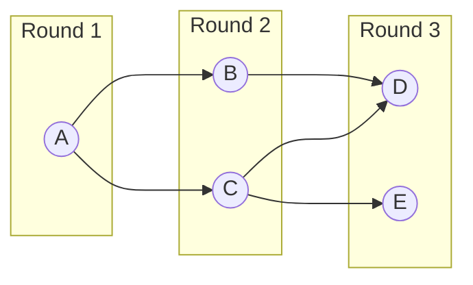

# Topological Sort (Kahn's Algorithm)

## Overview

| Property | Value |
|----------|-------|
| **Category** | Graph Ordering |
| **Complexity (Time)** | O(V + E) |
| **Complexity (Space)** | O(V) |
| **Graph Type** | Directed Acyclic Graph (DAG) |
| **Best For** | Task scheduling, dependency resolution |

## Description

Topological sorting produces a linear ordering of vertices in a directed acyclic graph (DAG) such that for every directed edge (u, v), vertex u appears before v in the ordering. Kahn's algorithm achieves this using a BFS-based approach, repeatedly removing vertices with no incoming edges.

The algorithm also serves as a cycle detection mechanism: if not all vertices can be processed, the graph contains a cycle and no topological order exists.

## Mathematical Foundation

### Partial Order

A DAG defines a partial order $\prec$ on vertices:

$$u \prec v \iff \exists \text{ directed path from } u \text{ to } v$$

### Topological Order

A topological ordering is a total order $<$ compatible with $\prec$:

$$u \prec v \implies u < v$$

### In-Degree Property

In-degree of vertex $v$:

$$\text{indegree}(v) = |\{u : (u, v) \in E\}|$$

**Key insight**: Vertices with $\text{indegree}(v) = 0$ have no dependencies and can be processed first.

### Existence Condition

A topological ordering exists if and only if the graph is acyclic:

$$\text{DAG} \iff \exists \text{ topological order}$$

### Number of Orderings

For DAG with $k$ components and structure-dependent factors:

$$\text{\# orderings} = \prod_{i} \frac{n_i!}{\prod_j d_{ij}!}$$

where the formula depends on the specific DAG structure.

## Algorithm

### Pseudocode

```
KAHN_TOPOLOGICAL_SORT(graph G):
    // Calculate in-degrees
    indegree ← array of size |V|, all 0
    for each edge (u, v) in E:
        indegree[v] ← indegree[v] + 1
    
    // Initialize queue with zero-indegree vertices
    queue ← empty queue
    for each vertex v in V:
        if indegree[v] = 0:
            queue.enqueue(v)
    
    // Process vertices
    result ← []
    while queue is not empty:
        v ← queue.dequeue()
        result.append(v)
        
        for each neighbor u of v:
            indegree[u] ← indegree[u] - 1
            if indegree[u] = 0:
                queue.enqueue(u)
    
    // Check for cycle
    if |result| ≠ |V|:
        return NULL  // Cycle detected
    
    return result
```

### Step-by-Step Execution

```
Graph (dependencies):
  A → B → D
  A → C → D
  C → E

Adjacency list:
  A: [B, C]
  B: [D]
  C: [D, E]
  D: []
  E: []

Calculate in-degrees:
  A: 0, B: 1, C: 1, D: 2, E: 1

Initial queue: [A]  (only A has indegree 0)

Step 1: Process A
  result = [A]
  Decrement B: indegree[B] = 0 → enqueue B
  Decrement C: indegree[C] = 0 → enqueue C
  Queue: [B, C]

Step 2: Process B
  result = [A, B]
  Decrement D: indegree[D] = 1
  Queue: [C]

Step 3: Process C
  result = [A, B, C]
  Decrement D: indegree[D] = 0 → enqueue D
  Decrement E: indegree[E] = 0 → enqueue E
  Queue: [D, E]

Step 4: Process D
  result = [A, B, C, D]
  No outgoing edges
  Queue: [E]

Step 5: Process E
  result = [A, B, C, D, E]
  No outgoing edges
  Queue: []

Final result: [A, B, C, D, E]

Alternative valid orderings:
  - [A, C, B, D, E]
  - [A, C, B, E, D]
  - [A, B, C, E, D]
  - [A, C, E, B, D]
```

## Complexity Analysis

### Time Complexity

| Operation | Complexity |
|-----------|-----------|
| Calculate in-degrees | O(E) |
| Initialize queue | O(V) |
| Process each vertex | O(V) |
| Process each edge | O(E) |
| **Total** | **O(V + E)** |

### Space Complexity

| Component | Space |
|-----------|-------|
| In-degree array | O(V) |
| Queue | O(V) |
| Result array | O(V) |
| **Total** | **O(V)** |

## Visual Representation

```mermaid
flowchart TD
    A[Calculate in-degree for each vertex] --> B[Add all vertices with indegree 0 to queue]
    B --> C{Queue empty?}
    C -->|No| D[Dequeue vertex v]
    D --> E[Add v to result]
    E --> F[For each neighbor u of v]
    F --> G[Decrement indegree of u]
    G --> H{indegree[u] == 0?}
    H -->|Yes| I[Enqueue u]
    I --> F
    H -->|No| F
    F -->|Done| C
    C -->|Yes| J{All vertices processed?}
    J -->|Yes| K[Return result]
    J -->|No| L[Return NULL - cycle exists]
```

### DAG Processing Visualization



## Implementation

### Python Implementation

```python
from __future__ import annotations
from collections import deque


def topological_sort(
    graph: dict[int, list[int]]
) -> list[int] | None:
    """
    Topological sort using Kahn's algorithm.
    
    Args:
        graph: Adjacency list where graph[v] = list of vertices v points to
    
    Returns:
        List of vertices in topological order, or None if cycle exists
    
    Examples:
        >>> graph = {0: [1, 2], 1: [3], 2: [3, 4], 3: [], 4: []}
        >>> topological_sort(graph)
        [0, 1, 2, 3, 4]
        
        >>> graph = {0: [1], 1: [2], 2: [0]}  # Cycle
        >>> topological_sort(graph) is None
        True
        
        >>> topological_sort({0: []})
        [0]
    """
    # Find all vertices
    vertices = set(graph.keys())
    for neighbors in graph.values():
        vertices.update(neighbors)
    
    n = len(vertices)
    if n == 0:
        return []
    
    # Calculate in-degrees
    indegree = {v: 0 for v in vertices}
    for u in graph:
        for v in graph[u]:
            indegree[v] += 1
    
    # Initialize queue with zero-indegree vertices
    queue = deque([v for v in vertices if indegree[v] == 0])
    result = []
    
    while queue:
        v = queue.popleft()
        result.append(v)
        
        for neighbor in graph.get(v, []):
            indegree[neighbor] -= 1
            if indegree[neighbor] == 0:
                queue.append(neighbor)
    
    # Check for cycle
    if len(result) != n:
        return None
    
    return result
```

### All Topological Orderings

```python
def all_topological_sorts(
    graph: dict[int, list[int]]
) -> list[list[int]]:
    """
    Find all possible topological orderings.
    
    Uses backtracking to enumerate all valid orderings.
    
    Warning: Can be exponential in number of results!
    """
    vertices = set(graph.keys())
    for neighbors in graph.values():
        vertices.update(neighbors)
    
    indegree = {v: 0 for v in vertices}
    for u in graph:
        for v in graph[u]:
            indegree[v] += 1
    
    result: list[list[int]] = []
    current: list[int] = []
    visited = {v: False for v in vertices}
    
    def backtrack():
        # Check if complete
        if len(current) == len(vertices):
            result.append(current.copy())
            return
        
        # Try each vertex with indegree 0
        for v in vertices:
            if not visited[v] and indegree[v] == 0:
                # Choose v
                visited[v] = True
                current.append(v)
                for neighbor in graph.get(v, []):
                    indegree[neighbor] -= 1
                
                # Recurse
                backtrack()
                
                # Unchoose v
                visited[v] = False
                current.pop()
                for neighbor in graph.get(v, []):
                    indegree[neighbor] += 1
    
    backtrack()
    return result
```

### DFS-Based Topological Sort

```python
def topological_sort_dfs(
    graph: dict[int, list[int]]
) -> list[int] | None:
    """
    Topological sort using DFS (alternative to Kahn's).
    
    Post-order traversal gives reverse topological order.
    """
    vertices = set(graph.keys())
    for neighbors in graph.values():
        vertices.update(neighbors)
    
    WHITE, GRAY, BLACK = 0, 1, 2
    color = {v: WHITE for v in vertices}
    result: list[int] = []
    has_cycle = [False]
    
    def dfs(v: int) -> None:
        if has_cycle[0]:
            return
        
        color[v] = GRAY
        
        for neighbor in graph.get(v, []):
            if color[neighbor] == GRAY:
                # Back edge = cycle
                has_cycle[0] = True
                return
            elif color[neighbor] == WHITE:
                dfs(neighbor)
        
        color[v] = BLACK
        result.append(v)
    
    for v in vertices:
        if color[v] == WHITE:
            dfs(v)
    
    if has_cycle[0]:
        return None
    
    result.reverse()
    return result
```

## Real-World Applications

### 1. Build System Dependency Resolution

```python
from dataclasses import dataclass, field
from typing import Dict, List, Set, Tuple, Optional
from collections import deque
from enum import Enum


class BuildStatus(Enum):
    PENDING = "pending"
    BUILDING = "building"
    BUILT = "built"
    FAILED = "failed"


@dataclass
class BuildTarget:
    """Build target with dependencies."""
    name: str
    dependencies: Set[str] = field(default_factory=set)
    status: BuildStatus = BuildStatus.PENDING
    build_time: float = 0.0


class BuildSystem:
    """
    Build system using topological sort for dependency resolution.
    """
    
    def __init__(self):
        self.targets: Dict[str, BuildTarget] = {}
    
    def add_target(
        self, 
        name: str, 
        dependencies: Set[str] = None,
        build_time: float = 1.0
    ) -> None:
        """Add build target."""
        self.targets[name] = BuildTarget(
            name, 
            dependencies or set(),
            BuildStatus.PENDING,
            build_time
        )
    
    def get_build_order(self) -> Optional[List[str]]:
        """
        Get build order respecting dependencies.
        
        Returns:
            List of targets in build order, or None if cyclic dependency
        """
        # Build dependency graph (reversed: dependency -> dependent)
        graph = {name: [] for name in self.targets}
        indegree = {name: 0 for name in self.targets}
        
        for name, target in self.targets.items():
            for dep in target.dependencies:
                if dep in graph:
                    graph[dep].append(name)
                    indegree[name] += 1
        
        # Kahn's algorithm
        queue = deque([name for name in self.targets if indegree[name] == 0])
        order = []
        
        while queue:
            target = queue.popleft()
            order.append(target)
            
            for dependent in graph[target]:
                indegree[dependent] -= 1
                if indegree[dependent] == 0:
                    queue.append(dependent)
        
        if len(order) != len(self.targets):
            return None  # Cyclic dependency
        
        return order
    
    def get_parallel_build_schedule(self) -> List[List[str]]:
        """
        Get build schedule for parallel execution.
        
        Returns groups of targets that can be built in parallel.
        """
        graph = {name: [] for name in self.targets}
        indegree = {name: 0 for name in self.targets}
        
        for name, target in self.targets.items():
            for dep in target.dependencies:
                if dep in graph:
                    graph[dep].append(name)
                    indegree[name] += 1
        
        schedule: List[List[str]] = []
        remaining = set(self.targets.keys())
        
        while remaining:
            # Find all targets with no remaining dependencies
            ready = [name for name in remaining if indegree[name] == 0]
            
            if not ready:
                raise ValueError("Cyclic dependency detected")
            
            schedule.append(ready)
            
            # Update for next round
            for name in ready:
                remaining.remove(name)
                for dependent in graph[name]:
                    indegree[dependent] -= 1
        
        return schedule
    
    def estimate_build_time(self, parallel: bool = True) -> float:
        """
        Estimate total build time.
        
        Args:
            parallel: Whether builds can run in parallel
        """
        if parallel:
            schedule = self.get_parallel_build_schedule()
            # Each level takes as long as longest target
            return sum(
                max(self.targets[name].build_time for name in level)
                for level in schedule
            )
        else:
            order = self.get_build_order()
            if order is None:
                raise ValueError("Cyclic dependency")
            return sum(self.targets[name].build_time for name in order)
```

### 2. Course Prerequisite Planning

```python
from dataclasses import dataclass
from typing import Dict, List, Set, Tuple, Optional


@dataclass
class Course:
    """University course with prerequisites."""
    code: str
    name: str
    credits: int
    prerequisites: Set[str]


class CourseScheduler:
    """
    Plan course schedule using topological sort.
    """
    
    def __init__(self):
        self.courses: Dict[str, Course] = {}
    
    def add_course(
        self, 
        code: str, 
        name: str, 
        credits: int = 3,
        prerequisites: Set[str] = None
    ) -> None:
        """Add course to catalog."""
        self.courses[code] = Course(code, name, credits, prerequisites or set())
    
    def get_course_order(self, target_courses: Set[str]) -> Optional[List[str]]:
        """
        Get order to take courses including all prerequisites.
        
        Args:
            target_courses: Set of courses student wants to complete
        
        Returns:
            Ordered list of courses to take
        """
        # Find all required courses (transitive prerequisites)
        required = set()
        to_process = list(target_courses)
        
        while to_process:
            course = to_process.pop()
            if course in required:
                continue
            required.add(course)
            
            if course in self.courses:
                for prereq in self.courses[course].prerequisites:
                    if prereq not in required:
                        to_process.append(prereq)
        
        # Build graph and topological sort
        graph = {code: [] for code in required}
        indegree = {code: 0 for code in required}
        
        for code in required:
            if code in self.courses:
                for prereq in self.courses[code].prerequisites:
                    if prereq in graph:
                        graph[prereq].append(code)
                        indegree[code] += 1
        
        # Kahn's algorithm
        from collections import deque
        queue = deque([code for code in required if indegree[code] == 0])
        order = []
        
        while queue:
            course = queue.popleft()
            order.append(course)
            
            for dependent in graph[course]:
                indegree[dependent] -= 1
                if indegree[dependent] == 0:
                    queue.append(dependent)
        
        if len(order) != len(required):
            return None  # Circular prerequisite
        
        return order
    
    def get_semester_plan(
        self, 
        target_courses: Set[str],
        max_credits_per_semester: int = 18
    ) -> List[List[str]]:
        """
        Create semester-by-semester plan.
        """
        order = self.get_course_order(target_courses)
        if order is None:
            raise ValueError("Circular prerequisites detected")
        
        completed: Set[str] = set()
        semesters: List[List[str]] = []
        remaining = set(order)
        
        while remaining:
            semester: List[str] = []
            credits = 0
            
            for code in order:
                if code not in remaining:
                    continue
                
                course = self.courses.get(code)
                course_credits = course.credits if course else 3
                
                # Check prerequisites satisfied
                prereqs_met = True
                if course:
                    prereqs_met = course.prerequisites.issubset(completed)
                
                if prereqs_met and credits + course_credits <= max_credits_per_semester:
                    semester.append(code)
                    credits += course_credits
            
            if not semester:
                raise ValueError("Cannot schedule remaining courses")
            
            for code in semester:
                remaining.remove(code)
                completed.add(code)
            
            semesters.append(semester)
        
        return semesters
```

### 3. Task Workflow Engine

```python
from dataclasses import dataclass, field
from typing import Dict, List, Set, Callable, Any, Optional
from collections import deque
from enum import Enum
import time


class TaskStatus(Enum):
    PENDING = "pending"
    READY = "ready"
    RUNNING = "running"
    COMPLETED = "completed"
    FAILED = "failed"


@dataclass
class Task:
    """Workflow task with dependencies."""
    id: str
    action: Callable[[], Any]
    dependencies: Set[str] = field(default_factory=set)
    status: TaskStatus = TaskStatus.PENDING
    result: Any = None
    error: Optional[Exception] = None


class WorkflowEngine:
    """
    Execute task workflow respecting dependencies.
    """
    
    def __init__(self):
        self.tasks: Dict[str, Task] = {}
    
    def add_task(
        self, 
        task_id: str, 
        action: Callable[[], Any],
        dependencies: Set[str] = None
    ) -> None:
        """Add task to workflow."""
        self.tasks[task_id] = Task(task_id, action, dependencies or set())
    
    def validate_workflow(self) -> Tuple[bool, Optional[str]]:
        """
        Validate workflow has no cycles.
        
        Returns:
            (is_valid, error_message)
        """
        # Build graph
        graph = {tid: [] for tid in self.tasks}
        indegree = {tid: 0 for tid in self.tasks}
        
        for tid, task in self.tasks.items():
            for dep in task.dependencies:
                if dep not in self.tasks:
                    return False, f"Task {tid} depends on unknown task {dep}"
                graph[dep].append(tid)
                indegree[tid] += 1
        
        # Check for cycle
        queue = deque([tid for tid in self.tasks if indegree[tid] == 0])
        count = 0
        
        while queue:
            tid = queue.popleft()
            count += 1
            for dependent in graph[tid]:
                indegree[dependent] -= 1
                if indegree[dependent] == 0:
                    queue.append(dependent)
        
        if count != len(self.tasks):
            return False, "Workflow contains cyclic dependencies"
        
        return True, None
    
    def get_execution_order(self) -> List[str]:
        """Get task execution order."""
        valid, error = self.validate_workflow()
        if not valid:
            raise ValueError(error)
        
        graph = {tid: [] for tid in self.tasks}
        indegree = {tid: 0 for tid in self.tasks}
        
        for tid, task in self.tasks.items():
            for dep in task.dependencies:
                graph[dep].append(tid)
                indegree[tid] += 1
        
        queue = deque([tid for tid in self.tasks if indegree[tid] == 0])
        order = []
        
        while queue:
            tid = queue.popleft()
            order.append(tid)
            for dependent in graph[tid]:
                indegree[dependent] -= 1
                if indegree[dependent] == 0:
                    queue.append(dependent)
        
        return order
    
    def execute(self) -> Dict[str, Any]:
        """
        Execute workflow sequentially.
        
        Returns:
            Dict of task_id -> result
        """
        order = self.get_execution_order()
        results: Dict[str, Any] = {}
        
        for tid in order:
            task = self.tasks[tid]
            
            # Check dependencies completed
            for dep in task.dependencies:
                if self.tasks[dep].status == TaskStatus.FAILED:
                    task.status = TaskStatus.FAILED
                    task.error = Exception(f"Dependency {dep} failed")
                    break
            else:
                try:
                    task.status = TaskStatus.RUNNING
                    task.result = task.action()
                    task.status = TaskStatus.COMPLETED
                    results[tid] = task.result
                except Exception as e:
                    task.status = TaskStatus.FAILED
                    task.error = e
        
        return results
    
    def get_ready_tasks(self) -> List[str]:
        """Get tasks ready to execute (all dependencies met)."""
        ready = []
        
        for tid, task in self.tasks.items():
            if task.status != TaskStatus.PENDING:
                continue
            
            deps_met = all(
                self.tasks[dep].status == TaskStatus.COMPLETED
                for dep in task.dependencies
            )
            
            if deps_met:
                ready.append(tid)
        
        return ready
```

## Variations

### Lexicographically Smallest Order

```python
import heapq

def topological_sort_lexicographic(
    graph: dict[int, list[int]]
) -> list[int] | None:
    """Topological sort producing lexicographically smallest result."""
    vertices = set(graph.keys())
    for neighbors in graph.values():
        vertices.update(neighbors)
    
    indegree = {v: 0 for v in vertices}
    for u in graph:
        for v in graph[u]:
            indegree[v] += 1
    
    # Use min-heap instead of queue
    heap = [v for v in vertices if indegree[v] == 0]
    heapq.heapify(heap)
    result = []
    
    while heap:
        v = heapq.heappop(heap)
        result.append(v)
        
        for neighbor in graph.get(v, []):
            indegree[neighbor] -= 1
            if indegree[neighbor] == 0:
                heapq.heappush(heap, neighbor)
    
    return result if len(result) == len(vertices) else None
```

## References

1. Kahn, A.B. "Topological sorting of large networks" (1962)
2. [Topological Sorting - Wikipedia](https://en.wikipedia.org/wiki/Topological_sorting)
3. Cormen, T.H. "Introduction to Algorithms" - Chapter 22.4

## See Also

- [Depth-First Search](depth_first_search.md) - DFS-based topological sort
- [Strongly Connected Components](strongly_connected_components.md) - Component DAG
- [Critical Path Method](../05_dynamic_programming/critical_path.md) - Scheduling with durations
