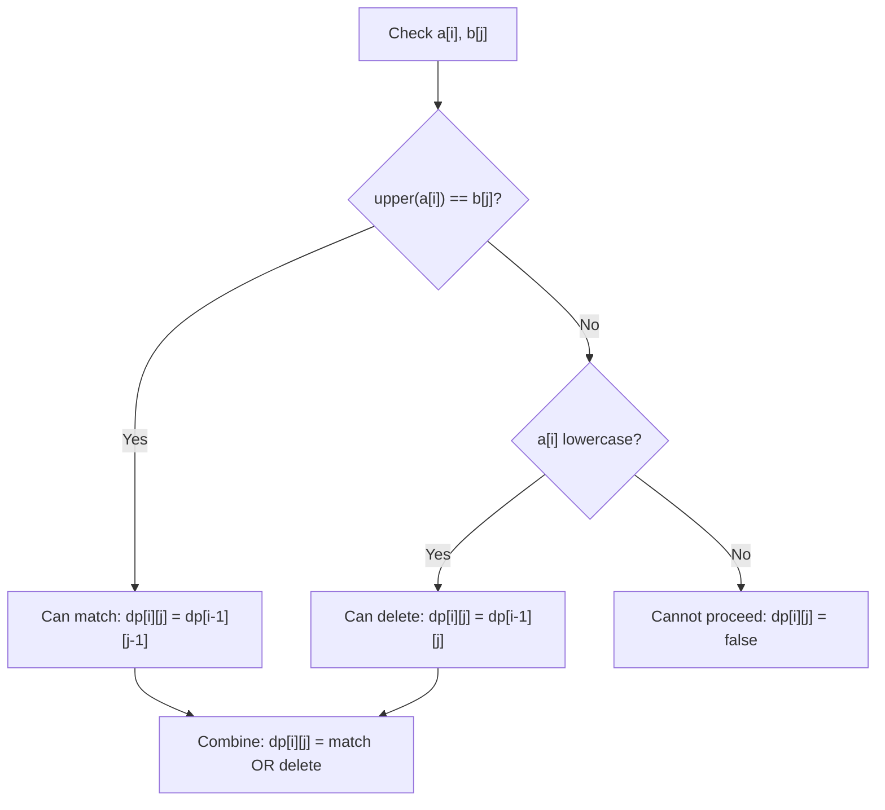

# Abbreviation

| Property | Value |
|----------|-------|
| Category | Dynamic Programming |
| Subcategory | String Matching |
| Complexity (Time) | O(n × m) |
| Complexity (Space) | O(n × m) |
| Input | Two strings a (source) and b (target) |
| Output | Boolean - can a be transformed to b |

## Overview

The **Abbreviation** problem determines whether string `a` can be transformed into string `b` by:
1. Capitalizing zero or more lowercase letters in `a`
2. Deleting all remaining lowercase letters

This is a classic HackerRank problem that uses DP for string transformation validation.

## Mathematical Foundation

### Problem Definition

Given strings $a$ (mixed case) and $b$ (uppercase only):

Can we transform $a$ into $b$ using the allowed operations?

### Valid Operations

1. **Capitalize**: Convert lowercase letter to uppercase
2. **Delete**: Remove any lowercase letter

**Constraint**: Uppercase letters in `a` cannot be deleted or modified.

### Recurrence Relation

Let $dp[i][j]$ = true if $a[0..i-1]$ can be transformed to $b[0..j-1]$:

$$dp[i][j] = \begin{cases}
dp[i-1][j-1] & \text{if } \text{upper}(a_i) = b_j \\
dp[i-1][j] & \text{if } a_i \text{ is lowercase (can delete)} \\
false & \text{if } a_i \text{ is uppercase and } a_i \neq b_j
\end{cases}$$

### Base Cases

$$dp[0][0] = true \quad \text{(empty transforms to empty)}$$
$$dp[i][0] = dp[i-1][0] \land \text{isLower}(a_i) \quad \text{(can only delete lowercase)}$$

## Algorithm Approaches

### 1. Recursive with Memoization

```
ABBR-MEMO(a, b, i, j, memo):
    if j == 0:
        // All remaining chars in a must be lowercase
        return all chars a[0..i-1] are lowercase
    
    if i == 0:
        return false  // No source chars but target remaining
    
    if (i, j) in memo:
        return memo[(i, j)]
    
    result = false
    
    if upper(a[i-1]) == b[j-1]:
        // Match: capitalize if needed and move both
        result = ABBR-MEMO(a, b, i-1, j-1, memo)
    
    if a[i-1] is lowercase:
        // Can delete lowercase
        result = result OR ABBR-MEMO(a, b, i-1, j, memo)
    
    memo[(i, j)] = result
    return result
```

### 2. Bottom-Up DP

```
ABBR-DP(a, b):
    n = length(a)
    m = length(b)
    dp = matrix (n+1) × (m+1), all false
    
    dp[0][0] = true
    
    // First column: can we reach empty target?
    for i from 1 to n:
        if a[i-1] is lowercase:
            dp[i][0] = dp[i-1][0]
        else:
            dp[i][0] = false  // Can't delete uppercase
    
    // Fill DP table
    for i from 1 to n:
        for j from 1 to m:
            if dp[i-1][j-1] and upper(a[i-1]) == b[j-1]:
                dp[i][j] = true  // Match (capitalize if needed)
            
            if dp[i-1][j] and a[i-1] is lowercase:
                dp[i][j] = true  // Delete lowercase
    
    return dp[n][m]
```

## Complexity Analysis

| Approach | Time | Space | Notes |
|----------|------|-------|-------|
| Recursive | O(2^n) | O(n) | Exponential without memo |
| Memoization | O(n × m) | O(n × m) | Top-down DP |
| Tabulation | O(n × m) | O(n × m) | Bottom-up DP |
| Space-Optimized | O(n × m) | O(m) | Two rows |

## Visual Representation

### Example: a="daBcd", b="ABC"

```
Step by step transformation:
  d  a  B  c  d
  ↓  ↓  ↓  ↓  ↓
  -  A  B  C  -    (capitalize a, c; delete d, d)
  =  A  B  C       (result matches target)
```

### DP Table

```
      ""   A    B    C
""    T    F    F    F
d     T    F    F    F    (d is lowercase, can delete)
a     T    T    F    F    (capitalize a → A)
B     F    F    T    F    (B = B, must match)
c     F    F    F    T    (capitalize c → C)
d     F    F    F    T    (d is lowercase, can delete)

Result: dp[5][3] = True
```

### State Transition Diagram



## Implementation (from repository)

```python
def abbr(a: str, b: str) -> bool:
    """
    >>> abbr("daBcd", "ABC")
    True
    >>> abbr("dBcd", "ABC")
    False
    """
    n = len(a)
    m = len(b)
    dp = [[False for _ in range(m + 1)] for _ in range(n + 1)]
    dp[0][0] = True
    for i in range(n):
        for j in range(m + 1):
            if dp[i][j]:
                if j < m and a[i].upper() == b[j]:
                    dp[i + 1][j + 1] = True
                if a[i].islower():
                    dp[i + 1][j] = True
    return dp[n][m]
```

## Real-World Applications

### 1. Command Abbreviation Matching

```python
from typing import List, Dict, Optional

def match_command_abbreviation(
    user_input: str,
    commands: List[str]
) -> Optional[str]:
    """
    Match abbreviated user input to full command names.
    
    >>> match_command_abbreviation("cp", ["COPY", "COMPILE", "COMPARE"])
    'COPY'
    >>> match_command_abbreviation("cmp", ["COPY", "COMPILE", "COMPARE"])
    'COMPILE'
    """
    def can_abbreviate(abbrev: str, full: str) -> bool:
        """Check if abbrev can expand to full (case-insensitive)."""
        n, m = len(abbrev), len(full)
        dp = [[False] * (m + 1) for _ in range(n + 1)]
        dp[0][0] = True
        
        for i in range(n):
            for j in range(m + 1):
                if dp[i][j]:
                    if j < m and abbrev[i].upper() == full[j].upper():
                        dp[i + 1][j + 1] = True
                    if abbrev[i].islower():
                        dp[i + 1][j] = True
        
        return dp[n][m]
    
    matches = [cmd for cmd in commands if can_abbreviate(user_input, cmd)]
    
    if len(matches) == 1:
        return matches[0]
    elif len(matches) > 1:
        # Return shortest match or first match
        return min(matches, key=len)
    return None


def build_abbreviation_map(commands: List[str]) -> Dict[str, str]:
    """
    Build mapping of valid abbreviations to commands.
    
    >>> abbr_map = build_abbreviation_map(["COPY", "DELETE"])
    >>> abbr_map.get("cp")
    'COPY'
    """
    abbr_map = {}
    
    for cmd in commands:
        # Generate all possible abbreviations
        for length in range(1, len(cmd) + 1):
            for i in range(2 ** len(cmd)):
                abbrev = []
                for j, char in enumerate(cmd):
                    if i & (1 << j):
                        abbrev.append(char.lower())
                    else:
                        abbrev.append(char)
                
                abbrev_str = ''.join(abbrev)
                if len([c for c in abbrev_str if c.isupper()]) == length:
                    # Check if this abbreviation is unique
                    if abbrev_str.lower() not in abbr_map:
                        abbr_map[abbrev_str.lower()] = cmd
    
    return abbr_map
```

### 2. Flexible String Matching for Search

```python
from typing import List, Tuple

def flexible_search(
    query: str,
    candidates: List[str],
    case_sensitive: bool = False
) -> List[Tuple[str, float]]:
    """
    Search with flexible abbreviation matching.
    Returns candidates with match scores.
    
    >>> results = flexible_search("usr", ["USER", "USER_NAME", "SUPER"])
    >>> any(r[0] == "USER" for r in results)
    True
    """
    def abbr_match(query: str, target: str) -> Tuple[bool, float]:
        """Check abbreviation match and return score."""
        n, m = len(query), len(target)
        if n > m:
            return (False, 0.0)
        
        # DP to find if match exists
        dp = [[False] * (m + 1) for _ in range(n + 1)]
        path = [[0] * (m + 1) for _ in range(n + 1)]  # Track capitalized count
        dp[0][0] = True
        
        for i in range(n):
            for j in range(m + 1):
                if dp[i][j]:
                    q_char = query[i] if case_sensitive else query[i].upper()
                    
                    if j < m:
                        t_char = target[j] if case_sensitive else target[j].upper()
                        if q_char == t_char:
                            dp[i + 1][j + 1] = True
                            path[i + 1][j + 1] = path[i][j] + (1 if query[i].isupper() else 0)
                    
                    if query[i].islower():
                        dp[i + 1][j] = True
                        path[i + 1][j] = path[i][j]
        
        if not dp[n][m]:
            return (False, 0.0)
        
        # Calculate score based on match quality
        matched_ratio = n / m
        capitalization_bonus = path[n][m] / max(n, 1) * 0.2
        
        return (True, min(1.0, matched_ratio + capitalization_bonus))
    
    results = []
    for candidate in candidates:
        matched, score = abbr_match(query, candidate)
        if matched:
            results.append((candidate, score))
    
    return sorted(results, key=lambda x: -x[1])


def autocomplete_with_abbreviation(
    partial: str,
    dictionary: List[str],
    max_results: int = 5
) -> List[str]:
    """
    Autocomplete allowing abbreviation patterns.
    
    >>> autocomplete_with_abbreviation("dB", ["database", "DataBase", "debug"])
    ['DataBase', 'database']
    """
    results = flexible_search(partial, dictionary)
    return [r[0] for r in results[:max_results]]
```

### 3. Variable Name Refactoring Validation

```python
from typing import Dict, List, Tuple

def validate_rename(
    old_name: str,
    new_name: str,
    allow_abbreviation: bool = True
) -> Dict:
    """
    Validate if renaming is compatible with existing references.
    
    >>> validate_rename("getUserName", "UN", allow_abbreviation=True)
    {'valid': True, 'type': 'abbreviation'}
    """
    def can_expand(short: str, long: str) -> bool:
        """Check if short can be expanded to long."""
        n, m = len(short), len(long)
        dp = [[False] * (m + 1) for _ in range(n + 1)]
        dp[0][0] = True
        
        for i in range(n):
            for j in range(m + 1):
                if dp[i][j]:
                    if j < m and short[i].upper() == long[j].upper():
                        dp[i + 1][j + 1] = True
                    if short[i].islower():
                        dp[i + 1][j] = True
        
        return dp[n][m]
    
    result = {
        'valid': False,
        'type': None,
        'warnings': []
    }
    
    if old_name == new_name:
        result['valid'] = True
        result['type'] = 'identical'
        return result
    
    if old_name.lower() == new_name.lower():
        result['valid'] = True
        result['type'] = 'case_change'
        return result
    
    if allow_abbreviation:
        if can_expand(new_name, old_name):
            result['valid'] = True
            result['type'] = 'abbreviation'
            result['warnings'].append('New name is abbreviation of old name')
            return result
        
        if can_expand(old_name, new_name):
            result['valid'] = True
            result['type'] = 'expansion'
            return result
    
    # Check for partial match
    if new_name.upper() in old_name.upper():
        result['valid'] = True
        result['type'] = 'substring'
        result['warnings'].append('Consider if abbreviation is clear')
    
    return result


def find_abbreviation_conflicts(
    names: List[str]
) -> List[Tuple[str, str]]:
    """
    Find pairs of names where one could be abbreviation of other.
    
    >>> conflicts = find_abbreviation_conflicts(["getUser", "gU", "setUser"])
    >>> ("getUser", "gU") in conflicts or ("gU", "getUser") in conflicts
    True
    """
    def can_abbreviate(a: str, b: str) -> bool:
        if len(a) >= len(b):
            return False
        
        n, m = len(a), len(b)
        dp = [[False] * (m + 1) for _ in range(n + 1)]
        dp[0][0] = True
        
        for i in range(n):
            for j in range(m + 1):
                if dp[i][j]:
                    if j < m and a[i].upper() == b[j].upper():
                        dp[i + 1][j + 1] = True
                    if a[i].islower():
                        dp[i + 1][j] = True
        
        return dp[n][m]
    
    conflicts = []
    for i, name1 in enumerate(names):
        for name2 in names[i + 1:]:
            if can_abbreviate(name1, name2) or can_abbreviate(name2, name1):
                conflicts.append((name1, name2))
    
    return conflicts
```

## Variations

### Case-Insensitive Matching

```python
def abbr_case_insensitive(a: str, b: str) -> bool:
    """
    Both strings treated as mixed case.
    
    >>> abbr_case_insensitive("AbC", "ABC")
    True
    """
    return abbr(a.lower(), b.upper())
```

### Counting All Valid Transformations

```python
def count_abbreviations(a: str, b: str) -> int:
    """
    Count number of ways to transform a to b.
    
    >>> count_abbreviations("aAa", "AA")
    2
    """
    n, m = len(a), len(b)
    dp = [[0] * (m + 1) for _ in range(n + 1)]
    dp[0][0] = 1
    
    for i in range(n):
        for j in range(m + 1):
            if dp[i][j] > 0:
                if j < m and a[i].upper() == b[j]:
                    dp[i + 1][j + 1] += dp[i][j]
                if a[i].islower():
                    dp[i + 1][j] += dp[i][j]
    
    return dp[n][m]
```

## Common Pitfalls

1. **Uppercase constraint**: Cannot delete uppercase letters in source
2. **Order preservation**: Characters must maintain relative order
3. **Base case handling**: Empty strings and boundary conditions
4. **Index management**: 0-indexed vs 1-indexed arrays

## References

- [HackerRank Abbreviation Problem](https://www.hackerrank.com/challenges/abbr/problem)
- [Dynamic Programming on Strings](https://cp-algorithms.com/string/string-hashing.html)

## See Also

- [Edit Distance](edit_distance.md) - String transformation cost
- [Longest Common Subsequence](longest_common_subsequence.md) - Subsequence matching
- [Word Break](word_break.md) - String segmentation
