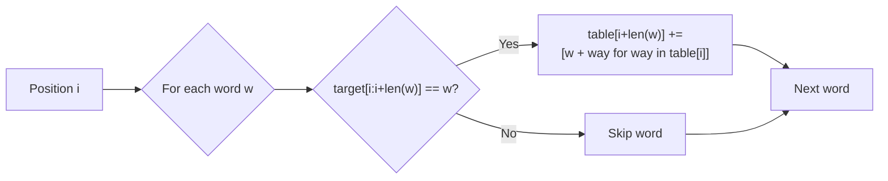

# All Construct

| Property | Value |
|----------|-------|
| Category | Dynamic Programming |
| Subcategory | String/Combinatorial |
| Complexity (Time) | O(n × m × k) where k = avg combinations |
| Complexity (Space) | O(n × total_combinations) |
| Input | Target string and word bank |
| Output | All ways to construct target from words |

## Overview

The **All Construct** problem finds all possible ways to construct a target string using words from a given word bank. Unlike "can construct" (boolean) or "count construct" (count), this returns all actual combinations.

## Mathematical Foundation

### Problem Definition

Given:
- Target string $T$ of length $n$
- Word bank $W = \{w_1, w_2, ..., w_m\}$

Find: All combinations $C = \{c_1, c_2, ..., c_k\}$ where each $c_i$ is a list of words that concatenate to form $T$.

### Recurrence Relation

Let $dp[i]$ = list of all ways to construct $T[0..i-1]$:

$$dp[i] = \bigcup_{w \in W, T[i-|w|:i] = w} \{way + [w] \mid way \in dp[i - |w|]\}$$

### Base Case

$$dp[0] = \{[]\} \quad \text{(empty list represents one way to make empty string)}$$

## Algorithm Approaches

### 1. Recursive with Memoization

```
ALL-CONSTRUCT-MEMO(target, words, memo):
    if target == "":
        return [[]]  // One way: empty combination
    
    if target in memo:
        return memo[target]
    
    result = []
    
    for word in words:
        if target starts with word:
            suffix = target[len(word):]
            suffix_ways = ALL-CONSTRUCT-MEMO(suffix, words, memo)
            
            for way in suffix_ways:
                result.append([word] + way)
    
    memo[target] = result
    return result
```

### 2. Bottom-Up Tabulation

```
ALL-CONSTRUCT-TAB(target, words):
    n = length(target)
    table = array of (n+1) empty lists
    table[0] = [[]]  // Seed: one way to make empty
    
    for i from 0 to n-1:
        if table[i] is not empty:
            for word in words:
                if target[i : i + len(word)] == word:
                    // Add word to each way at position i
                    new_combinations = []
                    for way in table[i]:
                        new_combinations.append([word] + way)
                    
                    // Extend table at position i + len(word)
                    table[i + len(word)].extend(new_combinations)
    
    // Reverse each combination for correct order
    for combination in table[n]:
        reverse(combination)
    
    return table[n]
```

### 3. DFS/Backtracking

```
ALL-CONSTRUCT-DFS(target, words):
    results = []
    
    DFS(target, words, [], results)
    
    return results

DFS(remaining, words, current_path, results):
    if remaining == "":
        results.append(copy(current_path))
        return
    
    for word in words:
        if remaining starts with word:
            current_path.append(word)
            DFS(remaining[len(word):], words, current_path, results)
            current_path.pop()  // Backtrack
```

## Complexity Analysis

| Approach | Time | Space | Notes |
|----------|------|-------|-------|
| Naive Recursion | O(m^n × n) | O(n) | Exponential |
| Memoization | O(n × m × k) | O(n × k) | k = combinations |
| Tabulation | O(n × m × k) | O(n × k) | Bottom-up |

**Note**: In worst case (all single chars), k can be exponential.

## Visual Representation

### Example: target="purple", words=["purp","p","ur","le","purpl"]

```
                    "purple"
                   /        \
            "purp"+"le"    "p"+"urple"
                  |            |
             ["purp","le"]  "ur"+"ple"
                              |
                           "p"+"le"
                              |
                          ["p","ur","p","le"]

Result: [["purp","le"], ["p","ur","p","le"]]
```

### Tabulation Visualization

```
Position:  0    1    2    3    4    5    6
Target:    ""   p    u    r    p    l    e

table[0] = [[]]                  (seed)
table[1] = [["p"]]               (p matches "p")
table[3] = [["p","ur"]]          (ur matches after p)
table[4] = [["purp"],            (purp matches from 0)
            ["p","ur","p"]]      (p matches after "p","ur")
table[5] = [["purpl"]]           (purpl matches from 0)
table[6] = [["purp","le"],       (le matches after purp)
            ["p","ur","p","le"]] (le matches after p,ur,p)
```

### State Transition



## Implementation (from repository)

```python
def all_construct(target: str, word_bank: list[str] | None = None) -> list[list[str]]:
    """
    returns the list containing all the possible
    combinations a string(`target`) can be constructed from
    the given list of substrings(`word_bank`)

    >>> all_construct("hello", ["he", "l", "o"])
    [['he', 'l', 'l', 'o']]
    >>> all_construct("purple",["purp","p","ur","le","purpl"])
    [['purp', 'le'], ['p', 'ur', 'p', 'le']]
    """

    word_bank = word_bank or []
    # create a table
    table_size: int = len(target) + 1

    table: list[list[list[str]]] = []
    for _ in range(table_size):
        table.append([])
    # seed value
    table[0] = [[]]  # because empty string has empty combination

    # iterate through the indices
    for i in range(table_size):
        # condition
        if table[i] != []:
            for word in word_bank:
                # slice condition
                if target[i : i + len(word)] == word:
                    new_combinations: list[list[str]] = [
                        [word, *way] for way in table[i]
                    ]
                    # adds the word to every combination the current position holds
                    # now,push that combination to the table[i+len(word)]
                    table[i + len(word)] += new_combinations

    # combinations are in reverse order so reverse for better output
    for combination in table[len(target)]:
        combination.reverse()

    return table[len(target)]
```

## Real-World Applications

### 1. Text Segmentation for NLP

```python
from typing import List, Dict, Tuple
from collections import defaultdict

def segment_text_all_ways(
    text: str,
    dictionary: set,
    max_word_length: int = 20
) -> List[List[str]]:
    """
    Find all valid word segmentations of text.
    
    >>> dictionary = {"i", "like", "ice", "cream", "icecream"}
    >>> segments = segment_text_all_ways("ilikecream", dictionary)
    >>> ["i", "like", "cream"] in segments
    True
    """
    n = len(text)
    dp = [[] for _ in range(n + 1)]
    dp[0] = [[]]  # Empty segmentation for empty prefix
    
    for i in range(n):
        if not dp[i]:
            continue
        
        for length in range(1, min(max_word_length, n - i) + 1):
            word = text[i:i + length]
            if word in dictionary:
                for segmentation in dp[i]:
                    dp[i + length].append(segmentation + [word])
    
    return dp[n]


def rank_segmentations(
    segmentations: List[List[str]],
    word_frequencies: Dict[str, float]
) -> List[Tuple[List[str], float]]:
    """
    Rank segmentations by word frequency scores.
    
    >>> segs = [["ice", "cream"], ["icecream"]]
    >>> freqs = {"ice": 0.8, "cream": 0.7, "icecream": 0.3}
    >>> ranked = rank_segmentations(segs, freqs)
    >>> ranked[0][0]  # Higher score first
    ['ice', 'cream']
    """
    def score_segmentation(seg: List[str]) -> float:
        if not seg:
            return 0.0
        scores = [word_frequencies.get(w, 0.01) for w in seg]
        # Geometric mean to balance word count
        import math
        return math.exp(sum(math.log(s) for s in scores) / len(scores))
    
    scored = [(seg, score_segmentation(seg)) for seg in segmentations]
    return sorted(scored, key=lambda x: -x[1])


def interactive_segmentation(
    text: str,
    dictionary: set,
    user_preferences: Dict[str, float] = None
) -> Dict:
    """
    Segment text with user preference scoring.
    
    >>> dictionary = {"the", "there", "he", "her", "here"}
    >>> result = interactive_segmentation("there", dictionary)
    >>> 'segmentations' in result
    True
    """
    user_preferences = user_preferences or {}
    
    all_segs = segment_text_all_ways(text, dictionary)
    
    # Score based on preferences
    def preference_score(seg: List[str]) -> float:
        base = 1.0
        for word in seg:
            base *= user_preferences.get(word, 1.0)
        # Prefer fewer words (natural language tends toward longer words)
        base *= 1.0 / (len(seg) ** 0.5)
        return base
    
    ranked = sorted(all_segs, key=preference_score, reverse=True)
    
    return {
        'segmentations': ranked,
        'count': len(ranked),
        'recommended': ranked[0] if ranked else None
    }
```

### 2. Expression Parsing

```python
from typing import List, Dict, Any, Optional

def parse_expression_all_ways(
    expression: str,
    operators: set,
    operands: set
) -> List[List[str]]:
    """
    Find all valid tokenizations of mathematical expression.
    
    >>> ops = {"+", "-", "*", "/"}
    >>> vals = {"1", "2", "12", "123"}
    >>> parses = parse_expression_all_ways("12+3", ops, vals | {"3"})
    >>> ["1", "2", "+", "3"] in parses or ["12", "+", "3"] in parses
    True
    """
    all_tokens = operators | operands
    n = len(expression)
    
    dp = [[] for _ in range(n + 1)]
    dp[0] = [[]]
    
    for i in range(n):
        if not dp[i]:
            continue
        
        for token in all_tokens:
            if expression[i:i + len(token)] == token:
                for parse in dp[i]:
                    dp[i + len(token)].append(parse + [token])
    
    return dp[n]


def validate_parses(
    parses: List[List[str]],
    operators: set
) -> List[List[str]]:
    """
    Filter parses to valid mathematical expressions.
    (Operators must alternate with operands)
    
    >>> parses = [["12", "+", "3"], ["1", "2", "+", "3"]]
    >>> ops = {"+", "-"}
    >>> valid = validate_parses(parses, ops)
    >>> ["12", "+", "3"] in valid
    True
    """
    def is_valid(tokens: List[str]) -> bool:
        if not tokens:
            return False
        
        # Must start and end with operand
        if tokens[0] in operators or tokens[-1] in operators:
            return False
        
        # Operators and operands must alternate
        expect_operator = False
        for token in tokens:
            is_op = token in operators
            if is_op != expect_operator:
                return False
            expect_operator = not expect_operator
        
        return True
    
    return [p for p in parses if is_valid(p)]


def build_expression_tree(
    tokens: List[str],
    operators: set
) -> Dict[str, Any]:
    """
    Build AST from tokenized expression.
    
    >>> tokens = ["12", "+", "3"]
    >>> tree = build_expression_tree(tokens, {"+"})
    >>> tree['operator']
    '+'
    """
    # Simple left-to-right parsing (no precedence)
    if len(tokens) == 1:
        return {'type': 'value', 'value': tokens[0]}
    
    # Find rightmost operator (for left associativity)
    for i in range(len(tokens) - 2, -1, -2):
        if tokens[i] in operators:
            return {
                'type': 'operation',
                'operator': tokens[i],
                'left': build_expression_tree(tokens[:i], operators),
                'right': build_expression_tree(tokens[i+1:], operators)
            }
    
    return {'type': 'value', 'value': ''.join(tokens)}
```

### 3. URL Path Matching

```python
from typing import List, Dict, Tuple, Optional

def match_url_patterns(
    url_path: str,
    patterns: List[str]
) -> List[Dict]:
    """
    Find all URL pattern matches for a given path.
    
    >>> patterns = ["/user", "/user/profile", "/", "user", "profile"]
    >>> matches = match_url_patterns("/user/profile", patterns)
    >>> len(matches) > 0
    True
    """
    # Normalize path
    if url_path.startswith('/'):
        url_path = url_path[1:]
    
    # Build pattern set
    normalized_patterns = set()
    for p in patterns:
        if p.startswith('/'):
            p = p[1:]
        if p:
            normalized_patterns.add(p)
    
    # Add path separators as patterns
    normalized_patterns.add('/')
    
    n = len(url_path)
    dp = [[] for _ in range(n + 1)]
    dp[0] = [[]]
    
    for i in range(n):
        if not dp[i]:
            continue
        
        for pattern in normalized_patterns:
            if url_path[i:i + len(pattern)] == pattern:
                for match in dp[i]:
                    dp[i + len(pattern)].append(match + [pattern])
    
    # Convert to structured results
    results = []
    for match in dp[n]:
        results.append({
            'segments': [s for s in match if s != '/'],
            'full_match': match,
            'num_segments': len([s for s in match if s != '/'])
        })
    
    return results


def find_route_matches(
    request_path: str,
    route_definitions: Dict[str, str]
) -> List[Tuple[str, Dict[str, str]]]:
    """
    Match request path against route definitions with parameters.
    
    >>> routes = {
    ...     "/user/:id": "get_user",
    ...     "/user/:id/posts": "get_user_posts",
    ...     "/posts/:id": "get_post"
    ... }
    >>> matches = find_route_matches("/user/123/posts", routes)
    >>> any(m[1].get('handler') == 'get_user_posts' for m in matches)
    True
    """
    results = []
    
    for route_pattern, handler in route_definitions.items():
        match_result = match_route(request_path, route_pattern)
        if match_result:
            results.append((route_pattern, {
                'handler': handler,
                'params': match_result
            }))
    
    return results


def match_route(path: str, pattern: str) -> Optional[Dict[str, str]]:
    """
    Match path against pattern with :param placeholders.
    
    >>> match_route("/user/123", "/user/:id")
    {'id': '123'}
    """
    path_parts = path.strip('/').split('/')
    pattern_parts = pattern.strip('/').split('/')
    
    if len(path_parts) != len(pattern_parts):
        return None
    
    params = {}
    for path_part, pattern_part in zip(path_parts, pattern_parts):
        if pattern_part.startswith(':'):
            params[pattern_part[1:]] = path_part
        elif path_part != pattern_part:
            return None
    
    return params
```

## Variations

### Count Construct (returns count only)

```python
def count_construct(target: str, word_bank: List[str]) -> int:
    """
    Count ways to construct target.
    
    >>> count_construct("purple", ["purp", "p", "ur", "le", "purpl"])
    2
    """
    n = len(target)
    dp = [0] * (n + 1)
    dp[0] = 1
    
    for i in range(n):
        if dp[i] > 0:
            for word in word_bank:
                if target[i:i + len(word)] == word:
                    dp[i + len(word)] += dp[i]
    
    return dp[n]
```

### Can Construct (boolean)

```python
def can_construct(target: str, word_bank: List[str]) -> bool:
    """
    Check if target can be constructed.
    
    >>> can_construct("purple", ["purp", "p", "ur", "le"])
    True
    """
    return count_construct(target, word_bank) > 0
```

## Common Pitfalls

1. **Exponential output**: Many combinations can cause memory issues
2. **Duplicate combinations**: Same combination via different paths
3. **Empty word bank**: Handle edge case
4. **Order preservation**: Words in each combination must concatenate correctly

## References

- [Dynamic Programming Patterns](https://leetcode.com/discuss/general-discussion/458695/dynamic-programming-patterns)
- [Word Break Problem Variations](https://www.geeksforgeeks.org/word-break-problem-dp-32/)

## See Also

- [Word Break](word_break.md) - Boolean version with Trie
- [Combination Sum](combination_sum.md) - Numeric combinations
- [Longest Common Substring](longest_common_substring.md) - String matching
