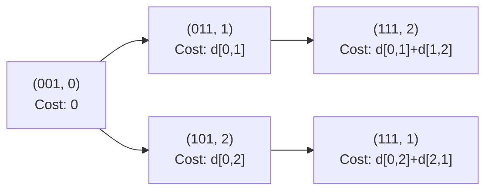

# Bitmask Dynamic Programming

| Property | Value |
|----------|-------|
| Category | Dynamic Programming |
| Subcategory | Combinatorial Optimization |
| Complexity (Time) | O(2^n × n) or O(2^n × n²) |
| Complexity (Space) | O(2^n) or O(2^n × n) |
| Input | Set of items, constraints |
| Output | Optimal assignment/count |

## Overview

**Bitmask DP** is a technique that uses binary numbers to represent subsets of a set. Each bit in the mask represents whether an element is included (1) or excluded (0). This is particularly useful for problems involving:
- Subset enumeration
- Assignment problems
- Traveling Salesman Problem (TSP)
- Set cover problems

## Mathematical Foundation

### Bitmask Representation

For a set $S = \{0, 1, 2, ..., n-1\}$, a bitmask $m$ represents a subset:

$$\text{Element } i \in \text{subset} \iff (m \land 2^i) \neq 0$$

### Number of Subsets

For $n$ elements, there are $2^n$ possible subsets (including empty set).

### Bit Operations

| Operation | Expression | Description |
|-----------|------------|-------------|
| Check bit i | `mask & (1 << i)` | Is element i in subset? |
| Set bit i | `mask \| (1 << i)` | Add element i |
| Clear bit i | `mask & ~(1 << i)` | Remove element i |
| Toggle bit i | `mask ^ (1 << i)` | Flip element i |
| Count bits | `bin(mask).count('1')` | Subset size |
| All bits set | `(1 << n) - 1` | Full set mask |

### Task Assignment Recurrence

For task assignment with $N$ tasks and $M$ people:

$$dp[mask][task] = \sum_{p \in \text{people for task}} dp[mask \mid (1 \ll p)][task + 1]$$

Where:
- $mask$ = bitmask of assigned people
- $task$ = current task number

## Algorithm Approaches

### 1. Task Assignment Problem

```
TASK-ASSIGNMENT(task_performed, total_tasks):
    n_people = len(task_performed)
    final_mask = (1 << n_people) - 1
    
    // Build task → people mapping
    task_map = {}
    for person, tasks in enumerate(task_performed):
        for task in tasks:
            task_map[task].append(person)
    
    // DP with memoization
    dp = matrix of -1, size (2^n_people) × (total_tasks + 1)
    
    COUNT-WAYS(mask, task_no):
        if mask == final_mask:
            return 1  // All assigned
        if task_no > total_tasks:
            return 0  // No more tasks
        if dp[mask][task_no] != -1:
            return dp[mask][task_no]
        
        // Option 1: Skip this task
        total = COUNT-WAYS(mask, task_no + 1)
        
        // Option 2: Assign to available person
        if task_no in task_map:
            for person in task_map[task_no]:
                if not (mask & (1 << person)):  // Person not assigned
                    total += COUNT-WAYS(mask | (1 << person), task_no + 1)
        
        dp[mask][task_no] = total
        return total
    
    return COUNT-WAYS(0, 1)
```

### 2. Traveling Salesman Problem (TSP)

```
TSP(dist, n):
    INF = infinity
    dp = matrix of INF, size (2^n) × n
    
    // Base: start from city 0
    dp[1][0] = 0
    
    // Iterate over all subsets
    for mask from 0 to (2^n - 1):
        for last from 0 to n-1:
            if not (mask & (1 << last)):
                continue
            if dp[mask][last] == INF:
                continue
            
            // Try adding each unvisited city
            for next from 0 to n-1:
                if mask & (1 << next):
                    continue
                new_mask = mask | (1 << next)
                dp[new_mask][next] = min(dp[new_mask][next], 
                                         dp[mask][last] + dist[last][next])
    
    // Find minimum tour returning to 0
    full_mask = (1 << n) - 1
    ans = INF
    for last from 1 to n-1:
        ans = min(ans, dp[full_mask][last] + dist[last][0])
    
    return ans
```

### 3. Subset Sum with Bitmask

```
SUBSET-SUM-BITMASK(arr, target):
    n = len(arr)
    
    for mask from 0 to (2^n - 1):
        sum = 0
        for i from 0 to n-1:
            if mask & (1 << i):
                sum += arr[i]
        
        if sum == target:
            return mask_to_subset(mask, arr)
    
    return None
```

## Complexity Analysis

| Problem | Time | Space | Practical Limit |
|---------|------|-------|-----------------|
| Subset Enumeration | O(2^n) | O(1) | n ≤ 25 |
| Task Assignment | O(2^m × n) | O(2^m × n) | m ≤ 20 |
| TSP | O(2^n × n²) | O(2^n × n) | n ≤ 20 |
| Set Cover | O(2^n × n) | O(2^n) | n ≤ 20 |

## Visual Representation

### Bitmask Example (n=3)

```
Mask  Binary  Subset
────────────────────────
 0    000     {}
 1    001     {0}
 2    010     {1}
 3    011     {0, 1}
 4    100     {2}
 5    101     {0, 2}
 6    110     {1, 2}
 7    111     {0, 1, 2}
```

### Task Assignment State Space

```
Tasks: {1, 3, 4}, {1, 2, 5}, {3, 4}
People: 0, 1, 2

                    (000, task 1)
                   /      |      \
        Person 0        Skip    Person 1
        (001, t2)     (000, t2)  (010, t2)
           |            |            |
          ...         ...          ...
                                   
Final: mask = 111 (all assigned)
```

### TSP State Transition



## Implementation (from repository)

```python
from collections import defaultdict


class AssignmentUsingBitmask:
    def __init__(self, task_performed, total):
        self.total_tasks = total  # total no of tasks (N)

        # DP table will have a dimension of (2^M)*N
        # initially all values are set to -1
        self.dp = [
            [-1 for i in range(total + 1)] for j in range(2 ** len(task_performed))
        ]

        self.task = defaultdict(list)  # stores the list of persons for each task

        # final_mask is used to check if all persons are included by setting all bits
        # to 1
        self.final_mask = (1 << len(task_performed)) - 1

    def count_ways_until(self, mask, task_no):
        # if mask == self.finalmask all persons are distributed tasks, return 1
        if mask == self.final_mask:
            return 1

        # if not everyone gets the task and no more tasks are available, return 0
        if task_no > self.total_tasks:
            return 0

        # if case already considered
        if self.dp[mask][task_no] != -1:
            return self.dp[mask][task_no]

        # Number of ways when we don't this task in the arrangement
        total_ways_until = self.count_ways_until(mask, task_no + 1)

        # now assign the tasks one by one to all possible persons and recursively
        # assign for the remaining tasks.
        if task_no in self.task:
            for p in self.task[task_no]:
                # if p is already given a task
                if mask & (1 << p):
                    continue

                # assign this task to p and change the mask value. And recursively
                # assign tasks with the new mask value.
                total_ways_until += self.count_ways_until(mask | (1 << p), task_no + 1)

        # save the value.
        self.dp[mask][task_no] = total_ways_until

        return self.dp[mask][task_no]

    def count_no_of_ways(self, task_performed):
        # Store the list of persons for each task
        for i in range(len(task_performed)):
            for j in task_performed[i]:
                self.task[j].append(i)

        # call the function to fill the DP table, final answer is stored in dp[0][1]
        return self.count_ways_until(0, 1)
```

## Real-World Applications

### 1. Team Formation / Resource Allocation

```python
from typing import List, Dict, Set, Tuple
from collections import defaultdict

def find_optimal_team_assignments(
    employees: List[str],
    skills: Dict[str, Set[str]],
    projects: List[Dict],
    max_projects_per_person: int = 2
) -> List[Dict]:
    """
    Assign employees to projects based on skills.
    
    >>> employees = ["Alice", "Bob", "Carol"]
    >>> skills = {"Alice": {"Python", "ML"}, "Bob": {"Java"}, "Carol": {"Python"}}
    >>> projects = [{"name": "AI", "requires": {"Python", "ML"}}]
    >>> result = find_optimal_team_assignments(employees, skills, projects)
    >>> len(result) > 0
    True
    """
    n_employees = len(employees)
    n_projects = len(projects)
    
    # Precompute which employees can work on which projects
    eligible = []
    for project in projects:
        required = project['requires']
        eligible_employees = []
        for i, emp in enumerate(employees):
            if required <= skills.get(emp, set()):
                eligible_employees.append(i)
        eligible.append(eligible_employees)
    
    # Use bitmask DP to find all valid assignments
    # dp[mask] = list of (project_assignments, score)
    # mask = which employees are fully booked
    
    results = []
    
    def backtrack(project_idx: int, assignment: List[List[int]], 
                  employee_load: List[int]):
        if project_idx == n_projects:
            # Valid assignment found
            result = []
            for i, proj in enumerate(projects):
                result.append({
                    'project': proj['name'],
                    'team': [employees[e] for e in assignment[i]]
                })
            results.append(result)
            return
        
        project = projects[project_idx]
        min_team = project.get('min_team', 1)
        max_team = project.get('max_team', n_employees)
        
        # Try all subsets of eligible employees
        elig = eligible[project_idx]
        
        for mask in range(1, 1 << len(elig)):
            team = [elig[i] for i in range(len(elig)) if mask & (1 << i)]
            
            if len(team) < min_team or len(team) > max_team:
                continue
            
            # Check capacity
            valid = True
            for emp_idx in team:
                if employee_load[emp_idx] >= max_projects_per_person:
                    valid = False
                    break
            
            if valid:
                # Assign and recurse
                for emp_idx in team:
                    employee_load[emp_idx] += 1
                assignment.append(team)
                
                backtrack(project_idx + 1, assignment, employee_load)
                
                assignment.pop()
                for emp_idx in team:
                    employee_load[emp_idx] -= 1
    
    backtrack(0, [], [0] * n_employees)
    return results


def optimize_shift_schedule(
    workers: List[str],
    availability: Dict[str, Set[int]],  # worker -> available shifts
    shifts_needed: List[int],  # workers needed per shift
    max_shifts_per_worker: int = 3
) -> Dict[int, List[str]]:
    """
    Create optimal shift schedule.
    
    >>> workers = ["A", "B", "C"]
    >>> avail = {"A": {0, 1}, "B": {1, 2}, "C": {0, 2}}
    >>> needs = [1, 1, 1]  # 1 worker per shift
    >>> schedule = optimize_shift_schedule(workers, avail, needs)
    >>> all(len(schedule.get(s, [])) >= needs[s] for s in range(len(needs)))
    True
    """
    n_workers = len(workers)
    n_shifts = len(shifts_needed)
    
    # Build eligible workers per shift
    eligible_per_shift = []
    for shift in range(n_shifts):
        elig = [i for i, w in enumerate(workers) 
                if shift in availability.get(w, set())]
        eligible_per_shift.append(elig)
    
    best_schedule = None
    best_score = float('-inf')
    
    def evaluate(schedule: Dict[int, List[int]]) -> float:
        # Score based on meeting needs and balanced distribution
        score = 0
        worker_counts = defaultdict(int)
        
        for shift, assigned in schedule.items():
            if len(assigned) >= shifts_needed[shift]:
                score += 10 * len(assigned)
            else:
                score -= 100 * (shifts_needed[shift] - len(assigned))
            
            for w in assigned:
                worker_counts[w] += 1
        
        # Penalize unbalanced schedules
        if worker_counts:
            avg = sum(worker_counts.values()) / n_workers
            variance = sum((c - avg) ** 2 for c in worker_counts.values())
            score -= variance
        
        return score
    
    def backtrack(shift: int, schedule: Dict[int, List[int]], 
                  worker_shifts: Dict[int, int]):
        nonlocal best_schedule, best_score
        
        if shift == n_shifts:
            score = evaluate(schedule)
            if score > best_score:
                best_score = score
                best_schedule = {s: [workers[w] for w in ws] 
                                for s, ws in schedule.items()}
            return
        
        needed = shifts_needed[shift]
        elig = eligible_per_shift[shift]
        
        # Try all subsets of size >= needed
        for mask in range(1 << len(elig)):
            assigned = [elig[i] for i in range(len(elig)) if mask & (1 << i)]
            
            if len(assigned) < needed:
                continue
            
            # Check capacity
            valid = True
            for w in assigned:
                if worker_shifts.get(w, 0) >= max_shifts_per_worker:
                    valid = False
                    break
            
            if valid:
                for w in assigned:
                    worker_shifts[w] = worker_shifts.get(w, 0) + 1
                schedule[shift] = assigned
                
                backtrack(shift + 1, schedule, worker_shifts)
                
                del schedule[shift]
                for w in assigned:
                    worker_shifts[w] -= 1
    
    backtrack(0, {}, {})
    return best_schedule or {}
```

### 2. Traveling Salesman Problem (Delivery Routes)

```python
from typing import List, Tuple, Optional
import math

def solve_tsp(
    cities: List[str],
    distances: List[List[float]]
) -> Tuple[float, List[str]]:
    """
    Solve TSP using bitmask DP.
    
    >>> cities = ["A", "B", "C"]
    >>> dist = [[0, 10, 15], [10, 0, 20], [15, 20, 0]]
    >>> cost, path = solve_tsp(cities, dist)
    >>> cost
    45
    """
    n = len(cities)
    if n == 0:
        return (0, [])
    if n == 1:
        return (0, cities)
    
    INF = float('inf')
    
    # dp[mask][i] = min cost to visit cities in mask, ending at i
    dp = [[INF] * n for _ in range(1 << n)]
    parent = [[-1] * n for _ in range(1 << n)]
    
    # Start from city 0
    dp[1][0] = 0
    
    for mask in range(1, 1 << n):
        for last in range(n):
            if not (mask & (1 << last)):
                continue
            if dp[mask][last] == INF:
                continue
            
            for next_city in range(n):
                if mask & (1 << next_city):
                    continue
                
                new_mask = mask | (1 << next_city)
                new_cost = dp[mask][last] + distances[last][next_city]
                
                if new_cost < dp[new_mask][next_city]:
                    dp[new_mask][next_city] = new_cost
                    parent[new_mask][next_city] = last
    
    # Find best ending city
    full_mask = (1 << n) - 1
    min_cost = INF
    last_city = -1
    
    for i in range(1, n):
        total = dp[full_mask][i] + distances[i][0]
        if total < min_cost:
            min_cost = total
            last_city = i
    
    # Reconstruct path
    path = []
    mask = full_mask
    current = last_city
    
    while current != -1:
        path.append(cities[current])
        prev = parent[mask][current]
        mask ^= (1 << current)
        current = prev
    
    path.reverse()
    path.append(cities[0])  # Return to start
    
    return (min_cost, path)


def optimize_delivery_route(
    depot: Tuple[float, float],
    customers: List[Tuple[str, Tuple[float, float]]],
    vehicle_capacity: Optional[int] = None
) -> Dict:
    """
    Optimize delivery route from depot to customers.
    
    >>> depot = (0, 0)
    >>> customers = [("A", (1, 0)), ("B", (0, 1)), ("C", (1, 1))]
    >>> result = optimize_delivery_route(depot, customers)
    >>> 'total_distance' in result
    True
    """
    # Calculate distances
    all_points = [("Depot", depot)] + customers
    n = len(all_points)
    
    distances = [[0.0] * n for _ in range(n)]
    for i in range(n):
        for j in range(n):
            p1 = all_points[i][1]
            p2 = all_points[j][1]
            distances[i][j] = math.sqrt((p1[0] - p2[0])**2 + (p1[1] - p2[1])**2)
    
    # Solve TSP
    names = [p[0] for p in all_points]
    total_dist, path = solve_tsp(names, distances)
    
    return {
        'total_distance': round(total_dist, 2),
        'route': path,
        'num_stops': n - 1  # Excluding depot
    }
```

### 3. Set Cover Problem

```python
from typing import List, Set, Dict, Tuple

def minimum_set_cover(
    universe: Set,
    subsets: List[Set],
    subset_costs: List[float] = None
) -> Tuple[float, List[int]]:
    """
    Find minimum cost subset cover using bitmask DP.
    
    >>> universe = {1, 2, 3, 4}
    >>> subsets = [{1, 2}, {2, 3}, {3, 4}, {1, 4}]
    >>> cost, selected = minimum_set_cover(universe, subsets)
    >>> set.union(*[subsets[i] for i in selected]) == universe
    True
    """
    n = len(subsets)
    if subset_costs is None:
        subset_costs = [1.0] * n
    
    # Map elements to indices
    elem_list = list(universe)
    elem_to_idx = {e: i for i, e in enumerate(elem_list)}
    m = len(universe)
    
    # Convert subsets to bitmasks
    subset_masks = []
    for s in subsets:
        mask = 0
        for elem in s:
            if elem in elem_to_idx:
                mask |= (1 << elem_to_idx[elem])
        subset_masks.append(mask)
    
    full_mask = (1 << m) - 1
    INF = float('inf')
    
    # dp[mask] = (min_cost, selected_subsets)
    dp = [(INF, [])] for _ in range(1 << m)]
    dp[0] = (0, [])
    
    for mask in range(1 << m):
        if dp[mask][0] == INF:
            continue
        
        for i in range(n):
            new_mask = mask | subset_masks[i]
            new_cost = dp[mask][0] + subset_costs[i]
            
            if new_cost < dp[new_mask][0]:
                dp[new_mask] = (new_cost, dp[mask][1] + [i])
    
    return dp[full_mask]


def feature_selection(
    required_features: Set[str],
    packages: Dict[str, Dict],  # package -> {features, cost}
    max_packages: int = None
) -> Dict:
    """
    Select minimum packages to cover required features.
    
    >>> features = {"auth", "db", "api"}
    >>> packages = {
    ...     "basic": {"features": {"auth", "api"}, "cost": 10},
    ...     "data": {"features": {"db"}, "cost": 5}
    ... }
    >>> result = feature_selection(features, packages)
    >>> result['total_cost']
    15
    """
    pkg_names = list(packages.keys())
    pkg_features = [packages[p]['features'] for p in pkg_names]
    pkg_costs = [packages[p]['cost'] for p in pkg_names]
    
    cost, selected_indices = minimum_set_cover(
        required_features, 
        pkg_features, 
        pkg_costs
    )
    
    return {
        'selected_packages': [pkg_names[i] for i in selected_indices],
        'total_cost': cost,
        'features_covered': set.union(*[pkg_features[i] for i in selected_indices]) if selected_indices else set()
    }
```

## Variations

### Iterating Through Submasks

```python
def iterate_submasks(mask: int):
    """
    Iterate through all submasks of a mask in decreasing order.
    
    >>> list(iterate_submasks(5))  # 101 in binary
    [5, 4, 1, 0]
    """
    submask = mask
    while submask > 0:
        yield submask
        submask = (submask - 1) & mask
    yield 0
```

### Profile DP (Broken Profile)

Used for problems on grids where state depends on a "profile" or boundary.

## Common Pitfalls

1. **Size limitation**: Bitmask DP only practical for n ≤ 20-25
2. **Bit indexing**: Off-by-one errors with bit positions
3. **Integer overflow**: Use appropriate integer types
4. **Memory**: $2^n$ states can be memory-intensive

## References

- [Bitmask DP - CP Algorithms](https://cp-algorithms.com/algebra/all-submasks.html)
- [Traveling Salesman with Bitmask](https://www.geeksforgeeks.org/travelling-salesman-problem-using-dynamic-programming/)

## See Also

- [Combination Sum](combination_sum_iv.md) - Counting combinations
- [Subset Sum](subset_generation.md) - Subset problems
- [Integer Partition](integer_partition.md) - Partitioning numbers
