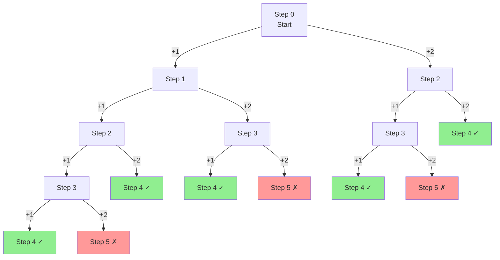

# Climbing Stairs

| Property | Value |
|----------|-------|
| Category | Dynamic Programming |
| Subcategory | Counting Paths |
| Complexity (Time) | O(n) |
| Complexity (Space) | O(1) optimized |
| Input | Number of stairs |
| Output | Distinct ways to climb |

## Overview

The **Climbing Stairs** problem (LeetCode #70) asks: Given a staircase with `n` steps, where you can climb either 1 or 2 steps at a time, how many distinct ways are there to reach the top?

This is essentially the Fibonacci sequence in disguise, making it an excellent introductory dynamic programming problem.

## Mathematical Foundation

### Problem Definition

Given $n$ steps, at each step you can climb either:
- 1 step, or
- 2 steps

Find the total number of distinct ways to reach step $n$.

### Recurrence Relation

Let $f(n)$ = number of ways to climb $n$ stairs:

$$f(n) = f(n-1) + f(n-2)$$

**Reasoning:**
- To reach step $n$, you either:
  - Come from step $n-1$ (one 1-step)
  - Come from step $n-2$ (one 2-step)
- Total ways = sum of ways to reach $n-1$ and $n-2$

### Base Cases

$$f(1) = 1 \quad \text{(only one way: take 1 step)}$$
$$f(2) = 2 \quad \text{(two ways: 1+1 or 2)}$$

### Closed-Form Solution

Since this is Fibonacci:

$$f(n) = \frac{\phi^n - \psi^n}{\sqrt{5}}$$

Where $\phi = \frac{1+\sqrt{5}}{2}$ and $\psi = \frac{1-\sqrt{5}}{2}$.

## Algorithm Approaches

### 1. Recursive (Exponential - Inefficient)

```
CLIMB-STAIRS-RECURSIVE(n):
    if n == 1:
        return 1
    if n == 2:
        return 2
    return CLIMB-STAIRS-RECURSIVE(n-1) + CLIMB-STAIRS-RECURSIVE(n-2)
```

### 2. Memoization (Top-Down)

```
CLIMB-STAIRS-MEMO(n):
    memo = map
    
    function SOLVE(k):
        if k == 1:
            return 1
        if k == 2:
            return 2
        
        if k in memo:
            return memo[k]
        
        result = SOLVE(k-1) + SOLVE(k-2)
        memo[k] = result
        return result
    
    return SOLVE(n)
```

### 3. Tabulation (Bottom-Up)

```
CLIMB-STAIRS-DP(n):
    if n == 1:
        return 1
    
    dp = array of size (n+1)
    dp[1] = 1
    dp[2] = 2
    
    for i from 3 to n:
        dp[i] = dp[i-1] + dp[i-2]
    
    return dp[n]
```

### 4. Space-Optimized (O(1) Space)

```
CLIMB-STAIRS-OPTIMIZED(n):
    if n == 1:
        return 1
    
    previous = 1
    current = 1
    
    for i from 2 to n:
        current, previous = current + previous, current
    
    return current
```

## Complexity Analysis

| Approach | Time | Space | Notes |
|----------|------|-------|-------|
| Naive Recursion | O(2^n) | O(n) | Exponential |
| Memoization | O(n) | O(n) | Top-down |
| Tabulation | O(n) | O(n) | Bottom-up |
| Space-Optimized | O(n) | O(1) | Best approach |
| Matrix Exponent. | O(log n) | O(1) | Advanced |

## Visual Representation

### Decision Tree for n=4



**5 ways to climb 4 stairs:**
1. 1+1+1+1
2. 1+1+2
3. 1+2+1
4. 2+1+1
5. 2+2

### DP Table

```
n:    1   2   3   4   5   6   7   8   9   10
f(n): 1   2   3   5   8  13  21  34  55  89

Calculation:
f(3) = f(2) + f(1) = 2 + 1 = 3
f(4) = f(3) + f(2) = 3 + 2 = 5
f(5) = f(4) + f(3) = 5 + 3 = 8
...
```

### Space Optimization Trace

```
n = 5

Initial: prev = 1, curr = 1

i=2: curr = 1+1 = 2, prev = 1  → (prev=1, curr=2)
i=3: curr = 2+1 = 3, prev = 2  → (prev=2, curr=3)
i=4: curr = 3+2 = 5, prev = 3  → (prev=3, curr=5)
i=5: curr = 5+3 = 8, prev = 5  → (prev=5, curr=8)

Answer: 8 ways
```

## Implementation (from repository)

```python
def climb_stairs(number_of_steps: int) -> int:
    """
    LeetCode No.70: Climbing Stairs
    
    Distinct ways to climb a number_of_steps staircase where each time 
    you can either climb 1 or 2 steps.

    Args:
        number_of_steps: number of steps on the staircase

    Returns:
        Distinct ways to climb a number_of_steps staircase

    Raises:
        AssertionError: number_of_steps not positive integer

    >>> climb_stairs(3)
    3
    >>> climb_stairs(1)
    1
    >>> climb_stairs(5)
    8
    >>> climb_stairs(-7)  # doctest: +ELLIPSIS
    Traceback (most recent call last):
        ...
    AssertionError: number_of_steps needs to be positive integer, your input -7
    """
    assert isinstance(number_of_steps, int) and number_of_steps > 0, (
        f"number_of_steps needs to be positive integer, your input {number_of_steps}"
    )
    
    if number_of_steps == 1:
        return 1
    
    previous, current = 1, 1
    for _ in range(number_of_steps - 1):
        current, previous = current + previous, current
    
    return current
```

## Real-World Applications

### 1. Probability of Reaching States

```python
from typing import List, Dict

def probability_reaching_step(
    n: int,
    p_one_step: float = 0.5
) -> Dict[int, float]:
    """
    Calculate probability of reaching each step.
    
    With probability p of taking 1 step and (1-p) of taking 2 steps.
    
    >>> probs = probability_reaching_step(4, 0.6)
    >>> round(probs[4], 4)
    0.4752
    """
    p_two_step = 1 - p_one_step
    
    # prob[i] = probability of reaching step i
    prob = [0.0] * (n + 1)
    prob[0] = 1.0  # Start at step 0
    
    for i in range(n + 1):
        if prob[i] > 0:
            if i + 1 <= n:
                prob[i + 1] += prob[i] * p_one_step
            if i + 2 <= n:
                prob[i + 2] += prob[i] * p_two_step
    
    return {i: prob[i] for i in range(1, n + 1)}


def expected_steps_to_top(n: int, p_one_step: float = 0.5) -> float:
    """
    Calculate expected number of moves to reach the top.
    
    >>> expected = expected_steps_to_top(10, 0.5)
    >>> 6 < expected < 8
    True
    """
    p_two = 1 - p_one_step
    
    # E[i] = expected moves from step i to n
    E = [0.0] * (n + 1)
    
    for i in range(n - 1, -1, -1):
        # If we can reach n in one move
        if i + 1 == n:
            E[i] = p_one_step * 1 + p_two * (1 + E[i + 1] if i + 2 <= n else 2)
        elif i + 2 == n:
            E[i] = p_one_step * (1 + E[i + 1]) + p_two * 1
        else:
            E[i] = p_one_step * (1 + E[i + 1]) + p_two * (1 + E[i + 2])
    
    return E[0]
```

### 2. Game Level Progression

```python
from typing import List, Tuple

def count_level_paths(
    levels: int,
    allowed_jumps: List[int] = [1, 2]
) -> int:
    """
    Count ways to progress through game levels.
    
    Can skip certain number of levels based on allowed_jumps.
    
    >>> count_level_paths(5, [1, 2])
    8
    >>> count_level_paths(5, [1, 2, 3])
    13
    """
    if levels == 0:
        return 1
    
    dp = [0] * (levels + 1)
    dp[0] = 1
    
    for i in range(1, levels + 1):
        for jump in allowed_jumps:
            if i - jump >= 0:
                dp[i] += dp[i - jump]
    
    return dp[levels]


def list_all_paths(levels: int) -> List[List[int]]:
    """
    List all possible paths through levels.
    
    >>> paths = list_all_paths(3)
    >>> [1, 1, 1] in paths
    True
    >>> [1, 2] in paths
    True
    """
    all_paths = []
    
    def backtrack(current: int, path: List[int]):
        if current == levels:
            all_paths.append(path.copy())
            return
        if current > levels:
            return
        
        for step in [1, 2]:
            path.append(step)
            backtrack(current + step, path)
            path.pop()
    
    backtrack(0, [])
    return all_paths
```

### 3. Network Packet Routing

```python
from typing import Dict

def count_routing_options(
    hops: int,
    max_skip: int = 2
) -> Dict[str, int]:
    """
    Count network packet routing options.
    
    A packet can traverse 1 to max_skip nodes at a time.
    
    >>> result = count_routing_options(5, 2)
    >>> result['total_paths']
    8
    """
    # dp[i] = number of ways to reach node i
    dp = [0] * (hops + 1)
    dp[0] = 1
    
    for i in range(1, hops + 1):
        for skip in range(1, min(max_skip, i) + 1):
            dp[i] += dp[i - skip]
    
    # Calculate average hops per path
    def count_with_hops(n: int, target_hops: int) -> int:
        """Count paths with exactly target_hops jumps."""
        if n == 0 and target_hops == 0:
            return 1
        if n <= 0 or target_hops <= 0:
            return 0
        
        count = 0
        for skip in range(1, min(max_skip, n) + 1):
            count += count_with_hops(n - skip, target_hops - 1)
        return count
    
    # Find distribution
    distribution = {}
    for num_hops in range(1, hops + 1):
        count = count_with_hops(hops, num_hops)
        if count > 0:
            distribution[num_hops] = count
    
    return {
        'total_paths': dp[hops],
        'distribution': distribution
    }
```

### 4. Cost Optimization Variant

```python
from typing import List, Tuple

def min_cost_climbing_stairs(cost: List[int]) -> int:
    """
    Minimum cost to climb stairs where each step has a cost.
    
    LeetCode #746 variant.
    
    >>> min_cost_climbing_stairs([10, 15, 20])
    15
    >>> min_cost_climbing_stairs([1, 100, 1, 1, 1, 100, 1, 1, 100, 1])
    6
    """
    n = len(cost)
    if n <= 2:
        return min(cost) if n > 0 else 0
    
    # dp[i] = min cost to reach step i
    prev2, prev1 = cost[0], cost[1]
    
    for i in range(2, n):
        current = cost[i] + min(prev1, prev2)
        prev2, prev1 = prev1, current
    
    # Can start from step 0 or 1, and end after last or second-last
    return min(prev1, prev2)


def min_cost_with_path(cost: List[int]) -> Tuple[int, List[int]]:
    """
    Return minimum cost and the steps taken.
    
    >>> cost, path = min_cost_with_path([10, 15, 20])
    >>> cost
    15
    >>> 1 in path  # Stepped on index 1
    True
    """
    n = len(cost)
    if n == 0:
        return 0, []
    if n == 1:
        return cost[0], [0]
    
    dp = [0] * n
    dp[0] = cost[0]
    dp[1] = cost[1]
    
    for i in range(2, n):
        dp[i] = cost[i] + min(dp[i-1], dp[i-2])
    
    # Backtrack
    path = []
    i = n - 1 if dp[n-1] < dp[n-2] else n - 2
    
    while i >= 0:
        path.append(i)
        if i == 0:
            break
        if i == 1:
            i = -1  # Can skip step 0
        elif dp[i-1] < dp[i-2]:
            i -= 1
        else:
            i -= 2
    
    path.reverse()
    return min(dp[n-1], dp[n-2]), path
```

## Variations

### K Steps at a Time

```python
def climb_stairs_k_steps(n: int, k: int) -> int:
    """
    Can take 1 to k steps at a time.
    
    >>> climb_stairs_k_steps(5, 3)
    13
    """
    if n == 0:
        return 1
    
    dp = [0] * (n + 1)
    dp[0] = 1
    
    for i in range(1, n + 1):
        for step in range(1, min(k, i) + 1):
            dp[i] += dp[i - step]
    
    return dp[n]
```

### With Forbidden Steps

```python
def climb_with_forbidden(n: int, forbidden: set) -> int:
    """
    Some steps are forbidden (broken).
    
    >>> climb_with_forbidden(5, {3})
    4
    """
    dp = [0] * (n + 1)
    dp[0] = 1
    
    for i in range(1, n + 1):
        if i in forbidden:
            dp[i] = 0
        else:
            dp[i] = dp[i-1]
            if i >= 2:
                dp[i] += dp[i-2]
    
    return dp[n]
```

## Common Pitfalls

1. **Off-by-one errors**: Be clear about 0-indexed vs 1-indexed
2. **Base cases**: Both f(1)=1 and f(2)=2 needed for some implementations
3. **Confusing with Fibonacci**: Same recurrence but different base cases interpretation
4. **Integer overflow**: For large n, result grows exponentially

## References

- [LeetCode 70 - Climbing Stairs](https://leetcode.com/problems/climbing-stairs/)
- [Fibonacci Numbers](https://en.wikipedia.org/wiki/Fibonacci_number)
- CLRS Chapter 15 - Dynamic Programming

## See Also

- [Fibonacci](fibonacci.md) - Same recurrence relation
- [Min Cost Climbing Stairs](min_cost_climbing_stairs.md) - With costs
- [House Robber](house_robber.md) - Similar DP pattern
