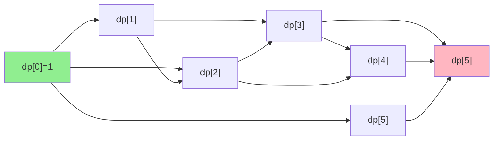

# Combination Sum IV

| Property | Value |
|----------|-------|
| Category | Dynamic Programming |
| Subcategory | Counting/Combinatorics |
| Complexity (Time) | O(n × target) |
| Complexity (Space) | O(target) |
| Input | Array of distinct integers, target sum |
| Output | Number of combinations that sum to target |

## Overview

**Combination Sum IV** counts the number of ways to select elements from an array (with repetition allowed) such that their sum equals a target value. The order matters, so `[1,2]` and `[2,1]` are counted as different combinations.

**Note**: This is actually counting **permutations** with repetition, not combinations (despite the name).

## Mathematical Foundation

### Problem Definition

Given array $A = [a_1, a_2, ..., a_n]$ of distinct positive integers and target $T$:

Find the number of ordered sequences $(x_1, x_2, ..., x_k)$ where:
- Each $x_i \in A$
- $\sum_{i=1}^{k} x_i = T$

### Recurrence Relation

Let $dp[i]$ = number of ways to make sum $i$:

$$dp[i] = \sum_{j=1}^{n} dp[i - a_j] \quad \text{where } i - a_j \geq 0$$

### Base Case

$$dp[0] = 1 \quad \text{(one way to make sum 0: empty sequence)}$$

### Difference from Coin Change

| Problem | Order Matters? | Example |
|---------|---------------|---------|
| Combination Sum IV | Yes | [1,2] ≠ [2,1] |
| Coin Change (Count) | No | [1,2] = [2,1] |

## Algorithm Approaches

### 1. Recursive (Exponential Time)

```
COMBO-SUM-RECURSIVE(array, target):
    if target < 0:
        return 0
    if target == 0:
        return 1
    
    count = 0
    for item in array:
        count += COMBO-SUM-RECURSIVE(array, target - item)
    
    return count
```

### 2. Top-Down with Memoization

```
COMBO-SUM-MEMO(array, target, dp):
    if target < 0:
        return 0
    if target == 0:
        return 1
    if dp[target] != -1:
        return dp[target]
    
    count = 0
    for item in array:
        count += COMBO-SUM-MEMO(array, target - item, dp)
    
    dp[target] = count
    return count
```

### 3. Bottom-Up Tabulation

```
COMBO-SUM-BOTTOM-UP(array, target):
    dp = array of size (target + 1), all 0
    dp[0] = 1  // Base case
    
    for i from 1 to target:
        for num in array:
            if i - num >= 0:
                dp[i] += dp[i - num]
    
    return dp[target]
```

## Complexity Analysis

| Approach | Time | Space | Notes |
|----------|------|-------|-------|
| Recursive | O(n^target) | O(target) | Exponential |
| Memoization | O(n × target) | O(target) | Top-down |
| Tabulation | O(n × target) | O(target) | Bottom-up |

## Visual Representation

### Example: array=[1,2,5], target=5

```
dp[0] = 1                           (base: empty sequence)
dp[1] = dp[0] = 1                   ([1])
dp[2] = dp[1] + dp[0] = 2           ([1,1], [2])
dp[3] = dp[2] + dp[1] = 3           ([1,1,1], [1,2], [2,1])
dp[4] = dp[3] + dp[2] = 5           ([1,1,1,1], [1,1,2], [1,2,1], [2,1,1], [2,2])
dp[5] = dp[4] + dp[3] + dp[0] = 9   ([1,1,1,1,1], [1,1,1,2], [1,1,2,1], [1,2,1,1], 
                                     [2,1,1,1], [1,2,2], [2,1,2], [2,2,1], [5])
```

### State Transition Diagram



### Recursion Tree (before memoization)

```
                    target=5
            /          |          \
         t=4         t=3         t=0
       / | \       / | \           |
     t=3 t=2 -   t=2 t=1 -        1
     ...  ...    ...  ...
```

## Implementation (from repository)

```python
def combination_sum_iv(array: list[int], target: int) -> int:
    """
    Function checks the all possible combinations, and returns the count
    of possible combination in exponential Time Complexity.

    >>> combination_sum_iv([1,2,5], 5)
    9
    """

    def count_of_possible_combinations(target: int) -> int:
        if target < 0:
            return 0
        if target == 0:
            return 1
        return sum(count_of_possible_combinations(target - item) for item in array)

    return count_of_possible_combinations(target)


def combination_sum_iv_dp_array(array: list[int], target: int) -> int:
    """
    Function checks the all possible combinations, and returns the count
    of possible combination in O(N^2) Time Complexity as we are using Dynamic
    programming array here.

    >>> combination_sum_iv_dp_array([1,2,5], 5)
    9
    """

    def count_of_possible_combinations_with_dp_array(
        target: int, dp_array: list[int]
    ) -> int:
        if target < 0:
            return 0
        if target == 0:
            return 1
        if dp_array[target] != -1:
            return dp_array[target]
        answer = sum(
            count_of_possible_combinations_with_dp_array(target - item, dp_array)
            for item in array
        )
        dp_array[target] = answer
        return answer

    dp_array = [-1] * (target + 1)
    return count_of_possible_combinations_with_dp_array(target, dp_array)


def combination_sum_iv_bottom_up(n: int, array: list[int], target: int) -> int:
    """
    Function checks the all possible combinations with using bottom up approach,
    and returns the count of possible combination in O(N^2) Time Complexity
    as we are using Dynamic programming array here.

    >>> combination_sum_iv_bottom_up(3, [1,2,5], 5)
    9
    """

    dp_array = [0] * (target + 1)
    dp_array[0] = 1

    for i in range(1, target + 1):
        for j in range(n):
            if i - array[j] >= 0:
                dp_array[i] += dp_array[i - array[j]]

    return dp_array[target]
```

## Real-World Applications

### 1. Game Score Combinations

```python
from typing import List, Dict, Tuple

def count_score_sequences(
    final_score: int,
    scoring_options: List[int]
) -> Dict:
    """
    Count ways to reach a game score with different point options.
    Order matters (sequence of plays).
    
    >>> options = [1, 2, 3]  # e.g., free throw, 2-pointer, 3-pointer
    >>> result = count_score_sequences(5, options)
    >>> result['total_sequences']
    13
    """
    dp = [0] * (final_score + 1)
    dp[0] = 1
    
    for score in range(1, final_score + 1):
        for points in scoring_options:
            if score >= points:
                dp[score] += dp[score - points]
    
    # Generate some example sequences
    examples = []
    def generate_examples(remaining: int, path: List[int], max_examples: int = 5):
        if len(examples) >= max_examples:
            return
        if remaining == 0:
            examples.append(path.copy())
            return
        for points in scoring_options:
            if remaining >= points:
                path.append(points)
                generate_examples(remaining - points, path, max_examples)
                path.pop()
    
    generate_examples(final_score, [])
    
    return {
        'total_sequences': dp[final_score],
        'example_sequences': examples,
        'scoring_options': scoring_options
    }


def probability_of_score(
    target_score: int,
    options: List[Tuple[int, float]]  # (points, probability)
) -> float:
    """
    Calculate probability of reaching exact score.
    
    >>> options = [(1, 0.5), (2, 0.3), (3, 0.2)]
    >>> prob = probability_of_score(3, options)
    >>> 0 <= prob <= 1
    True
    """
    # dp[i] = probability of reaching score i
    dp = [0.0] * (target_score + 1)
    dp[0] = 1.0  # Start with 100% at score 0
    
    # This is simplified - real calculation would consider game length
    for score in range(1, target_score + 1):
        for points, prob in options:
            if score >= points:
                dp[score] += dp[score - points] * prob
    
    return dp[target_score]
```

### 2. Dice Roll Combinations

```python
from typing import List, Dict
from functools import lru_cache

def dice_combinations(
    target_sum: int,
    num_dice: int = None,
    faces: int = 6
) -> Dict:
    """
    Count ways to roll dice to get target sum.
    
    >>> result = dice_combinations(7, num_dice=2, faces=6)
    >>> result['ways']
    6
    """
    die_values = list(range(1, faces + 1))
    
    if num_dice is None:
        # Unlimited dice - same as combination sum IV
        dp = [0] * (target_sum + 1)
        dp[0] = 1
        
        for total in range(1, target_sum + 1):
            for face in die_values:
                if total >= face:
                    dp[total] += dp[total - face]
        
        return {
            'ways': dp[target_sum],
            'unlimited_dice': True
        }
    else:
        # Fixed number of dice
        # dp[d][s] = ways to get sum s with d dice
        dp = [[0] * (target_sum + 1) for _ in range(num_dice + 1)]
        dp[0][0] = 1
        
        for d in range(1, num_dice + 1):
            for s in range(d, min(d * faces, target_sum) + 1):
                for face in die_values:
                    if s >= face:
                        dp[d][s] += dp[d-1][s - face]
        
        return {
            'ways': dp[num_dice][target_sum],
            'num_dice': num_dice,
            'faces': faces
        }


def expected_rolls_to_reach(
    target: int,
    faces: int = 6
) -> float:
    """
    Calculate expected number of rolls to reach or exceed target.
    
    >>> expected = expected_rolls_to_reach(10, faces=6)
    >>> 2 < expected < 10
    True
    """
    # Use simulation for simplicity
    import random
    
    trials = 10000
    total_rolls = 0
    
    for _ in range(trials):
        current = 0
        rolls = 0
        while current < target:
            current += random.randint(1, faces)
            rolls += 1
        total_rolls += rolls
    
    return total_rolls / trials
```

### 3. Staircase / Step Patterns

```python
from typing import List, Dict, Optional

def count_step_patterns(
    total_steps: int,
    allowed_step_sizes: List[int]
) -> Dict:
    """
    Count distinct ways to climb stairs with allowed step sizes.
    
    >>> result = count_step_patterns(5, [1, 2, 3])
    >>> result['total_ways']
    13
    """
    dp = [0] * (total_steps + 1)
    dp[0] = 1
    
    for step in range(1, total_steps + 1):
        for size in allowed_step_sizes:
            if step >= size:
                dp[step] += dp[step - size]
    
    return {
        'total_ways': dp[total_steps],
        'step_sizes': allowed_step_sizes,
        'total_steps': total_steps
    }


def most_efficient_climb(
    total_steps: int,
    step_sizes: List[int],
    step_costs: Dict[int, float] = None
) -> Dict:
    """
    Find minimum cost way to climb stairs.
    
    >>> costs = {1: 1.0, 2: 1.5, 3: 2.5}
    >>> result = most_efficient_climb(6, [1, 2, 3], costs)
    >>> result['min_cost'] <= 6  # At most 6 single steps
    True
    """
    if step_costs is None:
        step_costs = {s: 1.0 for s in step_sizes}
    
    INF = float('inf')
    dp = [INF] * (total_steps + 1)
    parent = [-1] * (total_steps + 1)
    dp[0] = 0
    
    for step in range(1, total_steps + 1):
        for size in step_sizes:
            if step >= size and dp[step - size] + step_costs.get(size, INF) < dp[step]:
                dp[step] = dp[step - size] + step_costs[size]
                parent[step] = size
    
    # Reconstruct path
    path = []
    current = total_steps
    while current > 0:
        step_taken = parent[current]
        path.append(step_taken)
        current -= step_taken
    
    path.reverse()
    
    return {
        'min_cost': dp[total_steps],
        'path': path,
        'num_steps': len(path)
    }


def climb_with_constraints(
    total_steps: int,
    step_sizes: List[int],
    max_consecutive_same: int = None
) -> int:
    """
    Count climbs with constraint on consecutive same-size steps.
    
    >>> count = climb_with_constraints(5, [1, 2], max_consecutive_same=2)
    >>> count < 13  # Less than unconstrained
    True
    """
    if max_consecutive_same is None:
        return count_step_patterns(total_steps, step_sizes)['total_ways']
    
    # dp[step][last_size][consecutive_count]
    from functools import lru_cache
    
    @lru_cache(maxsize=None)
    def count(remaining: int, last: int, consecutive: int) -> int:
        if remaining == 0:
            return 1
        if remaining < 0:
            return 0
        
        total = 0
        for size in step_sizes:
            if size == last:
                if consecutive < max_consecutive_same:
                    total += count(remaining - size, size, consecutive + 1)
            else:
                total += count(remaining - size, size, 1)
        
        return total
    
    # Start with no previous step
    total = 0
    for size in step_sizes:
        if total_steps >= size:
            total += count(total_steps - size, size, 1)
    
    return total
```

## Variations

### Without Repetition (Each element used once)

```python
def combination_sum_no_repeat(array: List[int], target: int) -> int:
    """
    Count combinations without repeating elements.
    
    >>> combination_sum_no_repeat([1, 2, 3], 4)
    4
    """
    n = len(array)
    
    @lru_cache(maxsize=None)
    def count(idx: int, remaining: int) -> int:
        if remaining == 0:
            return 1
        if remaining < 0 or idx >= n:
            return 0
        
        # Include or exclude current element
        return count(idx + 1, remaining - array[idx]) + count(idx + 1, remaining)
    
    return count(0, target)
```

### Unordered Combinations (Order doesn't matter)

```python
def combination_sum_unordered(array: List[int], target: int) -> int:
    """
    Count unordered combinations (order doesn't matter).
    
    >>> combination_sum_unordered([1, 2, 5], 5)
    4
    """
    # This is the coin change counting problem
    dp = [0] * (target + 1)
    dp[0] = 1
    
    for num in array:  # Outer loop over numbers
        for i in range(num, target + 1):  # Inner loop over sums
            dp[i] += dp[i - num]
    
    return dp[target]
```

## Common Pitfalls

1. **Order matters**: This counts permutations, not combinations
2. **Loop order**: Inner/outer loop order changes semantics
3. **Negative numbers**: Original problem assumes positive integers
4. **Integer overflow**: Large targets can overflow counters

## References

- [LeetCode 377 - Combination Sum IV](https://leetcode.com/problems/combination-sum-iv/)
- [Dynamic Programming Patterns](https://leetcode.com/discuss/general-discussion/458695/dynamic-programming-patterns)

## See Also

- [Climbing Stairs](climbing_stairs.md) - Special case with steps 1,2
- [Coin Change](minimum_coin_change.md) - Unordered version
- [Integer Partition](integer_partition.md) - Partition numbers
