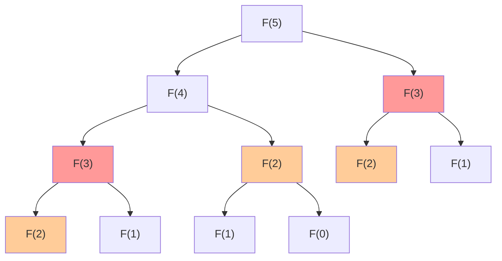
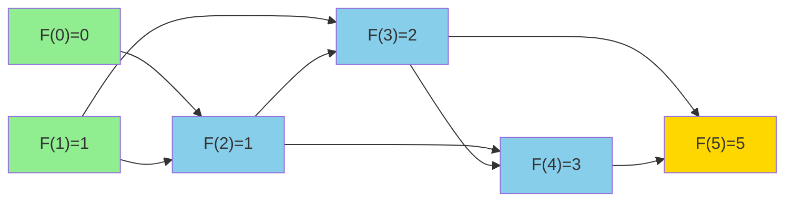

# Fibonacci Sequence

| Property | Value |
|----------|-------|
| Category | Dynamic Programming |
| Subcategory | Sequence Generation |
| Complexity (Time) | O(n) with memoization |
| Complexity (Space) | O(n) |
| Input | Integer n |
| Output | Fibonacci sequence up to index n |

## Overview

The **Fibonacci sequence** is a fundamental mathematical sequence where each number is the sum of the two preceding ones. Starting from 0 and 1, the sequence proceeds: 0, 1, 1, 2, 3, 5, 8, 13, 21, 34, ...

This problem is the quintessential example for understanding dynamic programming, demonstrating how memoization transforms exponential time complexity into linear.

## Mathematical Foundation

### Recurrence Relation

The Fibonacci sequence is defined by:

$$F(n) = \begin{cases} 
0 & \text{if } n = 0 \\
1 & \text{if } n = 1 \\
F(n-1) + F(n-2) & \text{if } n \geq 2
\end{cases}$$

### Closed-Form Solution (Binet's Formula)

$$F(n) = \frac{\phi^n - \psi^n}{\sqrt{5}}$$

Where:
- $\phi = \frac{1 + \sqrt{5}}{2} \approx 1.618$ (Golden Ratio)
- $\psi = \frac{1 - \sqrt{5}}{2} \approx -0.618$

### Matrix Exponentiation Form

$$\begin{bmatrix} F(n+1) \\ F(n) \end{bmatrix} = \begin{bmatrix} 1 & 1 \\ 1 & 0 \end{bmatrix}^n \begin{bmatrix} 1 \\ 0 \end{bmatrix}$$

This enables O(log n) computation using matrix exponentiation.

### Key Properties

1. **Cassini's Identity**: $F(n-1) \cdot F(n+1) - F(n)^2 = (-1)^n$
2. **Sum Identity**: $\sum_{i=0}^{n} F(i) = F(n+2) - 1$
3. **GCD Property**: $\gcd(F(m), F(n)) = F(\gcd(m, n))$

## Algorithm Approaches

### 1. Naive Recursion (Exponential)

```
FIBONACCI-RECURSIVE(n):
    if n ≤ 1:
        return n
    return FIBONACCI-RECURSIVE(n-1) + FIBONACCI-RECURSIVE(n-2)
```

**Time**: O(2^n) - exponential due to redundant calculations

### 2. Memoization (Top-Down DP)

```
class Fibonacci:
    sequence = [0, 1]
    
    GET(index):
        if index is negative:
            raise ValueError("Index cannot be negative")
        
        // Extend sequence if needed
        while length(sequence) ≤ index:
            sequence.append(
                sequence[-1] + sequence[-2]
            )
        
        return sequence[:index + 1]
```

### 3. Tabulation (Bottom-Up DP)

```
FIBONACCI-TABULATION(n):
    if n ≤ 1:
        return [0] if n == 0 else [0, 1]
    
    dp = array of size (n + 1)
    dp[0] = 0
    dp[1] = 1
    
    for i from 2 to n:
        dp[i] = dp[i-1] + dp[i-2]
    
    return dp
```

### 4. Space-Optimized

```
FIBONACCI-OPTIMIZED(n):
    if n ≤ 1:
        return n
    
    prev2 = 0
    prev1 = 1
    
    for i from 2 to n:
        current = prev1 + prev2
        prev2 = prev1
        prev1 = current
    
    return prev1
```

## Complexity Analysis

| Approach | Time | Space | Notes |
|----------|------|-------|-------|
| Naive Recursion | O(2^n) | O(n) | Call stack depth |
| Memoization | O(n) | O(n) | First calculation only |
| Tabulation | O(n) | O(n) | Array storage |
| Space-Optimized | O(n) | O(1) | Only two variables |
| Matrix Exponentiation | O(log n) | O(1) | Fastest for single value |
| Binet's Formula | O(1) | O(1) | Floating-point precision issues |

### Why Memoization Works

The naive recursive solution has overlapping subproblems:

```
                    F(5)
                   /    \
                F(4)    F(3)
               /   \    /   \
            F(3)  F(2) F(2) F(1)
           /   \
        F(2)  F(1)
```

F(3) is computed twice, F(2) three times. Memoization stores each result once.

## Visual Representation

### Recursion Tree (Without Memoization)



### DAG with Memoization



### Tabulation Process

```
Index:  0    1    2    3    4    5    6    7    8    9    10
Value:  0    1    1    2    3    5    8    13   21   34   55
             └──┬─┘    └──┬─┘    └──┬─┘    └───┬──┘
             0+1=1    1+2=3    3+5=8    13+21=34
```

## Implementation (from repository)

```python
class Fibonacci:
    """
    Fibonacci sequence generator with memoization.
    
    The sequence is stored and extended on demand,
    so subsequent calls reuse previously computed values.
    
    >>> fib = Fibonacci()
    >>> fib.get(5)
    [0, 1, 1, 2, 3, 5]
    >>> fib.get(10)
    [0, 1, 1, 2, 3, 5, 8, 13, 21, 34, 55]
    """
    
    def __init__(self) -> None:
        self.sequence = [0, 1]
    
    def get(self, index: int) -> list:
        """
        Get Fibonacci sequence up to and including the given index.
        
        Args:
            index: The index up to which to generate the sequence
            
        Returns:
            List containing Fibonacci numbers from F(0) to F(index)
            
        Raises:
            ValueError: If index is negative
        """
        if index < 0:
            raise ValueError("Index cannot be negative")
        
        while len(self.sequence) <= index:
            self.sequence.append(
                self.sequence[-1] + self.sequence[-2]
            )
        
        return self.sequence[:index + 1]
```

## Real-World Applications

### 1. Financial Analysis - Stock Market Patterns

```python
def fibonacci_retracement_levels(high: float, low: float) -> dict:
    """
    Calculate Fibonacci retracement levels for technical analysis.
    
    Traders use these levels to identify potential support/resistance.
    
    >>> levels = fibonacci_retracement_levels(100, 50)
    >>> levels['23.6%']
    88.2
    >>> levels['61.8%']
    69.1
    """
    diff = high - low
    
    # Key Fibonacci ratios derived from the sequence
    ratios = {
        '0%': 1.0,
        '23.6%': 0.764,      # 1 - 0.236 (from 1/√5)
        '38.2%': 0.618,      # Golden ratio inverse
        '50%': 0.5,
        '61.8%': 0.382,      # 1 - golden ratio inverse
        '78.6%': 0.214,
        '100%': 0.0
    }
    
    levels = {}
    for name, ratio in ratios.items():
        levels[name] = round(low + diff * ratio, 1)
    
    return levels


def fibonacci_extensions(swing_low: float, swing_high: float, 
                        retracement_low: float) -> dict:
    """
    Calculate Fibonacci extension levels for price targets.
    
    >>> extensions = fibonacci_extensions(50, 100, 70)
    >>> extensions['161.8%']
    130.9
    """
    diff = swing_high - swing_low
    
    extension_ratios = {
        '100%': 1.0,
        '127.2%': 1.272,
        '161.8%': 1.618,     # Golden ratio
        '200%': 2.0,
        '261.8%': 2.618      # Golden ratio squared
    }
    
    extensions = {}
    for name, ratio in extension_ratios.items():
        extensions[name] = round(retracement_low + diff * ratio, 1)
    
    return extensions
```

### 2. Algorithm Analysis - Complexity Bounds

```python
def analyze_recursive_complexity(n: int) -> dict:
    """
    Demonstrate how Fibonacci relates to algorithm analysis.
    
    Many divide-and-conquer algorithms have recurrences
    that involve Fibonacci-like patterns.
    
    >>> result = analyze_recursive_complexity(10)
    >>> result['naive_calls']
    177
    >>> result['optimized_calls']
    10
    """
    # Count calls in naive recursion
    naive_calls = [0]
    
    def fib_naive(k):
        naive_calls[0] += 1
        if k <= 1:
            return k
        return fib_naive(k-1) + fib_naive(k-2)
    
    fib_naive(n)
    
    # Count calls with memoization
    memo = {}
    optimized_calls = [0]
    
    def fib_memo(k):
        optimized_calls[0] += 1
        if k in memo:
            return memo[k]
        if k <= 1:
            memo[k] = k
            return k
        memo[k] = fib_memo(k-1) + fib_memo(k-2)
        return memo[k]
    
    fib_memo(n)
    
    return {
        'n': n,
        'naive_calls': naive_calls[0],
        'optimized_calls': optimized_calls[0],
        'speedup': naive_calls[0] / optimized_calls[0]
    }
```

### 3. Data Structures - Fibonacci Heap Analysis

```python
class FibonacciHeapAnalysis:
    """
    Analysis of Fibonacci heap properties.
    
    Fibonacci heaps use the golden ratio for amortized bounds.
    Maximum degree of any node: O(log n)
    """
    
    def __init__(self):
        self.fib = Fibonacci()
    
    def max_degree_bound(self, n: int) -> int:
        """
        Calculate maximum degree in a Fibonacci heap with n nodes.
        
        D(n) ≤ ⌊log_φ(n)⌋
        
        >>> analysis = FibonacciHeapAnalysis()
        >>> analysis.max_degree_bound(1000)
        14
        """
        import math
        phi = (1 + math.sqrt(5)) / 2
        return int(math.log(n) / math.log(phi))
    
    def minimum_nodes_for_degree(self, d: int) -> int:
        """
        Minimum number of nodes for a tree of degree d.
        
        This equals F(d+2) where F is Fibonacci.
        
        >>> analysis = FibonacciHeapAnalysis()
        >>> analysis.minimum_nodes_for_degree(5)
        13
        """
        return self.fib.get(d + 2)[-1]
```

### 4. Nature and Design - Golden Ratio Applications

```python
import math

def golden_spiral_points(n_points: int, scale: float = 1.0) -> list:
    """
    Generate points along a golden spiral.
    
    Used in design, nature modeling, and efficient sampling.
    
    >>> points = golden_spiral_points(5)
    >>> len(points)
    5
    """
    phi = (1 + math.sqrt(5)) / 2
    points = []
    
    for i in range(n_points):
        # Angle increases by golden angle
        angle = 2 * math.pi * i / (phi * phi)
        # Radius grows exponentially
        radius = scale * (phi ** (i * 0.1))
        
        x = radius * math.cos(angle)
        y = radius * math.sin(angle)
        points.append((round(x, 3), round(y, 3)))
    
    return points


def phyllotaxis_pattern(n_seeds: int, c: float = 1.0) -> list:
    """
    Generate sunflower seed pattern using golden angle.
    
    The golden angle (137.5°) is derived from Fibonacci ratios.
    
    >>> seeds = phyllotaxis_pattern(100)
    >>> len(seeds)
    100
    """
    golden_angle = math.pi * (3 - math.sqrt(5))  # ≈ 137.5°
    
    seeds = []
    for i in range(n_seeds):
        theta = i * golden_angle
        r = c * math.sqrt(i)
        
        x = r * math.cos(theta)
        y = r * math.sin(theta)
        seeds.append((round(x, 2), round(y, 2)))
    
    return seeds
```

### 5. Computer Graphics - Efficient Subdivision

```python
def fibonacci_sphere_sampling(n_samples: int) -> list:
    """
    Generate evenly distributed points on a sphere.
    
    Uses Fibonacci spiral for uniform distribution.
    Better than random sampling for Monte Carlo integration.
    
    >>> points = fibonacci_sphere_sampling(100)
    >>> len(points)
    100
    >>> all(-1 <= p[2] <= 1 for p in points)  # z in [-1, 1]
    True
    """
    import math
    
    points = []
    phi = math.pi * (3.0 - math.sqrt(5.0))  # Golden angle
    
    for i in range(n_samples):
        # y goes from 1 to -1
        y = 1 - (i / (n_samples - 1)) * 2
        radius = math.sqrt(1 - y * y)
        
        theta = phi * i
        
        x = math.cos(theta) * radius
        z = math.sin(theta) * radius
        
        points.append((round(x, 4), round(y, 4), round(z, 4)))
    
    return points
```

## Variations

### 1. Generalized Fibonacci (Tribonacci, etc.)

```python
def generalized_fibonacci(n: int, order: int = 2) -> list:
    """
    Generate generalized Fibonacci sequence of given order.
    
    >>> generalized_fibonacci(10, 3)  # Tribonacci
    [0, 0, 1, 1, 2, 4, 7, 13, 24, 44]
    """
    if order < 2:
        raise ValueError("Order must be at least 2")
    
    seq = [0] * (order - 1) + [1]
    
    for _ in range(n - order):
        seq.append(sum(seq[-order:]))
    
    return seq[:n]
```

### 2. Matrix Exponentiation (O(log n))

```python
def matrix_multiply(A: list, B: list) -> list:
    """Multiply two 2x2 matrices."""
    return [
        [A[0][0]*B[0][0] + A[0][1]*B[1][0], 
         A[0][0]*B[0][1] + A[0][1]*B[1][1]],
        [A[1][0]*B[0][0] + A[1][1]*B[1][0], 
         A[1][0]*B[0][1] + A[1][1]*B[1][1]]
    ]

def fibonacci_log_n(n: int) -> int:
    """
    Compute nth Fibonacci number in O(log n) time.
    
    >>> fibonacci_log_n(10)
    55
    >>> fibonacci_log_n(50)
    12586269025
    """
    if n <= 1:
        return n
    
    def matrix_power(M: list, p: int) -> list:
        if p == 1:
            return M
        if p % 2 == 0:
            half = matrix_power(M, p // 2)
            return matrix_multiply(half, half)
        else:
            return matrix_multiply(M, matrix_power(M, p - 1))
    
    base = [[1, 1], [1, 0]]
    result = matrix_power(base, n)
    return result[0][1]
```

## Common Pitfalls

1. **Integer Overflow**: Fibonacci numbers grow exponentially; use arbitrary-precision integers
2. **Off-by-One Errors**: Be clear whether indexing starts at 0 or 1
3. **Floating-Point Binet**: Precision issues for large n
4. **Not Using Memoization**: Leads to exponential time complexity

## References

- [Fibonacci Number - Wikipedia](https://en.wikipedia.org/wiki/Fibonacci_number)
- [Golden Ratio - Wikipedia](https://en.wikipedia.org/wiki/Golden_ratio)
- [Matrix Exponentiation](https://www.geeksforgeeks.org/matrix-exponentiation/)
- CLRS Chapter 15 - Dynamic Programming

## See Also

- [Climbing Stairs](climbing_stairs.md) - Similar recurrence
- [Tribonacci](tribonacci.md) - Generalized sequence
- [Catalan Numbers](catalan_numbers.md) - Another DP sequence
