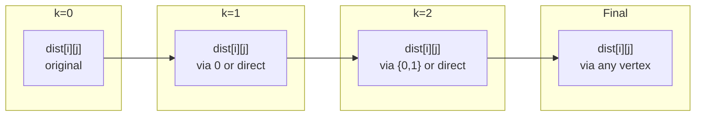

# Floyd-Warshall Algorithm

| Property | Value |
|----------|-------|
| Category | Dynamic Programming |
| Subcategory | Graph/Shortest Paths |
| Complexity (Time) | O(V³) |
| Complexity (Space) | O(V²) |
| Input | Weighted graph |
| Output | All-pairs shortest paths |

## Overview

The **Floyd-Warshall Algorithm** computes shortest paths between all pairs of vertices in a weighted graph. It efficiently handles negative edge weights (but not negative cycles) and is a classic example of dynamic programming on graphs.

## Mathematical Foundation

### Problem Definition

Given a weighted directed graph $G = (V, E)$ with edge weights $w(u, v)$:

Find: $dist[u][v]$ = shortest path distance from $u$ to $v$ for all pairs $(u, v) \in V \times V$

### Key Insight

For any shortest path from $i$ to $j$, either:
1. It doesn't pass through vertex $k$: use best known path $i \to j$
2. It passes through vertex $k$: use path $i \to k \to j$

### Recurrence Relation

Let $dp[k][i][j]$ = shortest path from $i$ to $j$ using only vertices $\{0, 1, ..., k\}$ as intermediate vertices:

$$dp[k][i][j] = \min(dp[k-1][i][j], dp[k-1][i][k] + dp[k-1][k][j])$$

### Space Optimization

Since $dp[k]$ only depends on $dp[k-1]$, we can use a 2D array:

$$dist[i][j] = \min(dist[i][j], dist[i][k] + dist[k][j])$$

### Base Case

$$dist[i][j] = \begin{cases} 
0 & \text{if } i = j \\
w(i,j) & \text{if edge } (i,j) \text{ exists} \\
\infty & \text{otherwise}
\end{cases}$$

## Algorithm

### Floyd-Warshall Pseudocode

```
FLOYD-WARSHALL(W):
    n = number of vertices
    dist = copy of W (adjacency matrix)
    
    // Initialize diagonal to 0
    for i from 0 to n-1:
        dist[i][i] = 0
    
    // Main algorithm
    for k from 0 to n-1:
        for i from 0 to n-1:
            for j from 0 to n-1:
                if dist[i][k] + dist[k][j] < dist[i][j]:
                    dist[i][j] = dist[i][k] + dist[k][j]
    
    return dist
```

### With Path Reconstruction

```
FLOYD-WARSHALL-PATH(W):
    n = number of vertices
    dist = copy of W
    next = matrix of size n×n
    
    // Initialize
    for i from 0 to n-1:
        for j from 0 to n-1:
            if i == j or W[i][j] == infinity:
                next[i][j] = -1
            else:
                next[i][j] = j
    
    // Main algorithm
    for k from 0 to n-1:
        for i from 0 to n-1:
            for j from 0 to n-1:
                if dist[i][k] + dist[k][j] < dist[i][j]:
                    dist[i][j] = dist[i][k] + dist[k][j]
                    next[i][j] = next[i][k]
    
    return dist, next

RECONSTRUCT-PATH(next, i, j):
    if next[i][j] == -1:
        return empty list  // No path
    
    path = [i]
    while i != j:
        i = next[i][j]
        path.append(i)
    
    return path
```

### Detecting Negative Cycles

```
HAS-NEGATIVE-CYCLE(dist):
    n = size of dist
    for i from 0 to n-1:
        if dist[i][i] < 0:
            return True
    return False
```

## Complexity Analysis

| Operation | Time | Space |
|-----------|------|-------|
| Build dist matrix | O(V²) | O(V²) |
| Main loops | O(V³) | O(V²) |
| Path reconstruction | O(V) | O(V) |
| **Total** | **O(V³)** | **O(V²)** |

### Comparison with Other Algorithms

| Algorithm | Use Case | Time | Handles Negative |
|-----------|----------|------|------------------|
| Floyd-Warshall | All pairs | O(V³) | Yes (no neg cycles) |
| Dijkstra × V | All pairs | O(V² log V + VE) | No |
| Bellman-Ford × V | All pairs | O(V²E) | Yes |
| Johnson's | All pairs, sparse | O(V² log V + VE) | Yes |

## Visual Representation

### Algorithm Iteration

```
Initial graph:
    0 → 1 (weight 3)
    0 → 2 (weight 8)
    1 → 2 (weight 2)
    2 → 0 (weight 5)
    2 → 1 (weight 1)

Initial dist matrix:
         0    1    2
    0 [  0    3    8  ]
    1 [  ∞    0    2  ]
    2 [  5    1    0  ]

k=0 (considering vertex 0 as intermediate):
    dist[1][2] = min(2, ∞+8) = 2 (no change)
    dist[2][1] = min(1, 5+3) = 1 (no change)
    
k=1 (considering vertex 1 as intermediate):
    dist[0][2] = min(8, 3+2) = 5 ✓ (improved!)
    dist[2][0] = min(5, 1+∞) = 5 (no change)
    
k=2 (considering vertex 2 as intermediate):
    dist[0][1] = min(3, 5+1) = 3 (no change)
    dist[1][0] = min(∞, 2+5) = 7 ✓ (improved!)

Final dist matrix:
         0    1    2
    0 [  0    3    5  ]
    1 [  7    0    2  ]
    2 [  5    1    0  ]
```

### State Space Visualization



## Implementation (from repository)

```python
import math


class Graph:
    def __init__(self, n=0):  # a graph with Node 0,1,...,N-1
        self.n = n
        self.w = [
            [math.inf for j in range(n)] for i in range(n)
        ]  # adjacency matrix for weight
        self.dp = [
            [math.inf for j in range(n)] for i in range(n)
        ]  # dp[i][j] stores minimum distance from i to j

    def add_edge(self, u, v, w):
        """
        Adds a directed edge from node u
        to node v with weight w.

        >>> g = Graph(3)
        >>> g.add_edge(0, 1, 5)
        >>> g.dp[0][1]
        5
        """
        self.dp[u][v] = w

    def floyd_warshall(self):
        """
        Computes the shortest paths between all pairs of
        nodes using the Floyd-Warshall algorithm.

        >>> g = Graph(3)
        >>> g.add_edge(0, 1, 1)
        >>> g.add_edge(1, 2, 2)
        >>> g.floyd_warshall()
        >>> g.show_min(0, 2)
        3
        >>> g.show_min(2, 0)
        inf
        """
        for k in range(self.n):
            for i in range(self.n):
                for j in range(self.n):
                    self.dp[i][j] = min(self.dp[i][j], self.dp[i][k] + self.dp[k][j])

    def show_min(self, u, v):
        """
        Returns the minimum distance from node u to node v.

        >>> g = Graph(3)
        >>> g.add_edge(0, 1, 3)
        >>> g.add_edge(1, 2, 4)
        >>> g.floyd_warshall()
        >>> g.show_min(0, 2)
        7
        >>> g.show_min(1, 0)
        inf
        """
        return self.dp[u][v]
```

## Real-World Applications

### 1. Network Routing

```python
from typing import List, Dict, Tuple, Optional
import math

class NetworkRouter:
    """
    Network routing using Floyd-Warshall for optimal paths.
    """
    
    def __init__(self, num_routers: int):
        """
        Initialize network with n routers.
        
        >>> router = NetworkRouter(4)
        >>> router.num_routers
        4
        """
        self.num_routers = num_routers
        self.latency = [[math.inf] * num_routers for _ in range(num_routers)]
        self.bandwidth = [[0] * num_routers for _ in range(num_routers)]
        self.next_hop = [[-1] * num_routers for _ in range(num_routers)]
        
        # Initialize self-loops
        for i in range(num_routers):
            self.latency[i][i] = 0
    
    def add_link(
        self, 
        router_a: int, 
        router_b: int, 
        latency_ms: float,
        bandwidth_mbps: float,
        bidirectional: bool = True
    ):
        """
        Add network link between routers.
        
        >>> router = NetworkRouter(3)
        >>> router.add_link(0, 1, 10, 100)
        >>> router.latency[0][1]
        10
        """
        self.latency[router_a][router_b] = latency_ms
        self.bandwidth[router_a][router_b] = bandwidth_mbps
        self.next_hop[router_a][router_b] = router_b
        
        if bidirectional:
            self.latency[router_b][router_a] = latency_ms
            self.bandwidth[router_b][router_a] = bandwidth_mbps
            self.next_hop[router_b][router_a] = router_a
    
    def compute_routing_tables(self):
        """
        Compute optimal routing using Floyd-Warshall.
        
        >>> router = NetworkRouter(3)
        >>> router.add_link(0, 1, 10, 100)
        >>> router.add_link(1, 2, 20, 50)
        >>> router.compute_routing_tables()
        >>> router.latency[0][2]
        30
        """
        n = self.num_routers
        
        for k in range(n):
            for i in range(n):
                for j in range(n):
                    if self.latency[i][k] + self.latency[k][j] < self.latency[i][j]:
                        self.latency[i][j] = self.latency[i][k] + self.latency[k][j]
                        self.next_hop[i][j] = self.next_hop[i][k]
    
    def get_route(self, source: int, dest: int) -> List[int]:
        """
        Get optimal route from source to destination.
        
        >>> router = NetworkRouter(4)
        >>> router.add_link(0, 1, 10, 100)
        >>> router.add_link(1, 2, 5, 100)
        >>> router.add_link(0, 2, 20, 100)
        >>> router.compute_routing_tables()
        >>> router.get_route(0, 2)
        [0, 1, 2]
        """
        if self.next_hop[source][dest] == -1:
            return []  # No path
        
        path = [source]
        current = source
        while current != dest:
            current = self.next_hop[current][dest]
            path.append(current)
        
        return path
    
    def get_routing_table(self, router: int) -> Dict:
        """
        Get routing table for a specific router.
        """
        table = {}
        for dest in range(self.num_routers):
            if dest != router and self.latency[router][dest] < math.inf:
                table[dest] = {
                    'next_hop': self.next_hop[router][dest],
                    'latency': self.latency[router][dest],
                    'path': self.get_route(router, dest)
                }
        return table


def analyze_network_resilience(
    router: NetworkRouter
) -> Dict:
    """
    Analyze network for single points of failure.
    
    >>> net = NetworkRouter(4)
    >>> net.add_link(0, 1, 10, 100)
    >>> net.add_link(1, 2, 10, 100)
    >>> net.add_link(2, 3, 10, 100)
    >>> net.compute_routing_tables()
    >>> result = analyze_network_resilience(net)
    >>> 'critical_nodes' in result
    True
    """
    n = router.num_routers
    
    # Find nodes whose removal disconnects the graph
    critical_nodes = []
    
    for k in range(n):
        # Test connectivity without node k
        reachable = 0
        for i in range(n):
            for j in range(n):
                if i != k and j != k and i != j:
                    if router.latency[i][j] < math.inf:
                        # Check if path goes through k
                        path = router.get_route(i, j)
                        if k not in path:
                            reachable += 1
        
        # If fewer pairs connected, k is critical
        if reachable < (n - 1) * (n - 2):
            critical_nodes.append(k)
    
    return {
        'critical_nodes': critical_nodes,
        'total_nodes': n,
        'resilience_score': 1 - len(critical_nodes) / n
    }
```

### 2. Geographic Distance Services

```python
from typing import List, Dict, Tuple
import math

class DistanceService:
    """
    All-pairs shortest paths for geographic locations.
    """
    
    def __init__(self, locations: List[str]):
        """
        Initialize with location names.
        
        >>> svc = DistanceService(['NYC', 'LA', 'Chicago'])
        >>> svc.num_locations
        3
        """
        self.locations = locations
        self.location_index = {loc: i for i, loc in enumerate(locations)}
        self.num_locations = len(locations)
        
        self.distance = [[math.inf] * self.num_locations 
                        for _ in range(self.num_locations)]
        self.travel_time = [[math.inf] * self.num_locations 
                          for _ in range(self.num_locations)]
        self.next_stop = [[-1] * self.num_locations 
                         for _ in range(self.num_locations)]
        
        for i in range(self.num_locations):
            self.distance[i][i] = 0
            self.travel_time[i][i] = 0
    
    def add_route(
        self, 
        from_loc: str, 
        to_loc: str, 
        distance_km: float,
        time_hours: float
    ):
        """Add route between locations."""
        i = self.location_index[from_loc]
        j = self.location_index[to_loc]
        
        self.distance[i][j] = distance_km
        self.distance[j][i] = distance_km
        self.travel_time[i][j] = time_hours
        self.travel_time[j][i] = time_hours
        self.next_stop[i][j] = j
        self.next_stop[j][i] = i
    
    def compute_all_paths(self, optimize_for: str = 'distance'):
        """
        Compute all shortest paths.
        
        Args:
            optimize_for: 'distance' or 'time'
        """
        n = self.num_locations
        metric = self.distance if optimize_for == 'distance' else self.travel_time
        
        for k in range(n):
            for i in range(n):
                for j in range(n):
                    if metric[i][k] + metric[k][j] < metric[i][j]:
                        metric[i][j] = metric[i][k] + metric[k][j]
                        self.next_stop[i][j] = self.next_stop[i][k]
    
    def get_shortest_path(
        self, 
        from_loc: str, 
        to_loc: str
    ) -> Dict:
        """
        Get shortest path between two locations.
        
        >>> svc = DistanceService(['A', 'B', 'C'])
        >>> svc.add_route('A', 'B', 100, 1)
        >>> svc.add_route('B', 'C', 150, 1.5)
        >>> svc.compute_all_paths()
        >>> result = svc.get_shortest_path('A', 'C')
        >>> result['distance']
        250
        """
        i = self.location_index[from_loc]
        j = self.location_index[to_loc]
        
        if self.next_stop[i][j] == -1:
            return {'error': 'No path found'}
        
        # Reconstruct path
        path = [from_loc]
        current = i
        while current != j:
            current = self.next_stop[current][j]
            path.append(self.locations[current])
        
        return {
            'path': path,
            'distance': self.distance[i][j],
            'travel_time': self.travel_time[i][j],
            'num_stops': len(path) - 1
        }
    
    def find_central_location(self) -> Dict:
        """
        Find location that minimizes total distance to all others.
        
        >>> svc = DistanceService(['A', 'B', 'C'])
        >>> svc.add_route('A', 'B', 100, 1)
        >>> svc.add_route('B', 'C', 100, 1)
        >>> svc.add_route('A', 'C', 200, 2)
        >>> svc.compute_all_paths()
        >>> result = svc.find_central_location()
        >>> result['location']
        'B'
        """
        n = self.num_locations
        min_total = math.inf
        central = -1
        
        for i in range(n):
            total = sum(
                self.distance[i][j] for j in range(n) 
                if self.distance[i][j] < math.inf
            )
            if total < min_total:
                min_total = total
                central = i
        
        return {
            'location': self.locations[central],
            'total_distance': min_total,
            'average_distance': min_total / (n - 1) if n > 1 else 0
        }


def build_travel_matrix(
    cities: List[str],
    routes: List[Tuple[str, str, float, float]]
) -> Dict:
    """
    Build complete travel matrix from partial route data.
    
    >>> cities = ['A', 'B', 'C']
    >>> routes = [('A', 'B', 100, 1), ('B', 'C', 150, 1.5)]
    >>> matrix = build_travel_matrix(cities, routes)
    >>> matrix['A']['C']['distance']
    250
    """
    svc = DistanceService(cities)
    
    for from_loc, to_loc, dist, time in routes:
        svc.add_route(from_loc, to_loc, dist, time)
    
    svc.compute_all_paths()
    
    result = {}
    for from_loc in cities:
        result[from_loc] = {}
        for to_loc in cities:
            if from_loc != to_loc:
                result[from_loc][to_loc] = svc.get_shortest_path(from_loc, to_loc)
    
    return result
```

### 3. Currency Arbitrage Detection

```python
from typing import List, Dict, Tuple, Optional
import math

def detect_arbitrage(
    currencies: List[str],
    exchange_rates: Dict[Tuple[str, str], float]
) -> Optional[List[str]]:
    """
    Detect currency arbitrage opportunity using Floyd-Warshall.
    
    Arbitrage exists if we can convert currency A → B → C → ... → A
    and end up with more than we started.
    
    >>> currencies = ['USD', 'EUR', 'GBP']
    >>> rates = {
    ...     ('USD', 'EUR'): 0.9,
    ...     ('EUR', 'GBP'): 0.8,
    ...     ('GBP', 'USD'): 1.5,  # Creates arbitrage!
    ...     ('EUR', 'USD'): 1.1,
    ...     ('GBP', 'EUR'): 1.2,
    ...     ('USD', 'GBP'): 0.7
    ... }
    >>> result = detect_arbitrage(currencies, rates)
    >>> result is not None  # Arbitrage exists
    True
    """
    n = len(currencies)
    currency_index = {c: i for i, c in enumerate(currencies)}
    
    # Convert to negative log space
    # Maximizing product = minimizing sum of negative logs
    dist = [[math.inf] * n for _ in range(n)]
    next_currency = [[- 1] * n for _ in range(n)]
    
    for i in range(n):
        dist[i][i] = 0
    
    for (from_curr, to_curr), rate in exchange_rates.items():
        i = currency_index[from_curr]
        j = currency_index[to_curr]
        dist[i][j] = -math.log(rate)  # Negative log for minimization
        next_currency[i][j] = j
    
    # Floyd-Warshall
    for k in range(n):
        for i in range(n):
            for j in range(n):
                if dist[i][k] + dist[k][j] < dist[i][j]:
                    dist[i][j] = dist[i][k] + dist[k][j]
                    next_currency[i][j] = next_currency[i][k]
    
    # Check for negative cycles (arbitrage)
    for i in range(n):
        if dist[i][i] < 0:  # Negative cycle found
            # Reconstruct the cycle
            cycle = [currencies[i]]
            current = next_currency[i][i]
            while current != i:
                cycle.append(currencies[current])
                current = next_currency[current][i]
            cycle.append(currencies[i])
            return cycle
    
    return None


def find_best_exchange_path(
    currencies: List[str],
    exchange_rates: Dict[Tuple[str, str], float],
    from_currency: str,
    to_currency: str,
    amount: float
) -> Dict:
    """
    Find best exchange path between two currencies.
    
    >>> currencies = ['USD', 'EUR', 'GBP', 'JPY']
    >>> rates = {
    ...     ('USD', 'EUR'): 0.85, ('EUR', 'USD'): 1.18,
    ...     ('USD', 'GBP'): 0.73, ('GBP', 'USD'): 1.37,
    ...     ('EUR', 'GBP'): 0.86, ('GBP', 'EUR'): 1.16,
    ...     ('USD', 'JPY'): 110, ('JPY', 'USD'): 0.009,
    ...     ('EUR', 'JPY'): 129, ('JPY', 'EUR'): 0.0077
    ... }
    >>> result = find_best_exchange_path(currencies, rates, 'USD', 'JPY', 1000)
    >>> result['final_amount'] > 0
    True
    """
    n = len(currencies)
    currency_index = {c: i for i, c in enumerate(currencies)}
    
    # Use log for numerical stability
    dist = [[float('-inf')] * n for _ in range(n)]
    next_curr = [[-1] * n for _ in range(n)]
    
    for i in range(n):
        dist[i][i] = 0
    
    for (from_c, to_c), rate in exchange_rates.items():
        i = currency_index[from_c]
        j = currency_index[to_c]
        dist[i][j] = math.log(rate)
        next_curr[i][j] = j
    
    # Modified Floyd-Warshall for maximum product
    for k in range(n):
        for i in range(n):
            for j in range(n):
                if dist[i][k] + dist[k][j] > dist[i][j]:
                    dist[i][j] = dist[i][k] + dist[k][j]
                    next_curr[i][j] = next_curr[i][k]
    
    # Get result
    i = currency_index[from_currency]
    j = currency_index[to_currency]
    
    if dist[i][j] == float('-inf'):
        return {'error': 'No exchange path found'}
    
    # Reconstruct path
    path = [from_currency]
    current = i
    while current != j:
        current = next_curr[current][j]
        path.append(currencies[current])
    
    effective_rate = math.exp(dist[i][j])
    
    return {
        'path': path,
        'effective_rate': effective_rate,
        'final_amount': amount * effective_rate,
        'direct_rate': exchange_rates.get((from_currency, to_currency), None)
    }
```

## Variations

### Transitive Closure (Warshall's Algorithm)

```python
def transitive_closure(adj: List[List[bool]]) -> List[List[bool]]:
    """
    Compute transitive closure of a graph.
    
    >>> adj = [[False, True, False], [False, False, True], [False, False, False]]
    >>> tc = transitive_closure(adj)
    >>> tc[0][2]  # Can reach 2 from 0 via 1
    True
    """
    n = len(adj)
    reach = [[adj[i][j] for j in range(n)] for i in range(n)]
    
    for i in range(n):
        reach[i][i] = True
    
    for k in range(n):
        for i in range(n):
            for j in range(n):
                reach[i][j] = reach[i][j] or (reach[i][k] and reach[k][j])
    
    return reach
```

### Widest Path (Maximum Bandwidth)

```python
def widest_paths(bandwidth: List[List[float]]) -> List[List[float]]:
    """
    Find maximum bandwidth paths between all pairs.
    
    >>> bw = [[0, 10, 0], [10, 0, 5], [0, 5, 0]]
    >>> wp = widest_paths(bw)
    >>> wp[0][2]  # Max bandwidth from 0 to 2
    5
    """
    n = len(bandwidth)
    width = [[bandwidth[i][j] for j in range(n)] for i in range(n)]
    
    for k in range(n):
        for i in range(n):
            for j in range(n):
                # Width through k is minimum of two segments
                through_k = min(width[i][k], width[k][j])
                width[i][j] = max(width[i][j], through_k)
    
    return width
```

## Common Pitfalls

1. **Negative cycles**: Check diagonal after algorithm
2. **Initialization**: Set dist[i][i] = 0
3. **Order of loops**: k must be outermost
4. **Overflow**: Check for infinity + positive

## References

- [Floyd-Warshall - Wikipedia](https://en.wikipedia.org/wiki/Floyd%E2%80%93Warshall_algorithm)
- [CLRS - Introduction to Algorithms](https://mitpress.mit.edu/books/introduction-algorithms)
- Floyd, R.W. (1962). "Algorithm 97: Shortest Path"

## See Also

- [Dijkstra's Algorithm](../graphs/dijkstra.md) - Single source shortest path
- [Bellman-Ford](../graphs/bellman_ford.md) - Handles negative edges
- [Johnson's Algorithm](../graphs/johnson.md) - Sparse graphs
