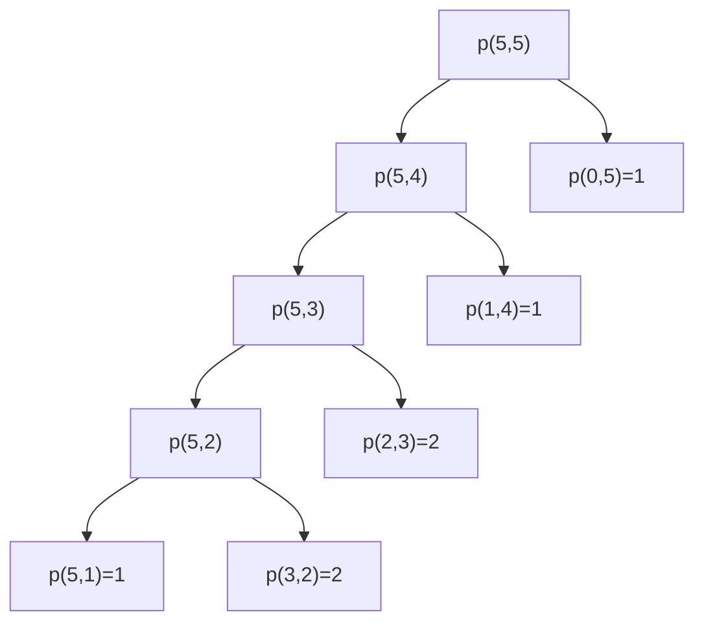

# Integer Partition

| Property | Value |
|----------|-------|
| Category | Dynamic Programming |
| Subcategory | Number Theory/Combinatorics |
| Complexity (Time) | O(n²) |
| Complexity (Space) | O(n²) |
| Input | Positive integer n |
| Output | Number of ways to partition n |

## Overview

The **Integer Partition** problem counts the number of ways to write a positive integer $n$ as a sum of positive integers, where the order doesn't matter. For example, the partitions of 5 are:
- 5
- 4 + 1
- 3 + 2
- 3 + 1 + 1
- 2 + 2 + 1
- 2 + 1 + 1 + 1
- 1 + 1 + 1 + 1 + 1

Thus $p(5) = 7$.

## Mathematical Foundation

### Partition Function

The partition function $p(n)$ counts the number of partitions of $n$.

### Recurrence Relations

**Approach 1**: Partitions with largest part at most $k$

Let $p(n, k)$ = number of partitions of $n$ with parts ≤ $k$:

$$p(n, k) = p(n, k-1) + p(n-k, k)$$

Where:
- $p(n, k-1)$ = partitions not using $k$
- $p(n-k, k)$ = partitions using at least one $k$

**Approach 2**: Partitions with exactly $k$ parts

Let $q(n, k)$ = number of partitions of $n$ into exactly $k$ parts:

$$q(n, k) = q(n-1, k-1) + q(n-k, k)$$

### Base Cases

$$p(0, k) = 1 \quad \text{(empty partition)}$$
$$p(n, 0) = 0 \quad \text{for } n > 0$$
$$p(n, k) = p(n, n) \quad \text{for } k > n$$

### Generating Function

$$\prod_{k=1}^{\infty} \frac{1}{1-x^k} = \sum_{n=0}^{\infty} p(n) x^n$$

### Famous Values

| n | p(n) |
|---|------|
| 1 | 1 |
| 5 | 7 |
| 10 | 42 |
| 50 | 204,226 |
| 100 | 190,569,292 |
| 1000 | 24,061,467,864,032,622,473,692,149,727,991 |

## Algorithm Approaches

### 1. Recursive with Memoization

```
PARTITION-MEMO(n, k, memo):
    if n == 0:
        return 1
    if k == 0:
        return 0
    if k > n:
        return PARTITION-MEMO(n, n, memo)
    
    if (n, k) in memo:
        return memo[(n, k)]
    
    // Don't use k + Use at least one k
    result = PARTITION-MEMO(n, k-1, memo) + PARTITION-MEMO(n-k, k, memo)
    memo[(n, k)] = result
    return result

PARTITION(n):
    return PARTITION-MEMO(n, n, {})
```

### 2. Bottom-Up DP (O(n²) space)

```
PARTITION-DP(n):
    // memo[i][j] = partitions of i with parts ≤ j
    memo = matrix (n+1) × n, all 0
    
    // Base: empty partition
    for j from 0 to n-1:
        memo[0][j] = 1
    
    // Fill table
    for i from 1 to n:
        for j from 1 to n-1:
            // Add partitions not using j+1
            memo[i][j] = memo[i][j-1]
            
            // Add partitions using at least one (j+1)
            if i > j:
                memo[i][j] += memo[i-j-1][j]
    
    return memo[n][n-1]
```

### 3. Space-Optimized (O(n) space)

```
PARTITION-SPACE-OPT(n):
    dp = array of size n+1, all 0
    dp[0] = 1
    
    for k from 1 to n:
        for i from k to n:
            dp[i] += dp[i - k]
    
    return dp[n]
```

### 4. Euler's Pentagonal Number Theorem

```
PARTITION-PENTAGONAL(n):
    // p(n) = p(n-1) + p(n-2) - p(n-5) - p(n-7) + p(n-12) + ...
    // Using generalized pentagonal numbers: k(3k-1)/2 for k = 1,-1,2,-2,...
    
    dp = array of size n+1, all 0
    dp[0] = 1
    
    for i from 1 to n:
        j = 1
        while true:
            // Generalized pentagonal numbers
            pent1 = j * (3*j - 1) / 2
            pent2 = j * (3*j + 1) / 2
            
            if pent1 > i:
                break
            
            sign = 1 if j is odd else -1
            dp[i] += sign * dp[i - pent1]
            
            if pent2 <= i:
                dp[i] += sign * dp[i - pent2]
            
            j += 1
    
    return dp[n]
```

## Complexity Analysis

| Approach | Time | Space | Notes |
|----------|------|-------|-------|
| Recursive | O(n²) | O(n²) | With memoization |
| 2D DP | O(n²) | O(n²) | Standard |
| 1D DP | O(n²) | O(n) | Space optimized |
| Pentagonal | O(n√n) | O(n) | Fastest |

## Visual Representation

### Partitions of 5

```
5         = [5]
4 + 1     = [4, 1]
3 + 2     = [3, 2]
3 + 1 + 1 = [3, 1, 1]
2 + 2 + 1 = [2, 2, 1]
2 + 1 + 1 + 1 = [2, 1, 1, 1]
1 + 1 + 1 + 1 + 1 = [1, 1, 1, 1, 1]

Total: 7 partitions
```

### DP Table (n=5)

```
        k=1   k=2   k=3   k=4   k=5
n=0      1     1     1     1     1
n=1      1     1     1     1     1
n=2      1     2     2     2     2
n=3      1     2     3     3     3
n=4      1     3     4     5     5
n=5      1     3     5     6     7

p(5) = 7
```

### Young Diagrams

```
Partitions of 5 as Young diagrams:

[5]           [4,1]         [3,2]
■ ■ ■ ■ ■     ■ ■ ■ ■       ■ ■ ■
              ■             ■ ■

[3,1,1]       [2,2,1]       [2,1,1,1]     [1,1,1,1,1]
■ ■ ■         ■ ■           ■ ■           ■
■             ■ ■           ■             ■
■             ■             ■             ■
                            ■             ■
                                          ■
```

### Recursion Tree



## Implementation (from repository)

```python
def partition(m: int) -> int:
    """
    >>> partition(5)
    7
    >>> partition(7)
    15
    >>> partition(100)
    190569292
    >>> partition(1_000)
    24061467864032622473692149727991
    >>> partition(-7)
    Traceback (most recent call last):
        ...
    IndexError: list index out of range
    >>> partition(0)
    Traceback (most recent call last):
        ...
    IndexError: list assignment index out of range
    >>> partition(7.8)
    Traceback (most recent call last):
        ...
    TypeError: 'float' object cannot be interpreted as an integer
    """
    memo: list[list[int]] = [[0 for _ in range(m)] for _ in range(m + 1)]
    for i in range(m + 1):
        memo[i][0] = 1

    for n in range(m + 1):
        for k in range(1, m):
            memo[n][k] += memo[n][k - 1]
            if n - k > 0:
                memo[n][k] += memo[n - k - 1][k]

    return memo[m][m - 1]
```

## Real-World Applications

### 1. Resource Allocation

```python
from typing import List, Dict, Tuple

def partition_resources(
    total_amount: int,
    min_allocation: int = 1,
    max_allocations: int = None
) -> Dict:
    """
    Find ways to divide resources among groups.
    
    >>> result = partition_resources(10, min_allocation=2)
    >>> result['count'] > 0
    True
    """
    # Generate partitions with constraints
    partitions = []
    
    def generate(remaining: int, max_part: int, current: List[int]):
        if remaining == 0:
            if max_allocations is None or len(current) <= max_allocations:
                partitions.append(current.copy())
            return
        
        for part in range(min(max_part, remaining), min_allocation - 1, -1):
            if part >= min_allocation:
                current.append(part)
                generate(remaining - part, part, current)
                current.pop()
    
    generate(total_amount, total_amount, [])
    
    return {
        'count': len(partitions),
        'partitions': partitions[:10],  # First 10 examples
        'min_groups': min(len(p) for p in partitions) if partitions else 0,
        'max_groups': max(len(p) for p in partitions) if partitions else 0
    }


def fair_division(
    total: int,
    num_groups: int
) -> List[List[int]]:
    """
    Find ways to divide total into exactly num_groups parts.
    
    >>> divisions = fair_division(10, 3)
    >>> all(sum(d) == 10 and len(d) == 3 for d in divisions)
    True
    """
    result = []
    
    def generate(remaining: int, max_part: int, parts: int, current: List[int]):
        if parts == 0:
            if remaining == 0:
                result.append(current.copy())
            return
        
        for part in range(min(max_part, remaining - parts + 1), 0, -1):
            current.append(part)
            generate(remaining - part, part, parts - 1, current)
            current.pop()
    
    generate(total, total, num_groups, [])
    return result


def budget_scenarios(
    total_budget: int,
    categories: List[str],
    min_per_category: int = 0
) -> List[Dict[str, int]]:
    """
    Generate budget allocation scenarios.
    
    >>> categories = ["Marketing", "Development", "Operations"]
    >>> scenarios = budget_scenarios(10, categories, min_per_category=1)
    >>> all(sum(s.values()) == 10 for s in scenarios)
    True
    """
    n = len(categories)
    adjusted_budget = total_budget - n * min_per_category
    
    if adjusted_budget < 0:
        return []
    
    scenarios = []
    
    def generate(remaining: int, idx: int, current: List[int]):
        if idx == n - 1:
            current.append(remaining + min_per_category)
            scenarios.append(dict(zip(categories, current.copy())))
            current.pop()
            return
        
        for amount in range(remaining + 1):
            current.append(amount + min_per_category)
            generate(remaining - amount, idx + 1, current)
            current.pop()
    
    generate(adjusted_budget, 0, [])
    return scenarios[:100]  # Limit results
```

### 2. Combinatorics and Counting

```python
from typing import Dict, List
from functools import lru_cache

def count_compositions(n: int) -> int:
    """
    Count ordered partitions (compositions) of n.
    Unlike partitions, order matters here.
    
    >>> count_compositions(4)
    8
    """
    # Compositions of n = 2^(n-1)
    return 2 ** (n - 1) if n > 0 else 1


def partitions_with_distinct_parts(n: int) -> int:
    """
    Count partitions where all parts are distinct.
    
    >>> partitions_with_distinct_parts(5)
    3
    """
    # [5], [4,1], [3,2]
    @lru_cache(maxsize=None)
    def count(remaining: int, max_part: int) -> int:
        if remaining == 0:
            return 1
        if remaining < 0 or max_part == 0:
            return 0
        
        # Use max_part or skip it
        return count(remaining - max_part, max_part - 1) + count(remaining, max_part - 1)
    
    return count(n, n)


def partitions_into_odd_parts(n: int) -> int:
    """
    Count partitions using only odd parts.
    
    >>> partitions_into_odd_parts(5)
    3
    """
    # [5], [3,1,1], [1,1,1,1,1]
    # Note: equals partitions with distinct parts (Euler's theorem!)
    @lru_cache(maxsize=None)
    def count(remaining: int, max_odd: int) -> int:
        if remaining == 0:
            return 1
        if remaining < 0 or max_odd < 1:
            return 0
        
        # Use max_odd or try smaller odd
        return count(remaining - max_odd, max_odd) + count(remaining, max_odd - 2)
    
    # Start with largest odd ≤ n
    largest_odd = n if n % 2 == 1 else n - 1
    return count(n, largest_odd)


def partition_statistics(n: int) -> Dict:
    """
    Compute various partition statistics for n.
    
    >>> stats = partition_statistics(10)
    >>> stats['total'] == 42
    True
    """
    all_partitions = []
    
    def generate(remaining: int, max_part: int, current: List[int]):
        if remaining == 0:
            all_partitions.append(current.copy())
            return
        
        for part in range(min(max_part, remaining), 0, -1):
            current.append(part)
            generate(remaining - part, part, current)
            current.pop()
    
    generate(n, n, [])
    
    # Compute statistics
    num_parts = [len(p) for p in all_partitions]
    largest_parts = [p[0] for p in all_partitions]
    
    return {
        'total': len(all_partitions),
        'avg_num_parts': sum(num_parts) / len(num_parts),
        'min_parts': min(num_parts),
        'max_parts': max(num_parts),
        'avg_largest_part': sum(largest_parts) / len(largest_parts),
        'partitions_with_1': sum(1 for p in all_partitions if 1 in p),
        'self_conjugate': sum(1 for p in all_partitions if is_self_conjugate(p))
    }


def is_self_conjugate(partition: List[int]) -> bool:
    """Check if partition equals its conjugate."""
    # Compute conjugate
    if not partition:
        return True
    
    conjugate = []
    for i in range(partition[0]):
        count = sum(1 for p in partition if p > i)
        conjugate.append(count)
    
    return partition == conjugate
```

### 3. Music and Art (Rhythmic Patterns)

```python
from typing import List, Dict

def generate_rhythm_patterns(
    total_beats: int,
    allowed_durations: List[int] = None
) -> List[List[int]]:
    """
    Generate all rhythm patterns for a measure.
    
    >>> patterns = generate_rhythm_patterns(4, [1, 2])
    >>> [1, 1, 1, 1] in patterns
    True
    >>> [2, 2] in patterns
    True
    """
    if allowed_durations is None:
        allowed_durations = [1, 2, 3, 4]  # Common note durations
    
    patterns = []
    
    def generate(remaining: int, current: List[int]):
        if remaining == 0:
            patterns.append(current.copy())
            return
        
        for duration in allowed_durations:
            if duration <= remaining:
                current.append(duration)
                generate(remaining - duration, current)
                current.pop()
    
    generate(total_beats, [])
    return patterns


def polyrhythm_combinations(
    measure_length: int,
    voice_counts: List[int]
) -> Dict:
    """
    Find ways multiple voices can fill a measure with different note counts.
    
    >>> result = polyrhythm_combinations(12, [3, 4])
    >>> 'combinations' in result
    True
    """
    from itertools import product
    
    combinations = []
    
    for voice, count in enumerate(voice_counts):
        # Each voice needs exactly 'count' notes to fill measure_length
        note_duration = measure_length // count
        if note_duration * count != measure_length:
            continue  # Not evenly divisible
        
        # All notes same duration for simplicity
        combinations.append({
            'voice': voice,
            'notes': count,
            'duration_each': note_duration
        })
    
    return {
        'measure_length': measure_length,
        'combinations': combinations
    }


def visual_pattern(partition: List[int], width: int = 40) -> str:
    """
    Create ASCII visualization of a partition.
    
    >>> print(visual_pattern([5, 3, 2]))
    ██████████
    ██████
    ████
    """
    if not partition:
        return ""
    
    max_val = max(partition)
    scale = width / max_val
    
    lines = []
    for part in partition:
        bar_width = int(part * scale)
        lines.append('█' * bar_width)
    
    return '\n'.join(lines)
```

## Variations

### Restricted Partitions

```python
def partition_into_k_parts(n: int, k: int) -> int:
    """
    Count partitions of n into exactly k parts.
    
    >>> partition_into_k_parts(5, 2)
    2
    """
    # [4,1], [3,2]
    @lru_cache(maxsize=None)
    def count(remaining: int, parts: int, max_part: int) -> int:
        if parts == 0:
            return 1 if remaining == 0 else 0
        if remaining < parts:  # Need at least 1 per part
            return 0
        
        total = 0
        for part in range(min(max_part, remaining - parts + 1), 0, -1):
            total += count(remaining - part, parts - 1, part)
        
        return total
    
    return count(n, k, n)
```

### Partitions with Minimum Part

```python
def partition_min_part(n: int, min_part: int) -> int:
    """
    Count partitions where smallest part ≥ min_part.
    
    >>> partition_min_part(6, 2)
    4
    """
    # [6], [4,2], [3,3], [2,2,2]
    @lru_cache(maxsize=None)
    def count(remaining: int, max_part: int) -> int:
        if remaining == 0:
            return 1
        if remaining < min_part:
            return 0
        
        total = 0
        for part in range(min(max_part, remaining), min_part - 1, -1):
            total += count(remaining - part, part)
        
        return total
    
    return count(n, n)
```

## Common Pitfalls

1. **Order matters**: Partitions are unordered; compositions are ordered
2. **Zero partition**: p(0) = 1 (empty partition)
3. **Negative numbers**: Not defined for negative integers
4. **Large numbers**: Use arbitrary precision arithmetic

## References

- [Integer Partition - Wikipedia](https://en.wikipedia.org/wiki/Partition_(number_theory))
- [OEIS A000041](https://oeis.org/A000041) - Partition function values
- [Euler's Pentagonal Number Theorem](https://en.wikipedia.org/wiki/Pentagonal_number_theorem)

## See Also

- [Combination Sum](combination_sum_iv.md) - Ordered combinations
- [Coin Change](minimum_coin_change.md) - Similar recurrence
- [Catalan Numbers](catalan_numbers.md) - Related counting problems
